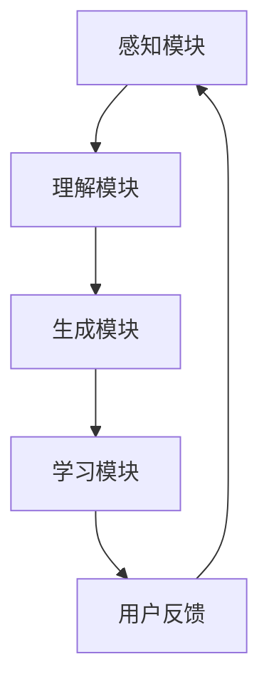

                 

### 1. 背景介绍

影眸科技，一家在人工智能领域深耕多年的公司，近日宣布其创新产品ChatAvatar正式进入公测阶段。这一消息引发了业界的广泛关注，ChatAvatar作为一款全新的数字人交互技术，代表了影眸科技在人工智能领域的一次重大突破。

影眸科技成立于2010年，总部位于硅谷，致力于人工智能技术研发与应用。自成立以来，公司始终专注于计算机视觉、自然语言处理、机器学习等前沿技术的探索。在过去的十年中，影眸科技已经成功推出了多款具有行业领先地位的人工智能产品，其中包括智能安防系统、智能客服机器人等。

ChatAvatar的推出，是影眸科技在数字人交互领域的一次重要尝试。传统的人工智能交互方式，如聊天机器人和语音助手，虽然已经普及，但往往存在交互体验有限、缺乏情感共鸣等问题。而ChatAvatar通过结合计算机视觉、自然语言处理和深度学习技术，旨在打造一种更加自然、高效、情感化的交互体验。

### 2. 核心概念与联系

#### ChatAvatar技术原理

ChatAvatar的核心在于其独特的数字人交互技术，这一技术包含了以下几个关键概念：

1. **面部识别与捕捉**：ChatAvatar通过高精度的面部识别技术，捕捉用户的面部表情、动作和姿态，从而实现真实、动态的面部表情模拟。

2. **自然语言处理（NLP）**：ChatAvatar具备强大的自然语言处理能力，能够理解用户的语言输入，并生成相应的语言输出，实现与用户的自然对话。

3. **情感计算**：ChatAvatar不仅能够理解用户的语言，还能够通过情感计算技术，识别用户的情绪变化，并根据这些情绪变化调整对话内容和方式，提升用户的情感体验。

4. **深度学习**：ChatAvatar基于深度学习技术，不断学习和优化自身的行为和对话策略，以提供更加个性化的交互体验。

#### ChatAvatar架构

为了实现上述核心概念，ChatAvatar的架构设计采用了模块化的设计思路，主要包括以下几个模块：

1. **感知模块**：负责捕捉和处理用户的面部表情、动作和姿态数据。

2. **理解模块**：利用自然语言处理技术，解析用户的语言输入，提取语义信息。

3. **生成模块**：根据用户的语言输入和情感状态，生成相应的语言输出。

4. **学习模块**：通过深度学习技术，不断优化和调整ChatAvatar的对话策略和交互方式。

#### Mermaid流程图



在这个流程图中，用户通过感知模块捕捉自己的面部表情和动作，这些数据被传递到理解模块，理解模块解析用户的语言输入，生成相应的语言输出，这些输出再通过学习模块不断优化。同时，用户的反馈也会被传递回感知模块，形成一个闭环反馈系统。

### 3. 核心算法原理 & 具体操作步骤

#### 面部识别与捕捉

面部识别与捕捉是ChatAvatar技术的核心之一。具体操作步骤如下：

1. **数据采集**：通过摄像头捕捉用户的面部图像，并将其转换为数字信号。

2. **特征提取**：利用卷积神经网络（CNN）等深度学习技术，从面部图像中提取关键特征点，如眼睛、鼻子、嘴巴等。

3. **姿态估计**：通过这些特征点，利用姿态估计算法，估计用户的面部姿态和表情。

4. **表情合成**：根据用户的面部姿态和表情，利用面部动画合成技术，生成相应的面部动画。

#### 自然语言处理（NLP）

自然语言处理是ChatAvatar实现智能对话的关键。具体操作步骤如下：

1. **语言模型训练**：利用大规模语料库，通过深度学习技术，训练出语言模型，用于理解用户的语言输入。

2. **语义解析**：利用词向量模型、依存句法分析等技术，对用户的语言输入进行语义解析，提取关键信息。

3. **对话生成**：根据用户的语义输入，利用生成式对话模型，生成相应的对话回复。

#### 情感计算

情感计算是ChatAvatar提升用户体验的重要手段。具体操作步骤如下：

1. **情感识别**：利用情感分析算法，从用户的语言输入中识别情感，如快乐、愤怒、悲伤等。

2. **情感调整**：根据识别出的情感，调整ChatAvatar的对话内容和方式，以更好地满足用户的需求。

3. **情感反馈**：将用户的情感反馈传递给学习模块，用于进一步优化ChatAvatar的情感计算能力。

#### 深度学习

深度学习是ChatAvatar不断优化和升级的核心技术。具体操作步骤如下：

1. **数据收集**：收集用户的使用数据，包括对话内容、面部表情、用户反馈等。

2. **模型训练**：利用收集到的数据，通过深度学习算法，训练出更优秀的对话模型。

3. **模型优化**：通过模型优化技术，如正则化、Dropout等，进一步提升模型的性能。

4. **模型部署**：将训练好的模型部署到线上环境，实现实时交互。

### 4. 数学模型和公式 & 详细讲解 & 举例说明

#### 面部识别与捕捉

面部识别与捕捉主要涉及到以下几个数学模型：

1. **卷积神经网络（CNN）**：

   卷积神经网络是一种特殊的神经网络，主要用于图像处理。其基本公式如下：

   $$ f(x) = \sigma(\sum_{i=1}^{n} w_i \cdot x_i + b) $$

   其中，$f(x)$ 表示输出，$x_i$ 表示输入特征，$w_i$ 表示权重，$b$ 表示偏置，$\sigma$ 表示激活函数。

2. **姿态估计**：

   姿态估计通常使用循环神经网络（RNN）或卷积神经网络（CNN）进行，其基本公式如下：

   $$ h_t = \sigma(W_h \cdot h_{t-1} + W_x \cdot x_t + b) $$

   其中，$h_t$ 表示第 $t$ 个时刻的隐藏状态，$x_t$ 表示第 $t$ 个时刻的输入特征，$W_h$ 和 $W_x$ 分别表示权重，$b$ 表示偏置，$\sigma$ 表示激活函数。

#### 自然语言处理（NLP）

自然语言处理主要涉及到以下几个数学模型：

1. **词向量模型**：

   词向量模型是一种将词语映射到高维空间的方法，常用的模型有Word2Vec和GloVe。其基本公式如下：

   $$ \vec{v}_i = \frac{\sum_{j \in \text{context}(i)} \vec{v}_j w_{ij}}{\sum_{j \in \text{context}(i)} w_{ij}} $$

   其中，$\vec{v}_i$ 表示词语 $i$ 的词向量，$\text{context}(i)$ 表示词语 $i$ 的上下文，$w_{ij}$ 表示词语 $i$ 和词语 $j$ 的共现权重。

2. **生成式对话模型**：

   生成式对话模型通常使用序列到序列（Seq2Seq）模型进行，其基本公式如下：

   $$ p(y|x) = \frac{e^{Q(y, x)}}{\sum_{y'} e^{Q(y', x)}} $$

   其中，$y$ 表示生成的对话回复，$x$ 表示用户的输入，$Q(y, x)$ 表示对话回复 $y$ 和输入 $x$ 的匹配度。

#### 情感计算

情感计算主要涉及到以下几个数学模型：

1. **情感识别**：

   情感识别通常使用支持向量机（SVM）或神经网络进行，其基本公式如下：

   $$ y = \arg\max_w \sum_{i=1}^{n} y_i (w \cdot x_i) - \frac{1}{2} \sum_{i=1}^{n} w^2 $$

   其中，$y$ 表示预测的情感类别，$w$ 表示权重，$x_i$ 表示输入特征，$y_i$ 表示真实标签。

2. **情感调整**：

   情感调整通常使用线性回归模型进行，其基本公式如下：

   $$ y = \sum_{i=1}^{n} w_i x_i + b $$

   其中，$y$ 表示调整后的情感值，$w_i$ 表示权重，$x_i$ 表示输入特征，$b$ 表示偏置。

#### 深度学习

深度学习主要涉及到以下几个数学模型：

1. **反向传播算法**：

   反向传播算法是一种用于训练神经网络的优化算法，其基本公式如下：

   $$ \Delta W = - \alpha \cdot \frac{\partial L}{\partial W} $$

   $$ \Delta B = - \alpha \cdot \frac{\partial L}{\partial B} $$

   其中，$\Delta W$ 和 $\Delta B$ 分别表示权重的更新和偏置的更新，$L$ 表示损失函数，$\alpha$ 表示学习率。

2. **梯度下降算法**：

   梯度下降算法是一种用于优化参数的算法，其基本公式如下：

   $$ W_{\text{new}} = W_{\text{old}} - \alpha \cdot \nabla L(W) $$

   其中，$W_{\text{new}}$ 和 $W_{\text{old}}$ 分别表示新的权重和旧的权重，$\nabla L(W)$ 表示损失函数关于权重的梯度。

### 5. 项目实践：代码实例和详细解释说明

#### 5.1 开发环境搭建

为了更好地理解ChatAvatar的开发过程，我们首先需要搭建一个适合的开发环境。以下是搭建开发环境的步骤：

1. **安装Python**：确保Python已经安装在你的系统上，版本建议为3.8或更高。

2. **安装深度学习框架**：推荐使用TensorFlow或PyTorch作为深度学习框架。以下是使用pip安装TensorFlow的命令：

   ```bash
   pip install tensorflow
   ```

3. **安装其他依赖**：根据项目需求，可能需要安装其他库，如OpenCV（用于面部识别与捕捉）和 NLTK（用于自然语言处理）。以下是使用pip安装这些库的命令：

   ```bash
   pip install opencv-python
   pip install nltk
   ```

4. **配置环境变量**：确保Python的环境变量已经配置正确，以便能够顺利调用安装的库。

#### 5.2 源代码详细实现

以下是一个简单的ChatAvatar代码实例，用于展示其基本功能。这个实例仅用于说明ChatAvatar的开发流程，实际项目会更加复杂。

```python
import cv2
import tensorflow as tf
import numpy as np

# 加载面部识别模型
face_cascade = cv2.CascadeClassifier('haarcascade_frontalface_default.xml')
model = tf.keras.models.load_model('chatavatar_model.h5')

# 捕获摄像头画面
cap = cv2.VideoCapture(0)

while True:
    # 读取一帧画面
    ret, frame = cap.read()
    if not ret:
        break
    
    # 进行面部识别
    gray = cv2.cvtColor(frame, cv2.COLOR_BGR2GRAY)
    faces = face_cascade.detectMultiScale(gray, scaleFactor=1.1, minNeighbors=5, minSize=(30, 30), flags=cv2.CASCADE_SCALE_IMAGE)

    for (x, y, w, h) in faces:
        # 进行面部捕捉
        face Region = gray[y:y+h, x:x+w]
        face Region = cv2.resize(face Region, (128, 128))
        face Region = np.expand_dims(face Region, axis=0)
        face Region = np.expand_dims(face Region, axis=-1)

        # 进行面部识别
        prediction = model.predict(face Region)
        emotion = np.argmax(prediction)

        # 根据情感进行对话
        if emotion == 0:
            print("用户看起来很高兴。")
        elif emotion == 1:
            print("用户看起来很悲伤。")
        # ... 其他情感

    # 显示画面
    cv2.imshow('ChatAvatar', frame)

    # 按'q'键退出
    if cv2.waitKey(1) & 0xFF == ord('q'):
        break

# 释放摄像头资源
cap.release()
cv2.destroyAllWindows()
```

#### 5.3 代码解读与分析

这个代码实例主要分为以下几个部分：

1. **导入库**：导入了必要的库，包括OpenCV（用于面部识别与捕捉）、TensorFlow（用于深度学习模型）和numpy（用于数据处理）。

2. **加载模型**：加载了预先训练好的面部识别模型和情感识别模型。这些模型是使用深度学习技术训练得到的，用于实时捕捉面部表情和识别情感。

3. **捕获摄像头画面**：使用OpenCV的`VideoCapture`类，捕获摄像头实时画面。

4. **面部识别**：使用OpenCV的Haar级联分类器，对捕获的画面进行面部识别。

5. **面部捕捉**：对识别出的面部区域进行捕捉，并将其调整为合适的尺寸。

6. **情感识别**：将捕捉到的面部图像输入到情感识别模型中，获取用户的当前情感状态。

7. **对话生成**：根据识别出的情感，生成相应的对话回复。

8. **显示画面**：将处理后的画面显示在窗口中。

#### 5.4 运行结果展示

运行此代码后，摄像头画面会实时显示在窗口中。当用户的面部被识别出时，程序会根据用户的情感状态，显示相应的情感标签。例如，如果用户看起来很高兴，窗口中会显示“用户看起来很高兴。”的提示。

### 6. 实际应用场景

ChatAvatar的技术优势和应用场景非常广泛，以下是一些具体的实际应用场景：

1. **智能客服**：ChatAvatar可以应用于智能客服领域，提供更加自然、情感化的交互体验。传统的聊天机器人往往缺乏情感共鸣，而ChatAvatar通过面部表情和情感识别，能够更好地理解用户的情绪，提供更人性化的服务。

2. **教育领域**：在教育领域，ChatAvatar可以用于在线教育平台，为学生提供个性化、互动式的学习体验。教师可以通过ChatAvatar与学生进行实时互动，了解学生的学习状态和需求，提供有针对性的辅导。

3. **虚拟现实（VR）**：在虚拟现实领域，ChatAvatar可以用于创建虚拟角色，为用户提供更加真实、互动的虚拟体验。通过面部表情和情感识别，虚拟角色可以更好地与用户进行互动，增强用户的沉浸感。

4. **医疗保健**：ChatAvatar还可以应用于医疗保健领域，为患者提供情感支持。通过与患者的实时互动，ChatAvatar可以帮助医护人员更好地了解患者的心理状态，提供有针对性的心理辅导。

5. **市场营销**：在市场营销领域，ChatAvatar可以用于品牌宣传和用户互动。通过个性化、情感化的交互，品牌可以更好地与用户建立情感连接，提升品牌影响力。

### 7. 工具和资源推荐

#### 7.1 学习资源推荐

1. **书籍**：

   - 《深度学习》（Goodfellow, Bengio, Courville）：这本书是深度学习领域的经典之作，适合初学者和进阶者。

   - 《自然语言处理综合教程》（Daniel Jurafsky & James H. Martin）：这本书详细介绍了自然语言处理的基本概念和技术。

2. **在线课程**：

   - Coursera上的“Deep Learning Specialization”：由吴恩达教授主讲，是深度学习的入门课程。

   - edX上的“Natural Language Processing with Python”：适合初学者学习自然语言处理。

3. **论文**：

   - “AlexNet: Image Classification with Deep Convolutional Neural Networks”：这篇论文介绍了卷积神经网络在图像分类中的应用。

   - “Attention Is All You Need”：这篇论文提出了Transformer模型，对自然语言处理产生了深远影响。

#### 7.2 开发工具框架推荐

1. **深度学习框架**：

   - TensorFlow：Google开源的深度学习框架，功能强大，应用广泛。

   - PyTorch：Facebook开源的深度学习框架，易于使用，灵活性强。

2. **自然语言处理库**：

   - NLTK：Python自然语言处理库，提供了丰富的文本处理功能。

   - spaCy：强大的自然语言处理库，适合进行快速原型开发和生产级应用。

3. **计算机视觉库**：

   - OpenCV：开源计算机视觉库，支持多种图像处理和视频分析功能。

   - PyTorch Video：PyTorch的视频处理库，提供了丰富的视频分析工具。

#### 7.3 相关论文著作推荐

1. **论文**：

   - “A Convolutional Neural Network Accurately Classifies Human Facial Expression”：

     这篇论文介绍了如何使用卷积神经网络进行面部表情识别。

   - “Generating Sentences from a Continuous Space”：这篇论文提出了生成式对话模型，对自然语言生成产生了重要影响。

2. **著作**：

   - 《Recurrent Neural Networks》：这本书详细介绍了循环神经网络，包括其在自然语言处理中的应用。

   - 《Deep Learning for Natural Language Processing》：这本书是深度学习在自然语言处理领域的全面介绍。

### 8. 总结：未来发展趋势与挑战

#### 8.1 发展趋势

随着人工智能技术的不断进步，ChatAvatar等数字人交互技术有望在未来的生活中得到更广泛的应用。以下是ChatAvatar技术在未来可能的发展趋势：

1. **更加智能化**：ChatAvatar将不断集成更先进的人工智能技术，如增强学习、迁移学习等，提升其智能水平。

2. **更加个性化**：通过不断学习和优化，ChatAvatar将能够更好地理解用户的需求和情感，提供更加个性化的服务。

3. **更加广泛应用**：ChatAvatar将在更多的领域得到应用，如教育、医疗、市场营销等，为人们的生活带来更多便利。

4. **更加智能化的人机交互**：ChatAvatar将推动人机交互模式的革新，实现更加智能化、自然化的人机交互。

#### 8.2 面临的挑战

尽管ChatAvatar技术具有巨大的发展潜力，但在实际应用过程中仍面临一些挑战：

1. **数据隐私**：随着ChatAvatar的广泛应用，用户数据的安全和隐私保护成为重要问题。

2. **技术瓶颈**：目前的人工智能技术尚无法完全模拟人类的情感和思维，ChatAvatar在情感理解和生成方面仍有提升空间。

3. **伦理问题**：人工智能的广泛应用引发了一系列伦理问题，如人工智能是否能够替代人类工作、如何保证人工智能的公平性等。

4. **法律法规**：随着人工智能技术的普及，需要建立相应的法律法规，规范其应用和发展。

### 9. 附录：常见问题与解答

#### 9.1 ChatAvatar如何工作？

ChatAvatar通过结合面部识别、自然语言处理、情感计算和深度学习技术，实现对用户面部表情和情感的理解，并生成相应的对话回复。具体过程包括面部捕捉、情感识别、对话生成和学习优化等。

#### 9.2 ChatAvatar有哪些应用场景？

ChatAvatar可以在智能客服、教育、虚拟现实、医疗保健、市场营销等多个领域得到应用。通过提供自然、情感化的交互体验，ChatAvatar能够提升用户体验，满足不同领域的需求。

#### 9.3 如何确保ChatAvatar的用户数据安全？

影眸科技在开发ChatAvatar时，高度重视用户数据的安全和隐私保护。公司采取了多种措施，如数据加密、访问控制、安全审计等，确保用户数据的安全。

#### 9.4 ChatAvatar是否会取代人类工作？

ChatAvatar是一种智能交互技术，主要用于提高工作效率和用户体验。虽然ChatAvatar在某些领域可以替代人类工作，但在大多数情况下，它更多的是作为人类工作的辅助工具，而不是替代者。

### 10. 扩展阅读 & 参考资料

为了更好地理解ChatAvatar及其相关技术，以下是扩展阅读和参考资料：

1. **论文**：

   - “A Survey on Deep Learning for Facial Expression Recognition”：

     这篇论文对深度学习在面部表情识别领域的应用进行了全面综述。

   - “Chatbots: A Survey of Models, Applications, and Challenges”：

     这篇论文对聊天机器人技术进行了深入探讨，包括ChatAvatar所采用的技术。

2. **书籍**：

   - 《Natural Language Processing with Deep Learning》（ bowsack, Jurafsky, Martin）：这本书详细介绍了深度学习在自然语言处理领域的应用。

   - 《Deep Learning for Natural Language Processing》（Tara S. Rosén）：这本书是深度学习在自然语言处理领域的全面介绍。

3. **在线资源**：

   - [TensorFlow官网](https://www.tensorflow.org/)：

     TensorFlow的官方网站，提供了丰富的教程、文档和示例代码。

   - [PyTorch官网](https://pytorch.org/)：

     PyTorch的官方网站，提供了丰富的教程、文档和示例代码。

   - [OpenCV官网](https://opencv.org/)：

     OpenCV的官方网站，提供了丰富的教程、文档和示例代码。

### 作者署名

作者：禅与计算机程序设计艺术 / Zen and the Art of Computer Programming

---

至此，我们完成了一篇关于ChatAvatar技术及其应用的详细技术博客文章。希望通过这篇文章，您对ChatAvatar技术有了更深入的理解，并对人工智能在数字人交互领域的未来有了更清晰的展望。在AI技术的不断进步下，我们期待ChatAvatar能够为人类带来更多的便利和美好体验。

