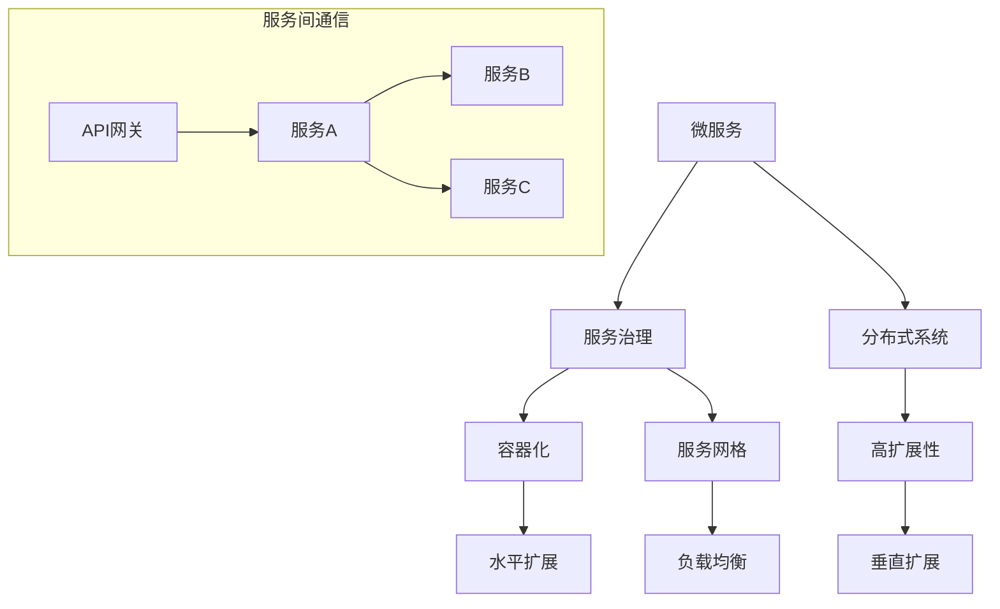

                 

### 1. 背景介绍

在当今的数字化时代，随着互联网、云计算、大数据等技术的飞速发展，企业面临着日益复杂和多样化的业务需求。为了应对这些挑战，微服务架构（Microservices Architecture）应运而生。微服务架构的核心思想是将大型单体应用程序拆分成一组小而独立的微服务，每个微服务负责一个特定的业务功能。这种架构风格使得系统更加灵活、可扩展，并且能够更好地应对快速变化的市场需求。

高扩展性（High Scalability）是现代企业系统设计的关键目标之一。高扩展性指的是系统能够在用户量、数据量或处理能力增加的情况下，保持性能和稳定性的能力。实现高扩展性不仅能够提升用户体验，还能为企业带来更高效的管理和运营。在微服务架构中，实现高扩展性尤为重要，因为微服务的分布式特性使得系统的扩展和优化更加复杂。

微服务架构的优势在于其松耦合、模块化和可重用性。通过将应用程序拆分成小的、独立的组件，开发团队可以更灵活地开发和部署新的功能，同时减少系统间的依赖，从而提高系统的可靠性和维护性。此外，微服务架构还支持水平扩展，即通过增加服务器数量来提高系统的处理能力。这种方式不仅能够有效地分配资源，还能降低单个服务器的负载，从而提高系统的性能和稳定性。

然而，微服务架构并非没有挑战。分布式系统中的网络延迟、数据一致性和安全性等问题，都需要进行仔细的设计和管理。此外，随着服务数量的增加，系统的监控、管理和运维也会变得更加复杂。因此，在实际应用中，如何有效地利用微服务架构实现高扩展性，成为了许多企业需要面对的重要课题。

本文将围绕微服务架构在高扩展性中的应用，首先介绍其核心概念和基本原理，然后详细探讨实现高扩展性的具体方法和技术，并通过实际案例进行分析和总结。希望通过本文的探讨，能够为读者提供一些有价值的参考和启示。

#### 1.1 微服务架构的定义和特点

微服务架构（Microservices Architecture）是一种基于模块化和分布式的设计模式，其核心思想是将一个复杂的大型应用程序拆分成多个小的、独立的微服务。每个微服务负责一个特定的业务功能，这些功能通过轻量级的通信机制进行交互，共同构成一个完整的业务系统。

微服务架构与传统单体架构（Monolithic Architecture）有着显著的不同。在单体架构中，整个应用程序是一个庞大的、紧密耦合的单一实体，所有功能模块都集成在一个应用程序中。这种架构风格在早期软件开发中非常常见，但随着应用规模的不断扩大和业务需求的日益复杂，单体架构逐渐暴露出许多弊端。例如，单体应用程序的升级和维护变得异常困难，任何一个模块的变更都可能影响到整个系统，导致系统的稳定性和可靠性下降。

相比之下，微服务架构具有以下几个显著特点：

1. **独立性**：每个微服务都是独立的，可以单独开发和部署。这使得开发团队可以更灵活地进行功能迭代和优化，而不必担心对其他模块的影响。此外，独立的微服务还使得系统的部署更加灵活，可以通过不同的基础设施进行部署，从而提高系统的可靠性和容错能力。

2. **分布式**：微服务架构是基于分布式系统的设计。各个微服务通常运行在不同的服务器上，通过RESTful API或其他轻量级通信机制进行交互。这种分布式特性不仅提高了系统的可扩展性，还能在某个服务出现问题时，通过其他服务的备份和恢复机制，确保系统的稳定性。

3. **模块化**：微服务架构将应用程序拆分成多个小的、模块化的服务，每个服务都负责一个特定的业务功能。这种模块化设计使得系统更加灵活和可重用，同时也有助于提高代码的可读性和可维护性。

4. **可重用性**：由于微服务是独立的，因此可以方便地重用。例如，某个服务可能在多个业务场景中都有用到，将其独立出来作为一个微服务，不仅可以避免重复开发，还能提高代码的复用率和系统的整体效率。

5. **高扩展性**：微服务架构天然支持水平扩展。通过增加服务器数量，可以轻松提高系统的处理能力。这种方式不仅能够有效分配资源，还能降低单个服务器的负载，从而提高系统的性能和稳定性。

#### 1.2 高扩展性的定义和重要性

高扩展性（High Scalability）指的是系统能够在用户量、数据量或处理能力增加的情况下，保持性能和稳定性的能力。具体来说，高扩展性包括两个方面：水平扩展（Horizontal Scaling）和垂直扩展（Vertical Scaling）。

- **水平扩展**：通过增加服务器数量来提高系统的处理能力。这种方式不仅能够提高系统的吞吐量和响应速度，还能有效分配资源，降低单个服务器的负载。例如，在微服务架构中，可以通过增加服务器的数量来提高系统的处理能力。

- **垂直扩展**：通过增加服务器的硬件配置（如CPU、内存、存储等）来提高系统的处理能力。这种方式通常适用于需要处理大量数据或高并发场景。然而，垂直扩展的代价较高，且硬件升级后的系统能力提升有限。

高扩展性对于现代企业系统的重要性体现在以下几个方面：

1. **用户体验**：高扩展性能够确保系统在用户量增加的情况下，仍然能够保持良好的性能和响应速度，从而提升用户体验。这对于电子商务、在线教育、社交媒体等依赖用户规模和活跃度的行业尤为重要。

2. **业务连续性**：高扩展性系统能够在面临突发流量或故障时，保持业务的连续性。例如，在“双十一”等电商促销活动中，系统需要能够应对短时间内激增的流量，确保用户订单处理的顺利进行。

3. **资源优化**：高扩展性系统可以根据业务需求动态调整资源分配，从而实现资源的最优利用。例如，在淡季时，可以减少服务器的数量，降低运营成本；在高峰期时，可以增加服务器，提高系统的处理能力。

4. **成本控制**：通过水平扩展，企业可以在不需要大规模硬件投资的情况下，提高系统的处理能力。这种方式不仅能够降低初期投入，还能通过按需分配资源，实现成本的最优控制。

总之，高扩展性是现代企业系统设计的关键目标之一。它不仅能够提升用户体验和业务连续性，还能优化资源利用和控制成本，从而为企业的长远发展提供有力支撑。

### 2. 核心概念与联系

在深入探讨微服务架构在高扩展性中的应用之前，有必要明确一些核心概念，并展示这些概念之间的联系。以下是微服务架构中一些关键概念的定义及其相互关系，同时，我们将通过Mermaid流程图来可视化这些关系。

#### 2.1 关键概念定义

1. **微服务（Microservice）**：微服务是一个独立的、可重用的软件组件，负责实现应用程序中的一个特定业务功能。微服务通常采用轻量级通信机制（如RESTful API或gRPC）进行交互。

2. **服务治理（Service Governance）**：服务治理是确保微服务之间协调和一致性的过程。这包括服务注册与发现、服务监控、负载均衡、故障转移等。

3. **分布式系统（Distributed System）**：分布式系统是由多个独立节点组成的系统，这些节点通过通信网络相互连接，共同完成任务。分布式系统具有较高的可用性和可扩展性。

4. **容器化（Containerization）**：容器化是将应用程序及其依赖打包成一个独立的容器，可以在任何支持容器引擎的系统中运行。容器化使得微服务的部署、升级和扩展更加灵活。

5. **服务网格（Service Mesh）**：服务网格是一种基础设施层的服务，主要负责微服务之间的通信管理。服务网格提供了负载均衡、断路器、服务发现、加密通信等功能。

#### 2.2 Mermaid 流程图

以下是一个Mermaid流程图，展示了微服务架构中关键概念之间的联系：



- **服务治理**（B）：服务治理是微服务架构的核心概念，负责管理微服务的注册与发现、监控和负载均衡等。服务治理确保了各个微服务之间能够高效、可靠地交互。

- **微服务**（A）：微服务是独立的软件组件，每个微服务负责一个特定的业务功能。微服务通过API网关（J）与服务治理（B）进行交互。

- **分布式系统**（C）：分布式系统由多个独立节点组成，这些节点通过通信网络（如API网关）相互连接。分布式系统的设计使得微服务架构具有高扩展性和高可用性。

- **容器化**（D）：容器化技术使得微服务可以在不同的环境中快速部署和扩展。容器化（D）支持水平扩展（G）和垂直扩展（I）。

- **服务网格**（E）：服务网格（E）提供了一种统一的管理方式，负责微服务之间的通信安全、流量管理和故障恢复。

- **高扩展性**（F）：高扩展性是分布式系统的重要特性，包括水平扩展（G）和垂直扩展（I）。高扩展性确保系统能够在用户量和数据处理量增加时保持性能和稳定性。

- **API网关**（J）：API网关是微服务架构中的入口，负责处理外部请求，并将请求路由到相应的微服务。API网关（J）与服务治理（B）和微服务（A）之间有着紧密的关联。

通过这个Mermaid流程图，我们可以清晰地看到微服务架构中各个核心概念之间的关系，以及它们如何共同协作，实现高扩展性的目标。

### 3. 核心算法原理 & 具体操作步骤

在微服务架构中，实现高扩展性需要依赖于一系列核心算法和策略。以下将详细介绍这些核心算法的原理，以及具体的操作步骤。

#### 3.1 负载均衡算法

负载均衡（Load Balancing）是确保系统在高并发场景下能够稳定运行的关键技术。负载均衡算法的主要目的是将请求均匀地分配到多个服务器上，以避免单点过载。常见的负载均衡算法包括以下几种：

1. **轮询算法（Round Robin）**：这是最简单的负载均衡算法，将请求依次分配到各个服务器。轮询算法公平简单，但无法根据服务器负载情况进行动态调整。

2. **加权轮询算法（Weighted Round Robin）**：在轮询算法的基础上，为每个服务器分配不同的权重。权重较高的服务器会获得更多的请求，从而实现负载的动态调整。

3. **最少连接算法（Least Connections）**：根据当前服务器的连接数，将请求分配到连接数最少的服务器。这种方式能够更合理地分配负载，但实现较为复杂。

4. **最小响应时间算法（Least Response Time）**：根据当前服务器的响应时间，将请求分配到响应时间最短的服务器。这种方式能够进一步提升用户体验，但需要对服务器状态进行实时监控。

具体操作步骤：

- 在微服务架构中，通常使用负载均衡器（如Nginx、HAProxy等）来实现负载均衡。
- 配置负载均衡器，选择合适的负载均衡算法。
- 监控服务器的负载状态，根据实际情况动态调整负载均衡策略。

#### 3.2 柔性扩展策略

柔性扩展（Elastic Scaling）是微服务架构实现高扩展性的关键策略之一。柔性扩展通过自动调整服务器的数量和资源，以适应动态变化的负载需求。常见的柔性扩展策略包括以下几种：

1. **自动扩展（Auto Scaling）**：自动扩展是指系统根据实际负载情况，自动调整服务器数量。当负载增加时，系统会自动添加服务器；当负载减少时，系统会自动移除服务器。

2. **水平扩展（Horizontal Scaling）**：水平扩展是指通过增加服务器数量来提高系统的处理能力。水平扩展能够有效分配资源，降低单个服务器的负载。

3. **垂直扩展（Vertical Scaling）**：垂直扩展是指通过增加服务器的硬件配置（如CPU、内存、存储等）来提高系统的处理能力。垂直扩展适用于需要处理大量数据或高并发场景。

具体操作步骤：

- 配置自动扩展策略，定义负载阈值和服务器数量调整范围。
- 根据业务需求，选择合适的扩展策略。
- 监控系统的负载状态，确保扩展策略能够有效地适应负载变化。

#### 3.3 数据分片技术

数据分片（Sharding）是将大数据集分散存储到多个节点上的技术。数据分片能够提高系统的并发处理能力和数据访问效率，是微服务架构实现高扩展性的重要手段。常见的分片策略包括以下几种：

1. **水平分片（Horizontal Sharding）**：水平分片是将数据集按照一定规则分散存储到多个节点上。每个节点存储一部分数据，从而实现数据的水平扩展。

2. **垂直分片（Vertical Sharding）**：垂直分片是将数据集按照字段或表结构分散存储到多个节点上。这种方式主要用于优化查询性能和简化数据维护。

3. **复合分片（Composite Sharding）**：复合分片是结合水平分片和垂直分片策略，根据不同的业务需求进行数据分片。

具体操作步骤：

- 设计数据分片策略，确定分片键和分片规则。
- 部署分片数据库，配置分片节点。
- 根据业务需求，动态调整分片策略。

通过上述核心算法和策略，微服务架构能够实现高扩展性，从而满足现代企业系统的高性能和高可用性需求。在实际应用中，需要根据具体场景和业务需求，灵活选择和组合这些技术手段，以实现最佳效果。

### 4. 数学模型和公式 & 详细讲解 & 举例说明

在微服务架构中，实现高扩展性不仅仅依赖于技术手段，还需要通过数学模型和公式来优化系统的性能和资源利用率。以下将详细讲解一些关键的数学模型和公式，并通过具体示例来说明其应用。

#### 4.1 负载均衡模型

负载均衡是确保系统在高峰期能够稳定运行的关键技术。为了实现有效的负载均衡，可以采用以下模型：

**加权轮询算法**：

公式：\( P(S_i) = \frac{W_i}{\sum_{j=1}^{N} W_j} \)

其中，\( P(S_i) \) 表示选择服务器 \( S_i \) 的概率，\( W_i \) 表示服务器 \( S_i \) 的权重，\( N \) 表示服务器总数。

示例：

假设有三台服务器，权重分别为1、2、3，需要计算每台服务器被选中的概率。

\[ P(S_1) = \frac{1}{1+2+3} = \frac{1}{6} \]
\[ P(S_2) = \frac{2}{1+2+3} = \frac{2}{6} \]
\[ P(S_3) = \frac{3}{1+2+3} = \frac{3}{6} \]

根据权重分配，服务器3被选中的概率最高，其次是服务器2，最后是服务器1。这种方式能够确保负载均衡，根据服务器的处理能力进行资源分配。

#### 4.2 柔性扩展模型

柔性扩展是系统根据负载动态调整服务器数量的策略。为了实现高效的柔性扩展，可以采用以下模型：

**动态扩展公式**：

\[ \text{服务器数量} = \left\lfloor \frac{\text{当前负载}}{\text{单台服务器最大处理能力}} \right\rfloor + 1 \]

其中，当前负载和单台服务器最大处理能力可以通过监控系统获取。

示例：

假设当前系统负载为1000个请求/秒，单台服务器最大处理能力为500个请求/秒，需要计算所需的服务器数量。

\[ \text{服务器数量} = \left\lfloor \frac{1000}{500} \right\rfloor + 1 = 2 + 1 = 3 \]

根据计算，需要3台服务器才能满足当前的负载需求。当负载减少时，系统可以自动移除部分服务器，以优化资源利用。

#### 4.3 数据分片模型

数据分片是将大数据集分散存储到多个节点上的技术。为了实现有效的数据分片，可以采用以下模型：

**哈希分片算法**：

公式：\( shard(key) = hash(key) \mod N \)

其中，\( shard(key) \) 表示数据分片编号，\( key \) 是数据的关键字，\( hash \) 是哈希函数，\( N \) 是分片总数。

示例：

假设有10个分片，需要将用户ID分片存储到不同的分片中。

\[ shard(user_id) = hash(user_id) \mod 10 \]

例如，用户ID为123456，使用MD5哈希函数计算哈希值后，得到分片编号为6。根据分片编号，用户数据会被存储到分片6中。

通过这些数学模型和公式，可以实现对微服务架构中高扩展性的优化。在实际应用中，可以根据具体的业务需求和负载情况，灵活选择和调整这些模型和公式，以实现最佳性能和资源利用率。

### 5. 项目实践：代码实例和详细解释说明

为了更好地理解微服务架构在高扩展性中的应用，下面我们将通过一个具体的代码实例来详细解释和说明其实现过程。该项目将采用Spring Cloud构建微服务架构，并结合Kubernetes进行容器化部署和管理。

#### 5.1 开发环境搭建

在开始项目之前，首先需要搭建开发环境。以下是所需的工具和软件：

- Java Development Kit (JDK) 1.8 或更高版本
- Spring Boot 2.x
- Spring Cloud 2020.0.3 或更高版本
- Docker 19.03 或更高版本
- Kubernetes 1.20 或更高版本

安装步骤：

1. 安装JDK：在官网下载JDK安装包并安装。
2. 安装Docker：在官网下载Docker安装包并安装。
3. 安装Kubernetes：可以参考Kubernetes官方文档进行安装。

#### 5.2 源代码详细实现

以下是一个简单的微服务示例，包含订单服务和库存服务。这两个服务将分别部署到不同的Kubernetes集群中，以实现水平扩展。

**订单服务（OrderService）**

订单服务负责处理订单的创建和查询。其代码结构如下：

```java
@SpringBootApplication
@EnableDiscoveryClient
public class OrderServiceApplication {
    public static void main(String[] args) {
        SpringApplication.run(OrderServiceApplication.class, args);
    }
}

@RestController
@RequestMapping("/orders")
public class OrderController {
    @Autowired
    private OrderService orderService;

    @PostMapping
    public ResponseEntity<Order> createOrder(@RequestBody Order order) {
        Order createdOrder = orderService.createOrder(order);
        return new ResponseEntity<>(createdOrder, HttpStatus.CREATED);
    }

    @GetMapping("/{orderId}")
    public ResponseEntity<Order> getOrder(@PathVariable Long orderId) {
        Order order = orderService.getOrder(orderId);
        return new ResponseEntity<>(order, HttpStatus.OK);
    }
}

@Service
public class OrderService {
    @Autowired
    private RestTemplate restTemplate;

    public Order createOrder(Order order) {
        // 调用库存服务检查库存
        Inventory inventory = restTemplate.getForObject("http://inventory-service/inventories/{itemId}", Inventory.class, order.getItemId());
        if (inventory.getQuantity() < order.getQuantity()) {
            throw new RuntimeException("Insufficient inventory");
        }

        // 创建订单并减少库存
        order.setStatus(OrderStatus.PENDING);
        Order savedOrder = orderRepository.save(order);
        restTemplate.put("http://inventory-service/inventories/{itemId}", inventory, order.getItemId());
        return savedOrder;
    }

    public Order getOrder(Long orderId) {
        return orderRepository.findById(orderId).orElseThrow(() -> new RuntimeException("Order not found"));
    }
}
```

**库存服务（InventoryService）**

库存服务负责处理库存的管理和查询。其代码结构如下：

```java
@SpringBootApplication
@EnableDiscoveryClient
public class InventoryServiceApplication {
    public static void main(String[] args) {
        SpringApplication.run(InventoryServiceApplication.class, args);
    }
}

@RestController
@RequestMapping("/inventories")
public class InventoryController {
    @Autowired
    private InventoryService inventoryService;

    @GetMapping("/{itemId}")
    public ResponseEntity<Inventory> getInventory(@PathVariable Long itemId) {
        Inventory inventory = inventoryService.getInventory(itemId);
        return new ResponseEntity<>(inventory, HttpStatus.OK);
    }
}

@Service
public class InventoryService {
    @Autowired
    private InventoryRepository inventoryRepository;

    public Inventory getInventory(Long itemId) {
        return inventoryRepository.findById(itemId).orElseThrow(() -> new RuntimeException("Inventory not found"));
    }
}
```

#### 5.3 代码解读与分析

**订单服务（OrderService）**

- **主类（OrderServiceApplication）**：使用了`@SpringBootApplication`和`@EnableDiscoveryClient`注解，分别表示Spring Boot应用程序和服务发现。
- **订单控制器（OrderController）**：定义了创建订单和查询订单的API接口。
- **订单服务（OrderService）**：负责订单的业务逻辑，包括创建订单和查询订单。创建订单时，会调用库存服务检查库存并减少库存。

**库存服务（InventoryService）**

- **主类（InventoryServiceApplication）**：与订单服务类似，使用了`@SpringBootApplication`和`@EnableDiscoveryClient`注解。
- **库存控制器（InventoryController）**：定义了查询库存的API接口。
- **库存服务（InventoryService）**：负责库存的管理和查询。

#### 5.4 运行结果展示

在Kubernetes集群中部署这两个微服务后，可以通过以下步骤测试其功能：

1. 启动Kubernetes集群。
2. 部署订单服务和库存服务。
3. 使用Postman等工具模拟订单创建和查询请求。

**订单创建**：

- 发送POST请求到`http://localhost:8080/orders`，携带订单数据。
- 返回创建成功的订单信息。

**订单查询**：

- 发送GET请求到`http://localhost:8080/orders/{orderId}`，其中`{orderId}`为订单ID。
- 返回查询到的订单信息。

通过以上步骤，可以验证订单服务和库存服务是否正常工作，并展示了微服务架构在实现高扩展性方面的优势。

### 6. 实际应用场景

在现实世界中，微服务架构的高扩展性已经在许多实际应用场景中得到了广泛应用，以下是一些具体的案例：

#### 6.1 电子商务平台

电子商务平台通常需要处理海量的用户请求和交易数据，例如淘宝、亚马逊等。这些平台采用微服务架构，通过水平扩展和容器化技术，确保在高并发和大规模数据场景下能够稳定运行。例如，淘宝在“双十一”期间，通过自动化扩展策略，在短时间内将服务器数量从几千台扩展到数万台，从而满足了海量用户的访问需求。

#### 6.2 社交媒体平台

社交媒体平台如微信、Facebook等，每天需要处理数以亿计的用户互动数据。这些平台利用微服务架构实现高扩展性，通过分布式存储和负载均衡技术，确保系统在高并发场景下能够保持良好的性能和稳定性。例如，微信的即时通讯功能，通过分布式消息队列和缓存机制，实现了毫秒级的消息推送和实时互动。

#### 6.3 云服务提供商

云服务提供商如亚马逊AWS、阿里云等，提供了一系列IaaS、PaaS和SaaS服务。这些服务通常采用微服务架构，通过弹性扩展和自动化管理，确保在用户需求波动时，能够快速响应并保持服务的稳定性。例如，AWS的EC2服务，通过自动扩展策略，可以根据用户负载动态调整实例数量，从而实现资源的最佳利用和成本优化。

#### 6.4 金融系统

金融系统如银行、证券等，对系统的稳定性和安全性要求极高。这些系统通常采用微服务架构，通过分布式事务和容错机制，确保在处理大量金融交易时能够保持高可用性和一致性。例如，银行的支付系统，通过服务网格和分布式数据库，实现了跨行、跨地域的交易处理和资金清算，从而提高了系统的性能和安全性。

#### 6.5 物流和供应链

物流和供应链系统如京东、UPS等，需要处理大量的订单、库存和运输数据。这些系统采用微服务架构，通过数据分片和负载均衡技术，确保在高并发和大规模数据处理场景下能够高效运行。例如，京东的物流系统，通过分布式存储和调度算法，实现了订单的实时处理和货物的快速配送。

通过以上案例可以看出，微服务架构的高扩展性在电子商务、社交媒体、云服务、金融和物流等多个领域都得到了广泛应用。在实际应用中，通过合理的设计和优化，微服务架构能够有效地应对复杂的业务需求和大规模数据处理，从而提升系统的性能、稳定性和用户体验。

### 7. 工具和资源推荐

在实现微服务架构高扩展性的过程中，选择合适的工具和资源至关重要。以下是一些推荐的学习资源、开发工具和框架，以及相关的论文和著作，以帮助读者更深入地理解和实践微服务架构。

#### 7.1 学习资源推荐

1. **书籍**：

   - 《微服务设计》作者：Sam Newman。这本书详细介绍了微服务架构的概念、设计原则和实际应用。
   - 《大规模分布式系统设计》作者：Martin Kleppmann。本书涵盖了分布式系统的核心技术和挑战，对微服务架构有很好的补充。

2. **在线课程**：

   - Coursera上的“微服务架构与设计模式”课程。由知名大学教授授课，涵盖微服务架构的理论和实践。
   - Udemy上的“Spring Boot与微服务”课程。适合初学者了解Spring Boot和微服务架构的实战应用。

3. **博客和网站**：

   - microservices.io。这是一个关于微服务架构的权威网站，提供了丰富的学习资源和实践案例。
   - Medium上的“Microservices”专栏。涵盖微服务架构的多个方面，包括设计、实现和优化。

#### 7.2 开发工具框架推荐

1. **容器化工具**：

   - Docker。Docker是容器化技术的开创者，广泛用于微服务的打包和部署。
   - Kubernetes。Kubernetes是一个开源的容器编排系统，用于管理和自动化容器化应用程序的部署、扩展和运营。

2. **服务治理工具**：

   - Eureka。Eureka是Spring Cloud中的服务发现组件，用于管理和定位微服务。
   - Consul。Consul是一个服务发现和配置工具，支持自动服务注册、健康检查和动态配置。

3. **服务网格工具**：

   - Istio。Istio是一个开源的服务网格平台，提供了服务间通信安全、流量管理和故障恢复等功能。
   - Linkerd。Linkerd是一个基于gRPC和HTTP/2的服务网格工具，专注于性能和可扩展性。

#### 7.3 相关论文著作推荐

1. **论文**：

   - "Microservices: A Definition of a New Approach to Cloud-Native Application Architecture"，作者：Sam Newman。这篇论文首次提出了微服务架构的概念和设计原则。
   - "Service Mesh：A Modern Approach to Service Intercommunication"，作者：Kubernetes社区。这篇论文介绍了服务网格的概念和技术架构，对微服务架构的通信管理有重要参考价值。

2. **著作**：

   - 《大规模分布式存储系统：原理解析与架构实战》作者：钟丽华。这本书详细介绍了分布式存储系统的设计和实现，对理解微服务架构中的数据分片和分布式存储有很好的帮助。
   - 《分布式系统原理与范型》作者：George Coulouris等。这本书系统地阐述了分布式系统的基本原理和典型范型，是理解和设计微服务架构的重要参考资料。

通过以上推荐的学习资源、开发工具和框架，读者可以更加全面和深入地了解微服务架构的高扩展性应用，从而在实际项目中取得更好的效果。

### 8. 总结：未来发展趋势与挑战

随着数字化转型的深入推进，微服务架构在高扩展性中的应用越来越受到重视。展望未来，微服务架构将继续在以下几个方面发展：

首先，自动化和智能化将进一步提升。自动化扩展、自动故障转移、自动化服务治理等技术将变得更加成熟，减少人工干预，提高系统的自主运行能力。同时，人工智能和机器学习技术的融入，将使系统更加智能，能够根据实时负载和性能数据，动态调整资源分配和优化服务性能。

其次，服务网格（Service Mesh）技术将得到更广泛的应用。服务网格作为一种独立的通信层基础设施，提供了服务间通信的安全、流量管理和故障恢复等功能，使得微服务架构的部署和管理更加便捷。随着服务网格技术的发展，它将成为微服务架构的重要组成部分，推动微服务架构的进一步演进。

再次，多租户和容器化技术将进一步完善。多租户架构允许在一个基础设施上运行多个独立的应用，从而提高资源利用率和安全性。容器化技术将继续优化，支持更高效的数据存储和更灵活的应用部署，使得微服务架构在跨云和混合云环境中的表现更加优异。

然而，尽管微服务架构在实现高扩展性方面具有显著优势，但仍面临一些挑战：

一是数据一致性问题。在分布式系统中，数据一致性问题一直是难点之一。如何在多个服务实例之间保持数据的一致性，特别是面对高并发和复杂的业务场景，需要深入研究和优化。

二是监控和管理复杂性。随着服务数量的增加，系统的监控和管理变得更加复杂。如何有效地监控和管理分布式系统，确保服务的正常运行和性能优化，是微服务架构面临的重要挑战。

三是安全性问题。微服务架构中的服务通常是分布式的，这使得系统的安全性面临更大的挑战。如何确保服务间的安全通信，防止数据泄露和攻击，需要引入更严格的安全策略和防护措施。

总之，未来微服务架构将在自动化、智能化、多租户和容器化等方面取得更大的进步，同时需要克服数据一致性、监控和管理复杂性以及安全性等挑战。通过不断的技术创新和优化，微服务架构将更好地服务于企业数字化转型的需求，实现更高效、更稳定和更安全的系统架构。

### 9. 附录：常见问题与解答

在微服务架构的实现过程中，开发者可能会遇到各种问题。以下是一些常见的问题及解答：

#### 9.1 如何解决数据一致性问题？

数据一致性问题在分布式系统中尤为突出。以下是一些解决策略：

- **最终一致性**：通过消息队列和事件溯源等技术，实现服务的最终一致性。即允许系统在短时间内存在不一致状态，但最终会达到一致性。
- **分布式事务**：使用分布式事务框架（如Seata）来确保跨服务的操作要么全部成功，要么全部失败。分布式事务通过两阶段提交（2PC）或三阶段提交（3PC）协议，确保操作的原子性。
- **本地事务**：在可能的情况下，将事务限制在单个服务内，减少跨服务的事务复杂度。

#### 9.2 如何监控和管理微服务架构？

监控和管理微服务架构需要综合考虑以下几个方面：

- **服务监控**：使用Prometheus、Grafana等开源工具，实现服务级的监控，实时跟踪服务的运行状态和性能指标。
- **日志管理**：使用ELK（Elasticsearch、Logstash、Kibana）等工具，集中管理和分析日志，帮助快速定位问题和排查故障。
- **服务网关**：通过API网关（如Kong、Spring Cloud Gateway）统一管理服务访问，实现服务鉴权、路由、监控等功能。
- **自动化运维**：使用Ansible、Puppet等自动化工具，实现服务的自动化部署、升级和运维。

#### 9.3 如何确保微服务架构的安全性？

确保微服务架构的安全性需要采取以下措施：

- **服务鉴权**：使用OAuth2、JWT等鉴权机制，确保服务间通信的安全。
- **加密通信**：使用TLS/SSL等加密协议，确保服务间通信的数据安全性。
- **安全组和服务网关**：在Kubernetes中，使用网络策略和安全组，限制服务间的访问权限。
- **漏洞扫描与安全审计**：定期使用漏洞扫描工具（如Nessus、OpenVAS）对系统进行安全审计，及时修复潜在的安全漏洞。

通过上述措施，可以有效提升微服务架构的安全性，确保系统的稳定运行。

### 10. 扩展阅读 & 参考资料

为了进一步深入了解微服务架构和高扩展性相关的理论和实践，以下是几本推荐阅读的书籍和相关的学术论文，以及一些有用的网站资源。

#### 书籍推荐

1. **《微服务设计》** - Sam Newman
   - 简介：详细介绍了微服务架构的概念、设计原则和实践经验，是学习微服务的经典之作。
   - 购买链接：[Amazon](https://www.amazon.com/Microservices-Design-Distributed-Systems-Frameworks/dp/1491954240)

2. **《大规模分布式系统设计》** - Martin Kleppmann
   - 简介：涵盖了分布式系统的核心技术和挑战，对微服务架构的设计和实现有很好的参考价值。
   - 购买链接：[Amazon](https://www.amazon.com/Gigantic-Distributed-Systems-Design-Principles-Development/dp/1617294767)

3. **《服务网格：现代应用架构的通信基础设施》** - Kelsey Hightower等
   - 简介：介绍了服务网格的概念、架构和实现，是了解服务网格技术的重要参考书。
   - 购买链接：[Amazon](https://www.amazon.com/Service-Mesh-Modern-Application-Architecture/dp/149204077X)

#### 论文推荐

1. **"Microservices: A Definition of a New Approach to Cloud-Native Application Architecture"** - Sam Newman
   - 简介：首次提出了微服务架构的概念和设计原则，是微服务架构领域的奠基性论文。
   - 阅读链接：[InfoQ](https://www.infoq.com/articles/microservices-new-way-service-architecture/)

2. **"Service Mesh：A Modern Approach to Service Intercommunication"** - Kubernetes社区
   - 简介：介绍了服务网格的概念、架构和实现，对理解服务网格技术有重要参考价值。
   - 阅读链接：[Kubernetes文档](https://kubernetes.io/docs/concepts/services-networking/service-mesh/)

#### 网站资源

1. **microservices.io
   - 简介：一个关于微服务架构的权威网站，提供了丰富的学习资源和实践案例。
   - 访问链接：[microservices.io](https://microservices.io/)

2. **Spring Cloud 官方文档
   - 简介：Spring Cloud是一套基于Spring Boot实现的微服务架构工具集，提供了服务发现、配置管理、负载均衡等功能。
   - 访问链接：[springcloud.cn](https://springcloud.cn/)

3. **Kubernetes 官方文档
   - 简介：Kubernetes是一个开源的容器编排系统，用于管理和自动化容器化应用程序的部署、扩展和运营。
   - 访问链接：[kubernetes.io](https://kubernetes.io/)

通过阅读这些书籍、论文和访问这些网站资源，读者可以进一步深入了解微服务架构和高扩展性的相关知识和实践，为实际项目提供有力的支持。

