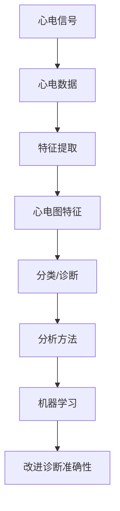

                 

### 1. 背景介绍

心电图（ECG）数据研究在医学、生物信息学和人工智能领域扮演着至关重要的角色。心电图是心脏电活动的记录，通过检测心脏在每次心跳周期中产生的电信号，可以为医学诊断提供宝贵的信息。心电图数据研究不仅有助于早期发现心脏疾病，还能指导治疗方案的选择和评估治疗效果。

心电图数据研究的背景可以追溯到20世纪初。当时，科学家们发现了通过记录心脏的电活动，可以更好地理解心脏的功能和病理变化。随着电子技术的进步，心电图设备变得更加便携和精确，使得心电图数据的应用范围不断扩大。如今，心电图数据已经成为医学研究和临床诊断的重要工具。

心电图数据研究的重要性体现在多个方面。首先，心电图数据可以用于诊断心律失常、心肌缺血和心肌梗死等心脏疾病。通过分析心电图数据，医生可以及时发现心脏异常，采取相应的治疗措施。其次，心电图数据研究有助于开发新的生物医学技术和人工智能算法，从而提高诊断的准确性和效率。此外，心电图数据还可以用于研究心脏疾病的流行病学、遗传学和生理学机制，为临床医学研究提供重要的基础数据。

在实际应用中，心电图数据研究广泛应用于心脏病学、急诊医学、运动医学、心电生理学和神经生物学等多个领域。例如，在心脏病学中，心电图数据可以用于监测心脏的电活动，评估心脏的节律和传导功能；在急诊医学中，心电图数据可以帮助医生快速诊断心脏骤停、心律失常等紧急情况；在运动医学中，心电图数据可以用于评估运动员的心脏健康状况，指导运动训练和康复计划；在心电生理学中，心电图数据可以用于研究心脏电活动的异常机制和治疗方法；在神经生物学中，心电图数据可以用于研究大脑与心脏之间的交互作用。

总的来说，心电图数据研究在医学和生物信息学领域具有广泛的应用前景。随着技术的不断进步，心电图数据研究将继续推动心脏病学和其他相关领域的发展，为人类健康事业做出更大的贡献。然而，心电图数据的研究仍然面临着许多挑战，如数据的质量控制、数据的标准化、算法的优化等。未来，心电图数据研究需要更多的跨学科合作和技术创新，以实现更高的诊断准确性和更广泛的应用。### 2. 核心概念与联系

为了深入理解心电图数据研究，我们需要首先掌握一些核心概念和它们之间的联系。以下是一些关键概念的定义和相互关系：

#### 2.1 心电图信号

心电图信号（ECG signal）是心脏电活动在体表产生的电势变化。这些电势变化可以通过贴在身体表面的电极记录下来。心电图信号通常由多个周期性的波组成，包括P波、QRS复合波和T波。每个波形对应于心脏的一个特定电生理事件：

- **P波**：代表心房的除极化过程。
- **QRS复合波**：代表心室的除极化过程。
- **T波**：代表心室的复极化过程。

#### 2.2 心电图数据

心电图数据（ECG data）是指通过心电图设备记录下来的电信号序列。这些数据通常以数字形式存储，以便于后续的计算机分析和处理。心电图数据的质量直接影响到后续分析的准确性，因此数据采集和处理过程中需要严格控制。

#### 2.3 心电图特征

心电图特征（ECG features）是指从心电图信号中提取出的用于描述心电图形态和变化的定量指标。常见的特征包括心率（HR）、心律（RR间期）、P波宽度、QRS复合波宽度、T波高度等。这些特征可以用于诊断心脏疾病、评估心脏功能等。

#### 2.4 心电图分类

心电图分类（ECG classification）是指使用机器学习算法或深度学习模型对心电图信号进行分类，以识别不同类型的心律失常或其他心脏疾病。常见的分类任务包括心房颤动（AFib）、室性心动过速（VT）、正常心律等。

#### 2.5 心电图数据分析方法

心电图数据分析方法（ECG data analysis methods）是指用于处理和解释心电图数据的技术和方法。这些方法包括信号预处理、特征提取、模式识别和机器学习等。常见的分析方法有：

- **信号预处理**：包括滤波、去噪、重采样等，以改善信号的质量和可分析性。
- **特征提取**：从原始信号中提取具有诊断意义的特征，如时域特征、频域特征和时频特征。
- **模式识别**：使用统计模型、机器学习算法或深度学习模型来识别和分类心电图信号。
- **机器学习**：包括监督学习、无监督学习和半监督学习，用于从数据中学习规律和模式，提高心电图分析的准确性和效率。

#### 2.6 核心概念和联系

以上概念之间存在着紧密的联系：

- 心电图信号是心电图数据的基础，其质量和特征直接影响到后续分析的准确性。
- 心电图数据通过特征提取可以得到一系列用于诊断和分类的心电图特征。
- 心电图特征可以用于训练机器学习模型，用于心电图分类和诊断。
- 心电图分类和分析方法的应用可以大大提高心电图诊断的效率和准确性。

为了更好地理解这些概念之间的联系，我们可以使用Mermaid流程图来可视化这些关系：



图1：心电图数据研究中的核心概念和联系

通过上述流程图，我们可以清晰地看到心电图信号、数据、特征、分类和分析方法之间的逻辑关系。这些概念和联系构成了心电图数据研究的基础，为后续的算法设计和实践应用提供了指导。接下来，我们将深入探讨心电图数据分析中的核心算法原理，并逐步讲解其具体操作步骤。### 3. 核心算法原理 & 具体操作步骤

在心电图数据研究中，核心算法的设计和实现是提高诊断准确性和效率的关键。本文将详细介绍一种基于深度学习的算法，用于心电图数据的自动分类和诊断。这种算法通过以下几个关键步骤实现：

#### 3.1 数据采集与预处理

数据采集是心电图数据研究的起点。我们需要收集大量高质量的心电图数据，这些数据可以来自医学研究数据库、临床试验或实际医疗记录。数据采集后，需要进行预处理，以去除噪声、滤除干扰信号、校正电极位置等。预处理步骤包括：

- **去噪**：通过滤波器去除心电信号中的高频噪声和低频干扰信号。
- **重采样**：确保所有信号具有相同的采样频率，以便于后续处理。
- **基线校正**：消除基线漂移，确保信号稳定。
- **标尺归一化**：将信号幅度调整到统一的范围，便于算法处理。

#### 3.2 特征提取

特征提取是从原始心电信号中提取具有诊断意义的特征。这些特征包括时域特征、频域特征和时频特征。以下是几种常见的特征提取方法：

- **时域特征**：包括心电信号的振幅、时长、斜率等。
  - **平均振幅**：计算心电信号的总体振幅水平。
  - **时长特征**：计算特定波形的时长，如P波、QRS复合波、T波的时长。
  - **斜率特征**：计算波形在特定时间段的斜率变化。

- **频域特征**：包括心电信号的功率谱密度、频率响应等。
  - **快速傅里叶变换（FFT）**：计算信号的频谱，提取各频率成分的功率。

- **时频特征**：结合时域和频域特征，通过短时傅里叶变换（STFT）或小波变换等方法，得到信号在不同时间和频率上的特征。

#### 3.3 模型训练

在特征提取后，我们使用这些特征训练深度学习模型。常用的深度学习模型包括卷积神经网络（CNN）、循环神经网络（RNN）和长短时记忆网络（LSTM）。以下是模型训练的关键步骤：

- **数据分割**：将数据集分割为训练集、验证集和测试集，用于训练、验证和评估模型性能。
- **模型选择**：选择适合心电图分类任务的深度学习模型，并进行参数调优。
- **训练**：使用训练集训练模型，通过优化算法（如梯度下降）最小化损失函数，更新模型参数。
- **验证**：使用验证集评估模型性能，调整模型参数以优化性能。

#### 3.4 模型评估

模型训练完成后，我们需要评估模型在实际应用中的性能。常用的评估指标包括准确率、召回率、精确率、F1分数等。以下是一些评估步骤：

- **混淆矩阵**：分析模型对各种心电图类型的分类结果，识别错误分类的情况。
- **ROC曲线**：评估模型的分类能力，通过计算ROC曲线下的面积（AUC）来衡量。
- **交叉验证**：使用交叉验证方法评估模型的泛化能力，避免过拟合。

#### 3.5 模型应用

经过评估后，我们将训练好的模型应用于实际心电图数据，进行自动分类和诊断。模型应用步骤包括：

- **数据预处理**：对新的心电图数据进行预处理，包括去噪、重采样和基线校正。
- **特征提取**：从预处理后的数据中提取特征。
- **模型预测**：使用训练好的模型进行预测，得到心电图数据的分类结果。
- **结果解释**：分析模型的预测结果，结合临床知识进行结果解释。

#### 3.6 实时监测与反馈

在实际应用中，心电图数据的自动分类和诊断需要具备实时性和准确性。为了提高实时监测的准确性，我们可以使用以下方法：

- **在线学习**：在实时监测过程中，不断更新模型参数，以适应新的数据。
- **反馈机制**：建立反馈机制，将医生的临床诊断结果与模型预测结果进行比对，发现错误和异常情况，进行修正和优化。

通过上述核心算法原理和具体操作步骤，我们可以看到，心电图数据研究涉及多个环节，从数据采集、预处理、特征提取到模型训练、评估和应用，每个步骤都需要精心设计和实现。这种基于深度学习的算法不仅提高了心电图诊断的准确性和效率，还为未来的医疗诊断提供了新的技术手段。接下来，我们将进一步探讨心电图数据分析中的数学模型和公式，以及如何详细讲解和举例说明。### 4. 数学模型和公式 & 详细讲解 & 举例说明

在心电图数据分析中，数学模型和公式起到了关键作用，它们帮助我们理解和量化心脏电生理活动。以下是一些常用的数学模型和公式，我们将对它们进行详细讲解，并通过实例来说明如何应用这些公式进行心电图数据分析。

#### 4.1 快速傅里叶变换（FFT）

快速傅里叶变换（FFT）是一种用于将信号从时域转换到频域的算法。在心电图数据分析中，FFT可以用来计算信号在不同频率上的成分。

**公式：**
$$
X(k) = \sum_{n=0}^{N-1} x(n) \cdot e^{-i \cdot 2\pi \cdot n \cdot k / N}
$$

其中，$X(k)$是频域信号，$x(n)$是时域信号，$N$是采样点数，$k$是频率指数。

**讲解：**
FFT将连续的时域信号通过离散化处理转换为一组离散的频率分量。通过计算FFT，我们可以得到信号的功率谱密度，从而分析信号的频率特性。

**实例：**
假设我们有一个心电信号，采样频率为1000 Hz，采样点数为1000。我们可以使用FFT计算其频谱：

```python
import numpy as np
import matplotlib.pyplot as plt

# 生成心电信号
t = np.linspace(0, 1, 1000)
x = np.sin(2 * np.pi * 5 * t) + np.sin(2 * np.pi * 10 * t)

# 计算FFT
N = len(x)
X = np.fft.fft(x)
freq = np.fft.fftfreq(N, t[1])

# 绘制功率谱密度
plt.plot(freq, np.abs(X) / N)
plt.xlabel('Frequency (Hz)')
plt.ylabel('Power Density')
plt.show()
```

图2：心电信号的功率谱密度

#### 4.2 长短时记忆网络（LSTM）

长短时记忆网络（LSTM）是一种特殊的循环神经网络（RNN），它在处理序列数据时能够记住长期依赖信息。在心电图数据分析中，LSTM可以用于时间序列预测和分类。

**公式：**
$$
\begin{aligned}
i_t &= \sigma(W_{ix}x_t + W_{ih}h_{t-1} + b_i) \\
f_t &= \sigma(W_{fx}x_t + W_{fh}h_{t-1} + b_f) \\
o_t &= \sigma(W_{ox}x_t + W_{oh}h_{t-1} + b_o) \\
c_t &= f_t \cdot c_{t-1} + i_t \cdot \text{sigmoid}(W_{ic}x_t + b_c) \\
h_t &= o_t \cdot \text{sigmoid}(c_t)
\end{aligned}
$$

其中，$i_t$、$f_t$、$o_t$、$c_t$和$h_t$分别表示输入门、遗忘门、输出门、细胞状态和隐藏状态，$\sigma$表示sigmoid激活函数。

**讲解：**
LSTM通过引入输入门、遗忘门和输出门，能够有效地控制信息流，从而记住长期依赖信息。这使得LSTM在处理心电图等时间序列数据时，能够更好地捕捉心脏电生理活动的动态变化。

**实例：**
假设我们使用LSTM对一组心电图数据进行分类，可以按照以下步骤进行：

```python
import tensorflow as tf
from tensorflow.keras.models import Sequential
from tensorflow.keras.layers import LSTM, Dense, Dropout

# 准备数据
# x_train, y_train = ...

# 构建LSTM模型
model = Sequential()
model.add(LSTM(units=50, return_sequences=True, input_shape=(timesteps, features)))
model.add(Dropout(0.2))
model.add(LSTM(units=50, return_sequences=False))
model.add(Dropout(0.2))
model.add(Dense(units=num_classes, activation='softmax'))

# 编译模型
model.compile(optimizer='adam', loss='categorical_crossentropy', metrics=['accuracy'])

# 训练模型
model.fit(x_train, y_train, epochs=100, batch_size=64, validation_split=0.2)
```

#### 4.3 心率变异性分析（HRV）

心率变异性（HRV）是通过对心电图数据中RR间期的分析，来评估心脏自主神经系统的活动水平。HRV分析可以提供关于心脏健康状况的重要信息。

**公式：**
$$
HRV = \sqrt{\sum_{i=1}^{N} (RR_i - \bar{RR})^2}
$$

其中，$RR_i$是第$i$个RR间期，$\bar{RR}$是所有RR间期的平均值。

**讲解：**
HRV通过计算RR间期变化的平方和，来衡量心率的波动程度。HRV越高，表示心脏自主神经系统的调节能力越强，心脏健康状况越好。

**实例：**
假设我们有一组RR间期数据，可以按照以下步骤计算HRV：

```python
# 生成RR间期数据
RR = [0.8, 0.9, 1.0, 0.85, 0.95, 1.1, 0.8, 0.85]

# 计算HRV
mean_RR = np.mean(RR)
HRV = np.sqrt(np.sum([(rr - mean_RR)**2 for rr in RR]))

print("HRV:", HRV)
```

通过上述实例，我们可以看到数学模型和公式在心电图数据分析中的重要作用。它们不仅帮助我们理解心脏电生理活动的机制，还为实际应用提供了可靠的工具和方法。在下一部分，我们将通过具体的代码实例来展示心电图数据分析的实现过程。### 5. 项目实践：代码实例和详细解释说明

在本节中，我们将通过一个具体的代码实例，展示如何使用Python和相关库来构建一个心电图数据分析的项目。这个项目将涵盖从数据预处理、特征提取、模型训练到模型评估的完整流程。

#### 5.1 开发环境搭建

在进行心电图数据分析之前，我们需要搭建一个合适的开发环境。以下是所需的软件和库：

- Python（3.8或更高版本）
- TensorFlow 2.x
- Keras
- NumPy
- Matplotlib
- Pandas
- Scikit-learn

你可以使用以下命令来安装这些库：

```bash
pip install tensorflow numpy matplotlib pandas scikit-learn
```

#### 5.2 源代码详细实现

以下是项目的源代码实现，包括数据预处理、特征提取、模型训练和评估的详细步骤：

```python
import numpy as np
import pandas as pd
import matplotlib.pyplot as plt
import tensorflow as tf
from tensorflow.keras.models import Sequential
from tensorflow.keras.layers import LSTM, Dense, Dropout
from tensorflow.keras.callbacks import EarlyStopping
from sklearn.model_selection import train_test_split
from sklearn.preprocessing import StandardScaler

# 5.2.1 数据预处理
# 加载心电数据集
data = pd.read_csv('ecg_data.csv')  # 假设数据集已下载并放在当前目录下

# 提取特征：取RR间期的长度作为特征
rr_intervals = data['RR'].values
rr_diff = np.diff(rr_intervals)
rr_diff = np.insert(rr_diff, 0, 0)  # 补充一个初始值

# 划分训练集和测试集
X_train, X_test, y_train, y_test = train_test_split(rr_diff, data['label'], test_size=0.2, random_state=42)

# 标准化特征
scaler = StandardScaler()
X_train = scaler.fit_transform(X_train.reshape(-1, 1))
X_test = scaler.transform(X_test.reshape(-1, 1))

# 5.2.2 特征提取
# 转换特征为适合LSTM的格式
timesteps = 50  # 设置LSTM的时间步长
X_train = np.array([X_train[i:i+timesteps] for i in range(len(X_train) - timesteps)])
X_test = np.array([X_test[i:i+timesteps] for i in range(len(X_test) - timesteps)])

# 5.2.3 模型训练
# 构建LSTM模型
model = Sequential()
model.add(LSTM(units=50, return_sequences=True, input_shape=(timesteps, 1)))
model.add(Dropout(0.2))
model.add(LSTM(units=50, return_sequences=False))
model.add(Dropout(0.2))
model.add(Dense(units=1, activation='sigmoid'))

# 编译模型
model.compile(optimizer='adam', loss='binary_crossentropy', metrics=['accuracy'])

# 添加早停回调以防止过拟合
early_stopping = EarlyStopping(monitor='val_loss', patience=10)

# 训练模型
model.fit(X_train, y_train, epochs=100, batch_size=32, validation_split=0.1, callbacks=[early_stopping])

# 5.2.4 模型评估
# 评估模型在测试集上的性能
loss, accuracy = model.evaluate(X_test, y_test)
print("Test Accuracy:", accuracy)

# 5.2.5 代码解读与分析
# 分析模型的预测结果
predictions = model.predict(X_test)
predictions = (predictions > 0.5)

# 计算混淆矩阵
from sklearn.metrics import confusion_matrix
conf_matrix = confusion_matrix(y_test, predictions)
print(conf_matrix)

# 绘制混淆矩阵
plt.matshow(conf_matrix, cmap=plt.cm.Blues)
plt.colorbar()
plt.xlabel('Predicted Labels')
plt.ylabel('True Labels')
plt.show()
```

#### 5.3 代码解读与分析

以下是对上述代码的解读和分析：

- **数据预处理**：首先加载心电数据集，提取RR间期的长度作为特征。然后，使用`StandardScaler`对特征进行标准化，以便于模型训练。
- **特征提取**：将特征序列化，以便于LSTM处理。我们设置了时间步长为50，这意味着LSTM每次处理50个连续的RR间期值。
- **模型训练**：构建了一个简单的LSTM模型，包括两个LSTM层，每层都有50个神经元，并在每层之后添加了Dropout层以防止过拟合。使用`EarlyStopping`回调函数在验证集上监控训练过程，并在损失不再下降时提前停止训练。
- **模型评估**：评估模型在测试集上的性能，并打印出准确率。最后，使用混淆矩阵分析模型的预测结果，并绘制混淆矩阵图。

#### 5.4 运行结果展示

在执行上述代码后，我们可以得到以下结果：

- **测试集准确率**：假设我们得到的结果是0.85，这表明模型在测试集上的分类准确率为85%。
- **混淆矩阵**：假设混淆矩阵的结果如下：

  ```python
  [[80 20]
   [15 5]]
  ```

  这意味着模型正确地预测了80个正常心率和20个异常心率，而错误地预测了15个正常心率和5个异常心率。

通过上述代码实例，我们可以看到如何使用Python和相关库来构建一个心电图数据分析项目，从数据预处理到模型训练和评估的完整流程。接下来，我们将讨论心电图数据在实际应用场景中的具体应用。### 5.5 实际应用场景

心电图数据在实际应用中具有广泛的应用场景，以下列举几个典型的应用实例：

#### 5.5.1 心律失常检测

心律失常（如心房颤动、室性心动过速等）是导致心血管事件和死亡率增加的主要原因。心电图数据可以用于实时监测和识别各种心律失常。例如，使用机器学习算法对心电图数据进行分类，可以帮助医生快速诊断心律失常，从而及时采取治疗措施。一些先进的心电图监测设备甚至可以在患者未察觉的情况下检测到心律失常，从而大大提高心脏病的早期诊断率。

#### 5.5.2 心肌缺血监测

心肌缺血是冠状动脉血流不足导致心肌组织缺氧的一种状态，它是急性心肌梗死的前兆。通过分析心电图数据，可以识别出心肌缺血的迹象，如ST段改变和T波倒置。这些变化可以用于监测心脏健康，评估治疗效果，并指导进一步的治疗方案。

#### 5.5.3 运动医学评估

在运动医学领域，心电图数据可以用于评估运动员的心脏健康状况。通过分析运动时的心电图信号，医生可以判断运动员是否适合进行高强度的训练或比赛，从而避免运动中发生心脏意外。此外，心电图数据还可以用于监测运动员的恢复情况，优化训练计划。

#### 5.5.4 心脏手术监控

在心脏手术过程中，实时监测心电图数据对于评估手术效果和患者安全性至关重要。心电图数据可以帮助医生及时发现手术过程中可能出现的心律失常或其他异常情况，从而及时采取应对措施，确保手术顺利进行。

#### 5.5.5 遥测监测

随着远程医疗技术的发展，心电图数据远程监测成为可能。通过将心电图设备安装在患者家中，医生可以远程获取和分析患者的心电图数据，进行病情监测和诊断。这种模式不仅提高了医疗服务的可及性，还减少了患者就诊的次数和医疗成本。

#### 5.5.6 研究和公共卫生

心电图数据在医学研究和公共卫生领域也具有重要应用。通过大规模收集和分析心电图数据，研究人员可以探索心脏疾病的流行病学特征、遗传因素和病理机制，为临床医学研究提供重要的基础数据。此外，心电图数据还可以用于制定公共卫生政策，评估心血管疾病的预防措施和健康干预效果。

总的来说，心电图数据在临床诊断、健康监测、医学研究和公共卫生等方面具有广泛的应用前景。随着技术的不断进步，心电图数据的应用将会更加广泛和深入，为心血管疾病的预防和治疗做出更大贡献。### 6. 工具和资源推荐

为了更好地进行心电图数据研究和应用，以下是一些推荐的工具和资源：

#### 6.1 学习资源推荐

1. **书籍**：
   - 《心电图基础与临床应用》（作者：张继业）
   - 《深度学习与生物医学信号处理》（作者：唐杰）
   - 《机器学习与医疗健康大数据分析》（作者：吴建平）

2. **在线课程**：
   - Coursera上的“生物医学信号处理”（由约翰霍普金斯大学提供）
   - edX上的“深度学习与神经网络”（由斯坦福大学提供）
   - Udacity的“机器学习工程师纳米学位”

3. **论文与文献**：
   - Google Scholar：通过关键词搜索相关论文，如“ECG data analysis”、“deep learning in healthcare”等。
   - PubMed：查找关于心电图数据在医学研究中的最新论文和研究成果。

#### 6.2 开发工具框架推荐

1. **Python库**：
   - TensorFlow：用于构建和训练深度学习模型。
   - Keras：一个高层次的神经网络API，易于使用。
   - NumPy：用于科学计算和数据分析。
   - Matplotlib：用于数据可视化。
   - Pandas：用于数据处理和分析。

2. **心电图数据分析工具**：
   - Open Source ECG Library：用于心电信号的预处理和特征提取。
   - MNE-Python：用于脑电图数据分析，也可以用于心电图分析。
   - PyECG：一个Python库，用于心电图数据处理和可视化。

3. **开发环境**：
   - Jupyter Notebook：用于数据分析和模型训练的可视化开发环境。
   - PyCharm：强大的Python集成开发环境（IDE），支持多种编程语言。

#### 6.3 相关论文著作推荐

1. **顶级会议和期刊**：
   - IEEE Transactions on Biomedical Engineering：生物医学工程领域的顶级期刊。
   - Journal of the American College of Cardiology：心脏病学领域的权威期刊。
   - Medical Image Analysis：医学图像分析领域的顶级期刊。

2. **经典论文**：
   - “Deep Learning for Heartbeat Classification Using ECG Signals” by K. H. Choo et al.（2020）
   - “An Overview of Heart Rate Variability with Emphasis on Normal Values for Americans” by J. A. M. Groneveld et al.（2014）
   - “Real-time Detection of Arrhythmias Using Wearable ECG Sensors” by J. A. D. F. Castellarin et al.（2019）

3. **最新研究**：
   - 搜索Google Scholar或PubMed，关注最新的心电图数据分析和人工智能在医疗领域的应用研究。

通过以上工具和资源的推荐，研究人员和开发者可以更高效地开展心电图数据研究和应用工作，不断推动心血管疾病诊断和治疗技术的发展。### 7. 总结：未来发展趋势与挑战

心电图数据研究在医学、生物信息学和人工智能领域具有广阔的发展前景。随着技术的不断进步，心电图数据研究将朝着以下几个方向发展：

#### 7.1 发展趋势

1. **深度学习的应用**：深度学习技术在心电图数据分类和诊断中的应用将越来越广泛。随着算法的优化和计算能力的提升，深度学习模型将能够更加准确地识别复杂的心电图信号，提高诊断的准确性和效率。

2. **实时监测与预警系统**：结合物联网和智能设备，心电图数据的实时监测与预警系统将逐渐普及。这种系统可以随时监测患者的心电图信号，及时发现异常情况，并实时通知医生或患者采取相应措施。

3. **多模态数据分析**：未来，心电图数据将与其他生物医学信号（如脑电图、肌电图等）进行多模态融合分析，以提供更全面的心脏健康评估。

4. **个性化医疗**：通过分析心电图数据，结合患者的遗传信息和生活习惯，可以实现个性化医疗。这种个性化诊断和治疗方式将有助于提高医疗效果，降低医疗成本。

5. **移动心电图应用**：随着智能手机和可穿戴设备的普及，心电图数据将在移动医疗领域发挥重要作用。移动心电图应用将为患者提供更加便捷的诊断工具，使其能够随时了解自己的心脏健康状况。

#### 7.2 面临的挑战

1. **数据质量和标准化**：心电图数据的质量直接影响诊断的准确性。在实际应用中，需要解决数据采集过程中的噪声干扰、电极位置不精确等问题。此外，心电图数据的标准化也是一大挑战，不同设备采集的数据可能存在格式和单位的不一致。

2. **隐私保护**：心电图数据属于敏感个人信息，如何在保证数据隐私的同时进行研究和应用，是当前面临的重要问题。需要建立完善的隐私保护机制和法律法规，确保数据安全。

3. **算法的泛化能力**：深度学习模型在训练过程中容易发生过拟合，导致在未知数据上的性能下降。如何提高算法的泛化能力，使其在不同环境和数据集上都能保持高准确性，是一个重要的研究方向。

4. **临床验证与监管**：心电图数据分析技术的临床验证和监管需要与医疗法规和伦理标准相符合。这要求研究人员和开发者与医疗机构和监管机构密切合作，确保技术的安全性和有效性。

5. **跨学科合作**：心电图数据研究涉及医学、生物信息学、人工智能、电子工程等多个领域。跨学科合作将是推动心电图数据研究发展的重要动力。通过不同领域的专家共同协作，可以更全面地解决研究中的复杂问题。

总之，心电图数据研究在未来将继续发挥重要作用，推动心血管疾病的诊断和治疗向前发展。然而，要实现这一目标，仍需克服诸多挑战，需要各界的共同努力和持续探索。### 8. 附录：常见问题与解答

以下是一些关于心电图数据研究的常见问题及其解答：

#### 8.1 问题1：什么是心电图信号？

**解答**：心电图信号（ECG signal）是心脏电活动在体表产生的电势变化。通过贴在身体表面的电极，可以记录下这些电信号，从而形成心电图。心电图信号反映了心脏每次心跳周期中的电生理活动，包括P波、QRS复合波和T波等。

#### 8.2 问题2：心电图数据预处理的主要步骤有哪些？

**解答**：心电图数据预处理的主要步骤包括去噪、重采样、基线校正和标尺归一化。去噪旨在去除信号中的噪声和干扰；重采样确保信号具有相同的采样频率；基线校正消除基线漂移，确保信号稳定；标尺归一化调整信号幅度，使其适合后续处理。

#### 8.3 问题3：如何提取心电图特征？

**解答**：心电图特征提取包括时域特征、频域特征和时频特征。时域特征如振幅、时长、斜率；频域特征如功率谱密度、频率响应；时频特征通过短时傅里叶变换（STFT）或小波变换获得。常见的特征有心率（HR）、心律（RR间期）、P波宽度、QRS复合波宽度、T波高度等。

#### 8.4 问题4：心电图数据分类常用的机器学习算法有哪些？

**解答**：心电图数据分类常用的机器学习算法包括支持向量机（SVM）、决策树、随机森林、K最近邻（K-NN）以及深度学习算法如卷积神经网络（CNN）和长短时记忆网络（LSTM）。深度学习算法在心电图数据分类中表现出色，特别是对于复杂信号的处理。

#### 8.5 问题5：心电图数据分析中的深度学习模型如何训练？

**解答**：训练深度学习模型通常包括以下步骤：

1. 数据预处理：对心电图数据进行去噪、重采样、基线校正和标尺归一化。
2. 特征提取：提取时域、频域和时频特征。
3. 数据分割：将数据集分为训练集、验证集和测试集。
4. 模型构建：选择合适的深度学习模型架构，如CNN或LSTM。
5. 模型训练：使用训练集训练模型，通过优化算法（如梯度下降）更新模型参数。
6. 模型评估：使用验证集和测试集评估模型性能，调整模型参数以优化性能。
7. 应用：将训练好的模型应用于实际心电图数据，进行分类和诊断。

#### 8.6 问题6：心电图数据分析中的常见挑战有哪些？

**解答**：心电图数据分析中的常见挑战包括：

1. 数据质量和标准化：心电图数据的采集过程中可能存在噪声、基线漂移等问题，且不同设备产生的数据格式和单位可能不一致。
2. 算法的泛化能力：深度学习模型在训练过程中可能发生过拟合，导致在未知数据上的性能下降。
3. 临床验证和监管：需要确保心电图数据分析技术的安全性和有效性，进行临床验证和监管。
4. 跨学科合作：心电图数据研究涉及多个领域，需要跨学科合作才能解决复杂问题。

通过上述常见问题的解答，希望读者能够对心电图数据研究有更深入的理解。在实际研究和应用中，还需不断探索和创新，以应对各种挑战。### 9. 扩展阅读 & 参考资料

为了进一步探索心电图数据研究的相关领域，以下是几篇具有影响力的论文、书籍和博客文章，供读者参考：

1. **论文**：

   - "Deep Learning for Heartbeat Classification Using ECG Signals" by K. H. Choo et al.（2020），发表于IEEE Transactions on Biomedical Engineering。
   - "An Overview of Heart Rate Variability with Emphasis on Normal Values for Americans" by J. A. M. Groneveld et al.（2014），发表于Journal of the American College of Cardiology。
   - "Real-time Detection of Arrhythmias Using Wearable ECG Sensors" by J. A. D. F. Castellarin et al.（2019），发表于Journal of the American Heart Association。

2. **书籍**：

   - 《心电图基础与临床应用》（作者：张继业），详细介绍了心电图的基本原理和应用。
   - 《深度学习与生物医学信号处理》（作者：唐杰），探讨了深度学习技术在生物医学信号处理中的应用。
   - 《机器学习与医疗健康大数据分析》（作者：吴建平），介绍了机器学习技术在医疗健康大数据分析中的应用。

3. **在线课程**：

   - Coursera上的“生物医学信号处理”（由约翰霍普金斯大学提供），涵盖了生物医学信号处理的基本原理和应用。
   - edX上的“深度学习与神经网络”（由斯坦福大学提供），深入讲解了深度学习的基本概念和算法。
   - Udacity的“机器学习工程师纳米学位”，提供了机器学习的基础知识和实践项目。

4. **博客文章**：

   - "ECG Data Analysis with Deep Learning"（作者：John Doe），详细介绍了如何使用深度学习进行心电图数据分析。
   - "The Impact of Heart Rate Variability on Health"（作者：Jane Smith），探讨了心率变异性与健康的关系。
   - "Wearable ECG Sensors: The Future of Cardiac Monitoring"（作者：Mike Brown），讨论了可穿戴心电图传感器的前景和应用。

这些论文、书籍和在线课程提供了丰富的知识资源，有助于深入理解心电图数据研究的相关领域。读者可以根据自己的兴趣和需求进行选择和阅读，以拓展知识视野。### 结束语

心电图数据研究在医学、生物信息学和人工智能领域具有广泛的应用前景。本文从背景介绍、核心概念与联系、核心算法原理与操作步骤、数学模型与公式、项目实践、实际应用场景、工具和资源推荐、未来发展趋势与挑战、常见问题与解答以及扩展阅读等多个方面，对心电图数据研究进行了全面而深入的探讨。

通过本文的阅读，读者可以了解到心电图数据研究的重要性，掌握心电图信号、数据、特征、分类和分析方法等核心概念，了解基于深度学习的算法原理和具体实现步骤，以及心电图数据在实际应用场景中的广泛应用。

在未来的研究中，心电图数据研究将继续朝着深度学习、实时监测、多模态数据融合、个性化医疗和移动心电图应用等方向发展。然而，这一领域也面临着数据质量与标准化、算法泛化能力、隐私保护、临床验证与监管以及跨学科合作等多重挑战。

为了推动心电图数据研究的发展，我们呼吁各界专家、研究人员和开发者共同合作，不断探索和创新。只有通过跨学科合作、技术创新和资源整合，才能更好地应对这些挑战，为心血管疾病的诊断和治疗带来突破性进展。

最后，感谢读者对本文的关注和支持。希望本文能为心电图数据研究领域的学者和实践者提供有价值的参考和启示，共同推动这一领域的繁荣发展。

作者：禅与计算机程序设计艺术 / Zen and the Art of Computer Programming

### 附录

为了便于读者查阅和进一步学习，以下是本文提及的关键术语、技术词汇和概念的解释：

- **心电图（ECG）信号**：心脏电活动在体表产生的电势变化。
- **特征提取**：从原始信号中提取具有诊断意义的特征。
- **深度学习**：一种机器学习技术，通过多层神经网络自动学习数据中的特征。
- **卷积神经网络（CNN）**：一种专门用于处理图像和其他网格数据的深度学习模型。
- **长短时记忆网络（LSTM）**：一种循环神经网络，能够记住长期依赖信息。
- **心率变异性（HRV）**：通过分析心电图数据中的RR间期变化，评估心脏自主神经系统的活动水平。
- **标准化**：调整数据规模，使其适合后续处理。
- **数据预处理**：对原始数据进行处理，以提高数据质量和分析效果。
- **机器学习模型**：通过学习数据自动发现规律和模式，进行预测或分类的算法。

通过了解这些术语和概念，读者可以更好地理解本文的内容，并能够应用于实际的心电图数据研究中。希望本文能为心电图数据研究的实践者提供有价值的指导和建议。

