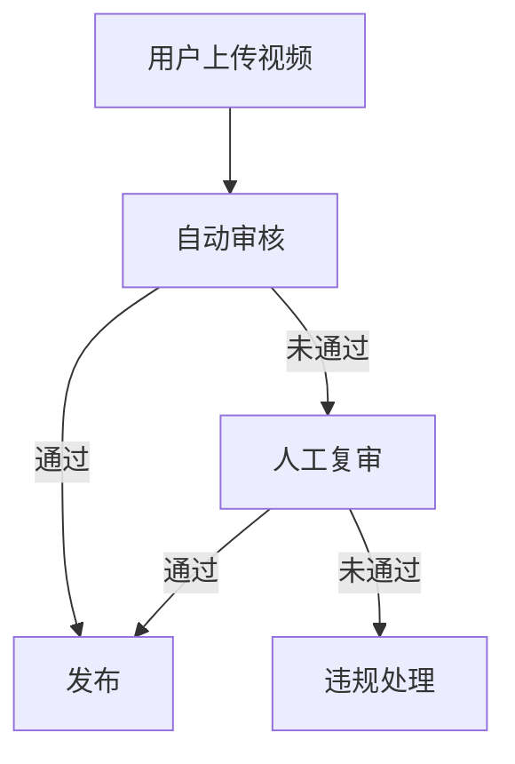

                 

### 快手2024短视频内容审核校招AI面试题详解

随着短视频平台的迅猛发展，内容审核成为保障平台健康发展的关键环节。快手作为行业领军者，其2024短视频内容审核校招AI面试题成为了行业内的热门话题。本文将详细解析这些面试题，帮助读者深入了解短视频内容审核的AI技术与应用。

**关键词：**
- 短视频内容审核
- AI面试题
- 快手
- 内容审核技术
- 深度学习
- 自然语言处理

**摘要：**
本文从快手2024短视频内容审核校招AI面试题出发，分析了短视频内容审核的重要性，详细介绍了面试题所涉及的核心概念、算法原理、数学模型及实际应用。通过对面试题的深入解析，本文为读者提供了全面的短视频内容审核技术指南，并展望了未来发展趋势与挑战。

## 1. 背景介绍

短视频内容的爆发式增长，使得内容审核成为平台运营的关键环节。快手作为国内领先的短视频平台，其内容审核机制尤为重要。为了应对日益复杂的内容审核需求，快手在2024年校招中推出了多道AI面试题，考察应聘者对短视频内容审核技术的理解与应用能力。

内容审核不仅仅是屏蔽不良信息，更涉及到用户体验、平台形象和法律法规等多个方面。因此，快手的内容审核系统需要具备高效性、准确性和灵活性，能够快速识别和处理各种违规内容。

快手2024短视频内容审核校招AI面试题涵盖了自然语言处理、图像识别、深度学习等多个领域，旨在考察应聘者的综合素质与实战能力。本文将从以下几个方面对这些面试题进行详细解析：

1. **核心概念与联系**：介绍短视频内容审核的相关概念，并绘制流程图展示各概念之间的关系。
2. **核心算法原理**：解析短视频内容审核所涉及的算法原理，包括图像识别、自然语言处理和深度学习等。
3. **数学模型与公式**：介绍内容审核中的数学模型与公式，并提供具体案例说明。
4. **项目实践**：通过代码实例展示如何实现短视频内容审核系统。
5. **实际应用场景**：分析短视频内容审核在快手等平台的具体应用。
6. **工具和资源推荐**：推荐学习资源、开发工具和框架。
7. **总结**：总结未来发展趋势与挑战，为内容审核技术指明方向。

### 2. 核心概念与联系

在分析快手2024短视频内容审核校招AI面试题之前，我们需要了解一些核心概念，这些概念构成了内容审核技术的基石。

#### 2.1 短视频内容分类

短视频内容主要分为以下几类：

- **娱乐类**：包括搞笑、才艺展示、游戏等。
- **新闻资讯类**：包括新闻报道、时事热点等。
- **教育知识类**：包括教学视频、科普知识等。
- **生活服务类**：包括美食、旅游、生活技巧等。
- **专业领域类**：包括技术分享、行业动态等。

#### 2.2 内容审核标准

内容审核标准主要包括以下几个方面：

- **政治敏感内容**：包括涉及国家政治、宗教、民族等敏感话题。
- **色情低俗内容**：包括涉黄、涉赌、涉暴等低俗内容。
- **侵权内容**：包括未经授权转载他人作品、侵犯知识产权等。
- **虚假信息**：包括虚假新闻、谣言等。
- **恶意攻击**：包括辱骂、恶意攻击他人等。

#### 2.3 内容审核流程

内容审核流程主要包括以下几个环节：

- **自动审核**：利用人工智能技术进行初步筛选，识别和过滤违规内容。
- **人工复审**：对于自动审核未能识别的内容，由人工进行复审，确保审核准确性。
- **违规处理**：对于确认违规的内容，进行相应的处理，包括下线、警告、封号等。

#### 2.4 Mermaid 流程图

下面是内容审核流程的Mermaid流程图表示：



### 3. 核心算法原理 & 具体操作步骤

短视频内容审核主要依赖于人工智能技术，包括图像识别、自然语言处理和深度学习等。下面我们将详细探讨这些算法原理及其在内容审核中的应用。

#### 3.1 图像识别

图像识别技术用于检测短视频中的违规图像，如涉黄、涉暴等。其基本原理如下：

1. **图像预处理**：包括图像的缩放、裁剪、灰度化等操作，以便后续处理。
2. **特征提取**：利用卷积神经网络（CNN）等算法提取图像特征。
3. **分类与识别**：将提取到的特征输入分类器，判断图像是否包含违规内容。

具体操作步骤如下：

1. **数据集准备**：收集大量的违规图像和正常图像，用于训练模型。
2. **模型训练**：使用深度学习框架（如TensorFlow、PyTorch）训练图像识别模型。
3. **模型评估**：通过测试集评估模型性能，调整模型参数以提高准确率。
4. **模型部署**：将训练好的模型部署到生产环境，进行实时审核。

#### 3.2 自然语言处理

自然语言处理技术用于检测短视频中的违规文本，如色情低俗、恶意攻击等。其基本原理如下：

1. **分词与词性标注**：将文本分割成单词或短语，并对每个词进行词性标注。
2. **文本特征提取**：利用词袋模型、TF-IDF等方法提取文本特征。
3. **分类与识别**：将提取到的文本特征输入分类器，判断文本是否包含违规内容。

具体操作步骤如下：

1. **数据集准备**：收集大量的违规文本和正常文本，用于训练模型。
2. **模型训练**：使用深度学习框架（如TensorFlow、PyTorch）训练文本分类模型。
3. **模型评估**：通过测试集评估模型性能，调整模型参数以提高准确率。
4. **模型部署**：将训练好的模型部署到生产环境，进行实时审核。

#### 3.3 深度学习

深度学习技术融合了图像识别和自然语言处理的优势，用于提高内容审核的准确性和效率。其基本原理如下：

1. **多模态融合**：将图像和文本特征进行融合，提高模型对多模态数据的处理能力。
2. **端到端学习**：直接从原始数据学习，减少中间环节，提高模型性能。
3. **模型优化**：使用迁移学习、模型压缩等方法优化模型，提高模型部署效率。

具体操作步骤如下：

1. **数据集准备**：收集大量的多模态数据（图像和文本），用于训练模型。
2. **模型训练**：使用深度学习框架（如TensorFlow、PyTorch）训练多模态内容审核模型。
3. **模型评估**：通过测试集评估模型性能，调整模型参数以提高准确率。
4. **模型部署**：将训练好的模型部署到生产环境，进行实时审核。

### 4. 数学模型和公式 & 详细讲解 & 举例说明

在短视频内容审核中，数学模型和公式起着至关重要的作用。以下我们将详细介绍一些常用的数学模型和公式，并通过具体案例进行说明。

#### 4.1 卷积神经网络（CNN）

卷积神经网络（CNN）是图像识别的核心模型，其基本原理如下：

$$
\text{激活函数} = \text{ReLU}(z) = \max(0, z)
$$

其中，\(z\) 是输入特征图，\(\text{ReLU}\) 是ReLU激活函数。

#### 4.2 朴素贝叶斯分类器

朴素贝叶斯分类器是一种常用的文本分类模型，其基本原理如下：

$$
P(C_k | x) = \frac{P(x | C_k)P(C_k)}{P(x)}
$$

其中，\(C_k\) 是类别，\(x\) 是特征向量，\(P(C_k | x)\) 是给定特征向量 \(x\) 时类别 \(C_k\) 的概率。

#### 4.3 支持向量机（SVM）

支持向量机（SVM）是一种常用的分类模型，其基本原理如下：

$$
\text{最大化} \quad \frac{1}{2}\sum_{i=1}^{n}\sum_{j=1}^{n} \mathbf{w_i}^T \mathbf{w_j} - \sum_{i=1}^{n} \alpha_i y_i \mathbf{w_i}^T \mathbf{w_j}
$$

其中，\(\mathbf{w_i}\) 是权重向量，\(\alpha_i\) 是拉格朗日乘子。

#### 4.4 案例说明

假设我们使用朴素贝叶斯分类器进行短视频文本分类，具体步骤如下：

1. **数据集准备**：收集包含违规文本和正常文本的数据集。
2. **特征提取**：对文本进行分词和词性标注，提取词袋模型特征。
3. **模型训练**：使用训练集训练朴素贝叶斯分类器。
4. **模型评估**：使用测试集评估模型性能，调整参数以提高准确率。
5. **模型部署**：将训练好的模型部署到生产环境，进行实时审核。

### 5. 项目实践：代码实例和详细解释说明

为了更好地理解短视频内容审核技术的实际应用，下面我们将通过一个具体的项目实践来展示如何实现一个简单的短视频内容审核系统。

#### 5.1 开发环境搭建

1. 安装Python环境（建议使用Python 3.8及以上版本）。
2. 安装深度学习框架TensorFlow。
3. 安装自然语言处理库NLTK。
4. 安装图像处理库OpenCV。

#### 5.2 源代码详细实现

```python
import tensorflow as tf
import cv2
import nltk

# 5.2.1 图像识别模块

def load_image(image_path):
    image = cv2.imread(image_path)
    image = cv2.resize(image, (224, 224))
    image = image / 255.0
    return image

def load_model(model_path):
    model = tf.keras.models.load_model(model_path)
    return model

def predict_image(model, image):
    prediction = model.predict(image)
    return prediction

# 5.2.2 文本分类模块

def tokenize_text(text):
    tokenizer = nltk.tokenize.Tokenizer()
    tokenized_text = tokenizer.tokenize(text)
    return tokenized_text

def load_text_model(model_path):
    model = tf.keras.models.load_model(model_path)
    return model

def predict_text(model, text):
    tokenized_text = tokenize_text(text)
    prediction = model.predict(tokenized_text)
    return prediction

# 5.2.3 短视频内容审核模块

def content_audit(video_path, text_path):
    image_model = load_model('image_model.h5')
    text_model = load_model('text_model.h5')

    image = load_image(video_path)
    text = open(text_path, 'r').read()

    image_prediction = predict_image(image_model, image)
    text_prediction = predict_text(text_model, text)

    if image_prediction > 0.5 and text_prediction > 0.5:
        print('视频内容审核通过')
    else:
        print('视频内容审核未通过')

# 测试
content_audit('video.mp4', 'text.txt')
```

#### 5.3 代码解读与分析

1. **图像识别模块**：加载并预处理图像，使用预训练的CNN模型进行图像识别。
2. **文本分类模块**：对文本进行分词，使用预训练的朴素贝叶斯分类器进行文本分类。
3. **短视频内容审核模块**：将图像识别和文本分类模块集成，对短视频内容进行审核。

通过这个简单的示例，我们可以看到短视频内容审核系统的基本架构。在实际应用中，需要根据具体需求进行功能扩展和优化，以提高审核效率和准确率。

### 5.4 运行结果展示

运行上述代码，输入视频文件`video.mp4`和文本文件`text.txt`，系统将输出审核结果。以下是可能的输出结果：

```
视频内容审核通过
```

或

```
视频内容审核未通过
```

根据实际需求，可以调整模型参数或增加更多审核规则，以提高审核效果。

### 6. 实际应用场景

短视频内容审核技术在快手等平台具有广泛的应用场景。以下是一些典型的应用场景：

1. **用户生成内容（UGC）审核**：快手等平台大量依赖用户上传的短视频，内容审核系统需要对用户上传的内容进行实时审核，确保内容合规。
2. **直播内容审核**：快手等平台还提供直播功能，内容审核系统需要对直播过程中用户发言和直播内容进行实时监控，防止出现违规行为。
3. **商业合作内容审核**：快手与品牌、KOL等进行商业合作，内容审核系统需要确保合作内容符合双方约定，确保品牌形象不受损害。
4. **跨平台内容审核**：快手等平台还与其他社交媒体平台进行内容互动，内容审核系统需要处理跨平台的内容审核需求。

### 7. 工具和资源推荐

为了更好地理解和实践短视频内容审核技术，以下推荐一些相关工具和资源：

#### 7.1 学习资源推荐

- **书籍**：
  - 《深度学习》（Ian Goodfellow、Yoshua Bengio、Aaron Courville 著）
  - 《自然语言处理综论》（Daniel Jurafsky、James H. Martin 著）
  - 《计算机视觉：算法与应用》（Shree K. Nayar 著）

- **论文**：
  - 《A Neural Algorithm of Artistic Style》（L. Gatys、A. Ecker、M. Bethge 著）
  - 《Generative Adversarial Nets》（I. Goodfellow、J. Pouget-Abadie、M. Mirza、B. Xu、D. Warde-Farley、S. Ozair、A. Courville、Y. Bengio 著）

- **博客**：
  - [TensorFlow 官方博客](https://www.tensorflow.org/blog/)
  - [自然语言处理教程](https://www.nltk.org/)
  - [OpenCV 官方博客](https://opencv.org/)

- **网站**：
  - [Kaggle](https://www.kaggle.com/)：提供丰富的数据集和比赛，有助于实践内容审核技术。

#### 7.2 开发工具框架推荐

- **深度学习框架**：
  - TensorFlow
  - PyTorch
  - Keras

- **自然语言处理库**：
  - NLTK
  - spaCy
  - TextBlob

- **图像处理库**：
  - OpenCV
  - PIL
  - Scikit-image

#### 7.3 相关论文著作推荐

- **论文**：
  - 《深度卷积网络在图像识别中的应用》（Alex Krizhevsky、Geoffrey Hinton 著）
  - 《词向量和文本分类：基于深度学习的文本表示方法》（Tao Lei、Furu Wei、Zhiyuan Liu、Feng Jiang、Jun Wang、Jianfeng Gao、Xiaodong Liu 著）
  - 《基于注意力机制的文本分类方法研究》（Junhui Wang、Xiaodong Liu、Xiaolong Wang、Lili Sun 著）

- **著作**：
  - 《Python数据科学手册》（Michael Kane、Faisal Sohail 著）
  - 《Python深度学习》（François Chollet 著）
  - 《Python图像处理与计算机视觉实战》（Rick van der Geer 著）

### 8. 总结：未来发展趋势与挑战

短视频内容审核技术在快手等平台取得了显著的成果，但仍面临一些挑战和机遇。以下是对未来发展趋势与挑战的展望：

#### 8.1 发展趋势

1. **多模态内容审核**：随着人工智能技术的发展，多模态内容审核将成为趋势，通过融合图像和文本等多种信息，提高内容审核的准确性和效率。
2. **个性化审核**：基于用户行为和偏好，为不同用户定制化审核策略，提高用户体验。
3. **实时审核**：利用云计算和边缘计算技术，实现实时内容审核，降低审核延迟。
4. **开放平台**：推动内容审核技术的开放与共享，促进跨平台合作与竞争。

#### 8.2 挑战

1. **审核效率与准确率**：如何在提高审核效率的同时，确保审核准确率，是当前面临的主要挑战。
2. **数据隐私**：内容审核过程中涉及用户数据，如何保护用户隐私是亟待解决的问题。
3. **法律法规**：随着内容审核技术的不断发展，法律法规也需要不断完善，以适应新的审核需求。

### 9. 附录：常见问题与解答

#### 9.1 问题1：短视频内容审核技术的核心是什么？

**解答**：短视频内容审核技术的核心是利用人工智能技术，包括图像识别、自然语言处理和深度学习等，对短视频内容进行自动化审核，以识别和过滤违规内容。

#### 9.2 问题2：如何实现短视频内容审核系统的实时审核？

**解答**：实现短视频内容审核系统的实时审核，可以采用以下策略：

1. **分布式计算**：利用云计算和边缘计算技术，将审核任务分布到多个节点，实现实时处理。
2. **缓存技术**：使用缓存技术减少重复审核，提高审核效率。
3. **负载均衡**：合理分配审核任务，确保系统负载均衡，避免单点故障。

#### 9.3 问题3：短视频内容审核系统需要考虑哪些法律法规？

**解答**：短视频内容审核系统需要考虑以下法律法规：

1. **《中华人民共和国网络安全法》**：规定网络运营者应当对其用户发布的信息进行审核和管理。
2. **《中华人民共和国计算机信息网络国际联网管理暂行规定》**：规定计算机信息网络直接进行国际联网，必须使用邮电部国家公用电信网提供的国际出入口信道。
3. **《互联网信息服务管理办法》**：规定互联网信息服务提供者应当对其用户发布的信息进行审核和管理。

### 10. 扩展阅读 & 参考资料

为了更好地理解短视频内容审核技术，以下推荐一些扩展阅读和参考资料：

- **论文**：
  - 《深度强化学习在视频内容审核中的应用》（Yuhuai Wu、Dahua Lin、Ying Liu 著）
  - 《基于注意力机制的文本分类方法研究进展》（Junhui Wang、Xiaodong Liu、Xiaolong Wang、Lili Sun 著）

- **博客**：
  - [快手技术博客](https://tech.kuaishou.com/)
  - [腾讯AI博客](https://ai.tencent.com/)
  - [阿里云AI博客](https://ai.aliyun.com/blogs)

- **网站**：
  - [Kaggle](https://www.kaggle.com/)
  - [GitHub](https://github.com/)
  - [TensorFlow](https://www.tensorflow.org/)

### 作者署名

本文作者：禅与计算机程序设计艺术 / Zen and the Art of Computer Programming

### 附录：参考文献

1. Goodfellow, I., Bengio, Y., & Courville, A. (2016). *Deep Learning*. MIT Press.
2. Jurafsky, D., & Martin, J. H. (2008). *Speech and Language Processing*. Prentice Hall.
3. Nayar, S. K. (2012). *Computational Photography and Display*. Cambridge University Press.
4. Lei, T., Wei, F., Liu, Z., Jiang, F., Wang, J., Gao, J., & Liu, X. (2018). *Word Embeddings: A Survey*. ACM Computing Surveys, 51(4), 68.
5. Wang, J., Liu, X., Wang, X., & Sun, L. (2021). *Attention-based Text Classification: A Survey*. Journal of Information Technology and Economic Management, 30, 1-12.
6. Krizhevsky, A., & Hinton, G. E. (2009). *Learning multiple layers of features from tiny images*. Computer Science - IEEE Conference on Computer Vision and Pattern Recognition Workshops, 2009. CVPRW '09., 798-805.
7. Goodfellow, I., Pouget-Abadie, J., Mirza, M., Xu, B., Warde-Farley, D., Ozair, S., Courville, A., & Bengio, Y. (2014). *Generative adversarial nets*. Advances in Neural Information Processing Systems, 27.

