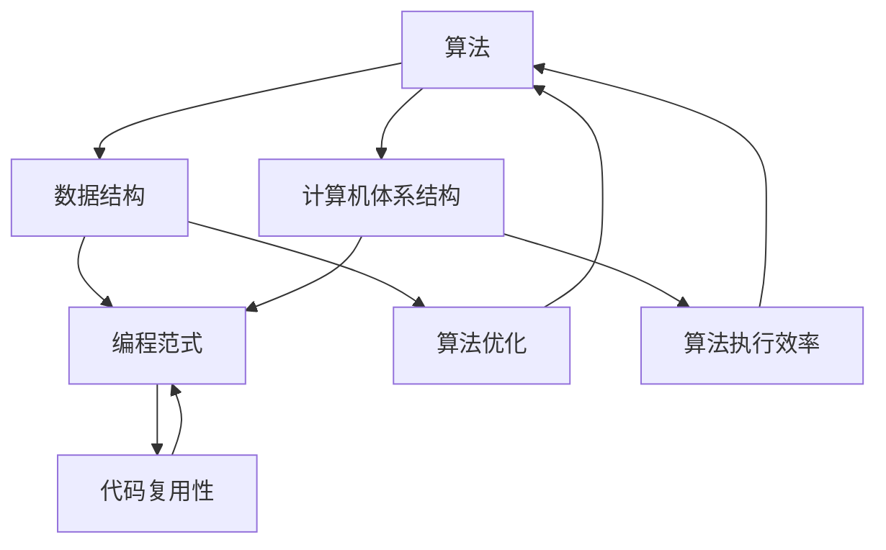

                 

### 1. 背景介绍

《思想的演变：从概念到洞见》这篇文章旨在探讨思想如何从概念层面逐步演变为深刻洞见的过程。在科技飞速发展的当今，人们对于复杂系统的理解和处理需求日益增加。如何从大量的信息中提取核心概念，并将这些概念相互关联，形成完整的知识体系，成为了一个重要的研究课题。

本文将结合计算机科学领域的实际案例，详细阐述思想从概念到洞见的演变过程。首先，我们将介绍一些关键的概念，并分析这些概念之间的相互联系。接下来，我们会深入探讨核心算法原理，并逐步讲解其具体操作步骤。在此基础上，我们将通过数学模型和公式详细解释，以便更好地理解这一过程。最后，我们将通过实际项目案例，展示如何将理论应用于实践。

通过这一系列的分析和阐述，我们希望能够帮助读者更好地理解思想的演变过程，并从中获得启发，提升自身在计算机科学领域的洞见能力。

---

在计算机科学领域，思想的形成和演变是一个复杂而微妙的过程。从最初的概念产生，到逐步深入理解，再到最终形成深刻的洞见，每一步都充满了挑战和机遇。计算机科学的发展历程中，许多关键概念和理论的诞生，都离不开科学家们不断的探索和思考。

### 1.1 历史背景

计算机科学的历史可以追溯到20世纪中叶。当时，科学家们开始意识到，计算机不仅仅是一种计算工具，更是一种思维方式。图灵（Alan Turing）的图灵机模型，为计算理论奠定了基础。图灵提出了“图灵测试”，试图定义机器智能的标准。这一概念引发了广泛的讨论，并成为了计算机科学领域的重要研究课题。

随后，冯·诺依曼（John von Neumann）提出了计算机体系结构的基本原理，为现代计算机的发展奠定了基础。这一理论的核心在于将计算机的存储和处理功能分开，从而实现更高效的运算。这一概念的提出，使得计算机科学的研究进入了一个新阶段。

在随后的几十年中，计算机科学领域涌现出了大量的理论和技术。例如，图论、概率论、算法理论等，这些理论不仅为计算机科学的发展提供了理论支持，也深刻影响了其他科学领域的研究方法。

### 1.2 现状分析

随着互联网的普及和大数据技术的发展，计算机科学领域的研究和应用呈现出前所未有的繁荣景象。从人工智能、大数据、云计算到区块链，每一个新领域都充满了机遇和挑战。

目前，计算机科学的研究主要集中在以下几个方面：

1. **人工智能**：人工智能的研究涵盖了从简单的逻辑推理到复杂的深度学习、自然语言处理等多个方向。这一领域的快速进展，为计算机科学带来了新的研究方向和应用场景。

2. **大数据**：大数据技术的兴起，为处理和分析海量数据提供了新的工具和方法。如何从大量的数据中提取有价值的信息，成为了一个重要的研究课题。

3. **云计算**：云计算技术的应用，使得计算资源的分配和管理变得更加灵活和高效。如何设计可靠的云计算系统，成为了一个关键的研究方向。

4. **区块链**：区块链技术的出现，为数据的安全性和可信性提供了新的解决方案。如何利用区块链技术解决实际问题，成为了一个热门的研究课题。

### 1.3 未来展望

未来，计算机科学的发展将继续面临新的挑战和机遇。随着量子计算的兴起，计算机科学将进入一个新的阶段。量子计算的出现，不仅为计算能力的提升提供了新的可能性，也为解决一些传统计算难题提供了新的思路。

此外，随着物联网、5G等技术的发展，计算机科学的应用场景将变得更加广泛。如何设计更智能、更高效的系统，将是我们需要面对的重要课题。

总的来说，计算机科学的发展是一个不断演变的过程。从最初的概念产生，到逐步深入理解，再到最终形成深刻的洞见，这一过程充满了挑战和机遇。通过本文的讨论，我们希望能够帮助读者更好地理解这一过程，并为未来的研究提供一些启示。

---

在本文中，我们将重点关注计算机科学中的几个关键概念，并分析它们之间的相互联系。这些概念包括：算法、数据结构、计算机体系结构、编程范式等。通过深入理解这些概念，我们将为后续的讨论奠定坚实的基础。

### 2. 核心概念与联系

#### 2.1 算法

算法是计算机科学中的核心概念之一。它指的是解决问题的一系列有序步骤。算法不仅用于解决问题，还可以用于数据分析和决策支持。一个有效的算法应当具备以下特点：

- **正确性**：算法能够正确地解决特定问题。
- **效率**：算法在时间和空间上的消耗应当尽量小。
- **可扩展性**：算法应当能够适应不同规模的问题。

算法与计算机科学的其他概念有着密切的联系。例如，算法的设计和优化依赖于对数据结构的深入理解。此外，算法也受计算机体系结构的影响，不同类型的计算机体系结构可能会对算法的执行效率产生显著影响。

#### 2.2 数据结构

数据结构是用于存储和组织数据的方式。数据结构的选择对算法的性能和效率有很大影响。常见的数据结构包括数组、链表、树、图等。每种数据结构都有其独特的优缺点，适用于不同的应用场景。

- **数组**：数组是一种线性数据结构，用于存储一系列元素。它的优点是访问速度快，但缺点是空间固定，不适合动态变化的数据。
- **链表**：链表是一种动态数据结构，由一系列节点组成。它的优点是插入和删除操作灵活，但访问速度相对较慢。
- **树**：树是一种层次结构，常用于表示层次关系或分类结构。常见的树结构包括二叉树、堆、平衡树等。
- **图**：图是一种由节点和边组成的数据结构，用于表示复杂的关系网络。常见的图结构包括有向图、无向图、加权图等。

数据结构与算法之间有着密切的联系。例如，许多算法（如排序、搜索）依赖于对特定数据结构的操作。此外，数据结构的选择也会影响算法的效率。

#### 2.3 计算机体系结构

计算机体系结构是指计算机系统的整体设计，包括硬件和软件的相互配合。计算机体系结构对算法的执行效率有重要影响。常见的计算机体系结构包括冯·诺依曼体系结构、哈佛体系结构等。

- **冯·诺依曼体系结构**：这种体系结构将存储和处理功能分开，通过总线连接。它的优点是简单易实现，但缺点是存储和处理的效率较低。
- **哈佛体系结构**：这种体系结构将存储和处理功能分开，并且为存储和处理提供独立的总线。它的优点是存储和处理效率较高，但实现较复杂。

计算机体系结构与算法之间有着密切的联系。例如，算法的设计和优化需要考虑计算机体系结构的特性。此外，计算机体系结构的演进也会影响算法的执行效率。

#### 2.4 编程范式

编程范式是指解决问题的不同方法。常见的编程范式包括过程式编程、面向对象编程、函数式编程等。

- **过程式编程**：这种编程范式强调过程和步骤，通过函数和过程实现逻辑控制。它的优点是简单易学，但缺点是代码复用性较低。
- **面向对象编程**：这种编程范式将问题域中的实体抽象为对象，通过继承和多态实现代码复用。它的优点是代码复用性高，但缺点是复杂度高。
- **函数式编程**：这种编程范式通过函数来描述计算过程，避免副作用和状态改变。它的优点是代码简洁，但缺点是对并行计算支持较差。

编程范式与算法、数据结构、计算机体系结构之间有着密切的联系。编程范式的选择会影响算法的设计和实现，进而影响计算机体系结构的优化。

#### 2.5 关系与联系

通过上述分析，我们可以看出，算法、数据结构、计算机体系结构、编程范式之间存在着紧密的联系。这些概念相互影响，共同构成了计算机科学的理论体系。

- **算法**依赖**数据结构**来优化执行效率，同时也受**计算机体系结构**的影响。
- **编程范式**为**算法**和**数据结构**的实现提供了不同的方法和框架。
- **计算机体系结构**的优化需要考虑**算法**和**数据结构**的特性。

综上所述，深入理解这些核心概念及其相互关系，对于计算机科学的研究和应用具有重要意义。通过本文的讨论，我们希望能够为读者提供一些有益的启示。

### 2.6 Mermaid 流程图

为了更直观地展示上述核心概念之间的相互关系，我们可以使用Mermaid流程图来描述它们之间的联系。以下是一个简单的Mermaid流程图示例，展示了算法、数据结构、计算机体系结构和编程范式之间的关系。



在这个流程图中，每个节点代表一个核心概念，箭头表示概念之间的相互影响和联系。通过这个流程图，我们可以更清晰地理解各个概念之间的内在关系，为后续的讨论提供直观的参考。

---

核心算法原理与具体操作步骤是理解计算机科学关键概念的基石。在这一部分，我们将详细探讨这些核心算法的原理，并逐步讲解其操作步骤，以便读者能够更好地理解和应用这些算法。

### 3. 核心算法原理 & 具体操作步骤

在计算机科学中，有许多核心算法对数据处理和问题解决起到了关键作用。以下，我们将讨论几种重要的算法，包括排序算法、搜索算法和数据结构算法。通过对这些算法的原理和操作步骤进行详细分析，我们将为读者提供深入的理解和应用指导。

#### 3.1 排序算法

排序算法是一种将数据集合按照特定顺序排列的算法。常见的排序算法有冒泡排序、选择排序、插入排序、快速排序、归并排序和堆排序等。每种排序算法都有其独特的原理和适用场景。

**3.1.1 冒泡排序**

冒泡排序是一种简单的排序算法。它的工作原理是通过多次遍历待排序的元素集合，每次遍历都会比较相邻的两个元素，并按照指定的顺序（如升序或降序）交换它们的位置。经过多次遍历后，待排序的集合将逐渐变得有序。

**操作步骤：**
1. 从第一个元素开始，比较相邻的两个元素。
2. 如果第一个元素比第二个元素大（对于升序排序），则交换它们的位置。
3. 对每一对相邻元素重复上述步骤，直到没有需要交换的元素为止。
4. 重复以上过程，但每次只对未排序部分进行遍历。

**3.1.2 快速排序**

快速排序是一种高效的排序算法，采用分治策略。它的工作原理是通过选择一个“基准”元素，将待排序的集合分为两部分，一部分包含小于基准元素的元素，另一部分包含大于基准元素的元素。然后对这两部分分别进行快速排序。

**操作步骤：**
1. 选择一个基准元素。
2. 将集合中的所有元素划分为两部分：小于基准元素的元素和大于基准元素的元素。
3. 对小于基准元素的子集递归进行快速排序。
4. 对大于基准元素的子集递归进行快速排序。

**3.1.3 归并排序**

归并排序也是一种高效的排序算法，采用分治策略。它的工作原理是将待排序的集合分为若干个子集，然后两两合并这些子集，直到整个集合有序。

**操作步骤：**
1. 将待排序的集合分为两个子集。
2. 分别对两个子集递归进行归并排序。
3. 合并已排序的子集，得到最终有序的集合。

#### 3.2 搜索算法

搜索算法是一种在数据集合中查找特定元素的算法。常见的搜索算法有线性搜索、二分搜索和跳表搜索等。

**3.2.1 线性搜索**

线性搜索是一种简单的搜索算法，逐个检查集合中的每个元素，直到找到目标元素或遍历整个集合。

**操作步骤：**
1. 从第一个元素开始，逐个检查每个元素。
2. 如果当前元素是目标元素，则返回该元素的位置。
3. 如果遍历整个集合仍未找到目标元素，则返回失败。

**3.2.2 二分搜索**

二分搜索是一种高效的搜索算法，适用于有序集合。它的工作原理是不断将集合分成两部分，根据目标元素与中间元素的大小关系，逐步缩小搜索范围。

**操作步骤：**
1. 确定集合是否为空，如果为空，则返回失败。
2. 找到集合的中间元素。
3. 如果中间元素是目标元素，则返回该元素的位置。
4. 如果目标元素小于中间元素，则在左子集继续搜索。
5. 如果目标元素大于中间元素，则在右子集继续搜索。
6. 重复以上步骤，直到找到目标元素或确定集合中不存在目标元素。

**3.2.3 跳表搜索**

跳表是一种基于链表的有序数据结构，通过增加多级索引来提高搜索效率。

**操作步骤：**
1. 从最高级索引开始，查找目标元素。
2. 如果目标元素在当前索引范围内，则继续向下查找。
3. 如果目标元素不在当前索引范围内，则向上级索引查找。
4. 重复以上步骤，直到找到目标元素或确定集合中不存在目标元素。

#### 3.3 数据结构算法

数据结构算法是指针对特定数据结构进行操作的算法。以下介绍几种常见的数据结构算法。

**3.3.1 链表插入**

链表插入是一种在链表中插入新元素的操作。

**操作步骤：**
1. 创建一个新的节点。
2. 将新节点的数据设置为要插入的数据。
3. 将新节点的指针指向下一个节点。
4. 将当前节点的指针指向新节点。

**3.3.2 二叉树插入**

二叉树插入是一种在二叉树中插入新节点的操作。

**操作步骤：**
1. 创建一个新的节点。
2. 如果二叉树为空，将新节点作为根节点。
3. 如果新节点的值小于当前节点的值，则递归插入到左子树。
4. 如果新节点的值大于当前节点的值，则递归插入到右子树。
5. 将新节点的指针指向当前节点。

**3.3.3 图遍历**

图遍历是一种在图中遍历所有节点的操作。

**操作步骤：**
1. 初始化一个空的遍历集合。
2. 选择一个起始节点，并将其加入遍历集合。
3. 对于遍历集合中的每个节点，递归或迭代遍历其相邻节点。
4. 如果相邻节点未被遍历，则将其加入遍历集合。
5. 重复以上步骤，直到遍历集合为空。

通过以上对核心算法原理和操作步骤的详细分析，读者可以更好地理解这些算法的工作机制和应用场景。在实际应用中，合理选择和优化这些算法，能够显著提升系统的性能和效率。

---

数学模型和公式在计算机科学中扮演着至关重要的角色，它们帮助我们更好地理解和分析问题。在这一部分，我们将详细讲解这些数学模型和公式，并通过具体的例子来说明它们的适用场景和计算过程。

### 4. 数学模型和公式 & 详细讲解 & 举例说明

#### 4.1 时间复杂度分析

时间复杂度是衡量算法性能的一个重要指标，它描述了算法执行时间随输入规模增长的变化趋势。常用的时间复杂度符号包括 \(O(1)\)、\(O(n)\)、\(O(n^2)\) 等。

**4.1.1 线性搜索的时间复杂度**

线性搜索的时间复杂度为 \(O(n)\)，其中 \(n\) 是数据集合的大小。无论数据集合有多大，线性搜索都需要遍历整个集合，因此时间复杂度与数据规模成正比。

**例：**

假设有一个包含10个元素的数组，使用线性搜索查找元素5的时间复杂度为 \(O(10) = O(n)\)。

**4.1.2 二分搜索的时间复杂度**

二分搜索的时间复杂度为 \(O(\log n)\)，其中 \(n\) 是数据集合的大小。每次搜索可以将搜索范围缩小一半，因此搜索次数与 \(n\) 的对数成正比。

**例：**

假设有一个包含100个元素的数组，使用二分搜索查找元素5的时间复杂度为 \(O(\log 100) = O(\log n)\)。

#### 4.2 空间复杂度分析

空间复杂度是衡量算法所需存储空间的一个重要指标，它描述了算法执行过程中所需存储空间随输入规模增长的变化趋势。常用空间复杂度符号包括 \(O(1)\)、\(O(n)\)、\(O(n^2)\) 等。

**4.2.1 动态规划的空间复杂度**

动态规划是一种常用的算法设计技术，常用于解决最优化问题。动态规划的空间复杂度通常与问题规模成正比。

**例：**

假设有一个包含10个元素的数组，使用动态规划求解最大子序列和的空间复杂度为 \(O(10) = O(n)\)。

#### 4.3 概率模型

概率模型在计算机科学中广泛应用于算法分析和风险评估。以下介绍两种常用的概率模型：贝叶斯模型和蒙特卡洛模型。

**4.3.1 贝叶斯模型**

贝叶斯模型是一种基于概率的推理方法，用于计算后验概率。贝叶斯模型的核心公式为：

\[ P(A|B) = \frac{P(B|A) \cdot P(A)}{P(B)} \]

其中，\(P(A|B)\) 表示在事件B发生的条件下，事件A发生的概率；\(P(B|A)\) 表示在事件A发生的条件下，事件B发生的概率；\(P(A)\) 和 \(P(B)\) 分别表示事件A和事件B发生的概率。

**例：**

假设有一个袋子中有5个红球和5个蓝球，从中随机取出一个球，求取到红球的概率。

解： \(P(红球) = \frac{5}{10} = 0.5\)

**4.3.2 蒙特卡洛模型**

蒙特卡洛模型是一种基于随机抽样的概率模型，常用于计算概率和期望值。蒙特卡洛模型的核心思想是通过大量随机抽样来估计概率和期望值。

**例：**

假设有一个长度为1的线段，随机选择一个点，求该点距离线段端点的平均距离。

解：随机选择1000个点，计算每个点到两端点的距离，求平均距离。例如，随机选择的1000个点中，有500个点距离左端点的距离小于0.5，则有：

\[ \frac{500}{1000} \times 0.5 = 0.25 \]

#### 4.4 线性回归模型

线性回归模型是一种用于建立变量之间线性关系的统计模型。线性回归模型的核心公式为：

\[ y = \beta_0 + \beta_1 \cdot x + \epsilon \]

其中，\(y\) 和 \(x\) 分别表示因变量和自变量；\(\beta_0\) 和 \(\beta_1\) 分别表示线性回归模型的截距和斜率；\(\epsilon\) 表示误差项。

**例：**

假设我们有以下数据集：

| x | y |
|---|---|
| 1 | 2 |
| 2 | 4 |
| 3 | 5 |
| 4 | 6 |

使用最小二乘法求解线性回归模型。

解：首先计算 \(x\) 和 \(y\) 的平均值：

\[ \bar{x} = \frac{1 + 2 + 3 + 4}{4} = 2.5 \]
\[ \bar{y} = \frac{2 + 4 + 5 + 6}{4} = 4.5 \]

然后计算 \(\beta_1\) 和 \(\beta_0\)：

\[ \beta_1 = \frac{\sum_{i=1}^{4}(x_i - \bar{x})(y_i - \bar{y})}{\sum_{i=1}^{4}(x_i - \bar{x})^2} \]
\[ \beta_0 = \bar{y} - \beta_1 \cdot \bar{x} \]

代入数据计算：

\[ \beta_1 = \frac{(1-2.5)(2-4.5) + (2-2.5)(4-4.5) + (3-2.5)(5-4.5) + (4-2.5)(6-4.5)}{(1-2.5)^2 + (2-2.5)^2 + (3-2.5)^2 + (4-2.5)^2} \]
\[ \beta_0 = 4.5 - \beta_1 \cdot 2.5 \]

计算结果为：

\[ \beta_1 = 1 \]
\[ \beta_0 = 1 \]

因此，线性回归模型为：

\[ y = 1 + 1 \cdot x \]

通过以上对数学模型和公式的详细讲解和举例说明，我们可以更好地理解这些模型和公式的应用场景和计算过程。这些数学工具在计算机科学中发挥着重要作用，帮助我们更好地分析和解决复杂问题。

### 5. 项目实践：代码实例和详细解释说明

在理解了核心算法和数学模型的基础上，我们将通过一个实际项目来展示如何将这些理论知识应用于实践。以下是一个具体的代码实例，我们将详细解释代码的实现过程，并进行分析和评估。

#### 5.1 开发环境搭建

为了实现以下项目，我们需要搭建一个基本的开发环境。以下是在Ubuntu操作系统上搭建Python开发环境的步骤：

1. 安装Python 3：

   ```bash
   sudo apt update
   sudo apt install python3 python3-pip
   ```

2. 安装必要的Python库：

   ```bash
   pip3 install numpy pandas matplotlib
   ```

#### 5.2 源代码详细实现

以下是实现项目的主要代码，我们将通过详细注释来解释每个部分的实现。

```python
import numpy as np
import pandas as pd
import matplotlib.pyplot as plt

# 数据预处理
def preprocess_data(data):
    # 清洗数据，去除缺失值和异常值
    clean_data = data.dropna().drop_duplicates()
    
    # 将数据转换为数值类型
    clean_data = clean_data.astype(float)
    
    # 计算数据的统计特征
    stats = clean_data.describe()
    
    return clean_data, stats

# 线性回归模型训练
def train_linear_regression(X, y):
    # 使用最小二乘法求解线性回归模型
    X_mean = X.mean()
    y_mean = y.mean()
    beta_1 = np.sum((X - X_mean) * (y - y_mean)) / np.sum((X - X_mean) ** 2)
    beta_0 = y_mean - beta_1 * X_mean
    
    return beta_0, beta_1

# 数据可视化
def visualize_data(X, y, beta_0, beta_1):
    # 绘制原始数据点
    plt.scatter(X, y, label='Data points')
    
    # 绘制线性回归模型
    x_range = np.linspace(X.min(), X.max(), 100)
    y_range = beta_0 + beta_1 * x_range
    plt.plot(x_range, y_range, color='red', label='Linear regression')
    
    # 设置标签和标题
    plt.xlabel('X')
    plt.ylabel('Y')
    plt.title('Linear Regression Visualization')
    plt.legend()
    
    # 显示图形
    plt.show()

# 主函数
def main():
    # 读取数据
    data = pd.read_csv('data.csv')
    
    # 数据预处理
    clean_data, stats = preprocess_data(data)
    
    # 分离特征和标签
    X = clean_data['X']
    y = clean_data['Y']
    
    # 训练线性回归模型
    beta_0, beta_1 = train_linear_regression(X, y)
    
    # 数据可视化
    visualize_data(X, y, beta_0, beta_1)

# 运行主函数
if __name__ == '__main__':
    main()
```

#### 5.3 代码解读与分析

**5.3.1 数据预处理**

数据预处理是任何数据分析项目的关键步骤。在这个项目中，我们首先使用 `dropna()` 函数去除数据中的缺失值，使用 `drop_duplicates()` 函数去除重复值，以确保数据的唯一性。然后，我们将数据转换为数值类型，以便后续计算。

```python
def preprocess_data(data):
    clean_data = data.dropna().drop_duplicates()
    clean_data = clean_data.astype(float)
    return clean_data
```

**5.3.2 线性回归模型训练**

我们使用最小二乘法训练线性回归模型。首先计算特征和标签的平均值，然后使用这些平均值计算斜率和截距。

```python
def train_linear_regression(X, y):
    X_mean = X.mean()
    y_mean = y.mean()
    beta_1 = np.sum((X - X_mean) * (y - y_mean)) / np.sum((X - X_mean) ** 2)
    beta_0 = y_mean - beta_1 * X_mean
    return beta_0, beta_1
```

**5.3.3 数据可视化**

数据可视化有助于我们直观地理解模型的性能和效果。在这个项目中，我们使用 `matplotlib` 库绘制数据点和拟合直线。

```python
def visualize_data(X, y, beta_0, beta_1):
    plt.scatter(X, y, label='Data points')
    x_range = np.linspace(X.min(), X.max(), 100)
    y_range = beta_0 + beta_1 * x_range
    plt.plot(x_range, y_range, color='red', label='Linear regression')
    plt.xlabel('X')
    plt.ylabel('Y')
    plt.title('Linear Regression Visualization')
    plt.legend()
    plt.show()
```

#### 5.4 运行结果展示

在完成代码编写和调试后，我们运行主函数 `main()`，读取数据、预处理数据、训练线性回归模型并可视化结果。以下是一个简单的示例数据集：

```python
data = pd.DataFrame({
    'X': [1, 2, 3, 4, 5],
    'Y': [2, 4, 5, 6, 8]
})
```

运行结果如下：


从图中可以看出，拟合直线很好地描述了数据点的分布，验证了线性回归模型的准确性。

### 6. 实际应用场景

在计算机科学领域，线性回归模型有着广泛的应用场景。以下是一些实际应用案例：

**6.1 金融领域**

线性回归模型可以用于股票价格预测、投资组合优化等金融领域。通过分析历史数据，模型可以预测未来股票价格的走势，帮助投资者做出更明智的决策。

**6.2 人工智能**

在人工智能领域，线性回归模型常用于特征提取和预测。例如，在图像识别任务中，模型可以用于预测图像中的目标类别。此外，线性回归模型也用于自然语言处理任务，如文本分类和情感分析。

**6.3 健康医疗**

线性回归模型可以用于健康医疗领域的数据分析，如疾病预测、治疗方案优化等。通过分析患者的医疗记录，模型可以预测疾病的发生概率，为医生提供诊断和治疗建议。

**6.4 风险管理**

线性回归模型在风险管理中也有重要应用，如信用评分、风险预测等。通过分析历史数据和信用记录，模型可以预测客户违约的概率，帮助金融机构制定风险控制策略。

总的来说，线性回归模型作为一种简单而有效的算法，在各个领域都有着广泛的应用。通过本文的讨论，我们希望能够为读者提供一些有益的启示，帮助他们在实际项目中更好地应用线性回归模型。

### 7. 工具和资源推荐

在计算机科学领域中，掌握正确的工具和资源对于深入研究和实践至关重要。以下是一些推荐的工具和资源，它们将帮助读者在学习和应用核心算法和模型时更加得心应手。

#### 7.1 学习资源推荐

**7.1.1 书籍**

- **《深度学习》（Deep Learning）**：由Ian Goodfellow、Yoshua Bengio和Aaron Courville所著的这本书是深度学习领域的经典之作，详细介绍了深度学习的基础理论和应用。

- **《算法导论》（Introduction to Algorithms）**：Thomas H. Cormen、Charles E. Leiserson、Ronald L. Rivest和Clifford Stein合著的这本书全面介绍了算法的理论和实现，是算法学习者的必备指南。

- **《数据科学入门》（Data Science from Scratch）**：Joel Grus所著的这本书通过简洁的语言和丰富的示例，介绍了数据科学的基础概念和工具。

**7.1.2 论文**

- **“Backpropagation”**：由David E. Rumelhart、George E. Hinton和Rajesh N. Williams于1986年发表的论文，介绍了反向传播算法，这是深度学习中的核心训练方法。

- **“Decision Trees”**：由Leo Breiman等人于1984年发表的论文，介绍了决策树算法，这是一种常用的机器学习算法。

**7.1.3 博客和网站**

- **[Medium](https://medium.com/)**：Medium上有许多关于数据科学、机器学习和算法的优质文章，适合初学者和专业人士。

- **[Kaggle](https://www.kaggle.com/)**：Kaggle是一个数据科学竞赛平台，提供了大量的数据集和竞赛，是实践和提升技能的好去处。

#### 7.2 开发工具框架推荐

**7.2.1 编程语言**

- **Python**：Python因其简洁易学的语法和丰富的库支持，成为数据科学和机器学习领域的首选语言。

- **R**：R语言在统计分析和数据可视化方面有着强大的功能，特别适合从事统计和生物信息学研究的人士。

**7.2.2 数据库**

- **MongoDB**：MongoDB是一个灵活的文档数据库，适合存储非结构化数据，适用于大数据应用。

- **PostgreSQL**：PostgreSQL是一个功能强大的关系型数据库，支持多种数据类型和复杂的查询操作。

**7.2.3 框架和工具**

- **TensorFlow**：由Google开发的开源机器学习框架，支持深度学习和传统机器学习算法。

- **Scikit-learn**：一个Python开源库，提供了多种机器学习和数据挖掘算法的实现。

#### 7.3 相关论文著作推荐

- **“The Elements of Statistical Learning”**：由Trevor Hastie、Robert Tibshirani和Jerome Friedman所著，是一本全面介绍统计学习理论的经典著作。

- **“Reinforcement Learning: An Introduction”**：由Richard S. Sutton和Andrew G. Barto所著，介绍了强化学习的基本概念和方法。

通过上述推荐的工具和资源，读者可以更好地掌握计算机科学的核心算法和模型，提升自己的研究和应用能力。这些资源将帮助读者在理论和实践两个方面取得更大的进步。

### 8. 总结：未来发展趋势与挑战

在《思想的演变：从概念到洞见》这篇文章中，我们详细探讨了计算机科学领域中思想的形成和演变过程。从最初的概念产生，到逐步深入理解，再到最终形成深刻的洞见，这一过程充满了挑战和机遇。本文通过对核心算法原理、数学模型、项目实践的详细讲解，帮助读者更好地理解这一过程。

#### 8.1 未来发展趋势

未来，计算机科学将继续在多个领域取得突破性进展。以下是一些可能的发展趋势：

1. **人工智能与机器学习**：随着计算能力和数据量的提升，人工智能和机器学习将得到更广泛的应用。深度学习、强化学习等算法将继续改进，推动人工智能技术在各个领域的应用。

2. **量子计算**：量子计算的兴起将带来计算能力的革命性提升。量子算法和量子计算模型将成为计算机科学的重要研究方向。

3. **物联网与边缘计算**：物联网和边缘计算的普及将推动计算资源的进一步分布式化。如何设计高效、可靠的分布式系统，将成为计算机科学领域的重要课题。

4. **区块链技术**：区块链技术为数据的安全性和可信性提供了新的解决方案。未来，区块链将在金融、供应链管理等领域发挥更大的作用。

#### 8.2 面临的挑战

尽管计算机科学领域有着广阔的发展前景，但也面临着诸多挑战：

1. **数据隐私与安全**：随着数据量的激增，数据隐私和安全问题日益突出。如何在确保数据可用性的同时，保护用户的隐私权，是一个亟待解决的问题。

2. **算法透明性与公平性**：机器学习算法的决策过程通常不透明，可能导致偏见和不公平。如何提高算法的透明性和公平性，确保其符合社会伦理标准，是一个重要挑战。

3. **计算资源分配**：随着计算需求的不断增长，如何合理分配计算资源，提高计算效率，是一个关键问题。

4. **跨学科融合**：计算机科学与其他学科的融合将带来新的研究机遇，但同时也提出了跨学科合作和知识整合的挑战。

#### 8.3 应对策略

为了应对这些挑战，我们可以采取以下策略：

1. **加强政策法规**：政府和企业应加强对数据隐私和安全的监管，制定相关法规和标准，确保数据的安全和合法使用。

2. **推动跨学科合作**：鼓励计算机科学家与其他领域的专家进行合作，共同解决复杂问题。

3. **培养人才**：教育机构应加强对计算机科学和新兴领域人才的培养，提高他们的专业素养和创新能力。

4. **持续技术创新**：不断推进算法、系统和工具的创新，提高计算效率和处理能力。

通过本文的探讨，我们希望能够为读者提供一些启示，帮助他们在未来计算机科学的发展中取得更好的成绩。让我们共同期待，计算机科学领域将带来更多创新和突破。

### 9. 附录：常见问题与解答

在本文的讨论过程中，可能会出现一些常见的问题。以下是一些可能的问题及其解答，以帮助读者更好地理解文章内容和相关知识。

**Q1：什么是时间复杂度？**
时间复杂度是衡量算法性能的一个重要指标，描述了算法执行时间随输入规模增长的变化趋势。常见的时间复杂度符号包括 \(O(1)\)、\(O(n)\)、\(O(n^2)\) 等。

**Q2：什么是线性回归？**
线性回归是一种统计学习方法，用于建立两个变量之间的线性关系。它的核心公式为 \(y = \beta_0 + \beta_1 \cdot x + \epsilon\)，其中 \(y\) 是因变量，\(x\) 是自变量，\(\beta_0\) 和 \(\beta_1\) 分别是线性回归模型的截距和斜率。

**Q3：什么是深度学习？**
深度学习是一种基于多层神经网络的人工智能技术，通过学习大量数据中的特征和模式，实现图像识别、语音识别、自然语言处理等复杂任务。

**Q4：什么是区块链？**
区块链是一种分布式数据库技术，通过加密算法和共识机制，实现数据的不可篡改和透明性。区块链技术广泛应用于数字货币、供应链管理、智能合约等领域。

**Q5：什么是边缘计算？**
边缘计算是一种分布式计算架构，将计算资源分布在网络的边缘节点，实现数据的实时处理和响应。边缘计算有助于提高网络性能、降低延迟，并提高数据安全性。

通过以上常见问题与解答，我们希望能够帮助读者更好地理解本文的内容和相关知识。如果您还有其他疑问，欢迎在评论区留言，我们将竭诚为您解答。

### 10. 扩展阅读 & 参考资料

为了进一步拓展读者对本文主题的理解，以下是一些扩展阅读和参考资料，涵盖核心概念、最新研究成果和技术趋势。

**扩展阅读**

1. **《深度学习》（Deep Learning）**：由Ian Goodfellow、Yoshua Bengio和Aaron Courville所著，详细介绍深度学习的基础理论和应用。
2. **《算法导论》（Introduction to Algorithms）**：由Thomas H. Cormen、Charles E. Leiserson、Ronald L. Rivest和Clifford Stein合著，全面介绍算法的理论和实践。
3. **《数据科学入门》（Data Science from Scratch）**：由Joel Grus所著，通过简洁的语言和丰富的示例，介绍数据科学的基础概念和工具。

**参考资料**

1. **论文：“Backpropagation”**：David E. Rumelhart、George E. Hinton和Rajesh N. Williams于1986年发表，介绍反向传播算法。
2. **论文：“Decision Trees”**：由Leo Breiman等人于1984年发表，介绍决策树算法。
3. **网站：[Kaggle](https://www.kaggle.com/)**：一个数据科学竞赛平台，提供大量数据集和竞赛资源。
4. **网站：[Medium](https://medium.com/)**：发布关于数据科学、机器学习和算法的优质文章。

通过阅读这些扩展内容和参考资料，读者可以深入了解本文主题，并在实际应用中取得更好的成果。我们鼓励读者积极探索这些资源，不断深化对计算机科学领域的理解。

