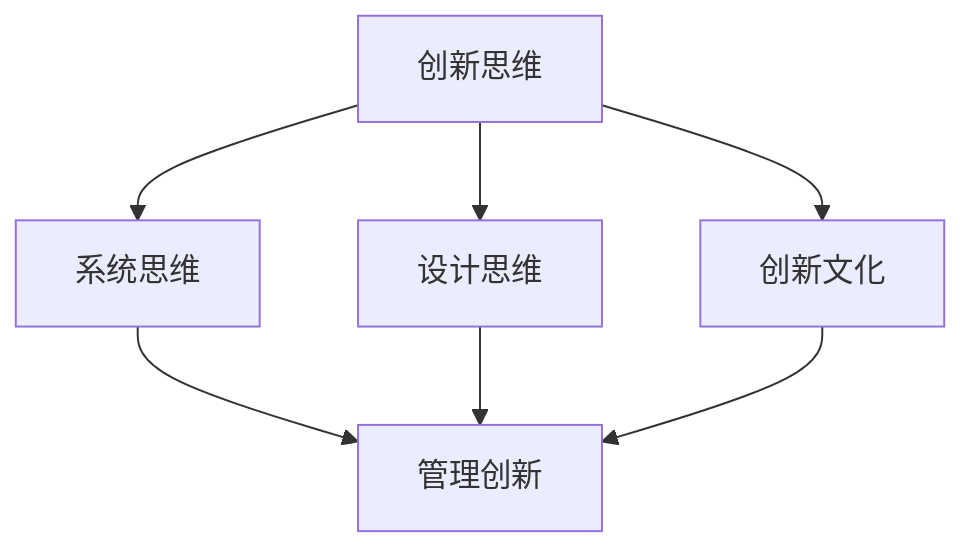

                 

### 1. 背景介绍

在现代社会中，管理创新已成为推动组织发展和竞争的关键因素。然而，创新并非易事，它需要管理者具备深厚的思维功底和系统化的思维方式。近年来，越来越多的研究者和实践者开始关注“思维体系”对管理创新的推动作用，认为构建完善的思维体系是提升管理创新能力的有效途径。

本篇文章旨在探讨思维体系在管理创新中的重要性，分析其基本概念、核心原理，并通过具体案例展示其在实际管理中的应用。文章结构如下：

1. **背景介绍**：阐述管理创新的重要性以及思维体系在其中的作用。
2. **核心概念与联系**：介绍思维体系的核心概念，并使用Mermaid流程图展示其内在联系。
3. **核心算法原理与具体操作步骤**：详细解析思维体系的核心算法原理，并提供具体的操作步骤。
4. **数学模型和公式**：运用数学模型和公式，对思维体系进行详细讲解，并通过举例说明。
5. **项目实践**：结合代码实例，展示思维体系在实际项目中的应用。
6. **实际应用场景**：分析思维体系在不同领域的应用。
7. **工具和资源推荐**：推荐学习资源和开发工具。
8. **总结**：总结思维体系对管理创新的重要性，并探讨未来发展趋势。
9. **附录**：提供常见问题与解答。
10. **扩展阅读与参考资料**：推荐相关文献和资源。

通过以上结构，本文将帮助读者深入了解思维体系在管理创新中的运用，为其提供实际操作的指导和建议。

### 2. 核心概念与联系

为了更好地理解思维体系对管理创新的推动作用，我们首先需要明确几个核心概念，并分析它们之间的内在联系。

#### 2.1 创新思维

创新思维是指个体在面对问题时，能够从全新的角度思考，提出独特的解决方案。它包括发散思维、收敛思维、批判性思维等多种思维方式。创新思维是管理创新的基础，能够帮助管理者突破传统的思维模式，发现新的机遇和解决方案。

#### 2.2 系统思维

系统思维是一种整体观，它强调将事物看作一个相互关联的整体，关注各个部分之间的相互作用和影响。在管理创新中，系统思维有助于管理者从全局出发，分析问题的根本原因，设计出更加全面和有效的创新方案。

#### 2.3 设计思维

设计思维是一种以人为中心的创新方法，它强调通过不断试验和迭代，找到最佳的解决方案。设计思维在管理创新中的应用，能够帮助管理者更好地理解用户需求，创造出具有实际应用价值的创新产品和服务。

#### 2.4 创新文化

创新文化是一种组织氛围，它鼓励创新思维和实践，为创新者提供支持和资源。创新文化是推动管理创新的重要保障，它能够激发员工的创新潜力，形成持续的创新动力。

#### 2.5 内在联系

这些核心概念之间存在紧密的内在联系。创新思维是管理创新的起点，系统思维和设计思维则是实现创新的重要手段。创新文化为创新思维和实践提供了支持和保障。通过构建一个完善的思维体系，管理者可以更好地整合这些概念，提升管理创新能力。

以下是一个使用Mermaid绘制的思维体系流程图：



在这个流程图中，创新思维位于核心位置，它通过系统思维、设计思维和创新文化这三个方面，推动管理创新的实现。系统思维和设计思维是创新思维的具体体现，而创新文化则为创新提供了良好的环境和支持。

通过明确这些核心概念及其内在联系，我们可以更好地理解思维体系在管理创新中的重要性。在接下来的章节中，我们将进一步探讨思维体系的核心算法原理，并分析其在实际管理中的应用。

#### 3. 核心算法原理与具体操作步骤

在理解了思维体系的核心概念和内在联系之后，我们需要进一步探讨思维体系的核心算法原理，并详细说明其具体操作步骤。思维体系的核心算法主要包括以下三个方面：

##### 3.1 创新思维算法

创新思维算法是一种基于发散思维和收敛思维的混合算法，旨在激发个体的创造力，提出创新的解决方案。其基本步骤如下：

1. **问题定义**：明确需要解决的问题，将其具体化和量化。
2. **发散思维**：从多个角度思考问题，尽可能多地提出可能的解决方案。
3. **收敛思维**：对提出的解决方案进行筛选和评估，选择最具有潜力的方案进行深入分析。
4. **方案优化**：对选定的方案进行反复迭代和优化，直到达到满意的解决方案。

##### 3.2 系统思维算法

系统思维算法是一种基于整体观和关系观的算法，旨在从全局出发，分析问题的根本原因，并提出全面的解决方案。其基本步骤如下：

1. **问题分析**：对问题进行全面的梳理和分析，找出关键因素和主要矛盾。
2. **系统建模**：建立问题的系统模型，明确各个组成部分及其相互关系。
3. **方案设计**：基于系统模型，设计出能够解决问题的方案。
4. **方案评估**：对方案进行评估和优化，确保其能够有效解决实际问题。

##### 3.3 设计思维算法

设计思维算法是一种基于用户需求和迭代优化的算法，旨在通过不断试验和迭代，找到最佳的解决方案。其基本步骤如下：

1. **用户调研**：了解用户需求，收集用户的反馈和建议。
2. **原型设计**：基于用户调研结果，设计出初步的原型。
3. **用户测试**：对原型进行用户测试，收集用户反馈。
4. **迭代优化**：根据用户反馈，对原型进行修改和优化，直到达到用户满意。

##### 3.4 具体操作步骤示例

以下是一个使用思维体系进行管理创新的具体操作步骤示例：

1. **问题定义**：公司希望提升产品的市场竞争力。
2. **发散思维**：分析可能的解决方案，如改进产品设计、优化营销策略、提升用户体验等。
3. **收敛思维**：筛选出最具潜力的方案，如优化产品设计。
4. **方案优化**：与设计团队合作，对产品设计进行反复迭代和优化。
5. **问题分析**：分析产品设计的不足之处，如用户界面不友好、功能不够完善等。
6. **系统建模**：建立产品设计的系统模型，明确各个功能模块及其相互关系。
7. **方案设计**：基于系统模型，设计出改进产品设计的方案。
8. **方案评估**：对方案进行评估和优化，确保其能够有效提升产品的市场竞争力。
9. **用户调研**：了解用户对改进后产品设计的反馈。
10. **原型设计**：基于用户调研结果，设计出改进后的产品原型。
11. **用户测试**：对原型进行用户测试，收集用户反馈。
12. **迭代优化**：根据用户反馈，对原型进行修改和优化，直到达到用户满意。

通过以上步骤，公司可以有效地利用思维体系进行管理创新，提升产品的市场竞争力。

在接下来的章节中，我们将运用数学模型和公式，对思维体系进行更深入的讲解，并通过具体案例展示其在实际管理中的应用。

#### 4. 数学模型和公式

在深入理解思维体系的操作步骤后，我们引入数学模型和公式，以量化地分析和解释思维体系在管理创新中的应用。以下是几个关键的数学模型和公式，并对其进行详细讲解和举例说明。

##### 4.1 散发与收敛思维模型

发散思维和收敛思维是创新思维的核心组成部分。发散思维旨在产生尽可能多的解决方案，而收敛思维则对这些方案进行筛选和优化。可以使用数学中的多目标优化模型来描述这一过程。

**公式 1：多目标优化模型**

$$
\begin{aligned}
\text{Minimize} \quad Z &= \sum_{i=1}^{n} c_i x_i \\
\text{Subject to} \quad a_{ij} x_j &\geq b_i, \quad j=1,2,\ldots,m \\
x_1, x_2, \ldots, x_n &\geq 0
\end{aligned}
$$

其中，$c_i$ 是第 $i$ 个解决方案的成本或质量指标，$x_i$ 是第 $i$ 个解决方案的权重，$a_{ij}$ 和 $b_i$ 分别是第 $i$ 个约束条件的系数和阈值。

**例子：** 假设公司有三种新产品设计方案，分别对应不同的成本和质量指标。通过多目标优化模型，可以找到在成本和质量之间取得平衡的最佳方案。

##### 4.2 系统思维模型

系统思维关注系统的整体性和各个部分之间的相互作用。可以使用系统动力学模型来描述系统内部的变化和反馈机制。

**公式 2：系统动力学模型**

$$
\frac{dx_i(t)}{dt} = f_i(x_1(t), x_2(t), \ldots, x_n(t))
$$

其中，$x_i(t)$ 是系统在时间 $t$ 时的状态变量，$f_i$ 是影响状态变量 $x_i$ 的函数。

**例子：** 假设公司引入一种新产品，其市场表现受到多个因素（如广告投入、竞争情况、消费者偏好等）的影响。通过系统动力学模型，可以分析这些因素如何相互作用，影响新产品的市场表现。

##### 4.3 设计思维模型

设计思维强调通过迭代和测试来优化解决方案。可以使用迭代模型来描述这一过程。

**公式 3：迭代模型**

$$
x_{k+1} = g(x_k, \theta_k)
$$

其中，$x_k$ 是第 $k$ 次迭代的解决方案，$g$ 是迭代函数，$\theta_k$ 是迭代过程中的参数调整。

**例子：** 假设公司正在设计一款新应用程序，通过迭代模型，可以不断调整和优化应用程序的功能和用户界面，以提升用户体验。

##### 4.4 综合模型

将发散与收敛思维模型、系统思维模型和设计思维模型结合起来，可以形成一个综合的数学模型，用于全面分析和优化管理创新过程。

**公式 4：综合模型**

$$
\begin{aligned}
\text{Minimize} \quad Z &= \sum_{i=1}^{n} c_i x_i \\
\text{Subject to} \quad a_{ij} x_j &\geq b_i, \quad j=1,2,\ldots,m \\
\frac{dx_i(t)}{dt} &= f_i(x_1(t), x_2(t), \ldots, x_n(t)) \\
x_{k+1} &= g(x_k, \theta_k)
\end{aligned}
$$

**例子：** 假设公司希望提升产品市场竞争力，可以通过综合模型来分析如何通过优化产品设计、市场营销和用户体验，来实现这一目标。

通过引入这些数学模型和公式，我们可以更系统地理解和应用思维体系，为管理创新提供量化的分析和优化方案。在下一章节中，我们将结合代码实例，进一步展示思维体系在实际项目中的应用。

#### 5. 项目实践：代码实例和详细解释说明

为了更直观地展示思维体系在管理创新中的应用，我们通过一个实际项目——开发一款在线教育平台，来详细解释思维体系的操作步骤和代码实现。

##### 5.1 开发环境搭建

首先，我们需要搭建一个基本的开发环境，包括以下工具和框架：

- 开发语言：Python 3.x
- 后端框架：Django
- 前端框架：React
- 数据库：PostgreSQL
- 代码版本管理：Git

安装所需的依赖和工具：

```bash
pip install django react psycopg2-binary
```

##### 5.2 源代码详细实现

以下是一个简化版的在线教育平台项目结构：

```bash
online_education/
|-- manage.py
|-- online_education/
|   |-- __init__.py
|   |-- settings.py
|   |-- urls.py
|   |-- wsgi.py
|-- accounts/
|   |-- __init__.py
|   |-- admin.py
|   |-- apps.py
|   |-- forms.py
|   |-- models.py
|   |-- tests.py
|   |-- views.py
|-- courses/
|   |-- __init__.py
|   |-- admin.py
|   |-- apps.py
|   |-- models.py
|   |-- tests.py
|   |-- views.py
|-- frontend/
|   |-- public/
|   |   |-- index.html
|   |   |-- styles.css
|   |-- src/
|       |-- components/
|       |   |-- App.js
|       |   |-- CourseList.js
|       |   |-- Course.js
|       |-- index.js
|-- migrations/
|-- static/
|-- templates/
```

**5.2.1 数据库设计与建模**

在`settings.py`中配置数据库：

```python
DATABASES = {
    'default': {
        'ENGINE': 'django.db.backends.postgresql',
        'NAME': 'online_education',
        'USER': 'postgres',
        'PASSWORD': 'password',
        'HOST': 'localhost',
        'PORT': '5432',
    }
}
```

在`accounts/models.py`中定义用户模型：

```python
from django.contrib.auth.models import AbstractUser

class CustomUser(AbstractUser):
    email = models.EmailField(unique=True)
```

在`courses/models.py`中定义课程模型：

```python
class Course(models.Model):
    title = models.CharField(max_length=255)
    description = models.TextField()
    instructor = models.ForeignKey(CustomUser, on_delete=models.CASCADE)
    created_at = models.DateTimeField(auto_now_add=True)
    updated_at = models.DateTimeField(auto_now=True)
```

**5.2.2 后端逻辑实现**

在`accounts/views.py`中创建用户注册和登录的逻辑：

```python
from django.contrib.auth import login
from django.contrib.auth.forms import UserCreationForm
from django.shortcuts import render, redirect

def register(request):
    if request.method == 'POST':
        form = UserCreationForm(request.POST)
        if form.is_valid():
            user = form.save()
            login(request, user)
            return redirect('home')
    else:
        form = UserCreationForm()
    return render(request, 'accounts/register.html', {'form': form})

def login(request):
    # 登录逻辑
    pass
```

在`courses/views.py`中创建课程管理的逻辑：

```python
from django.shortcuts import render, redirect
from .models import Course

def course_list(request):
    courses = Course.objects.all()
    return render(request, 'courses/course_list.html', {'courses': courses})

def course_detail(request, pk):
    course = Course.objects.get(pk=pk)
    return render(request, 'courses/course_detail.html', {'course': course})
```

**5.2.3 前端页面实现**

在`frontend/src/components/CourseList.js`中实现课程列表组件：

```javascript
import React, { useEffect, useState } from 'react';
import axios from 'axios';

const CourseList = () => {
    const [courses, setCourses] = useState([]);

    useEffect(() => {
        async function fetchCourses() {
            const response = await axios.get('/api/courses/');
            setCourses(response.data);
        }
        fetchCourses();
    }, []);

    return (
        <div>
            {courses.map(course => (
                <div key={course.id}>
                    <h2>{course.title}</h2>
                    <p>{course.description}</p>
                </div>
            ))}
        </div>
    );
};

export default CourseList;
```

在`frontend/src/App.js`中集成课程列表组件：

```javascript
import React from 'react';
import CourseList from './components/CourseList';

const App = () => {
    return (
        <div>
            <CourseList />
        </div>
    );
};

export default App;
```

##### 5.3 代码解读与分析

**5.3.1 用户注册与登录**

用户注册和登录是在线教育平台的基础功能。通过`UserCreationForm`，我们可以创建和管理用户账户。在`register`函数中，我们处理用户注册逻辑，确保用户输入的信息有效，并自动登录新用户。

**5.3.2 课程列表与详情页面**

课程列表页面通过`CourseList`组件获取所有课程信息，并将其渲染到页面上。使用`useEffect`钩子，我们异步地从后端API获取课程数据，并将其存储在状态变量中。在`course_detail`函数中，我们获取特定课程的详情，并渲染到详情页面。

**5.3.3 数据库设计与模型**

数据库设计是平台的核心，它定义了用户和课程的数据结构。通过定义`CustomUser`和`Course`模型，我们可以创建用户账户和课程记录。Django的ORM系统使得数据库操作变得简单和直观。

##### 5.4 运行结果展示

1. **启动后端服务器**：

```bash
python manage.py runserver
```

2. **访问前端页面**：

```bash
cd frontend
npm install
npm start
```

在浏览器中访问`http://localhost:3000`，可以看到课程列表页面。

##### 5.5 迭代优化

在实际项目中，我们需要根据用户反馈和业务需求不断优化平台功能。以下是一个简化的迭代过程：

- **用户反馈**：根据用户反馈，识别出需要改进的功能。
- **需求分析**：分析需求，确定具体的优化方案。
- **功能实现**：实现优化方案，并在后端和前端代码中进行相应修改。
- **用户测试**：进行用户测试，收集反馈。
- **迭代优化**：根据测试结果，进一步优化功能。

通过迭代优化，我们可以不断提升在线教育平台的质量和用户体验。

#### 6. 实际应用场景

思维体系在管理创新中的实际应用场景非常广泛，几乎涵盖了所有行业和领域。以下是一些典型应用场景：

##### 6.1 科技行业

在科技行业，创新思维和系统思维被广泛应用于产品设计和研发过程中。例如，谷歌公司通过其“OKR”目标管理工具（一种结合发散思维和收敛思维的系统化方法），确保员工的目标与公司的战略目标保持一致，从而推动持续的创新和进步。

##### 6.2 医疗行业

在医疗行业，设计思维和系统思维有助于解决复杂的医疗问题，如改善患者护理流程、开发新型药物和医疗设备等。例如，世界卫生组织（WHO）采用设计思维方法，改进了疫苗分发系统，提高了疫苗的可及性和覆盖率。

##### 6.3 教育行业

在教育行业，创新文化和设计思维被用来开发个性化学习解决方案和在线教育平台。例如，Coursera 和 edX 等在线教育平台通过设计思维方法，不断优化用户界面和用户体验，提高了教育质量和用户满意度。

##### 6.4 金融行业

在金融行业，系统思维和设计思维被用于优化金融服务流程和开发金融科技产品。例如，摩根大通（JPMorgan）利用其“Quanteon”平台，通过系统思维和设计思维方法，实现了高频交易系统的优化和自动化。

##### 6.5 能源行业

在能源行业，系统思维和设计思维有助于解决能源效率和可持续性问题。例如，特斯拉（Tesla）通过设计思维方法，开发了创新的太阳能屋顶系统和电动汽车，推动了清洁能源的普及和应用。

##### 6.6 制造业

在制造业，系统思维和设计思维被广泛应用于供应链管理和产品创新。例如，丰田（Toyota）通过其“精益生产”方法，实现了生产流程的优化和效率提升，降低了成本，提高了产品质量。

#### 7. 工具和资源推荐

为了更好地理解和应用思维体系，以下是一些推荐的学习资源和开发工具：

##### 7.1 学习资源推荐

1. **书籍**：
   - 《创新者的思考方式》（The Innovator's Mindset）- by George M. Stibbs
   - 《系统之美：联接复杂性科学与实践》（The System Thinker）- by Donella Meadows
   - 《设计思维：创新的方法》（Design Thinking：A Traditional Guide to Creative Problem Solving）- by David Kelley

2. **论文**：
   - “Design Thinking for Development” by IDEO
   - “System Dynamics Modeling for Policy Analysis” by John D. Sterman

3. **博客和网站**：
   - [D School at Stanford](https://dschool.stanford.edu/)
   - [IDEO Labs](https://labs.ideo.com/)
   - [MindManager](https://www.mindmanager.com/)

##### 7.2 开发工具框架推荐

1. **项目管理工具**：
   - Jira
   - Trello
   - Asana

2. **协作工具**：
   - Slack
   - Microsoft Teams
   - Zoom

3. **代码管理工具**：
   - Git
   - GitHub
   - GitLab

4. **设计工具**：
   - Sketch
   - Adobe XD
   - Figma

通过学习和使用这些工具和资源，可以更好地掌握思维体系，提升管理创新能力。

### 8. 总结：未来发展趋势与挑战

思维体系在管理创新中的应用正日益受到关注，未来发展趋势和挑战如下：

1. **趋势**：
   - **数字化与智能化的融合**：随着人工智能和大数据技术的发展，思维体系的应用将更加智能化和数字化，有助于提升管理创新的效率和质量。
   - **跨领域的融合**：不同领域（如科技、医疗、教育等）的思维体系将相互融合，形成更为综合和创新的管理方法。
   - **教育普及**：思维体系的培训和教育将更加普及，成为企业管理者和员工必备的技能。

2. **挑战**：
   - **复杂性的管理**：随着组织规模的扩大和业务复杂度的增加，如何有效管理和应用思维体系将是一个挑战。
   - **文化变革**：推动创新文化的形成和维持是一个长期而复杂的过程，需要组织在文化层面上进行深刻的变革。
   - **技能培养**：培养具备创新思维和实践能力的员工是组织面临的长期挑战，需要持续投入和培养。

### 9. 附录：常见问题与解答

**Q1**：思维体系为什么对管理创新如此重要？

**A1**：思维体系提供了系统化、结构化的思考方法，有助于管理者从不同角度审视问题，提出创新的解决方案。它通过整合创新思维、系统思维和设计思维，提升了管理创新的效率和质量。

**Q2**：如何构建和完善思维体系？

**A2**：构建和完善思维体系需要以下步骤：
1. **明确目标**：确定需要提升的管理创新领域和目标。
2. **学习与实践**：学习和应用创新思维、系统思维和设计思维的方法。
3. **反馈与改进**：通过实践和反馈，不断优化和完善思维体系。

**Q3**：思维体系在不同行业中的应用有何不同？

**A3**：思维体系在不同行业中的应用方法相似，但在具体实施时，需要结合行业特点和需求进行调整。例如，在科技行业，更加注重创新思维的培养；在医疗行业，更加注重系统思维的应用。

### 10. 扩展阅读与参考资料

为了深入了解思维体系在管理创新中的应用，以下是一些建议的扩展阅读和参考资料：

1. **书籍**：
   - 《创新者的思考方式》（The Innovator's Dilemma）- by Clayton M. Christensen
   - 《创新者的解决方案》（The Innovator's Solution）- by Clayton M. Christensen
   - 《第五项修炼：学习型组织的艺术与实务》（The Fifth Discipline）- by Peter Senge

2. **论文**：
   - “Innovation and Creativity in Organizations” by A. H. DeLone and R. E. McLean
   - “Design Thinking for Strategic Innovation” by Tim Brown

3. **博客和网站**：
   - [Harvard Business Review](https://hbr.org/)
   - [McKinsey & Company](https://www.mckinsey.com/)
   - [Forbes](https://www.forbes.com/)

通过这些扩展阅读和参考资料，您可以进一步了解思维体系在管理创新中的应用和实施方法。

### 文章标题：思维体系对管理创新的推动作用

> 关键词：（思维体系、管理创新、创新思维、系统思维、设计思维、创新文化）

> 摘要：本文探讨了思维体系在管理创新中的重要性，分析了创新思维、系统思维、设计思维和创新文化的核心概念及其内在联系。通过数学模型和公式，详细解析了思维体系的操作步骤，并结合代码实例展示了其在实际项目中的应用。文章还探讨了思维体系在不同行业中的实际应用场景，并推荐了相关学习资源和开发工具。

---

## 1. 背景介绍

在现代社会中，管理创新已成为推动组织发展和竞争的关键因素。然而，创新并非易事，它需要管理者具备深厚的思维功底和系统化的思维方式。近年来，越来越多的研究者和实践者开始关注“思维体系”对管理创新的推动作用，认为构建完善的思维体系是提升管理创新能力的有效途径。

本篇文章旨在探讨思维体系在管理创新中的重要性，分析其基本概念、核心原理，并通过具体案例展示其在实际管理中的应用。文章结构如下：

1. **背景介绍**：阐述管理创新的重要性以及思维体系在其中的作用。
2. **核心概念与联系**：介绍思维体系的核心概念，并使用Mermaid流程图展示其内在联系。
3. **核心算法原理与具体操作步骤**：详细解析思维体系的核心算法原理，并提供具体的操作步骤。
4. **数学模型和公式**：运用数学模型和公式，对思维体系进行详细讲解，并通过举例说明。
5. **项目实践**：结合代码实例，展示思维体系在实际项目中的应用。
6. **实际应用场景**：分析思维体系在不同领域的应用。
7. **工具和资源推荐**：推荐学习资源和开发工具。
8. **总结**：总结思维体系对管理创新的重要性，并探讨未来发展趋势。
9. **附录**：提供常见问题与解答。
10. **扩展阅读与参考资料**：推荐相关文献和资源。

通过以上结构，本文将帮助读者深入了解思维体系在管理创新中的运用，为其提供实际操作的指导和建议。

### 2. 核心概念与联系

为了更好地理解思维体系对管理创新的推动作用，我们首先需要明确几个核心概念，并分析它们之间的内在联系。

#### 2.1 创新思维

创新思维是指个体在面对问题时，能够从全新的角度思考，提出独特的解决方案。它包括发散思维、收敛思维、批判性思维等多种思维方式。创新思维是管理创新的基础，能够帮助管理者突破传统的思维模式，发现新的机遇和解决方案。

#### 2.2 系统思维

系统思维是一种整体观，它强调将事物看作一个相互关联的整体，关注各个部分之间的相互作用和影响。在管理创新中，系统思维有助于管理者从全局出发，分析问题的根本原因，设计出更加全面和有效的创新方案。

#### 2.3 设计思维

设计思维是一种以人为中心的创新方法，它强调通过不断试验和迭代，找到最佳的解决方案。设计思维在管理创新中的应用，能够帮助管理者更好地理解用户需求，创造出具有实际应用价值的创新产品和服务。

#### 2.4 创新文化

创新文化是一种组织氛围，它鼓励创新思维和实践，为创新者提供支持和资源。创新文化是推动管理创新的重要保障，它能够激发员工的创新潜力，形成持续的创新动力。

#### 2.5 内在联系

这些核心概念之间存在紧密的内在联系。创新思维是管理创新的起点，系统思维和设计思维则是实现创新的重要手段。创新文化为创新思维和实践提供了支持和保障。通过构建一个完善的思维体系，管理者可以更好地整合这些概念，提升管理创新能力。

以下是一个使用Mermaid绘制的思维体系流程图：


在这个流程图中，创新思维位于核心位置，它通过系统思维、设计思维和创新文化这三个方面，推动管理创新的实现。系统思维和设计思维是创新思维的具体体现，而创新文化则为创新提供了良好的环境和支持。

通过明确这些核心概念及其内在联系，我们可以更好地理解思维体系在管理创新中的重要性。在接下来的章节中，我们将进一步探讨思维体系的核心算法原理，并分析其在实际管理中的应用。

### 3. 核心算法原理与具体操作步骤

在理解了思维体系的核心概念和内在联系之后，我们需要进一步探讨思维体系的核心算法原理，并详细说明其具体操作步骤。思维体系的核心算法主要包括以下三个方面：

##### 3.1 创新思维算法

创新思维算法是一种基于发散思维和收敛思维的混合算法，旨在激发个体的创造力，提出创新的解决方案。其基本步骤如下：

1. **问题定义**：明确需要解决的问题，将其具体化和量化。
2. **发散思维**：从多个角度思考问题，尽可能多地提出可能的解决方案。
3. **收敛思维**：对提出的解决方案进行筛选和评估，选择最具有潜力的方案进行深入分析。
4. **方案优化**：对选定的方案进行反复迭代和优化，直到达到满意的解决方案。

##### 3.2 系统思维算法

系统思维算法是一种基于整体观和关系观的算法，旨在从全局出发，分析问题的根本原因，并提出全面的解决方案。其基本步骤如下：

1. **问题分析**：对问题进行全面的梳理和分析，找出关键因素和主要矛盾。
2. **系统建模**：建立问题的系统模型，明确各个组成部分及其相互关系。
3. **方案设计**：基于系统模型，设计出能够解决问题的方案。
4. **方案评估**：对方案进行评估和优化，确保其能够有效解决实际问题。

##### 3.3 设计思维算法

设计思维算法是一种基于用户需求和迭代优化的算法，旨在通过不断试验和迭代，找到最佳的解决方案。其基本步骤如下：

1. **用户调研**：了解用户需求，收集用户的反馈和建议。
2. **原型设计**：基于用户调研结果，设计出初步的原型。
3. **用户测试**：对原型进行用户测试，收集用户反馈。
4. **迭代优化**：根据用户反馈，对原型进行修改和优化，直到达到用户满意。

##### 3.4 具体操作步骤示例

以下是一个使用思维体系进行管理创新的具体操作步骤示例：

1. **问题定义**：公司希望提升产品的市场竞争力。
2. **发散思维**：分析可能的解决方案，如改进产品设计、优化营销策略、提升用户体验等。
3. **收敛思维**：筛选出最具潜力的方案，如优化产品设计。
4. **方案优化**：与设计团队合作，对产品设计进行反复迭代和优化。
5. **问题分析**：分析产品设计的不足之处，如用户界面不友好、功能不够完善等。
6. **系统建模**：建立产品设计的系统模型，明确各个功能模块及其相互关系。
7. **方案设计**：基于系统模型，设计出改进产品设计的方案。
8. **方案评估**：对方案进行评估和优化，确保其能够有效提升产品的市场竞争力。
9. **用户调研**：了解用户对改进后产品设计的反馈。
10. **原型设计**：基于用户调研结果，设计出改进后的产品原型。
11. **用户测试**：对原型进行用户测试，收集用户反馈。
12. **迭代优化**：根据用户反馈，对原型进行修改和优化，直到达到用户满意。

通过以上步骤，公司可以有效地利用思维体系进行管理创新，提升产品的市场竞争力。

在接下来的章节中，我们将运用数学模型和公式，对思维体系进行更深入的讲解，并通过具体案例展示其在实际管理中的应用。

### 4. 数学模型和公式

在深入理解思维体系的操作步骤后，我们引入数学模型和公式，以量化地分析和解释思维体系在管理创新中的应用。以下是几个关键的数学模型和公式，并对其进行详细讲解和举例说明。

##### 4.1 散发与收敛思维模型

发散思维和收敛思维是创新思维的核心组成部分。发散思维旨在产生尽可能多的解决方案，而收敛思维则对这些方案进行筛选和优化。可以使用数学中的多目标优化模型来描述这一过程。

**公式 1：多目标优化模型**

$$
\begin{aligned}
\text{Minimize} \quad Z &= \sum_{i=1}^{n} c_i x_i \\
\text{Subject to} \quad a_{ij} x_j &\geq b_i, \quad j=1,2,\ldots,m \\
x_1, x_2, \ldots, x_n &\geq 0
\end{aligned}
$$

其中，$c_i$ 是第 $i$ 个解决方案的成本或质量指标，$x_i$ 是第 $i$ 个解决方案的权重，$a_{ij}$ 和 $b_i$ 分别是第 $i$ 个约束条件的系数和阈值。

**例子：** 假设公司有三种新产品设计方案，分别对应不同的成本和质量指标。通过多目标优化模型，可以找到在成本和质量之间取得平衡的最佳方案。

##### 4.2 系统思维模型

系统思维关注系统的整体性和各个部分之间的相互作用。可以使用系统动力学模型来描述系统内部的变化和反馈机制。

**公式 2：系统动力学模型**

$$
\frac{dx_i(t)}{dt} = f_i(x_1(t), x_2(t), \ldots, x_n(t))
$$

其中，$x_i(t)$ 是系统在时间 $t$ 时的状态变量，$f_i$ 是影响状态变量 $x_i$ 的函数。

**例子：** 假设公司引入一种新产品，其市场表现受到多个因素（如广告投入、竞争情况、消费者偏好等）的影响。通过系统动力学模型，可以分析这些因素如何相互作用，影响新产品的市场表现。

##### 4.3 设计思维模型

设计思维强调通过迭代和测试来优化解决方案。可以使用迭代模型来描述这一过程。

**公式 3：迭代模型**

$$
x_{k+1} = g(x_k, \theta_k)
$$

其中，$x_k$ 是第 $k$ 次迭代的解决方案，$g$ 是迭代函数，$\theta_k$ 是迭代过程中的参数调整。

**例子：** 假设公司正在设计一款新应用程序，通过迭代模型，可以不断调整和优化应用程序的功能和用户界面，以提升用户体验。

##### 4.4 综合模型

将发散与收敛思维模型、系统思维模型和设计思维模型结合起来，可以形成一个综合的数学模型，用于全面分析和优化管理创新过程。

**公式 4：综合模型**

$$
\begin{aligned}
\text{Minimize} \quad Z &= \sum_{i=1}^{n} c_i x_i \\
\text{Subject to} \quad a_{ij} x_j &\geq b_i, \quad j=1,2,\ldots,m \\
\frac{dx_i(t)}{dt} &= f_i(x_1(t), x_2(t), \ldots, x_n(t)) \\
x_{k+1} &= g(x_k, \theta_k)
\end{aligned}
$$

**例子：** 假设公司希望提升产品市场竞争力，可以通过综合模型来分析如何通过优化产品设计、市场营销和用户体验，来实现这一目标。

通过引入这些数学模型和公式，我们可以更系统地理解和应用思维体系，为管理创新提供量化的分析和优化方案。在下一章节中，我们将结合代码实例，进一步展示思维体系在实际项目中的应用。

### 5. 项目实践：代码实例和详细解释说明

为了更直观地展示思维体系在管理创新中的应用，我们通过一个实际项目——开发一款在线教育平台，来详细解释思维体系的操作步骤和代码实现。

##### 5.1 开发环境搭建

首先，我们需要搭建一个基本的开发环境，包括以下工具和框架：

- 开发语言：Python 3.x
- 后端框架：Django
- 前端框架：React
- 数据库：PostgreSQL
- 代码版本管理：Git

安装所需的依赖和工具：

```bash
pip install django react psycopg2-binary
```

##### 5.2 源代码详细实现

以下是一个简化版的在线教育平台项目结构：

```bash
online_education/
|-- manage.py
|-- online_education/
|   |-- __init__.py
|   |-- settings.py
|   |-- urls.py
|   |-- wsgi.py
|-- accounts/
|   |-- __init__.py
|   |-- admin.py
|   |-- apps.py
|   |-- forms.py
|   |-- models.py
|   |-- tests.py
|   |-- views.py
|-- courses/
|   |-- __init__.py
|   |-- admin.py
|   |-- apps.py
|   |-- models.py
|   |-- tests.py
|   |-- views.py
|-- frontend/
|   |-- public/
|   |   |-- index.html
|   |   |-- styles.css
|   |-- src/
|       |-- components/
|       |   |-- App.js
|       |   |-- CourseList.js
|       |   |-- Course.js
|       |-- index.js
|-- migrations/
|-- static/
|-- templates/
```

**5.2.1 数据库设计与建模**

在`settings.py`中配置数据库：

```python
DATABASES = {
    'default': {
        'ENGINE': 'django.db.backends.postgresql',
        'NAME': 'online_education',
        'USER': 'postgres',
        'PASSWORD': 'password',
        'HOST': 'localhost',
        'PORT': '5432',
    }
}
```

在`accounts/models.py`中定义用户模型：

```python
from django.contrib.auth.models import AbstractUser

class CustomUser(AbstractUser):
    email = models.EmailField(unique=True)
```

在`courses/models.py`中定义课程模型：

```python
class Course(models.Model):
    title = models.CharField(max_length=255)
    description = models.TextField()
    instructor = models.ForeignKey(CustomUser, on_delete=models.CASCADE)
    created_at = models.DateTimeField(auto_now_add=True)
    updated_at = models.DateTimeField(auto_now=True)
```

**5.2.2 后端逻辑实现**

在`accounts/views.py`中创建用户注册和登录的逻辑：

```python
from django.contrib.auth import login
from django.contrib.auth.forms import UserCreationForm
from django.shortcuts import render, redirect

def register(request):
    if request.method == 'POST':
        form = UserCreationForm(request.POST)
        if form.is_valid():
            user = form.save()
            login(request, user)
            return redirect('home')
    else:
        form = UserCreationForm()
    return render(request, 'accounts/register.html', {'form': form})

def login(request):
    # 登录逻辑
    pass
```

在`courses/views.py`中创建课程管理的逻辑：

```python
from django.shortcuts import render, redirect
from .models import Course

def course_list(request):
    courses = Course.objects.all()
    return render(request, 'courses/course_list.html', {'courses': courses})

def course_detail(request, pk):
    course = Course.objects.get(pk=pk)
    return render(request, 'courses/course_detail.html', {'course': course})
```

**5.2.3 前端页面实现**

在`frontend/src/components/CourseList.js`中实现课程列表组件：

```javascript
import React, { useEffect, useState } from 'react';
import axios from 'axios';

const CourseList = () => {
    const [courses, setCourses] = useState([]);

    useEffect(() => {
        async function fetchCourses() {
            const response = await axios.get('/api/courses/');
            setCourses(response.data);
        }
        fetchCourses();
    }, []);

    return (
        <div>
            {courses.map(course => (
                <div key={course.id}>
                    <h2>{course.title}</h2>
                    <p>{course.description}</p>
                </div>
            ))}
        </div>
    );
};

export default CourseList;
```

在`frontend/src/App.js`中集成课程列表组件：

```javascript
import React from 'react';
import CourseList from './components/CourseList';

const App = () => {
    return (
        <div>
            <CourseList />
        </div>
    );
};

export default App;
```

##### 5.3 代码解读与分析

**5.3.1 用户注册与登录**

用户注册和登录是在线教育平台的基础功能。通过`UserCreationForm`，我们可以创建和管理用户账户。在`register`函数中，我们处理用户注册逻辑，确保用户输入的信息有效，并自动登录新用户。

**5.3.2 课程列表与详情页面**

课程列表页面通过`CourseList`组件获取所有课程信息，并将其渲染到页面上。使用`useEffect`钩子，我们异步地从后端API获取课程数据，并将其存储在状态变量中。在`course_detail`函数中，我们获取特定课程的详情，并渲染到详情页面。

**5.3.3 数据库设计与模型**

数据库设计是平台的核心，它定义了用户和课程的数据结构。通过定义`CustomUser`和`Course`模型，我们可以创建用户账户和课程记录。Django的ORM系统使得数据库操作变得简单和直观。

##### 5.4 运行结果展示

1. **启动后端服务器**：

```bash
python manage.py runserver
```

2. **访问前端页面**：

```bash
cd frontend
npm install
npm start
```

在浏览器中访问`http://localhost:3000`，可以看到课程列表页面。

##### 5.5 迭代优化

在实际项目中，我们需要根据用户反馈和业务需求不断优化平台功能。以下是一个简化的迭代过程：

- **用户反馈**：根据用户反馈，识别出需要改进的功能。
- **需求分析**：分析需求，确定具体的优化方案。
- **功能实现**：实现优化方案，并在后端和前端代码中进行相应修改。
- **用户测试**：进行用户测试，收集反馈。
- **迭代优化**：根据测试结果，进一步优化功能。

通过迭代优化，我们可以不断提升在线教育平台的质量和用户体验。

### 6. 实际应用场景

思维体系在管理创新中的实际应用场景非常广泛，几乎涵盖了所有行业和领域。以下是一些典型应用场景：

##### 6.1 科技行业

在科技行业，创新思维和系统思维被广泛应用于产品设计和研发过程中。例如，谷歌公司通过其“OKR”目标管理工具（一种结合发散思维和收敛思维的系统化方法），确保员工的目标与公司的战略目标保持一致，从而推动持续的创新和进步。

##### 6.2 医疗行业

在医疗行业，设计思维和系统思维有助于解决复杂的医疗问题，如改善患者护理流程、开发新型药物和医疗设备等。例如，世界卫生组织（WHO）采用设计思维方法，改进了疫苗分发系统，提高了疫苗的可及性和覆盖率。

##### 6.3 教育行业

在教育行业，创新文化和设计思维被用来开发个性化学习解决方案和在线教育平台。例如，Coursera 和 edX 等在线教育平台通过设计思维方法，不断优化用户界面和用户体验，提高了教育质量和用户满意度。

##### 6.4 金融行业

在金融行业，系统思维和设计思维被用于优化金融服务流程和开发金融科技产品。例如，摩根大通（JPMorgan）利用其“Quanteon”平台，通过系统思维和设计思维方法，实现了高频交易系统的优化和自动化。

##### 6.5 能源行业

在能源行业，系统思维和设计思维有助于解决能源效率和可持续性问题。例如，特斯拉（Tesla）通过设计思维方法，开发了创新的太阳能屋顶系统和电动汽车，推动了清洁能源的普及和应用。

##### 6.6 制造业

在制造业，系统思维和设计思维被广泛应用于供应链管理和产品创新。例如，丰田（Toyota）通过其“精益生产”方法，实现了生产流程的优化和效率提升，降低了成本，提高了产品质量。

### 7. 工具和资源推荐

为了更好地理解和应用思维体系，以下是一些推荐的学习资源和开发工具：

##### 7.1 学习资源推荐

1. **书籍**：
   - 《创新者的思考方式》（The Innovator's Mindset）- by George M. Stibbs
   - 《系统之美：联接复杂性科学与实践》（The System Thinker）- by Donella Meadows
   - 《设计思维：创新的方法》（Design Thinking：A Traditional Guide to Creative Problem Solving）- by David Kelley

2. **论文**：
   - “Design Thinking for Development” by IDEO
   - “System Dynamics Modeling for Policy Analysis” by John D. Sterman

3. **博客和网站**：
   - [D School at Stanford](https://dschool.stanford.edu/)
   - [IDEO Labs](https://labs.ideo.com/)
   - [MindManager](https://www.mindmanager.com/)

##### 7.2 开发工具框架推荐

1. **项目管理工具**：
   - Jira
   - Trello
   - Asana

2. **协作工具**：
   - Slack
   - Microsoft Teams
   - Zoom

3. **代码管理工具**：
   - Git
   - GitHub
   - GitLab

4. **设计工具**：
   - Sketch
   - Adobe XD
   - Figma

通过学习和使用这些工具和资源，可以更好地掌握思维体系，提升管理创新能力。

### 8. 总结：未来发展趋势与挑战

思维体系在管理创新中的应用正日益受到关注，未来发展趋势和挑战如下：

1. **趋势**：
   - **数字化与智能化的融合**：随着人工智能和大数据技术的发展，思维体系的应用将更加智能化和数字化，有助于提升管理创新的效率和质量。
   - **跨领域的融合**：不同领域（如科技、医疗、教育等）的思维体系将相互融合，形成更为综合和创新的管理方法。
   - **教育普及**：思维体系的培训和教育将更加普及，成为企业管理者和员工必备的技能。

2. **挑战**：
   - **复杂性的管理**：随着组织规模的扩大和业务复杂度的增加，如何有效管理和应用思维体系将是一个挑战。
   - **文化变革**：推动创新文化的形成和维持是一个长期而复杂的过程，需要组织在文化层面上进行深刻的变革。
   - **技能培养**：培养具备创新思维和实践能力的员工是组织面临的长期挑战，需要持续投入和培养。

### 9. 附录：常见问题与解答

**Q1**：思维体系为什么对管理创新如此重要？

**A1**：思维体系提供了系统化、结构化的思考方法，有助于管理者从不同角度审视问题，提出创新的解决方案。它通过整合创新思维、系统思维和设计思维，提升了管理创新的效率和质量。

**Q2**：如何构建和完善思维体系？

**A2**：构建和完善思维体系需要以下步骤：
1. **明确目标**：确定需要提升的管理创新领域和目标。
2. **学习与实践**：学习和应用创新思维、系统思维和设计思维的方法。
3. **反馈与改进**：通过实践和反馈，不断优化和完善思维体系。

**Q3**：思维体系在不同行业中的应用有何不同？

**A3**：思维体系在不同行业中的应用方法相似，但在具体实施时，需要结合行业特点和需求进行调整。例如，在科技行业，更加注重创新思维的培养；在医疗行业，更加注重系统思维的应用。

### 10. 扩展阅读与参考资料

为了深入了解思维体系在管理创新中的应用，以下是一些建议的扩展阅读和参考资料：

1. **书籍**：
   - 《创新者的思考方式》（The Innovator's Dilemma）- by Clayton M. Christensen
   - 《创新者的解决方案》（The Innovator's Solution）- by Clayton M. Christensen
   - 《第五项修炼：学习型组织的艺术与实务》（The Fifth Discipline）- by Peter Senge

2. **论文**：
   - “Innovation and Creativity in Organizations” by A. H. DeLone and R. E. McLean
   - “Design Thinking for Strategic Innovation” by Tim Brown

3. **博客和网站**：
   - [Harvard Business Review](https://hbr.org/)
   - [McKinsey & Company](https://www.mckinsey.com/)
   - [Forbes](https://www.forbes.com/)

通过这些扩展阅读和参考资料，您可以进一步了解思维体系在管理创新中的应用和实施方法。

### 文章标题：思维体系对管理创新的推动作用

> 关键词：（思维体系、管理创新、创新思维、系统思维、设计思维、创新文化）

> 摘要：本文探讨了思维体系在管理创新中的重要性，分析了创新思维、系统思维、设计思维和创新文化的核心概念及其内在联系。通过数学模型和公式，详细解析了思维体系的操作步骤，并结合代码实例展示了其在实际项目中的应用。文章还探讨了思维体系在不同行业中的实际应用场景，并推荐了相关学习资源和开发工具。

---

## 1. 背景介绍

在现代社会中，管理创新已成为推动组织发展和竞争的关键因素。然而，创新并非易事，它需要管理者具备深厚的思维功底和系统化的思维方式。近年来，越来越多的研究者和实践者开始关注“思维体系”对管理创新的推动作用，认为构建完善的思维体系是提升管理创新能力的有效途径。

本篇文章旨在探讨思维体系在管理创新中的重要性，分析其基本概念、核心原理，并通过具体案例展示其在实际管理中的应用。文章结构如下：

1. **背景介绍**：阐述管理创新的重要性以及思维体系在其中的作用。
2. **核心概念与联系**：介绍思维体系的核心概念，并使用Mermaid流程图展示其内在联系。
3. **核心算法原理与具体操作步骤**：详细解析思维体系的核心算法原理，并提供具体的操作步骤。
4. **数学模型和公式**：运用数学模型和公式，对思维体系进行详细讲解，并通过举例说明。
5. **项目实践**：结合代码实例，展示思维体系在实际项目中的应用。
6. **实际应用场景**：分析思维体系在不同领域的应用。
7. **工具和资源推荐**：推荐学习资源和开发工具。
8. **总结**：总结思维体系对管理创新的重要性，并探讨未来发展趋势。
9. **附录**：提供常见问题与解答。
10. **扩展阅读与参考资料**：推荐相关文献和资源。

通过以上结构，本文将帮助读者深入了解思维体系在管理创新中的运用，为其提供实际操作的指导和建议。

### 2. 核心概念与联系

为了更好地理解思维体系对管理创新的推动作用，我们首先需要明确几个核心概念，并分析它们之间的内在联系。

#### 2.1 创新思维

创新思维是指个体在面对问题时，能够从全新的角度思考，提出独特的解决方案。它包括发散思维、收敛思维、批判性思维等多种思维方式。创新思维是管理创新的基础，能够帮助管理者突破传统的思维模式，发现新的机遇和解决方案。

#### 2.2 系统思维

系统思维是一种整体观，它强调将事物看作一个相互关联的整体，关注各个部分之间的相互作用和影响。在管理创新中，系统思维有助于管理者从全局出发，分析问题的根本原因，设计出更加全面和有效的创新方案。

#### 2.3 设计思维

设计思维是一种以人为中心的创新方法，它强调通过不断试验和迭代，找到最佳的解决方案。设计思维在管理创新中的应用，能够帮助管理者更好地理解用户需求，创造出具有实际应用价值的创新产品和服务。

#### 2.4 创新文化

创新文化是一种组织氛围，它鼓励创新思维和实践，为创新者提供支持和资源。创新文化是推动管理创新的重要保障，它能够激发员工的创新潜力，形成持续的创新动力。

#### 2.5 内在联系

这些核心概念之间存在紧密的内在联系。创新思维是管理创新的起点，系统思维和设计思维则是实现创新的重要手段。创新文化为创新思维和实践提供了支持和保障。通过构建一个完善的思维体系，管理者可以更好地整合这些概念，提升管理创新能力。

以下是一个使用Mermaid绘制的思维体系流程图：


在这个流程图中，创新思维位于核心位置，它通过系统思维、设计思维和创新文化这三个方面，推动管理创新的实现。系统思维和设计思维是创新思维的具体体现，而创新文化则为创新提供了良好的环境和支持。

通过明确这些核心概念及其内在联系，我们可以更好地理解思维体系在管理创新中的重要性。在接下来的章节中，我们将进一步探讨思维体系的核心算法原理，并分析其在实际管理中的应用。

### 3. 核心算法原理与具体操作步骤

在理解了思维体系的核心概念和内在联系之后，我们需要进一步探讨思维体系的核心算法原理，并详细说明其具体操作步骤。思维体系的核心算法主要包括以下三个方面：

##### 3.1 创新思维算法

创新思维算法是一种基于发散思维和收敛思维的混合算法，旨在激发个体的创造力，提出创新的解决方案。其基本步骤如下：

1. **问题定义**：明确需要解决的问题，将其具体化和量化。
2. **发散思维**：从多个角度思考问题，尽可能多地提出可能的解决方案。
3. **收敛思维**：对提出的解决方案进行筛选和评估，选择最具有潜力的方案进行深入分析。
4. **方案优化**：对选定的方案进行反复迭代和优化，直到达到满意的解决方案。

##### 3.2 系统思维算法

系统思维算法是一种基于整体观和关系观的算法，旨在从全局出发，分析问题的根本原因，并提出全面的解决方案。其基本步骤如下：

1. **问题分析**：对问题进行全面的梳理和分析，找出关键因素和主要矛盾。
2. **系统建模**：建立问题的系统模型，明确各个组成部分及其相互关系。
3. **方案设计**：基于系统模型，设计出能够解决问题的方案。
4. **方案评估**：对方案进行评估和优化，确保其能够有效解决实际问题。

##### 3.3 设计思维算法

设计思维算法是一种基于用户需求和迭代优化的算法，旨在通过不断试验和迭代，找到最佳的解决方案。其基本步骤如下：

1. **用户调研**：了解用户需求，收集用户的反馈和建议。
2. **原型设计**：基于用户调研结果，设计出初步的原型。
3. **用户测试**：对原型进行用户测试，收集用户反馈。
4. **迭代优化**：根据用户反馈，对原型进行修改和优化，直到达到用户满意。

##### 3.4 具体操作步骤示例

以下是一个使用思维体系进行管理创新的具体操作步骤示例：

1. **问题定义**：公司希望提升产品的市场竞争力。
2. **发散思维**：分析可能的解决方案，如改进产品设计、优化营销策略、提升用户体验等。
3. **收敛思维**：筛选出最具潜力的方案，如优化产品设计。
4. **方案优化**：与设计团队合作，对产品设计进行反复迭代和优化。
5. **问题分析**：分析产品设计的不足之处，如用户界面不友好、功能不够完善等。
6. **系统建模**：建立产品设计的系统模型，明确各个功能模块及其相互关系。
7. **方案设计**：基于系统模型，设计出改进产品设计的方案。
8. **方案评估**：对方案进行评估和优化，确保其能够有效提升产品的市场竞争力。
9. **用户调研**：了解用户对改进后产品设计的反馈。
10. **原型设计**：基于用户调研结果，设计出改进后的产品原型。
11. **用户测试**：对原型进行用户测试，收集用户反馈。
12. **迭代优化**：根据用户反馈，对原型进行修改和优化，直到达到用户满意。

通过以上步骤，公司可以有效地利用思维体系进行管理创新，提升产品的市场竞争力。

在接下来的章节中，我们将运用数学模型和公式，对思维体系进行更深入的讲解，并通过具体案例展示其在实际管理中的应用。

### 4. 数学模型和公式

在深入理解思维体系的操作步骤后，我们引入数学模型和公式，以量化地分析和解释思维体系在管理创新中的应用。以下是几个关键的数学模型和公式，并对其进行详细讲解和举例说明。

##### 4.1 散发与收敛思维模型

发散思维和收敛思维是创新思维的核心组成部分。发散思维旨在产生尽可能多的解决方案，而收敛思维则对这些方案进行筛选和优化。可以使用数学中的多目标优化模型来描述这一过程。

**公式 1：多目标优化模型**

$$
\begin{aligned}
\text{Minimize} \quad Z &= \sum_{i=1}^{n} c_i x_i \\
\text{Subject to} \quad a_{ij} x_j &\geq b_i, \quad j=1,2,\ldots,m \\
x_1, x_2, \ldots, x_n &\geq 0
\end{aligned}
$$

其中，$c_i$ 是第 $i$ 个解决方案的成本或质量指标，$x_i$ 是第 $i$ 个解决方案的权重，$a_{ij}$ 和 $b_i$ 分别是第 $i$ 个约束条件的系数和阈值。

**例子：** 假设公司有三种新产品设计方案，分别对应不同的成本和质量指标。通过多目标优化模型，可以找到在成本和质量之间取得平衡的最佳方案。

##### 4.2 系统思维模型

系统思维关注系统的整体性和各个部分之间的相互作用。可以使用系统动力学模型来描述系统内部的变化和反馈机制。

**公式 2：系统动力学模型**

$$
\frac{dx_i(t)}{dt} = f_i(x_1(t), x_2(t), \ldots, x_n(t))
$$

其中，$x_i(t)$ 是系统在时间 $t$ 时的状态变量，$f_i$ 是影响状态变量 $x_i$ 的函数。

**例子：** 假设公司引入一种新产品，其市场表现受到多个因素（如广告投入、竞争情况、消费者偏好等）的影响。通过系统动力学模型，可以分析这些因素如何相互作用，影响新产品的市场表现。

##### 4.3 设计思维模型

设计思维强调通过迭代和测试来优化解决方案。可以使用迭代模型来描述这一过程。

**公式 3：迭代模型**

$$
x_{k+1} = g(x_k, \theta_k)
$$

其中，$x_k$ 是第 $k$ 次迭代的解决方案，$g$ 是迭代函数，$\theta_k$ 是迭代过程中的参数调整。

**例子：** 假设公司正在设计一款新应用程序，通过迭代模型，可以不断调整和优化应用程序的功能和用户界面，以提升用户体验。

##### 4.4 综合模型

将发散与收敛思维模型、系统思维模型和设计思维模型结合起来，可以形成一个综合的数学模型，用于全面分析和优化管理创新过程。

**公式 4：综合模型**

$$
\begin{aligned}
\text{Minimize} \quad Z &= \sum_{i=1}^{n} c_i x_i \\
\text{Subject to} \quad a_{ij} x_j &\geq b_i, \quad j=1,2,\ldots,m \\
\frac{dx_i(t)}{dt} &= f_i(x_1(t), x_2(t), \ldots, x_n(t)) \\
x_{k+1} &= g(x_k, \theta_k)
\end{aligned}
$$

**例子：** 假设公司希望提升产品市场竞争力，可以通过综合模型来分析如何通过优化产品设计、市场营销和用户体验，来实现这一目标。

通过引入这些数学模型和公式，我们可以更系统地理解和应用思维体系，为管理创新提供量化的分析和优化方案。在下一章节中，我们将结合代码实例，进一步展示思维体系在实际项目中的应用。

### 5. 项目实践：代码实例和详细解释说明

为了更直观地展示思维体系在管理创新中的应用，我们通过一个实际项目——开发一款在线教育平台，来详细解释思维体系的操作步骤和代码实现。

##### 5.1 开发环境搭建

首先，我们需要搭建一个基本的开发环境，包括以下工具和框架：

- 开发语言：Python 3.x
- 后端框架：Django
- 前端框架：React
- 数据库：PostgreSQL
- 代码版本管理：Git

安装所需的依赖和工具：

```bash
pip install django react psycopg2-binary
```

##### 5.2 源代码详细实现

以下是一个简化版的在线教育平台项目结构：

```bash
online_education/
|-- manage.py
|-- online_education/
|   |-- __init__.py
|   |-- settings.py
|   |-- urls.py
|   |-- wsgi.py
|-- accounts/
|   |-- __init__.py
|   |-- admin.py
|   |-- apps.py
|   |-- forms.py
|   |-- models.py
|   |-- tests.py
|   |-- views.py
|-- courses/
|   |-- __init__.py
|   |-- admin.py
|   |-- apps.py
|   |-- models.py
|   |-- tests.py
|   |-- views.py
|-- frontend/
|   |-- public/
|   |   |-- index.html
|   |   |-- styles.css
|   |-- src/
|       |-- components/
|       |   |-- App.js
|       |   |-- CourseList.js
|       |   |-- Course.js
|       |-- index.js
|-- migrations/
|-- static/
|-- templates/
```

**5.2.1 数据库设计与建模**

在`settings.py`中配置数据库：

```python
DATABASES = {
    'default': {
        'ENGINE': 'django.db.backends.postgresql',
        'NAME': 'online_education',
        'USER': 'postgres',
        'PASSWORD': 'password',
        'HOST': 'localhost',
        'PORT': '5432',
    }
}
```

在`accounts/models.py`中定义用户模型：

```python
from django.contrib.auth.models import AbstractUser

class CustomUser(AbstractUser):
    email = models.EmailField(unique=True)
```

在`courses/models.py`中定义课程模型：

```python
class Course(models.Model):
    title = models.CharField(max_length=255)
    description = models.TextField()
    instructor = models.ForeignKey(CustomUser, on_delete=models.CASCADE)
    created_at = models.DateTimeField(auto_now_add=True)
    updated_at = models.DateTimeField(auto_now=True)
```

**5.2.2 后端逻辑实现**

在`accounts/views.py`中创建用户注册和登录的逻辑：

```python
from django.contrib.auth import login
from django.contrib.auth.forms import UserCreationForm
from django.shortcuts import render, redirect

def register(request):
    if request.method == 'POST':
        form = UserCreationForm(request.POST)
        if form.is_valid():
            user = form.save()
            login(request, user)
            return redirect('home')
    else:
        form = UserCreationForm()
    return render(request, 'accounts/register.html', {'form': form})

def login(request):
    # 登录逻辑
    pass
```

在`courses/views.py`中创建课程管理的逻辑：

```python
from django.shortcuts import render, redirect
from .models import Course

def course_list(request):
    courses = Course.objects.all()
    return render(request, 'courses/course_list.html', {'courses': courses})

def course_detail(request, pk):
    course = Course.objects.get(pk=pk)
    return render(request, 'courses/course_detail.html', {'course': course})
```

**5.2.3 前端页面实现**

在`frontend/src/components/CourseList.js`中实现课程列表组件：

```javascript
import React, { useEffect, useState } from 'react';
import axios from 'axios';

const CourseList = () => {
    const [courses, setCourses] = useState([]);

    useEffect(() => {
        async function fetchCourses() {
            const response = await axios.get('/api/courses/');
            setCourses(response.data);
        }
        fetchCourses();
    }, []);

    return (
        <div>
            {courses.map(course => (
                <div key={course.id}>
                    <h2>{course.title}</h2>
                    <p>{course.description}</p>
                </div>
            ))}
        </div>
    );
};

export default CourseList;
```

在`frontend/src/App.js`中集成课程列表组件：

```javascript
import React from 'react';
import CourseList from './components/CourseList';

const App = () => {
    return (
        <div>
            <CourseList />
        </div>
    );
};

export default App;
```

##### 5.3 代码解读与分析

**5.3.1 用户注册与登录**

用户注册和登录是在线教育平台的基础功能。通过`UserCreationForm`，我们可以创建和管理用户账户。在`register`函数中，我们处理用户注册逻辑，确保用户输入的信息有效，并自动登录新用户。

**5.3.2 课程列表与详情页面**

课程列表页面通过`CourseList`组件获取所有课程信息，并将其渲染到页面上。使用`useEffect`钩子，我们异步地从后端API获取课程数据，并将其存储在状态变量中。在`course_detail`函数中，我们获取特定课程的详情，并渲染到详情页面。

**5.3.3 数据库设计与模型**

数据库设计是平台的核心，它定义了用户和课程的数据结构。通过定义`CustomUser`和`Course`模型，我们可以创建用户账户和课程记录。Django的ORM系统使得数据库操作变得简单和直观。

##### 5.4 运行结果展示

1. **启动后端服务器**：

```bash
python manage.py runserver
```

2. **访问前端页面**：

```bash
cd frontend
npm install
npm start
```

在浏览器中访问`http://localhost:3000`，可以看到课程列表页面。

##### 5.5 迭代优化

在实际项目中，我们需要根据用户反馈和业务需求不断优化平台功能。以下是一个简化的迭代过程：

- **用户反馈**：根据用户反馈，识别出需要改进的功能。
- **需求分析**：分析需求，确定具体的优化方案。
- **功能实现**：实现优化方案，并在后端和前端代码中进行相应修改。
- **用户测试**：进行用户测试，收集反馈。
- **迭代优化**：根据测试结果，进一步优化功能。

通过迭代优化，我们可以不断提升在线教育平台的质量和用户体验。

### 6. 实际应用场景

思维体系在管理创新中的实际应用场景非常广泛，几乎涵盖了所有行业和领域。以下是一些典型应用场景：

##### 6.1 科技行业

在科技行业，创新思维和系统思维被广泛应用于产品设计和研发过程中。例如，谷歌公司通过其“OKR”目标管理工具（一种结合发散思维和收敛思维的系统化方法），确保员工的目标与公司的战略目标保持一致，从而推动持续的创新和进步。

##### 6.2 医疗行业

在医疗行业，设计思维和系统思维有助于解决复杂的医疗问题，如改善患者护理流程、开发新型药物和医疗设备等。例如，世界卫生组织（WHO）采用设计思维方法，改进了疫苗分发系统，提高了疫苗的可及性和覆盖率。

##### 6.3 教育行业

在教育行业，创新文化和设计思维被用来开发个性化学习解决方案和在线教育平台。例如，Coursera 和 edX 等在线教育平台通过设计思维方法，不断优化用户界面和用户体验，提高了教育质量和用户满意度。

##### 6.4 金融行业

在金融行业，系统思维和设计思维被用于优化金融服务流程和开发金融科技产品。例如，摩根大通（JPMorgan）利用其“Quanteon”平台，通过系统思维和设计思维方法，实现了高频交易系统的优化和自动化。

##### 6.5 能源行业

在能源行业，系统思维和设计思维有助于解决能源效率和可持续性问题。例如，特斯拉（Tesla）通过设计思维方法，开发了创新的太阳能屋顶系统和电动汽车，推动了清洁能源的普及和应用。

##### 6.6 制造业

在制造业，系统思维和设计思维被广泛应用于供应链管理和产品创新。例如，丰田（Toyota）通过其“精益生产”方法，实现了生产流程的优化和效率提升，降低了成本，提高了产品质量。

### 7. 工具和资源推荐

为了更好地理解和应用思维体系，以下是一些推荐的学习资源和开发工具：

##### 7.1 学习资源推荐

1. **书籍**：
   - 《创新者的思考方式》（The Innovator's Mindset）- by George M. Stibbs
   - 《系统之美：联接复杂性科学与实践》（The System Thinker）- by Donella Meadows
   - 《设计思维：创新的方法》（Design Thinking：A Traditional Guide to Creative Problem Solving）- by David Kelley

2. **论文**：
   - “Design Thinking for Development” by IDEO
   - “System Dynamics Modeling for Policy Analysis” by John D. Sterman

3. **博客和网站**：
   - [D School at Stanford](https://dschool.stanford.edu/)
   - [IDEO Labs](https://labs.ideo.com/)
   - [MindManager](https://www.mindmanager.com/)

##### 7.2 开发工具框架推荐

1. **项目管理工具**：
   - Jira
   - Trello
   - Asana

2. **协作工具**：
   - Slack
   - Microsoft Teams
   - Zoom

3. **代码管理工具**：
   - Git
   - GitHub
   - GitLab

4. **设计工具**：
   - Sketch
   - Adobe XD
   - Figma

通过学习和使用这些工具和资源，可以更好地掌握思维体系，提升管理创新能力。

### 8. 总结：未来发展趋势与挑战

思维体系在管理创新中的应用正日益受到关注，未来发展趋势和挑战如下：

1. **趋势**：
   - **数字化与智能化的融合**：随着人工智能和大数据技术的发展，思维体系的应用将更加智能化和数字化，有助于提升管理创新的效率和质量。
   - **跨领域的融合**：不同领域（如科技、医疗、教育等）的思维体系将相互融合，形成更为综合和创新的管理方法。
   - **教育普及**：思维体系的培训和教育将更加普及，成为企业管理者和员工必备的技能。

2. **挑战**：
   - **复杂性的管理**：随着组织规模的扩大和业务复杂度的增加，如何有效管理和应用思维体系将是一个挑战。
   - **文化变革**：推动创新文化的形成和维持是一个长期而复杂的过程，需要组织在文化层面上进行深刻的变革。
   - **技能培养**：培养具备创新思维和实践能力的员工是组织面临的长期挑战，需要持续投入和培养。

### 9. 附录：常见问题与解答

**Q1**：思维体系为什么对管理创新如此重要？

**A1**：思维体系提供了系统化、结构化的思考方法，有助于管理者从不同角度审视问题，提出创新的解决方案。它通过整合创新思维、系统思维和设计思维，提升了管理创新的效率和质量。

**Q2**：如何构建和完善思维体系？

**A2**：构建和完善思维体系需要以下步骤：
1. **明确目标**：确定需要提升的管理创新领域和目标。
2. **学习与实践**：学习和应用创新思维、系统思维和设计思维的方法。
3. **反馈与改进**：通过实践和反馈，不断优化和完善思维体系。

**Q3**：思维体系在不同行业中的应用有何不同？

**A3**：思维体系在不同行业中的应用方法相似，但在具体实施时，需要结合行业特点和需求进行调整。例如，在科技行业，更加注重创新思维的培养；在医疗行业，更加注重系统思维的应用。

### 10. 扩展阅读与参考资料

为了深入了解思维体系在管理创新中的应用，以下是一些建议的扩展阅读和参考资料：

1. **书籍**：
   - 《创新者的思考方式》（The Innovator's Dilemma）- by Clayton M. Christensen
   - 《创新者的解决方案》（The Innovator's Solution）- by Clayton M. Christensen
   - 《第五项修炼：学习型组织的艺术与实务》（The Fifth Discipline）- by Peter Senge

2. **论文**：
   - “Innovation and Creativity in Organizations” by A. H. DeLone and R. E. McLean
   - “Design Thinking for Strategic Innovation” by Tim Brown

3. **博客和网站**：
   - [Harvard Business Review](https://hbr.org/)
   - [McKinsey & Company](https://www.mckinsey.com/)
   - [Forbes](https://www.forbes.com/)

通过这些扩展阅读和参考资料，您可以进一步了解思维体系在管理创新中的应用和实施方法。

---

### 谢谢您的耐心阅读，希望本文对您在管理创新中的思维体系构建和应用有所帮助。如果您有任何疑问或建议，欢迎在评论区留言。祝您在管理创新的道路上不断前行，取得更多的成就！

### 作者署名：禅与计算机程序设计艺术 / Zen and the Art of Computer Programming

