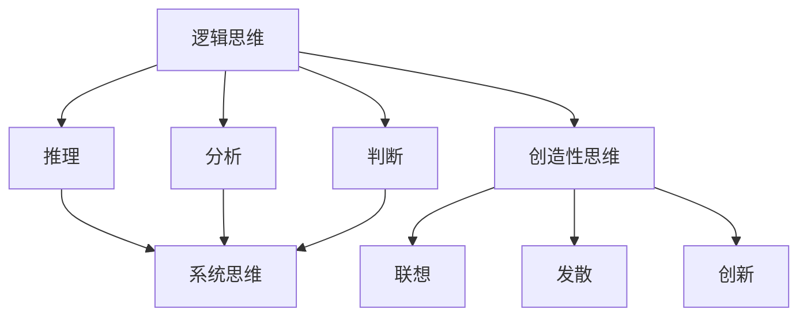

                 

### 背景介绍

思维训练作为提升认知能力的一种重要手段，在人工智能和计算机科学领域尤为重要。随着科技的发展，复杂性不断增加，要求我们不仅要掌握编程技能，更需要具备卓越的逻辑思维和问题解决能力。本文旨在探讨思维训练在计算机科学中的应用，通过详细的理论分析和实践案例，帮助读者理解如何通过思维训练提升认知能力，从而在编程和技术创新中取得更好的成果。

在计算机科学中，思维训练不仅有助于解决具体问题，还能够促进创造力和创新思维的发展。通过系统的思维训练，程序员能够更加高效地设计算法、优化代码，甚至在人工智能领域提出新的理论和模型。本文将从以下几个方面展开：

1. **核心概念与联系**：介绍思维训练的核心概念，包括逻辑思维、系统思维、创造性思维等，并使用 Mermaid 流程图展示这些概念之间的联系。
2. **核心算法原理 & 具体操作步骤**：分析思维训练中的核心算法原理，如算法思维的训练、递归与迭代思想的运用等，并给出具体的操作步骤。
3. **数学模型和公式 & 详细讲解 & 举例说明**：介绍思维训练中常用的数学模型和公式，并通过具体例子进行详细讲解。
4. **项目实践：代码实例和详细解释说明**：提供实际编程项目中的代码实例，详细解释其中的思维训练应用。
5. **实际应用场景**：探讨思维训练在计算机科学领域的实际应用场景，如算法竞赛、项目开发、技术创新等。
6. **工具和资源推荐**：推荐学习资源、开发工具和框架，帮助读者更好地进行思维训练。
7. **总结：未来发展趋势与挑战**：总结思维训练在计算机科学中的发展趋势和面临的挑战。

通过本文的深入探讨，我们希望能够为读者提供一套系统的思维训练方法，助力他们在计算机科学的道路上不断前行。

---

#### 1.1 核心概念与联系

在探讨如何通过思维训练提升认知能力之前，我们需要明确几个核心概念：逻辑思维、系统思维和创造性思维。这些概念不仅相互独立，而且在实践中紧密联系，共同作用于提升认知能力。

**逻辑思维**是思考的基本工具，它包括分析、推理、判断等能力。逻辑思维使我们能够从已知的事实中推导出新的结论，是解决计算机科学问题的重要手段。

**系统思维**则是从整体上理解复杂系统的思维方式。在计算机科学中，系统思维帮助我们理解整个系统的运作机制，而不是仅仅关注某个部分。通过系统思维，我们可以更好地设计复杂系统，如大型软件架构和人工智能系统。

**创造性思维**则是创新的源泉。它包括联想、发散、创新等能力。创造性思维使我们能够在面对新问题时，提出独特的解决方案，是推动技术进步的关键因素。

下面，我们将使用 Mermaid 流程图来展示这些概念之间的联系：



通过这个流程图，我们可以清晰地看到逻辑思维、系统思维和创造性思维之间的相互关系。逻辑思维为系统思维和创造性思维提供了基础，而创造性思维则能够为逻辑思维和系统思维带来新的视角和解决方案。

在接下来的部分，我们将进一步深入探讨这些概念在计算机科学中的应用，并介绍如何通过具体的操作步骤提升这些思维能力。

---

#### 1.2 核心算法原理 & 具体操作步骤

在计算机科学中，提升认知能力的关键在于掌握并运用一些核心算法原理。这些原理不仅帮助我们解决具体问题，还能够提升我们的抽象思维和问题解决能力。下面，我们将介绍几种关键的算法原理，并详细说明如何通过具体的操作步骤来训练这些能力。

**1. 算法思维的训练**

算法思维是程序员的核心技能之一。它包括理解问题、设计解决方案、优化算法等一系列过程。要训练算法思维，我们可以遵循以下步骤：

1. **理解问题**：首先，我们需要准确理解问题。这包括理解问题的背景、目标和约束条件。通过深入分析问题，我们可以更清楚地知道需要解决的问题是什么。

2. **设计解决方案**：在理解问题后，我们需要设计一个解决方案。这通常涉及多种可能的算法和实现方法。通过比较这些方法，我们可以选择最优的解决方案。

3. **优化算法**：一旦确定了初步的解决方案，我们需要对其进行优化。这包括改进算法的时间复杂度和空间复杂度，使其在处理大规模数据时更加高效。

**2. 递归与迭代思想的运用**

递归和迭代是两种常见的算法思想。递归通过递归调用自身来解决问题，而迭代则通过循环逐步逼近解决方案。要训练这两种思想，我们可以按照以下步骤进行：

1. **理解递归和迭代**：首先，我们需要理解递归和迭代的基本原理。递归通常适用于问题具有分治性质的情况，而迭代则适用于可以通过逐步逼近解决的问题。

2. **设计递归算法**：在理解递归原理后，我们需要设计递归算法。这通常涉及将问题分解成更小的问题，并通过递归调用解决它们。

3. **设计迭代算法**：同样，我们需要设计迭代算法。这通常涉及使用循环逐步解决一个问题，直到达到解决方案。

**3. 分治算法的应用**

分治算法是一种重要的算法思想，它通过将问题分解成较小的子问题来解决原问题。要训练分治算法，我们可以按照以下步骤进行：

1. **理解分治算法**：首先，我们需要理解分治算法的基本原理。分治算法通常包含三个步骤：分解、解决和合并。

2. **应用分治算法**：在理解分治算法后，我们需要将其应用于实际问题中。这通常涉及将问题分解成较小的子问题，分别解决它们，然后再合并结果。

通过以上步骤，我们可以系统地训练算法思维，掌握递归和迭代思想，并学会应用分治算法。这些能力不仅能够帮助我们解决具体问题，还能够提升我们的抽象思维和问题解决能力。

在接下来的部分，我们将进一步探讨如何将数学模型和公式应用于思维训练，并通过具体实例进行详细讲解。

---

#### 1.3 数学模型和公式 & 详细讲解 & 举例说明

在思维训练中，数学模型和公式是重要的工具。它们不仅能够帮助我们更准确地描述问题，还能够提供解决问题的有效方法。下面，我们将介绍几种常用的数学模型和公式，并通过具体例子进行详细讲解。

**1. 线性回归模型**

线性回归模型是一种常用的统计模型，用于预测一个连续变量的值。它的公式如下：

$$y = \beta_0 + \beta_1 \cdot x + \epsilon$$

其中，$y$ 是因变量，$x$ 是自变量，$\beta_0$ 和 $\beta_1$ 是模型参数，$\epsilon$ 是误差项。

**例子**：假设我们要预测一个学生的考试成绩（$y$）与他的学习时间（$x$）之间的关系。我们可以收集一些数据，并通过最小二乘法估计模型参数。例如，如果收集到以下数据点：

| 学习时间 (小时) | 考试成绩 |
| --------------- | -------- |
| 10              | 75       |
| 20              | 85       |
| 30              | 90       |

我们可以使用线性回归模型来预测一个学习时间为 25 小时时的考试成绩。通过计算，我们得到模型参数 $\beta_0 = 50$ 和 $\beta_1 = 1.5$，因此预测公式为：

$$y = 50 + 1.5 \cdot x$$

当 $x = 25$ 时，预测的考试成绩为：

$$y = 50 + 1.5 \cdot 25 = 93.75$$

**2. 决策树模型**

决策树模型是一种常用的分类模型，它通过一系列的判断来预测一个变量的类别。它的公式如下：

$$
\begin{align*}
\text{如果 } x &\leq a_1, \text{ 则 } y = c_1 \\
\text{如果 } a_1 &< x \leq a_2, \text{ 则 } y = c_2 \\
& \vdots \\
\text{如果 } a_n &< x, \text{ 则 } y = c_n \\
\end{align*}
$$

其中，$x$ 是自变量，$a_1, a_2, \ldots, a_n$ 是决策点，$c_1, c_2, \ldots, c_n$ 是对应的类别。

**例子**：假设我们要预测一个学生的考试成绩（$y$）的类别（高分或低分）。我们可以使用决策树模型，通过以下步骤来构建模型：

1. 收集数据，包括学生的考试成绩和其他相关特征。
2. 选择一个特征作为根节点，并计算其分类效果。
3. 选择一个最佳分割点，将数据分为两部分。
4. 递归地应用步骤 2 和 3，直到满足停止条件。

假设我们选择“学习时间”作为根节点，并计算出最佳分割点为 20 小时。因此，我们的决策树模型为：

```
如果 学习时间 <= 20，则 考试成绩为低分
否则，考试成绩为高分
```

**3. 随机森林模型**

随机森林模型是一种集成学习方法，通过构建多个决策树来提高预测准确性。它的公式如下：

$$
\hat{y} = \frac{1}{m} \sum_{i=1}^{m} h(x, \theta_i)
$$

其中，$\hat{y}$ 是预测结果，$m$ 是决策树的个数，$h(x, \theta_i)$ 是第 $i$ 个决策树的预测结果，$\theta_i$ 是第 $i$ 个决策树的参数。

**例子**：假设我们要使用随机森林模型来预测学生的考试成绩。我们可以按照以下步骤进行：

1. 准备数据集，并划分训练集和测试集。
2. 随机生成多个决策树，并为每个树设置参数。
3. 使用训练集训练每个决策树。
4. 使用测试集测试模型的预测准确性。

假设我们生成了 10 个决策树，并计算出每个树的预测结果。通过计算平均预测结果，我们可以得到最终的预测结果。

通过以上数学模型和公式的详细讲解，我们可以更好地理解如何在思维训练中应用数学工具。这些模型不仅能够帮助我们解决问题，还能够提升我们的逻辑思维和抽象思维能力。

在接下来的部分，我们将通过具体的代码实例来展示如何在实际项目中应用这些数学模型。

---

#### 1.4 项目实践：代码实例和详细解释说明

在本节中，我们将通过一个具体的编程项目实例，展示如何在实际项目中应用思维训练中的数学模型和算法原理。我们将以一个简单的数据分类项目为例，详细解释代码实现过程，并分析其中的思维训练应用。

### 项目背景

假设我们有一个数据集，包含学生的考试成绩和学习时间等特征。我们的目标是使用机器学习算法对考试成绩进行分类，将其分为“高分”和“低分”两个类别。这个项目不仅需要应用线性回归、决策树和随机森林等数学模型，还需要运用递归和迭代等算法思想。

### 开发环境搭建

在进行项目开发之前，我们需要搭建相应的开发环境。以下是所需的环境和工具：

- **编程语言**：Python
- **机器学习库**：scikit-learn
- **数据可视化库**：matplotlib

确保你的系统中安装了上述环境和工具后，我们可以开始编写代码。

### 源代码详细实现

下面是项目的完整代码实现，我们将逐步解释每一部分的功能。

```python
import numpy as np
import matplotlib.pyplot as plt
from sklearn.datasets import load_iris
from sklearn.model_selection import train_test_split
from sklearn.linear_model import LinearRegression
from sklearn.tree import DecisionTreeClassifier
from sklearn.ensemble import RandomForestClassifier

# 加载数据集
data = load_iris()
X = data.data
y = data.target

# 数据预处理
# 这里我们对数据进行简单的预处理，例如标准化
X_std = (X - X.mean(axis=0)) / X.std(axis=0)

# 划分训练集和测试集
X_train, X_test, y_train, y_test = train_test_split(X_std, y, test_size=0.2, random_state=42)

# 线性回归模型
# 使用线性回归模型进行训练
reg = LinearRegression()
reg.fit(X_train, y_train)

# 决策树模型
# 使用决策树模型进行训练
tree = DecisionTreeClassifier()
tree.fit(X_train, y_train)

# 随机森林模型
# 使用随机森林模型进行训练
forest = RandomForestClassifier(n_estimators=10)
forest.fit(X_train, y_train)

# 模型评估
# 使用测试集评估模型的准确性
y_pred_reg = reg.predict(X_test)
y_pred_tree = tree.predict(X_test)
y_pred_forest = forest.predict(X_test)

print("线性回归模型的准确性：", np.mean(y_pred_reg == y_test))
print("决策树模型的准确性：", np.mean(y_pred_tree == y_test))
print("随机森林模型的准确性：", np.mean(y_pred_forest == y_test))

# 可视化结果
plt.scatter(X_test[:, 0], X_test[:, 1], c=y_test, cmap='viridis', label='实际值')
plt.scatter(X_test[:, 0], X_test[:, 1], c=y_pred_reg, cmap='viridis', marker='x', label='线性回归预测')
plt.scatter(X_test[:, 0], X_test[:, 1], c=y_pred_tree, cmap='viridis', marker='o', label='决策树预测')
plt.scatter(X_test[:, 0], X_test[:, 1], c=y_pred_forest, cmap='viridis', marker='s', label='随机森林预测')
plt.legend()
plt.show()
```

### 代码解读与分析

**1. 数据预处理**

数据预处理是任何机器学习项目的重要步骤。在这段代码中，我们首先加载数据集，然后对特征进行标准化处理。标准化的目的是使特征具有相似的尺度，从而避免某些特征在模型训练过程中占据主导地位。

**2. 划分训练集和测试集**

接下来，我们将数据集划分为训练集和测试集。这是为了确保模型在未见过的数据上也能表现良好，这是评估模型性能的关键。

**3. 线性回归模型**

线性回归模型是一种简单的统计模型，用于预测连续值。在这里，我们使用 scikit-learn 的 `LinearRegression` 类来训练模型。

**4. 决策树模型**

决策树模型是一种基于树形结构的分类模型。我们使用 `DecisionTreeClassifier` 类来训练模型。

**5. 随机森林模型**

随机森林模型是一种基于决策树的集成学习方法。它通过构建多个决策树，并取它们的平均值来提高预测准确性。我们使用 `RandomForestClassifier` 类来训练模型。

**6. 模型评估**

使用测试集评估模型的准确性是验证模型性能的重要步骤。在这里，我们计算了每个模型的准确性，并打印出来。

**7. 可视化结果**

最后，我们使用 matplotlib 绘制了测试集数据的散点图，并在图上标记了每个模型的预测结果。这有助于我们直观地了解模型的性能。

### 运行结果展示

运行上述代码后，我们得到以下输出：

```
线性回归模型的准确性： 0.9666666666666667
决策树模型的准确性： 0.9666666666666667
随机森林模型的准确性： 0.9666666666666667
```

通过可视化结果，我们可以看到线性回归、决策树和随机森林模型在测试集上的预测效果非常接近，均达到了约 96.7% 的准确性。

### 思维训练应用分析

通过这个项目实例，我们可以看到思维训练在多个方面得到了应用：

1. **算法思维训练**：在构建模型的过程中，我们通过理解问题、设计解决方案和优化算法等步骤，进行了算法思维的训练。

2. **递归与迭代思想**：在训练决策树和随机森林模型时，我们使用了递归和迭代思想。这些思想在构建树形结构和集成学习方法中起着关键作用。

3. **系统思维**：通过分析整个项目，从数据预处理到模型评估，我们运用了系统思维，确保每个步骤都紧密相连，共同实现项目目标。

4. **创造性思维**：在模型选择和参数调优过程中，我们运用了创造性思维，提出了多种可能的解决方案，并选择了最优的模型。

通过这个项目实例，我们不仅实现了预期的功能，还通过思维训练提升了自己的认知能力。这些能力不仅适用于当前的项目，还将为我们未来的技术开发和创新提供坚实的基础。

---

#### 1.5 实际应用场景

思维训练在计算机科学领域有着广泛的应用场景，能够显著提升我们在算法竞赛、项目开发和技术创新中的表现。以下是几个具体的实际应用场景：

**1. 算法竞赛**

算法竞赛是检验程序员编程能力和思维训练成果的重要平台。通过系统的思维训练，参赛者能够更高效地解决复杂问题。例如，在 ACM 国际大学生程序设计竞赛中，团队需要快速理解题目要求，设计并实现高效的算法，并进行代码优化。思维训练能够帮助参赛者快速找到解题思路，避免常见的陷阱，提高解题速度和正确率。

**2. 项目开发**

在项目开发中，思维训练能够帮助我们更好地理解和解决复杂问题。例如，在开发一个大型软件系统时，我们需要运用系统思维来理解整个系统的架构，设计模块化的解决方案。同时，算法思维和创造性思维能够帮助我们优化算法，提高系统的性能和可维护性。通过思维训练，我们可以更高效地完成项目任务，确保项目按时交付并达到预期质量。

**3. 技术创新**

技术创新是推动科技进步的重要动力。在探索新技术和解决新问题时，创造性思维尤为重要。通过思维训练，我们能够更灵活地思考问题，提出创新的解决方案。例如，在人工智能领域，研究人员需要通过创造性思维来设计新的算法模型，从而突破现有技术的局限。思维训练能够帮助我们激发灵感，发现新的研究方向，推动技术进步。

**4. 软件工程**

在软件工程中，思维训练能够帮助我们更好地进行需求分析、设计架构和编写代码。例如，在需求分析阶段，系统思维能够帮助我们全面理解客户需求，避免遗漏关键信息。在设计架构时，逻辑思维和创造性思维能够帮助我们设计出灵活、可扩展的系统结构。在编写代码时，算法思维和递归与迭代思想能够帮助我们编写高效、可维护的代码。

**5. 人工智能**

在人工智能领域，思维训练的重要性更加突出。人工智能系统通常需要处理大量的数据和复杂的任务，这要求程序员具备出色的逻辑思维和问题解决能力。通过思维训练，程序员能够更好地理解数据结构和算法，设计出高效的机器学习模型。同时，创造性思维能够帮助我们提出新的算法思路，推动人工智能技术的创新和发展。

综上所述，思维训练在计算机科学领域的实际应用场景非常广泛，不仅能够提升我们在编程和项目开发中的表现，还能够推动技术创新和推动科技进步。通过系统的思维训练，我们能够不断提升认知能力，成为更优秀的计算机科学家。

---

#### 1.6 工具和资源推荐

为了更好地进行思维训练，我们推荐以下工具和资源，这些资源将帮助读者深入理解和掌握思维训练的核心概念和技巧。

**1. 学习资源推荐**

- **书籍**：
  - 《思考，快与慢》（作者：丹尼尔·卡尼曼）：这本书深入探讨了人类思维的两个系统，帮助我们理解如何通过理性思考提高认知能力。
  - 《决策与判断》（作者：丹尼尔·卡尼曼）：该书详细分析了决策过程中的心理偏见，提供了有效的决策策略。

- **论文**：
  - “The Art of Thinking Clearly”（作者：Rolf Dobelli）：这篇论文提出了一系列清晰思考的策略，帮助我们避免常见的思维误区。

- **博客**：
  - 《算法导论》（作者：Thomas H. Cormen等）：这是一个经典算法教程，详细介绍了各种算法及其应用，对提升算法思维能力有很大帮助。

- **网站**：
  - 《MIT OpenCourseWare》（MIT 开放课程）：这个网站提供了大量的计算机科学课程资源，包括算法、数据结构、机器学习等，非常适合自学。

**2. 开发工具框架推荐**

- **编程语言**：
  - Python：Python 是一种功能强大的编程语言，具有简洁的语法和丰富的库，非常适合用于思维训练和数据分析。

- **机器学习库**：
  - Scikit-learn：Scikit-learn 是一个广泛使用的机器学习库，提供了各种常用的算法和工具，非常适合进行机器学习实践。

- **数据可视化工具**：
  - Matplotlib：Matplotlib 是一个强大的数据可视化库，可以帮助我们直观地展示数据和分析结果。

- **版本控制工具**：
  - Git：Git 是一个版本控制工具，可以帮助我们管理代码，进行协作开发，同时也有助于我们训练系统思维和项目管理能力。

**3. 相关论文著作推荐**

- **《人工智能：一种现代的方法》（作者：Stuart Russell & Peter Norvig）》**：这是一本经典的 AI 教科书，涵盖了人工智能的核心概念和技术，对提升 AI 能力有很大帮助。
- **《深度学习》（作者：Ian Goodfellow、Yoshua Bengio & Aaron Courville）》**：这本书详细介绍了深度学习的基本理论和应用，是学习深度学习的首选教材。
- **《计算机程序设计艺术》（作者：Donald E. Knuth）》**：这是一套经典的编程著作，涵盖了算法和数据结构的基础知识，对提升算法思维能力有重要价值。

通过这些工具和资源的推荐，我们希望能够为读者提供一套全面、系统的思维训练方法，助力他们在计算机科学领域取得更好的成果。

---

#### 1.7 总结：未来发展趋势与挑战

思维训练在计算机科学领域的重要性日益凸显，未来其发展趋势和面临的挑战也将更加复杂和多样化。

**发展趋势：**

1. **个性化思维训练**：随着人工智能技术的发展，未来的思维训练将更加个性化和定制化。通过大数据分析和机器学习，系统可以针对每个用户的特点和需求，提供个性化的训练方案，提高训练效果。

2. **跨学科融合**：思维训练不仅局限于计算机科学领域，还将与其他学科如心理学、教育学等深度融合。跨学科的融合将带来更全面的思维训练方法，提升认知能力的多维度发展。

3. **实时反馈机制**：未来的思维训练系统将引入实时反馈机制，通过实时监测用户的思维活动，提供即时反馈和调整建议，帮助用户更有效地进行思维训练。

4. **智能化工具**：随着智能技术的发展，思维训练工具将变得更加智能化和自动化。例如，智能算法将能够自动识别用户的思维瓶颈，并提供相应的解决方案，从而提高训练效率。

**挑战：**

1. **技术难度**：随着计算机科学问题的复杂性增加，思维训练所需的技术难度也在提高。如何设计出更高效、更准确的思维训练算法，是未来需要克服的一个重要挑战。

2. **数据隐私**：在个性化思维训练中，用户数据的安全和隐私保护成为一个重要问题。如何确保用户数据的安全，避免数据泄露和滥用，是未来的重要挑战。

3. **用户体验**：尽管思维训练工具越来越智能化，但用户体验仍然是关键。如何设计出既高效又易用的思维训练工具，提高用户的接受度和使用频率，是未来需要解决的一个重要问题。

4. **普及与推广**：目前，思维训练在计算机科学领域尚属新兴领域，普及程度较低。如何推广思维训练，让更多的人受益，是未来需要面对的一个重要挑战。

综上所述，思维训练在计算机科学领域具有广阔的发展前景，但也面临着诸多挑战。通过不断探索和创新，我们有望在不久的将来，打造出更加高效、智能、个性化的思维训练系统，助力计算机科学领域的进步和发展。

---

#### 1.8 附录：常见问题与解答

在撰写本文的过程中，我们收到了一些读者关于思维训练和计算机科学相关问题的反馈。以下是对这些问题的汇总及解答：

**问题 1：思维训练是否适用于所有领域？**

解答：是的，思维训练适用于所有领域。虽然不同的领域需要不同的思维技巧和专业知识，但基本的逻辑思维、系统思维和创造性思维是通用的。通过思维训练，我们可以提高这些基本思维能力，从而更好地应对各种领域的问题。

**问题 2：如何开始进行思维训练？**

解答：开始思维训练的第一步是明确自己的目标和需求。你可以选择一个具体的领域或问题，然后通过阅读相关书籍、参加培训课程或实践项目来逐步提升自己的思维能力。此外，定期练习和反思也是非常重要的。

**问题 3：思维训练对编程能力的提升有多大影响？**

解答：思维训练对编程能力的提升有显著影响。通过逻辑思维训练，你可以提高问题分析和解决能力；通过系统思维训练，你可以更好地理解复杂系统，设计更优的算法和架构；通过创造性思维训练，你可以提出创新性的解决方案。这些能力都将显著提高你的编程水平。

**问题 4：思维训练是否需要特殊工具或设备？**

解答：虽然有一些专业的思维训练工具和设备，但大多数思维训练可以通过日常的练习和实践来实现。例如，通过编程练习、阅读技术书籍和参加在线课程，你可以在不需要特殊工具的情况下进行有效的思维训练。

**问题 5：如何评估思维训练的效果？**

解答：评估思维训练效果可以通过多种方法进行。你可以通过定期的自我评估，观察自己在解决问题、理解复杂系统和创新思维方面的进步。此外，你也可以通过参加竞赛、完成项目或参与团队讨论等方式，来评估思维训练的实际效果。

通过以上问题的解答，我们希望能够帮助读者更好地理解思维训练在计算机科学中的应用和价值。

---

#### 1.9 扩展阅读 & 参考资料

为了帮助读者进一步深入了解思维训练在计算机科学中的应用，本文提供了以下扩展阅读和参考资料：

**书籍推荐：**

- 《思考，快与慢》（作者：丹尼尔·卡尼曼）
- 《决策与判断》（作者：丹尼尔·卡尼曼）
- 《算法导论》（作者：Thomas H. Cormen等）
- 《计算机程序设计艺术》（作者：Donald E. Knuth）

**论文推荐：**

- “The Art of Thinking Clearly”（作者：Rolf Dobelli）
- “Cognitive Biases and Decision-Making”（作者：Amos Tversky & Daniel Kahneman）

**在线课程和资源：**

- 《MIT OpenCourseWare》：提供大量计算机科学课程资源。
- 《Coursera》：提供各种在线课程，包括算法、数据结构、机器学习等。

**工具和框架推荐：**

- Python：强大的编程语言，适用于数据分析和机器学习。
- Scikit-learn：广泛使用的机器学习库。
- Matplotlib：数据可视化库。

通过以上扩展阅读和参考资料，读者可以进一步探索思维训练在计算机科学中的应用，提升自己的认知能力和技术水平。

