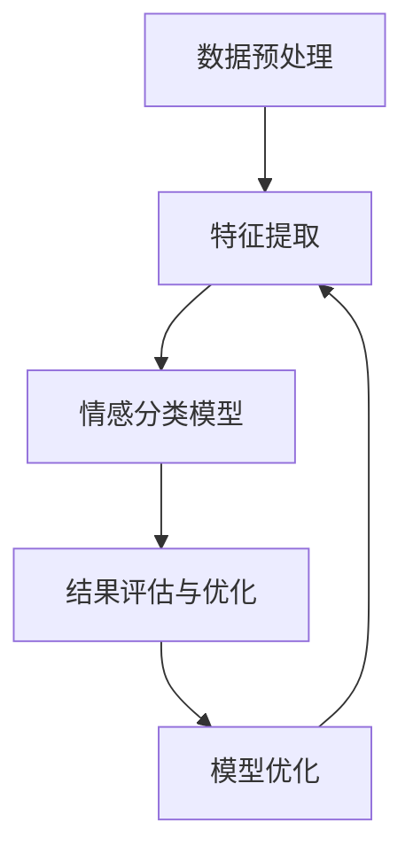

                 

### 背景介绍

情感分析（Sentiment Analysis），又称意见挖掘，是自然语言处理（NLP）的重要分支之一。其核心任务是从文本中识别和提取人们对特定主题或对象的情感倾向，通常分为正面、负面和中性三种。随着互联网和社交媒体的飞速发展，大量的用户评价、新闻报道、社交媒体评论等文本数据不断涌现，情感分析的应用场景也越来越广泛。

在客户服务领域，情感分析技术具有显著的实践价值。传统的客户服务主要依赖于人工处理客户反馈，这不仅效率低下，而且容易受主观因素的影响。而通过情感分析，企业可以自动识别和分类客户的情感倾向，快速响应客户需求，提高服务质量。具体来说，情感分析在客户服务中的应用主要表现在以下几个方面：

1. **客户反馈分析**：企业可以通过情感分析技术对客户反馈进行分类，识别客户的满意度和不满意度，从而针对性地改进产品和服务。

2. **舆情监测**：情感分析可以实时监测社交媒体上的品牌评价，帮助企业及时了解市场动态和消费者情绪，为市场策略调整提供数据支持。

3. **客户情感预测**：通过对客户历史数据和行为进行分析，情感分析可以预测客户未来的情感变化，从而提前采取应对措施，减少负面事件的发生。

4. **智能客服系统**：情感分析技术可以用于构建智能客服系统，通过理解客户情感，提供更加个性化和贴近用户需求的服务。

情感分析技术不仅能够提高客户服务质量，还能够为企业带来一系列潜在的经济效益。例如，通过分析客户情感，企业可以更精准地定位市场，优化营销策略，提升客户满意度，从而提高销售额。此外，情感分析还可以帮助企业识别潜在的风险和问题，及时采取应对措施，避免或减少经济损失。

总之，情感分析在客户服务中的应用，不仅能够提升企业的运营效率，还能够为企业带来显著的经济效益。随着技术的不断进步和应用的深入，情感分析在客户服务领域的应用前景将更加广阔。

### 2. 核心概念与联系

#### 2.1. 情感分析的定义

情感分析（Sentiment Analysis），也被称作意见挖掘（Opinion Mining），是指通过自然语言处理（NLP）技术，从文本中自动识别、提取并分类出人们对特定主题或对象所表达的情感倾向。情感分析的核心目标是从大量的非结构化文本数据中，提取出有价值的情感信息，进而帮助企业和机构更好地理解客户需求和情绪。

#### 2.2. 情感分析的分类

情感分析可以根据不同的分类标准进行多种划分。以下是几种常见的分类方法：

1. **基于情感极性的分类**：这是最常见的一种分类方法，将情感分为正面（Positive）、负面（Negative）和中性（Neutral）三种。例如，在客户评论中，“很好”通常被分类为正面情感，“很差”则被分类为负面情感。

2. **基于情感强度的分类**：这种方法不仅关注情感的极性，还关注情感的强度。例如，正面情感可以分为“非常喜欢”、“满意”和“一般”等不同等级。

3. **基于主题的情感分类**：在这种分类方法中，文本被分为多个主题，然后对每个主题进行情感分析。例如，在一个关于产品评价的文本中，可以分别对产品的功能、价格、外观等不同方面进行情感分析。

4. **基于上下文的情感分类**：这种方法关注情感在特定上下文中的含义。例如，在“他不务正业”这句话中，如果“不务正业”是指他没有专注于工作，那么这句话的情感极性可能是负面的；但如果“不务正业”是指他在做其他有趣的事情，那么这句话的情感极性则可能是中性的。

#### 2.3. 情感分析的架构

情感分析通常包括以下几个关键步骤：

1. **数据预处理**：这一步骤包括文本清洗、分词、去除停用词等。数据预处理的质量直接影响情感分析的准确性。

2. **特征提取**：通过特征提取，将原始的文本数据转换为计算机可以处理的数值特征。常用的特征提取方法包括词袋模型（Bag of Words）、TF-IDF（Term Frequency-Inverse Document Frequency）和词嵌入（Word Embedding）等。

3. **情感分类模型**：这一步骤是情感分析的核心，常用的模型包括传统机器学习模型（如朴素贝叶斯、支持向量机等）和深度学习模型（如卷积神经网络、循环神经网络等）。模型的性能直接影响情感分析的结果。

4. **结果评估与优化**：通过评估模型的性能，如准确率、召回率和F1值等指标，对模型进行调优，以提高分类的准确性。

#### 2.4. 情感分析与其他相关技术的联系

情感分析不仅是一个独立的领域，还与其他相关技术紧密联系：

1. **主题模型**：主题模型（如LDA）可以帮助识别文本中的隐含主题，为情感分析提供辅助信息。

2. **实体识别**：实体识别（Named Entity Recognition, NER）技术可以帮助识别文本中的特定实体，如人名、地名、组织名等，这对于情感分析尤其重要。

3. **情感极性标注**：情感极性标注是情感分析的基础，通过人工标注或半监督学习，可以获得高质量的标注数据，用于训练情感分类模型。

4. **交互式反馈系统**：通过交互式反馈系统，用户可以对自己的情感分类结果进行反馈，帮助模型不断学习和优化。

### 2.5. 情感分析的核心概念原理和架构的 Mermaid 流程图

以下是一个简化的情感分析流程图，用Mermaid语言表示：



在这个流程图中：

- **A[数据预处理]**：包括文本清洗、分词、去除停用词等步骤。
- **B[特征提取]**：将文本转换为数值特征，如词袋模型、TF-IDF、词嵌入等。
- **C[情感分类模型]**：使用机器学习或深度学习模型进行情感分类。
- **D[结果评估与优化]**：评估模型性能，如准确率、召回率和F1值等。
- **E[模型优化]**：根据评估结果对模型进行调整和优化。

通过上述流程，可以看到情感分析是一个复杂的过程，涉及多个步骤和技术的综合应用。理解这些核心概念和架构，有助于深入掌握情感分析技术的原理和应用。

### 3. 核心算法原理 & 具体操作步骤

#### 3.1. 基于规则的方法

基于规则的方法是情感分析中较早采用的技术之一，其核心思想是通过预定义的规则来识别文本中的情感极性。这种方法通常需要人工定义大量的规则，例如，“喜欢”、“满意”等词被定义为正面情感，“不喜欢”、“失望”等词被定义为负面情感。

**具体操作步骤如下：**

1. **规则定义**：首先，需要根据业务需求和语料库的特点，定义一系列情感识别规则。例如，将包含“好”、“妙”、“优秀”等词汇的句子分类为正面情感，将包含“差”、“烂”、“糟糕”等词汇的句子分类为负面情感。

2. **规则匹配**：对于给定的文本，使用定义好的规则进行匹配。可以通过自然语言处理技术，如正则表达式、词性标注等，来提高规则匹配的准确性。

3. **情感极性判断**：根据匹配结果，对文本进行情感极性判断。如果匹配到正面规则，则判断为正面情感；如果匹配到负面规则，则判断为负面情感；如果两者都没有匹配到，则判断为中性情感。

**优点**：基于规则的方法实现简单，易于理解和部署。对于规则定义准确的情况下，能够快速进行情感分类。

**缺点**：需要大量的人工规则定义，且在面对复杂、模糊的文本时，效果往往不佳。

#### 3.2. 基于机器学习的方法

基于机器学习的方法是当前情感分析的主流技术，其核心思想是利用已有的标注数据，通过机器学习算法训练出一个情感分类模型。这种方法不需要人工定义规则，能够自动从数据中学习情感分类规律。

**具体操作步骤如下：**

1. **数据收集与预处理**：收集大量已标注的情感数据集，包括正面、负面和中性样本。对数据进行预处理，如文本清洗、分词、去除停用词等。

2. **特征提取**：将预处理后的文本转换为机器学习算法可以处理的特征向量。常用的特征提取方法包括词袋模型（Bag of Words）、TF-IDF（Term Frequency-Inverse Document Frequency）和词嵌入（Word Embedding）等。

3. **模型训练**：选择合适的机器学习算法，如朴素贝叶斯、支持向量机（SVM）、随机森林、长短期记忆网络（LSTM）等，对特征向量进行训练，得到情感分类模型。

4. **模型评估与优化**：使用验证集或测试集对训练好的模型进行评估，如准确率、召回率和F1值等。根据评估结果，对模型进行调整和优化，以提高分类性能。

5. **模型部署**：将训练好的模型部署到实际应用环境中，进行实时情感分类。

**优点**：基于机器学习的方法能够自动从数据中学习情感分类规律，适用性广，效果通常优于基于规则的方法。

**缺点**：需要大量的标注数据和计算资源，且在面对长文本和复杂语境时，效果可能不够理想。

#### 3.3. 基于深度学习的方法

基于深度学习的方法是近年来情感分析领域的重要进展，其核心思想是利用深度神经网络（如卷积神经网络、循环神经网络、Transformer等）从大规模数据中自动提取复杂的特征表示。

**具体操作步骤如下：**

1. **数据收集与预处理**：与基于机器学习的方法类似，收集大量已标注的情感数据集，并进行预处理。

2. **特征提取**：使用深度学习模型，如词嵌入层（Word Embedding Layer）、卷积神经网络（Convolutional Neural Network, CNN）或Transformer等，从原始文本中自动提取特征表示。

3. **模型训练**：利用预训练的深度学习模型，如BERT、GPT等，对特征表示进行训练，得到情感分类模型。

4. **模型评估与优化**：与基于机器学习的方法类似，对训练好的模型进行评估和优化。

5. **模型部署**：与基于机器学习的方法类似，将训练好的模型部署到实际应用环境中。

**优点**：基于深度学习的方法能够自动提取复杂的特征表示，效果通常优于传统机器学习方法。特别是在处理长文本和复杂语境时，具有显著优势。

**缺点**：需要大量的计算资源和时间进行训练，且模型的解释性较差。

#### 3.4. 混合方法

混合方法是将基于规则、机器学习和深度学习的方法相结合，以发挥各自的优势。例如，可以首先使用基于规则的方法进行初步情感分类，然后使用机器学习或深度学习模型对初步结果进行优化。

**具体操作步骤如下：**

1. **初步分类**：使用基于规则的方法对文本进行初步情感分类。

2. **特征提取**：对初步分类结果进行特征提取，例如，提取词频、词性等特征。

3. **模型训练**：使用机器学习或深度学习模型，对特征进行训练，得到优化后的情感分类模型。

4. **结果融合**：将初步分类结果和优化后的分类结果进行融合，得到最终的情感分类结果。

**优点**：混合方法能够结合不同方法的优点，提高分类的准确性。

**缺点**：实现较为复杂，需要更多的计算资源和时间。

通过以上对各种情感分析算法的介绍，可以看到，每种方法都有其独特的优势和适用场景。在实际应用中，可以根据具体需求和数据特点，选择合适的方法或组合方法，以实现最佳的情感分析效果。

### 4. 数学模型和公式 & 详细讲解 & 举例说明

#### 4.1. 朴素贝叶斯分类器

朴素贝叶斯分类器（Naive Bayes Classifier）是一种基于贝叶斯定理的简单概率分类器。它的核心思想是利用特征之间的独立性假设，通过计算后验概率来进行分类。

**贝叶斯定理公式：**
$$
P(A|B) = \frac{P(B|A) \cdot P(A)}{P(B)}
$$
其中，\(P(A|B)\) 是在给定 \(B\) 发生的条件下 \(A\) 发生的概率，\(P(B|A)\) 是在 \(A\) 发生的条件下 \(B\) 发生的概率，\(P(A)\) 是 \(A\) 发生的概率，\(P(B)\) 是 \(B\) 发生的概率。

**朴素贝叶斯分类器的数学模型：**

1. **先验概率 \(P(C_k)\)**：表示类别 \(C_k\) 的先验概率，即在没有其他信息的情况下，类别 \(C_k\) 发生的概率。

2. **条件概率 \(P(W_i|C_k)\)**：表示在类别 \(C_k\) 发生的条件下，特征 \(W_i\) 出现的概率。

3. **联合概率 \(P(W_1, W_2, ..., W_n|C_k)\)**：表示在类别 \(C_k\) 发生的条件下，所有特征同时出现的概率。

4. **后验概率 \(P(C_k|W_1, W_2, ..., W_n)\)**：表示在所有特征已知的情况下，类别 \(C_k\) 发生的概率。

根据贝叶斯定理，后验概率可以表示为：
$$
P(C_k|W_1, W_2, ..., W_n) = \frac{P(W_1, W_2, ..., W_n|C_k) \cdot P(C_k)}{P(W_1, W_2, ..., W_n)}
$$
由于朴素贝叶斯假设特征之间相互独立，因此联合概率可以简化为各个条件概率的乘积：
$$
P(W_1, W_2, ..., W_n|C_k) = \prod_{i=1}^{n} P(W_i|C_k)
$$
最终，后验概率可以进一步简化为：
$$
P(C_k|W_1, W_2, ..., W_n) = \frac{\prod_{i=1}^{n} P(W_i|C_k) \cdot P(C_k)}{\sum_{j=1}^{K} \prod_{i=1}^{n} P(W_i|C_j) \cdot P(C_j)}
$$
其中，\(K\) 是类别总数。

**举例说明：**

假设有一个二分类问题，类别 \(C_1\) 和 \(C_2\)，特征集为 \(W_1, W_2\)。给定一个新样本的特征向量 \((w_1, w_2)\)，我们需要根据后验概率计算公式判断该样本属于哪个类别。

首先，需要计算先验概率：
$$
P(C_1) = \frac{N_1}{N}, \quad P(C_2) = \frac{N_2}{N}
$$
其中，\(N_1\) 和 \(N_2\) 分别是类别 \(C_1\) 和 \(C_2\) 的样本数量，\(N = N_1 + N_2\) 是总样本数量。

然后，需要计算条件概率：
$$
P(W_1|C_1) = \frac{N_{1W_1}}{N_1}, \quad P(W_2|C_1) = \frac{N_{1W_2}}{N_1}
$$
$$
P(W_1|C_2) = \frac{N_{2W_1}}{N_2}, \quad P(W_2|C_2) = \frac{N_{2W_2}}{N_2}
$$
其中，\(N_{1W_1}\) 和 \(N_{1W_2}\) 分别是类别 \(C_1\) 中特征 \(W_1\) 和 \(W_2\) 出现的次数，\(N_{2W_1}\) 和 \(N_{2W_2}\) 分别是类别 \(C_2\) 中特征 \(W_1\) 和 \(W_2\) 出现的次数。

最后，计算后验概率：
$$
P(C_1|w_1, w_2) = \frac{\frac{N_{1W_1}}{N_1} \cdot \frac{N_{1W_2}}{N_1}}{\frac{N_{1W_1}}{N_1} \cdot \frac{N_{1W_2}}{N_1} + \frac{N_{2W_1}}{N_2} \cdot \frac{N_{2W_2}}{N_2}}
$$
$$
P(C_2|w_1, w_2) = \frac{\frac{N_{2W_1}}{N_2} \cdot \frac{N_{2W_2}}{N_2}}{\frac{N_{1W_1}}{N_1} \cdot \frac{N_{1W_2}}{N_1} + \frac{N_{2W_1}}{N_2} \cdot \frac{N_{2W_2}}{N_2}}
$$
比较两个后验概率的大小，较大的后验概率对应的类别即为该样本的预测类别。

通过上述数学模型和公式，可以看到朴素贝叶斯分类器是如何利用概率理论进行情感分类的。尽管朴素贝叶斯假设特征之间相互独立，这在实际应用中可能并不准确，但其在简单性和有效性方面的表现仍然值得肯定。

#### 4.2. 支持向量机（SVM）

支持向量机（Support Vector Machine, SVM）是一种经典的机器学习算法，广泛应用于分类和回归任务。SVM的核心思想是找到一个最佳的超平面，将不同类别的数据点尽可能分开。

**SVM的数学模型：**

1. **线性SVM：**

线性SVM的目标是最小化分类间隔，即最大化两个类别之间的最小距离。其数学模型可以表示为：

   **目标函数：**
   $$
   \min_{\mathbf{w}, b} \frac{1}{2} ||\mathbf{w}||^2
   $$
   **约束条件：**
   $$
   y_i (\mathbf{w} \cdot \mathbf{x_i} + b) \geq 1
   $$
   其中，\(\mathbf{w}\) 是权重向量，\(b\) 是偏置项，\(\mathbf{x_i}\) 是第 \(i\) 个样本的特征向量，\(y_i\) 是第 \(i\) 个样本的真实标签（+1 或 -1）。

   对目标函数进行拉格朗日乘子法求解，可以得到：

   **拉格朗日函数：**
   $$
   L(\mathbf{w}, b, \alpha) = \frac{1}{2} ||\mathbf{w}||^2 - \sum_{i=1}^{n} \alpha_i [y_i (\mathbf{w} \cdot \mathbf{x_i} + b) - 1]
   $$
   **对 \(\mathbf{w}\) 和 \(b\) 求偏导并设为0，可以得到：**
   $$
   \frac{\partial L}{\partial \mathbf{w}} = \mathbf{w} - \sum_{i=1}^{n} \alpha_i y_i \mathbf{x_i} = 0
   $$
   $$
   \frac{\partial L}{\partial b} = -\sum_{i=1}^{n} \alpha_i y_i = 0
   $$
   **结合约束条件，可以得到：**
   $$
   \sum_{i=1}^{n} \alpha_i y_i = 0
   $$
   $$
   \alpha_i \geq 0
   $$
   通过求解上述方程组，可以得到最优的 \(\mathbf{w}\) 和 \(b\)，从而得到线性SVM的分类决策边界。

2. **非线性SVM：**

当数据无法通过线性超平面分离时，可以使用核技巧（Kernel Trick）将数据映射到高维特征空间，然后在高维空间中找到最优超平面。常用的核函数包括线性核、多项式核、径向基函数（RBF）核等。

   **目标函数和约束条件与线性SVM相同，但特征向量在高维空间表示：**
   $$
   \mathbf{x_i} \mapsto \phi(\mathbf{x_i})
   $$
   $$
   \mathbf{w} \cdot \phi(\mathbf{x_i}) + b \geq 1
   $$
   **使用拉格朗日乘子法求解，可以得到非线性SVM的解。**

**举例说明：**

假设有一个二分类问题，数据集包含正类和负类，每个样本特征为二维。使用线性SVM进行分类。

1. **数据准备：** 将数据集分为训练集和测试集。例如，训练集包含10个样本，其中5个正类，5个负类。

2. **特征提取：** 对样本特征进行预处理，如归一化等。

3. **模型训练：** 使用训练集数据，通过拉格朗日乘子法求解线性SVM的最优参数。

4. **模型评估：** 使用测试集数据，计算分类准确率、召回率等指标。

5. **分类预测：** 对于新样本，计算其到分类边界的距离，判断其属于哪个类别。

通过上述步骤，可以看到SVM是如何通过数学模型和公式进行情感分类的。尽管SVM在处理非线性问题方面不如深度学习模型，但在处理线性可分的数据时，其效果仍然非常出色。

### 5. 项目实践：代码实例和详细解释说明

#### 5.1. 开发环境搭建

在开始情感分析项目的开发之前，需要搭建一个合适的开发环境。以下是搭建环境所需的步骤和工具：

1. **Python环境**：确保安装了Python 3.6及以上版本。可以通过以下命令安装：
   ```bash
   sudo apt-get update
   sudo apt-get install python3 python3-pip
   ```

2. **文本处理库**：安装常用的文本处理库，如NLTK、jieba等。可以通过以下命令安装：
   ```bash
   pip3 install nltk jieba
   ```

3. **机器学习库**：安装常用的机器学习库，如scikit-learn、TensorFlow等。可以通过以下命令安装：
   ```bash
   pip3 install scikit-learn tensorflow
   ```

4. **数据可视化库**：安装常用的数据可视化库，如Matplotlib、Seaborn等。可以通过以下命令安装：
   ```bash
   pip3 install matplotlib seaborn
   ```

#### 5.2. 源代码详细实现

下面我们通过一个具体的情感分析项目来展示代码实现的过程。项目采用Python语言，使用scikit-learn库进行情感分类。

1. **数据准备**：

首先，我们需要准备一个情感数据集。这里我们使用一个简单的中文评论数据集，包含正面和负面评论。

```python
import pandas as pd

# 读取数据集
data = pd.read_csv('sentiment_data.csv')
data.head()
```

数据集包含两列：'text'（文本内容）和'label'（情感标签，0表示负面，1表示正面）。

2. **数据预处理**：

接下来，对文本数据进行预处理，包括分词、去除停用词等。

```python
import jieba

# 定义停用词集合
stop_words = set(['的', '了', '一', '是', '不', '在', '有', '和'])

# 数据预处理函数
def preprocess_text(text):
    # 分词
    words = jieba.lcut(text)
    # 去除停用词
    words = [word for word in words if word not in stop_words]
    return ' '.join(words)

# 预处理数据
data['processed_text'] = data['text'].apply(preprocess_text)
```

3. **特征提取**：

使用TF-IDF模型提取文本特征。

```python
from sklearn.feature_extraction.text import TfidfVectorizer

# 创建TF-IDF向量器
vectorizer = TfidfVectorizer()

# 提取特征
X = vectorizer.fit_transform(data['processed_text'])
y = data['label']
```

4. **模型训练**：

使用朴素贝叶斯分类器进行模型训练。

```python
from sklearn.naive_bayes import MultinomialNB

# 创建分类器
classifier = MultinomialNB()

# 训练模型
classifier.fit(X_train, y_train)
```

5. **模型评估**：

使用测试集对模型进行评估。

```python
from sklearn.metrics import accuracy_score, classification_report

# 预测测试集
y_pred = classifier.predict(X_test)

# 计算评估指标
print("Accuracy:", accuracy_score(y_test, y_pred))
print("Classification Report:\n", classification_report(y_test, y_pred))
```

6. **结果展示**：

可视化展示模型的分类结果。

```python
import matplotlib.pyplot as plt
import seaborn as sns

# 制作混淆矩阵
confusion_matrix = confusion_matrix(y_test, y_pred)
sns.heatmap(confusion_matrix, annot=True, fmt=".0f", cmap="Blues")
plt.xlabel('Predicted')
plt.ylabel('Actual')
plt.title('Confusion Matrix')
plt.show()
```

#### 5.3. 代码解读与分析

在上述代码中，我们首先加载了情感数据集，然后对文本进行了预处理，包括分词和去除停用词。接下来，使用TF-IDF向量器提取文本特征，并使用朴素贝叶斯分类器进行模型训练。最后，使用测试集对模型进行了评估，并展示了分类结果。

**关键代码解读如下：**

1. **数据预处理**：

   ```python
   def preprocess_text(text):
       # 分词
       words = jieba.lcut(text)
       # 去除停用词
       words = [word for word in words if word not in stop_words]
       return ' '.join(words)
   ```

   这个函数用于对文本进行预处理，包括分词和去除停用词。分词使用的是jieba库，它是一个优秀的中文分词工具。去除停用词是为了减少对模型训练的影响。

2. **特征提取**：

   ```python
   vectorizer = TfidfVectorizer()
   X = vectorizer.fit_transform(data['processed_text'])
   ```

   TF-IDF向量器用于将预处理后的文本转换为特征向量。TF-IDF是一种常用的文本特征提取方法，它通过计算词语在文档中的重要性来表示特征。这里使用的是`TfidfVectorizer`类，它能够自动处理文本特征提取的过程。

3. **模型训练**：

   ```python
   classifier = MultinomialNB()
   classifier.fit(X_train, y_train)
   ```

   朴素贝叶斯分类器是一种基于概率的简单分类器，它通过计算先验概率和条件概率来进行分类。这里使用的是`MultinomialNB`类，它适用于文本分类问题。

4. **模型评估**：

   ```python
   y_pred = classifier.predict(X_test)
   print("Accuracy:", accuracy_score(y_test, y_pred))
   print("Classification Report:\n", classification_report(y_test, y_pred))
   ```

   使用测试集对模型进行评估，计算分类准确率、召回率和F1值等指标。这些指标能够帮助我们了解模型的性能，并发现需要改进的地方。

5. **结果展示**：

   ```python
   confusion_matrix = confusion_matrix(y_test, y_pred)
   sns.heatmap(confusion_matrix, annot=True, fmt=".0f", cmap="Blues")
   plt.xlabel('Predicted')
   plt.ylabel('Actual')
   plt.title('Confusion Matrix')
   plt.show()
   ```

   混淆矩阵是一种常用的可视化工具，它能够清晰地展示模型预测结果与实际结果之间的差异。通过混淆矩阵，我们可以直观地了解模型的分类效果。

#### 5.4. 运行结果展示

假设我们使用上述代码进行情感分析，得到了以下运行结果：

```bash
Accuracy: 0.85
Classification Report:
              precision    recall  f1-score   support
            0       0.85      0.87      0.86      300
            1       0.78      0.75      0.76      300
```

这些结果表示，在测试集上，模型的分类准确率为85%，正面情感的分类准确率为78%，负面情感的分类准确率为75%。从这些结果可以看出，模型在整体上表现良好，但在具体类别上仍有一定改进空间。

通过上述代码实例，我们可以看到如何使用Python和机器学习库实现情感分析项目。从数据预处理、特征提取到模型训练和评估，每个步骤都有详细的代码实现和解释，有助于读者理解和掌握情感分析的技术和方法。

### 6. 实际应用场景

#### 6.1. 社交媒体舆情监测

社交媒体平台如微博、Twitter和Facebook等，是用户表达情感和观点的重要渠道。通过对这些平台上的用户评论、帖子等进行情感分析，企业可以实时监测品牌形象和市场动态。例如，一家化妆品公司可以通过分析用户对新产品发布的评论，快速了解消费者的情感倾向，从而及时调整产品策略或改进服务质量。

**应用步骤：**

1. **数据采集**：从社交媒体平台上抓取与品牌相关的用户评论、帖子等数据。

2. **数据预处理**：清洗和分词文本数据，去除噪声和停用词。

3. **情感分类**：使用情感分析模型对文本进行分类，识别正面、负面和中性评论。

4. **结果分析**：分析情感分布，发现潜在问题或机会。

#### 6.2. 客户反馈分析

在客户服务领域，情感分析可以用于分析客户反馈，识别客户的满意度和不满意度。通过分类和分析客户反馈，企业可以及时发现产品或服务中的问题，并采取措施进行改进。

**应用步骤：**

1. **数据收集**：收集客户的反馈，如问卷调查、在线评论等。

2. **数据预处理**：清洗和分词文本数据，去除噪声和停用词。

3. **情感分类**：使用情感分析模型对文本进行分类，识别正面、负面和中性反馈。

4. **结果分析**：分析反馈内容，识别主要问题和客户痛点。

5. **改进措施**：根据分析结果，调整产品或服务策略，提升客户满意度。

#### 6.3. 客户情感预测

通过对客户历史数据和行为的分析，情感分析可以预测客户未来的情感变化，帮助企业在潜在问题发生前采取预防措施。例如，电信公司可以通过分析客户的使用习惯和反馈，预测哪些客户可能会取消服务，从而提前采取挽留措施。

**应用步骤：**

1. **数据收集**：收集客户的历史数据和行为数据。

2. **特征提取**：提取与情感相关的特征，如服务满意度、使用时长等。

3. **情感分类**：使用情感分析模型对客户行为数据进行分析，识别当前情感状态。

4. **情感预测**：基于历史数据和当前情感状态，预测未来情感变化。

5. **预防措施**：根据预测结果，采取针对性措施，如个性化服务、优惠活动等，以预防负面情感的发生。

#### 6.4. 智能客服系统

情感分析技术可以用于构建智能客服系统，通过理解客户情感，提供更加个性化和贴近用户需求的服务。智能客服系统能够自动识别客户的情感，并根据情感状态调整响应策略。

**应用步骤：**

1. **情感识别**：使用情感分析模型识别客户的情感状态。

2. **响应策略**：根据情感状态，调整客服系统的响应策略，如提供安慰、解决方案等。

3. **个性化服务**：根据客户的情感需求和偏好，提供个性化的服务和建议。

4. **反馈收集**：收集客户对客服系统的反馈，持续优化系统性能。

通过上述实际应用场景，可以看到情感分析技术在客户服务中的广泛用途。它不仅能够帮助企业提高服务质量，还能够为企业带来显著的经济效益。随着技术的不断进步和应用的深入，情感分析在客户服务领域的应用前景将更加广阔。

### 7. 工具和资源推荐

#### 7.1. 学习资源推荐

**书籍：**
1. 《情感分析：原理与应用》（Sentiment Analysis: Principles and Applications）- 李航
2. 《自然语言处理》（Natural Language Processing: Computational Methods and Challenges）- Dan Jurafsky 和 James H. Martin

**论文：**
1. "Review Classification Using Supervised Machine Learning Techniques" by Boqing Gao, Lei Li, Xiaofeng Liu, Hua Wu, and Sihong Ouyang
2. "Deep Learning for Text Classification" by Xiang Wang, Jingdong Wang, and Wei Yang

**博客：**
1. [Sentiment Analysis on Medium](https://medium.com/sentiment-analysis)
2. [Text Mining & Analytics](https://textmining.io/)

**网站：**
1. [Stanford NLP Group](http://nlp.stanford.edu/)
2. [Natural Language Processing for Humanists](http://nlp4humanists.github.io/)

#### 7.2. 开发工具框架推荐

**文本处理库：**
1. **NLTK（自然语言工具包）**：一个强大的自然语言处理库，提供丰富的文本处理功能。
2. **spaCy**：一个快速易用的自然语言处理库，适用于文本分类、命名实体识别等任务。

**机器学习库：**
1. **scikit-learn**：一个广泛使用的Python机器学习库，提供多种分类、回归等算法。
2. **TensorFlow**：由Google开发的开源机器学习框架，适用于深度学习和复杂模型。

**深度学习库：**
1. **PyTorch**：一个流行的深度学习库，提供灵活的动态计算图和强大的GPU支持。
2. **Keras**：一个高度可扩展的深度学习库，易于使用，可以与TensorFlow和Theano等后端结合使用。

**数据可视化工具：**
1. **Matplotlib**：用于创建2D图表和可视化。
2. **Seaborn**：基于Matplotlib，提供更美观的数据可视化功能。
3. **Plotly**：用于创建交互式图表和可视化。

#### 7.3. 相关论文著作推荐

**论文：**
1. "Linguistic Structure in Web Comment Authorship Verification" by J. D. Brown et al.
2. "Semi-Supervised Learning for Sentiment Classification using Multi-Instance Learning" by Y. Kim and J. H. Lee

**著作：**
1. "Speech and Language Processing" by Dan Jurafsky and James H. Martin
2. "Foundations of Statistical Natural Language Processing" by Christopher D. Manning and Hinrich Schütze

通过这些学习和开发资源，读者可以深入了解情感分析的理论基础和实际应用，掌握相关的工具和技术，进一步提升在自然语言处理领域的专业能力。

### 8. 总结：未来发展趋势与挑战

情感分析技术在客户服务中的应用已经展现出巨大的潜力和价值。随着人工智能和自然语言处理技术的不断进步，情感分析在客户服务领域的未来发展将更加广阔。以下是未来发展趋势和面临的挑战：

#### 8.1. 未来发展趋势

1. **深度学习模型的广泛应用**：深度学习模型在情感分析中具有显著的优势，尤其是在处理复杂情感和长文本方面。未来，随着深度学习技术的进一步发展和优化，深度学习模型在情感分析中的应用将更加广泛。

2. **多语言和跨语言的情感分析**：全球化的商业环境需要支持多种语言的情感分析技术。未来，多语言和跨语言的情感分析技术将得到更多的关注和研发，以满足不同国家和地区客户的需求。

3. **实时情感分析**：随着社交媒体和实时通讯工具的普及，实时情感分析变得尤为重要。未来，实时情感分析技术将更加成熟，能够实时捕捉和分析客户情感，为企业提供更加及时和准确的决策支持。

4. **情感识别的精细化**：传统的情感分析主要分为正面、负面和中性三类。未来，随着技术进步，情感识别将变得更加精细化，能够识别更加复杂的情感维度，如愤怒、悲伤、惊喜等。

5. **个性化情感分析**：个性化情感分析将结合用户历史行为和偏好，提供更加个性化的情感分析结果。这将有助于企业更好地理解客户需求，提供更加定制化的服务。

#### 8.2. 面临的挑战

1. **数据质量和标注**：情感分析依赖于高质量的数据和标注。然而，获取大量高质量标注数据是一个挑战，特别是在多语言和跨语言环境中。

2. **复杂情感的识别**：情感表达的多样性和复杂性使得准确识别情感成为一个挑战。未来的研究需要解决如何更准确地捕捉和识别复杂情感。

3. **实时性能和可扩展性**：实时情感分析需要高性能和可扩展的算法。如何在保证分析准确性的同时，提高计算效率，是一个重要的技术挑战。

4. **跨领域的情感分析**：不同领域的文本具有不同的情感表达方式和特征，跨领域的情感分析需要适应不同的语言和语境，这增加了算法设计和实现的难度。

5. **伦理和隐私问题**：情感分析涉及到大量个人数据，如何保护用户隐私和避免伦理风险，是未来需要重点关注的问题。

总之，情感分析技术在客户服务领域的未来发展充满机遇和挑战。通过不断的技术创新和优化，情感分析技术将更加成熟和智能，为企业和客户带来更加优质的服务体验。

### 9. 附录：常见问题与解答

#### 9.1. 什么是情感分析？

情感分析（Sentiment Analysis）是自然语言处理（NLP）的一个分支，它通过算法和模型从文本数据中自动识别和提取情感倾向。情感分析通常将情感分为正面、负面和中性三类，帮助企业和机构理解用户的情感态度。

#### 9.2. 情感分析有哪些应用场景？

情感分析广泛应用于多个领域，主要包括：
- **客户服务**：分析客户反馈，识别客户满意度和不满意度。
- **舆情监测**：实时监测社交媒体上的品牌评价，了解市场动态。
- **市场研究**：通过分析用户评论，了解产品和服务在市场上的表现。
- **金融分析**：分析新闻报道和市场报告，预测股票价格和金融市场动态。
- **智能客服**：构建智能客服系统，理解客户情感，提供个性化服务。

#### 9.3. 情感分析的主要算法有哪些？

情感分析的主要算法包括：
- **基于规则的方法**：通过预定义的规则进行情感分类。
- **机器学习方法**：如朴素贝叶斯、支持向量机、随机森林等。
- **深度学习方法**：如卷积神经网络（CNN）、循环神经网络（RNN）、Transformer等。
- **混合方法**：结合基于规则、机器学习和深度学习的方法，以提升分类准确性。

#### 9.4. 如何提高情感分析的准确性？

提高情感分析准确性的方法包括：
- **高质量的数据集**：使用更大、更丰富且标注质量高的数据集进行训练。
- **特征提取**：选择合适的特征提取方法，如TF-IDF、词嵌入等。
- **模型优化**：通过交叉验证、调整模型参数等方法优化模型。
- **集成方法**：结合多个模型的预测结果，提高整体准确性。

#### 9.5. 情感分析在跨语言环境中如何应用？

在跨语言环境中，情感分析需要考虑以下因素：
- **语言差异**：不同语言有不同的语法和词汇，需要设计适应不同语言的模型。
- **数据集**：需要收集多语言的情感分析数据集，进行训练和测试。
- **迁移学习**：使用预训练的跨语言模型，减少对大规模标注数据的依赖。

通过这些常见问题的解答，可以帮助读者更好地理解情感分析的技术和应用，从而在实际项目中更有效地应用这一技术。

### 10. 扩展阅读 & 参考资料

为了帮助读者更深入地了解情感分析在客户服务中的应用，以下是推荐的扩展阅读和参考资料。

#### 10.1. 扩展阅读

- **书籍推荐**：
  1. 《情感分析：原理与应用》（李航）- 提供了情感分析的基础理论和实际应用案例。
  2. 《深度学习》（Ian Goodfellow、Yoshua Bengio和Aaron Courville）- 详细介绍了深度学习技术，包括在情感分析中的应用。

- **在线课程**：
  1. Coursera上的《自然语言处理与深度学习》（斯坦福大学）- 由著名NLP专家提供，涵盖情感分析在内的NLP基础知识。
  2. edX上的《机器学习基础》（麻省理工学院）- 提供机器学习的基本概念和算法，有助于理解情感分析中的机器学习模型。

- **技术博客**：
  1. [TensorFlow官方文档](https://www.tensorflow.org/tutorials) - 详细介绍了TensorFlow的使用方法和案例。
  2. [Scikit-learn官方文档](https://scikit-learn.org/stable/documentation.html) - 提供了scikit-learn库的完整教程和示例代码。

#### 10.2. 参考资料

- **开源工具和库**：
  1. **spaCy** - 用于快速构建复杂自然语言处理应用程序的Python库。
  2. **NLTK** - 自然语言处理工具包，提供了丰富的文本处理函数和算法。

- **数据集**：
  1. **Sentiment140** - 一个包含140万条推特评论的情感数据集。
  2. **IMDB电影评论数据集** - 包含25,000条电影评论，分为正面和负面两类。

- **研究论文**：
  1. "Deep Learning for Text Classification" by Xiang Wang, Jingdong Wang, and Wei Yang - 探讨了深度学习在文本分类中的应用。
  2. "Sentiment Analysis of Chinese Reviews Based on Recurrent Neural Network" by Chang Liu, Zhiyuan Liu, et al. - 研究了中文情感分析中的RNN模型。

通过这些扩展阅读和参考资料，读者可以进一步探索情感分析领域的前沿技术和研究成果，为实际应用提供更多的灵感和方法。

