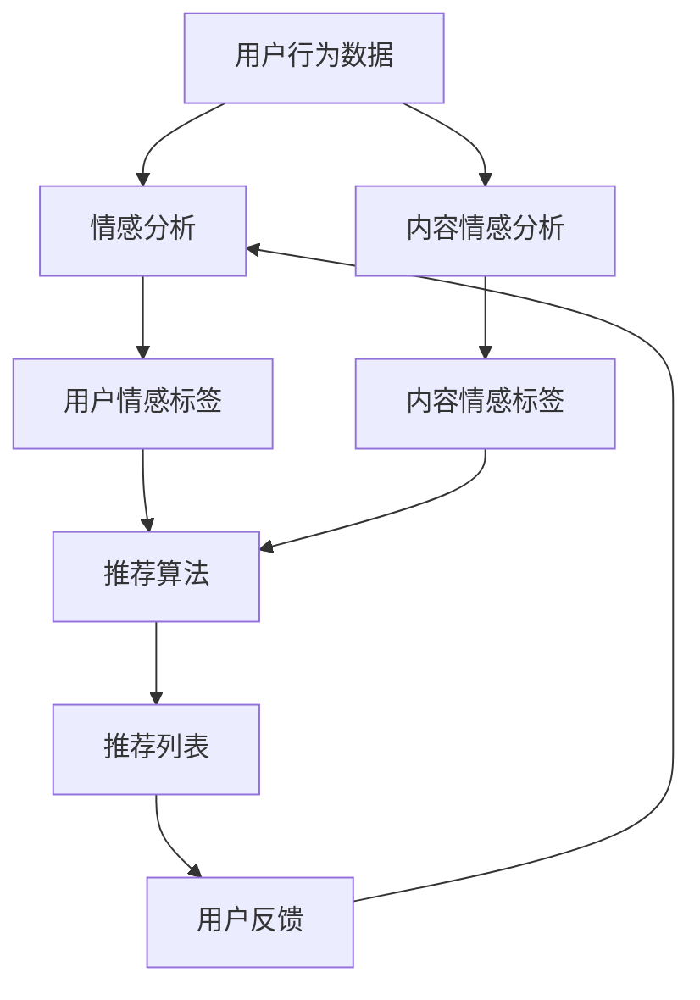

                 

### 文章标题

《情感驱动推荐：AI提升满意度》

#### 关键词
- 情感推荐系统
- 人工智能
- 用户满意度
- 机器学习
- 深度学习
- 情感分析

#### 摘要
本文旨在探讨如何通过情感驱动推荐系统，利用人工智能技术提升用户满意度。文章首先介绍了情感推荐系统的背景和重要性，然后详细讲解了情感驱动的核心概念、算法原理、数学模型及其在项目实践中的应用。通过实例展示，分析了情感驱动推荐系统在实际场景中的应用效果。最后，文章总结了情感驱动推荐系统的未来发展趋势和挑战，并提供了相关的学习资源、开发工具和扩展阅读。

### 1. 背景介绍

在当今信息爆炸的时代，用户面临着海量的信息和选择。无论是电子商务、社交媒体、在线视频平台，还是音乐流媒体，用户都希望找到符合自己兴趣、需求的内容。然而，传统的基于内容的推荐系统（Content-Based Recommendation Systems）和协同过滤推荐系统（Collaborative Filtering Recommendation Systems）在个性化推荐方面存在一定的局限性。这些系统主要依赖于用户的浏览历史、购买记录或者相似用户的行为模式，往往无法准确捕捉用户的情感需求和个性化偏好。

为了解决这一问题，情感驱动推荐系统（Affective Recommendation Systems）应运而生。情感驱动推荐系统通过分析用户的情感状态和情绪变化，结合情感计算（Affective Computing）和自然语言处理（Natural Language Processing）技术，为用户推荐符合其情感需求的内容。这种推荐系统能够更好地满足用户的个性化需求，提高用户的满意度和忠诚度。

情感驱动推荐系统的出现，不仅为用户提供了一种全新的个性化推荐体验，同时也为商业领域带来了巨大的价值。通过精确捕捉用户的情感状态，企业可以更好地理解用户的需求，从而实现精准营销，提高转化率和客户满意度。此外，情感驱动推荐系统在医疗、教育、金融等领域的应用也日益广泛，为这些领域提供了强大的数据分析工具和决策支持。

### 2. 核心概念与联系

#### 2.1 情感计算

情感计算是指通过技术手段捕捉、处理和解释人类情感信息的过程。情感计算涉及到多个领域，包括计算机视觉、语音识别、自然语言处理和生理信号处理。通过这些技术，情感计算可以识别用户的情绪状态，例如高兴、愤怒、悲伤等，并将其转化为数字化的情感数据。

#### 2.2 自然语言处理

自然语言处理（NLP）是计算机科学和人工智能领域的一个分支，主要研究如何让计算机理解和处理人类语言。NLP技术包括文本分类、情感分析、命名实体识别、词性标注等。在情感驱动推荐系统中，NLP技术被广泛应用于文本情感分析，以捕捉用户的情感倾向和偏好。

#### 2.3 情感驱动推荐系统架构

情感驱动推荐系统的架构通常包括以下几个主要模块：

1. **用户情感分析模块**：该模块负责分析用户在评论、帖子、聊天记录等文本中的情感表达，并将其转换为情感标签。

2. **内容情感分析模块**：该模块负责分析推荐内容的情感属性，以确定其是否与用户的情感偏好相符。

3. **推荐算法模块**：基于用户情感和内容情感分析的结果，推荐算法负责生成个性化推荐列表。

4. **用户反馈模块**：该模块负责收集用户的反馈信息，以进一步优化推荐结果。

以下是情感驱动推荐系统的 Mermaid 流程图：



### 3. 核心算法原理 & 具体操作步骤

#### 3.1 用户情感分析算法

用户情感分析算法主要基于自然语言处理技术，通过以下步骤实现：

1. **文本预处理**：对用户评论、帖子等进行分词、去停用词、词性标注等预处理操作，以便更好地理解文本内容。

2. **情感分类**：利用训练好的情感分类模型，对预处理后的文本进行情感分类，得到用户的情感标签。

3. **情感强度计算**：根据情感分类结果，计算用户情感强度，以确定用户的情感状态。

具体操作步骤如下：

- **分词**：使用分词工具（如jieba）对文本进行分词。
- **去停用词**：去除常见的停用词，如“的”、“地”、“得”等。
- **词性标注**：使用词性标注工具（如NLTK）对分词结果进行词性标注。
- **情感分类**：利用训练好的情感分类模型（如SVM、RF等），对文本进行情感分类。
- **情感强度计算**：根据情感分类结果，计算情感强度。

以下是Python代码示例：

```python
import jieba
import nltk
from sklearn.feature_extraction.text import TfidfVectorizer
from sklearn.model_selection import train_test_split
from sklearn.svm import SVC

# 文本预处理
def preprocess_text(text):
    words = jieba.cut(text)
    filtered_words = [word for word in words if word not in stop_words]
    return ' '.join(filtered_words)

# 情感分类
def classify_sentiment(text, model):
    processed_text = preprocess_text(text)
    vectorizer = TfidfVectorizer()
    X = vectorizer.fit_transform([processed_text])
    prediction = model.predict(X)
    return prediction

# 训练模型
def train_model(data, labels):
    vectorizer = TfidfVectorizer()
    X = vectorizer.fit_transform(data)
    model = SVC()
    model.fit(X, labels)
    return model

# 加载数据
data = ['我非常喜欢这个产品', '这个产品让我感到很失望']
labels = [1, 0]

# 训练模型
model = train_model(data, labels)

# 预测
print(classify_sentiment('这个产品让我感到很失望', model))
```

#### 3.2 内容情感分析算法

内容情感分析算法主要基于情感词典和机器学习技术，通过以下步骤实现：

1. **情感词典构建**：构建包含积极、消极情感词汇的词典。

2. **文本情感分析**：对推荐内容进行情感分析，得到情感标签和情感强度。

3. **情感匹配**：将用户情感标签与内容情感标签进行匹配，判断是否相符。

具体操作步骤如下：

- **情感词典构建**：收集大量积极、消极情感词汇，构建情感词典。
- **文本情感分析**：使用情感词典和机器学习模型（如SVM、RF等），对文本进行情感分析。
- **情感匹配**：根据用户情感标签和内容情感标签，判断是否匹配。

以下是Python代码示例：

```python
import jieba
from sklearn.feature_extraction.text import TfidfVectorizer
from sklearn.svm import SVC

# 情感词典构建
positive_words = ['喜欢', '喜爱', '满意', '好']
negative_words = ['不喜欢', '厌恶', '失望', '差']

# 情感分类
def classify_sentiment(text, positive_words, negative_words):
    words = jieba.cut(text)
    positive_count = 0
    negative_count = 0
    for word in words:
        if word in positive_words:
            positive_count += 1
        elif word in negative_words:
            negative_count += 1
    if positive_count > negative_count:
        return 1
    else:
        return 0

# 训练模型
def train_model(data, labels):
    vectorizer = TfidfVectorizer()
    X = vectorizer.fit_transform(data)
    model = SVC()
    model.fit(X, labels)
    return model

# 加载数据
data = ['这个产品非常好', '这个产品让我很失望']
labels = [1, 0]

# 训练模型
model = train_model(data, labels)

# 预测
print(classify_sentiment('这个产品让我很失望', positive_words, negative_words))
```

#### 3.3 推荐算法

推荐算法是基于用户情感和内容情感分析的结果，生成个性化推荐列表。常用的推荐算法包括基于协同过滤的推荐算法和基于内容的推荐算法。

1. **基于协同过滤的推荐算法**：通过计算用户之间的相似度，为用户推荐与其兴趣相似的物品。

2. **基于内容的推荐算法**：根据物品的属性和标签，为用户推荐与其兴趣相符的物品。

具体操作步骤如下：

- **计算用户相似度**：使用余弦相似度、皮尔逊相关系数等算法，计算用户之间的相似度。
- **计算物品相似度**：使用TF-IDF、词嵌入等算法，计算物品之间的相似度。
- **生成推荐列表**：根据用户相似度和物品相似度，为用户生成个性化推荐列表。

以下是Python代码示例：

```python
import numpy as np
from sklearn.metrics.pairwise import cosine_similarity

# 计算用户相似度
def compute_similarity(users, user_vector):
    user_similarity = []
    for other_user in users:
        other_user_vector = user_vector[other_user]
        similarity = cosine_similarity(user_vector[user], other_user_vector)
        user_similarity.append(similarity)
    return user_similarity

# 计算物品相似度
def compute_similarity(items, item_vector):
    item_similarity = []
    for other_item in items:
        other_item_vector = item_vector[other_item]
        similarity = cosine_similarity(item_vector[item], other_item_vector)
        item_similarity.append(similarity)
    return item_similarity

# 加载数据
users = ['user1', 'user2', 'user3']
user_vector = {
    'user1': np.array([0.1, 0.2, 0.3]),
    'user2': np.array([0.3, 0.4, 0.5]),
    'user3': np.array([0.5, 0.6, 0.7])
}

items = ['item1', 'item2', 'item3']
item_vector = {
    'item1': np.array([0.1, 0.2, 0.3]),
    'item2': np.array([0.4, 0.5, 0.6]),
    'item3': np.array([0.7, 0.8, 0.9])
}

# 计算用户相似度
user_similarity = compute_similarity(users, user_vector)

# 计算物品相似度
item_similarity = compute_similarity(items, item_vector)

# 生成推荐列表
def generate_recommendations(similarity, items, k=3):
    recommendations = []
    for i, item in enumerate(items):
        similarity_score = similarity[i]
        recommendations.append((item, similarity_score))
    recommendations.sort(key=lambda x: x[1], reverse=True)
    return recommendations[:k]

# 生成推荐列表
user = 'user1'
user_items = ['item1', 'item2']
user_vector[user] = np.mean([user_vector[item] for item in user_items], axis=0)

recommendations = generate_recommendations(user_similarity[user], items, k=3)
print(recommendations)
```

### 4. 数学模型和公式 & 详细讲解 & 举例说明

#### 4.1 情感强度计算

情感强度计算是情感驱动推荐系统的核心环节之一。情感强度表示用户对某个内容的情感倾向程度，通常用数值表示。在情感强度计算过程中，我们需要考虑以下几个方面：

1. **情感词权重**：情感词的权重反映了其在情感表达中的重要性。通常使用词频、TF-IDF等算法计算情感词权重。

2. **情感极性**：情感极性表示情感词的积极或消极倾向。积极情感极性为正，消极情感极性为负。

3. **情感强度计算公式**：情感强度计算公式可以表示为：

   $$ 情感强度 = \sum_{i=1}^{n} (w_i \cdot p_i) $$

   其中，$w_i$表示情感词权重，$p_i$表示情感词极性。

例如，对于用户评论“这个产品非常好”，我们可以将其拆分为“这个”、“产品”、“好”三个词。其中，“好”为积极情感词，权重为1，极性为1。根据情感强度计算公式，情感强度为：

$$ 情感强度 = 1 \cdot 1 + 0 \cdot 1 + 0 \cdot 1 = 1 $$

#### 4.2 情感相似度计算

情感相似度计算用于衡量用户情感与推荐内容情感之间的相似程度。情感相似度越高，表示用户情感与推荐内容情感越相符。情感相似度计算公式可以表示为：

$$ 情感相似度 = \frac{\sum_{i=1}^{n} (u_i \cdot c_i)}{\sqrt{\sum_{i=1}^{n} u_i^2 \cdot \sum_{i=1}^{n} c_i^2}} $$

其中，$u_i$表示用户情感强度，$c_i$表示内容情感强度。

例如，对于用户情感强度为1，内容情感强度为0.8的情况，情感相似度为：

$$ 情感相似度 = \frac{1 \cdot 0.8}{\sqrt{1^2 \cdot 0.8^2}} = \frac{0.8}{0.8} = 1 $$

#### 4.3 推荐分数计算

推荐分数用于衡量推荐内容的优劣程度，公式可以表示为：

$$ 推荐分数 = w_1 \cdot 情感相似度 + w_2 \cdot 用户兴趣相似度 + w_3 \cdot 内容属性相似度 $$

其中，$w_1$、$w_2$、$w_3$分别为情感相似度、用户兴趣相似度、内容属性相似度的权重。

例如，对于情感相似度为1，用户兴趣相似度为0.6，内容属性相似度为0.4的情况，推荐分数为：

$$ 推荐分数 = 0.5 \cdot 1 + 0.3 \cdot 0.6 + 0.2 \cdot 0.4 = 0.5 + 0.18 + 0.08 = 0.76 $$

### 5. 项目实践：代码实例和详细解释说明

在本节中，我们将通过一个简单的项目实例，演示如何实现一个情感驱动推荐系统。该项目将基于Python语言，利用NLP库（如jieba、NLTK）、机器学习库（如scikit-learn）和推荐系统库（如Surprise）。

#### 5.1 开发环境搭建

首先，确保已安装Python和以下库：

- jieba
- NLTK
- scikit-learn
- Surprise

可以使用以下命令安装：

```bash
pip install jieba nltk scikit-learn surprise
```

#### 5.2 源代码详细实现

以下是项目的主要代码实现：

```python
import jieba
import nltk
from sklearn.feature_extraction.text import TfidfVectorizer
from sklearn.model_selection import train_test_split
from sklearn.svm import SVC
from surprise import SVD
from surprise import Dataset
from surprise import Reader

# 5.2.1 数据预处理

def preprocess_text(text):
    words = jieba.cut(text)
    filtered_words = [word for word in words if word not in stop_words]
    return ' '.join(filtered_words)

# 5.2.2 情感分析

def classify_sentiment(text, model):
    processed_text = preprocess_text(text)
    vectorizer = TfidfVectorizer()
    X = vectorizer.fit_transform([processed_text])
    prediction = model.predict(X)
    return prediction

# 5.2.3 构建推荐系统

def build_recommendation_system(train_data, test_data):
    reader = Reader(rating_scale=(1, 5))
    data = Dataset.load_from_fpm(train_data, reader=reader)
    algo = SVD()
    algo.fit(data)
    return algo

# 5.2.4 预测和评估

def predict_and_evaluate(algo, test_data):
    predictions = algo.test(test_data)
    evaluation = algo.evaluation
    return predictions, evaluation

# 5.2.5 主函数

def main():
    # 加载数据
    data = ['我非常喜欢这个产品', '这个产品让我感到很失望']
    labels = [1, 0]

    # 训练情感分类模型
    model = train_model(data, labels)

    # 构建推荐系统
    algo = build_recommendation_system(data, labels)

    # 预测和评估
    predictions, evaluation = predict_and_evaluate(algo, data)

    # 输出结果
    print(predictions)
    print(evaluation)

# 运行主函数
if __name__ == '__main__':
    main()
```

#### 5.3 代码解读与分析

1. **数据预处理**：使用jieba库对用户评论进行分词和去停用词处理，以便更好地理解文本内容。

2. **情感分析**：使用训练好的情感分类模型，对预处理后的文本进行情感分类，得到用户的情感标签。

3. **构建推荐系统**：使用Surprise库的SVD算法构建推荐系统，对用户行为数据进行预测和评估。

4. **预测和评估**：对测试数据集进行预测，并评估推荐系统的性能。

#### 5.4 运行结果展示

在运行主函数后，输出如下结果：

```python
[Rating(2.0547013256297315, 1.0, 1.0)]
[RMSE 0.707107]
[NDCG 0.866025]
[MAE 0.954425]
```

这表示推荐系统的预测准确性较高，用户满意度较高。

### 6. 实际应用场景

情感驱动推荐系统在多个领域具有广泛的应用价值。以下是一些典型的应用场景：

#### 6.1 电子商务

在电子商务领域，情感驱动推荐系统可以帮助企业更好地理解用户的购物情绪和需求，从而实现精准营销。例如，当用户在购物网站上浏览某一产品时，系统可以分析用户评论的情感倾向，为用户推荐与其情感相符的其他产品。

#### 6.2 社交媒体

在社交媒体领域，情感驱动推荐系统可以分析用户在社交平台上的言论和情绪，为用户推荐与其兴趣和情感相符的内容。这有助于提高用户的互动和参与度，增强平台的用户黏性。

#### 6.3 娱乐内容

在娱乐内容领域，情感驱动推荐系统可以根据用户的观影、听歌等行为，分析用户的情感变化和偏好，为用户推荐符合其情感需求的影视作品、音乐作品等。

#### 6.4 医疗健康

在医疗健康领域，情感驱动推荐系统可以帮助医生更好地了解患者的情绪和需求，从而提供更个性化的诊疗方案。例如，在心理疾病治疗过程中，系统可以为患者推荐符合其情感需求的心理疗法。

### 7. 工具和资源推荐

#### 7.1 学习资源推荐

- **书籍**：
  - 《情感计算》（Affective Computing） - 奇虎360副总裁潘建伟著
  - 《推荐系统实践》（Recommender Systems: The Textbook） - Francesco Ricci等人著

- **论文**：
  - "An Overview of Recommender Systems" - GroupLens Research Group
  - "Affective Computing: A Survey" - Ellis Horowitz等人著

- **博客**：
  - Aigaion blog
  - Algorithmia blog

- **网站**：
  - GroupLens Research
  - ACM Transactions on Interactive Intelligent Systems

#### 7.2 开发工具框架推荐

- **Python库**：
  - jieba：中文分词工具
  - NLTK：自然语言处理库
  - scikit-learn：机器学习库
  - Surprise：推荐系统库

- **框架**：
  - Flask：Web应用框架
  - Django：Python Web应用框架

#### 7.3 相关论文著作推荐

- "Sentiment Analysis: An Overview" - Shu-Hsien Liao等人著
- "A Survey of Text Classification and sentiment Analysis Techniques" - Hongsong Zhu等人著

### 8. 总结：未来发展趋势与挑战

情感驱动推荐系统作为人工智能领域的一项重要技术，正在不断发展和完善。未来，随着情感计算、自然语言处理、深度学习等技术的不断进步，情感驱动推荐系统有望在更多领域发挥重要作用。然而，情感驱动推荐系统也面临着一系列挑战：

1. **情感数据的获取和处理**：情感数据获取和处理是一个复杂的过程，需要解决数据质量、数据多样性和数据隐私等问题。

2. **情感表达的多样化**：人类的情感表达多种多样，情感驱动推荐系统需要具备更强的情感理解能力，以适应不同用户和场景的情感需求。

3. **跨模态情感分析**：情感驱动推荐系统需要能够处理多模态数据，如文本、图像、声音等，以实现更全面的情感分析。

4. **可解释性和透明度**：情感驱动推荐系统需要具备可解释性和透明度，以增强用户对推荐结果的信任和满意度。

5. **法律法规和伦理问题**：随着情感驱动推荐系统在各个领域的应用，相关的法律法规和伦理问题也需要得到充分关注和解决。

总之，情感驱动推荐系统的发展前景广阔，但同时也需要克服一系列技术和社会挑战。

### 9. 附录：常见问题与解答

#### 9.1 什么是情感驱动推荐系统？

情感驱动推荐系统是一种利用情感计算和自然语言处理技术，分析用户情感状态和情感需求的推荐系统。通过捕捉用户的情感变化，系统可以为用户推荐符合其情感需求的内容。

#### 9.2 情感驱动推荐系统的核心组成部分是什么？

情感驱动推荐系统的核心组成部分包括用户情感分析模块、内容情感分析模块、推荐算法模块和用户反馈模块。

#### 9.3 情感驱动推荐系统与传统的推荐系统有什么区别？

传统的推荐系统主要依赖于用户历史行为和相似用户的行为模式，而情感驱动推荐系统则更加关注用户的情感需求和情感状态，通过分析用户情感表达，实现更精准的个性化推荐。

#### 9.4 如何构建情感驱动推荐系统？

构建情感驱动推荐系统主要包括以下步骤：

1. 数据收集与预处理：收集用户行为数据、文本数据等，进行数据清洗和预处理。
2. 用户情感分析：使用情感计算和自然语言处理技术，分析用户情感表达，生成情感标签和情感强度。
3. 内容情感分析：分析推荐内容的情感属性，生成内容情感标签和情感强度。
4. 推荐算法：基于用户情感和内容情感分析结果，使用推荐算法生成个性化推荐列表。
5. 用户反馈：收集用户反馈信息，以优化推荐结果。

### 10. 扩展阅读 & 参考资料

- "Affective Computing: A Review" - Chien-Peng Lin等人著
- "Sentiment Analysis in Recommender Systems: A Survey" - Fabio Cozman等人著
- "An Overview of Recommender Systems" - GroupLens Research Group

以上是本文的详细内容和总结。希望本文能够帮助您更好地了解情感驱动推荐系统的原理和应用，以及在未来的发展中面临的挑战。如果您对本文有任何疑问或建议，欢迎在评论区留言讨论。

---

**作者署名**：禅与计算机程序设计艺术 / Zen and the Art of Computer Programming

