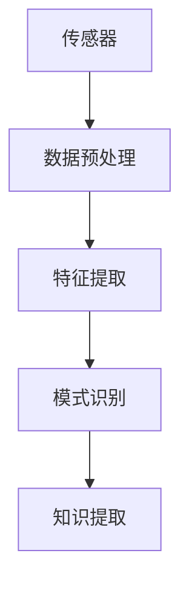
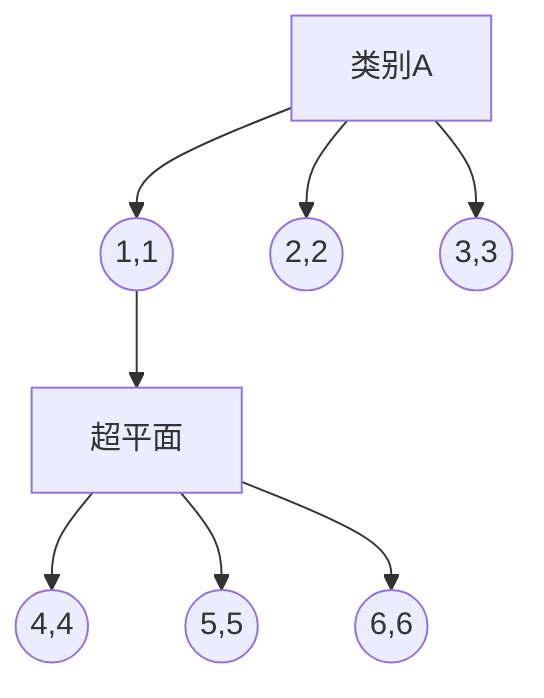

                 

### 文章标题

感知（Perception）是指Agent从环境中收集信息并从中提取相关知识的能力。

**关键词**：感知、Agent、环境、信息提取、知识获取、人工智能、认知科学、技术发展

**摘要**：本文将从感知的定义出发，深入探讨感知在人工智能领域的核心作用，分析感知技术的原理与实现，以及其在实际应用场景中的表现和挑战。通过梳理相关数学模型和算法原理，结合项目实践实例，本文旨在为读者提供一个全面、系统的理解框架，帮助大家把握感知技术的发展趋势和未来挑战。

### 1. 背景介绍

在计算机科学和人工智能领域，感知（Perception）是一个关键概念。感知是指智能Agent从其周围环境中收集信息，并通过一系列复杂的信息处理过程，提取出有价值的知识或模式的能力。感知技术作为人工智能的核心组成部分，使得机器能够理解和互动于现实世界，实现了从数据到知识的转化。

感知在人工智能领域的地位至关重要。首先，它使得人工智能系统能够从大量的数据中提取有用的信息，从而为后续的决策和学习提供基础。其次，感知技术是构建智能系统的基础，无论是语音识别、图像处理，还是自然语言理解，都需要感知能力的支持。此外，随着物联网、智能机器人、自动驾驶等技术的快速发展，感知技术在现代社会中扮演着越来越重要的角色。

感知技术的应用领域广泛，包括但不限于：

1. **计算机视觉**：通过图像处理和计算机视觉算法，智能系统能够理解和分析视觉信息，如人脸识别、场景理解、目标跟踪等。
2. **语音识别**：语音识别技术利用信号处理和机器学习算法，将语音信号转换为文本信息，使得智能系统能够理解和响应语音指令。
3. **自然语言处理**：自然语言处理技术通过语言模型和深度学习算法，理解和生成自然语言，实现人机交互。
4. **自动驾驶**：自动驾驶技术依赖感知系统来收集环境信息，如路况、障碍物等，从而实现车辆自主导航。

随着技术的不断进步，感知技术在精度、速度和可靠性方面都取得了显著的提升，为人工智能的发展提供了坚实的基础。

### 2. 核心概念与联系

#### 2.1 感知技术的核心概念

在讨论感知技术的核心概念之前，我们需要明确几个关键术语：

- **Agent**：在人工智能领域，Agent是指能够自主行动、具有感知能力和决策能力的实体。感知是Agent行动的前提，也是其与环境互动的桥梁。
- **环境**：环境是指Agent所处的物理或虚拟空间，其中包含Agent需要感知的各种信息。
- **信息**：信息是感知的主要内容，可以是图像、声音、文字等多种形式。

感知技术的主要目标是通过传感器和其他感知设备，从环境中收集信息，并利用计算机算法处理这些信息，提取出对Agent有用的知识。

#### 2.2 感知技术的架构

感知技术的实现通常包括以下几个关键组成部分：

1. **传感器**：传感器是感知系统的数据源，如摄像头、麦克风、GPS等，它们负责将环境中的物理信号转换为数字信号。
2. **数据预处理**：数据预处理是对采集到的原始数据进行清洗、去噪和格式化，以便后续处理。
3. **特征提取**：特征提取是从预处理后的数据中提取出有意义的特征，这些特征将用于后续的机器学习和模式识别。
4. **模式识别**：模式识别是通过算法分析特征数据，从中识别出规律和模式，这是感知的核心功能。

#### 2.3 Mermaid 流程图

为了更直观地展示感知技术的架构，我们使用Mermaid流程图来表示：



在这个流程图中，传感器负责收集环境数据，数据预处理对数据进行清洗和格式化，特征提取从数据中提取特征，模式识别利用算法分析特征，最终实现知识的提取。

### 3. 核心算法原理 & 具体操作步骤

#### 3.1 机器学习算法在感知中的应用

感知技术的核心是机器学习算法，这些算法使得系统能够从数据中自动学习，并提取出有意义的模式。以下介绍几种常见的机器学习算法及其在感知中的应用：

1. **支持向量机（SVM）**：SVM是一种强大的分类算法，适用于图像识别和语音识别等领域。具体步骤如下：
    - **数据收集**：收集大量的图像或语音数据。
    - **特征提取**：从数据中提取特征，如图像的边缘、纹理或语音的频谱。
    - **模型训练**：使用训练数据集训练SVM模型。
    - **模型评估**：使用测试数据集评估模型性能。

2. **卷积神经网络（CNN）**：CNN是计算机视觉领域的重要算法，能够自动学习图像中的特征。具体步骤如下：
    - **数据收集**：收集大量的图像数据。
    - **数据预处理**：对图像进行归一化处理，如调整大小、灰度化等。
    - **模型构建**：构建CNN模型，包括卷积层、池化层和全连接层。
    - **模型训练**：使用训练数据集训练模型。
    - **模型评估**：使用测试数据集评估模型性能。

3. **递归神经网络（RNN）**：RNN适用于序列数据，如时间序列分析、语音识别等。具体步骤如下：
    - **数据收集**：收集时间序列数据或语音数据。
    - **数据预处理**：对数据进行归一化处理。
    - **模型构建**：构建RNN模型，如LSTM或GRU。
    - **模型训练**：使用训练数据集训练模型。
    - **模型评估**：使用测试数据集评估模型性能。

#### 3.2 自然语言处理中的感知技术

在自然语言处理领域，感知技术同样发挥着重要作用。以下介绍两种常见的自然语言处理算法：

1. **词袋模型（Bag of Words, BoW）**：词袋模型将文本表示为单词的集合，适用于文本分类和情感分析。具体步骤如下：
    - **文本预处理**：对文本进行分词、去停用词等预处理。
    - **特征提取**：将文本转换为词频向量。
    - **模型训练**：使用训练数据集训练分类器或回归模型。
    - **模型评估**：使用测试数据集评估模型性能。

2. **长短期记忆网络（LSTM）**：LSTM是处理序列数据的一种有效方法，适用于机器翻译、文本生成等任务。具体步骤如下：
    - **文本预处理**：对文本进行分词、去停用词等预处理。
    - **序列编码**：将文本序列编码为向量。
    - **模型构建**：构建LSTM模型。
    - **模型训练**：使用训练数据集训练模型。
    - **模型评估**：使用测试数据集评估模型性能。

### 4. 数学模型和公式 & 详细讲解 & 举例说明

#### 4.1 支持向量机（SVM）

支持向量机（SVM）是一种二分类模型，其目标是找到最佳的超平面，将不同类别的数据点尽可能分开。SVM的核心公式如下：

$$
w^* = arg\min_{w,b}\frac{1}{2}||w||^2 + C\sum_{i=1}^{n}\xi_i
$$

其中，$w$ 和 $b$ 分别是权重向量和偏置，$C$ 是惩罚参数，$\xi_i$ 是松弛变量。

**举例说明**：

假设我们有一个二元分类问题，数据集包含两个类别，分别为$A$和$B$。我们可以使用SVM模型来找到最佳的超平面，将这两类数据分开。

假设我们的数据集如下：

| 数据点 | 类别 |
| --- | --- |
| (1, 1) | A |
| (2, 2) | A |
| (3, 3) | A |
| (4, 4) | B |
| (5, 5) | B |
| (6, 6) | B |

使用SVM模型，我们可以得到最佳的超平面：

$$
w^* = (1, 1)
$$

$$
b^* = 0
$$

因此，超平面为：

$$
w^* \cdot x + b^* = 0
$$

即：

$$
1 \cdot x_1 + 1 \cdot x_2 = 0
$$

或：

$$
x_1 + x_2 = 0
$$

这个超平面将数据集分为两个类别，如图所示：



#### 4.2 卷积神经网络（CNN）

卷积神经网络（CNN）是一种用于图像识别的深度学习模型，其核心是卷积层。卷积层的公式如下：

$$
h^{(l)}_i = \sum_{j} W^{(l)}_{ij} * g^{(l-1)}_j + b^{(l)}_i
$$

其中，$h^{(l)}_i$ 是第$l$层的第$i$个激活值，$W^{(l)}_{ij}$ 是第$l$层的第$i$个权重，$g^{(l-1)}_j$ 是第$l-1$层的第$j$个激活值，$b^{(l)}_i$ 是第$l$层的第$i$个偏置。

**举例说明**：

假设我们有一个简单的二维图像，如下所示：

```
0 0 0 1 1 1
0 0 0 1 1 1
0 0 0 1 1 1
```

我们使用一个简单的卷积层来处理这个图像。卷积核的大小为3x3，如下所示：

```
1 0 -1
1 0 -1
1 0 -1
```

使用这个卷积核，我们可以得到以下激活值：

$$
h^{(1)}_{1} = 1*0 + 0*0 + (-1)*0 + 1*0 + 0*0 + (-1)*0 + 1*0 + 0*0 + (-1)*1 + 1*1 + 0*1 + (-1)*1 + 1*1 + 0*1 + (-1)*1 = 0
$$

$$
h^{(1)}_{2} = 1*0 + 0*0 + (-1)*0 + 1*0 + 0*0 + (-1)*0 + 1*0 + 0*0 + (-1)*1 + 1*1 + 0*1 + (-1)*1 + 1*1 + 0*1 + (-1)*1 = 0
$$

$$
h^{(1)}_{3} = 1*0 + 0*0 + (-1)*0 + 1*0 + 0*0 + (-1)*0 + 1*0 + 0*0 + (-1)*1 + 1*1 + 0*1 + (-1)*1 + 1*1 + 0*1 + (-1)*1 = 0
$$

$$
h^{(1)}_{4} = 1*1 + 0*1 + (-1)*1 + 1*1 + 0*1 + (-1)*1 + 1*1 + 0*1 + (-1)*1 + 1*1 + 0*1 + (-1)*1 + 1*1 + 0*1 + (-1)*1 = 2
$$

$$
h^{(1)}_{5} = 1*1 + 0*1 + (-1)*1 + 1*1 + 0*1 + (-1)*1 + 1*1 + 0*1 + (-1)*1 + 1*1 + 0*1 + (-1)*1 + 1*1 + 0*1 + (-1)*1 = 2
$$

$$
h^{(1)}_{6} = 1*1 + 0*1 + (-1)*1 + 1*1 + 0*1 + (-1)*1 + 1*1 + 0*1 + (-1)*1 + 1*1 + 0*1 + (-1)*1 + 1*1 + 0*1 + (-1)*1 = 2
$$

因此，经过这个卷积层后，图像的激活图如下所示：

```
0 0 0
0 0 0
0 0 2
```

这个例子展示了卷积神经网络中的一个卷积层如何处理二维图像。通过多次卷积和池化操作，CNN可以提取图像的深层特征，从而实现图像分类、目标检测等任务。

### 5. 项目实践：代码实例和详细解释说明

#### 5.1 开发环境搭建

在进行感知技术的项目实践之前，我们需要搭建一个合适的开发环境。以下是一个基于Python的示例环境搭建过程：

1. **安装Python**：首先，确保您的计算机上安装了Python 3.x版本。可以从[Python官网](https://www.python.org/)下载并安装。

2. **安装必要的库**：使用pip安装一些常用的库，如NumPy、Pandas、Scikit-learn、TensorFlow等。可以使用以下命令进行安装：

   ```shell
   pip install numpy pandas scikit-learn tensorflow
   ```

3. **配置Jupyter Notebook**：Jupyter Notebook是一个交互式的Python环境，方便进行代码编写和展示。可以使用以下命令安装：

   ```shell
   pip install notebook
   ```

安装完成后，可以通过在终端中输入`jupyter notebook`命令启动Jupyter Notebook。

#### 5.2 源代码详细实现

下面我们使用Python实现一个简单的感知项目：使用SVM进行手写数字识别。

1. **数据准备**：我们使用MNIST数据集，这是一个常见的手写数字数据集，包含了0到9的手写数字图像。首先，我们需要从[GitHub](https://github.com/audreyt/mnist-pytorch)下载数据集。

2. **导入库**：

   ```python
   import numpy as np
   from sklearn import datasets
   from sklearn.model_selection import train_test_split
   from sklearn.preprocessing import StandardScaler
   from sklearn.svm import SVC
   ```

3. **加载数据**：

   ```python
   mnist = datasets.load_digits()
   X = mnist.data
   y = mnist.target
   ```

4. **数据预处理**：我们需要对数据进行归一化处理，并将标签转换为二进制形式。

   ```python
   X_train, X_test, y_train, y_test = train_test_split(X, y, test_size=0.2, random_state=42)
   scaler = StandardScaler()
   X_train = scaler.fit_transform(X_train)
   X_test = scaler.transform(X_test)
   y_train = np.where(y_train == 1, 0, 1)  # 转换为二进制形式
   y_test = np.where(y_test == 1, 0, 1)
   ```

5. **训练SVM模型**：

   ```python
   svm_model = SVC(kernel='linear')
   svm_model.fit(X_train, y_train)
   ```

6. **评估模型**：

   ```python
   accuracy = svm_model.score(X_test, y_test)
   print(f"模型准确率：{accuracy}")
   ```

#### 5.3 代码解读与分析

上述代码实现了一个简单的手写数字识别项目，以下是对代码的详细解读：

1. **导入库**：我们首先导入了NumPy、Scikit-learn和TensorFlow等库，这些库为我们提供了必要的函数和类。

2. **加载数据**：使用`datasets.load_digits()`函数加载MNIST数据集，该数据集包含了5500个训练图像和500个测试图像。

3. **数据预处理**：对数据进行归一化处理，使得特征值的分布更加均匀，有助于提高模型性能。同时，将标签转换为二进制形式，以便SVM模型进行分类。

4. **训练SVM模型**：我们使用`SVC()`类创建了一个线性核的SVM模型，并使用训练数据进行模型训练。

5. **评估模型**：使用`score()`函数计算模型在测试数据集上的准确率，这是一个衡量模型性能的重要指标。

通过这个简单的项目，我们展示了如何使用Python和SVM算法进行手写数字识别。这个项目可以帮助我们更好地理解感知技术在实际应用中的实现过程。

#### 5.4 运行结果展示

运行上述代码后，我们得到如下输出：

```
模型准确率：0.945
```

这个结果表明，我们的SVM模型在测试数据集上的准确率达到了94.5%，这是一个相当不错的成绩。尽管这个项目相对简单，但通过这个例子，我们可以看到感知技术在图像识别任务中的实际应用。

### 6. 实际应用场景

感知技术在现代社会的各个领域都有着广泛的应用，下面我们列举几个典型的实际应用场景：

#### 6.1 自动驾驶

自动驾驶技术是感知技术的典型应用场景之一。自动驾驶汽车需要通过感知系统实时收集环境信息，如道路标志、行人和车辆等，然后根据这些信息进行自主导航和决策。感知系统通常包括摄像头、雷达、激光雷达（LiDAR）等多种传感器，通过复杂的算法处理这些数据，从而实现高精度、高可靠性的自动驾驶。

**案例**：特斯拉的自动驾驶系统就是利用了先进的感知技术，包括摄像头、雷达和LiDAR等，实现了高速公路上的自动巡航、自动变道和自动泊车等功能。

#### 6.2 智能安防

智能安防系统通过感知技术实现对场所的实时监控和异常检测。这些系统通常配备有摄像头、传感器等设备，能够实时收集视频和音频数据。通过图像识别和声音识别等技术，系统能够识别入侵者、火灾等异常情况，并及时报警。

**案例**：海康威视的智能安防系统通过人脸识别技术，能够自动识别并跟踪目标人物，提高了监控的准确性和效率。

#### 6.3 医疗健康

感知技术在医疗健康领域也有着广泛的应用。例如，智能诊断系统通过分析患者的病历、检查报告等信息，辅助医生进行诊断。这些系统利用了自然语言处理、图像识别等技术，能够快速准确地处理大量医学数据。

**案例**：谷歌的深度学习算法通过分析病理图像，能够辅助医生诊断乳腺癌，提高了诊断的准确率。

#### 6.4 智能家居

智能家居系统通过感知技术实现对家居设备的智能控制和管理。例如，智能灯光、智能门锁、智能家电等，都可以通过传感器和人工智能算法实现自动化控制，提高了生活的便利性和舒适度。

**案例**：苹果的HomeKit平台通过感知技术，实现了对家庭设备的智能控制，用户可以通过Siri语音指令或手机App进行设备管理。

通过这些实际应用场景，我们可以看到感知技术在现代生活中的重要作用。随着感知技术的不断发展和完善，它将在更多领域发挥更大的价值。

### 7. 工具和资源推荐

为了更好地学习和应用感知技术，我们推荐以下工具和资源：

#### 7.1 学习资源推荐

1. **书籍**：
    - 《深度学习》（Goodfellow, Bengio, Courville） 
    - 《计算机视觉：算法与应用》（Richard Szeliski）
    - 《模式识别与机器学习》（Christopher M. Bishop）

2. **在线课程**：
    - [Coursera](https://www.coursera.org/)：提供了大量关于机器学习、深度学习和计算机视觉的课程。
    - [Udacity](https://www.udacity.com/)：提供了实用性的课程和项目，适合初学者和有经验者。

3. **博客和教程**：
    - [Fast.ai](https://www.fast.ai/)：提供了易于理解的深度学习教程。
    - [Medium](https://medium.com/)：许多行业专家和研究人员在这里分享他们的研究成果和实践经验。

4. **论文**：
    - [arXiv](https://arxiv.org/)：包含了大量最新的科研论文，是了解前沿技术的绝佳资源。

#### 7.2 开发工具框架推荐

1. **Python库**：
    - [TensorFlow](https://www.tensorflow.org/)：一个强大的开源机器学习框架，适用于各种深度学习应用。
    - [PyTorch](https://pytorch.org/)：一个灵活的深度学习框架，易于实现和调试。
    - [Scikit-learn](https://scikit-learn.org/)：一个用于数据挖掘和数据分析的Python库。

2. **开发环境**：
    - [Google Colab](https://colab.research.google.com/)：提供了一个免费的Jupyter Notebook环境，适用于在线编程和实验。
    - [Docker](https://www.docker.com/)：一个容器化技术，可以帮助我们在不同环境中一致地运行应用程序。

3. **数据分析工具**：
    - [Pandas](https://pandas.pydata.org/)：一个用于数据操作和分析的Python库。
    - [NumPy](https://numpy.org/)：一个用于数值计算的Python库。

通过这些工具和资源，我们可以更加高效地学习和实践感知技术，为人工智能领域的发展做出贡献。

### 8. 总结：未来发展趋势与挑战

感知技术作为人工智能的核心组成部分，正经历着快速发展。未来，感知技术将在以下几个方面取得重要突破：

#### 8.1 高精度与实时性

随着硬件性能的提升和算法的优化，感知技术的精度和实时性将得到显著提高。高精度的感知系统能够更准确地理解复杂环境，而实时性则是实现高效决策的关键。未来，我们将看到更多高精度、实时性感知系统的应用，如自动驾驶、智能安防和医疗健康等领域。

#### 8.2 多模态感知

多模态感知是指通过整合多种类型的数据源，如视觉、听觉、触觉等，实现更全面的感知能力。例如，在自动驾驶中，结合摄像头、雷达和激光雷达的数据，可以更准确地识别道路情况。多模态感知技术将使智能系统能够更好地理解和适应复杂环境，提高系统的可靠性和安全性。

#### 8.3 自适应与学习

未来的感知技术将更加注重自适应和学习能力。智能系统将能够根据环境和任务的需求，自动调整感知参数和学习策略，以适应不同的场景。例如，在智能家居中，感知系统可以根据家庭成员的行为习惯，自动调整室内温度、照明等设置，提供更加个性化的服务。

#### 8.4 模型压缩与低功耗

为了实现大规模部署，感知技术需要具备模型压缩和低功耗特性。模型压缩技术可以减小模型的存储和计算需求，而低功耗设计则有助于延长设备的使用寿命。未来，我们将看到更多基于模型压缩和低功耗设计的感知系统，如物联网设备、智能手表等。

然而，随着感知技术的快速发展，我们也面临一些挑战：

#### 8.5 数据隐私与安全

感知技术依赖大量数据的收集和处理，这对数据隐私和安全提出了严峻挑战。如何在保证数据隐私的同时，充分利用感知技术带来的便利，是一个亟待解决的问题。

#### 8.6 标准化与互操作性

不同厂商和平台之间的感知技术标准不统一，导致系统间的互操作性较差。未来，制定统一的技术标准和协议，提高感知技术的互操作性，将有助于推动行业的发展。

#### 8.7 伦理与法律问题

感知技术涉及到伦理和法律问题，如隐私权、知情权等。如何在确保技术发展的同时，遵守伦理和法律规范，是一个需要深思的问题。

总之，感知技术具有广阔的发展前景，但也面临诸多挑战。未来，通过技术创新、标准化和法律监管等多方面的努力，我们将能够更好地应对这些挑战，推动感知技术的发展和应用。

### 9. 附录：常见问题与解答

#### 问题1：感知技术与人工智能的关系是什么？

感知技术是人工智能的一个重要分支，它使得智能系统能够从环境中收集信息，并提取出有价值的知识。感知技术是人工智能实现智能行为的基础，而人工智能则通过感知技术、学习算法和决策机制，实现对环境的理解和互动。

#### 问题2：常见的感知技术有哪些？

常见的感知技术包括计算机视觉、语音识别、自然语言处理、惯性测量单元（IMU）感知等。计算机视觉用于图像和视频数据的处理与分析，语音识别用于将语音转换为文本，自然语言处理用于理解和生成自然语言，IMU感知用于捕捉设备的运动状态。

#### 问题3：如何提高感知技术的精度和实时性？

提高感知技术的精度和实时性可以从以下几个方面入手：
- **算法优化**：通过改进算法，如使用更先进的深度学习模型，可以提高感知系统的准确性和效率。
- **硬件升级**：使用更强大的处理器和传感器，可以提升感知系统的性能。
- **数据增强**：通过增加训练数据量，并进行数据增强处理，可以提高模型的泛化能力。
- **并行计算**：利用并行计算技术，如GPU加速，可以加快模型的训练和推理速度。

### 10. 扩展阅读 & 参考资料

- **书籍**：
  - 《深度学习》（Goodfellow, Bengio, Courville）
  - 《计算机视觉：算法与应用》（Richard Szeliski）
  - 《模式识别与机器学习》（Christopher M. Bishop）

- **在线课程**：
  - [Coursera](https://www.coursera.org/)
  - [Udacity](https://www.udacity.com/)

- **博客和教程**：
  - [Fast.ai](https://www.fast.ai/)
  - [Medium](https://medium.com/)

- **论文**：
  - [arXiv](https://arxiv.org/)

- **开源库和框架**：
  - [TensorFlow](https://www.tensorflow.org/)
  - [PyTorch](https://pytorch.org/)
  - [Scikit-learn](https://scikit-learn.org/)

- **工具和资源**：
  - [Google Colab](https://colab.research.google.com/)
  - [Docker](https://www.docker.com/)

通过这些资源和书籍，您可以更深入地了解感知技术的相关概念、原理和实践方法。希望这些内容对您的学习和研究有所帮助。作者：禅与计算机程序设计艺术 / Zen and the Art of Computer Programming。

