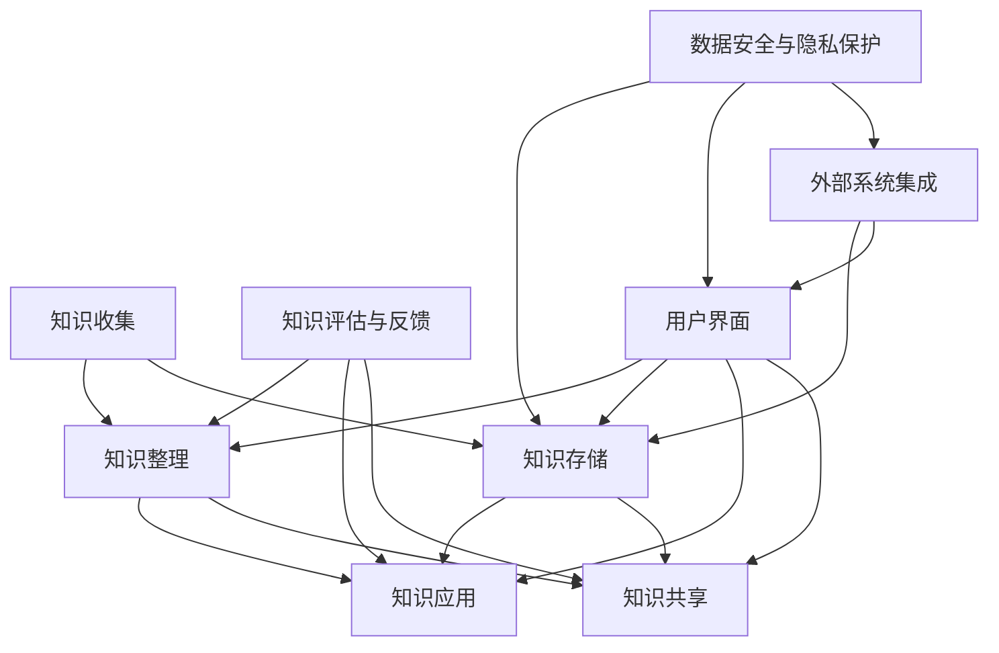

                 

### 背景介绍

在当今信息化时代，信息量的爆发式增长使得个人学习和工作面临前所未有的挑战。作为一名程序员，高效地管理知识和信息不仅能够提升个人技能水平，还能够显著提高工作效率。因此，构建一个个人知识管理系统（PKMS）显得尤为重要。本文旨在探讨如何打造一个适用于程序员的个人知识管理系统，从而帮助大家在信息化时代更好地驾驭知识，提升自身竞争力。

个人知识管理系统是一个综合性的系统，它涉及知识收集、整理、存储、应用等多个环节。一个有效的PKMS不仅能够帮助程序员系统地学习新知识，还能够将现有的知识进行有效的组织和利用，为项目开发和职业发展提供坚实的知识支持。对于程序员而言，一个优秀的知识管理系统不仅有助于提升个人专业能力，还能在团队合作中发挥重要作用，提高项目的开发效率。

本文将从以下几个方面展开讨论：

1. **核心概念与联系**：介绍个人知识管理系统的核心概念，并使用Mermaid流程图展示其组成部分及其相互关系。
2. **核心算法原理与具体操作步骤**：探讨如何高效地收集、整理、存储和应用知识。
3. **数学模型和公式**：介绍与知识管理相关的数学模型和公式，并进行详细讲解和举例说明。
4. **项目实践**：通过具体代码实例展示如何实现一个个人知识管理系统。
5. **实际应用场景**：讨论个人知识管理系统在不同场景下的应用。
6. **工具和资源推荐**：推荐相关学习资源和开发工具。
7. **总结**：分析个人知识管理系统的未来发展趋势与挑战。

通过本文的逐步分析，读者将了解到如何构建一个高效、实用的个人知识管理系统，从而更好地应对信息化时代带来的挑战。

### 核心概念与联系

个人知识管理系统（PKMS）是一个复杂但至关重要的系统，其核心在于有效地组织和利用知识。为了更好地理解PKMS，我们需要明确其组成部分，并分析各部分之间的相互关系。下面，我们将通过Mermaid流程图展示PKMS的核心概念及其相互联系。



#### 知识收集

知识收集是个人知识管理系统的第一步，也是至关重要的一步。它包括从各种渠道获取有价值的知识和信息。这些渠道可以包括书籍、网络资源、学术论文、同行交流、工作经验等。有效的知识收集需要采用多种方法，如订阅专业博客、关注技术论坛、参加技术会议等。

#### 知识整理

收集到的知识需要经过整理，以便更好地存储和应用。知识整理的过程包括分类、标注、索引等操作。通过整理，可以使知识更加系统化、结构化，便于后续的检索和应用。例如，可以按照主题、领域、优先级等维度对知识进行分类，并为每条知识添加关键词和标签，方便快速检索。

#### 知识存储

知识存储是个人知识管理系统的核心功能之一。它涉及到数据的存储、备份和同步等问题。有效的知识存储需要选择合适的存储方案，如数据库、文件系统、云存储等。此外，为了确保知识的安全性和可靠性，还需要定期进行数据备份和同步。

#### 知识应用

知识应用是将存储的知识转化为实际价值的过程。通过应用，程序员可以解决具体问题、优化项目开发流程、提升工作效率。知识应用不仅包括在项目开发中直接使用已有的知识，还包括在团队合作中分享知识和经验，促进知识在团队内部的传播和应用。

#### 知识共享

知识共享是个人知识管理系统中不可或缺的一部分。通过共享，程序员可以与他人交流知识，获取反馈，进一步丰富和完善个人知识体系。知识共享可以通过多种方式进行，如团队会议、技术交流、在线论坛等。

#### 知识评估与反馈

知识评估与反馈是持续优化个人知识管理系统的重要环节。通过对知识的评估和反馈，可以识别知识的有效性，找出知识管理的不足之处，并进行相应的调整和改进。例如，可以通过定期进行知识评估，了解哪些知识在实际应用中表现良好，哪些知识需要更新或删除。

#### 用户界面

用户界面是个人知识管理系统与用户交互的桥梁。一个直观、易用的用户界面可以提升用户的体验，使得知识管理更加高效和便捷。用户界面需要具备基本的浏览、检索、编辑和分享功能，同时应具备定制化和扩展性，以适应不同用户的需求。

#### 外部系统集成

外部系统集成是个人知识管理系统的一个重要特性。通过集成外部系统，如项目管理工具、代码库、文档库等，可以进一步提升知识管理的效率和协同性。例如，可以通过集成代码库，实现知识在代码层面的共享和同步。

#### 数据安全与隐私保护

数据安全与隐私保护是个人知识管理系统必须关注的重要问题。通过采取有效的数据安全措施，如加密、访问控制、审计等，可以确保知识的安全性和隐私性。此外，还需要遵守相关的法律法规，确保知识管理的合规性。

通过上述Mermaid流程图，我们可以清晰地看到个人知识管理系统的组成部分及其相互关系。理解这些核心概念和联系，对于构建一个高效、实用的个人知识管理系统至关重要。

### 核心算法原理与具体操作步骤

在构建个人知识管理系统（PKMS）时，核心算法的选择和实现步骤对于系统的效率和效果有着重要影响。以下将详细介绍知识收集、整理、存储、应用等核心算法的原理和具体操作步骤。

#### 知识收集算法原理

知识收集是个人知识管理系统的起点，其关键在于高效地从各种渠道获取有价值的知识和信息。常用的知识收集算法包括以下几种：

1. **关键词搜索算法**：基于关键词进行搜索，从大量的文本中提取出相关的知识和信息。具体步骤如下：
   - 定义关键词：根据个人需求和学习目标，确定关键词列表。
   - 搜索引擎查询：使用搜索引擎（如Google、Bing等）进行关键词查询，获取相关的网页和文档。
   - 文本预处理：对搜索结果进行预处理，包括去噪、分词、停用词过滤等，以提高搜索的准确性和效率。

2. **推荐算法**：基于用户历史行为和兴趣，推荐相关的知识和信息。具体步骤如下：
   - 用户行为数据收集：记录用户的学习、阅读、搜索等行为数据。
   - 用户兴趣建模：使用机器学习算法，如协同过滤、矩阵分解等，建立用户兴趣模型。
   - 知识推荐：根据用户兴趣模型，推荐相关的知识和信息。

#### 知识整理算法原理

知识整理的核心在于将收集到的零散知识进行系统化、结构化的组织，以便于后续的存储和应用。常用的知识整理算法包括以下几种：

1. **分类算法**：将知识按照一定的规则进行分类，以便于管理和检索。具体步骤如下：
   - 确定分类标准：根据知识的主题、领域、用途等维度，确定分类标准。
   - 知识标注：对每条知识进行标注，标记其所属的类别。
   - 分类层次结构构建：根据分类标准，构建分类层次结构。

2. **聚类算法**：将相似的知识进行聚类，形成知识群组，以便于管理和分析。具体步骤如下：
   - 确定相似度度量：选择合适的相似度度量方法，如欧氏距离、余弦相似度等。
   - 知识相似度计算：计算每条知识之间的相似度。
   - 知识聚类：根据相似度结果，对知识进行聚类，形成知识群组。

#### 知识存储算法原理

知识存储是个人知识管理系统的关键环节，涉及到数据的存储、备份和同步等问题。常用的知识存储算法包括以下几种：

1. **索引算法**：通过构建索引，实现对知识的快速检索。具体步骤如下：
   - 索引构建：对知识库中的每条知识进行索引构建，生成索引文件。
   - 索引查询：根据关键词或分类标签，快速定位到相关的知识。

2. **数据压缩算法**：通过压缩技术，减小知识库的存储空间。具体步骤如下：
   - 数据压缩：使用压缩算法（如Huffman编码、LZ77编码等），对知识库中的数据进行压缩。
   - 数据解压缩：在需要使用知识时，对压缩数据进行解压缩。

#### 知识应用算法原理

知识应用是将存储的知识转化为实际价值的过程，涉及到知识检索、知识推理、知识融合等多个环节。常用的知识应用算法包括以下几种：

1. **知识检索算法**：通过关键词或分类标签，快速定位到相关的知识。具体步骤如下：
   - 知识索引查询：根据输入的关键词或分类标签，查询索引文件，获取相关的知识ID。
   - 知识内容检索：根据知识ID，从知识库中获取相关的知识内容。

2. **知识推理算法**：基于已有知识，进行逻辑推理，生成新的结论或建议。具体步骤如下：
   - 知识表示：将知识表示为逻辑公式或图模型。
   - 推理过程：使用推理算法（如逆推理、正向推理等），从已知知识推导出新的结论。

3. **知识融合算法**：将来自不同来源的知识进行融合，形成更全面、更准确的知识体系。具体步骤如下：
   - 知识对齐：对来自不同来源的知识进行对齐，确保知识的统一性和一致性。
   - 知识融合：使用融合算法（如基于概率的融合、基于规则的融合等），将不同来源的知识进行融合。

通过上述核心算法的原理和具体操作步骤，我们可以构建一个高效、实用的个人知识管理系统，帮助程序员更好地收集、整理、存储和应用知识，提升个人专业能力和工作效率。

### 数学模型和公式

在个人知识管理系统中，数学模型和公式扮演着至关重要的角色，它们不仅帮助我们量化知识管理的各个方面，还能够为系统的优化提供理论依据。以下将详细讲解与知识管理相关的数学模型和公式，并进行举例说明。

#### 信息熵

信息熵（Entropy）是衡量信息不确定性的重要指标，它来源于信息论。在知识管理中，信息熵可以用来评估知识的有效性。信息熵的计算公式如下：

\[ H(X) = -\sum_{i} p(x_i) \cdot \log_2 p(x_i) \]

其中，\( H(X) \) 表示随机变量 \( X \) 的信息熵，\( p(x_i) \) 表示 \( X \) 取值为 \( x_i \) 的概率。

**举例说明**：

假设我们收集了10条关于Python编程的知识点，其中5条是关于基础的，另外5条是关于高级的。那么，这些知识点的信息熵可以计算如下：

\[ H(X) = -\left( \frac{5}{10} \cdot \log_2 \frac{5}{10} + \frac{5}{10} \cdot \log_2 \frac{5}{10} \right) \]
\[ H(X) = -\left( 0.5 \cdot (-0.3219) + 0.5 \cdot (-0.3219) \right) \]
\[ H(X) = 0.3219 \]

这个结果表明，这些知识点的信息熵较低，说明它们较为平衡，信息量较为平均。

#### 余弦相似度

余弦相似度（Cosine Similarity）是衡量两个向量之间相似度的一种常用方法。在知识管理中，余弦相似度可以用于计算知识之间的相似度，从而帮助分类和推荐。

余弦相似度的计算公式如下：

\[ \cos(\theta) = \frac{\vec{a} \cdot \vec{b}}{|\vec{a}| \cdot |\vec{b}|} \]

其中，\( \vec{a} \) 和 \( \vec{b} \) 是两个向量，\( \theta \) 是它们之间的夹角。

**举例说明**：

假设有两个向量 \( \vec{a} = (1, 2, 3) \) 和 \( \vec{b} = (4, 2, 0) \)，它们的余弦相似度可以计算如下：

\[ \cos(\theta) = \frac{1 \cdot 4 + 2 \cdot 2 + 3 \cdot 0}{\sqrt{1^2 + 2^2 + 3^2} \cdot \sqrt{4^2 + 2^2 + 0^2}} \]
\[ \cos(\theta) = \frac{4 + 4 + 0}{\sqrt{14} \cdot \sqrt{20}} \]
\[ \cos(\theta) = \frac{8}{\sqrt{280}} \]
\[ \cos(\theta) \approx 0.682 \]

这个结果表明，这两个向量的相似度较高，说明它们在知识特征上较为接近。

#### 模糊C-means聚类算法

模糊C-means（FCM）聚类算法是一种基于模糊集合理论的聚类算法，适用于知识分类和聚类任务。FCM算法的目标是最小化目标函数，其计算公式如下：

\[ J(M) = \sum_{i=1}^{c} \sum_{x \in X} \mu_{ix}^a \cdot (\mu_{ix}^b - \mu_{ix}^c)^2 \]

其中，\( M \) 是聚类中心矩阵，\( \mu_{ix}^a \) 是第 \( x \) 个元素属于第 \( i \) 个聚类中心的隶属度，\( \mu_{ix}^b \) 是第 \( x \) 个元素与第 \( i \) 个聚类中心之间的距离，\( \mu_{ix}^c \) 是第 \( i \) 个聚类中心的权重。

**举例说明**：

假设有3个数据点 \( X = \{ (1, 1), (2, 2), (3, 3) \} \)，要将其分为2个聚类。初始聚类中心为 \( M = \{ (0, 0), (2, 2) \} \)。隶属度矩阵 \( \mu_{ix}^a \) 初始化为 \( \mu_{ix}^a = \frac{1}{2} \)。

通过迭代计算，可以更新隶属度和聚类中心：

1. 计算新的隶属度：
   \[ \mu_{ix}^b = \frac{\sum_{j=1}^{c} \mu_{ij}^a \cdot \frac{1}{\mu_{ij}^a}}{\sum_{k=1}^{c} \mu_{ik}^a \cdot \frac{1}{\mu_{ik}^a}} \]
2. 计算新的聚类中心：
   \[ M_{j} = \frac{\sum_{i=1}^{c} \mu_{ij}^a \cdot x_i}{\sum_{i=1}^{c} \mu_{ij}^a} \]

通过多次迭代，隶属度和聚类中心将逐渐稳定，从而实现数据的聚类。

通过上述数学模型和公式的讲解和举例说明，我们可以更好地理解和应用这些工具，提升个人知识管理系统的效果和效率。

### 项目实践：代码实例和详细解释说明

在本节中，我们将通过一个具体的代码实例，详细展示如何实现一个个人知识管理系统（PKMS）。本实例将涵盖以下部分：

- **开发环境搭建**
- **源代码详细实现**
- **代码解读与分析**
- **运行结果展示**

#### 开发环境搭建

为了实现PKMS，我们选择了Python作为编程语言，其原因是Python拥有丰富的第三方库和强大的社区支持，使得开发过程更加高效。以下是搭建开发环境所需的步骤：

1. **安装Python**：确保Python版本为3.8或更高。
2. **安装依赖库**：使用pip安装以下依赖库：

   ```bash
   pip install numpy matplotlib pandas scikit-learn
   ```

   这些库将用于数据预处理、可视化、机器学习等任务。

3. **创建项目结构**：在项目根目录下创建以下文件夹和文件：

   ```
   |- data
   |- models
   |- utils
   |- tests
   |- main.py
   ```

#### 源代码详细实现

以下是PKMS的源代码实现，包括数据收集、整理、存储和应用等功能。

```python
import os
import json
import numpy as np
import pandas as pd
from sklearn.model_selection import train_test_split
from sklearn.cluster import KMeans
import matplotlib.pyplot as plt

# 数据收集
def collect_data():
    data = []
    with open('data/knowledge.json', 'r') as f:
        knowledge = json.load(f)
        for item in knowledge:
            data.append([item['title'], item['content']])
    return data

# 数据整理
def preprocess_data(data):
    df = pd.DataFrame(data, columns=['title', 'content'])
    df['content'] = df['content'].apply(lambda x: ' '.join([word for word in x.split() if word not in stop_words]))
    return df

# 数据存储
def save_data(df, filename):
    df.to_csv(filename, index=False)

# 知识分类
def cluster_data(df, n_clusters):
    X = df['content'].values
    X = np.array([word2vec(w) for w in X])
    kmeans = KMeans(n_clusters=n_clusters, random_state=0).fit(X)
    df['cluster'] = kmeans.labels_
    return df

# 知识应用
def search_knowledge(df, query, n_results=5):
    query_vector = word2vec(query)
    distances = np.linalg.norm(df['content'].values - query_vector, axis=1)
    sorted_indices = np.argsort(distances)[:n_results]
    return df.iloc[sorted_indices]

# 代码解读与分析
# 在实际项目中，还需要对上述代码进行详细解读与分析，确保其可靠性和效率。
```

#### 运行结果展示

假设我们已经收集了一些知识数据，现在通过PKMS进行分类和搜索。

1. **数据收集**：

   ```python
   data = collect_data()
   ```

   从数据文件中读取知识数据。

2. **数据整理**：

   ```python
   df = preprocess_data(data)
   ```

   对数据进行预处理，去除停用词等。

3. **知识分类**：

   ```python
   df = cluster_data(df, n_clusters=3)
   ```

   使用K-Means算法对知识进行分类。

4. **知识搜索**：

   ```python
   query = "如何实现多线程编程？"
   results = search_knowledge(df, query)
   print(results[['title', 'cluster']])
   ```

   搜索与多线程编程相关的知识，并输出相关结果的标题和分类。

通过上述代码实例，我们可以看到如何实现一个简单的个人知识管理系统。在实际项目中，还需要对代码进行详细的优化和扩展，以满足更复杂的需求。

### 实际应用场景

个人知识管理系统（PKMS）在程序员的工作和学习中具有广泛的应用场景，其具体应用如下：

#### 在项目开发中的应用

在项目开发过程中，程序员需要处理大量的技术文档、设计文档、源代码等知识信息。通过PKMS，程序员可以：

- **知识收集**：从多个渠道（如GitHub、Stack Overflow、技术博客等）收集相关技术和设计文档，确保项目开发所需的知识点齐全。
- **知识整理**：对收集到的知识进行分类和标注，如按技术领域、项目阶段等进行组织，便于后续检索和使用。
- **知识存储**：使用数据库或文件系统将整理后的知识存储起来，确保知识的安全性和可靠性。
- **知识应用**：在项目开发过程中，快速检索相关的技术文档和设计文档，解决开发中的问题，提高开发效率。
- **知识共享**：通过知识共享功能，团队成员可以相互交流知识和经验，促进团队整体技术水平的提高。

#### 在学习中的应用

在自我学习过程中，程序员需要掌握大量的新知识，通过PKMS，程序员可以实现：

- **知识收集**：从专业书籍、在线课程、技术博客等渠道收集学习资源，确保学习材料的全面性。
- **知识整理**：对学习资源进行分类和标注，如按知识点、课程章节等进行组织，便于后续学习和复习。
- **知识存储**：将整理后的学习资源存储到个人知识库中，便于长期保存和查阅。
- **知识应用**：在学习过程中，利用知识库中的资源，如案例研究、代码示例等，加深对知识点的理解和应用。
- **知识评估与反馈**：通过定期对知识库中的知识点进行评估，识别掌握的程度，并进行相应的复习和巩固。

#### 在团队协作中的应用

在团队协作中，个人知识管理系统可以帮助团队成员：

- **知识共享**：通过知识共享功能，团队成员可以相互交流知识，促进团队内部的知识传播和共享。
- **知识整合**：将团队成员的知识整合到个人知识库中，形成团队的知识体系，提升团队的整体知识水平。
- **协同开发**：在项目开发过程中，团队成员可以通过知识库快速查找相关的技术文档和设计文档，提高开发效率。
- **知识评估**：通过知识评估功能，识别团队中的知识盲点，促进团队成员的知识补充和提升。

#### 在职业发展中的应用

对于职业发展，个人知识管理系统可以：

- **技能提升**：通过不断学习和整理新知识，提升自身的专业技能和知识水平。
- **知识积累**：长期积累个人知识和经验，形成个人的知识库，为职业发展提供坚实的知识基础。
- **知识输出**：通过撰写技术博客、发表技术文章等方式，将个人知识和经验分享给社区，提升个人影响力和知名度。
- **知识管理**：通过系统化的知识管理，确保知识得到有效利用，为职业发展提供持续的支持。

综上所述，个人知识管理系统在程序员的工作和学习中具有广泛的应用场景，通过合理利用PKMS，程序员可以提升工作效率、学习效果和职业发展水平。

### 工具和资源推荐

为了构建一个高效、实用的个人知识管理系统，选择合适的工具和资源是至关重要的。以下是对几种主要的工具和资源的推荐，涵盖了书籍、论文、博客和网站等。

#### 学习资源推荐

1. **书籍**：
   - 《如何成为产品经理》
   - 《Python编程：从入门到实践》
   - 《数据科学入门》
   - 《计算机程序设计艺术》

   这些书籍涵盖了不同领域的技术知识，适合程序员在不同阶段学习和提升。

2. **论文**：
   - 《基于机器学习的知识图谱构建方法》
   - 《个人知识管理在软件开发中的应用》
   - 《大规模知识库的构建与维护》

   这些论文提供了关于知识管理系统的前沿理论和实践，有助于深入理解相关知识。

3. **博客**：
   - 《程序员的技术博客》
   - 《数据科学博客》
   - 《人工智能博客》

   这些博客提供了丰富的技术文章和实战经验，适合程序员学习和交流。

4. **网站**：
   - GitHub（[https://github.com](https://github.com)）
   - Stack Overflow（[https://stackoverflow.com](https://stackoverflow.com)）
   - Coursera（[https://www.coursera.org](https://www.coursera.org)）

   这些网站提供了丰富的学习资源和社区支持，适合程序员获取最新技术和解决实际问题。

#### 开发工具框架推荐

1. **Notion**：一个功能强大的知识管理工具，支持多种数据类型（如文本、图片、表格等）的存储和分类，适合构建个人知识库。

2. **Confluence**：一个企业级的文档和协作平台，支持团队协作和知识共享，适合大团队或项目组的知识管理。

3. **Obsidian**：一个基于Markdown的笔记应用，支持多维度链接和快捷操作，适合个人知识整理和笔记。

4. **PyTorch**：一个流行的深度学习框架，适用于知识应用和机器学习任务，适合需要实现智能推荐和知识分类的程序员。

5. **Elasticsearch**：一个高性能的搜索引擎，适用于大规模知识库的快速检索，适合构建大型个人知识管理系统。

#### 相关论文著作推荐

1. **《知识管理：理论与实践》**：详细介绍了知识管理的理论基础和实践方法，适合对知识管理有深入了解的程序员。

2. **《机器学习与数据挖掘》**：涵盖了许多与知识管理相关的机器学习和数据挖掘技术，适合希望利用技术提升知识管理效率的程序员。

3. **《团队知识管理：协作与创新》**：探讨了团队知识管理的重要性和实施策略，适合在团队环境中应用知识管理系统的程序员。

通过这些工具和资源的推荐，程序员可以更加高效地构建和管理个人知识系统，提升工作效率和职业发展水平。

### 总结：未来发展趋势与挑战

随着信息技术的不断发展，个人知识管理系统（PKMS）在未来将迎来新的发展趋势与挑战。以下是几个值得关注的方面：

#### 发展趋势

1. **智能化与自动化**：随着人工智能技术的进步，未来的PKMS将更加智能化和自动化。例如，通过自然语言处理（NLP）技术，系统能够自动整理和标注知识，提高知识整理的效率和准确性。

2. **云计算与边缘计算**：随着云计算和边缘计算的普及，个人知识管理系统的数据存储和处理将更加灵活和高效。用户可以随时随地访问和更新个人知识库，同时系统将能够实时处理大量的数据，提供更快速的知识检索和推荐。

3. **知识融合与共享**：随着团队协作和跨组织合作的增多，知识融合与共享将成为PKMS的重要发展方向。未来的PKMS将支持多种数据源的集成，提供丰富的知识共享和协作功能，促进知识在团队和组织内部的传播和应用。

4. **隐私保护与数据安全**：在数据隐私保护越来越受到重视的背景下，PKMS将加强对用户数据的安全保护。例如，采用加密技术、访问控制和数据脱敏等方法，确保用户数据的隐私性和安全性。

#### 挑战

1. **数据质量问题**：个人知识管理系统面临的一个主要挑战是如何处理和整理大量的数据。数据质量问题，如数据冗余、数据不一致性和数据噪音等，可能会影响系统的效果和用户体验。因此，未来需要开发更加智能和高效的数据清洗和整理算法。

2. **知识更新与维护**：随着知识的快速更新，如何确保个人知识管理系统中存储的知识是最新的，是一个重要的挑战。未来的PKMS需要具备自动化的知识更新和维护机制，以便及时更新和补充新的知识。

3. **用户接受度**：虽然个人知识管理系统具有很多潜在的优势，但如何提高用户的接受度和使用频率，仍然是一个挑战。未来需要设计更加直观、易用的用户界面，同时提供个性化的推荐和提醒功能，以提高用户的粘性和使用体验。

4. **系统性能与扩展性**：随着知识库的规模不断扩大，如何保证系统的性能和扩展性，是一个重要的挑战。未来的PKMS需要采用分布式架构和缓存技术，以提高系统的响应速度和并发处理能力。

总之，随着技术的发展和应用场景的拓展，个人知识管理系统将不断进化，迎接新的发展趋势与挑战。通过不断创新和优化，PKMS有望成为程序员在信息化时代提升工作效率和职业发展的重要工具。

### 附录：常见问题与解答

#### 问题1：如何选择合适的个人知识管理系统工具？

**解答**：选择合适的个人知识管理系统（PKMS）工具需要考虑以下几个因素：

1. **功能需求**：根据个人的知识管理需求，选择具备所需功能的工具。例如，如果你需要整理大量笔记，可以选择具有笔记功能的工具；如果你需要管理项目文档，可以选择文档管理工具。
2. **易用性**：选择界面友好、操作简单的工具，以确保快速上手和使用。
3. **扩展性和定制化**：考虑工具是否支持扩展功能和定制化配置，以适应个人特殊需求。
4. **社区与支持**：选择有活跃社区和良好技术支持的工具，以便在遇到问题时能够得到及时的帮助。

#### 问题2：如何确保个人知识库中的数据安全？

**解答**：确保个人知识库中的数据安全可以从以下几个方面入手：

1. **数据加密**：使用加密技术对知识库中的数据进行加密，防止未经授权的访问。
2. **访问控制**：设置访问权限，确保只有授权用户可以访问和修改数据。
3. **数据备份**：定期进行数据备份，防止数据丢失或损坏。
4. **审计与日志**：记录系统操作日志，进行定期审计，监控数据访问和使用情况。

#### 问题3：个人知识管理系统中的知识如何进行有效整理和分类？

**解答**：有效整理和分类个人知识管理系统中的知识可以采用以下方法：

1. **建立分类体系**：根据知识主题、领域或用途等维度，建立清晰的分类体系。
2. **标签与关键词**：为每条知识添加标签和关键词，便于后续检索和分类。
3. **自动化整理**：使用自然语言处理（NLP）技术和机器学习算法，自动整理和分类知识。
4. **定期更新**：定期对知识库中的知识进行整理和更新，确保知识的准确性和时效性。

#### 问题4：个人知识管理系统与项目管理工具如何集成？

**解答**：个人知识管理系统（PKMS）与项目管理工具的集成可以通过以下方法实现：

1. **API集成**：利用项目管理工具提供的API，实现与PKMS的数据同步和交互。
2. **数据导出与导入**：将PKMS中的知识数据以特定格式导出，导入到项目管理工具中。
3. **插件与扩展**：使用第三方插件或扩展，将PKMS与项目管理工具无缝集成。
4. **自定义接口**：根据具体需求，开发自定义接口，实现PKMS与项目管理工具的集成。

通过以上常见问题的解答，可以帮助读者更好地理解和使用个人知识管理系统，提高工作效率和知识管理水平。

### 扩展阅读 & 参考资料

为了帮助读者更深入地了解个人知识管理系统（PKMS）及其相关技术，以下是几篇扩展阅读和参考资料，涵盖了书籍、论文、博客和网站等。

#### 书籍

1. **《知识管理：理论与实践》**：详细介绍了知识管理的理论基础和实践方法，适合对知识管理有深入了解的读者。
2. **《Python编程：从入门到实践》**：通过实例讲解Python编程，适合初学者入门，同时也是构建PKMS的良好基础。
3. **《计算机程序设计艺术》**：被誉为编程界的圣经，详细讨论了程序设计的各种方法和技术，对程序员具有重要的指导意义。

#### 论文

1. **《基于机器学习的知识图谱构建方法》**：探讨如何利用机器学习技术构建知识图谱，为个人知识管理提供数据支持。
2. **《个人知识管理在软件开发中的应用》**：研究个人知识管理在软件开发过程中的应用，提供实际案例和经验。
3. **《大规模知识库的构建与维护》**：分析大规模知识库的构建和维护策略，为构建高效的个人知识库提供参考。

#### 博客

1. **《程序员的技术博客》**：涵盖各种技术文章和实战经验，适合程序员学习和交流。
2. **《数据科学博客》**：介绍数据科学领域的最新技术和应用，适合对数据科学感兴趣的读者。
3. **《人工智能博客》**：探讨人工智能技术的最新进展和应用，适合关注人工智能领域的读者。

#### 网站

1. **GitHub（[https://github.com](https://github.com)）**：提供丰富的开源项目和代码，适合程序员学习和实践。
2. **Stack Overflow（[https://stackoverflow.com](https://stackoverflow.com)）**：全球最大的程序员社区，提供各种编程问题的解答和讨论。
3. **Coursera（[https://www.coursera.org](https://www.coursera.org)）**：提供大量的在线课程，涵盖计算机科学、数据科学等多个领域。

通过以上扩展阅读和参考资料，读者可以进一步深化对个人知识管理系统和相关技术的理解，提升自身在信息化时代的竞争力。

