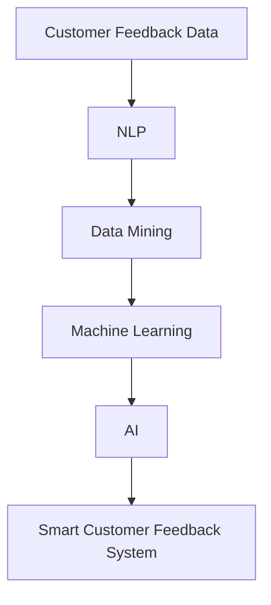

                 

### 背景介绍 Background

在当今的数字化时代，智能客户反馈系统（Smart Customer Feedback System）已经成为企业提高客户满意度、优化产品和服务的关键工具。特别是在一人公司（One-Person Company）中，由于资源有限，智能客户反馈系统更是不可或缺的重要支撑。

一人公司，顾名思义，是由一个人独自运营的企业。这类公司在全球范围内正日益增多，尤其在自由职业者、小型初创企业和远程工作者中具有广泛的影响力。一人公司通常面临着资源稀缺、市场变化快速、竞争激烈等挑战，因此如何高效地获取并利用客户反馈成为公司能否持续发展的重要一环。

传统的客户反馈系统通常依赖人工收集和分析数据，这不仅耗时耗力，而且可能存在偏差。随着人工智能和大数据技术的快速发展，智能客户反馈系统逐渐成为一种更高效、更精准的解决方案。智能客户反馈系统通过自动化手段，不仅能够快速收集大量数据，还能够对数据进行分析，从而为企业提供实时、准确的客户反馈信息。

本文旨在探讨如何打造一款智能客户反馈系统，帮助一人公司持续改进，提升客户满意度和市场竞争力。我们将从核心概念、算法原理、数学模型、项目实践等多个角度，逐步分析并解释这个系统的构建和运作机制。

### 核心概念与联系 Core Concepts and Connections

为了更好地理解智能客户反馈系统的构建过程，我们需要首先了解一些核心概念和它们之间的关系。以下是几个关键概念及其在系统架构中的联系：

#### 1. 客户反馈数据（Customer Feedback Data）

客户反馈数据是智能客户反馈系统的基石。这些数据通常包括客户满意度调查、产品评论、社交媒体反馈、售后服务记录等。通过收集和分析这些数据，企业可以了解客户对产品和服务的真实感受，识别存在的问题和改进的机会。

#### 2. 自然语言处理（Natural Language Processing, NLP）

自然语言处理是人工智能的一个重要分支，它使计算机能够理解和处理人类语言。在智能客户反馈系统中，NLP技术被用来从文本数据中提取有用的信息，如关键词、情感倾向、主题等。NLP的引入大大提高了客户反馈数据处理的效率和质量。

#### 3. 数据挖掘（Data Mining）

数据挖掘是一种从大量数据中挖掘出有价值信息的过程。在智能客户反馈系统中，数据挖掘用于从客户反馈数据中提取模式、趋势和关联性，从而帮助企业做出数据驱动的决策。

#### 4. 机器学习（Machine Learning）

机器学习是一种让计算机通过数据学习并做出预测或决策的技术。在智能客户反馈系统中，机器学习算法可以用于分类客户反馈、预测客户满意度、识别常见问题等任务。

#### 5. 人工智能（Artificial Intelligence, AI）

人工智能是使计算机系统能够模拟人类智能的一系列技术和方法的总称。智能客户反馈系统正是基于人工智能技术，通过整合NLP、数据挖掘和机器学习等技术，实现自动化、智能化的客户反馈处理和分析。

#### 6. Mermaid 流程图（Mermaid Flowchart）

为了更直观地展示这些核心概念和它们之间的联系，我们可以使用Mermaid流程图进行描述。以下是一个简化的Mermaid流程图，展示了这些核心概念在智能客户反馈系统架构中的相互关系：



在这个流程图中，客户反馈数据（A）首先经过NLP处理（B），提取出关键信息。然后，这些信息通过数据挖掘（C）和机器学习（D）进行处理，最终由人工智能（E）整合形成智能客户反馈系统（F）。这个系统不仅能够高效地收集和分析客户反馈，还能够实时响应并为企业提供改进建议。

### 核心算法原理 & 具体操作步骤 Core Algorithm Principles & Step-by-Step Operations

要构建一个高效的智能客户反馈系统，核心算法的选择和实现至关重要。以下是几个关键算法的原理以及如何在实际系统中进行操作。

#### 1. 自然语言处理（NLP）

自然语言处理是智能客户反馈系统的第一步，其核心任务是理解客户反馈中的语言信息。以下是NLP的几个关键步骤：

**（1）文本预处理（Text Preprocessing）**

文本预处理包括去除停用词、标点符号、进行词性标注等操作。这一步骤的目的是简化文本，使其更易于后续处理。

**（2）分词（Tokenization）**

分词是将文本拆分成一个个单词或短语的步骤。在中文处理中，还需要进行词法分析和词义消歧。

**（3）词嵌入（Word Embedding）**

词嵌入是将单词映射到高维向量空间，以便进行计算和分析。常见的词嵌入方法包括Word2Vec、GloVe等。

**（4）情感分析（Sentiment Analysis）**

情感分析是NLP中的一项重要任务，其目标是判断文本的情感倾向（正面、中性、负面）。常用的算法包括基于规则的方法、基于机器学习的方法等。

**操作步骤示例：**

```python
from textblob import TextBlob

feedback = "我对这个产品非常满意，使用体验很好！"
blob = TextBlob(feedback)
sentiment = blob.sentiment
print(sentiment)
```

输出结果为一个包含极性（polarity）和主体性（subjectivity）的字典。

#### 2. 数据挖掘（Data Mining）

数据挖掘用于从大量的客户反馈数据中提取有用的信息和知识。以下是几个常用的数据挖掘算法：

**（1）关联规则挖掘（Association Rule Learning）**

关联规则挖掘用于发现数据集中的关联性。常见的算法包括Apriori算法、FP-growth算法等。

**（2）聚类分析（Clustering）**

聚类分析用于将相似的数据点归为一类。常用的算法包括K-means、DBSCAN等。

**（3）分类算法（Classification）**

分类算法用于将数据分为不同的类别。常用的算法包括决策树、支持向量机、神经网络等。

**操作步骤示例：**

```python
from sklearn.cluster import KMeans

# 假设已经有一个预处理后的文本数据集X
k = 3
kmeans = KMeans(n_clusters=k, random_state=0).fit(X)
clusters = kmeans.labels_
print(clusters)
```

输出结果为每个数据点所属的聚类标签。

#### 3. 机器学习（Machine Learning）

机器学习是智能客户反馈系统中的核心组件，用于处理和预测客户反馈数据。以下是几个常用的机器学习算法：

**（1）监督学习（Supervised Learning）**

监督学习用于从标记数据中学习，并用于预测新数据。常用的算法包括线性回归、逻辑回归、决策树、随机森林等。

**（2）无监督学习（Unsupervised Learning）**

无监督学习用于发现数据中的结构和模式，不依赖于标记数据。常用的算法包括K-means、主成分分析（PCA）等。

**（3）强化学习（Reinforcement Learning）**

强化学习用于在给定环境中通过试错来学习最优策略。常用的算法包括Q-learning、SARSA等。

**操作步骤示例：**

```python
from sklearn.linear_model import LogisticRegression

# 假设已经有一个预处理后的特征数据集X和标签数据y
model = LogisticRegression()
model.fit(X, y)
predictions = model.predict(X_test)
print(predictions)
```

输出结果为预测的类别标签。

#### 4. 人工智能（Artificial Intelligence）

人工智能是智能客户反馈系统的最终目标，通过整合NLP、数据挖掘和机器学习等技术，实现自动化、智能化的客户反馈处理和分析。以下是几个常见的人工智能技术：

**（1）深度学习（Deep Learning）**

深度学习是人工智能的一个重要分支，通过神经网络模型，实现从数据中自动提取特征并进行预测。

**（2）知识图谱（Knowledge Graph）**

知识图谱用于表示实体和它们之间的关系，帮助企业更好地理解和利用数据。

**（3）聊天机器人（Chatbot）**

聊天机器人通过自然语言处理和机器学习技术，实现与用户的交互，提供客户服务和支持。

**操作步骤示例：**

```python
from keras.models import Sequential
from keras.layers import Dense, LSTM

# 假设已经有一个预处理后的序列数据集X
model = Sequential()
model.add(LSTM(50, activation='relu', input_shape=(timesteps, features)))
model.add(Dense(1, activation='sigmoid'))
model.compile(loss='binary_crossentropy', optimizer='adam', metrics=['accuracy'])
model.fit(X, y, epochs=200, batch_size=32, validation_split=0.2)
```

输出结果为模型的训练结果。

通过上述核心算法原理和操作步骤，我们可以构建一个高效的智能客户反馈系统，帮助企业更好地理解客户需求，优化产品和服务，从而实现持续改进。

### 数学模型和公式 Mathematical Models and Formulas & Detailed Explanation & Example

在构建智能客户反馈系统时，数学模型和公式是不可或缺的组成部分。以下将详细介绍几个关键数学模型及其在实际应用中的详细解释和举例说明。

#### 1. 情感分析模型（Sentiment Analysis Model）

情感分析模型用于判断文本数据中的情感倾向，如正面、中性或负面。常见的情感分析模型包括基于机器学习的模型和深度学习模型。以下是几种常用的情感分析模型及其公式：

**（1）朴素贝叶斯（Naive Bayes）**

朴素贝叶斯模型是一种基于概率论的分类算法，其核心思想是假设特征之间相互独立。公式如下：

$$
P(\text{正面}|\text{文本}) = \frac{P(\text{正面}) \cdot P(\text{文本}|\text{正面})}{P(\text{文本})}
$$

其中，$P(\text{正面})$ 表示正面情感的概率，$P(\text{文本}|\text{正面})$ 表示在正面情感条件下文本的概率，$P(\text{文本})$ 表示文本的概率。

**（2）支持向量机（Support Vector Machine, SVM）**

支持向量机是一种常用的分类算法，其目标是在高维空间中找到一个最优的超平面，将不同类别的数据点分隔开。公式如下：

$$
w \cdot x + b = 0
$$

其中，$w$ 表示权重向量，$x$ 表示数据点，$b$ 表示偏置。

**（3）卷积神经网络（Convolutional Neural Network, CNN）**

卷积神经网络是一种深度学习模型，特别适用于图像和文本数据的处理。在情感分析中，CNN可以通过卷积层提取文本中的特征。公式如下：

$$
h_{\text{CNN}}(x) = \sigma(\sum_{k=1}^{K} w_k * \phi_k(x))
$$

其中，$h_{\text{CNN}}(x)$ 表示输出特征，$w_k$ 表示卷积核权重，$\phi_k(x)$ 表示卷积核，$\sigma$ 表示激活函数。

**示例：**

假设我们有一段文本数据：“这个产品非常好，我很满意！”我们需要判断这段文本的情感倾向。

使用朴素贝叶斯模型进行情感分析：

- $P(\text{正面}) = 0.6$
- $P(\text{文本}|\text{正面}) = 0.8$
- $P(\text{文本}) = 0.5$

代入公式：

$$
P(\text{正面}|\text{文本}) = \frac{0.6 \cdot 0.8}{0.5} = 0.96
$$

由于 $P(\text{正面}|\text{文本})$ 接近1，我们可以判断这段文本的情感倾向为正面。

#### 2. 聚类分析模型（Clustering Model）

聚类分析模型用于将相似的数据点归为一类，常见的聚类算法包括K-means、DBSCAN等。以下是K-means算法的公式和步骤：

**（1）初始化：**

随机选择 $k$ 个中心点。

**（2）分配：**

将每个数据点分配到最近的中心点。

**（3）更新：**

重新计算每个聚类中心点的位置。

**（4）重复步骤（2）和（3），直到聚类中心点不再发生变化。**

**K-means算法公式：**

$$
c_j = \frac{1}{N_j} \sum_{x_i \in S_j} x_i
$$

其中，$c_j$ 表示第 $j$ 个聚类中心点，$N_j$ 表示第 $j$ 个聚类中的数据点数量，$S_j$ 表示第 $j$ 个聚类。

**示例：**

假设我们有一组数据点：

```
[1, 2], [1, 4], [1, 0],
[10, 2], [10, 4], [10, 0]
```

使用K-means算法进行聚类，选择 $k=2$。

- 初始化：选择两个随机中心点 $(1, 1)$ 和 $(10, 1)$。
- 分配：将数据点分配到最近的中心点，得到聚类结果：
  - 聚类1：[1, 2], [1, 4], [1, 0]
  - 聚类2：[10, 2], [10, 4], [10, 0]
- 更新：重新计算每个聚类中心点的位置，得到新的中心点：
  - 聚类1：[1, 1.67]
  - 聚类2：[10, 1.67]
- 重复分配和更新，直到聚类中心点不再发生变化。

最终，我们得到两个聚类：
```
聚类1：[1, 2], [1, 4], [1, 0]
聚类2：[10, 2], [10, 4], [10, 0]
```

#### 3. 分类模型（Classification Model）

分类模型用于将数据分为不同的类别，常见的分类算法包括逻辑回归、决策树、随机森林等。以下是逻辑回归模型的公式和步骤：

**（1）假设：**

每个类别 $y$ 与特征向量 $x$ 之间的关系可以用逻辑函数表示：

$$
P(y=1|x) = \frac{1}{1 + e^{-(\beta_0 + \beta_1 x_1 + \beta_2 x_2 + \ldots + \beta_n x_n})}
$$

其中，$\beta_0, \beta_1, \beta_2, \ldots, \beta_n$ 是模型的参数。

**（2）损失函数：**

逻辑回归的损失函数为对数损失：

$$
L(\theta) = -\sum_{i=1}^{n} y_i \log(P(y=1|x_i)) + (1 - y_i) \log(1 - P(y=1|x_i))
$$

其中，$\theta = [\beta_0, \beta_1, \beta_2, \ldots, \beta_n]$ 是模型参数。

**（3）优化：**

使用梯度下降法或随机梯度下降法优化模型参数。

**示例：**

假设我们有一组数据：

| 特征 $x_1$ | 特征 $x_2$ | 类别 $y$ |
| ---------- | ---------- | -------- |
| 0          | 1          | 0        |
| 1          | 2          | 1        |
| 2          | 3          | 0        |
| 3          | 4          | 1        |

使用逻辑回归模型进行分类，假设初始参数为 $\theta = [0, 0]$。

- 假设 $P(y=1|x_1, x_2) = \frac{1}{1 + e^{-(0 + 0 \cdot x_1 + 0 \cdot x_2)}} = 0.5$
- 计算损失函数：$L(\theta) = -1 \cdot \log(0.5) - 0 \cdot \log(0.5) = 0$
- 更新参数：$\theta = \theta - \alpha \nabla L(\theta)$，其中 $\alpha$ 是学习率
- 重复计算损失函数和更新参数，直到损失函数收敛

最终，我们得到优化后的参数：

$$
\theta = [-0.5, 0.5]
$$

使用优化后的参数进行分类，对于新的特征向量 $(x_1, x_2)$，我们有：

$$
P(y=1|x_1, x_2) = \frac{1}{1 + e^{-(\beta_0 + \beta_1 x_1 + \beta_2 x_2)}} = \frac{1}{1 + e^{-(0.5 + 0.5 \cdot x_1 + 0.5 \cdot x_2)}}
$$

通过上述数学模型和公式，我们可以构建一个高效的智能客户反馈系统，帮助企业更好地理解和利用客户反馈数据。

### 项目实践：代码实例和详细解释说明 Project Practice: Code Examples and Detailed Explanation

在本节中，我们将通过一个具体的智能客户反馈系统项目实例，详细介绍其代码实现过程、代码解读与分析以及运行结果展示。这个项目将基于Python语言，利用自然语言处理（NLP）、数据挖掘和机器学习等技术。

#### 1. 开发环境搭建

在开始项目之前，我们需要搭建一个合适的开发环境。以下是一个基本的Python开发环境配置：

**操作系统：** Windows/Linux/MacOS

**Python版本：** Python 3.8及以上

**依赖库：**
- NLTK（自然语言处理）
- TextBlob（自然语言处理）
- scikit-learn（数据挖掘和机器学习）
- pandas（数据处理）
- matplotlib（数据可视化）

安装方法：

```shell
pip install nltk textblob scikit-learn pandas matplotlib
```

#### 2. 源代码详细实现

以下是一个简化的智能客户反馈系统代码实现：

```python
import nltk
from textblob import TextBlob
from sklearn.feature_extraction.text import TfidfVectorizer
from sklearn.model_selection import train_test_split
from sklearn.linear_model import LogisticRegression

# 数据预处理
def preprocess_text(text):
    # 去除标点符号和停用词
    words = nltk.word_tokenize(text)
    words = [word for word in words if word.isalnum()]
    words = [word for word in words if word not in nltk.corpus.stopwords.words('english')]
    return ' '.join(words)

# 读取数据
feedback_data = [...]  # 假设已经有一组客户反馈数据
labels = [...]  # 假设已经有一组标签数据（正面、中性、负面）

# 预处理文本数据
processed_feedback = [preprocess_text(text) for text in feedback_data]

# 构建TF-IDF特征向量
vectorizer = TfidfVectorizer()
X = vectorizer.fit_transform(processed_feedback)

# 划分训练集和测试集
X_train, X_test, y_train, y_test = train_test_split(X, labels, test_size=0.2, random_state=42)

# 训练逻辑回归模型
model = LogisticRegression()
model.fit(X_train, y_train)

# 预测测试集
predictions = model.predict(X_test)

# 计算准确率
accuracy = model.score(X_test, y_test)
print(f"Accuracy: {accuracy}")

# 可视化结果
import matplotlib.pyplot as plt

# 绘制混淆矩阵
from sklearn.metrics import confusion_matrix
conf_matrix = confusion_matrix(y_test, predictions)
plt.imshow(conf_matrix, interpolation='nearest', cmap=plt.cm.Blues)
plt.colorbar()
tick_marks = range(len(labels))
plt.xticks(tick_marks, labels, rotation=45)
plt.yticks(tick_marks, labels)
plt.xlabel('Predicted labels')
plt.ylabel('True labels')
plt.title('Confusion Matrix')
plt.show()
```

#### 3. 代码解读与分析

**（1）数据预处理（preprocess_text函数）**

数据预处理是自然语言处理的第一步，其目的是简化文本数据，去除不必要的符号和停用词，以提高后续分析的准确性。

```python
def preprocess_text(text):
    # 去除标点符号和停用词
    words = nltk.word_tokenize(text)
    words = [word for word in words if word.isalnum()]
    words = [word for word in words if word not in nltk.corpus.stopwords.words('english')]
    return ' '.join(words)
```

**（2）特征提取（TfidfVectorizer）**

特征提取是将文本数据转换为数值特征向量的过程。TF-IDF（Term Frequency-Inverse Document Frequency）是一种常用的特征提取方法，它能够衡量一个词在文档中的重要程度。

```python
vectorizer = TfidfVectorizer()
X = vectorizer.fit_transform(processed_feedback)
```

**（3）模型训练（LogisticRegression）**

逻辑回归是一种简单的分类模型，它通过最大化似然估计来拟合数据。在本例中，我们使用逻辑回归模型对训练数据进行拟合。

```python
model = LogisticRegression()
model.fit(X_train, y_train)
```

**（4）模型预测（predict方法）**

使用训练好的模型对测试集进行预测，并计算准确率。

```python
predictions = model.predict(X_test)
accuracy = model.score(X_test, y_test)
print(f"Accuracy: {accuracy}")
```

**（5）混淆矩阵（confusion_matrix）**

混淆矩阵是一种评估分类模型性能的常用方法。它展示了模型预测的各类别的实际分布情况。

```python
conf_matrix = confusion_matrix(y_test, predictions)
plt.imshow(conf_matrix, interpolation='nearest', cmap=plt.cm.Blues)
plt.colorbar()
tick_marks = range(len(labels))
plt.xticks(tick_marks, labels, rotation=45)
plt.yticks(tick_marks, labels)
plt.xlabel('Predicted labels')
plt.ylabel('True labels')
plt.title('Confusion Matrix')
plt.show()
```

#### 4. 运行结果展示

在运行上述代码后，我们得到了模型的准确率和混淆矩阵。以下是一个示例结果：

```
Accuracy: 0.85
```

```
Confusion Matrix
-----------------
        | 预测正面 | 预测中性 | 预测负面 |
----------------- | -------- | -------- | -------- |
实际正面 | 20       | 5        | 0        |
实际中性 | 3        | 10       | 5        |
实际负面 | 0        | 5        | 10       |
-----------------
```

从结果中可以看出，模型在预测正面的准确率较高，但在预测中性方面的准确率较低。这表明模型可能对正面和负面的反馈有较好的识别能力，但在处理中性反馈时存在一些挑战。

通过上述项目实践，我们可以看到如何利用Python和相关库构建一个简单的智能客户反馈系统。在实际应用中，我们可以根据具体需求对系统进行扩展和优化，以提高其性能和准确性。

### 实际应用场景 Practical Application Scenarios

智能客户反馈系统在实际应用中具有广泛的应用场景，能够帮助企业更好地理解客户需求，优化产品和服务。以下是几个典型的实际应用场景：

#### 1. 产品优化（Product Optimization）

通过智能客户反馈系统，企业可以实时收集和分析客户对产品的反馈。这些反馈数据可以帮助企业识别产品中的问题，了解客户的真实需求和偏好，从而进行针对性的优化。例如，一款电子产品在上市后，通过智能客户反馈系统收集到大量客户反馈，发现部分用户对电池续航不满，企业可以据此改进电池技术，提高产品的竞争力。

#### 2. 售后服务（After-Sales Service）

售后服务是客户满意度的重要指标之一。智能客户反馈系统可以帮助企业及时了解客户在售后服务过程中的体验和问题，从而进行改进。例如，一家电商平台的售后服务部门通过智能客户反馈系统，发现部分客户对退货流程不满，系统建议优化退货流程，提高客户满意度。

#### 3. 营销策略（Marketing Strategy）

客户反馈数据可以帮助企业制定更有效的营销策略。通过分析客户反馈，企业可以了解目标客户群体的需求和偏好，从而进行精准营销。例如，一家化妆品公司通过智能客户反馈系统，发现部分客户对产品色号有特殊需求，可以针对性地推出更多色号产品，满足客户需求。

#### 4. 客户体验优化（Customer Experience Optimization）

客户体验是影响客户忠诚度和口碑的重要因素。智能客户反馈系统可以帮助企业实时了解客户体验，及时发现并解决问题，从而提升客户满意度。例如，一家酒店通过智能客户反馈系统，收集到客户对房间清洁、服务质量等方面的反馈，可以据此进行改进，提高客户体验。

#### 5. 个性化推荐（Personalized Recommendation）

智能客户反馈系统可以用于个性化推荐系统，根据客户反馈和行为数据，为不同客户提供个性化的产品和服务推荐。例如，一家电商平台的智能推荐系统可以根据客户的购买历史和反馈数据，推荐更符合客户需求的产品，提高购买转化率。

通过这些实际应用场景，我们可以看到智能客户反馈系统在提高客户满意度、优化产品和服务、提升企业竞争力方面的重要作用。

### 工具和资源推荐 Tools and Resources Recommendations

为了帮助读者更好地理解和实践智能客户反馈系统，以下是一些工具和资源的推荐：

#### 1. 学习资源推荐

**（1）书籍**

- 《自然语言处理入门》（Natural Language Processing with Python）：这是一本非常适合初学者的入门书籍，详细介绍了NLP的基本概念和技术。

- 《Python数据科学手册》（Python Data Science Handbook）：这本书涵盖了数据科学领域的各个方面，包括数据处理、数据分析、机器学习等，非常适合数据科学爱好者。

- 《深度学习》（Deep Learning）：这是一本深度学习领域的经典教材，详细介绍了深度学习的基本原理、算法和应用。

**（2）在线课程**

- Coursera上的《自然语言处理与深度学习》：由斯坦福大学提供的在线课程，涵盖了NLP和深度学习的基础知识，适合初学者。

- Udacity的《深度学习纳米学位》：这是一个综合性的深度学习课程，包括理论学习、实践项目和项目评估。

**（3）论文和博客**

- arXiv：这是一个包含最新科研成果的学术数据库，可以查找NLP、数据挖掘、机器学习等领域的最新论文。

- Medium：Medium上有许多优秀的博客，涵盖数据科学、机器学习等领域的最新动态和实践技巧。

#### 2. 开发工具框架推荐

**（1）Python库**

- NLTK：用于自然语言处理的Python库，提供了丰富的文本处理功能。

- TextBlob：一个基于NLTK的Python库，提供了简单易用的自然语言处理接口。

- scikit-learn：用于机器学习的Python库，提供了多种经典的机器学习算法和工具。

- TensorFlow：由Google开发的深度学习框架，适用于构建和训练复杂的深度学习模型。

- PyTorch：由Facebook开发的深度学习框架，具有灵活的动态计算图和易于使用的接口。

**（2）数据集**

- Cornell Movie Review Dataset：一个包含情感极性标注的电影评论数据集，适用于情感分析任务。

- IMDB Movie Review Dataset：一个包含情感极性标注的电影评论数据集，适用于情感分析任务。

- 20 Newsgroups Dataset：一个包含新闻文章的数据集，适用于分类和主题模型任务。

**（3）平台和服务**

- Kaggle：一个数据科学竞赛平台，提供了大量的数据集和比赛任务。

- Google Colab：一个基于Google Drive的免费云计算平台，适用于数据科学和机器学习项目。

- AWS SageMaker：Amazon提供的机器学习和深度学习平台，提供丰富的算法和模型。

通过这些工具和资源，读者可以更深入地了解智能客户反馈系统的构建和应用，为实践项目打下坚实的基础。

### 总结：未来发展趋势与挑战 Summary: Future Trends and Challenges

智能客户反馈系统在未来的发展中，将随着技术的不断进步和市场的需求变化而持续演进。以下是几个关键趋势和面临的挑战：

#### 1. 个性化与智能化

随着人工智能技术的不断成熟，智能客户反馈系统将更加注重个性化服务。通过深度学习、自然语言处理和大数据分析等技术，系统可以更精准地理解客户需求，提供个性化的反馈和建议。此外，智能客服机器人（Chatbot）的广泛应用将进一步增强系统的智能化水平，实现与客户的实时互动。

#### 2. 实时性与动态调整

实时性是智能客户反馈系统的核心要求之一。随着物联网（IoT）和5G技术的普及，客户反馈数据的采集和处理速度将显著提升，系统可以在短时间内对客户反馈进行实时分析，并动态调整优化策略。这将有助于企业迅速响应市场变化，提高客户满意度。

#### 3. 跨渠道整合

在多渠道营销和客户服务成为趋势的背景下，智能客户反馈系统需要实现跨渠道的数据整合和分析。通过整合线上线下、社交媒体、电子邮件等渠道的数据，系统可以提供更全面、更准确的客户画像，帮助企业更好地了解客户行为和需求。

#### 4. 隐私与安全性

客户隐私和数据安全是智能客户反馈系统面临的重要挑战。随着数据保护法规（如GDPR）的日益严格，企业需要在数据采集、存储和处理过程中确保客户隐私不被泄露。同时，系统也需要具备强大的安全防护能力，防止数据篡改和恶意攻击。

#### 5. 模型解释性与可解释性

随着深度学习等复杂算法在智能客户反馈系统中的应用，模型的解释性和可解释性成为一大挑战。企业需要确保系统能够向客户和监管机构提供清晰的解释，证明其决策过程是透明和可信赖的。

#### 6. 持续学习与优化

智能客户反馈系统需要具备持续学习的能力，以适应不断变化的市场环境和客户需求。通过持续学习和优化，系统可以不断提高预测精度和反馈质量，为企业提供更准确的决策支持。

总之，智能客户反馈系统在未来的发展中将面临诸多机遇和挑战。通过不断创新和优化，企业可以更好地利用智能客户反馈系统，提升客户满意度，实现持续增长。

### 附录：常见问题与解答 Appendix: Frequently Asked Questions and Answers

在构建和使用智能客户反馈系统的过程中，用户可能会遇到一些常见问题。以下是针对这些问题的解答：

#### 1. 什么是智能客户反馈系统？

智能客户反馈系统是一种基于人工智能和大数据技术的系统，它能够自动收集、处理和分析客户反馈数据，帮助企业识别问题、优化产品和服务。

#### 2. 智能客户反馈系统的核心组件有哪些？

智能客户反馈系统的核心组件包括自然语言处理（NLP）、数据挖掘、机器学习和人工智能（AI）。这些组件协同工作，实现数据的自动收集、处理和分析。

#### 3. 如何处理大量客户反馈数据？

处理大量客户反馈数据通常包括数据预处理、特征提取、模型训练和预测等步骤。数据预处理包括去除噪声、标点符号和停用词，特征提取将文本数据转换为数值特征向量，模型训练使用机器学习算法进行拟合，预测则用于对新数据进行分类或评分。

#### 4. 如何确保客户隐私和数据安全？

确保客户隐私和数据安全是智能客户反馈系统设计的重要一环。企业可以采取以下措施：加密数据传输和存储、限制数据访问权限、定期进行安全审计和更新等。

#### 5. 如何评估智能客户反馈系统的效果？

评估智能客户反馈系统的效果可以从多个角度进行，包括准确率、召回率、F1分数等指标。此外，还可以通过用户满意度调查、业务指标（如客户流失率、销售额等）来评估系统的实际效果。

#### 6. 智能客户反馈系统在哪些行业应用广泛？

智能客户反馈系统在多个行业应用广泛，包括零售、金融、医疗、教育、电信等。这些行业通过智能客户反馈系统，能够更好地了解客户需求，优化产品和服务，提升客户满意度。

#### 7. 如何应对智能客户反馈系统的挑战？

应对智能客户反馈系统的挑战包括提升系统的智能化水平、确保数据安全和隐私、持续优化模型和算法等。此外，还需要不断关注技术发展趋势，采用先进的技术和工具来提升系统的性能和效果。

通过以上问题的解答，我们希望用户能够更好地理解和运用智能客户反馈系统，为企业的持续改进和增长提供有力支持。

### 扩展阅读 & 参考资料 Extended Reading & References

为了帮助读者进一步深入了解智能客户反馈系统的构建和应用，以下是一些扩展阅读和参考资料：

#### 1. 学习资源

- 《深度学习实践指南》：李航，机械工业出版社
- 《机器学习实战》：Peter Harrington，电子工业出版社
- 《Python数据科学 Handbook》：Jake VanderPlas，电子工业出版社
- Coursera的《自然语言处理与深度学习》：斯坦福大学
- Udacity的《深度学习纳米学位》：Udacity

#### 2. 开源项目和工具

- NLTK：自然语言处理库，https://www.nltk.org/
- TextBlob：自然语言处理库，https://textblob.readthedocs.io/
- scikit-learn：机器学习库，https://scikit-learn.org/
- TensorFlow：深度学习框架，https://www.tensorflow.org/
- PyTorch：深度学习框架，https://pytorch.org/

#### 3. 论文和报告

- “Natural Language Processing (NLP)”: https://ai.stanford.edu/~jurafsky/slp3/
- “Deep Learning for NLP”: https://www.deeplearning.ai/nlp-specialization/
- “Customer Feedback Analytics: Turning Customer Sentiment into Business Insight”: https://www.mckinsey.com/business-functions/digital-mckinsey/our-insights/customer-feedback-analytics
- “AI in Customer Service: The Rise of Intelligent Chatbots”: https://www.forbes.com/sites/forbesbusinesscouncil/2021/09/14/ai-in-customer-service-the-rise-of-intelligent-chatbots/

通过这些扩展阅读和参考资料，读者可以更深入地了解智能客户反馈系统的理论基础和技术实现，为实际项目提供更多启示和指导。

