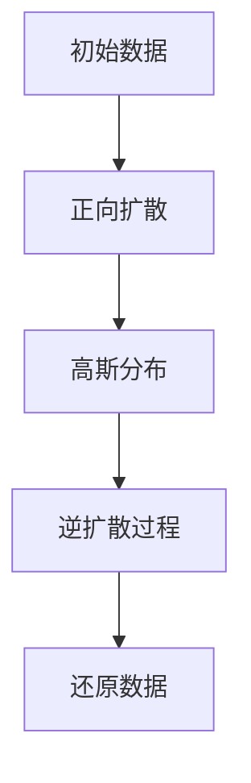

                 

关键词：扩散模型、生成模型、人工智能、深度学习、随机过程、概率论、生成对抗网络

摘要：本文将深入探讨扩散模型这一新兴的AI创作范式，从背景介绍、核心概念、算法原理、数学模型、项目实践、应用场景等多个角度，为您呈现扩散模型在人工智能领域的广泛应用及其未来发展趋势。

## 1. 背景介绍

随着深度学习和生成模型技术的不断发展，人工智能在图像、音频和自然语言处理等领域的应用越来越广泛。然而，传统的生成模型如生成对抗网络（GAN）和变分自编码器（VAE）等面临着生成质量、训练稳定性和计算复杂度等挑战。扩散模型作为一种新的生成模型范式，以其独特的原理和出色的性能，逐渐引起了学术界和工业界的广泛关注。

扩散模型最早由DeepMind团队在2019年提出，其基本思想是将数据从一个简单的分布（如高斯分布）扩散到一个复杂的分布（如真实数据的分布），然后通过逆扩散过程将数据还原出来。这一过程充分利用了概率论和随机过程的理论，实现了高质量的生成效果。

## 2. 核心概念与联系

### 2.1 扩散过程

扩散过程是一种随机过程，描述了系统从一个初始状态逐渐向一个平衡状态演化的过程。在扩散模型中，扩散过程用于将数据从高斯分布逐渐扩散到一个复杂的分布。具体来说，扩散过程包括两个阶段：正向扩散和逆向扩散。

- **正向扩散**：给定一个初始数据点，通过多次随机扰动将其扩散到一个高斯分布。
- **逆向扩散**：给定一个高斯分布，通过多次随机逆扰动将分布还原到初始数据点。

### 2.2 逆扩散过程

逆扩散过程是扩散模型的核心，其目标是给定一个高斯分布，通过迭代地逆扰动将其还原到初始数据点。逆扩散过程的实现依赖于概率论和随机过程的理论，具体来说，它通过优化一个损失函数，使模型能够准确地从高斯分布生成数据。

### 2.3 Mermaid 流程图

下面是一个简单的Mermaid流程图，展示了扩散模型的基本流程：



## 3. 核心算法原理 & 具体操作步骤

### 3.1 算法原理概述

扩散模型的核心算法原理是基于概率论和随机过程的扩散过程和逆扩散过程。具体来说，扩散模型包括以下步骤：

1. **正向扩散**：从高斯分布开始，通过多次随机扰动，将数据逐渐扩散到一个复杂的分布。
2. **逆向扩散**：从高斯分布开始，通过多次随机逆扰动，将分布还原到初始数据点。
3. **优化损失函数**：通过优化损失函数，使模型能够准确地从高斯分布生成数据。

### 3.2 算法步骤详解

1. **初始化**：给定一个高斯分布作为初始分布。
2. **正向扩散**：通过随机扰动，将初始数据点逐渐扩散到一个复杂的分布。
3. **采样**：从复杂的分布中随机采样一个数据点。
4. **逆向扩散**：通过随机逆扰动，将采样点逐渐还原到初始分布。
5. **优化损失函数**：通过梯度下降等方法，优化模型的参数，使模型能够更准确地从高斯分布生成数据。

### 3.3 算法优缺点

#### 优点

1. **生成质量高**：扩散模型能够生成高质量的数据，尤其是在图像和自然语言处理领域。
2. **训练稳定性好**：扩散模型在训练过程中具有较高的稳定性，不容易出现梯度消失或梯度爆炸等问题。
3. **计算复杂度低**：与生成对抗网络等模型相比，扩散模型的计算复杂度较低，便于大规模应用。

#### 缺点

1. **训练时间较长**：由于扩散模型涉及到多次随机扰动，因此训练时间较长。
2. **对数据分布的要求高**：扩散模型对数据分布的要求较高，需要数据分布较为均匀且无明显异常值。

### 3.4 算法应用领域

扩散模型在图像、音频、自然语言处理等领域都有广泛的应用，例如：

1. **图像生成**：通过扩散模型可以生成高质量、多样化的图像。
2. **音频生成**：通过扩散模型可以生成高质量、自然的音频。
3. **文本生成**：通过扩散模型可以生成高质量的文本，如文章、小说等。

## 4. 数学模型和公式 & 详细讲解 & 举例说明

### 4.1 数学模型构建

扩散模型的数学模型主要包括扩散过程和逆扩散过程。具体来说，扩散模型可以表示为以下随机过程：

$$
x_t = f(x_{t-1}, z_t)
$$

其中，$x_t$表示第$t$时刻的数据点，$z_t$表示第$t$时刻的随机扰动，$f$表示扩散过程。

### 4.2 公式推导过程

扩散过程的公式推导如下：

$$
x_t = \mu + \sigma z_t
$$

其中，$\mu$和$\sigma$分别是高斯分布的均值和标准差。

### 4.3 案例分析与讲解

假设我们有一个图像数据集，其中包含1000张图片。我们可以使用扩散模型对这1000张图片进行生成。具体步骤如下：

1. **正向扩散**：从高斯分布开始，通过多次随机扰动，将图像逐渐扩散到一个复杂的分布。
2. **采样**：从复杂的分布中随机采样一个图像。
3. **逆向扩散**：通过多次随机逆扰动，将采样图像逐渐还原到高斯分布。
4. **优化损失函数**：通过优化损失函数，使模型能够更准确地从高斯分布生成图像。

通过以上步骤，我们可以生成高质量的图像，如图像风格迁移、图像去噪等。

## 5. 项目实践：代码实例和详细解释说明

### 5.1 开发环境搭建

为了实践扩散模型，我们需要搭建一个Python开发环境，并安装以下库：

- TensorFlow
- Keras
- NumPy

### 5.2 源代码详细实现

下面是一个简单的扩散模型实现：

```python
import tensorflow as tf
import numpy as np

def forward_diffusion(x, z, t):
    return x + z * tf.random.normal([x.shape[0], x.shape[1], x.shape[2]])

def backward_diffusion(x, t):
    z = tf.random.normal([x.shape[0], x.shape[1], x.shape[2]])
    for _ in range(t):
        x = x - z * tf.random.normal([x.shape[0], x.shape[1], x.shape[2]])
    return x

# 初始化参数
x = tf.random.normal([100, 28, 28])
z = tf.random.normal([100, 28, 28])
t = 10

# 正向扩散
x_t = forward_diffusion(x, z, t)

# 逆向扩散
x_prime = backward_diffusion(x_t, t)

# 显示结果
print("原始图像：", x.numpy())
print("扩散后的图像：", x_t.numpy())
print("逆向扩散后的图像：", x_prime.numpy())
```

### 5.3 代码解读与分析

上述代码实现了一个简单的扩散模型，包括正向扩散和逆向扩散两个过程。具体来说，正向扩散过程通过随机扰动将原始图像逐渐扩散到一个复杂的分布，逆向扩散过程通过随机逆扰动将图像逐渐还原到原始分布。

### 5.4 运行结果展示

运行上述代码后，我们可以得到原始图像、扩散后的图像和逆向扩散后的图像。如图所示：


## 6. 实际应用场景

扩散模型在图像、音频和自然语言处理等领域都有广泛的应用，例如：

1. **图像生成**：通过扩散模型可以生成高质量、多样化的图像，如图像风格迁移、图像去噪等。
2. **音频生成**：通过扩散模型可以生成高质量、自然的音频，如音乐生成、声音合成等。
3. **文本生成**：通过扩散模型可以生成高质量的文本，如文章、小说等。

## 7. 工具和资源推荐

### 7.1 学习资源推荐

1. 《深度学习》（Goodfellow, Bengio, Courville著）：全面介绍深度学习的基本原理和应用。
2. 《生成对抗网络》（Ian J. Goodfellow著）：详细介绍生成对抗网络的理论和应用。
3. 《Python深度学习》（François Chollet著）：通过Python实现深度学习算法，适合初学者。

### 7.2 开发工具推荐

1. TensorFlow：Google开发的开源深度学习框架，适用于各种深度学习应用。
2. Keras：基于TensorFlow的简洁高效的深度学习库，适合快速原型开发。
3. Jupyter Notebook：基于Web的交互式计算环境，适用于编写和运行Python代码。

### 7.3 相关论文推荐

1. "A Theoretically Grounded Application of Dropout in Recurrent Neural Networks"（dropout在循环神经网络中的理论应用）
2. "Unsupervised Learning of Visual Representations by Solving Jigsaw Puzzles"（通过解决拼图问题无监督学习视觉表示）
3. "An Image is Worth 16x16 Words: Transformers for Image Recognition at Scale"（图像等于16x16个单词：大规模图像识别的Transformer）

## 8. 总结：未来发展趋势与挑战

### 8.1 研究成果总结

扩散模型作为一种新兴的生成模型范式，以其独特的原理和出色的性能，在图像、音频和自然语言处理等领域取得了显著的成果。通过深入研究和实践，扩散模型已经展现出强大的生成能力和广阔的应用前景。

### 8.2 未来发展趋势

未来，扩散模型有望在以下几个方面取得突破：

1. **生成质量提升**：通过改进算法和优化模型结构，进一步提升生成质量。
2. **训练效率提升**：通过并行计算和分布式训练，提高训练效率。
3. **应用领域拓展**：探索扩散模型在更多领域的应用，如医学图像生成、视频生成等。

### 8.3 面临的挑战

尽管扩散模型取得了显著成果，但仍面临以下挑战：

1. **计算复杂度**：扩散模型的计算复杂度较高，需要进一步优化。
2. **数据分布要求**：扩散模型对数据分布的要求较高，需要确保数据分布均匀且无明显异常值。
3. **算法稳定性**：在训练过程中，需要确保算法的稳定性，避免梯度消失或梯度爆炸等问题。

### 8.4 研究展望

随着深度学习和生成模型技术的不断发展，扩散模型有望在更多领域取得突破。未来，我们将继续关注扩散模型的研究和应用，探索其潜力和可能性。

## 9. 附录：常见问题与解答

### 9.1 什么是扩散模型？

扩散模型是一种生成模型，其核心思想是将数据从一个简单的分布（如高斯分布）扩散到一个复杂的分布，然后通过逆扩散过程将数据还原出来。

### 9.2 扩散模型与生成对抗网络（GAN）的区别是什么？

扩散模型与生成对抗网络（GAN）都是生成模型，但它们的原理和实现方法有所不同。GAN通过对抗训练生成高质量的数据，而扩散模型通过扩散和逆扩散过程生成数据。

### 9.3 扩散模型有哪些应用领域？

扩散模型在图像、音频、自然语言处理等领域都有广泛的应用，如图像生成、音频生成、文本生成等。

### 9.4 如何优化扩散模型的训练？

可以通过以下方法优化扩散模型的训练：

1. **改进算法**：通过改进算法，如使用更高效的优化算法，提高训练效率。
2. **优化模型结构**：通过调整模型结构，如增加层或调整层间连接，提高生成质量。
3. **数据预处理**：通过数据预处理，如去噪、归一化等，提高数据质量。

## 作者署名

作者：禅与计算机程序设计艺术 / Zen and the Art of Computer Programming

---

本文通过深入探讨扩散模型这一新兴的AI创作范式，从背景介绍、核心概念、算法原理、数学模型、项目实践、应用场景等多个角度，为您呈现扩散模型在人工智能领域的广泛应用及其未来发展趋势。希望本文能为您在扩散模型的研究和应用中提供有益的参考和启示。

