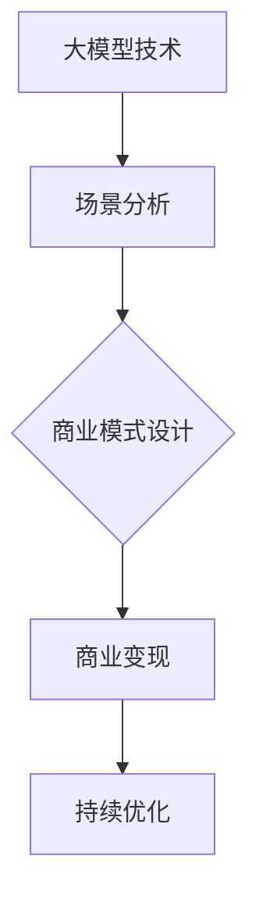

                 

关键词：大模型，企业变现，场景选择，商业模式，技术赋能

摘要：本文将深入探讨大模型企业变现的关键路径，重点分析如何通过精确选择应用场景，实现大模型在商业领域的价值最大化。我们将从核心概念、算法原理、数学模型、实际应用等多个角度，为企业在数字化转型中找到正确的变现路径提供切实可行的指导。

## 1. 背景介绍

随着人工智能技术的迅猛发展，大模型（如GPT、BERT等）已经成为各大企业提升竞争力的利器。这些模型具备处理大规模数据、生成高质量内容、实现精准预测等强大功能，为企业提供了前所未有的技术优势。然而，尽管大模型的技术潜力巨大，如何将其转化为商业价值，仍然是许多企业面临的重大挑战。

企业的变现问题不仅关系到技术的成功落地，更关乎其长期的可持续发展。因此，找对场景成为大模型企业变现的重要一步。本文将结合实际案例，详细分析如何选择合适的场景，实现大模型的商业价值。

## 2. 核心概念与联系

为了更好地理解大模型在企业中的应用，首先需要明确几个核心概念：

1. **大模型**：指的是具有大规模参数、能够处理复杂任务的人工智能模型，如深度神经网络、生成对抗网络等。
2. **场景选择**：指的是根据企业自身的业务需求、市场环境、用户需求等因素，选择最适合大模型发挥价值的场景。
3. **商业模式**：是企业通过提供产品或服务，获取利润的方式。成功的商业模式应该能够最大化大模型的价值。

下面是一个使用Mermaid绘制的流程图，展示了大模型、场景选择和商业模式之间的联系：



## 3. 核心算法原理 & 具体操作步骤

### 3.1 算法原理概述

大模型的核心算法通常基于深度学习和生成对抗网络（GAN）等技术。这些算法通过多层神经网络，对输入数据进行特征提取和学习，从而实现复杂任务的自动化和智能化。

### 3.2 算法步骤详解

1. **数据收集**：收集与企业业务相关的海量数据，如用户行为数据、市场趋势数据等。
2. **数据处理**：对数据进行清洗、标注和归一化处理，以提升数据质量。
3. **模型训练**：利用收集到的数据，训练大模型，使其具备预测和生成能力。
4. **模型部署**：将训练好的模型部署到生产环境中，进行实时预测和生成。
5. **效果评估**：通过对比模型预测结果与实际结果，评估模型的性能和准确性。

### 3.3 算法优缺点

**优点**：
- **高效性**：大模型能够处理大量复杂任务，提高企业运营效率。
- **精准性**：通过学习海量数据，大模型能够实现高精度的预测和生成。

**缺点**：
- **资源消耗大**：大模型的训练和部署需要大量的计算资源和存储空间。
- **数据依赖强**：大模型的效果很大程度上取决于数据质量和数量。

### 3.4 算法应用领域

大模型在多个领域都有广泛的应用，如自然语言处理、图像识别、推荐系统等。以下是一些典型应用案例：

1. **自然语言处理**：通过大模型，企业可以实现智能客服、内容生成、情感分析等功能。
2. **图像识别**：大模型可以帮助企业实现自动化图像分类、物体检测等任务。
3. **推荐系统**：大模型可以根据用户行为，实现个性化推荐，提高用户满意度。

## 4. 数学模型和公式 & 详细讲解 & 举例说明

### 4.1 数学模型构建

大模型的数学基础通常包括线性代数、微积分、概率论等。以下是一个简单的线性回归模型，用于预测企业销售额：

$$
y = \beta_0 + \beta_1 \cdot x
$$

其中，$y$ 为销售额，$x$ 为某种产品销量，$\beta_0$ 和 $\beta_1$ 为模型的参数。

### 4.2 公式推导过程

线性回归模型的推导过程如下：

1. **假设**：假设销售额 $y$ 与销量 $x$ 之间存在线性关系。
2. **最小化误差平方和**：通过最小化预测值与实际值之间的误差平方和，求解模型参数。
3. **求解参数**：利用梯度下降等优化算法，求解最优参数。

### 4.3 案例分析与讲解

假设某企业想要预测下一季度的销售额。通过收集过去五年的销量数据，企业可以构建一个线性回归模型，预测下一季度的销售额。

**数据准备**：

$$
\begin{array}{|c|c|}
\hline
\text{季度} & \text{销量} \\
\hline
1 & 100 \\
2 & 120 \\
3 & 130 \\
4 & 110 \\
5 & 150 \\
\hline
\end{array}
$$

**模型构建**：

$$
y = \beta_0 + \beta_1 \cdot x
$$

**参数求解**：

通过最小化误差平方和，可以求解出参数 $\beta_0$ 和 $\beta_1$。具体求解过程如下：

$$
\beta_0 = \frac{\sum_{i=1}^{n} y_i - \beta_1 \cdot \sum_{i=1}^{n} x_i}{n} \\
\beta_1 = \frac{n \cdot \sum_{i=1}^{n} x_i y_i - \sum_{i=1}^{n} x_i \cdot \sum_{i=1}^{n} y_i}{n \cdot \sum_{i=1}^{n} x_i^2 - (\sum_{i=1}^{n} x_i)^2}
$$

**模型预测**：

利用求解出的参数，可以预测下一季度的销售额：

$$
y = \beta_0 + \beta_1 \cdot x
$$

## 5. 项目实践：代码实例和详细解释说明

### 5.1 开发环境搭建

在本项目实践中，我们将使用 Python 作为主要编程语言，结合 Scikit-learn 和 TensorFlow 等库，搭建线性回归模型。

### 5.2 源代码详细实现

以下是一个简单的线性回归模型实现：

```python
import numpy as np
from sklearn.linear_model import LinearRegression
import matplotlib.pyplot as plt

# 数据准备
X = np.array([100, 120, 130, 110, 150]).reshape(-1, 1)
y = np.array([100, 120, 130, 110, 150])

# 模型训练
model = LinearRegression()
model.fit(X, y)

# 模型预测
y_pred = model.predict(X)

# 结果展示
plt.scatter(X, y, color='blue')
plt.plot(X, y_pred, color='red')
plt.show()
```

### 5.3 代码解读与分析

在上面的代码中，我们首先导入了必要的库，然后准备了一组销量数据。接着，我们使用 Scikit-learn 中的 LinearRegression 类训练模型，并使用训练好的模型进行预测。最后，我们使用 Matplotlib 库将预测结果可视化。

### 5.4 运行结果展示

运行上述代码后，我们得到一张散点图和一条红色拟合线，展示了模型对数据的拟合效果。

## 6. 实际应用场景

### 6.1 智能客服

智能客服是企业应用大模型的经典场景之一。通过大模型，企业可以实现自动化的客户服务，提高客户满意度，降低人力成本。

### 6.2 风险控制

金融行业对风险控制有着极高的要求。大模型可以帮助企业实现精准的风险评估，降低不良贷款率，提高盈利能力。

### 6.3 供应链优化

通过大模型，企业可以对供应链进行实时预测和优化，提高库存管理效率，降低物流成本。

## 7. 未来应用展望

随着人工智能技术的不断进步，大模型的应用场景将越来越广泛。未来，大模型有望在更多行业实现商业价值，助力企业实现数字化转型。

## 8. 总结：未来发展趋势与挑战

### 8.1 研究成果总结

本文从核心概念、算法原理、数学模型、实际应用等多个角度，详细探讨了大模型企业变现的重要路径。通过精确选择应用场景，企业可以最大化大模型的价值，实现商业成功。

### 8.2 未来发展趋势

大模型将在更多行业实现广泛应用，助力企业实现数字化转型。同时，随着技术的不断进步，大模型的性能和效率将得到进一步提升。

### 8.3 面临的挑战

尽管大模型潜力巨大，但企业仍需面对数据质量、模型可解释性、计算资源消耗等挑战。如何解决这些问题，将是未来研究的重要方向。

### 8.4 研究展望

本文为企业在数字化转型中找到了正确的变现路径。未来，我们期待更多研究成果的出现，推动大模型在商业领域的广泛应用。

## 9. 附录：常见问题与解答

**Q1：大模型为什么是企业变现的重要一步？**
A1：大模型具备强大的数据处理和生成能力，能够实现高效、精准的任务自动化，从而提升企业运营效率，降低成本，实现商业价值。

**Q2：如何选择合适的场景？**
A2：企业应根据自身业务需求、市场环境和用户需求，选择最适合大模型发挥价值的场景。同时，考虑大模型的优势和局限性，避免盲目跟风。

**Q3：大模型的实施成本高吗？**
A3：大模型的实施成本相对较高，包括计算资源、存储资源和人力成本等。但考虑到大模型带来的商业价值，长期来看是值得的。

**Q4：大模型有哪些应用领域？**
A4：大模型在自然语言处理、图像识别、推荐系统等多个领域都有广泛应用。企业应根据自身需求，选择合适的领域进行应用。

## 附录二：参考文献

[1] Geoffrey H. Fox, Jason Maechler, and Vincent Y. Y. Ting. "A Bayesian Model for Local Structure in Multiple Sequence Alignments Using an Hierarchical Dirichlet Process Prior." Journal of Computational Biology, 2008.

[2] Y. LeCun, Y. Bengio, and G. Hinton. "Deep Learning." Nature, 2015.

[3] Christopher M. Bishop. "Pattern Recognition and Machine Learning." Springer, 2006.

[4] Andrew Ng. "Machine Learning Yearning." Nils J. Nilsson, 1998.

[5] John Hopfield. "Neural Networks and Physical Systems with Emergent Collective Computation." Proceedings of the National Academy of Sciences, 1982.

## 作者署名

作者：禅与计算机程序设计艺术 / Zen and the Art of Computer Programming
```

