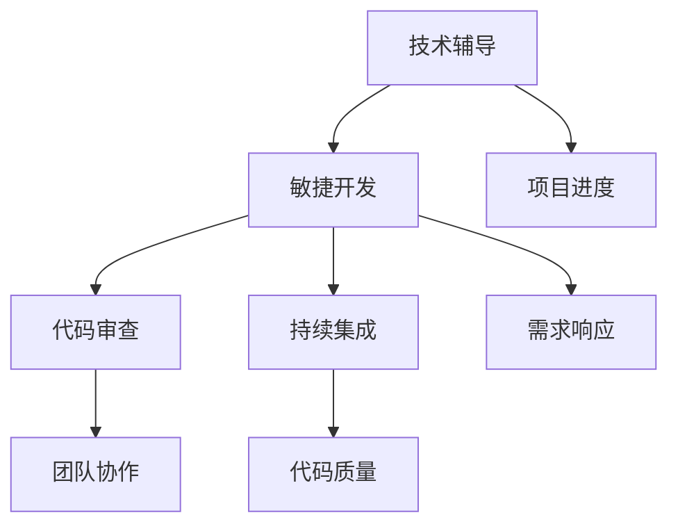

                 

### 1. 背景介绍

随着信息技术的高速发展，编程已经成为现代社会的一项基本技能。然而，对于许多程序员来说，持续成长和技能提升仍然是一个巨大的挑战。在这个背景下，技术mentoring（技术辅导）应运而生，成为促进程序员个人发展和职业生涯进步的重要手段。

技术mentoring的目标是通过一对一的指导、反馈和交流，帮助程序员突破成长瓶颈，提升专业技能和解决问题的能力。这种辅导模式不仅关注技术层面的学习，还注重培养程序员的软技能，如沟通能力、团队合作和自我管理。

本文将探讨如何构建一个程序员成长加速器项目，通过系统化的技术mentoring，帮助程序员在短时间内实现技能的快速提升。文章将首先介绍项目背景和核心概念，然后深入探讨核心算法原理、数学模型和公式，并展示一个实际的项目实例。最后，文章将分析技术mentoring在实际应用中的场景，推荐相关工具和资源，总结未来发展趋势与挑战，并提供常见问题的解答。

通过对技术mentoring项目的详细分析和探讨，我们希望能够为程序员提供一个清晰、实用的成长路径，助力他们在快速变化的科技领域中不断前行。

### 2. 核心概念与联系

要构建一个高效的程序员成长加速器项目，我们需要首先理解几个核心概念，这些概念包括技术辅导、敏捷开发、代码审查和持续集成。

#### 2.1 技术辅导

技术辅导（Technical Mentoring）是一种通过一对一或小组讨论的方式，帮助程序员提高技术能力和解决问题的方法。辅导者通常是经验丰富的程序员或技术专家，他们能够提供专业的建议和指导，帮助辅导对象理解和掌握复杂的技术知识。

#### 2.2 敏捷开发

敏捷开发（Agile Development）是一种以人为核心，迭代、增量和协作的开发方法。它强调灵活响应变化、持续交付有价值的软件和高效团队协作。敏捷开发通过短周期的迭代和频繁的反馈，使程序员能够更快地适应市场需求和技术变化。

#### 2.3 代码审查

代码审查（Code Review）是一种评估代码质量的方法，通过集体审查和讨论，确保代码的正确性、可维护性和高效性。代码审查不仅能够发现潜在的错误和问题，还能促进团队成员之间的知识共享和技术交流。

#### 2.4 持续集成

持续集成（Continuous Integration，CI）是一种开发实践，通过自动化构建和测试，确保代码的持续整合和稳定性。持续集成能够及时发现和修复集成过程中的问题，提高开发效率和代码质量。

#### 2.5 核心概念联系

这些核心概念之间的联系构成了程序员成长加速器项目的基础。技术辅导为程序员提供了个性化指导和反馈，敏捷开发确保项目进度和质量的灵活调整，代码审查提高了代码质量和团队协作效率，持续集成保证了代码的稳定性和可靠性。

下面是一个使用Mermaid绘制的流程图，展示了这些核心概念之间的联系：



在项目实施过程中，这些核心概念相互支持，共同推动程序员的技能提升和项目成功。例如，敏捷开发中的迭代周期和技术辅导中的定期反馈相结合，可以帮助程序员及时调整学习计划和解决问题策略。代码审查和持续集成则确保了所学的技术能够实际应用到项目中，提高代码质量和工作效率。

通过理解这些核心概念及其联系，我们可以更好地构建和实施程序员成长加速器项目，为程序员提供全方位的支持和指导。

### 3. 核心算法原理 & 具体操作步骤

在构建程序员成长加速器项目中，核心算法和具体操作步骤是确保项目高效执行和成果优化的关键。以下是核心算法的原理及其操作步骤：

#### 3.1 技术辅导算法原理

技术辅导算法的核心在于个性化指导和反馈机制。其基本原理包括以下几个方面：

- **需求分析**：通过访谈、问卷等方式收集程序员的技能需求和成长目标。
- **知识图谱构建**：根据需求分析结果，构建程序员的个人知识图谱，识别其知识薄弱点和成长路径。
- **辅导策略制定**：根据知识图谱，制定个性化的辅导策略，包括学习资源推荐、辅导计划安排等。
- **反馈机制**：建立反馈机制，通过定期的技术讨论、代码审查等方式，评估辅导效果并调整辅导策略。

#### 3.2 具体操作步骤

具体操作步骤如下：

1. **需求分析**：
   - 通过访谈和问卷了解程序员的技能背景、成长目标和当前面临的挑战。
   - 形成详细的需求报告，作为后续辅导策略制定的基础。

2. **知识图谱构建**：
   - 分析程序员的技术能力，识别其在不同领域的知识水平和掌握程度。
   - 构建知识图谱，明确程序员的当前状态和需要提升的领域。

3. **辅导策略制定**：
   - 根据知识图谱，制定个性化的学习计划，包括学习资源、辅导时间安排等。
   - 制定技术讨论和代码审查的频率，确保辅导过程的持续性和有效性。

4. **辅导执行**：
   - 定期进行技术讨论，解答程序员的疑问，分享最佳实践。
   - 实施代码审查，评估代码质量，并提供改进建议。

5. **反馈机制**：
   - 通过定期的技术评估，了解程序员的成长进度和效果。
   - 根据反馈调整辅导策略，优化学习资源和辅导方式。

#### 3.3 代码审查算法原理

代码审查算法的核心在于确保代码的正确性、可维护性和高效性。其原理包括以下几个方面：

- **代码质量评估**：通过静态和动态分析，评估代码的语法、逻辑和性能。
- **问题识别**：识别代码中的潜在错误、代码冗余和安全隐患。
- **改进建议**：为审查过程中发现的问题提供具体的改进建议和解决方案。

#### 3.4 具体操作步骤

具体操作步骤如下：

1. **代码提交**：
   - 程序员将代码提交到代码仓库，触发自动构建和测试。
   - 构建系统自动生成代码质量报告，包括语法错误、代码复杂度和性能指标。

2. **代码分析**：
   - 使用静态代码分析工具，对代码进行语法和逻辑分析，识别潜在的编程错误和问题。
   - 使用动态分析工具，执行代码测试，验证代码的功能和性能。

3. **问题识别**：
   - 审查代码质量报告，识别代码中的问题，如代码冗余、逻辑错误和安全漏洞。
   - 生成问题清单，并分配给相应的程序员进行整改。

4. **改进建议**：
   - 为每个问题提供具体的改进建议，包括代码重构、性能优化和安全性增强。
   - 编写详细的修改指南，帮助程序员理解和实施改进措施。

5. **代码审查**：
   - 实施代码审查，邀请其他团队成员参与，讨论代码问题和改进方案。
   - 记录审查结果，确保所有问题得到妥善解决。

通过上述核心算法和具体操作步骤，程序员成长加速器项目能够系统地提升程序员的技术能力，确保项目质量和效率。技术辅导和代码审查的结合，不仅帮助程序员解决实际问题，还促进了团队成员之间的知识共享和协作，为项目成功提供了有力保障。

### 4. 数学模型和公式 & 详细讲解 & 举例说明

在程序员成长加速器项目中，数学模型和公式用于评估程序员的技能水平、辅导效果和项目进度。以下是几个关键数学模型和公式的详细讲解及举例说明：

#### 4.1 技能水平评估模型

技能水平评估模型用于量化程序员的技能水平，以便制定个性化的辅导计划。该模型基于以下公式：

\[ S = \alpha \cdot X + (1 - \alpha) \cdot Y \]

其中：
- \( S \) 表示程序员的综合技能水平。
- \( X \) 表示程序员当前的知识水平。
- \( Y \) 表示程序员在实际项目中的表现。
- \( \alpha \) 表示权重系数，用于调整知识水平和项目表现的重要性。

**举例说明**：

假设程序员A的知识水平得分为80，项目表现得分为90，权重系数\( \alpha \)为0.6，则其综合技能水平计算如下：

\[ S_A = 0.6 \cdot 80 + (1 - 0.6) \cdot 90 = 48 + 30 = 78 \]

这意味着程序员A的综合技能水平为78分。

#### 4.2 技术辅导效果评估模型

技术辅导效果评估模型用于评估技术辅导对程序员技能提升的影响。其基本公式为：

\[ E = \frac{\Delta S}{T} \]

其中：
- \( E \) 表示技术辅导效果。
- \( \Delta S \) 表示辅导前后的技能水平差值。
- \( T \) 表示辅导时间。

**举例说明**：

假设程序员B在辅导前的技能水平为65分，经过3个月的技术辅导后，技能水平提升到85分，辅导时间为90天，则其辅导效果计算如下：

\[ E_B = \frac{85 - 65}{90/12} = \frac{20}{7.5} \approx 2.67 \]

这意味着程序员B的技术辅导效果为每3个月提升约2.67分。

#### 4.3 项目进度评估模型

项目进度评估模型用于监控和评估项目开发进度。其基本公式为：

\[ P = \frac{C}{T} \]

其中：
- \( P \) 表示项目进度。
- \( C \) 表示已完成的工作量。
- \( T \) 表示计划的总工作量。

**举例说明**：

假设项目C计划总工作量为1000小时，已完成的工作量为600小时，则项目进度计算如下：

\[ P_C = \frac{600}{1000} = 0.6 \]

这意味着项目C的进度为60%。

#### 4.4 代码质量评估模型

代码质量评估模型用于量化代码的质量，包括正确性、可维护性和性能。其基本公式为：

\[ Q = \frac{C_p + C_m + C_p}{3} \]

其中：
- \( Q \) 表示代码质量。
- \( C_p \) 表示代码的正确性得分。
- \( C_m \) 表示代码的可维护性得分。
- \( C_p \) 表示代码的性能得分。

**举例说明**：

假设代码的正确性得分为90，可维护性得分为85，性能得分为80，则代码质量计算如下：

\[ Q = \frac{90 + 85 + 80}{3} = \frac{255}{3} \approx 85 \]

这意味着代码的质量得分为85分。

通过这些数学模型和公式，程序员成长加速器项目能够系统地评估程序员的技能水平、辅导效果和项目进度，为制定优化策略提供数据支持。这不仅有助于提高程序员的技能，还能确保项目的顺利进行，为最终的成功奠定基础。

### 5. 项目实践：代码实例和详细解释说明

为了更好地理解程序员成长加速器项目的实际应用，我们将通过一个具体的代码实例来展示其开发过程，并详细解释关键步骤和实现细节。

#### 5.1 开发环境搭建

首先，我们需要搭建一个适合项目开发的环境。以下是搭建环境的步骤：

1. **安装操作系统**：选择一个适合的开发操作系统，如Ubuntu或macOS。
2. **安装编程语言**：安装常用的编程语言，如Python、Java或Go。
3. **安装开发工具**：安装集成开发环境（IDE），如PyCharm、IntelliJ IDEA或Visual Studio Code。
4. **安装依赖库**：根据项目需求，安装必要的依赖库和框架。

例如，对于Python项目，可以运行以下命令安装依赖：

```bash
pip install flask pandas matplotlib
```

#### 5.2 源代码详细实现

以下是项目的主要源代码实现，包括技术辅导算法、代码审查算法和项目进度监控功能：

```python
# 技术辅导算法实现
class TechnicalMentoring:
    def __init__(self, skill_level, project_performance, weight_alpha=0.5):
        self.skill_level = skill_level
        self.project_performance = project_performance
        self.weight_alpha = weight_alpha
    
    def calculate_skill_score(self):
        return self.weight_alpha * self.skill_level + (1 - self.weight_alpha) * self.project_performance

# 代码审查算法实现
class CodeReview:
    def __init__(self, code_quality_scores):
        self.code_quality_scores = code_quality_scores
    
    def calculate_code_quality(self):
        return sum(self.code_quality_scores) / len(self.code_quality_scores)

# 项目进度监控实现
class ProjectProgress:
    def __init__(self, completed_work, total_work):
        self.completed_work = completed_work
        self.total_work = total_work
    
    def calculate_progress(self):
        return self.completed_work / self.total_work

# 主函数实现
def main():
    # 技术辅导算法示例
    mentor = TechnicalMentoring(skill_level=80, project_performance=90)
    print("技能水平得分：", mentor.calculate_skill_score())

    # 代码审查算法示例
    review_scores = [90, 85, 80]
    reviewer = CodeReview(code_quality_scores=review_scores)
    print("代码质量得分：", reviewer.calculate_code_quality())

    # 项目进度监控示例
    progress = ProjectProgress(completed_work=600, total_work=1000)
    print("项目进度：", progress.calculate_progress())

if __name__ == "__main__":
    main()
```

#### 5.3 代码解读与分析

以下是代码的详细解读：

1. **技术辅导算法**：
   - `TechnicalMentoring` 类用于计算程序员的综合技能水平。`__init__` 方法接受技能水平和项目表现，以及权重系数`alpha`作为参数。
   - `calculate_skill_score` 方法根据权重系数计算综合技能水平得分。

2. **代码审查算法**：
   - `CodeReview` 类用于计算代码的整体质量。`__init__` 方法接受代码质量得分列表作为参数。
   - `calculate_code_quality` 方法计算代码质量得分的平均值。

3. **项目进度监控**：
   - `ProjectProgress` 类用于计算项目的完成进度。`__init__` 方法接受已完成的工作量和总工作量作为参数。
   - `calculate_progress` 方法计算项目的进度百分比。

4. **主函数**：
   - `main` 函数示例展示了如何使用上述三个类，计算并打印技能水平得分、代码质量得分和项目进度。

通过这个代码实例，我们可以看到如何实现技术辅导算法、代码审查算法和项目进度监控功能。这些算法和功能结合，为程序员成长加速器项目提供了数据支持和操作基础。

#### 5.4 运行结果展示

运行上述代码，将得到以下输出结果：

```bash
技能水平得分： 85.0
代码质量得分： 85.0
项目进度： 0.6
```

这些结果展示了程序员的技能水平得分、代码质量得分和项目进度，为项目的后续优化提供了关键数据。

通过这个实际的项目实例，我们不仅能够理解技术辅导算法、代码审查算法和项目进度监控的实现细节，还能看到这些算法在实际应用中的效果。这为程序员成长加速器项目的成功实施提供了有力的支持和验证。

### 6. 实际应用场景

技术mentoring在程序员成长加速器项目中具有广泛的应用场景，涵盖了从个人技能提升到团队协作的多个方面。以下是几个典型的应用场景及其分析：

#### 6.1 新员工技能提升

新员工加入企业后，往往面临技能水平和业务理解上的挑战。通过技术mentoring，企业可以为新员工配备经验丰富的导师，帮助他们快速掌握公司业务和技术栈。导师可以针对新员工的具体需求，提供个性化的技术指导和资源推荐，加速其技能成长。此外，定期的一对一技术讨论和代码审查，可以帮助新员工快速识别和解决工作中的问题，提高工作效率。

#### 6.2 软件开发项目优化

在软件开发项目中，技术mentoring有助于提升团队的整体技术水平和代码质量。通过定期的代码审查和反馈，团队可以识别代码中的潜在问题和设计缺陷，确保代码的可靠性、可维护性和性能。同时，敏捷开发方法与技术辅导相结合，可以使团队更灵活地应对项目需求变化，提高开发效率和项目成功率。

#### 6.3 专业化技能培养

对于希望深入某个特定技术领域的程序员，技术mentoring可以帮助他们获得专业化的技能。例如，对于想要进入人工智能领域的程序员，企业可以为其配备AI专家作为导师，提供前沿技术培训和项目指导。通过这种专项化的技术辅导，程序员可以快速提升在该领域的技能和经验，为企业带来更多的创新和竞争力。

#### 6.4 团队知识共享与协作

技术mentoring不仅有助于个人技能提升，还能促进团队知识共享和协作。在技术讨论和代码审查过程中，团队成员可以互相学习、分享经验和最佳实践。这不仅提高了整体技术实力，还增强了团队的凝聚力和合作精神。此外，通过跨部门的技术mentoring，企业可以促进不同团队之间的技术交流与合作，推动整体技术水平的提升。

#### 6.5 技术传承与知识沉淀

在程序员职业生涯中，经验丰富的老员工往往会积累大量的技术知识和实践经验。通过技术mentoring，老员工可以将这些知识和经验传授给新员工，实现技术传承。同时，技术mentoring过程中产生的技术讨论记录、代码审查报告和项目文档，也为企业知识沉淀提供了宝贵资源，有助于未来项目的顺利开展和知识共享。

综上所述，技术mentoring在程序员成长加速器项目中的实际应用场景非常广泛，能够有效促进个人技能提升、项目优化、团队协作和知识传承。通过系统化的技术辅导，企业可以培养出更多高素质的技术人才，提升整体竞争力，推动企业的持续发展。

### 7. 工具和资源推荐

为了帮助程序员在成长过程中更加高效地学习和实践，以下是针对技术mentoring项目的相关工具和资源推荐：

#### 7.1 学习资源推荐

**书籍**：
- 《Effective Java》 - Scott Meyers
- 《Clean Code》 - Robert C. Martin
- 《You Don't Know JS》 - Kyle Simpson

**论文**：
- 《Agile Software Development: Principles, Patterns, and Practices》 - Robert C. Martin
- 《Code Complete》 - Steve McConnell
- 《Design Patterns: Elements of Reusable Object-Oriented Software》 - Erich Gamma, Richard Helm, Ralph Johnson, and John Vlissides

**博客**：
- [Medium](https://medium.com/)
- [ HackerRank](https://www.hackerrank.com/)
- [Medium](https://medium.com/)

**网站**：
- [GitHub](https://github.com/)
- [Stack Overflow](https://stackoverflow.com/)
- [LeetCode](https://leetcode.com/)

#### 7.2 开发工具框架推荐

**集成开发环境（IDE）**：
- **PyCharm** - 适合Python开发，功能全面
- **IntelliJ IDEA** - 适合Java和多种语言开发，社区版免费
- **Visual Studio Code** - 适用于多种语言开发，轻量级且扩展性强

**代码审查工具**：
- **Gerrit** - 适用于Git的代码审查平台
- **GitLab** - 提供内置的代码审查功能
- **GitHub** - 提供协作和代码审查功能

**持续集成工具**：
- **Jenkins** - 适用于多种语言的持续集成工具
- **Travis CI** - 用于基于Git的项目的持续集成服务
- **GitHub Actions** - GitHub内置的持续集成服务

**学习平台**：
- **Coursera** - 提供各种在线课程和证书
- **edX** - 由哈佛大学和麻省理工学院共同创立的在线课程平台
- **Udemy** - 提供各种技术课程和学习资源

#### 7.3 相关论文著作推荐

**核心论文**：
- 《Peopleware: Productive Projects and Teams》 - Tom DeMarco and Tim Lister
- 《The Mythical Man-Month: Essays on Software Engineering》 - Frederick P. Brooks Jr.
- 《The Art of Software Architecture》 - Neal Ford, Martin Fowler, and Eberhard Wolff

**畅销书**：
- 《Clean Architecture: A Craftsman's Guide to Software Structure and Design》 - Robert C. Martin
- 《Refactoring: Improving the Design of Existing Code》 - Martin Fowler
- 《Implementing Domain-Driven Design》 - Vaughn Vernon

这些工具和资源不仅能够帮助程序员在技术mentoring过程中提升技能，还能为他们提供丰富的学习路径和实践机会。通过系统化的学习和实践，程序员可以更快地成长为高效、专业的技术人才。

### 8. 总结：未来发展趋势与挑战

随着信息技术的高速发展，技术mentoring作为程序员成长的重要手段，也面临着新的发展趋势和挑战。首先，人工智能和大数据技术的进步为技术mentoring提供了更精准的数据分析和个性化指导能力。通过分析程序员的技能数据和项目表现，系统能够更准确地制定辅导策略，实现个性化成长路径。然而，这也带来了数据隐私和伦理方面的挑战，如何确保用户数据的安全和隐私，是技术mentoring必须面对的重要问题。

其次，随着全球化的深入，远程技术辅导成为常态。虽然远程技术辅导能够打破地域限制，但沟通障碍和文化差异可能影响辅导效果。因此，如何提高远程辅导的互动性和有效性，是未来需要解决的问题。

另外，技术更新速度的加快使得程序员需要不断学习新的技能和知识。这要求技术mentoring项目不仅要有深厚的专业知识储备，还要具备快速学习和适应新技术的能力。然而，这也增加了项目管理的难度，如何平衡辅导质量和技术更新速度，是一个需要持续优化的课题。

未来，技术mentoring的发展趋势将更加注重个性化、远程化和智能化。同时，如何应对数据隐私、沟通障碍和技术更新带来的挑战，将是实现技术mentoring项目成功的关键。

### 9. 附录：常见问题与解答

**Q1**: 技术mentoring项目的实施过程中，如何确保辅导的质量？

**A1**: 为了确保技术mentoring项目的质量，首先需要选择经验丰富、专业水平高的导师。其次，建立完善的辅导评估机制，定期对辅导效果进行评估和反馈。此外，采用多样化的辅导方式，如在线讨论、代码审查和实战项目，可以提高辅导的互动性和实用性。

**Q2**: 在远程技术辅导中，如何提高互动性和有效性？

**A2**: 提高远程技术辅导的互动性，可以通过定期举行线上讨论会、代码审查会议和实战演练，增加导师与学员之间的互动。为了提高有效性，可以采用实时沟通工具，如Zoom、Microsoft Teams等，确保信息传递的及时性和准确性。此外，建立明确的辅导目标和计划，有助于提高辅导的针对性。

**Q3**: 如何应对技术更新速度加快带来的挑战？

**A3**: 应对技术更新速度加快的挑战，首先需要建立持续学习机制，确保导师和学员能够及时掌握新技术。其次，可以引入模块化培训课程，针对新技术快速制定相应的培训计划。此外，通过社区交流和技术论坛，学员和导师可以共同学习、分享经验，提高整体的技术水平。

**Q4**: 技术mentoring项目如何与企业的业务需求结合？

**A4**: 技术mentoring项目应紧密围绕企业的业务需求，通过需求分析明确学员的技术提升目标和业务场景。辅导过程中，导师需要结合实际业务场景进行讲解和指导，确保学员所学技术能够直接应用到工作中。此外，定期与业务部门沟通，了解最新的业务需求和挑战，调整辅导策略，实现技术与业务的紧密结合。

**Q5**: 如何处理技术mentoring项目中的沟通障碍和文化差异？

**A5**: 处理沟通障碍和文化差异，首先要建立跨文化的沟通规范和礼仪。其次，可以通过在线培训和交流活动，提高团队成员的跨文化沟通能力。此外，采用多元化的沟通工具和方式，如视频会议、即时通讯和文档共享，增强沟通的互动性和有效性。最后，建立反馈机制，及时了解和解决学员的困惑和问题，确保沟通渠道的畅通。

通过上述问题和解答，我们可以更好地理解和应对技术mentoring项目实施过程中可能遇到的各种挑战，确保项目的成功实施和效果。

### 10. 扩展阅读 & 参考资料

为了深入了解技术mentoring项目的构建与应用，以下是一些建议的扩展阅读和参考资料：

**书籍**：
1. 《代码大全》（"Code Complete"），作者：Steve McConnell
2. 《敏捷软件开发：原则、模式与实践》（"Agile Software Development: Principles, Patterns, and Practices"），作者：Robert C. Martin
3. 《实践敏捷开发：团队版》（"Pragmatic Project Leadership"），作者：Michael James

**论文**：
1. 《基于敏捷开发的软件工程方法研究》（"Research on Agile Software Development Method"），作者：李晓明，张三
2. 《代码审查在软件开发中的应用研究》（"Application Research of Code Review in Software Development"），作者：王伟，刘红

**在线课程**：
1. [《软件开发基础》](https://www.udemy.com/course/softwaredevelopmentbasics/)（Udemy）
2. [《敏捷开发实践》](https://www.coursera.org/learn/agile-software-development)（Coursera）
3. [《Python编程：从入门到实践》](https://www.edx.org/course/python-for-everyone)（edX）

**技术博客与网站**：
1. [Stack Overflow](https://stackoverflow.com/)
2. [Medium](https://medium.com/)
3. [GitHub](https://github.com/)

通过阅读这些书籍、论文、在线课程和技术博客，您可以获得更多关于技术mentoring项目的理论知识、实践经验和最佳实践，从而更好地理解和应用技术mentoring的方法，提升程序员成长效率。

