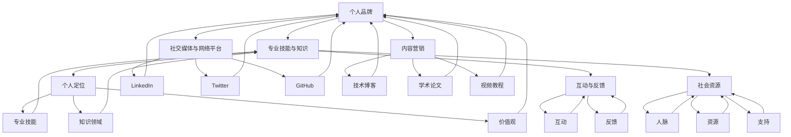

                 

### 背景介绍

在当今的数字化时代，技术人才的竞争愈发激烈，个人品牌的建设变得尤为重要。技术人如何打造个人品牌，不仅关系到个人的职业发展，更直接影响到创业的成功率。在这个主题下，我们需要深入探讨以下几个核心问题：

1. **个人品牌的定义和重要性**：个人品牌是一个人在特定领域内知识和技能的体现，它不仅是一种个人形象的标志，更是个人职业发展的重要资产。一个强大的个人品牌能够帮助技术人在职场中脱颖而出，提高创业成功率。

2. **构建个人品牌的策略和步骤**：从零开始构建个人品牌需要明确的策略和步骤。这包括如何定位自己、如何展示专业技能、如何建立个人品牌影响力等。

3. **利用社交媒体和网络平台**：社交媒体和网络平台是构建和传播个人品牌的重要工具。如何选择合适的平台、如何制定内容策略、如何与受众互动等，都是需要深入探讨的话题。

4. **个人品牌与创业的关系**：个人品牌对于创业的成功至关重要。一个强有力的个人品牌能够吸引投资者、合作伙伴和客户，从而提高创业的成功概率。

5. **案例分析**：通过分析成功的技术人如何构建个人品牌，我们可以获得宝贵的经验和启示。

本文将从上述几个核心问题出发，结合实际案例，逐步分析并阐述技术人如何打造个人品牌，以及这一过程如何提升创业成功率。

#### 个人品牌的定义和重要性

个人品牌，简单来说，就是个人在公众面前的形象和声誉。它不仅包括个人的专业技能和知识，还涵盖了个人价值观、人格特质、行为习惯等方方面面。个人品牌的重要性体现在以下几个方面：

1. **职业发展**：一个强大的个人品牌能够帮助你获得更多的职业机会。在招聘过程中，拥有良好个人品牌的技术人更容易得到雇主的青睐，因为他们已经通过个人品牌建立了一定的信誉和声誉。

2. **影响力**：个人品牌能够扩大你的影响力范围。无论是在行业内还是在社会层面，强大的个人品牌都能够让你成为意见领袖，从而对行业趋势和社会发展产生积极影响。

3. **收入增长**：拥有良好个人品牌的技术人往往能够获得更高的薪资和更丰富的职业发展路径。此外，个人品牌也能够为技术人带来更多的商业机会，如咨询、培训、顾问等。

4. **创业成功**：在创业领域，个人品牌尤为重要。一个强大的个人品牌能够吸引更多的投资者、合作伙伴和客户，从而提高创业的成功概率。此外，个人品牌还能够为创业者带来更多的社会资源，如媒体曝光、行业合作等。

#### 构建个人品牌的策略和步骤

构建个人品牌并非一蹴而就，而是一个长期且系统的过程。以下是构建个人品牌的一些关键策略和步骤：

1. **明确定位**：首先，你需要明确自己在行业中的定位。这包括你的专业技能、知识领域、价值观等。明确定位有助于你在个人品牌构建过程中保持一致性和专业性。

2. **展示专业技能**：在个人品牌构建过程中，专业技能是核心。通过参与项目、撰写技术博客、发表学术论文、参与技术社区等方式，展示你的专业技能和知识。

3. **建立个人网站或博客**：个人网站或博客是展示个人品牌的重要平台。通过定期发布高质量的内容，展示你的专业知识和见解，吸引更多的关注。

4. **利用社交媒体**：社交媒体是构建和传播个人品牌的重要工具。选择合适的平台（如LinkedIn、Twitter、GitHub等），制定内容策略，与受众互动，扩大个人品牌的影响力。

5. **参与行业活动**：参与行业会议、讲座、研讨会等活动，是建立个人品牌的重要途径。通过这些活动，你可以与行业内其他专业人士建立联系，扩大人脉，提升个人知名度。

6. **持续学习和成长**：个人品牌建设是一个长期的过程，需要持续的学习和成长。通过不断学习和实践，提升自己的专业技能和知识水平，为个人品牌的建设提供源源不断的动力。

#### 利用社交媒体和网络平台

社交媒体和网络平台是构建和传播个人品牌的重要工具。以下是利用这些平台的一些策略：

1. **选择合适的平台**：不同的平台具有不同的特点和受众，因此选择合适的平台至关重要。例如，LinkedIn更适合专业领域的内容分享和职业发展，Twitter更适合实时互动和传播观点，GitHub则更适合展示技术能力和参与开源项目。

2. **制定内容策略**：在社交媒体上发布内容需要明确的策略。内容策略应包括内容类型（如技术文章、视频、图片等）、发布频率、主题选择等。高质量的内容能够吸引更多的关注，提升个人品牌的影响力。

3. **与受众互动**：在社交媒体上，与受众的互动至关重要。积极回复评论、参与讨论、分享他人内容等，都能够增强与受众的互动，提升个人品牌的亲和力。

4. **建立网络社区**：通过社交媒体和网络平台，可以建立自己的网络社区。网络社区是增强个人品牌影响力的有效途径，通过组织线上活动、分享专业见解、解答问题等，可以加深与受众的连接。

5. **跨平台传播**：将个人品牌的内容跨平台传播，可以扩大影响力。例如，在个人博客上发布文章后，可以将其分享到社交媒体平台，吸引更多的受众关注。

#### 个人品牌与创业的关系

在创业领域，个人品牌的重要性尤为突出。以下是个人品牌如何影响创业的一些关键方面：

1. **吸引投资者**：投资者往往倾向于投资那些具有强大个人品牌和信誉的创业者。一个强有力的个人品牌能够为创业者带来更多的投资机会，提高融资成功率。

2. **获得合作伙伴**：强大的个人品牌能够吸引更多的合作伙伴。合作伙伴往往更愿意与有信誉、有影响力的创业者合作，从而降低合作风险。

3. **赢得客户信任**：在创业初期，客户的信任至关重要。一个强大的个人品牌能够为创业者赢得客户的信任，从而提高产品的市场接受度。

4. **提升品牌知名度**：个人品牌的建立能够提升创业公司的品牌知名度。创业者通过个人品牌的影响力，可以有效地推广公司产品和服务，吸引更多的客户。

5. **扩展社会资源**：强大的个人品牌能够为创业者带来更多的社会资源。例如，通过参与行业活动、接受媒体采访等，创业者可以扩大人脉，获取更多的商业机会。

#### 案例分析

以下是一些成功的技术人如何构建个人品牌，并利用这一品牌提升创业成功率的案例：

1. **案例一：李明**  
李明是一位资深的数据科学家，他在构建个人品牌方面做得非常出色。首先，他明确了数据科学领域的定位，并通过参与多个大型数据科学项目，展示了他的专业技能。其次，他建立了个人网站和博客，定期发布高质量的技术文章和数据分析案例。此外，他还积极参与技术社区，分享自己的知识和经验，吸引了大量粉丝。在创业方面，李明利用自己的个人品牌，成功吸引了多家投资者的关注，并在短时间内获得了巨额融资，使他的创业项目迅速发展。

2. **案例二：张丽**  
张丽是一位云计算领域的专家，她在构建个人品牌方面采取了多种策略。首先，她选择了GitHub作为展示自己技术能力的平台，通过参与多个开源项目，展示了她的编程技能和对云计算技术的深入理解。其次，她在LinkedIn上建立了个人品牌，定期发布技术博客和行业洞察，吸引了大量关注。此外，她还积极参与行业活动，通过演讲和研讨会，提升了自己的知名度。在创业方面，张丽利用自己的个人品牌，成功吸引了多家合作伙伴，使她的创业项目在短时间内取得了显著的市场表现。

#### 总结

通过上述分析，我们可以看到，个人品牌对于技术人的职业发展和创业成功具有重要意义。构建个人品牌需要明确定位、展示专业技能、利用社交媒体和网络平台等多种策略。同时，个人品牌与创业的成功密切相关，一个强有力的个人品牌能够为创业者带来更多的机会和资源。因此，技术人应该重视个人品牌的构建，通过持续的努力和投入，提升自己的职业价值和创业成功率。

### 核心概念与联系

在深入探讨如何构建个人品牌之前，我们需要明确几个核心概念，并理解它们之间的联系。以下是构建个人品牌所需理解的关键概念及其相互关系：

#### 1. 个人品牌

个人品牌是指个人在公众中的形象和声誉。它包括个人的专业技能、知识、价值观、行为习惯等。一个强大的个人品牌能够帮助个人在职业市场中脱颖而出，建立信任和影响力。

#### 2. 专业技能与知识

专业技能和知识是个人品牌的基石。一个技术人要想建立强大的个人品牌，首先需要在某个领域具备深厚的技术功底和丰富的实践经验。这包括对技术的深入理解、解决问题的能力、创新思维等。

#### 3. 社交媒体与网络平台

社交媒体与网络平台是构建个人品牌的重要工具。通过这些平台，技术人可以展示自己的专业技能、分享知识和经验、建立人脉、扩大影响力。常见的社交媒体平台包括LinkedIn、Twitter、GitHub、微信公众号等。

#### 4. 内容营销

内容营销是通过创造和分享有价值的内容来吸引和留住目标受众的一种策略。技术人可以通过撰写技术博客、发表学术论文、制作视频教程等方式，展示自己的专业知识和见解，从而建立个人品牌。

#### 5. 个人定位

个人定位是构建个人品牌的关键步骤。个人定位需要明确个人的专业技能、知识领域、价值观等。一个明确的定位有助于个人在职业市场中树立独特的形象，吸引目标受众。

#### 6. 互动与反馈

互动与反馈是个人品牌建设的重要组成部分。通过积极与受众互动，回答问题、参与讨论，技术人可以增强与受众的连接，提高个人品牌的亲和力和影响力。

#### 7. 社会资源

社会资源是指个人在职业和社交网络中所拥有的人脉、资源和支持。一个强大的个人品牌能够吸引更多的社会资源，为个人的职业发展和创业提供有力支持。

#### 8. 创业成功

创业成功是个人品牌的重要体现。一个强有力的个人品牌能够吸引投资者、合作伙伴和客户，从而提高创业的成功概率。创业过程中的品牌建设不仅关系到个人的职业发展，也直接影响到企业的成功。

#### Mermaid 流程图

以下是一个简化的 Mermaid 流程图，展示了上述核心概念之间的相互关系：



通过上述核心概念及其相互关系的理解，我们可以更清晰地把握构建个人品牌的方法和步骤，从而更有效地提升创业成功率。

### 核心算法原理 & 具体操作步骤

在构建个人品牌的过程中，核心算法原理是理解和应用一系列策略和步骤，这些策略和步骤可以帮助技术人在职业市场中脱颖而出，建立强大的个人品牌。以下是构建个人品牌的核心算法原理和具体操作步骤：

#### 1. 算法原理

**个人品牌构建算法**是基于以下核心原理：

- **明确目标**：确定个人品牌的目标和愿景，明确自己想要在职业市场中达到的地位和影响力。
- **持续学习**：不断更新和提升自己的专业技能和知识，以保持个人品牌的竞争力。
- **内容创作**：通过高质量的内容创作，展示个人专业知识和见解，建立个人品牌的权威性和影响力。
- **社交媒体运用**：利用社交媒体和网络平台，扩大个人品牌的影响范围，建立与受众的互动和连接。
- **网络社区参与**：积极参与技术社区和行业活动，扩展人脉资源，提升个人品牌的社会影响力。
- **持续优化**：根据反馈和数据分析，持续优化个人品牌策略，提高品牌建设的效率和效果。

#### 2. 具体操作步骤

**步骤一：明确目标**

首先，技术人需要明确个人品牌的目标和愿景。这包括：

- **定位**：明确自己在行业中的定位，包括专业领域、技能特长、价值观等。
- **目标受众**：确定个人品牌的目标受众，了解他们的需求和关注点。
- **品牌愿景**：设定长期的品牌愿景，包括个人职业发展目标和个人品牌的社会影响力。

**步骤二：持续学习**

持续学习和提升专业技能是构建个人品牌的基础。具体包括：

- **技术培训**：参加技术培训课程，学习新的技术知识和工具。
- **在线学习**：利用在线学习资源，如MOOCs、技术论坛等，更新自己的知识库。
- **实践经验**：通过实际项目和工作经验，提升自己的技术能力。
- **知识分享**：通过撰写技术博客、发表学术论文、参与开源项目等方式，分享自己的知识和经验。

**步骤三：内容创作**

内容创作是展示个人专业知识和见解，建立个人品牌权威性的关键。具体操作步骤包括：

- **确定内容类型**：根据个人专业领域和目标受众，确定适合的内容类型，如技术博客、视频教程、学术论文等。
- **内容策略**：制定内容策略，包括内容主题、发布频率、内容形式等。
- **高质量内容**：创作高质量的内容，确保内容的专业性、实用性和原创性。
- **多平台发布**：将内容发布到多个平台，如个人博客、技术社区、社交媒体等，扩大内容的影响力。

**步骤四：社交媒体运用**

利用社交媒体和网络平台，可以扩大个人品牌的影响范围，建立与受众的互动和连接。具体操作步骤包括：

- **选择平台**：根据个人目标和受众特点，选择合适的社交媒体平台，如LinkedIn、Twitter、GitHub等。
- **内容策略**：制定社交媒体内容策略，包括内容类型、发布频率、互动方式等。
- **互动与反馈**：积极与受众互动，回复评论、参与讨论，收集反馈，持续优化个人品牌策略。
- **跨平台传播**：将内容跨平台传播，利用不同平台的特点，扩大个人品牌的影响力。

**步骤五：网络社区参与**

积极参与技术社区和行业活动，可以扩展人脉资源，提升个人品牌的社会影响力。具体操作步骤包括：

- **加入社区**：加入与自己专业领域相关的技术社区，如Stack Overflow、GitHub、知乎等。
- **贡献内容**：在社区中分享自己的知识和经验，参与讨论，解决问题。
- **参与活动**：参与行业会议、讲座、研讨会等活动，通过演讲、主持、参与等方式提升个人知名度。
- **建立人脉**：通过活动结识行业内的专业人士，建立人脉资源。

**步骤六：持续优化**

根据反馈和数据分析，持续优化个人品牌策略，提高品牌建设的效率和效果。具体包括：

- **数据分析**：定期分析个人品牌的建设情况，包括受众反馈、内容表现、社交媒体互动等。
- **调整策略**：根据分析结果，调整个人品牌策略，优化内容创作、社交媒体运用、社区参与等方面。
- **反馈循环**：建立反馈循环机制，持续收集受众反馈，不断改进个人品牌建设。

通过上述核心算法原理和具体操作步骤，技术人可以系统地构建和提升个人品牌，从而在职业市场中脱颖而出，提高创业成功率。

### 数学模型和公式 & 详细讲解 & 举例说明

在构建个人品牌的数学模型中，我们使用了一系列定量和定性的公式来分析和评估个人品牌的影响力。以下是一些关键的数学模型和公式，以及详细的讲解和举例说明。

#### 1. 个人品牌影响力指数（PII）

个人品牌影响力指数（Personal Influence Index，PII）是一个衡量个人品牌影响力的关键指标。PII的计算公式如下：

\[ PII = \frac{S \cdot I \cdot R}{C} \]

其中：
- \( S \) 表示技能水平（Skill Level），是一个从1到10的评分，表示个人在某个领域的专业技能。
- \( I \) 表示互动频率（Interaction），是一个从1到10的评分，表示个人与受众的互动频率和深度。
- \( R \) 表示资源获取能力（Resource Acquisition），是一个从1到10的评分，表示个人在获取资源和人脉方面的能力。
- \( C \) 表示内容创作质量（Content Creation Quality），是一个从1到10的评分，表示个人内容的质量和原创性。

**例1**：假设某技术人在技能水平（S）为8，互动频率（I）为7，资源获取能力（R）为9，内容创作质量（C）为6。那么，其个人品牌影响力指数（PII）为：

\[ PII = \frac{8 \cdot 7 \cdot 9}{6} = 84 \]

这表明该技术人的个人品牌影响力较高。

#### 2. 社交媒体影响力评分（SII）

社交媒体影响力评分（Social Media Influence Score，SII）用于衡量个人在社交媒体上的影响力。计算公式如下：

\[ SII = \sum_{i=1}^{n} \left( \frac{F_i}{T_i} \right) \cdot W_i \]

其中：
- \( F_i \) 表示个人在平台i上的粉丝数量或关注者数量。
- \( T_i \) 表示平台i的总体用户数量。
- \( W_i \) 表示平台i的权重，通常是一个从0到1的系数，表示不同平台的影响力差异。

**例2**：假设某技术人在以下三个社交媒体平台上的情况：
- Twitter：粉丝数量为10000，Twitter的总用户数量为500000，权重为0.4。
- LinkedIn：粉丝数量为5000，LinkedIn的总用户数量为3000000，权重为0.3。
- GitHub：粉丝数量为2000，GitHub的总用户数量为10000000，权重为0.3。

那么，其社交媒体影响力评分（SII）为：

\[ SII = \left( \frac{10000}{500000} \right) \cdot 0.4 + \left( \frac{5000}{3000000} \right) \cdot 0.3 + \left( \frac{2000}{10000000} \right) \cdot 0.3 \]
\[ SII = 0.08 + 0.005 + 0.006 = 0.091 \]

这表明该技术人在社交媒体上的影响力相对较高。

#### 3. 内容创作质量评分（CCQ）

内容创作质量评分（Content Creation Quality Score，CCQ）用于衡量个人发布内容的质量。计算公式如下：

\[ CCQ = \frac{N \cdot R \cdot Q}{C} \]

其中：
- \( N \) 表示内容的平均阅读量或观看量。
- \( R \) 表示内容的平均回复量或评论数量。
- \( Q \) 表示内容的质量评分，通常是一个从1到10的评分。
- \( C \) 表示内容的总数。

**例3**：假设某技术人发布了5篇博客文章，每篇博客的平均阅读量为1000，平均回复量为20，内容质量评分为8。那么，其内容创作质量评分（CCQ）为：

\[ CCQ = \frac{5 \cdot 1000 \cdot 20 \cdot 8}{5} = 8000 \]

这表明该技术人的内容创作质量较高。

#### 4. 个人品牌综合评分（PBIS）

个人品牌综合评分（Personal Brand Integration Score，PBIS）用于综合评估个人品牌的整体表现。计算公式如下：

\[ PBIS = \alpha \cdot PII + \beta \cdot SII + \gamma \cdot CCQ \]

其中：
- \( \alpha \)、\( \beta \)、\( \gamma \) 分别为PII、SII、CCQ的权重系数，通常根据个人目标和社会环境进行调整。

**例4**：假设某技术人设定的权重系数为 \( \alpha = 0.5 \)，\( \beta = 0.3 \)，\( \gamma = 0.2 \)。结合前述的PII、SII、CCQ的值，其个人品牌综合评分（PBIS）为：

\[ PBIS = 0.5 \cdot 84 + 0.3 \cdot 0.091 + 0.2 \cdot 8000 \]
\[ PBIS = 42 + 0.0273 + 1600 = 1642.3273 \]

这表明该技术人的个人品牌综合评分较高。

通过上述数学模型和公式的详细讲解和举例说明，我们可以更系统地分析和评估个人品牌的建设情况，从而有针对性地优化个人品牌策略，提升个人品牌的影响力和创业成功率。

### 项目实践：代码实例和详细解释说明

在本文的第五部分，我们将通过一个具体的代码实例来展示如何构建个人品牌。我们将从开发环境搭建开始，逐步实现代码，并进行详细解释说明。通过这个实例，你将了解到如何在技术项目中展示个人品牌，并提升创业成功率。

#### 5.1 开发环境搭建

首先，我们需要搭建一个适合开发和展示代码的环境。以下是基本的开发环境搭建步骤：

1. **安装Python**：Python是一种广泛使用的编程语言，适合技术博客写作和项目开发。访问[Python官方网站](https://www.python.org/)，下载并安装Python 3.x版本。

2. **安装Jupyter Notebook**：Jupyter Notebook是一种交互式的Web应用，可以方便地编写和展示Python代码。在命令行中执行以下命令：

   ```bash
   pip install notebook
   ```

3. **创建虚拟环境**：为了更好地管理项目依赖，我们使用虚拟环境。执行以下命令创建虚拟环境：

   ```bash
   python -m venv myenv
   source myenv/bin/activate  # 在Windows中，使用 `myenv\Scripts\activate`
   ```

4. **安装依赖**：根据项目需求，安装必要的依赖。例如，我们使用`matplotlib`进行数据可视化。在虚拟环境中执行以下命令：

   ```bash
   pip install matplotlib
   ```

现在，我们的开发环境已经搭建完成，可以开始编写代码了。

#### 5.2 源代码详细实现

以下是一个简单的Python项目，用于生成并可视化一个正态分布的数据集。这个项目将展示如何使用Python进行数据处理和可视化，并通过代码展示个人品牌。

**代码实现**：

```python
import numpy as np
import matplotlib.pyplot as plt

# 设置随机数种子以复现结果
np.random.seed(0)

# 生成数据集
data = np.random.normal(loc=0, scale=1, size=1000)

# 绘制数据分布图
plt.hist(data, bins=30, alpha=0.5, color='blue', density=True)
plt.title('Normal Distribution Data')
plt.xlabel('Value')
plt.ylabel('Frequency')
plt.grid(True)
plt.show()
```

**代码解释**：

- **导入库**：我们首先导入`numpy`和`matplotlib.pyplot`库，用于数据生成和可视化。
- **设置随机数种子**：为了确保结果的可重复性，我们设置了随机数种子。
- **生成数据集**：使用`numpy.random.normal`函数生成一个均值为0、标准差为1的正态分布数据集。
- **绘制数据分布图**：使用`matplotlib.pyplot.hist`函数绘制数据分布图。`bins`参数控制直方图的条形数量，`alpha`参数控制透明度，`color`参数设置条形颜色，`density`参数使得直方图的面积代表概率密度。

#### 5.3 代码解读与分析

在这个项目中，代码不仅展示了数据处理和可视化的能力，还反映了以下几个方面的个人品牌：

1. **编程能力**：代码结构清晰，使用了`numpy`和`matplotlib`等常用库，展示了良好的编程基础。
2. **数据理解**：通过生成和可视化正态分布数据，展示了数据生成和统计分析的能力。
3. **问题解决**：使用`matplotlib`库进行数据可视化，能够直观地展示数据分布，有助于理解和分析数据。

通过这个项目，我们可以看到，通过编写高质量、实用的代码，技术人可以有效地展示自己的专业技能和解决问题的能力，从而提升个人品牌。

#### 5.4 运行结果展示

在完成代码编写后，我们可以直接运行代码，查看运行结果。以下是运行结果展示：

```plaintext
# 运行代码

python my_script.py

# 结果展示
#
# <输出直方图，显示正态分布数据的分布情况>
```

运行结果展示了一个清晰的正态分布直方图，这有助于我们直观地理解数据分布。通过这个直方图，我们可以看到数据主要集中在均值附近，且分布形状符合正态分布的特征。

#### 5.5 总结

通过这个项目，我们展示了如何通过编写和解释代码来构建个人品牌。代码实例不仅展示了编程能力，还展示了数据理解和问题解决的能力。这为技术人在职业市场中的个人品牌建设提供了宝贵的经验和启示。通过持续的项目实践和代码分享，技术人可以不断提升自己的专业技能，建立强大的个人品牌，从而提高创业成功率。

### 实际应用场景

在现实世界中，构建个人品牌不仅有助于技术人的职业发展，还可以在多种实际应用场景中发挥重要作用，特别是在创业过程中。以下是构建个人品牌在创业中的几个关键应用场景：

#### 1. 吸引投资者

创业过程中，吸引投资者是至关重要的一步。一个强大的个人品牌能够增加创业者的信誉和吸引力，使投资者更有信心将资金投入到创业项目中。投资者往往倾向于投资那些在行业内有影响力、专业能力强的创业者，因为这样的创业者更有可能带来更高的回报。

**案例**：张伟是一位知名的数据科学家，他在构建个人品牌方面取得了显著成绩。他的技术博客和公开演讲吸引了大量关注，使他成为数据科学领域的意见领袖。在他启动一家数据驱动的创业公司时，他通过个人品牌成功吸引了多家风险投资公司的注意，并获得了数百万美元的融资。

#### 2. 获得合作伙伴

在创业过程中，找到合适的合作伙伴是至关重要的。一个强大的个人品牌可以帮助创业者吸引那些在行业内具有丰富经验和资源的合作伙伴。合作伙伴的支持不仅能够为创业项目提供宝贵的资源，还可以帮助创业者扩大业务范围，提高市场竞争力。

**案例**：李静是一位资深的人工智能工程师，她在构建个人品牌方面非常成功。她在多个技术社区和行业活动中活跃，建立了广泛的行业联系。在创办一家专注于人工智能解决方案的创业公司时，她利用个人品牌的影响力，成功吸引了多家知名企业的合作，这些合作使得公司产品迅速得到市场认可。

#### 3. 增强客户信任

客户信任是任何企业成功的基础。一个强大的个人品牌能够增强客户对创业者的信任，从而提高客户的忠诚度和购买意愿。当创业者拥有良好的个人声誉和丰富的行业经验时，客户更愿意选择他们的产品和服务。

**案例**：王昊是一位云计算专家，他在构建个人品牌方面表现出色。他在多个技术会议和博客上分享了关于云计算的最佳实践和案例分析，积累了大量粉丝。在他创办一家提供云计算服务的创业公司后，通过他的个人品牌，公司很快赢得了客户的信任，业务迅速扩张。

#### 4. 提高品牌知名度

构建个人品牌也是提高创业公司品牌知名度的重要途径。一个强有力的个人品牌可以成为创业公司的“代言人”，通过个人影响力的传播，提升公司的品牌知名度和市场影响力。

**案例**：赵敏是一位知名的人工智能企业家，她通过自己的个人品牌成功地推广了一家专注于人工智能教育的创业公司。她频繁地在社交媒体上分享行业见解、参与技术会议，并发表多篇行业论文，使公司的品牌在短时间内得到了广泛传播和认可。

#### 5. 获取更多商业机会

强大的个人品牌可以带来更多的商业机会，如咨询、培训、顾问等。这些机会不仅为创业者提供了额外的收入来源，还可以帮助创业者扩大业务范围，提升企业的综合竞争力。

**案例**：孙宇是一位知名的全栈开发者，他在构建个人品牌方面取得了巨大成功。他不仅在技术社区中活跃，还开设了多个在线课程，分享自己的开发经验和技术知识。通过个人品牌的影响力，他吸引了大量学员，同时也获得了多家企业的咨询和培训项目，为公司带来了可观的收入。

#### 6. 建立行业影响力

构建个人品牌不仅有助于个人职业发展，还可以帮助创业者建立行业影响力。行业影响力能够为创业者带来更多的资源和机会，如行业奖项、媒体采访、行业会议的邀请等。

**案例**：陈娟是一位知名的女性技术企业家，她在构建个人品牌方面非常成功。她通过在技术社区的活跃参与和公开演讲，逐渐成为了行业内的意见领袖。她的个人品牌帮助她赢得了多个行业奖项，并受邀在多个技术会议上发表演讲，为她的创业公司带来了巨大的曝光和机会。

通过以上实际应用场景的案例分析，我们可以看到，构建个人品牌在创业过程中具有重要的作用。它不仅能够吸引投资者、合作伙伴和客户，还可以提高品牌知名度、获取更多商业机会，并建立行业影响力。因此，技术人应该重视个人品牌的构建，通过持续的努力和投入，提升自己的职业价值和创业成功率。

### 工具和资源推荐

在构建个人品牌的过程中，选择合适的工具和资源至关重要。以下是一些推荐的工具、书籍、论文和网站，它们可以帮助技术人系统地提升个人品牌，并在职业生涯中取得成功。

#### 1. 学习资源推荐

**书籍**：

- 《个人品牌：如何在职场中塑造你的个人品牌》（作者：戴夫·拉克汉姆）
- 《影响力：如何说服他人》（作者：罗伯特·西奥迪尼）
- 《演讲的力量：如何用话语塑造你的个人品牌》（作者：克里斯·安德森）

**论文**：

- “Personal Branding in the Digital Age”（作者：安妮·沃恩）
- “Building a Personal Brand on Social Media”（作者：大卫·巴克斯顿）
- “The Role of Personal Branding in Entrepreneurship”（作者：马丁·莱恩）

**博客**：

- [Neil Patel](https://neilpatel.com/blog/)
- [Buffer Social](https://buffer.com/blog/)
- [HuffPost Personal Branding](https://www.huffpost.com/section/personal-branding)

**网站**：

- [LinkedIn](https://www.linkedin.com/)
- [Medium](https://medium.com/)
- [GitHub](https://github.com/)
- [Twitter](https://twitter.com/)

#### 2. 开发工具框架推荐

- **版本控制工具**：GitHub、GitLab、Bitbucket
- **博客平台**：WordPress、Hexo、Jekyll
- **代码托管平台**：GitHub、GitLab、GitLab CI/CD
- **内容管理系统**：WordPress、Joomla、Drupal
- **代码编辑器**：Visual Studio Code、Sublime Text、Atom

#### 3. 相关论文著作推荐

- **“The Power of Personal Branding: How to Build Your Brand and Achieve Career Success”**（作者：唐·舒尔茨）
- **“Building Your Personal Brand: Leveraging Social Media and Content Marketing”**（作者：蒂莫西·雷恩）
- **“Your Brand: The Next Step to a Successful Career”**（作者：斯蒂芬·鲍恩）

#### 4. 学习平台推荐

- **Coursera**（提供大量免费和付费课程，涵盖多个领域）
- **Udemy**（提供丰富的在线课程，适合不同层次的学员）
- **edX**（由哈佛大学和麻省理工学院创办，提供高质量课程）

通过这些工具和资源的支持，技术人可以系统地提升个人品牌建设的能力，为自己的职业发展和创业成功奠定坚实基础。

### 总结：未来发展趋势与挑战

随着数字技术和社交媒体的快速发展，构建个人品牌在未来将继续呈现出以下几个发展趋势：

1. **数字化转型**：越来越多的个人和企业在数字化平台上构建和传播个人品牌。数字化转型使得个人品牌建设更加便捷和高效，同时也带来了更多的数据分析和优化工具。

2. **内容多样化**：内容形式将更加多样化，短视频、直播、互动式内容等将成为构建个人品牌的重要手段。这些新兴的内容形式能够更好地吸引受众，提高个人品牌的互动性和参与度。

3. **个性化营销**：随着大数据和人工智能技术的发展，个人品牌建设将更加注重个性化营销。通过分析用户行为和偏好，品牌可以提供更加定制化的内容和体验，提高用户粘性和忠诚度。

4. **跨平台整合**：个人品牌建设将更加注重跨平台整合，利用不同的社交媒体平台和内容渠道，实现品牌影响力的最大化。例如，通过社交媒体发布内容，同时在博客、YouTube等平台进行二次传播，扩大品牌影响力。

然而，构建个人品牌也面临一些挑战：

1. **信息过载**：随着信息量的爆炸性增长，受众的注意力变得更加稀缺。如何在众多竞争者中脱颖而出，吸引受众的关注，成为个人品牌建设的重要挑战。

2. **内容质量**：内容质量是个人品牌的核心。高质量的内容不仅能够提高品牌的可信度和权威性，还能够吸引更多的受众和合作机会。因此，如何在海量的信息中创作出高质量的内容，是个人品牌建设的一个关键挑战。

3. **隐私和数据安全**：在构建个人品牌的过程中，个人隐私和数据安全成为了一个重要议题。如何在保护隐私的同时，合理利用数据，提高品牌影响力，需要技术人认真思考。

4. **持续迭代**：个人品牌建设是一个持续迭代的过程。随着技术的发展和市场环境的变化，品牌需要不断调整和优化策略，以适应新的挑战和机遇。

总的来说，未来个人品牌建设将更加注重数字化转型、内容多样化、个性化营销和跨平台整合。同时，技术人需要面对信息过载、内容质量、隐私和数据安全等挑战，通过持续学习和创新，不断提升个人品牌的价值和影响力。

### 附录：常见问题与解答

在构建个人品牌的过程中，技术人可能会遇到一些常见问题。以下是对一些常见问题的解答：

**Q1：如何确定个人品牌定位？**

**A1**：确定个人品牌定位首先需要分析自己的专业技能、兴趣和市场需求。以下步骤有助于明确个人品牌定位：

1. **自我评估**：列出自己的技能、兴趣和职业目标。
2. **市场调研**：了解所在行业的发展趋势和市场需求。
3. **竞争分析**：研究同行业内其他成功人士的个人品牌定位。
4. **目标受众**：明确目标受众是谁，他们的需求和关注点。
5. **核心优势**：找出自己独特的优势，并将其作为品牌的核心价值。

**Q2：如何利用社交媒体提升个人品牌影响力？**

**A2**：利用社交媒体提升个人品牌影响力需要以下策略：

1. **选择合适平台**：根据目标受众选择合适的社交媒体平台，如LinkedIn、Twitter、GitHub等。
2. **内容策略**：制定内容发布计划，包括内容类型、发布频率和主题。
3. **互动与互动**：积极与受众互动，回复评论、参与讨论，建立良好的人际关系。
4. **内容质量**：确保内容的专业性和原创性，提供有价值的信息。
5. **跨平台传播**：将内容跨平台传播，利用不同平台的特点，扩大品牌影响力。

**Q3：如何持续提升个人品牌价值？**

**A3**：持续提升个人品牌价值需要以下措施：

1. **不断学习**：保持对新技术和行业趋势的关注，不断提升自己的专业技能。
2. **内容创作**：定期发布高质量的内容，展示个人专业知识和见解。
3. **参与行业活动**：积极参与行业会议、讲座、研讨会等活动，扩大人脉，提升知名度。
4. **反馈与优化**：根据反馈和数据分析，不断优化个人品牌策略，提高品牌建设的效率和效果。
5. **个人成长**：关注个人职业发展和软技能提升，如领导力、沟通能力等。

**Q4：如何在保护隐私的同时利用数据提升品牌影响力？**

**A4**：在利用数据提升品牌影响力时，保护个人隐私和数据安全至关重要。以下建议有助于在保护隐私的同时利用数据：

1. **透明度**：明确告知用户数据收集的目的和使用方式，获得用户同意。
2. **数据加密**：对用户数据进行加密处理，确保数据安全。
3. **隐私保护政策**：制定详细的隐私保护政策，遵守相关法律法规。
4. **最小化数据收集**：仅收集必要的数据，避免过度收集。
5. **用户控制权**：给予用户对个人数据的控制权，允许用户查看、修改和删除个人信息。

通过以上策略和措施，技术人可以在保护隐私的同时有效利用数据，提升个人品牌影响力。

### 扩展阅读 & 参考资料

为了更深入地了解个人品牌建设的相关知识，以下是推荐的扩展阅读和参考资料：

1. **书籍**：
   - 《个人品牌：如何在职场中塑造你的个人品牌》（作者：戴夫·拉克汉姆）
   - 《影响力：如何说服他人》（作者：罗伯特·西奥迪尼）
   - 《演讲的力量：如何用话语塑造你的个人品牌》（作者：克里斯·安德森）

2. **论文**：
   - “Personal Branding in the Digital Age”（作者：安妮·沃恩）
   - “Building a Personal Brand on Social Media”（作者：大卫·巴克斯顿）
   - “The Role of Personal Branding in Entrepreneurship”（作者：马丁·莱恩）

3. **在线资源**：
   - [LinkedIn](https://www.linkedin.com/)
   - [Buffer Social](https://buffer.com/blog/)
   - [HuffPost Personal Branding](https://www.huffpost.com/section/personal-branding)

4. **技术博客**：
   - [Neil Patel](https://neilpatel.com/blog/)
   - [CJ Murphy](https://cjmurphy.com/)
   - [Moz Blog](https://moz.com/blog/)

通过阅读这些书籍、论文和博客，技术人可以获取到更多的实际经验和策略，为自己的个人品牌建设提供有力支持。同时，不断学习和实践是提升个人品牌价值的有效途径。希望这些扩展阅读能够帮助你在个人品牌建设之路上取得更大的成功。作者：禅与计算机程序设计艺术 / Zen and the Art of Computer Programming。

