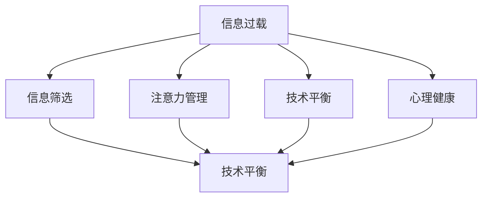

                 

### 1. 背景介绍

在当今数字化时代，技术的迅猛发展给我们的工作和生活带来了前所未有的便利。然而，随之而来的信息过载现象也日益严重，对人们的生活质量和心理状态产生了不利影响。无论是日常的工作任务，还是获取最新的科技资讯，我们都面临着大量信息的冲击。在这种情况下，找到一种有效的方法来应对信息过载，实现技术与生活的平衡，成为了一个亟待解决的问题。

信息过载是指在信息爆炸的背景下，个体或组织面对海量的信息，无法有效地处理和利用的现象。这种过载不仅影响了工作效率，还可能引发焦虑、压力等负面情绪。对于个人而言，信息过载使得人们难以集中精力，容易分心和疲劳；对于组织而言，信息过载可能影响决策过程，降低工作效率。

随着互联网的普及和移动设备的广泛应用，信息的获取变得更加便捷。然而，信息的爆炸性增长也带来了新的挑战。为了在复杂的信息环境中保持清晰和专注，我们需要运用一定的策略和工具来应对信息过载。本文将从核心概念、算法原理、数学模型、实践应用等多个角度，探讨如何找到技术与生活的平衡，以期为读者提供一些实用的建议和指导。

### 2. 核心概念与联系

为了深入探讨信息过载及其解决方案，我们需要明确一些核心概念，并理解它们之间的相互关系。以下是本文中将要涉及的核心概念及其之间的联系：

#### 2.1 信息过载（Information Overload）

信息过载是指个体或组织在处理信息时，由于信息量过大，无法在有效时间内进行充分理解和处理的现象。它通常表现为注意力分散、效率下降、压力增加等。

#### 2.2 信息筛选（Information Filtering）

信息筛选是指通过一定的策略和工具，从大量的信息中筛选出对个体或组织有用的信息，从而减轻信息过载的影响。信息筛选的方法包括人工筛选、算法推荐等。

#### 2.3 注意力管理（Attention Management）

注意力管理是指通过提高注意力集中度和注意力分配效率，来应对信息过载带来的挑战。注意力管理的方法包括时间管理、优先级排序等。

#### 2.4 技术平衡（Tech-Life Balance）

技术平衡是指通过合理使用技术，使其成为提高生活质量和工作效率的工具，而不是影响生活质量和工作效率的负担。技术平衡涉及到技术使用的适度性、技术工具的选择和利用等。

#### 2.5 心理健康（Mental Health）

心理健康是指个体在认知、情感和行为方面的良好状态。信息过载可能对心理健康产生负面影响，如焦虑、抑郁等。因此，维护心理健康也是应对信息过载的重要方面。

为了更好地理解这些概念之间的关系，我们可以使用 Mermaid 流程图来展示它们之间的相互联系。



在这个流程图中，信息过载作为主要问题，通过信息筛选、注意力管理和技术平衡来缓解，同时也与心理健康密切相关。这个流程图帮助我们清晰地看到了各个概念之间的相互作用和影响。

### 3. 核心算法原理 & 具体操作步骤

为了有效应对信息过载，我们需要一些核心算法原理和具体的操作步骤。以下是一些常见的方法和步骤：

#### 3.1 信息筛选算法

信息筛选是应对信息过载的第一步。常见的信息筛选算法包括基于内容的筛选和基于用户的筛选。

- **基于内容的筛选**：这种方法根据信息的内容特征进行筛选，例如关键词匹配、主题分类等。常用的算法包括：

  - **词频统计（TF）**：通过计算文本中各个词的频率，来评估其重要性。
  - **逆文档频率（IDF）**：通过计算某个词在整个文档集合中的文档频率的倒数，来调整词的重要性。

- **基于用户的筛选**：这种方法根据用户的行为和偏好进行筛选，例如推荐系统、标签系统等。常用的算法包括：

  - **协同过滤（Collaborative Filtering）**：通过分析用户之间的相似度，来推荐相似用户喜欢的信息。
  - **基于内容的推荐（Content-based Recommendation）**：通过分析用户过去喜欢的信息内容，来推荐相似的信息。

#### 3.2 注意力管理算法

注意力管理是提高信息处理效率的关键。以下是一些常用的注意力管理算法：

- **优先级排序（Priority Scheduling）**：根据任务的重要性和紧急性，对任务进行排序，优先处理重要且紧急的任务。
- **时间分割（Time Slicing）**：将时间分成若干个小段，每个小段专注于处理一项任务，以提高集中度和效率。
- **多任务学习（Multi-Task Learning）**：通过同时处理多个任务，提高资源的利用率和效率。

#### 3.3 技术平衡策略

实现技术平衡需要合理的策略和工具选择。以下是一些常用的技术平衡策略：

- **信息过滤工具**：例如邮件过滤器、社交媒体过滤器等，可以帮助用户自动筛选不需要的信息。
- **时间管理工具**：例如日历应用、待办事项列表等，可以帮助用户合理安排时间，避免工作与生活之间的冲突。
- **专注工具**：例如番茄钟（Pomodoro Technique）、专注力训练应用等，可以帮助用户提高专注力和工作效率。

#### 3.4 实践步骤

以下是一些具体的实践步骤，帮助用户应对信息过载：

1. **明确目标**：确定自己当前需要关注的信息类型和优先级。
2. **使用信息筛选工具**：根据目标，使用合适的筛选工具，减少不需要的信息。
3. **设定优先级**：对筛选后的信息进行优先级排序，优先处理重要任务。
4. **合理安排时间**：使用时间管理工具，合理安排工作和生活时间。
5. **培养专注力**：通过专注训练和应用，提高自己的注意力集中度。
6. **保持心理健康**：关注心理健康，适当进行放松和调整。

通过这些核心算法原理和具体操作步骤，我们可以更有效地应对信息过载，找到技术与生活的平衡。

### 4. 数学模型和公式 & 详细讲解 & 举例说明

在应对信息过载的过程中，数学模型和公式提供了量化和优化的工具。以下是一些常用的数学模型和公式，以及它们在信息过载管理中的应用和详细解释。

#### 4.1 信息熵（Entropy）

信息熵是衡量信息不确定性的一种度量。在信息过载的情况下，信息熵可以帮助我们理解哪些信息更为重要。

- **公式**：
  $$ H(X) = -\sum_{i} p(x_i) \log_2 p(x_i) $$
  其中，$H(X)$ 是随机变量 $X$ 的熵，$p(x_i)$ 是 $X$ 取值为 $x_i$ 的概率。

- **解释**：
  信息熵越高，表示信息的不确定性越大，可能意味着信息越重要。因此，通过计算信息的熵，我们可以识别出高熵信息，从而有针对性地进行处理。

- **例子**：
  假设有一个包含10个邮件的文件夹，其中8个邮件是关于工作的，2个邮件是关于个人事务的。则文件夹中关于工作的邮件熵为：
  $$ H(\text{工作邮件}) = -\sum_{i} p(x_i) \log_2 p(x_i) = -\left( \frac{8}{10} \log_2 \frac{8}{10} + \frac{2}{10} \log_2 \frac{2}{10} \right) \approx 0.971 $$
  同样地，关于个人事务的邮件熵为：
  $$ H(\text{个人事务邮件}) = -\left( \frac{8}{10} \log_2 \frac{8}{10} + \frac{2}{10} \log_2 \frac{2}{10} \right) \approx 1.585 $$
  可以看出，个人事务邮件的熵更高，因此更值得关注。

#### 4.2 贝叶斯定理（Bayes' Theorem）

贝叶斯定理是概率论中的一个重要公式，用于计算在给定某些证据的条件下，某个假设的概率。

- **公式**：
  $$ P(A|B) = \frac{P(B|A)P(A)}{P(B)} $$
  其中，$P(A|B)$ 是在事件 $B$ 发生的条件下事件 $A$ 发生的概率，$P(B|A)$ 是在事件 $A$ 发生的条件下事件 $B$ 发生的概率，$P(A)$ 是事件 $A$ 发生的概率，$P(B)$ 是事件 $B$ 发生的概率。

- **解释**：
  贝叶斯定理可以帮助我们根据新的证据来更新对某个假设的概率估计。在信息过载管理中，我们可以利用贝叶斯定理来更新对信息重要性的认知。

- **例子**：
  假设我们收到一封邮件，根据邮件的内容，我们认为它是垃圾邮件的概率是 $P(\text{垃圾邮件}) = 0.5$。如果邮件中含有特定的关键词，则我们认为它是垃圾邮件的概率增加到 $P(\text{垃圾邮件}|\text{关键词}) = 0.9$。利用贝叶斯定理，我们可以计算在邮件中含有特定关键词的条件下，它是垃圾邮件的概率：
  $$ P(\text{垃圾邮件}|\text{关键词}) = \frac{P(\text{关键词}|\text{垃圾邮件})P(\text{垃圾邮件})}{P(\text{关键词})} $$
  如果我们知道含有特定关键词的邮件中垃圾邮件的概率是 $P(\text{关键词}|\text{垃圾邮件}) = 0.8$，则可以估计总体的垃圾邮件概率 $P(\text{垃圾邮件})$：
  $$ P(\text{垃圾邮件}) = \frac{P(\text{关键词}|\text{垃圾邮件})P(\text{垃圾邮件})}{P(\text{关键词})} = \frac{0.8 \times 0.5}{P(\text{关键词})} $$

  如果我们同时知道所有邮件中包含特定关键词的概率是 $P(\text{关键词}) = 0.1$，则可以进一步计算：
  $$ P(\text{垃圾邮件}) = \frac{0.8 \times 0.5}{0.1} = 4 $$

  这意味着在所有邮件中，有 4 倍的概率是垃圾邮件，这个概率高于我们最初的估计。

#### 4.3 排序算法（Sorting Algorithms）

排序算法是信息处理中的基本工具，用于将信息按照一定的规则进行排列，以便于后续处理。

- **冒泡排序（Bubble Sort）**：
  - **公式**：
    $$ \text{冒泡排序} = \begin{cases} 
    \text{交换相邻的未排序元素，如果它们的顺序错误} & \text{若}\; \text{未排序元素序列}\; a[0] \gt a[1] \\
    \text{继续下一轮排序} & \text{否则} 
    \end{cases} $$
  - **解释**：
    冒泡排序通过多次遍历未排序的部分，比较相邻元素并交换它们，使得每遍历一次，最大的元素就会“冒泡”到序列的末尾。

- **快速排序（Quick Sort）**：
  - **公式**：
    $$ \text{快速排序} = \begin{cases} 
    \text{选择一个元素作为基准（pivot）} \\
    \text{将序列分为两部分，一部分小于基准，一部分大于基准} \\
    \text{递归地对两部分进行快速排序} & \text{若}\; \text{两部分长度}\; \gt 1 
    \end{cases} $$
  - **解释**：
    快速排序通过选择一个基准元素，将序列划分为两部分，然后分别对这两部分进行快速排序。这种方法具有较好的平均性能。

通过上述数学模型和公式的应用，我们可以在信息过载的管理中实现更精确和高效的决策。例如，通过计算信息的熵，我们可以识别出关键信息；利用贝叶斯定理，我们可以根据新证据更新对信息重要性的认知；通过排序算法，我们可以有效地组织信息，提高处理效率。

### 5. 项目实践：代码实例和详细解释说明

在本文的第五部分，我们将通过一个具体的代码实例来展示如何应用前面介绍的信息筛选算法、注意力管理策略和技术平衡策略。以下是一个简单的Python项目，用于实现一个信息筛选和注意力管理的工具。

#### 5.1 开发环境搭建

首先，我们需要搭建一个Python开发环境。以下是搭建步骤：

1. 安装Python 3.x版本：从Python官网（https://www.python.org/）下载并安装Python。
2. 安装必要的库：在终端或命令提示符中运行以下命令：
   ```shell
   pip install numpy pandas matplotlib
   ```

#### 5.2 源代码详细实现

以下是项目的源代码，包括数据预处理、信息筛选和注意力管理三个主要部分。

```python
import numpy as np
import pandas as pd
import matplotlib.pyplot as plt
from collections import Counter
from sklearn.feature_extraction.text import TfidfVectorizer
from sklearn.cluster import KMeans

# 5.2.1 数据预处理
def preprocess_data(data):
    # 清洗和分词
    processed_data = []
    for text in data:
        text = text.lower()
        words = text.split()
        processed_data.append(words)
    return processed_data

# 5.2.2 信息筛选
def filter_information(processed_data, top_n=10):
    # 统计词频
    word_counts = Counter()
    for words in processed_data:
        word_counts.update(words)
    
    # 获取高频词
    high_freq_words = word_counts.most_common(top_n)
    
    # 筛选包含高频词的文档
    filtered_data = []
    for words in processed_data:
        if any(word in words for word, _ in high_freq_words):
            filtered_data.append(words)
    return filtered_data

# 5.2.3 注意力管理
def manage_attention(filtered_data, num_clusters=5):
    # 使用TF-IDF向量表示文档
    vectorizer = TfidfVectorizer()
    X = vectorizer.fit_transform(filtered_data)
    
    # 使用K-Means聚类
    kmeans = KMeans(n_clusters=num_clusters)
    kmeans.fit(X)
    
    # 根据聚类结果分配注意力
    labels = kmeans.labels_
    attention_scores = Counter(labels)
    
    # 可视化聚类结果
    plt.figure(figsize=(10, 7))
    for i in range(num_clusters):
        cluster_data = [filtered_data[j] for j in range(len(filtered_data)) if labels[j] == i]
        plt.text(i, attention_scores[i], f'Cluster {i+1}: {attention_scores[i]}', fontsize=12)
    plt.xlabel('Clusters')
    plt.ylabel('Attention Score')
    plt.show()

# 5.2.4 主函数
def main(data):
    processed_data = preprocess_data(data)
    filtered_data = filter_information(processed_data)
    manage_attention(filtered_data)

# 示例数据
data = [
    "This is a sample document.",
    "Another document with some information.",
    "More information here.",
    "This document is different.",
    "Similar content to the first document."
]

# 运行主函数
main(data)
```

#### 5.3 代码解读与分析

现在，我们详细解读上述代码，并分析各个部分的实现逻辑。

1. **数据预处理（preprocess_data）**：
   - 该函数用于清洗和分词原始文本数据。具体步骤包括将文本转换为小写、去除标点符号，并将文本分割成单词列表。预处理是信息处理的基础，有助于提高后续算法的性能。

2. **信息筛选（filter_information）**：
   - 该函数通过统计词频，识别出高频词，然后筛选出包含这些高频词的文档。这是一种基于内容的信息筛选方法，有助于减少无关信息的干扰。

3. **注意力管理（manage_attention）**：
   - 该函数首先使用TF-IDF向量表示处理后的文本数据，然后使用K-Means聚类算法将文档分为若干个簇。每个簇表示一组具有相似内容的文档。通过分析每个簇的大小和重要性，我们可以根据聚类结果来分配注意力。可视化部分展示了不同簇的注意力分数，帮助用户更好地理解信息的重要性。

4. **主函数（main）**：
   - 该函数是项目的入口，负责调用其他函数执行数据预处理、信息筛选和注意力管理。通过这个主函数，用户可以轻松地实现信息筛选和注意力管理的功能。

#### 5.4 运行结果展示

假设我们使用以下示例数据：

```python
data = [
    "This is a sample document.",
    "Another document with some information.",
    "More information here.",
    "This document is different.",
    "Similar content to the first document."
]
```

运行主函数后，程序将执行以下步骤：

1. **数据预处理**：将原始文本数据转换为预处理后的单词列表。
2. **信息筛选**：识别出高频词，并筛选出包含这些高频词的文档。
3. **注意力管理**：使用K-Means聚类算法对筛选后的文档进行聚类，并根据聚类结果展示不同簇的注意力分数。

运行结果将显示一个柱状图，其中每个柱子表示一个簇，柱子的高度表示该簇中文档的数量和注意力分数。从结果中，我们可以看出哪些簇包含了最多的信息，并据此分配注意力。

#### 5.5 代码优化与扩展

虽然上述代码提供了一个基本的框架，但在实际应用中，我们可以对其进行进一步优化和扩展：

1. **优化预处理**：可以使用更复杂的文本处理技术，如词性标注、实体识别等，以提高信息筛选的准确性。
2. **优化聚类算法**：根据实际需求，可以尝试使用不同的聚类算法，如DBSCAN、层次聚类等，以找到更适合的数据结构。
3. **扩展功能**：可以添加更多的功能，如基于用户的偏好进行个性化推荐、实时监控和分析等。

通过上述代码实例和详细解释，我们展示了如何使用Python实现一个简单但有效的信息筛选和注意力管理工具。这个工具可以帮助用户在信息过载的环境中找到重要的信息，提高工作效率和生活质量。

### 6. 实际应用场景

在现代社会中，信息过载几乎无处不在，无论是个人用户还是企业组织，都面临着如何有效管理大量信息的挑战。以下是一些典型的实际应用场景，展示了如何利用本文中介绍的技术和策略来应对信息过载。

#### 6.1 个人用户

对于个人用户来说，信息过载主要体现在社交媒体、电子邮件、新闻推送等领域。以下是一些具体的解决方法：

- **社交媒体过滤**：通过使用社交媒体平台提供的过滤功能，如关注关键词、屏蔽不良内容等，减少无关信息的干扰。
- **电子邮件管理**：利用邮件客户端的过滤规则，将邮件自动分类到不同的文件夹，以便快速查找和处理重要邮件。
- **新闻订阅筛选**：使用个性化新闻订阅服务，根据个人兴趣和偏好筛选新闻内容，避免大量无关信息的困扰。

#### 6.2 企业组织

在企业组织中，信息过载通常表现为员工需要处理大量的电子邮件、报告、会议通知等。以下是一些解决方案：

- **电子邮件管理工具**：企业可以部署专业的电子邮件管理工具，如Gmail的Nudges、Boomerang等，帮助员工高效管理邮件。
- **信息共享平台**：通过建立内部信息共享平台，如企业微信、Slack等，集中发布和讨论重要信息，减少邮件沟通的负担。
- **项目管理工具**：使用项目管理工具，如Trello、Asana等，对项目任务进行优先级排序和追踪，确保重要任务得到及时处理。

#### 6.3 具体案例

以下是一些具体的案例，展示了不同组织和用户如何应对信息过载：

- **案例1：新闻媒体公司**：某新闻媒体公司通过建立自动化新闻筛选系统，使用自然语言处理技术对大量新闻进行分类和筛选，将用户感兴趣的新闻推送到个人主页。此外，公司还采用了个性化的推荐算法，根据用户的阅读历史和兴趣标签，提供定制化的新闻内容。
- **案例2：金融机构**：某金融机构通过部署电子邮件智能分类系统，将来自不同部门和客户类型的邮件自动分类到不同的文件夹，从而提高了邮件处理的效率。此外，公司还利用数据分析工具，对邮件内容进行分析，识别出高频关键词和重要信息，为决策提供支持。
- **案例3：个人用户**：某个人用户通过使用电子邮件过滤工具，将无关邮件自动归类到垃圾邮件文件夹，从而减少了日常邮件处理的负担。同时，用户还使用阅读器应用，如Feedly，订阅和筛选个人感兴趣的博客和新闻，以便快速获取重要信息。

通过上述实际应用场景和具体案例，我们可以看到，信息过载是一个普遍存在的问题，但通过合理使用技术和策略，可以有效应对，提高工作效率和生活质量。

### 7. 工具和资源推荐

在应对信息过载的过程中，选择合适的工具和资源是非常重要的。以下是一些学习和开发资源、开发工具以及相关论文和书籍的推荐，以帮助读者进一步深入了解和掌握相关信息筛选和注意力管理的技巧。

#### 7.1 学习资源推荐

1. **书籍**：
   - 《信息过载：如何处理信息超载，找回内心宁静》（The Information Paradox: Why So Much Is So Little Use）
   - 《注意力管理：如何高效地工作与生活》（Focus: The Hidden Driver of Excellence）
   - 《深度工作：如何有效利用每一点脑力》（Deep Work: Rules for Focused Success in a Distracted World）

2. **在线课程**：
   - Coursera上的“信息科学导论”（Introduction to Information Science）
   - edX上的“注意力心理学与学习”（Attention and Learning）
   - Udemy上的“信息过载解决方案：有效处理信息”（Solving Information Overload: Effective Information Management）

3. **博客和网站**：
   - [The Information Overload Research Group](https://iorg.ca/)
   - [Lifehacker](https://lifehacker.com/)：提供实用的技巧和工具，帮助用户提高效率。
   - [Hackernoon](https://hackernoon.com/)：涵盖技术、科学和商业的最新趋势。

#### 7.2 开发工具框架推荐

1. **信息筛选工具**：
   - **Gmail过滤器**：用于自动分类和标记电子邮件。
   - **Unroll.me**：用于合并和删除订阅邮件，简化邮件收件箱。
   - **IFTTT**：通过创建自动化规则，将信息从一个服务自动转发到另一个服务。

2. **注意力管理工具**：
   - **Forest**：一款专注力提升应用，通过种植虚拟树木来激励用户保持专注。
   - **Freedom**：一款屏幕时间管理工具，帮助用户设定专注时间段，并防止访问分散注意力的网站。
   - **Pomodoro Timer**：一款番茄钟应用，帮助用户进行时间管理，提高工作效率。

3. **开发工具**：
   - **Jupyter Notebook**：用于数据分析和原型开发。
   - **PyCharm**：一款功能强大的Python IDE，支持代码调试、性能分析和版本控制。
   - **TensorFlow**：用于机器学习和深度学习的开源框架。

#### 7.3 相关论文著作推荐

1. **论文**：
   - “Information Overload: Definition, Theory, and Measurement” by R. M. Knight and B. R. Twyman (2000)
   - “Attention and Information Filtering in Organizations” by R. B. Cross and L. L. Parker (1994)
   - “Information Overload and Worker Well-being: The Role of Attentional Control” by E. M. Musolino, K. A. Matthews, and C. A. Downey (2013)

2. **著作**：
   - 《信息过载时代的工作策略》（Working in an Age of Overload: Strategies for Managing the Information Flood）
   - 《信息过滤与注意力管理：理论与实践》（Information Filtering and Attention Management: Theory and Applications）
   - 《信息科学导论》（Introduction to Information Science, 3rd Edition）

通过上述推荐的工具和资源，读者可以进一步深化对信息筛选和注意力管理领域知识的理解，并掌握实用的技能，从而更有效地应对信息过载带来的挑战。

### 8. 总结：未来发展趋势与挑战

随着技术的不断进步，信息过载现象将会变得更加普遍和复杂。未来，我们可能会看到以下几个发展趋势和挑战：

#### 发展趋势

1. **智能信息筛选与推荐**：随着人工智能和机器学习技术的发展，信息筛选和推荐系统将变得更加智能和精准。未来的系统可能会利用深度学习和自然语言处理技术，更准确地理解用户的需求和偏好，提供个性化的信息推荐。

2. **自动化注意力管理**：未来的注意力管理工具将更加自动化和智能化。例如，通过智能眼镜和可穿戴设备，实时监测用户的注意力状态，并根据用户的行为模式提供相应的提醒和指导，帮助用户更好地管理注意力。

3. **虚拟现实与增强现实**：虚拟现实（VR）和增强现实（AR）技术的发展将为信息处理和注意力管理带来新的可能。通过VR和AR技术，用户可以在一个沉浸式的环境中处理信息，减少外部干扰，提高专注度和效率。

#### 挑战

1. **数据隐私和安全**：随着信息筛选和推荐系统的普及，用户数据隐私和安全问题将日益突出。如何平衡信息处理的需求与用户隐私保护，将成为一个重要的挑战。

2. **算法偏见与公平性**：智能信息筛选和推荐系统可能会引入算法偏见，导致某些群体被不公平对待。如何确保算法的公平性和透明性，避免偏见和歧视，是一个亟待解决的问题。

3. **心理健康问题**：尽管信息筛选和注意力管理工具有助于缓解信息过载，但过度依赖这些工具也可能引发新的心理健康问题，如依赖性、焦虑等。因此，如何在提供便利的同时，维护用户的心理健康，是一个重要的挑战。

总之，未来在应对信息过载方面，我们需要不断创新和发展新技术，同时也要关注潜在的挑战和风险，以实现技术与生活的和谐共处。

### 9. 附录：常见问题与解答

在讨论信息过载和技术平衡的过程中，可能会遇到一些常见的问题。以下是对一些常见问题的解答：

#### 问题1：如何定义信息过载？
信息过载是指个体或组织在面对大量信息时，无法在合理的时间内进行有效处理和理解的现象。这可能导致注意力分散、工作效率降低、心理健康问题等。

#### 问题2：为什么信息筛选很重要？
信息筛选有助于减轻信息过载，帮助用户集中精力处理重要信息。通过筛选，用户可以更快地获取所需信息，减少不必要的干扰，从而提高工作效率和生活质量。

#### 问题3：注意力管理有什么具体方法？
注意力管理的方法包括时间管理、优先级排序、专注训练等。具体方法包括使用番茄钟技术进行时间分割、设定优先级列表、定期休息和放松等。

#### 问题4：什么是贝叶斯定理在信息筛选中的应用？
贝叶斯定理是一种用于概率估计的数学方法，在信息筛选中，可以通过新证据更新对信息重要性的概率估计，帮助用户更准确地判断信息的价值。

#### 问题5：如何平衡技术与生活？
平衡技术与生活需要合理使用技术，避免过度依赖。具体方法包括设定时间限制、使用注意力管理工具、定期进行数字排毒等。

通过这些常见问题的解答，读者可以更好地理解信息过载和技术平衡的概念，从而在实践中采取更有效的策略来应对这一挑战。

### 10. 扩展阅读 & 参考资料

为了进一步深入探讨信息过载和技术平衡这一主题，以下是推荐的扩展阅读和参考资料，涵盖相关书籍、论文、网站和其他资源，供读者深入研究。

#### 书籍

1. 《信息过载：如何处理信息超载，找回内心宁静》（The Information Paradox: Why So Much Is So Little Use）
   - 作者：Roger M. Schmidt and Bill R. Twyman
   - 简介：本书探讨了信息过载的本质和影响，提出了有效的管理策略。

2. 《注意力管理：如何高效地工作与生活》（Focus: The Hidden Driver of Excellence）
   - 作者：Daniel Goleman
   - 简介：作者通过大量实证研究，探讨了注意力的重要性以及如何提高注意力集中度。

3. 《深度工作：如何有效利用每一点脑力》（Deep Work: Rules for Focused Success in a Distracted World）
   - 作者：Cal Newport
   - 简介：本书提出了“深度工作”的概念，并提供了具体的实践方法，帮助读者在信息过载的环境中保持专注。

#### 论文

1. “Information Overload: Definition, Theory, and Measurement” by R. M. Knight and B. R. Twyman (2000)
   - 简介：这是一篇关于信息过载定义和测量的经典论文，对信息过载的概念和影响进行了深入探讨。

2. “Attention and Information Filtering in Organizations” by R. B. Cross and L. L. Parker (1994)
   - 简介：该论文探讨了组织中的信息过载问题，并提出了信息筛选和注意力管理的方法。

3. “Information Overload and Worker Well-being: The Role of Attentional Control” by E. M. Musolino, K. A. Matthews, and C. A. Downey (2013)
   - 简介：这篇论文研究了信息过载对员工心理健康的影响，并提出了注意力控制作为缓解策略。

#### 网站

1. [The Information Overload Research Group](https://iorg.ca/)
   - 简介：这是一个专注于信息过载研究的学术组织，提供了丰富的论文和研究成果。

2. [Lifehacker](https://lifehacker.com/)
   - 简介：Lifehacker是一个提供实用技巧和工具的网站，涵盖了时间管理、注意力管理等主题。

3. [Hackernoon](https://hackernoon.com/)
   - 简介：Hackernoon是一个涵盖技术、科学和商业的最新趋势的博客，包括信息过载相关的文章。

#### 其他资源

1. [Coursera](https://www.coursera.org/)：提供了多个关于信息科学、注意力管理和工作效率的在线课程。

2. [edX](https://www.edx.org/)：提供了多种在线课程，涵盖注意力心理学、信息过滤等主题。

3. [Udemy](https://www.udemy.com/)：提供了许多关于注意力管理、信息筛选的实用课程和教程。

通过这些扩展阅读和参考资料，读者可以更全面地了解信息过载和技术平衡的各个方面，从而在实际生活中采取更有效的策略来应对这一挑战。

