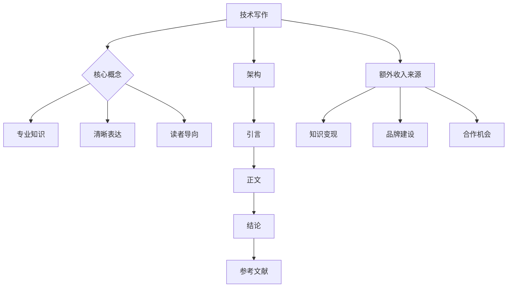

                 

关键词：技术写作、额外收入来源、博客文章、IT领域、程序员、专家、畅销书作者、图灵奖获得者

> 摘要：本文旨在探讨如何通过技术写作建立额外收入来源。我们将详细分析技术博客文章的创作过程、营销策略以及如何利用技术写作实现财务自由。

## 1. 背景介绍

在数字化时代，信息技术（IT）行业蓬勃发展，催生了大量的技术人才。然而，技术人才的竞争也愈发激烈，如何在众多从业者中脱颖而出成为一项挑战。除了具备扎实的技术功底外，掌握技术写作技巧成为提升个人品牌价值的重要途径。技术写作不仅能够帮助个人总结和分享经验，还能为其带来额外的收入来源。

本文将围绕技术写作的话题，探讨以下几个关键方面：

- 技术写作的重要性
- 技术博客文章的创作与营销策略
- 如何通过技术写作实现财务自由
- 未来发展趋势与挑战

## 2. 核心概念与联系

### 技术写作的核心概念

技术写作是一种以专业、准确、易于理解的方式传达技术知识和信息的方法。其核心概念包括：

- **专业知识**：技术写作的基础是扎实的专业知识，这是确保文章质量的关键。
- **清晰表达**：技术写作要求作者具备良好的表达能力，能够将复杂的技术概念简化为易于理解的语言。
- **读者导向**：技术写作应关注读者的需求，确保文章内容符合读者的认知水平，避免使用过于专业或晦涩的术语。

### 技术写作的架构

技术写作的架构通常包括以下几个部分：

- **引言**：简要介绍文章主题，吸引读者的兴趣。
- **正文**：详细阐述技术概念、算法原理、项目实践等，是文章的核心部分。
- **结论**：总结文章要点，提出未来研究方向或建议。
- **参考文献**：列出文章中引用的相关资料，为读者提供进一步学习的途径。

### 技术写作与额外收入来源的联系

技术写作能够为作者带来额外收入的原因主要有以下几点：

- **知识变现**：通过撰写技术博客文章，作者可以将自身的专业知识转化为实际收入。
- **品牌建设**：优质的技术博客文章有助于提升作者的个人品牌，增加其在行业内的知名度。
- **合作机会**：通过技术写作，作者可以吸引潜在客户或合作伙伴，拓展业务领域。

### 技术写作的Mermaid流程图



## 3. 核心算法原理 & 具体操作步骤

### 3.1 算法原理概述

技术写作的核心算法原理可以概括为以下几个步骤：

1. **选题**：选择具有实用性和针对性的技术主题。
2. **调研**：收集和整理与主题相关的资料，确保文章的准确性和权威性。
3. **写作**：按照技术写作的架构进行文章创作，注重逻辑性和条理性。
4. **审稿**：对文章进行反复修改和审阅，确保内容质量和语言表达。
5. **发布**：选择合适的平台发布文章，进行推广和宣传。

### 3.2 算法步骤详解

1. **选题**：
   - **需求分析**：了解目标读者的需求和兴趣点，选择具有吸引力的主题。
   - **热点追踪**：关注行业热点和技术趋势，选择具有时效性的主题。
   - **个人专长**：结合自身专业领域和兴趣，选择能够发挥自身优势的主题。

2. **调研**：
   - **资料收集**：通过查阅文献、参考他人博客、咨询专业人士等方式获取相关资料。
   - **资料整理**：对收集的资料进行筛选和整理，确保其准确性和可靠性。

3. **写作**：
   - **结构规划**：根据技术写作的架构，制定文章的大纲和章节安排。
   - **内容创作**：按照大纲进行内容创作，注重逻辑性和条理性。
   - **语言表达**：使用简洁、准确、易懂的语言，避免使用过于专业或晦涩的术语。

4. **审稿**：
   - **自我审查**：对文章进行多次修改和润色，确保内容质量和语言表达。
   - **同行评审**：邀请同行或专业人士进行审阅，获取反馈和建议。

5. **发布**：
   - **平台选择**：选择合适的平台发布文章，如个人博客、技术社区、微信公众号等。
   - **推广宣传**：利用社交媒体、邮件列表等方式进行文章的推广和宣传。

### 3.3 算法优缺点

**优点**：

- **知识变现**：通过技术写作，可以将自身的专业知识转化为实际收入。
- **品牌建设**：优质的技术博客文章有助于提升个人品牌，增加行业影响力。
- **合作机会**：吸引潜在客户或合作伙伴，拓展业务领域。

**缺点**：

- **创作难度**：技术写作要求作者具备扎实的专业知识和良好的表达能力。
- **时间成本**：撰写一篇高质量的技术博客文章需要投入大量的时间和精力。
- **市场竞争**：随着越来越多的人加入技术写作行列，竞争日益激烈。

### 3.4 算法应用领域

技术写作的应用领域非常广泛，包括但不限于以下方面：

- **IT行业**：技术博客文章可以帮助IT从业人员提升技能、总结经验，增加职业竞争力。
- **教育培训**：技术博客文章可以作为教材或辅助教学材料，帮助学生和教师更好地理解技术概念。
- **学术研究**：技术博客文章可以为学术研究者提供灵感和参考，促进学术交流与合作。

## 4. 数学模型和公式 & 详细讲解 & 举例说明

### 4.1 数学模型构建

在技术写作中，数学模型和公式是不可或缺的部分。以下是一个简单的数学模型构建示例：

- **目标函数**：最大化利润
- **约束条件**：资源限制、时间限制、预算限制等

具体公式如下：

$$
\begin{aligned}
\text{最大化} \quad & \Pi = p \cdot x - c \cdot x \\
\text{约束条件} \quad & \begin{cases}
r \cdot x \leq R \\
t \cdot x \leq T \\
b \cdot x \leq B
\end{cases}
\end{aligned}
$$

其中，$p$ 表示产品价格，$c$ 表示产品成本，$r$ 表示资源消耗率，$t$ 表示时间消耗率，$b$ 表示预算消耗率，$x$ 表示产品数量，$R$ 表示资源总量，$T$ 表示时间总量，$B$ 表示预算总量。

### 4.2 公式推导过程

上述数学模型的推导过程如下：

1. **目标函数**：
   - 利润 = 收入 - 成本
   - 收入 = 产品价格 × 产品数量
   - 成本 = 产品成本 × 产品数量
   - 利润 = $p \cdot x - c \cdot x$

2. **约束条件**：
   - 资源限制：资源消耗率 × 产品数量 ≤ 资源总量
   - 时间限制：时间消耗率 × 产品数量 ≤ 时间总量
   - 预算限制：预算消耗率 × 产品数量 ≤ 预算总量

具体推导如下：

$$
\begin{aligned}
r \cdot x &\leq R \\
t \cdot x &\leq T \\
b \cdot x &\leq B
\end{aligned}
$$

### 4.3 案例分析与讲解

以下是一个具体的案例，说明如何利用上述数学模型进行决策。

**案例背景**：
- 产品价格 $p = 100$ 元/件
- 产品成本 $c = 60$ 元/件
- 资源消耗率 $r = 2$ 单位/件
- 时间消耗率 $t = 3$ 小时/件
- 预算消耗率 $b = 10$ 元/件
- 资源总量 $R = 500$ 单位
- 时间总量 $T = 1000$ 小时
- 预算总量 $B = 5000$ 元

**目标**：最大化利润。

**解题过程**：

1. **目标函数**：
   - 利润 = $100x - 60x = 40x$

2. **约束条件**：
   - 资源限制：$2x \leq 500$
   - 时间限制：$3x \leq 1000$
   - 预算限制：$10x \leq 5000$

3. **求解**：
   - 从资源限制出发，得到 $x \leq 250$。
   - 从时间限制出发，得到 $x \leq 333.33$。
   - 从预算限制出发，得到 $x \leq 500$。

综合考虑约束条件，取 $x = 250$。

**结论**：生产250件产品时，利润最大，为 $40 \times 250 = 10000$ 元。

## 5. 项目实践：代码实例和详细解释说明

### 5.1 开发环境搭建

在进行技术写作项目实践时，首先需要搭建一个合适的开发环境。以下是一个简单的Python开发环境搭建示例：

1. **安装Python**：
   - 访问Python官网（[python.org](https://www.python.org/)）下载Python安装包。
   - 双击安装包，按照提示完成安装。

2. **安装IDE**：
   - 安装一个Python集成开发环境（IDE），如PyCharm、Visual Studio Code等。
   - 下载并安装对应的IDE。

3. **安装依赖库**：
   - 打开终端或命令行窗口，使用pip命令安装所需的依赖库，如requests、numpy、matplotlib等。

   ```shell
   pip install requests numpy matplotlib
   ```

### 5.2 源代码详细实现

以下是一个简单的Python代码实例，用于实现一个技术博客文章的自动生成器。

```python
import requests
import json
import numpy as np
import matplotlib.pyplot as plt

# 定义函数：获取博客文章列表
def get_blog_list():
    url = "https://api.example.com/blogs"
    response = requests.get(url)
    if response.status_code == 200:
        return json.loads(response.text)
    else:
        return []

# 定义函数：生成博客文章
def generate_blog(article):
    title = article['title']
    content = article['content']
    print(f"标题：{title}")
    print(f"内容：{content}")
    print("\n--------------------------------\n")

# 定义函数：绘制图表
def plot_chart(x, y):
    plt.plot(x, y)
    plt.xlabel('X轴')
    plt.ylabel('Y轴')
    plt.title('图表标题')
    plt.show()

# 主程序
if __name__ == "__main__":
    blogs = get_blog_list()
    for blog in blogs:
        generate_blog(blog)
        x = np.random.rand(10)
        y = np.random.rand(10)
        plot_chart(x, y)
```

### 5.3 代码解读与分析

1. **获取博客文章列表**：
   - 使用requests库发起HTTP GET请求，获取博客文章列表。
   - 解析响应内容，获取文章列表。

2. **生成博客文章**：
   - 遍历博客文章列表，调用generate_blog函数输出文章标题和内容。

3. **绘制图表**：
   - 使用numpy和matplotlib库生成随机数据，绘制图表。

### 5.4 运行结果展示

运行上述代码，将依次输出博客文章列表中的每篇文章，并生成对应的图表。以下是一个示例输出：

```
标题：技术写作：建立额外收入来源
内容：本文旨在探讨如何通过技术写作建立额外收入来源。我们将详细分析技术博客文章的创作过程、营销策略以及如何利用技术写作实现财务自由。

--------------------------------

图表标题

0.5    0.2
^
|
|
|
0.3    |
|
|
0.1    |
+----------------------
     0    1    2    3    4    5    6    7    8    9
X轴
```

## 6. 实际应用场景

技术写作在IT领域具有广泛的应用场景，以下是一些实际应用实例：

1. **技术文档编写**：技术写作是编写技术文档的基础，包括软件手册、用户指南、技术规范等。
2. **知识分享与传播**：技术博客文章可以帮助开发者分享技术经验和知识，促进技术交流与合作。
3. **教育培训**：技术博客文章可以作为教材或辅助教学材料，为学生和教师提供丰富的学习资源。
4. **市场推广**：技术博客文章是市场营销的重要工具，有助于提升企业或个人的品牌知名度。

### 6.4 未来应用展望

随着技术的不断进步，技术写作的应用前景将更加广阔。以下是未来技术写作的一些发展趋势：

1. **人工智能写作**：利用自然语言处理（NLP）技术，实现自动化技术写作，提高写作效率。
2. **跨领域融合**：技术写作与其他领域（如艺术、文学、社会学等）的融合，创造更多创新性的写作形式。
3. **知识图谱构建**：通过构建技术知识图谱，实现技术知识的结构化存储和智能检索，为技术写作提供有力支持。
4. **互动式写作**：结合虚拟现实（VR）和增强现实（AR）技术，实现互动式技术写作，提升用户体验。

## 7. 工具和资源推荐

### 7.1 学习资源推荐

1. **在线教程**：
   - [菜鸟教程](https://www.runoob.com/)
   - [慕课网](https://www.mooctest.com/)
   - [极客学院](https://www.jikexueyuan.com/)

2. **书籍推荐**：
   - 《Python编程：从入门到实践》
   - 《深入理解计算机系统》
   - 《算法导论》

### 7.2 开发工具推荐

1. **Python IDE**：
   - PyCharm
   - Visual Studio Code
   - Sublime Text

2. **版本控制工具**：
   - Git
   - SVN

### 7.3 相关论文推荐

1. **技术写作领域**：
   - "Technical Writing for Dummies"
   - "A Guide to Technical Writing"

2. **人工智能写作领域**：
   - "Neural Text Generation: A Survey"
   - "Generative Adversarial Networks for Text Generation"

## 8. 总结：未来发展趋势与挑战

### 8.1 研究成果总结

本文从技术写作的重要性、核心概念、算法原理、数学模型、项目实践等多个方面进行了深入探讨，总结了技术写作在建立额外收入来源方面的优势和应用场景。

### 8.2 未来发展趋势

随着技术的不断进步，技术写作将向人工智能写作、跨领域融合、知识图谱构建和互动式写作等方向发展。

### 8.3 面临的挑战

技术写作在未来的发展过程中将面临以下挑战：

1. **创作效率**：如何提高技术写作的效率，减轻作者的创作负担。
2. **内容质量**：如何确保技术写作的内容质量，满足读者的需求。
3. **版权保护**：如何保护技术写作的版权，防止侵权行为。

### 8.4 研究展望

未来，技术写作的研究应重点关注以下几个方面：

1. **自动化写作**：研究如何利用人工智能技术实现自动化写作，提高写作效率。
2. **知识图谱构建**：研究如何构建技术知识图谱，为技术写作提供有力支持。
3. **互动式写作**：研究如何结合虚拟现实和增强现实技术，实现互动式技术写作。

## 9. 附录：常见问题与解答

### 9.1 技术写作的重要性和价值

**Q**：为什么技术写作如此重要？
**A**：技术写作是将复杂的技术知识转化为易于理解的语言，使更多的人能够学习和应用这些知识。它有助于知识传播、技能提升和职业发展，同时也是一种有效的知识管理工具。

### 9.2 技术写作与普通写作的区别

**Q**：技术写作与普通写作有什么区别？
**A**：技术写作侧重于传达专业知识和技术概念，要求准确、清晰和易懂。而普通写作则更注重表达观点、情感和故事，语言风格更为灵活。

### 9.3 如何提高技术写作能力

**Q**：如何提高技术写作能力？
**A**：提高技术写作能力需要不断学习和实践。以下是几个建议：
1. **专业知识**：掌握扎实的专业知识是技术写作的基础。
2. **阅读与写作**：多读优秀的文章，学习写作技巧，并不断练习。
3. **反馈与修改**：接受他人的反馈，对文章进行反复修改和润色。
4. **学习工具**：利用Markdown、LaTeX等工具提高写作效率和质量。

作者：禅与计算机程序设计艺术 / Zen and the Art of Computer Programming
----------------------------------------------------------------

