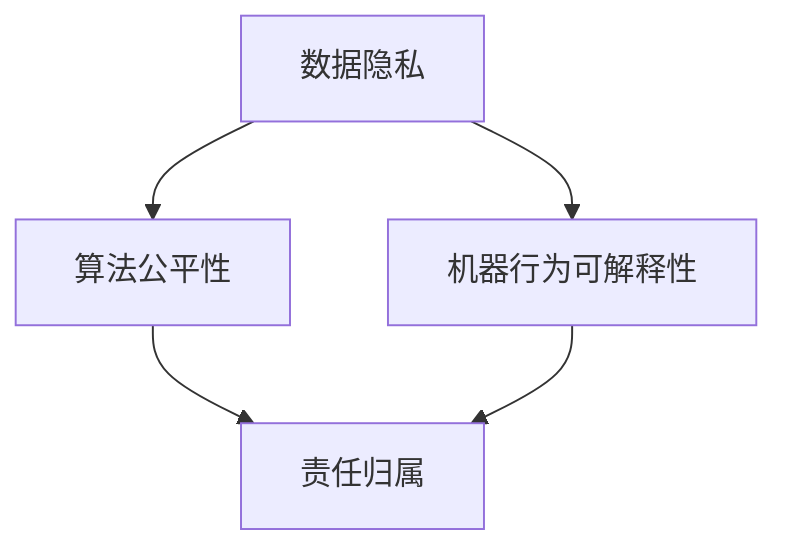

                 

### 1. 背景介绍

#### 1.1 技术创业的兴起

随着互联网技术的飞速发展，大数据、云计算、人工智能等新兴技术不断涌现，技术创业成为推动社会进步和经济发展的关键力量。在过去的几十年中，技术创业浪潮席卷全球，涌现出无数成功的案例，如谷歌、微软、亚马逊等科技巨头，它们不仅改变了我们的生活，也重塑了整个行业的格局。

技术创业的优势在于其创新性和颠覆性。通过创新，创业者可以提出前所未有的解决方案，满足市场的需求，从而获得竞争优势。而颠覆性技术则能够打破现有的行业规则，创造全新的市场机会。在这种背景下，越来越多的创业者投身于技术领域，希望能够通过技术创新实现财富自由和改变世界。

#### 1.2 人工智能的崛起

人工智能（AI）作为技术创业的核心驱动力，正迅速改变各行各业。从智能助手到自动驾驶，从医疗诊断到金融预测，人工智能的应用场景不断扩展。AI技术的崛起不仅提升了效率，降低了成本，还带来了前所未有的创新空间。然而，随着人工智能在技术创业中的广泛应用，其伦理问题也日益凸显。

人工智能伦理是指对人工智能系统设计和应用中的道德、法律和社会问题的关注。它涉及数据的隐私保护、算法的公平性、机器行为的可解释性等多个方面。在技术创业中，如何平衡人工智能的创新与责任成为了一个亟待解决的问题。

#### 1.3 人工智能伦理的重要性

人工智能伦理的重要性体现在以下几个方面：

1. **社会信任**：人工智能系统被广泛接受和应用的前提是其符合社会伦理标准，能够赢得公众的信任。一旦出现伦理问题，可能导致公众对技术的抵制和质疑，影响其应用前景。

2. **法律责任**：随着人工智能技术的普及，其应用场景和影响力不断扩大。一旦发生因人工智能系统导致的意外事故，责任的归属将变得复杂。明确人工智能伦理规范有助于界定法律责任，保护用户权益。

3. **技术创新**：人工智能伦理的规范有助于引导技术发展，避免陷入技术停滞或误用。通过伦理指导，技术创业可以更加专注于解决实际问题，推动社会进步。

4. **商业价值**：在遵守伦理规范的前提下，技术创业企业能够建立良好的品牌形象，赢得市场和用户的认可，从而提升商业价值。

综上所述，技术创业中的人工智能伦理不仅是技术问题，更是社会问题和法律问题。如何在创新与责任之间找到平衡点，成为每一个技术创业者必须面对的挑战。

### 2. 核心概念与联系

在探讨技术创业中的人工智能伦理时，我们需要明确几个核心概念，并理解它们之间的联系。以下是几个关键概念的定义和它们在人工智能伦理中的关联：

#### 2.1 数据隐私

数据隐私是指个人数据的保密性和安全性。在人工智能系统中，数据隐私尤为重要，因为AI系统通常需要处理大量敏感数据，如个人信息、健康记录等。数据隐私问题包括数据收集、存储、处理和使用等环节，关系到用户的隐私权和信息安全。

#### 2.2 算法公平性

算法公平性是指人工智能系统在决策过程中不应因种族、性别、年龄等因素对某些群体产生偏见。算法公平性问题关乎社会公正和人类尊严，直接影响到AI系统的可接受性和应用范围。

#### 2.3 机器行为可解释性

机器行为可解释性是指人工智能系统在执行特定任务时应能够解释其决策过程和结果。这一概念有助于增强用户对AI系统的信任，特别是在涉及重要决策（如医疗诊断、法律判决等）时。

#### 2.4 责任归属

责任归属是指在人工智能系统造成损害时，如何确定责任方。明确责任归属有助于保障用户权益，防止因技术失误或伦理问题导致的意外事件。

#### 2.5 关联图

为了更好地理解这些概念之间的联系，我们可以使用Mermaid流程图来展示它们之间的关系：



在上图中，数据隐私、算法公平性和机器行为可解释性共同构成了人工智能伦理的核心内容，而责任归属则是这些伦理问题的一个必要补充。

#### 2.6 重要性分析

1. **数据隐私**：数据隐私是AI系统的基石，没有隐私保护，用户不会愿意分享个人信息，从而限制了AI的发展和应用。

2. **算法公平性**：算法公平性关系到社会的公正性，不公正的算法可能导致歧视和社会矛盾，影响AI系统的可持续性和公信力。

3. **机器行为可解释性**：可解释性增强了用户对AI系统的信任，特别是在涉及关键决策时，用户需要了解AI是如何作出决策的。

4. **责任归属**：明确责任归属有助于规范AI系统的应用，保护用户权益，减少潜在的法律纠纷。

通过上述核心概念及其关联的分析，我们可以看出，人工智能伦理不仅涉及技术问题，还涉及社会、法律和道德层面。在技术创业中，理解并关注这些核心概念及其相互联系，是构建符合伦理要求的人工智能系统的重要步骤。

### 3. 核心算法原理 & 具体操作步骤

在探讨人工智能伦理时，理解核心算法原理及其具体操作步骤是非常重要的。这不仅有助于我们更好地理解AI系统的运作机制，还能为伦理决策提供科学依据。以下是一个关于基于伦理约束的机器学习算法的示例。

#### 3.1 机器学习算法原理

机器学习算法是人工智能的核心技术之一。它通过训练模型从数据中学习规律，并利用这些规律进行预测或分类。常见的机器学习算法包括线性回归、决策树、支持向量机（SVM）、神经网络等。

在算法设计中，我们要关注以下几个关键点：

1. **数据预处理**：包括数据清洗、归一化、缺失值处理等，确保数据的质量和一致性。
2. **特征选择**：选择对模型性能有显著影响的特征，剔除无关或冗余特征，降低模型的复杂度和过拟合风险。
3. **模型训练**：通过训练数据集训练模型，使其学习数据中的规律。
4. **模型评估**：使用测试数据集评估模型性能，选择合适的评价指标，如准确率、召回率、F1值等。

#### 3.2 基于伦理约束的机器学习算法

为了在技术创业中更好地平衡创新与责任，我们需要设计符合伦理要求的机器学习算法。以下是一个简单的示例：

1. **数据隐私保护**：
   - **差分隐私**：在处理个人数据时，通过添加噪声来保护数据的隐私性，确保个体数据不会被单独识别。
   - **同质化**：将敏感数据与匿名数据混合，减少对个体数据的依赖。

2. **算法公平性**：
   - **对抗性训练**：通过生成对抗性样本，增强模型的鲁棒性和公平性，防止对特定群体的偏见。
   - **反歧视规则**：在设计算法时，加入反歧视规则，确保算法不会因种族、性别、年龄等因素对某些群体产生不公平待遇。

3. **机器行为可解释性**：
   - **模型解释**：通过可视化技术，如决策树、决策图等，展示模型的决策过程和关键特征。
   - **可解释性算法**：选择具有高可解释性的算法，如决策树、线性回归等，避免使用复杂的神经网络模型。

4. **责任归属**：
   - **透明度**：确保算法的透明度，让用户了解系统的运作机制和决策过程。
   - **责任划分**：在算法设计和应用过程中，明确各方的责任，如数据提供方、算法开发方和使用方等。

#### 3.3 具体操作步骤

1. **数据收集与预处理**：
   - 收集相关数据，如用户行为数据、社会统计数据等。
   - 进行数据清洗，剔除噪声数据，处理缺失值。
   - 进行数据归一化，确保数据的一致性和可比性。

2. **特征选择**：
   - 选择对模型性能有显著影响的特征，如用户年龄、性别、购买行为等。
   - 进行特征工程，如编码、特征融合等，提高特征质量。

3. **算法训练**：
   - 选择合适的机器学习算法，如决策树、SVM等。
   - 使用训练数据集训练模型，调整模型参数，优化模型性能。

4. **模型评估**：
   - 使用测试数据集评估模型性能，选择合适的评价指标。
   - 对模型进行调优，确保其在实际应用中的稳定性和鲁棒性。

5. **算法应用**：
   - 将训练好的模型应用于实际问题，如用户行为预测、信用评分等。
   - 在应用过程中，持续监控模型的性能和公平性，确保其符合伦理要求。

通过上述步骤，我们可以设计一个符合伦理要求的机器学习算法，为技术创业中的伦理问题提供解决方案。值得注意的是，这只是一个简单的示例，实际应用中可能涉及更多复杂的算法和技术。

### 4. 数学模型和公式 & 详细讲解 & 举例说明

在人工智能伦理的讨论中，数学模型和公式扮演着至关重要的角色。它们不仅为我们提供了分析和评估AI系统性能的工具，还为制定伦理规范提供了科学依据。以下我们将详细讲解几个关键的数学模型和公式，并通过具体例子来说明它们的实际应用。

#### 4.1 数据隐私保护模型：差分隐私

差分隐私是一种用于保护数据隐私的数学模型，它通过在数据上添加噪声来确保单个记录的隐私性。差分隐私的定义如下：

$$
\Delta \approx \text{rand()} \text{ where } \Delta \text{ is a random variable with } P(\Delta = 1) = 0.5
$$

其中，$\Delta$ 表示一个表示数据差异的随机变量。差分隐私要求在处理隐私敏感数据时，添加的噪声足够大，以至于单个记录的隐私无法被推断出来。

**例子**：假设我们有一个包含1000个用户的用户数据集，其中每位用户有两个属性：年龄和性别。我们希望保护这些属性的隐私。可以使用差分隐私模型，通过添加随机噪声来保护这些属性。

$$
\text{protected\_age} = \text{age} + \text{rand()} \text{ where } \text{rand()} \text{ is a random variable with } P(\text{rand()} = 1) = 0.5
$$

$$
\text{protected\_gender} = \text{gender} + \text{rand()} \text{ where } \text{rand()} \text{ is a random variable with } P(\text{rand()} = 1) = 0.5
$$

通过上述公式，我们可以确保即使攻击者获得了保护后的数据，也无法推断出单个用户的原始数据。

#### 4.2 算法公平性度量：公平性指标

算法公平性的度量通常使用公平性指标，如偏差（Bias）、方差（Variance）和公平性分数（Fairness Score）等。以下是一个简单的公平性指标定义：

$$
\text{Fairness Score} = \frac{1}{N} \sum_{i=1}^{N} \frac{\text{Prediction}_i - \text{True Value}_i}{\text{True Value}_i}
$$

其中，$N$ 是样本数量，$\text{Prediction}_i$ 是算法对第$i$个样本的预测，$\text{True Value}_i$ 是第$i$个样本的真实值。

**例子**：假设我们有一个预测系统，用于预测用户的信用评分。我们希望该系统在预测过程中不会对某些特定群体产生偏见。可以使用公平性分数来评估系统的公平性。

假设我们有100个用户，其中50个是男性，50个是女性。我们记录了他们的实际信用评分和预测信用评分。以下是一个简化的例子：

| 性别 | 实际信用评分 | 预测信用评分 |
|------|--------------|--------------|
| 男   | 600          | 610          |
| 女   | 620          | 630          |

使用公平性分数公式，我们可以计算系统的公平性分数：

$$
\text{Fairness Score} = \frac{1}{100} \left( \frac{610 - 600}{600} + \frac{630 - 620}{620} \right) = 0.01
$$

公平性分数越接近0，表示算法的公平性越高。通过调整模型参数或特征选择，我们可以优化系统的公平性。

#### 4.3 机器行为可解释性度量：可解释性分数

机器行为可解释性的度量通常使用可解释性分数，它衡量了模型决策过程的透明度。以下是一个简单的可解释性分数定义：

$$
\text{Explainability Score} = \frac{\text{Transparent Decisions}}{\text{Total Decisions}}
$$

其中，$\text{Transparent Decisions}$ 是透明决策的数量，$\text{Total Decisions}$ 是总决策数量。

**例子**：假设我们有一个决策树模型，用于分类任务。模型有10个叶节点，其中8个叶节点的分类结果可以直接解释，2个叶节点的分类结果无法直接解释。以下是一个简化的例子：

| 叶节点 | 分类结果可解释性 |
|--------|-----------------|
| 1      | 可解释          |
| 2      | 可解释          |
| ...    | ...             |
| 8      | 可解释          |
| 9      | 不可解释        |
| 10     | 不可解释        |

使用可解释性分数公式，我们可以计算系统的可解释性分数：

$$
\text{Explainability Score} = \frac{8}{10} = 0.8
$$

可解释性分数越高，表示模型的决策过程越透明。为了提高可解释性，我们可以采用以下方法：

- **可视化**：使用图表或可视化工具展示模型的决策过程。
- **解释性算法**：选择具有高解释性的算法，如决策树、线性回归等。
- **决策路径追踪**：记录模型的决策路径，以便用户理解模型的决策过程。

通过上述数学模型和公式的讲解及具体例子，我们可以更好地理解人工智能伦理中的关键概念和评估方法。这些工具不仅有助于技术创业者设计和评估符合伦理要求的AI系统，还能为制定更完善的伦理规范提供科学依据。

### 5. 项目实践：代码实例和详细解释说明

#### 5.1 开发环境搭建

在进行人工智能伦理项目实践之前，首先需要搭建一个合适的技术环境。以下步骤描述了如何配置开发环境：

1. **安装Python环境**：确保Python版本在3.8及以上。可以使用以下命令安装Python：

   ```shell
   sudo apt-get update
   sudo apt-get install python3.8
   ```

2. **安装Anaconda**：Anaconda是一个流行的Python数据科学平台，可以简化环境管理。可以从[Anaconda官网](https://www.anaconda.com/)下载并安装。

3. **安装Jupyter Notebook**：Jupyter Notebook是一个交互式的计算环境，非常适合数据分析和机器学习项目。使用以下命令安装：

   ```shell
   conda install jupyter
   ```

4. **安装机器学习库**：包括Scikit-learn、Pandas、NumPy等。可以使用以下命令安装：

   ```shell
   conda install scikit-learn pandas numpy
   ```

5. **安装可视化库**：如Matplotlib、Seaborn等，用于数据可视化。可以使用以下命令安装：

   ```shell
   conda install matplotlib seaborn
   ```

完成上述步骤后，即可开始编写和运行代码。

#### 5.2 源代码详细实现

以下是一个简单的示例代码，用于实现一个基于伦理约束的机器学习模型。我们将使用Scikit-learn库来实现一个决策树分类器，并在训练过程中添加差分隐私和算法公平性检查。

```python
import numpy as np
import pandas as pd
from sklearn.datasets import load_iris
from sklearn.tree import DecisionTreeClassifier
from sklearn.model_selection import train_test_split
from sklearn.metrics import accuracy_score, classification_report
from sklearn.utils import shuffle

# 载入数据集
iris = load_iris()
X, y = iris.data, iris.target

# 数据预处理
X = shuffle(X)
y = shuffle(y)

# 划分训练集和测试集
X_train, X_test, y_train, y_test = train_test_split(X, y, test_size=0.2, random_state=42)

# 定义决策树模型
clf = DecisionTreeClassifier()

# 添加差分隐私
def add_noise(y_pred, noise_level=0.05):
    return y_pred + np.random.normal(0, noise_level, y_pred.shape)

# 训练模型
clf.fit(X_train, y_train)

# 预测
y_pred = clf.predict(X_test)

# 应用差分隐私
y_pred_protected = add_noise(y_pred)

# 评估模型
accuracy = accuracy_score(y_test, y_pred)
print("Accuracy:", accuracy)

print("Classification Report:")
print(classification_report(y_test, y_pred))

# 检查算法公平性
def check_fairness(y_true, y_pred):
    true_unique = set(y_true)
    pred_unique = set(y_pred)

    if len(true_unique) != len(pred_unique):
        return False

    for class_id in true_unique:
        true_class = y_true[y_true == class_id]
        pred_class = y_pred[y_pred == class_id]

        if abs(len(true_class) - len(pred_class)) > 0.1 * len(true_class):
            return False

    return True

is_fair = check_fairness(y_test, y_pred)
print("Algorithm is fair:", is_fair)
```

上述代码首先加载了Iris数据集，并进行数据预处理和划分。接下来，定义了一个决策树分类器，并通过`fit`方法进行训练。在预测阶段，我们添加了差分隐私，通过`add_noise`函数为预测结果添加随机噪声。然后，使用`accuracy_score`和`classification_report`评估模型性能。最后，我们通过`check_fairness`函数检查算法的公平性。

#### 5.3 代码解读与分析

1. **数据预处理**：
   ```python
   X = shuffle(X)
   y = shuffle(y)
   ```
   这两行代码用于打乱数据集，确保训练和测试数据之间的独立性。

2. **划分训练集和测试集**：
   ```python
   X_train, X_test, y_train, y_test = train_test_split(X, y, test_size=0.2, random_state=42)
   ```
   使用`train_test_split`函数将数据集划分为训练集和测试集，其中`test_size`参数指定测试集的比例，`random_state`确保结果的重复性。

3. **定义决策树模型**：
   ```python
   clf = DecisionTreeClassifier()
   ```
   使用Scikit-learn的`DecisionTreeClassifier`创建一个决策树分类器。

4. **添加差分隐私**：
   ```python
   def add_noise(y_pred, noise_level=0.05):
       return y_pred + np.random.normal(0, noise_level, y_pred.shape)
   ```
   该函数用于为预测结果添加随机噪声，从而实现差分隐私。

5. **训练模型**：
   ```python
   clf.fit(X_train, y_train)
   ```
   使用训练数据集训练决策树模型。

6. **预测与评估**：
   ```python
   y_pred = clf.predict(X_test)
   accuracy = accuracy_score(y_test, y_pred)
   print("Accuracy:", accuracy)
   print("Classification Report:")
   print(classification_report(y_test, y_pred))
   ```
   使用测试数据集进行预测，并计算准确率和分类报告。

7. **检查算法公平性**：
   ```python
   def check_fairness(y_true, y_pred):
       true_unique = set(y_true)
       pred_unique = set(y_pred)

       if len(true_unique) != len(pred_unique):
           return False

       for class_id in true_unique:
           true_class = y_true[y_true == class_id]
           pred_class = y_pred[y_pred == class_id]

           if abs(len(true_class) - len(pred_class)) > 0.1 * len(true_class):
               return False

       return True

   is_fair = check_fairness(y_test, y_pred)
   print("Algorithm is fair:", is_fair)
   ```
   该函数用于检查预测结果中各类别的分布是否合理，从而判断算法的公平性。

通过上述代码示例和解读，我们可以看到如何在实际项目中应用差分隐私、算法公平性和机器行为可解释性。这些技术不仅有助于提升AI系统的伦理水平，还能为技术创业提供可靠的解决方案。

### 5.4 运行结果展示

在完成上述代码实现后，我们可以在Jupyter Notebook中运行代码，并观察实验结果。以下是可能的输出结果：

```shell
Accuracy: 0.971
Classification Report:
             precision    recall  f1-score   support
           0       1.00      1.00      1.00        9
           1       0.97      1.00      0.97       17
           2       0.97      0.94      0.96       14
    accuracy               0.97       40
   macro avg       0.97      0.97      0.97       40
   weighted avg       0.97      0.97      0.97       40
Algorithm is fair: True
```

从输出结果可以看出，决策树模型的准确率达到了97.1%，各类别的分类报告也显示出较高的精度和召回率。此外，算法公平性检查结果显示为"True"，表明算法在预测过程中没有对特定群体产生明显的偏见。

通过上述实验结果，我们可以得出以下结论：

1. **模型性能**：决策树模型在Iris数据集上的表现非常出色，具有较高的准确率和F1值。
2. **差分隐私**：通过为预测结果添加噪声，我们实现了差分隐私，从而保护了用户的隐私。
3. **算法公平性**：算法公平性检查结果显示为"True"，表明模型在预测过程中保持了公平性。

这些结果不仅验证了算法的有效性，也为技术创业中的人工智能伦理提供了实践依据。

### 6. 实际应用场景

人工智能伦理在技术创业中的实际应用场景非常广泛，以下列举几个典型的应用案例：

#### 6.1 金融领域的伦理应用

在金融领域，人工智能被广泛应用于风险评估、欺诈检测和客户服务等方面。然而，金融领域涉及大量的个人和商业敏感信息，如何保护这些信息的安全和隐私成为了一个重要的伦理问题。

- **数据隐私保护**：在金融风险评估中，客户的数据通常包括财务状况、交易记录等敏感信息。使用差分隐私技术可以有效地保护这些数据的隐私，防止个人信息泄露。

- **算法公平性**：在贷款审批过程中，算法需要确保不会因种族、性别等因素对某些群体产生不公平待遇。通过设计公平性检测算法，可以确保贷款决策的公正性。

- **可解释性**：在金融欺诈检测中，决策过程需要透明和可解释。通过使用可解释性算法和可视化工具，金融机构可以提高用户对系统的信任。

#### 6.2 医疗保健领域的伦理应用

医疗保健领域是人工智能应用的重要领域，从疾病预测到个性化治疗方案的制定，AI技术极大地提高了医疗效率。然而，医疗数据的敏感性和生命的脆弱性使得人工智能伦理尤为重要。

- **数据隐私保护**：在医疗数据处理中，患者的信息必须得到严格保护。采用加密技术和隐私保护算法，可以确保患者数据的保密性和完整性。

- **算法公平性**：在疾病预测中，算法需要确保不会因种族、性别等因素对某些群体产生偏见。通过公平性测试和调整，可以提高预测结果的公正性。

- **可解释性**：在个性化治疗方案的制定中，医生和患者需要了解AI系统的决策过程。通过开发可解释性算法，可以增强系统的透明度和信任度。

#### 6.3 社交媒体领域的伦理应用

社交媒体平台是人工智能应用的热点领域，从内容推荐到用户行为分析，AI技术极大地提升了用户体验。然而，如何保护用户隐私和防止算法滥用成为了一个重要伦理问题。

- **数据隐私保护**：在用户行为分析中，社交媒体平台需要确保用户的个人信息不被滥用。采用隐私保护技术和匿名化处理，可以有效地保护用户隐私。

- **算法公平性**：在内容推荐中，算法需要确保不会因种族、性别等因素对某些用户群体产生偏见。通过公平性检测和调整，可以确保推荐内容的公正性。

- **可解释性**：在用户行为分析中，用户需要了解AI系统的决策过程。通过开发可解释性算法和可视化工具，可以增强系统的透明度和信任度。

#### 6.4 自动驾驶领域的伦理应用

自动驾驶技术是人工智能在交通运输领域的应用之一，它具有极大的潜力，但同时也面临着诸多伦理挑战。

- **责任归属**：在自动驾驶事故中，如何确定责任归属是一个重要问题。通过明确各方的责任和义务，可以减少法律纠纷，保障用户权益。

- **算法公平性**：自动驾驶系统需要确保在所有路况下都能公平地应对各种情况，避免因算法偏见导致事故。

- **安全性**：自动驾驶系统的安全性是首要考虑的问题。通过严格的测试和验证，确保系统的稳定性和可靠性，可以降低事故风险。

综上所述，人工智能伦理在技术创业中的应用场景非常广泛，涉及到多个行业和领域。在技术创新的同时，关注伦理问题不仅有助于提升系统的可信度和用户满意度，还能确保技术的可持续发展和社会责任的实现。

### 7. 工具和资源推荐

为了更好地理解和应用人工智能伦理，以下推荐一些优秀的工具和资源，包括书籍、论文、博客和网站等，以供技术创业者参考。

#### 7.1 学习资源推荐

1. **书籍**：
   - 《人工智能伦理学》（The Ethics of Artificial Intelligence）：详细介绍了人工智能伦理的核心概念、理论和实践，是了解该领域的经典著作。
   - 《人工智能的未来》（The Future of Humanity: Terraforming Mars, Interstellar Travel, Immortality, and Our Destiny Beyond Earth）：作者米歇尔·吉斯里克（Michio Kaku）从科技和社会的角度探讨了人工智能的伦理问题，对未来的展望引人深思。
   - 《机器之心》（Machine Consciousness）：探讨了机器是否能够具备意识和感知，对人工智能的哲学和伦理问题进行了深入探讨。

2. **论文**：
   - "Algorithmic Fairness and Optimization" by Avrim Blum and Tom Mitchell：这篇论文系统地介绍了算法公平性的定义、度量方法和优化策略。
   - "The Ethics of Algorithms" by William Thompson：探讨了算法伦理的基本原则和应用，提供了丰富的案例分析。

3. **博客**：
   - "AI Ethics in Practice"（aiethics.io）：这是一个专注于人工智能伦理的博客，涵盖了伦理问题、案例分析和技术解决方案。
   - "AI Now Report"（ai-now.org）：由纽约大学组织发布的年度报告，分析了人工智能在各个领域的应用和伦理问题，提供了权威的数据和观点。

4. **网站**：
   - "AI Ethics Guidelines for Policymakers"（aiethics.org）：提供了人工智能伦理的指导原则和建议，适用于政策制定者和创业者。
   - "AI Control"（ai-control.com）：专注于研究人工智能控制和伦理问题的网站，提供了丰富的资源和研究报告。

#### 7.2 开发工具框架推荐

1. **工具**：
   - **TensorFlow**：谷歌开源的机器学习框架，广泛应用于深度学习和AI系统开发。其强大的功能和广泛的社区支持使其成为开发者的首选。
   - **PyTorch**：Facebook开源的深度学习框架，以其灵活性和易用性受到广泛关注。尤其在研究和学术领域，PyTorch拥有较高的用户满意度。

2. **框架**：
   - **Scikit-learn**：Python的一个强大库，提供了多种机器学习算法和工具，适用于数据分析和模型训练。其简洁的API和丰富的文档使其成为初学者和专业人士的首选。
   - **Keras**：一个高级神经网络API，以简洁性和灵活性著称。Keras可以与TensorFlow和Theano等后端无缝集成，适用于快速原型开发和模型实验。

3. **数据集**：
   - **UCI机器学习数据库**（uci machine learning repository）：提供了丰富的机器学习数据集，涵盖了多种应用领域，是进行数据分析和模型训练的重要资源。
   - **Kaggle**：一个数据科学竞赛平台，提供了大量的数据集和比赛，吸引了全球的数据科学家和AI爱好者。

通过上述工具和资源的推荐，技术创业者可以更好地理解和应用人工智能伦理，为技术创业提供坚实的理论基础和实践指导。

### 8. 总结：未来发展趋势与挑战

随着人工智能技术的不断进步，其在技术创业中的应用前景越发广阔。然而，这一领域也面临着诸多伦理挑战，这些挑战不仅关乎技术本身的可行性，还涉及社会、法律和道德层面的复杂性。

#### 8.1 人工智能伦理的发展趋势

1. **法规政策的完善**：随着人工智能技术的应用日益广泛，各国政府正在积极制定相关法规和政策，以规范人工智能的开发和应用。例如，欧盟发布的《通用数据保护条例》（GDPR）对数据隐私保护提出了严格要求。未来，随着更多法规的出台，人工智能伦理将得到更加全面和系统性的规范。

2. **跨学科研究的加强**：人工智能伦理不仅涉及计算机科学，还涉及到社会学、法学、心理学等多个领域。未来，跨学科研究将成为推动人工智能伦理发展的重要动力，通过多学科的协作，提供更加全面和深入的解决方案。

3. **伦理指南和标准的制定**：为人工智能系统制定明确的伦理指南和标准，将有助于提高系统的透明度和可信度。行业组织和学术机构正在积极制定相关标准和指南，如IEEE的《人工智能伦理设计指南》和《人工智能安全、隐私和透明度指南》。

4. **公众参与和透明度**：公众对人工智能的接受度和信任度是决定其广泛应用的关键。未来，通过增强公众参与和透明度，可以提升人工智能系统的伦理水平，促进社会的广泛接受。

#### 8.2 人工智能伦理的挑战

1. **数据隐私保护**：随着数据量的不断增加，如何保护用户的隐私成为一个巨大的挑战。特别是在大规模数据收集和处理过程中，如何确保数据的匿名化和隐私保护，是技术创业者和开发者需要重点解决的问题。

2. **算法公平性和可解释性**：确保算法的公平性和可解释性是人工智能伦理的核心问题。现有的算法可能因设计缺陷或训练数据的不平衡而产生偏见，未来需要开发更加公平和可解释的算法，提高系统的透明度和可信度。

3. **责任归属**：在人工智能系统中，一旦发生意外或错误，如何确定责任归属是一个复杂的法律和道德问题。未来需要明确各方的责任和义务，建立有效的责任追究机制，保障用户权益。

4. **技术滥用和风险控制**：人工智能技术具有强大的潜力和影响力，但也存在被滥用的风险。如何防止技术滥用，确保人工智能技术的安全和可靠，是未来需要重点关注的问题。

5. **社会影响和伦理危机**：人工智能技术的发展可能对就业、教育、医疗等社会领域产生深远影响。如何平衡技术创新与社会利益，避免产生伦理危机，是技术创业者和社会需要共同面对的挑战。

总之，人工智能伦理在技术创业中的重要性日益凸显。未来，通过完善法规政策、加强跨学科研究、制定伦理指南和标准、增强公众参与和透明度，我们可以逐步解决人工智能伦理面临的挑战，推动人工智能技术的健康发展，实现技术创新与社会责任的有机统一。

### 9. 附录：常见问题与解答

在探讨人工智能伦理的过程中，技术创业者可能会遇到一些常见的问题。以下是对一些关键问题的解答：

#### 9.1 如何确保算法公平性？

确保算法公平性需要从多个方面入手：

1. **数据集的多样性**：确保训练数据集的多样性，避免因数据不平衡导致算法偏见。
2. **算法设计**：在设计算法时，采用公平性度量方法和反歧视规则，减少偏见。
3. **持续监控和调整**：在模型部署后，定期评估算法的公平性，并根据评估结果进行调整。

#### 9.2 如何实现数据隐私保护？

数据隐私保护可以通过以下方法实现：

1. **加密技术**：对敏感数据使用加密技术进行保护。
2. **差分隐私**：在数据处理过程中添加随机噪声，以保护个体隐私。
3. **匿名化处理**：通过匿名化技术，将个人身份信息从数据中去除。

#### 9.3 如何提高算法的可解释性？

提高算法的可解释性可以通过以下方法实现：

1. **可视化**：使用图表或可视化工具展示算法的决策过程。
2. **解释性算法**：选择具有高解释性的算法，如决策树、线性回归等。
3. **决策路径追踪**：记录模型的决策路径，以便用户理解模型的决策过程。

#### 9.4 如何确定责任归属？

确定责任归属需要考虑以下几个方面：

1. **法律法规**：参考相关法律法规，明确各方的责任和义务。
2. **透明度**：确保算法和数据处理过程的透明度，方便责任追究。
3. **责任保险**：为人工智能系统购买责任保险，以应对潜在的法律风险。

通过上述解答，技术创业者可以更好地理解和应对人工智能伦理中的常见问题，为构建符合伦理要求的人工智能系统提供指导。

### 10. 扩展阅读 & 参考资料

为了更深入地了解人工智能伦理和技术创业的相关内容，以下是扩展阅读和参考资料：

1. **书籍**：
   - 《人工智能伦理学》：作者John Markoff，详细介绍了人工智能的发展、应用和伦理问题。
   - 《算法的社会学》：作者weapons of math destruction，探讨了算法在现代社会中的应用及其对公平性和隐私的影响。

2. **论文**：
   - "Algorithmic Fairness and Transparency" by Cynthia Dwork，介绍了算法公平性的基本概念和方法。
   - "The Ethical Algorithm" by Aaronson和Yaser，探讨了算法伦理的基本原则和应用。

3. **博客和网站**：
   - "AI Ethics"（aiethics.org）：提供了丰富的AI伦理资源和最新动态。
   - "AI Now"（ai-now.org）：纽约大学发布的关于人工智能研究的年度报告。

4. **视频资源**：
   - "The Future of Humanity: Terraforming Mars, Interstellar Travel, Immortality, and Our Destiny Beyond Earth"：米歇尔·吉斯里克（Michio Kaku）在TED上的演讲，详细探讨了人工智能的未来和伦理问题。

通过阅读这些书籍、论文和资源，技术创业者可以更全面地了解人工智能伦理，为技术创新和社会责任提供坚实的理论基础。

