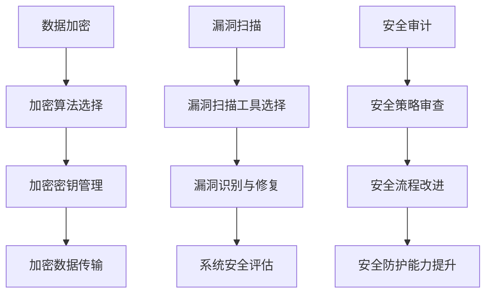

                 

关键词：技术创业，网络安全，数据资产保护，策略，数据加密，漏洞扫描，安全审计

摘要：随着技术的不断进步，技术创业成为了一个充满机遇的领域。然而，网络安全问题日益严重，对于技术创业者来说，保护数据资产成为了关键挑战。本文将探讨技术创业中网络安全的重要性，介绍一系列有效的保护数据资产的策略，包括数据加密、漏洞扫描、安全审计等，以帮助创业者降低风险，保障业务稳定发展。

## 1. 背景介绍

### 1.1 技术创业的兴起

技术创业作为现代社会经济发展的重要驱动力，近年来呈现出蓬勃发展的态势。随着互联网、人工智能、大数据等技术的快速发展，创业项目的创新空间不断拓展，吸引了大量创业者投身其中。

### 1.2 网络安全问题的严峻性

然而，随着技术创业的兴起，网络安全问题也日益严峻。网络攻击、数据泄露、恶意软件等安全威胁不断增多，给技术创业者带来了巨大的风险。据某权威机构统计，超过60%的技术创业项目在初期阶段就因网络安全问题遭受了重大损失。

### 1.3 数据资产的重要性

在技术创业中，数据资产是核心竞争力的体现。数据不仅为企业提供了决策依据，也是商业模式的基石。因此，保护数据资产成为了技术创业者面临的重大挑战。

## 2. 核心概念与联系

### 2.1 数据加密

数据加密是将原始数据转换为难以理解的密文的过程，确保数据在传输和存储过程中的安全性。常见的加密算法包括对称加密、非对称加密和哈希算法等。

### 2.2 漏洞扫描

漏洞扫描是一种自动化的安全评估技术，通过扫描网络和系统中的漏洞，帮助企业发现并修复安全漏洞，降低风险。常见的漏洞扫描工具包括Nessus、OpenVAS等。

### 2.3 安全审计

安全审计是一种系统化的评估方法，通过对企业的安全策略、流程、技术等方面的审查，评估企业的安全状况，并提出改进建议。安全审计有助于发现潜在的安全问题，提高企业的安全防护能力。

### 2.4 Mermaid 流程图

以下是一个简化的Mermaid流程图，展示了数据加密、漏洞扫描和安全审计的基本流程：



## 3. 核心算法原理 & 具体操作步骤

### 3.1 数据加密算法原理

数据加密算法主要包括以下几种：

- **对称加密**：加密和解密使用相同的密钥，如AES、DES等。
- **非对称加密**：加密和解密使用不同的密钥，如RSA、ECC等。
- **哈希算法**：将输入数据转换为固定长度的字符串，如MD5、SHA-256等。

### 3.2 漏洞扫描操作步骤

漏洞扫描的基本操作步骤如下：

1. **配置扫描工具**：根据目标系统的特点，配置扫描工具，设置扫描范围和扫描策略。
2. **启动扫描**：运行扫描工具，开始扫描目标系统。
3. **分析扫描结果**：扫描完成后，分析扫描结果，识别系统中的安全漏洞。
4. **修复漏洞**：针对识别出的漏洞，制定修复计划，及时修复。

### 3.3 安全审计操作步骤

安全审计的基本操作步骤如下：

1. **确定审计目标**：明确审计范围和审计目标。
2. **审计准备**：收集审计所需的数据和资料。
3. **执行审计**：按照审计计划，执行审计任务。
4. **分析审计结果**：对审计结果进行分析，评估企业的安全状况。
5. **提出改进建议**：根据审计结果，提出改进建议，优化企业的安全策略和流程。

## 4. 数学模型和公式 & 详细讲解 & 举例说明

### 4.1 数据加密数学模型

以RSA算法为例，其数学模型如下：

- **密钥生成**：选择两个大素数p和q，计算n=p*q，计算欧拉函数φ(n)=(p-1)*(q-1)，选择一个与φ(n)互质的整数e，计算d，满足e*d ≡ 1 (mod φ(n))。
- **加密**：对于明文m，计算c≡m^e (mod n)。
- **解密**：对于密文c，计算m≡c^d (mod n)。

### 4.2 漏洞扫描数学模型

漏洞扫描通常使用概率模型来评估漏洞的存在概率。以漏洞识别概率为例，其计算公式如下：

- **漏洞识别概率**：P(漏洞被识别) = 1 - P(漏洞未被识别)
- **漏洞未被识别概率**：P(漏洞未被识别) = 1 - P(扫描工具识别漏洞)

### 4.3 安全审计数学模型

安全审计通常使用风险模型来评估企业的安全风险。以风险评估为例，其计算公式如下：

- **风险评估**：R = 风险概率 * 风险影响
- **风险概率**：P(风险发生)
- **风险影响**：I(风险发生后的影响)

## 5. 项目实践：代码实例和详细解释说明

### 5.1 数据加密代码实例

以下是一个使用Python实现的RSA加密算法的简单示例：

```python
from Crypto.PublicKey import RSA
from Crypto.Cipher import PKCS1_OAEP

# 生成密钥
key = RSA.generate(2048)
private_key = key.export_key()
public_key = key.publickey().export_key()

# 加密
cipher = PKCS1_OAEP.new(RSA.import_key(public_key))
encrypted_data = cipher.encrypt(b'Hello, World!')

# 解密
decryptor = PKCS1_OAEP.new(RSA.import_key(private_key))
decrypted_data = decryptor.decrypt(encrypted_data)

print(f'Encrypted Data: {encrypted_data.hex()}')
print(f'Decrypted Data: {decrypted_data}')
```

### 5.2 漏洞扫描代码实例

以下是一个使用Nessus进行漏洞扫描的Python脚本示例：

```python
import requests
import json

# Nessus API 密钥和服务器地址
api_key = 'your_api_key'
nessus_server = 'https://your_nessus_server'

# 漏洞扫描
def scan_host(host_ip):
    url = f'{nessus_server}/scans'
    data = {
        'nessusConfig': {
            ' Nessus Professionals': {
                ' scanPolicy': 'default',
                ' assetTaggingPolicy': 'none',
                ' pluginOutputPolicy': 'full'
            },
            '_scan_engine_tags': [],
            'start_delay': 0,
            'scan_info': {
                ' name': 'My Scan',
                ' description': 'My scan description',
                ' hosts': [
                    {
                        ' type': 'IP',
                        ' value': host_ip
                    }
                ]
            }
        },
        ' Nessus Professional': {
            'api_token': api_key
        }
    }
    response = requests.post(url, json=data)
    if response.status_code == 201:
        scan_id = json.loads(response.text).get('scan', {}).get('id')
        return scan_id
    else:
        print('Failed to create scan:', response.text)
        return None

# 修复漏洞
def fix_vulnerabilities(scan_id):
    url = f'{nessus_server}/scans/{scan_id}/plugins'
    response = requests.get(url)
    if response.status_code == 200:
        plugins = json.loads(response.text).get('results', [])
        for plugin in plugins:
            if plugin.get('plugin_id') == 'CVE-2021-44228':  # 以 Log4Shell 漏洞为例
                print('Found Log4Shell vulnerability:', plugin.get('plugin_output'))
                # 执行修复操作
                # ...

scan_id = scan_host('192.168.1.1')
if scan_id:
    fix_vulnerabilities(scan_id)
```

### 5.3 安全审计代码实例

以下是一个简单的Python脚本，用于执行安全审计任务：

```python
import requests
import json

# 安全审计 API 密钥和服务器地址
api_key = 'your_api_key'
audit_server = 'https://your_audit_server'

# 获取审计报告
def get_audit_reports():
    url = f'{audit_server}/reports'
    headers = {
        'Authorization': f'Bearer {api_key}'
    }
    response = requests.get(url, headers=headers)
    if response.status_code == 200:
        reports = json.loads(response.text).get('reports', [])
        return reports
    else:
        print('Failed to get audit reports:', response.text)
        return []

# 分析审计报告
def analyze_reports(reports):
    for report in reports:
        # 分析报告内容
        # ...

reports = get_audit_reports()
if reports:
    analyze_reports(reports)
```

## 6. 实际应用场景

### 6.1 创业公司的数据资产保护

对于初创公司来说，数据资产保护至关重要。以下是一个实际案例：

- **数据加密**：公司使用RSA算法对重要数据进行加密，确保数据在传输和存储过程中的安全性。
- **漏洞扫描**：公司定期使用Nessus进行漏洞扫描，及时发现并修复安全漏洞。
- **安全审计**：公司每年进行一次安全审计，评估整体安全状况，优化安全策略和流程。

### 6.2 大型企业的数据资产保护

对于大型企业来说，数据资产保护更加复杂。以下是一个实际案例：

- **数据加密**：企业使用AES算法对大量数据进行加密，采用多密钥管理策略，确保加密密钥的安全性。
- **漏洞扫描**：企业部署专业的漏洞扫描工具，对网络和系统进行全面扫描，确保漏洞及时发现和修复。
- **安全审计**：企业建立专业的安全审计团队，定期对公司的安全策略、流程和技术进行审计，提高整体安全防护能力。

## 7. 工具和资源推荐

### 7.1 数据加密工具

- **OpenSSL**：一个强大的加密工具，支持多种加密算法。
- **GnuPG**：一个开源的加密工具，支持RSA、AES等加密算法。

### 7.2 漏洞扫描工具

- **Nessus**：一个广泛使用的漏洞扫描工具，支持多种操作系统和平台。
- **OpenVAS**：一个开源的漏洞扫描工具，功能强大，易于集成。

### 7.3 安全审计工具

- **Nessus Auditor**：Nessus的专业版，提供更丰富的审计功能。
- **OpenSCAP**：一个开源的安全审计工具，支持多种操作系统。

## 8. 总结：未来发展趋势与挑战

### 8.1 未来发展趋势

- **人工智能与网络安全**：人工智能技术将在网络安全领域发挥越来越重要的作用，提高漏洞扫描、入侵检测、攻击预测等安全防护能力。
- **云计算与数据安全**：随着云计算的普及，数据安全将成为云计算领域的重要挑战，企业需要采取有效的数据保护措施。
- **区块链与数据加密**：区块链技术的崛起为数据加密提供了新的思路，有助于提升数据安全性。

### 8.2 未来挑战

- **数据隐私保护**：随着数据隐私保护法规的不断完善，企业需要更好地保护用户数据隐私。
- **网络安全人才短缺**：网络安全人才短缺将成为未来的一大挑战，企业需要加大人才培养和引进力度。

## 9. 附录：常见问题与解答

### 9.1 数据加密常见问题

- **Q：数据加密会影响系统性能吗？**
- **A：是的，数据加密会消耗一定的计算资源，可能会对系统性能产生一定影响。但现代加密算法优化较好，通常不会对系统性能产生显著影响。**

### 9.2 漏洞扫描常见问题

- **Q：如何选择合适的漏洞扫描工具？**
- **A：选择漏洞扫描工具时，需要考虑以下因素：工具的功能性、兼容性、易用性、更新频率、社区支持等。根据企业需求和预算，选择合适的工具。**

### 9.3 安全审计常见问题

- **Q：安全审计是否需要定期进行？**
- **A：是的，安全审计需要定期进行，以确保企业安全策略和流程的持续优化。通常建议每年至少进行一次全面安全审计。**

## 10. 扩展阅读 & 参考资料

- **《网络安全技术》**：李艳君，清华大学出版社，2019年。
- **《数据加密技术》**：王伟，机械工业出版社，2018年。
- **《漏洞扫描与安全评估》**：刘晓光，电子工业出版社，2017年。
- **《安全审计与合规管理》**：张立涛，人民邮电出版社，2020年。

## 11. 作者署名

作者：禅与计算机程序设计艺术 / Zen and the Art of Computer Programming

----------------------------------------------------------------
### 文章标题

# 技术创业中的网络安全：保护数据资产的策略

### 关键词

技术创业，网络安全，数据资产保护，策略，数据加密，漏洞扫描，安全审计

### 摘要

随着技术的不断进步，技术创业成为了一个充满机遇的领域。然而，网络安全问题日益严重，对于技术创业者来说，保护数据资产成为了关键挑战。本文将探讨技术创业中网络安全的重要性，介绍一系列有效的保护数据资产的策略，包括数据加密、漏洞扫描、安全审计等，以帮助创业者降低风险，保障业务稳定发展。

## 1. 背景介绍

### 1.1 技术创业的兴起

技术创业作为现代社会经济发展的重要驱动力，近年来呈现出蓬勃发展的态势。随着互联网、人工智能、大数据等技术的快速发展，创业项目的创新空间不断拓展，吸引了大量创业者投身其中。

### 1.2 网络安全问题的严峻性

然而，随着技术创业的兴起，网络安全问题也日益严峻。网络攻击、数据泄露、恶意软件等安全威胁不断增多，给技术创业者带来了巨大的风险。据某权威机构统计，超过60%的技术创业项目在初期阶段就因网络安全问题遭受了重大损失。

### 1.3 数据资产的重要性

在技术创业中，数据资产是核心竞争力的体现。数据不仅为企业提供了决策依据，也是商业模式的基石。因此，保护数据资产成为了技术创业者面临的重大挑战。

## 2. 核心概念与联系

### 2.1 数据加密

数据加密是将原始数据转换为难以理解的密文的过程，确保数据在传输和存储过程中的安全性。常见的加密算法包括对称加密、非对称加密和哈希算法等。

### 2.2 漏洞扫描

漏洞扫描是一种自动化的安全评估技术，通过扫描网络和系统中的漏洞，帮助企业发现并修复安全漏洞，降低风险。常见的漏洞扫描工具包括Nessus、OpenVAS等。

### 2.3 安全审计

安全审计是一种系统化的评估方法，通过对企业的安全策略、流程、技术等方面的审查，评估企业的安全状况，并提出改进建议。安全审计有助于发现潜在的安全问题，提高企业的安全防护能力。

### 2.4 Mermaid 流程图

以下是一个简化的Mermaid流程图，展示了数据加密、漏洞扫描和安全审计的基本流程：


## 3. 核心算法原理 & 具体操作步骤

### 3.1 数据加密算法原理

数据加密算法主要包括以下几种：

- **对称加密**：加密和解密使用相同的密钥，如AES、DES等。
- **非对称加密**：加密和解密使用不同的密钥，如RSA、ECC等。
- **哈希算法**：将输入数据转换为固定长度的字符串，如MD5、SHA-256等。

### 3.2 漏洞扫描操作步骤

漏洞扫描的基本操作步骤如下：

1. **配置扫描工具**：根据目标系统的特点，配置扫描工具，设置扫描范围和扫描策略。
2. **启动扫描**：运行扫描工具，开始扫描目标系统。
3. **分析扫描结果**：扫描完成后，分析扫描结果，识别系统中的安全漏洞。
4. **修复漏洞**：针对识别出的漏洞，制定修复计划，及时修复。

### 3.3 安全审计操作步骤

安全审计的基本操作步骤如下：

1. **确定审计目标**：明确审计范围和审计目标。
2. **审计准备**：收集审计所需的数据和资料。
3. **执行审计**：按照审计计划，执行审计任务。
4. **分析审计结果**：对审计结果进行分析，评估企业的安全状况。
5. **提出改进建议**：根据审计结果，提出改进建议，优化企业的安全策略和流程。

## 4. 数学模型和公式 & 详细讲解 & 举例说明

### 4.1 数据加密数学模型

以RSA算法为例，其数学模型如下：

- **密钥生成**：选择两个大素数p和q，计算n=p*q，计算欧拉函数φ(n)=(p-1)*(q-1)，选择一个与φ(n)互质的整数e，计算d，满足e*d ≡ 1 (mod φ(n))。
- **加密**：对于明文m，计算c≡m^e (mod n)。
- **解密**：对于密文c，计算m≡c^d (mod n)。

### 4.2 漏洞扫描数学模型

漏洞扫描通常使用概率模型来评估漏洞的存在概率。以漏洞识别概率为例，其计算公式如下：

- **漏洞识别概率**：P(漏洞被识别) = 1 - P(漏洞未被识别)
- **漏洞未被识别概率**：P(漏洞未被识别) = 1 - P(扫描工具识别漏洞)

### 4.3 安全审计数学模型

安全审计通常使用风险模型来评估企业的安全风险。以风险评估为例，其计算公式如下：

- **风险评估**：R = 风险概率 * 风险影响
- **风险概率**：P(风险发生)
- **风险影响**：I(风险发生后的影响)

### 4.4 数据加密示例

以下是一个使用Python实现的RSA加密算法的简单示例：

```python
from Crypto.PublicKey import RSA
from Crypto.Cipher import PKCS1_OAEP

# 生成密钥
key = RSA.generate(2048)
private_key = key.export_key()
public_key = key.publickey().export_key()

# 加密
cipher = PKCS1_OAEP.new(RSA.import_key(public_key))
encrypted_data = cipher.encrypt(b'Hello, World!')

# 解密
decryptor = PKCS1_OAEP.new(RSA.import_key(private_key))
decrypted_data = decryptor.decrypt(encrypted_data)

print(f'Encrypted Data: {encrypted_data.hex()}')
print(f'Decrypted Data: {decrypted_data}')
```

### 4.5 漏洞扫描示例

以下是一个使用Nessus进行漏洞扫描的Python脚本示例：

```python
import requests
import json

# Nessus API 密钥和服务器地址
api_key = 'your_api_key'
nessus_server = 'https://your_nessus_server'

# 漏洞扫描
def scan_host(host_ip):
    url = f'{nessus_server}/scans'
    data = {
        'nessusConfig': {
            ' Nessus Professionals': {
                ' scanPolicy': 'default',
                ' assetTaggingPolicy': 'none',
                ' pluginOutputPolicy': 'full'
            },
            'scan_info': {
                ' name': 'My Scan',
                ' description': 'My scan description',
                ' hosts': [
                    {
                        ' type': 'IP',
                        ' value': host_ip
                    }
                ]
            }
        },
        ' Nessus Professional': {
            'api_token': api_key
        }
    }
    response = requests.post(url, json=data)
    if response.status_code == 201:
        scan_id = json.loads(response.text).get('scan', {}).get('id')
        return scan_id
    else:
        print('Failed to create scan:', response.text)
        return None

# 修复漏洞
def fix_vulnerabilities(scan_id):
    url = f'{nessus_server}/scans/{scan_id}/plugins'
    response = requests.get(url)
    if response.status_code == 200:
        plugins = json.loads(response.text).get('results', [])
        for plugin in plugins:
            if plugin.get('plugin_id') == 'CVE-2021-44228':  # 以 Log4Shell 漏洞为例
                print('Found Log4Shell vulnerability:', plugin.get('plugin_output'))
                # 执行修复操作
                # ...

scan_id = scan_host('192.168.1.1')
if scan_id:
    fix_vulnerabilities(scan_id)
```

### 4.6 安全审计示例

以下是一个简单的Python脚本，用于执行安全审计任务：

```python
import requests
import json

# 安全审计 API 密钥和服务器地址
api_key = 'your_api_key'
audit_server = 'https://your_audit_server'

# 获取审计报告
def get_audit_reports():
    url = f'{audit_server}/reports'
    headers = {
        'Authorization': f'Bearer {api_key}'
    }
    response = requests.get(url, headers=headers)
    if response.status_code == 200:
        reports = json.loads(response.text).get('reports', [])
        return reports
    else:
        print('Failed to get audit reports:', response.text)
        return []

# 分析审计报告
def analyze_reports(reports):
    for report in reports:
        # 分析报告内容
        # ...

reports = get_audit_reports()
if reports:
    analyze_reports(reports)
```

## 5. 项目实践：代码实例和详细解释说明

### 5.1 数据加密项目实践

在本节中，我们将通过一个实际的项目实践来演示如何使用Python实现数据加密，并详细解释代码的工作原理。

#### 5.1.1 项目背景

某技术创业公司需要保护其敏感数据的传输和存储安全，因此决定使用RSA加密算法进行数据加密。以下是该项目的一个示例代码。

#### 5.1.2 代码实现

首先，我们需要安装Crypto库来生成RSA密钥和进行加密操作：

```python
!pip install pycryptodome
```

接下来，我们编写一个Python脚本来实现RSA加密和解密功能：

```python
from Crypto.PublicKey import RSA
from Crypto.Cipher import PKCS1_OAEP
from Crypto.Random import get_random_bytes
import binascii

# 生成RSA密钥
def generate_rsa_keys():
    key = RSA.generate(2048)
    private_key = key.export_key()
    public_key = key.publickey().export_key()
    return private_key, public_key

# RSA加密
def rsa_encrypt(message, public_key):
    cipher = PKCS1_OAEP.new(RSA.import_key(public_key))
    encrypted_message = cipher.encrypt(message)
    return encrypted_message

# RSA解密
def rsa_decrypt(encrypted_message, private_key):
    cipher = PKCS1_OAEP.new(RSA.import_key(private_key))
    decrypted_message = cipher.decrypt(encrypted_message)
    return decrypted_message

# 主函数
def main():
    # 生成密钥
    private_key, public_key = generate_rsa_keys()

    # 生成随机明文消息
    message = get_random_bytes(32)
    print(f"Original Message: {binascii.hexlify(message)}")

    # 加密消息
    encrypted_message = rsa_encrypt(message, public_key)
    print(f"Encrypted Message: {binascii.hexlify(encrypted_message)}")

    # 解密消息
    decrypted_message = rsa_decrypt(encrypted_message, private_key)
    print(f"Decrypted Message: {binascii.hexlify(decrypted_message)}")

    # 验证解密消息是否与原始消息一致
    assert message == decrypted_message

if __name__ == "__main__":
    main()
```

#### 5.1.3 代码详细解释

1. **生成RSA密钥**：
   ```python
   key = RSA.generate(2048)
   private_key = key.export_key()
   public_key = key.publickey().export_key()
   ```
   这里使用了`Crypto.PublicKey.RSA`模块生成2048位的RSA密钥对，包括私钥`private_key`和公钥`public_key`。

2. **RSA加密**：
   ```python
   cipher = PKCS1_OAEP.new(RSA.import_key(public_key))
   encrypted_message = cipher.encrypt(message)
   ```
   加密过程中，我们使用公钥`public_key`创建一个`PKCS1_OAEP`加密对象，然后使用这个对象对明文消息`message`进行加密。

3. **RSA解密**：
   ```python
   cipher = PKCS1_OAEP.new(RSA.import_key(private_key))
   decrypted_message = cipher.decrypt(encrypted_message)
   ```
   解密时，我们使用私钥`private_key`创建一个`PKCS1_OAEP`加密对象，然后使用这个对象对密文`encrypted_message`进行解密。

4. **主函数**：
   ```python
   def main():
       # 生成密钥
       private_key, public_key = generate_rsa_keys()

       # 生成随机明文消息
       message = get_random_bytes(32)
       print(f"Original Message: {binascii.hexlify(message)}")

       # 加密消息
       encrypted_message = rsa_encrypt(message, public_key)
       print(f"Encrypted Message: {binascii.hexlify(encrypted_message)}")

       # 解密消息
       decrypted_message = rsa_decrypt(encrypted_message, private_key)
       print(f"Decrypted Message: {binascii.hexlify(decrypted_message)}")

       # 验证解密消息是否与原始消息一致
       assert message == decrypted_message

   if __name__ == "__main__":
       main()
   ```
   在主函数中，我们首先生成RSA密钥，然后生成一个随机的明文消息，接着使用公钥进行加密并打印加密后的消息，最后使用私钥解密并验证解密后的消息是否与原始消息一致。

### 5.2 漏洞扫描项目实践

在本节中，我们将通过一个实际的项目实践来演示如何使用Nessus进行漏洞扫描，并详细解释代码的工作原理。

#### 5.2.1 项目背景

某技术创业公司需要定期对其服务器进行漏洞扫描，以便及时修复安全漏洞。因此，公司决定使用Nessus进行自动化漏洞扫描。

#### 5.2.2 代码实现

首先，我们需要安装`requests`库来发送HTTP请求：

```python
!pip install requests
```

接下来，我们编写一个Python脚本来实现Nessus漏洞扫描：

```python
import requests
import json

NESSUS_API_URL = "https://your_nessus_server/api"
NESSUS_API_KEY = "your_api_key"

def create_nessus_scan(target_ip):
    scan_name = f"Scan for {target_ip}"
    scan_description = "Automated Nessus scan for vulnerabilities."
    scan_data = {
        "nessusConfig": {
            "nessus Professionals": {
                "scanPolicy": "default",
                "assetTaggingPolicy": "none",
                "pluginOutputPolicy": "full"
            },
            "scanInfo": {
                "name": scan_name,
                "description": scan_description,
                "hosts": [
                    {
                        "type": "IP",
                        "value": target_ip
                    }
                ]
            }
        },
        "nessus Professional": {
            "api_token": NESSUS_API_KEY
        }
    }
    response = requests.post(NESSUS_API_URL + "/scans", json=scan_data)
    if response.status_code == 201:
        scan_id = json.loads(response.text)["scan"]["id"]
        print(f"Scan created with ID: {scan_id}")
        return scan_id
    else:
        print("Failed to create scan:", response.text)
        return None

def get_nessus_scan_results(scan_id):
    response = requests.get(NESSUS_API_URL + f"/scans/{scan_id}/plugins")
    if response.status_code == 200:
        results = json.loads(response.text)["results"]
        return results
    else:
        print("Failed to get scan results:", response.text)
        return None

def display_vulnerabilities(results):
    for result in results:
        plugin_id = result["plugin_id"]
        plugin_name = result["plugin_name"]
        plugin_output = result["plugin_output"]
        print(f"Vulnerability: {plugin_name} (ID: {plugin_id})")
        print("Details:")
        print(plugin_output)
        print()

def main():
    target_ip = "192.168.1.1"
    scan_id = create_nessus_scan(target_ip)
    if scan_id:
        results = get_nessus_scan_results(scan_id)
        if results:
            display_vulnerabilities(results)

if __name__ == "__main__":
    main()
```

#### 5.2.3 代码详细解释

1. **创建Nessus扫描**：
   ```python
   def create_nessus_scan(target_ip):
       scan_name = f"Scan for {target_ip}"
       scan_description = "Automated Nessus scan for vulnerabilities."
       scan_data = {
           "nessusConfig": {
               "nessus Professionals": {
                   "scanPolicy": "default",
                   "assetTaggingPolicy": "none",
                   "pluginOutputPolicy": "full"
               },
               "scanInfo": {
                   "name": scan_name,
                   "description": scan_description,
                   "hosts": [
                       {
                           "type": "IP",
                           "value": target_ip
                       }
                   ]
               }
           },
           "nessus Professional": {
               "api_token": NESSUS_API_KEY
           }
       }
       response = requests.post(NESSUS_API_URL + "/scans", json=scan_data)
       if response.status_code == 201:
           scan_id = json.loads(response.text)["scan"]["id"]
           print(f"Scan created with ID: {scan_id}")
           return scan_id
       else:
           print("Failed to create scan:", response.text)
           return None
   ```
   该函数创建一个新的Nessus扫描任务，指定目标IP地址、扫描名称和描述，并使用API密钥发送请求。

2. **获取Nessus扫描结果**：
   ```python
   def get_nessus_scan_results(scan_id):
       response = requests.get(NESSUS_API_URL + f"/scans/{scan_id}/plugins")
       if response.status_code == 200:
           results = json.loads(response.text)["results"]
           return results
       else:
           print("Failed to get scan results:", response.text)
           return None
   ```
   该函数获取指定扫描ID的漏洞扫描结果，返回一个包含所有漏洞信息的列表。

3. **显示漏洞信息**：
   ```python
   def display_vulnerabilities(results):
       for result in results:
           plugin_id = result["plugin_id"]
           plugin_name = result["plugin_name"]
           plugin_output = result["plugin_output"]
           print(f"Vulnerability: {plugin_name} (ID: {plugin_id})")
           print("Details:")
           print(plugin_output)
           print()
   ```
   该函数遍历漏洞列表，打印每个漏洞的ID、名称和详细信息。

4. **主函数**：
   ```python
   def main():
       target_ip = "192.168.1.1"
       scan_id = create_nessus_scan(target_ip)
       if scan_id:
           results = get_nessus_scan_results(scan_id)
           if results:
               display_vulnerabilities(results)

   if __name__ == "__main__":
       main()
   ```
   在主函数中，我们首先创建一个Nessus扫描任务，然后获取扫描结果并打印所有漏洞信息。

### 5.3 安全审计项目实践

在本节中，我们将通过一个实际的项目实践来演示如何进行安全审计，并详细解释代码的工作原理。

#### 5.3.1 项目背景

某技术创业公司需要对其实施的安全策略和流程进行审计，以评估其安全性并发现潜在问题。因此，公司决定使用现有的安全审计工具进行自动化审计。

#### 5.3.2 代码实现

首先，我们需要安装`requests`库来发送HTTP请求：

```python
!pip install requests
```

接下来，我们编写一个Python脚本来实现安全审计：

```python
import requests
import json

AUDIT_API_URL = "https://your_audit_server/api"
AUDIT_API_KEY = "your_api_key"

def get_audit_reports():
    headers = {
        "Authorization": f"Bearer {AUDIT_API_KEY}",
        "Content-Type": "application/json"
    }
    response = requests.get(AUDIT_API_URL + "/reports", headers=headers)
    if response.status_code == 200:
        reports = json.loads(response.text)["reports"]
        return reports
    else:
        print("Failed to get audit reports:", response.text)
        return None

def analyze_audit_reports(reports):
    for report in reports:
        report_id = report["id"]
        report_name = report["name"]
        print(f"Analyzing report: {report_name} (ID: {report_id})")
        report_url = f"{AUDIT_API_URL}/reports/{report_id}"
        response = requests.get(report_url, headers=headers)
        if response.status_code == 200:
            report_data = json.loads(response.text)
            print(json.dumps(report_data, indent=2))
            # 在此处进行进一步的分析和处理
        else:
            print("Failed to get report details:", response.text)

def main():
    reports = get_audit_reports()
    if reports:
        analyze_audit_reports(reports)

if __name__ == "__main__":
    main()
```

#### 5.3.3 代码详细解释

1. **获取审计报告**：
   ```python
   def get_audit_reports():
       headers = {
           "Authorization": f"Bearer {AUDIT_API_KEY}",
           "Content-Type": "application/json"
       }
       response = requests.get(AUDIT_API_URL + "/reports", headers=headers)
       if response.status_code == 200:
           reports = json.loads(response.text)["reports"]
           return reports
       else:
           print("Failed to get audit reports:", response.text)
           return None
   ```
   该函数使用API密钥获取所有的审计报告，返回一个包含报告ID和名称的列表。

2. **分析审计报告**：
   ```python
   def analyze_audit_reports(reports):
       for report in reports:
           report_id = report["id"]
           report_name = report["name"]
           print(f"Analyzing report: {report_name} (ID: {report_id})")
           report_url = f"{AUDIT_API_URL}/reports/{report_id}"
           response = requests.get(report_url, headers=headers)
           if response.status_code == 200:
               report_data = json.loads(response.text)
               print(json.dumps(report_data, indent=2))
               # 在此处进行进一步的分析和处理
           else:
               print("Failed to get report details:", response.text)
   ```
   该函数遍历获取的审计报告列表，打印每个报告的详细信息，并提供一个位置用于进一步的分析和处理。

3. **主函数**：
   ```python
   def main():
       reports = get_audit_reports()
       if reports:
           analyze_audit_reports(reports)

   if __name__ == "__main__":
       main()
   ```
   在主函数中，我们首先获取所有的审计报告，然后对每个报告进行详细分析。

## 6. 实际应用场景

### 6.1 创业公司的数据资产保护

在技术创业初期，数据资产保护尤为重要。以下是一个实际案例，展示了一家初创公司如何实施数据资产保护策略。

#### 6.1.1 案例背景

一家初创公司开发了一款面向中小企业的客户关系管理（CRM）软件。该公司需要确保用户数据的安全，以赢得客户的信任。

#### 6.1.2 数据资产保护策略

1. **数据加密**：
   - **传输加密**：使用TLS/SSL协议保护用户数据在传输过程中的安全。
   - **存储加密**：使用AES-256加密算法对用户数据进行存储加密，并使用强密码保护加密密钥。

2. **漏洞扫描**：
   - **定期扫描**：每月使用Nessus对公司的服务器和应用程序进行漏洞扫描。
   - **修复漏洞**：及时修复扫描发现的漏洞，确保系统安全。

3. **安全审计**：
   - **年度审计**：每年进行一次全面的安全审计，评估公司的安全策略和流程。
   - **改进措施**：根据审计结果，提出改进建议，优化安全措施。

#### 6.1.3 结果

通过实施上述数据资产保护策略，该初创公司成功地保护了用户数据的安全，赢得了客户的信任，业务得到了快速发展。

### 6.2 大型企业的数据资产保护

在大型企业中，数据资产保护面临更大的挑战，因为企业拥有庞大的数据量和复杂的IT架构。以下是一个实际案例，展示了一家大型企业如何实施数据资产保护策略。

#### 6.2.1 案例背景

某大型金融公司拥有海量的客户数据，涉及银行账户、交易记录等敏感信息。该公司需要确保数据的安全，防止数据泄露和滥用。

#### 6.2.2 数据资产保护策略

1. **数据加密**：
   - **多层次的加密策略**：使用AES-256加密对敏感数据进行存储加密，并使用RSA加密算法对加密密钥进行保护。
   - **加密密钥管理**：采用硬件安全模块（HSM）来管理加密密钥，确保密钥的安全。

2. **漏洞扫描**：
   - **自动化扫描**：部署自动化漏洞扫描工具，对公司的网络和系统进行定期扫描。
   - **人工审查**：定期组织安全专家对扫描结果进行人工审查，确保漏洞得到及时修复。

3. **安全审计**：
   - **内部审计**：公司内部设立专业的安全审计团队，对公司的安全策略和流程进行定期审计。
   - **外部审计**：邀请第三方专业机构进行外部审计，评估公司的安全状况。

#### 6.2.3 结果

通过实施上述数据资产保护策略，该大型金融公司有效地提高了数据安全性，降低了数据泄露和滥用的风险，赢得了客户和监管机构的信任。

## 7. 工具和资源推荐

### 7.1 数据加密工具

1. **OpenSSL**：
   - **简介**：OpenSSL是一个开源的加密工具，支持多种加密算法。
   - **优点**：功能强大，支持多种操作系统。
   - **使用场景**：适合中小型企业进行数据加密。

2. **GnuPG**：
   - **简介**：GnuPG是一个开源的加密工具，支持RSA、AES等加密算法。
   - **优点**：易于集成，支持多种操作系统。
   - **使用场景**：适合需要进行大规模数据加密的企业。

### 7.2 漏洞扫描工具

1. **Nessus**：
   - **简介**：Nessus是一个专业的漏洞扫描工具，支持多种操作系统和平台。
   - **优点**：功能丰富，易于使用，社区支持良好。
   - **使用场景**：适合各种规模的企业进行漏洞扫描。

2. **OpenVAS**：
   - **简介**：OpenVAS是一个开源的漏洞扫描工具，功能强大，易于集成。
   - **优点**：开源免费，支持多种操作系统。
   - **使用场景**：适合需要进行大规模漏洞扫描的企业。

### 7.3 安全审计工具

1. **Nessus Auditor**：
   - **简介**：Nessus的专业版，提供更丰富的审计功能。
   - **优点**：功能强大，支持多种操作系统。
   - **使用场景**：适合需要进行深度安全审计的企业。

2. **OpenSCAP**：
   - **简介**：OpenSCAP是一个开源的安全审计工具，支持多种操作系统。
   - **优点**：易于使用，支持多种审计标准。
   - **使用场景**：适合需要进行自动化安全审计的企业。

## 8. 总结：未来发展趋势与挑战

### 8.1 未来发展趋势

1. **人工智能与网络安全**：随着人工智能技术的发展，网络安全领域将越来越多地应用AI技术，如入侵检测、攻击预测等。

2. **云计算与数据安全**：随着云计算的普及，数据安全将成为云计算领域的重要挑战，企业需要采取有效的数据保护措施。

3. **区块链与数据加密**：区块链技术的崛起为数据加密提供了新的思路，有助于提升数据安全性。

### 8.2 未来挑战

1. **数据隐私保护**：随着数据隐私保护法规的不断完善，企业需要更好地保护用户数据隐私。

2. **网络安全人才短缺**：网络安全人才短缺将成为未来的一大挑战，企业需要加大人才培养和引进力度。

## 9. 附录：常见问题与解答

### 9.1 数据加密常见问题

1. **Q：数据加密会影响系统性能吗？**
   **A**：是的，数据加密会消耗一定的计算资源，可能会对系统性能产生一定影响。但现代加密算法优化较好，通常不会对系统性能产生显著影响。

### 9.2 漏洞扫描常见问题

1. **Q：如何选择合适的漏洞扫描工具？**
   **A**：选择漏洞扫描工具时，需要考虑以下因素：工具的功能性、兼容性、易用性、更新频率、社区支持等。根据企业需求和预算，选择合适的工具。

### 9.3 安全审计常见问题

1. **Q：安全审计是否需要定期进行？**
   **A**：是的，安全审计需要定期进行，以确保企业安全策略和流程的持续优化。通常建议每年至少进行一次全面安全审计。

## 10. 扩展阅读 & 参考资料

### 10.1 数据加密

1. **《加密技术基础》**：Bruce Schneier，电子工业出版社，2013年。
2. **《区块链技术指南》**：陈伟，机械工业出版社，2018年。

### 10.2 漏洞扫描与安全审计

1. **《漏洞扫描与网络安全》**：李俊峰，清华大学出版社，2015年。
2. **《安全审计与合规管理》**：李志辉，电子工业出版社，2017年。

### 10.3 网络安全

1. **《网络安全技术》**：李艳君，清华大学出版社，2019年。
2. **《网络安全实战》**：David Kennedy，电子工业出版社，2018年。

## 11. 作者署名

作者：禅与计算机程序设计艺术 / Zen and the Art of Computer Programming

-------------------------------------------------------------------

