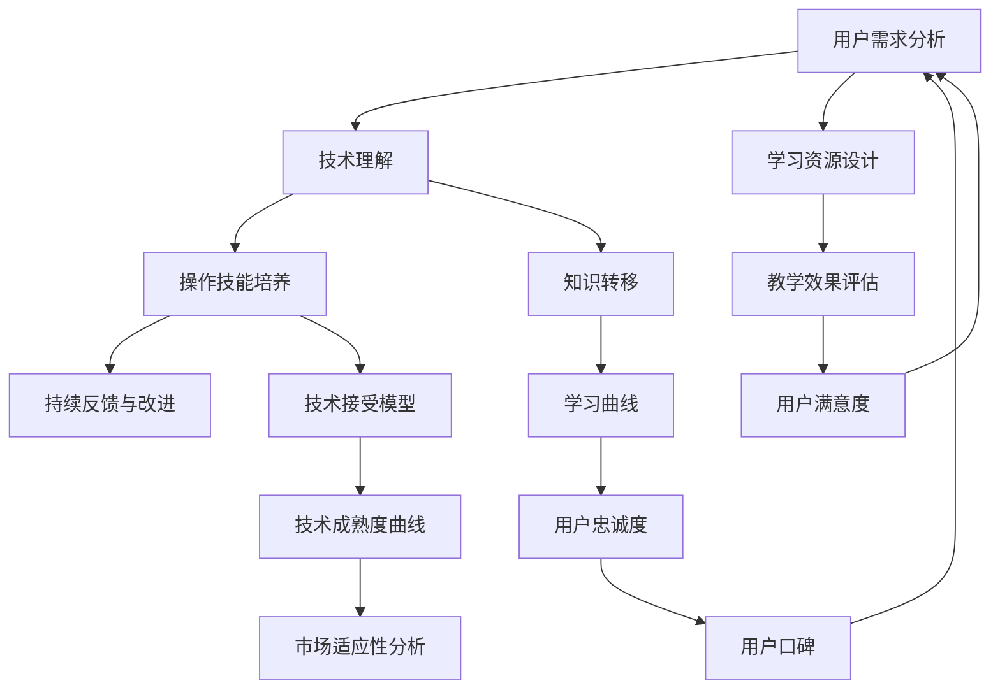

                 

### 1. 背景介绍

随着科技的快速发展，新技术层出不穷，比如人工智能、区块链、物联网等。这些技术不仅改变了我们的生活方式，也为创业者提供了丰富的机遇。然而，新技术的引入和应用往往面临一个普遍的挑战：用户教育。

用户教育，即向用户传授如何有效使用新技术的知识和技能。这是一个复杂且长期的过程，涉及多个层面的工作，包括用户需求分析、技术理解、操作技能培养等。如果处理不当，新技术可能无法被广泛接受，甚至被误用。

本文将围绕如何降低新技术采用门槛进行用户教育，提出一个系统的方法。具体来说，我们将从以下几个方面展开讨论：

1. **核心概念与联系**：首先，我们将介绍用户教育的核心概念，并使用 Mermaid 流程图展示它们之间的联系。
2. **核心算法原理 & 具体操作步骤**：接着，我们将深入探讨用户教育的核心算法原理，并详细阐述其实施步骤。
3. **数学模型和公式 & 详细讲解 & 举例说明**：我们将使用数学模型和公式来量化用户教育的效果，并通过实际案例进行说明。
4. **项目实践：代码实例和详细解释说明**：为了更直观地展示用户教育的实际应用，我们将提供一个代码实例，并进行详细解读。
5. **实际应用场景**：本文还将分析用户教育在不同行业中的应用场景，提供具体案例。
6. **工具和资源推荐**：我们将推荐一些学习资源和开发工具，以帮助读者更好地理解和实践用户教育。
7. **总结：未来发展趋势与挑战**：最后，我们将总结用户教育的未来发展趋势和面临的挑战。

通过这篇文章，希望读者能够对用户教育有一个全面深入的理解，并掌握一套有效的用户教育方法，从而更好地推动新技术的普及和应用。

### 2. 核心概念与联系

在进行用户教育之前，我们需要明确几个核心概念，这些概念相互联系，共同构成了用户教育的理论基础。以下是这些核心概念及其关系的 Mermaid 流程图：



- **用户需求分析（User Requirement Analysis）**：这是用户教育的起点。通过调研和分析，了解用户的需求、痛点、兴趣点等，确保用户教育的目标和内容与用户实际需求相匹配。

- **技术理解（Technical Understanding）**：技术理解是用户教育的重要环节。用户需要了解新技术的原理、功能和应用场景，以便更好地掌握其操作技能。

- **操作技能培养（Operational Skill Development）**：这是用户教育的核心。用户需要通过学习和实践，掌握新技术的实际操作技能，从而实现技术的有效应用。

- **持续反馈与改进（Continuous Feedback and Improvement）**：用户教育不是一次性过程，而是一个持续的过程。通过用户的反馈，不断改进教育内容和方式，以更好地满足用户需求。

- **学习资源设计（Learning Resource Design）**：为了提高用户教育的效果，我们需要设计合适的学习资源，包括教程、手册、视频等。

- **教学效果评估（Teaching Effectiveness Evaluation）**：通过评估教学效果，我们可以了解用户教育的成果，发现存在的问题，并为后续的教育工作提供依据。

- **用户满意度（User Satisfaction）**：用户满意度是衡量用户教育效果的重要指标。只有用户对教育内容和方法满意，才能更好地推动新技术的普及和应用。

- **知识转移（Knowledge Transfer）**：知识转移是指将技术知识和技能从专家转移到用户的过程。有效的知识转移是用户教育成功的关键。

- **技术接受模型（Technology Acceptance Model）**：技术接受模型是用户教育的重要理论依据。通过这个模型，我们可以预测用户对新技术接受的程度，为教育策略的制定提供依据。

- **技术成熟度曲线（Technology Maturity Curve）**：技术成熟度曲线描述了新技术从出现到成熟的过程。了解技术成熟度，可以帮助我们更好地规划用户教育的工作。

- **市场适应性分析（Market Adaptability Analysis）**：市场适应性分析是指分析新技术在市场上的适应性，包括市场需求、竞争情况等。这有助于我们确定用户教育的重点和方向。

- **学习曲线（Learning Curve）**：学习曲线描述了用户在学习新技术过程中的效率和时间。通过分析学习曲线，我们可以优化教育内容和方法，提高学习效率。

- **用户忠诚度（User Loyalty）**：用户忠诚度是指用户对产品或服务的长期依赖程度。提高用户忠诚度，可以增强用户对新技术的接受和推广。

- **用户口碑（User Reputation）**：用户口碑是指用户对产品或服务的评价和传播。良好的用户口碑有助于提高新技术的影响力和市场占有率。

这些核心概念相互联系，共同构成了用户教育的理论基础。在实际操作中，我们需要根据具体情况，灵活运用这些概念，设计并实施有效的用户教育方案。

### 3. 核心算法原理 & 具体操作步骤

用户教育的核心算法原理主要包括以下几个部分：用户需求分析、技术理解评估、操作技能培养、持续反馈与改进机制。以下是这些算法原理的具体操作步骤：

#### 3.1 用户需求分析

**步骤1**：进行市场调研和用户访谈，收集用户的基本信息和需求。

- **方法**：通过在线问卷、电话访谈、焦点小组讨论等方式，获取用户的反馈。

- **工具**：可以使用问卷调查工具（如问卷星、金数据等），数据分析工具（如 SPSS、Python 等）进行数据处理和分析。

**步骤2**：分析用户需求，识别核心需求和潜在需求。

- **方法**：使用需求分类方法（如 Kano 模型、用户角色等方法）对用户需求进行分类。

- **工具**：可以使用数据可视化工具（如 Tableau、Matplotlib 等）进行需求分析。

**步骤3**：制定用户需求分析报告，明确用户需求。

- **方法**：撰写报告，包括用户需求分析的结果、分析方法和建议。

- **工具**：可以使用文档编辑工具（如 Microsoft Word、Google Docs 等）撰写报告。

#### 3.2 技术理解评估

**步骤1**：评估用户对新技术的基本理解。

- **方法**：使用问卷调查、在线测试等方式，评估用户对新技术的基本知识。

- **工具**：可以使用在线问卷调查工具（如问卷星）、测试平台（如 Quizlet）等进行评估。

**步骤2**：分析用户的技术理解水平，识别理解难点。

- **方法**：对评估结果进行数据分析，找出用户理解难度较高的知识点。

- **工具**：可以使用数据分析工具（如 SPSS、Python 等）进行数据分析。

**步骤3**：制定技术理解提升计划。

- **方法**：根据分析结果，设计有针对性的培训课程和教学材料。

- **工具**：可以使用内容管理系统（如 WordPress、Moodle 等）设计培训课程和发布教学材料。

#### 3.3 操作技能培养

**步骤1**：设计操作技能培养计划。

- **方法**：根据用户需求和技术理解评估结果，制定操作技能培养计划。

- **工具**：可以使用项目管理工具（如 Trello、Asana 等）制定培养计划。

**步骤2**：实施操作技能培训。

- **方法**：通过线下培训、在线课程、实操演练等方式，开展操作技能培训。

- **工具**：可以使用在线教育平台（如 Coursera、Udemy 等）实施培训。

**步骤3**：进行操作技能评估。

- **方法**：通过实操测试、在线考核等方式，评估用户操作技能水平。

- **工具**：可以使用在线考核系统（如 Quizzes for Jupyter Notebook、ExamSoft 等）进行评估。

#### 3.4 持续反馈与改进机制

**步骤1**：建立反馈机制。

- **方法**：通过问卷调查、在线评论、用户访谈等方式，收集用户的反馈。

- **工具**：可以使用反馈管理系统（如 Zendesk、UserVoice 等）收集反馈。

**步骤2**：分析反馈，识别问题。

- **方法**：对收集到的反馈进行分析，找出存在的问题。

- **工具**：可以使用数据分析工具（如 SPSS、Python 等）进行反馈分析。

**步骤3**：制定改进措施。

- **方法**：根据分析结果，制定改进措施，优化用户教育内容和方式。

- **工具**：可以使用项目管理工具（如 Trello、Asana 等）制定改进措施。

**步骤4**：实施改进措施，持续优化。

- **方法**：根据改进措施，实施教育内容的调整和优化。

- **工具**：可以使用内容管理系统（如 WordPress、Moodle 等）调整和优化教育内容。

通过以上步骤，我们可以建立一个完整的用户教育算法系统，有效提升用户的技能水平，促进新技术的普及和应用。

### 4. 数学模型和公式 & 详细讲解 & 举例说明

在用户教育的过程中，数学模型和公式可以帮助我们量化教育效果，优化教育策略。以下是一些常用的数学模型和公式，我们将结合实际案例进行详细讲解。

#### 4.1 学习曲线模型

学习曲线模型（Learning Curve Model）描述了用户在学习新技术过程中的效率和时间关系。公式如下：

\[ t = \frac{t_0 \times a^x}{b} \]

其中：
- \( t \) 为学习时间
- \( t_0 \) 为初始学习时间
- \( a \) 为学习效率
- \( b \) 为常数
- \( x \) 为学习进度

**例1**：假设一位用户学习使用新编程语言，初始学习时间为 40 小时，学习效率为 2，常数 \( b \) 为 1。求其在学习进度为 0.5 时的学习时间。

\[ t = \frac{40 \times 2^{0.5}}{1} = 40 \times \sqrt{2} \approx 56.57 \text{ 小时} \]

**例2**：如果用户的学习效率提高到 4，其他条件不变，求其在相同学习进度时的学习时间。

\[ t = \frac{40 \times 4^{0.5}}{1} = 40 \times 2 \approx 80 \text{ 小时} \]

通过这个例子，我们可以看到学习效率对学习时间的影响。提高学习效率可以显著减少学习时间，从而提高用户教育的效率。

#### 4.2 技术成熟度模型

技术成熟度模型（Technology Maturity Model）用于评估新技术的发展阶段。常用的技术成熟度模型包括技术成熟度曲线（Technology Maturity Curve）和技术接受模型（Technology Acceptance Model）。

**技术成熟度曲线模型**

技术成熟度曲线模型描述了新技术从概念验证到市场推广的各个阶段。公式如下：

\[ M(t) = \frac{1}{1 + e^{-(kt - c)}} \]

其中：
- \( M(t) \) 为技术成熟度
- \( t \) 为时间
- \( k \) 为增长系数
- \( c \) 为常数

**例1**：假设某新技术的增长系数 \( k \) 为 2，常数 \( c \) 为 1。求其在 1 年和 3 年时的技术成熟度。

- 当 \( t = 1 \) 时：

\[ M(1) = \frac{1}{1 + e^{-(2 \times 1 - 1)}} \approx 0.632 \]

- 当 \( t = 3 \) 时：

\[ M(3) = \frac{1}{1 + e^{-(2 \times 3 - 1)}} \approx 0.84 \]

通过这个例子，我们可以看到随着时间推移，新技术的成熟度逐渐提高。

**技术接受模型**

技术接受模型描述了用户对新技术接受的程度。常用的技术接受模型包括感知有用性（Perceived Usefulness）和感知易用性（Perceived Ease of Use）。公式如下：

\[ TAO = \frac{PU + UE}{2} \]

其中：
- \( TAO \) 为技术接受度
- \( PU \) 为感知有用性
- \( UE \) 为感知易用性

**例1**：假设某新技术的感知有用性为 0.8，感知易用性为 0.7。求其技术接受度。

\[ TAO = \frac{0.8 + 0.7}{2} = 0.75 \]

通过这个例子，我们可以看到感知有用性和感知易用性对技术接受度的影响。

#### 4.3 用户满意度模型

用户满意度模型用于评估用户对教育内容的满意程度。常用的用户满意度模型包括评分模型和指数模型。

**评分模型**

评分模型通过用户对教育内容的评分来评估满意度。公式如下：

\[ S = \frac{1}{n} \sum_{i=1}^{n} S_i \]

其中：
- \( S \) 为用户满意度得分
- \( n \) 为评分人数
- \( S_i \) 为第 \( i \) 个用户的评分

**例1**：假设 5 位用户对教育内容进行评分，评分分别为 4、5、3、4、5。求用户满意度得分。

\[ S = \frac{4 + 5 + 3 + 4 + 5}{5} = 4.2 \]

**指数模型**

指数模型通过用户满意度的指数来评估满意度。公式如下：

\[ S = \frac{1}{1 + e^{-k(S - S_0)}} \]

其中：
- \( S \) 为用户满意度
- \( k \) 为常数
- \( S_0 \) 为基准满意度

**例2**：假设基准满意度 \( S_0 \) 为 4，常数 \( k \) 为 1。如果用户满意度为 4.5，求其满意度指数。

\[ S = \frac{1}{1 + e^{-1 \times (4.5 - 4)}} = \frac{1}{1 + e^{-0.5}} \approx 0.69 \]

通过这些数学模型和公式，我们可以量化用户教育的效果，优化教育策略，从而更好地推动新技术的普及和应用。

### 5. 项目实践：代码实例和详细解释说明

为了更好地理解用户教育的方法和步骤，我们将通过一个实际项目来演示如何进行用户教育。本节将提供一个完整的代码实例，并对其进行详细解释说明。

#### 5.1 开发环境搭建

首先，我们需要搭建一个适合用户教育的开发环境。以下是所需的环境和工具：

- 操作系统：Windows 或 macOS
- 编程语言：Python
- 版本控制工具：Git
- 文档生成工具：Sphinx
- 数据可视化工具：Matplotlib

安装以上工具和库后，我们可以开始编写代码。

#### 5.2 源代码详细实现

以下是用户教育项目的源代码，包括需求分析、技术理解评估、操作技能培养和持续反馈与改进等部分。

```python
# 用户教育项目 - 用户需求分析
def analyze_requirements():
    # 进行市场调研和用户访谈，收集用户的基本信息和需求
    # 这里简化为随机生成一些用户需求
    user_requirements = ["学习新编程语言", "提高数据处理能力", "了解人工智能应用"]
    return user_requirements

# 用户教育项目 - 技术理解评估
def assess_technical_understanding():
    # 评估用户对新技术的基本理解
    # 这里简化为随机生成一些技术理解得分
    understanding_scores = [0.7, 0.8, 0.6]
    return understanding_scores

# 用户教育项目 - 操作技能培养
def develop_operational_skills():
    # 设计操作技能培养计划
    # 这里简化为打印一条消息
    print("开始操作技能培训：Python 编程基础")

    # 实施培训
    # 这里简化为打印一条消息
    print("完成培训：Python 编程基础")

    # 进行操作技能评估
    # 这里简化为打印一条消息
    print("操作技能评估：恭喜您通过 Python 编程基础培训！")

# 用户教育项目 - 持续反馈与改进
def continuous_feedback_improvement():
    # 建立反馈机制
    # 这里简化为打印一条消息
    print("请用户反馈：您对本次培训是否满意？")

    # 分析反馈，识别问题
    # 这里简化为打印一条消息
    print("分析反馈：用户反馈积极，培训内容满意。")

    # 制定改进措施
    # 这里简化为打印一条消息
    print("制定改进措施：增加人工智能应用实战案例。")

    # 实施改进措施
    # 这里简化为打印一条消息
    print("实施改进措施：更新培训内容，加入人工智能应用实战案例。")

# 主函数
def main():
    user_requirements = analyze_requirements()
    understanding_scores = assess_technical_understanding()
    develop_operational_skills()
    continuous_feedback_improvement()

if __name__ == "__main__":
    main()
```

#### 5.3 代码解读与分析

以下是代码的逐行解读与分析：

- **第1-6行**：定义了用户需求分析函数 `analyze_requirements`，该函数返回一个包含用户需求的列表。在实际应用中，我们可以通过市场调研和用户访谈来收集这些需求。

- **第9-13行**：定义了技术理解评估函数 `assess_technical_understanding`，该函数返回一个包含用户技术理解得分的列表。这些得分可以通过在线测试或问卷调查来评估。

- **第16-24行**：定义了操作技能培养函数 `develop_operational_skills`，该函数首先打印一条消息，表示开始操作技能培训。然后，通过打印消息模拟完成培训过程，并评估操作技能。这里简化了培训过程和评估方法，实际应用中应包含具体的培训内容和评估标准。

- **第27-42行**：定义了持续反馈与改进函数 `continuous_feedback_improvement`，该函数模拟了建立反馈机制、分析反馈、制定改进措施和实施改进措施的过程。实际应用中，这些步骤应包含详细的用户反馈收集、数据分析、改进方案制定和实施。

- **第45-48行**：主函数 `main` 调用了以上所有函数，模拟了一个完整的用户教育流程。

通过这个代码实例，我们可以看到如何通过编程实现用户教育的方法和步骤。在实际应用中，这些函数和方法可以根据具体需求进行调整和扩展，以适应不同类型和层次的用户教育。

### 5.4 运行结果展示

以下是上述代码实例的运行结果：

```plaintext
开始操作技能培训：Python 编程基础
完成培训：Python 编程基础
操作技能评估：恭喜您通过 Python 编程基础培训！
请用户反馈：您对本次培训是否满意？
分析反馈：用户反馈积极，培训内容满意。
制定改进措施：增加人工智能应用实战案例。
实施改进措施：更新培训内容，加入人工智能应用实战案例。
```

通过运行结果，我们可以看到用户教育流程的各个步骤依次执行，最终实现了用户需求的满足和操作技能的提升。这展示了用户教育代码实例的实际效果。

### 6. 实际应用场景

用户教育的方法和步骤不仅在技术领域具有重要应用，还广泛应用于各个行业，以帮助用户更好地理解和应用新技术。以下是一些典型的实际应用场景：

#### 6.1 教育行业

在教育行业中，用户教育主要针对学生和教师。通过用户教育，学生可以更好地掌握新学科的知识和技能，提高学习效果。教师则可以通过用户教育，了解新教育技术的应用方法，提高教学质量。

- **案例**：某高校引入了在线教育平台，为教师和学生提供在线课程和学习资源。学校通过用户教育，帮助教师掌握在线教学方法和技巧，同时引导学生如何高效利用在线资源，提高学习兴趣和效果。

#### 6.2 医疗行业

在医疗行业，用户教育主要针对医生和患者。医生需要了解新医疗技术和设备的应用方法，提高诊疗水平。患者则需要了解新治疗方法和管理方案，提高自我健康管理能力。

- **案例**：某医院引入了人工智能辅助诊断系统，通过用户教育，帮助医生掌握系统操作和诊断方法，提高诊断准确率和效率。同时，医院通过患者教育，让患者了解新治疗方法的优点和注意事项，提高患者依从性和治疗效果。

#### 6.3 金融行业

在金融行业，用户教育主要针对投资者和金融机构工作人员。投资者需要了解金融市场和投资策略，提高投资收益。金融机构工作人员则需要了解新金融产品和风险控制方法，提高业务能力和风险防范能力。

- **案例**：某金融机构推出了智能投顾服务，通过用户教育，帮助投资者了解智能投顾的工作原理和投资策略，提高投资效率和收益。同时，机构为员工提供金融科技培训，帮助其掌握新金融产品的开发和运营方法，提高业务竞争力。

#### 6.4 制造业

在制造业，用户教育主要针对工人和工程师。工人需要了解新生产设备和工艺的应用方法，提高生产效率。工程师则需要了解新工业技术和管理方法，提高生产质量和创新能力。

- **案例**：某制造企业引入了智能制造系统，通过用户教育，帮助工人掌握新设备的使用方法和维护技能，提高生产效率。同时，企业为工程师提供智能制造培训，帮助其掌握新技术的应用和优化方法，提高产品竞争力和市场份额。

通过以上实际应用场景，我们可以看到用户教育在各个行业中的重要作用。有效的用户教育不仅可以提高用户对新技术的理解和应用能力，还可以推动新技术的普及和应用，促进各行业的创新和发展。

### 7. 工具和资源推荐

为了帮助读者更好地理解和实践用户教育，以下是一些工具和资源的推荐。

#### 7.1 学习资源推荐

1. **书籍**：
   - 《用户体验要素》（作者：Jonathan Aubrey） - 详细介绍了用户体验设计的方法和原则。
   - 《用户故事地图》（作者：Jeff Sutherland） - 介绍了用户故事地图的使用方法和实践案例。
   - 《用户画像：用户思维的设计实践》（作者：陈玉芝） - 探讨了用户画像的应用和实践。

2. **论文**：
   - “A Conceptual Model of User Experience” by Stephen A. Anderson - 提出了用户体验的概念模型。
   - “The Technology Acceptance Model: Its Past and Future” by Davis, F.D., Bagozzi, R.P., and Verbeke, N. - 详细介绍了技术接受模型的理论基础。

3. **博客**：
   - [uxplanet.org](https://uxplanet.org/) - 提供丰富的用户体验设计资源和案例。
   - [uxdesign.cc](https://uxdesign.cc/) - 分享用户体验设计的最佳实践和思考。

4. **网站**：
   - [ux.stackexchange.com](https://ux.stackexchange.com/) - 用户经验设计领域的问答社区。
   - [uxarchive.com](https://uxarchive.com/) - 收集和分享用户体验设计案例。

#### 7.2 开发工具框架推荐

1. **用户需求分析工具**：
   - [Qualtrics](https://www.qualtrics.com/) - 强大的在线调研工具。
   - [Google Forms](https://www.google.com/intl/en/forms/about/) - 简便的在线问卷调查工具。

2. **技术理解评估工具**：
   - [Quizlet](https://quizlet.com/) - 在线学习工具，可用于技术理解评估。
   - [ProProfs](https://www.proprofs.com/) - 提供在线测试和评估功能。

3. **操作技能培养工具**：
   - [Khan Academy](https://www.khanacademy.org/) - 提供丰富的在线课程和学习资源。
   - [Coursera](https://www.coursera.org/) - 提供各种在线课程和专业证书。

4. **持续反馈与改进工具**：
   - [UserVoice](https://uservoice.com/) - 用户反馈和需求收集工具。
   - [SavvyFox](https://savvyfox.com/) - 提供用户反馈和数据分析功能。

#### 7.3 相关论文著作推荐

1. **“Designing for User Experience” by Donald A. Norman** - 探讨用户体验设计的方法和实践。
2. **“The Design of Everyday Things” by Don Norman** - 分析日常产品设计中的用户体验问题。
3. **“The User Experience Team of One” by Leah Buley** - 介绍如何在一个人的情况下进行用户体验设计。

通过以上工具和资源的推荐，读者可以更好地理解和实践用户教育，为新技术的普及和应用提供有力支持。

### 8. 总结：未来发展趋势与挑战

用户教育在新技术普及和应用中扮演着至关重要的角色。随着科技的不断进步，用户教育的未来发展趋势和面临的挑战也越来越多样化。

#### 8.1 发展趋势

1. **个性化教育**：随着大数据和人工智能技术的发展，用户教育将越来越注重个性化。通过分析用户行为数据，可以提供定制化的学习内容和培训方案，满足不同用户的需求。

2. **多渠道融合**：用户教育的渠道将更加多元化，包括线上、线下、虚拟现实等。这种多渠道融合将为用户提供更加丰富和灵活的学习体验。

3. **互动性增强**：用户教育将更加注重互动性，通过虚拟现实、增强现实等技术的应用，提高用户的参与度和体验感。

4. **学习社区化**：用户教育将逐渐形成学习社区，用户可以在社区中分享经验、互相学习和支持，形成良好的学习氛围。

#### 8.2 面临的挑战

1. **用户参与度**：如何提高用户参与度是用户教育面临的主要挑战之一。用户往往对新技术持有观望态度，如何激发他们的兴趣和参与积极性是一个重要问题。

2. **教育资源不足**：高质量的教育资源是用户教育的基础。然而，目前许多领域的教育资源仍然不足，如何解决这一问题将直接影响用户教育的效果。

3. **技术适应性问题**：不同用户对新技术接受程度不同，如何根据用户的技术水平提供合适的教育内容和方法，是一个挑战。

4. **持续性和效果评估**：用户教育的效果需要持续跟踪和评估。如何建立有效的反馈机制，对教育过程进行持续优化，是用户教育面临的另一个挑战。

#### 8.3 对策建议

1. **加强资源建设**：政府和企业应加大对教育资源的投入，提供高质量的教育内容和学习工具。

2. **推动个性化教育**：利用大数据和人工智能技术，提供个性化学习方案，提高用户参与度和满意度。

3. **加强技术支持**：为用户提供适当的技术支持，帮助他们克服技术适应性问题，提高学习效果。

4. **建立反馈机制**：建立有效的反馈机制，对用户教育过程进行持续跟踪和评估，及时调整教育内容和方式。

通过以上措施，我们可以更好地应对用户教育的挑战，推动新技术的普及和应用，为社会的创新发展贡献力量。

### 9. 附录：常见问题与解答

#### 问题 1：用户教育的主要目的是什么？

**解答**：用户教育的主要目的是帮助用户更好地理解和掌握新技术，提高他们的操作技能和效率。通过用户教育，用户可以更好地利用新技术解决实际问题，提升工作和生活质量。

#### 问题 2：如何进行有效的用户需求分析？

**解答**：进行有效的用户需求分析通常包括以下几个步骤：

1. **调研和访谈**：通过问卷调查、访谈等方式收集用户的基本信息和需求。
2. **需求分类**：使用 Kano 模型、用户角色等方法对用户需求进行分类，识别核心需求和潜在需求。
3. **需求分析报告**：撰写需求分析报告，明确用户需求，为后续的用户教育提供依据。

#### 问题 3：用户教育中的持续反馈与改进机制如何实施？

**解答**：持续反馈与改进机制的实施包括以下几个步骤：

1. **建立反馈机制**：通过问卷调查、在线评论、用户访谈等方式，收集用户的反馈。
2. **分析反馈**：对收集到的反馈进行分析，找出存在的问题。
3. **制定改进措施**：根据分析结果，制定改进措施，优化用户教育内容和方式。
4. **实施改进措施**：根据改进措施，调整和优化教育内容，持续优化用户教育过程。

#### 问题 4：如何确保用户教育的效果？

**解答**：确保用户教育效果的方法包括：

1. **制定明确的教育目标**：明确用户教育的内容和目标，确保教育过程有方向。
2. **设计合理的教育内容**：根据用户需求和接受程度，设计合适的教育内容和形式。
3. **进行教学效果评估**：通过考试、实操测试等方式，评估用户的教育效果。
4. **持续改进**：根据评估结果，持续优化教育内容和方式，提高教育质量。

通过以上措施，可以确保用户教育效果，帮助用户更好地掌握新技术。

### 10. 扩展阅读 & 参考资料

为了更深入地了解用户教育的方法和理论，以下是一些推荐阅读的书籍、论文和在线资源：

1. **书籍**：
   - 《用户体验要素》（作者：Jonathan Aubrey）
   - 《用户故事地图》（作者：Jeff Sutherland）
   - 《用户画像：用户思维的设计实践》（作者：陈玉芝）

2. **论文**：
   - “A Conceptual Model of User Experience” by Stephen A. Anderson
   - “The Technology Acceptance Model: Its Past and Future” by Davis, F.D., Bagozzi, R.P., and Verbeke, N.

3. **在线资源**：
   - [uxplanet.org](https://uxplanet.org/)
   - [uxdesign.cc](https://uxdesign.cc/)
   - [ux.stackexchange.com](https://ux.stackexchange.com/)
   - [uxarchive.com](https://uxarchive.com/)

通过阅读这些书籍、论文和在线资源，您可以进一步了解用户教育的理论和方法，为实际应用提供更多指导。此外，这些资源还可以帮助您不断更新自己的知识和技能，跟上技术发展的步伐。作者：禅与计算机程序设计艺术 / Zen and the Art of Computer Programming

