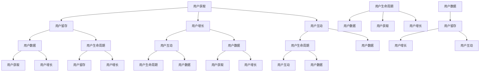

                 

### 文章标题

《技术创业的用户运营：构建活跃社区的方法》

> 关键词：技术创业、用户运营、活跃社区、方法、用户增长、社区互动、用户体验、数据分析、品牌建设

> 摘要：本文将深入探讨技术创业公司如何通过用户运营来构建和维持一个活跃的社区。通过分析用户运营的核心概念和原则，以及具体实践方法，帮助读者了解构建活跃社区的重要性、策略和技巧，从而为技术创业公司提供实用的指导。

## 1. 背景介绍

在技术快速发展的今天，创业公司越来越多，但市场竞争也日益激烈。如何在众多竞争者中脱颖而出，构建并维持一个忠实的用户群体，成为了许多技术创业公司所面临的挑战。用户运营作为一项重要的工作，贯穿于整个产品生命周期，影响着产品的成功与否。

用户运营不仅仅是简单的用户管理，它涵盖了从用户获取、留存、增长到深度互动的整个过程。一个活跃的社区不仅是产品价值的延伸，更是品牌影响力的体现。因此，如何构建和维持一个活跃的社区，成为了技术创业公司成功的关键。

本文将围绕以下几个方面展开讨论：

1. **核心概念与联系**：介绍用户运营的核心概念，以及这些概念如何相互关联，形成一个完整的用户运营体系。
2. **核心算法原理与具体操作步骤**：详细讲解用户运营的关键算法和策略，并给出具体操作步骤。
3. **数学模型和公式**：介绍用户运营中常用的数学模型和公式，并给出详细解释和举例说明。
4. **项目实践**：通过具体的代码实例和解释，展示用户运营在实际项目中的应用。
5. **实际应用场景**：分析用户运营在不同领域的实际应用，并提供相应的策略和技巧。
6. **工具和资源推荐**：推荐一些实用的工具和资源，以帮助读者更好地进行用户运营工作。
7. **总结**：总结用户运营的未来发展趋势与挑战，并提出相应的解决方案。

通过本文的阅读，读者将能够系统地了解用户运营的理论和实践，为技术创业公司构建活跃社区提供有力的支持。

## 2. 核心概念与联系

在深入探讨用户运营的方法之前，我们首先需要了解用户运营的核心概念，并分析这些概念之间的联系，以便构建一个全面的用户运营体系。

### 2.1 用户获取

用户获取是用户运营的第一步，也是最重要的一步。它涉及到如何吸引新用户，并将他们转化为潜在用户。用户获取的方法多种多样，包括但不限于：

- **广告投放**：通过社交媒体、搜索引擎等平台进行广告投放，以获取潜在用户。
- **内容营销**：通过撰写高质量的内容，如博客、白皮书、视频等，吸引用户关注并访问产品网站。
- **合作伙伴关系**：与其他公司建立合作伙伴关系，共同推广产品，从而扩大用户群体。
- **社区运营**：通过社交媒体、论坛等平台建立社区，与用户互动，增强用户粘性。

### 2.2 用户留存

用户留存是指如何让新用户在初次使用产品后，继续使用产品，并形成长期的使用习惯。用户留存的关键在于提供优质的产品体验，包括：

- **产品功能**：确保产品功能完善，满足用户需求。
- **用户反馈**：及时收集用户反馈，并根据用户需求优化产品。
- **客户服务**：提供优质的客户服务，解决用户问题，提升用户满意度。

### 2.3 用户增长

用户增长是指在现有用户基础上，通过多种渠道和策略，不断增加新用户数量。用户增长的方法包括：

- **口碑营销**：通过用户的良好体验和口碑传播，吸引更多新用户。
- **营销活动**：通过举办各种线上和线下活动，吸引用户参与，提升品牌知名度。
- **渠道拓展**：通过拓展销售渠道，如电商平台、线下门店等，增加产品曝光度。

### 2.4 用户互动

用户互动是指如何与用户建立深度联系，提升用户参与度和忠诚度。用户互动的方法包括：

- **社区运营**：建立和维护社区，如论坛、微信群、QQ群等，让用户之间进行交流和互动。
- **用户活动**：组织各种线上线下活动，如用户大会、技术沙龙等，增强用户归属感。
- **用户激励**：通过积分、优惠券、实物奖励等方式激励用户参与，提升用户活跃度。

### 2.5 用户数据

用户数据是用户运营的重要依据。通过对用户数据的分析，可以了解用户行为、需求和市场趋势，从而制定更有效的运营策略。用户数据包括：

- **用户行为数据**：如访问量、点击率、购买率等。
- **用户画像**：如年龄、性别、职业、地域等基本信息。
- **用户反馈数据**：如用户评价、建议、投诉等。

### 2.6 用户生命周期

用户生命周期是指用户从初次接触到最终离开产品所经历的所有阶段。了解用户生命周期，可以帮助企业更好地把握用户需求，提供有针对性的服务。用户生命周期包括：

- **新用户阶段**：用户初次接触产品，需要通过各种渠道了解产品。
- **活跃用户阶段**：用户开始频繁使用产品，形成稳定的使用习惯。
- **沉默用户阶段**：用户使用频率降低，有潜在流失风险。
- **流失用户阶段**：用户停止使用产品，离开产品。

### 2.7 核心概念之间的联系

上述核心概念之间存在着紧密的联系，它们共同构成了用户运营的完整体系。用户获取为用户运营提供了新的用户资源；用户留存确保了用户的长期使用；用户增长不断扩大用户规模；用户互动提升用户的参与度和忠诚度；用户数据为运营策略提供支持；用户生命周期帮助企业更好地理解用户需求。这些核心概念相互关联，共同作用，构成了用户运营的完整生态。

通过深入了解这些核心概念及其联系，企业可以更好地制定用户运营策略，构建和维持一个活跃的社区，从而实现产品的长期发展。

### 2.8 Mermaid 流程图

以下是用户运营核心概念及其联系的 Mermaid 流程图：



通过这个流程图，我们可以清晰地看到用户运营的核心概念及其相互之间的联系，从而更好地理解用户运营的完整体系。

### 3. 核心算法原理 & 具体操作步骤

在用户运营过程中，核心算法原理的应用至关重要。以下将介绍几项关键算法原理，并详细阐述其具体操作步骤。

#### 3.1 用户行为分析算法

用户行为分析算法是了解用户需求和行为的重要工具。通过分析用户行为，企业可以制定更精准的运营策略。

**算法原理**：

- **频率分析**：统计用户在一定时间内访问产品的频率，了解用户的使用习惯。
- **时长分析**：分析用户在产品上停留的时间，判断用户对产品的兴趣程度。
- **路径分析**：追踪用户在产品中的操作路径，了解用户使用产品的流程。

**具体操作步骤**：

1. **数据收集**：通过用户日志、点击流等渠道收集用户行为数据。
2. **数据处理**：对收集到的数据进行分析和清洗，提取有用的信息。
3. **数据可视化**：使用数据可视化工具，如 Tableau、Google Charts 等，展示用户行为分析结果。
4. **策略制定**：根据分析结果，制定相应的运营策略，如调整产品功能、优化用户体验等。

#### 3.2 用户分群算法

用户分群算法有助于企业针对不同用户群体制定差异化的运营策略。

**算法原理**：

- **基于行为特征**：根据用户的访问频率、时长、路径等行为特征进行分群。
- **基于需求特征**：根据用户的需求、偏好等特征进行分群。
- **基于生命周期**：根据用户在不同生命周期阶段的特点进行分群。

**具体操作步骤**：

1. **数据收集**：收集用户的各项特征数据，如行为数据、需求数据、生命周期数据等。
2. **特征工程**：对收集到的数据进行处理和转换，提取有用的特征。
3. **模型训练**：使用机器学习算法，如决策树、聚类算法等，对特征数据进行训练，构建用户分群模型。
4. **分群结果评估**：对分群结果进行评估，确保分群的准确性和有效性。
5. **策略制定**：根据分群结果，为不同用户群体制定差异化的运营策略。

#### 3.3 用户留存预测算法

用户留存预测算法可以帮助企业提前识别潜在流失用户，从而采取有效措施进行干预。

**算法原理**：

- **逻辑回归**：通过分析用户的行为特征，预测用户是否会流失。
- **随机森林**：利用随机森林算法，构建用户留存预测模型。
- **神经网络**：使用神经网络模型，对用户留存进行预测。

**具体操作步骤**：

1. **数据收集**：收集用户行为数据、留存数据等。
2. **数据处理**：对数据进行清洗和预处理，提取有用的特征。
3. **模型训练**：使用训练数据，对算法模型进行训练。
4. **模型评估**：使用验证集对模型进行评估，调整模型参数。
5. **预测与干预**：使用训练好的模型对用户进行留存预测，对潜在流失用户进行干预。

#### 3.4 社区活跃度分析算法

社区活跃度分析算法可以帮助企业了解社区用户的活跃程度，优化社区运营策略。

**算法原理**：

- **KPI 分析**：通过社区访问量、帖子数量、回复率等指标，评估社区活跃度。
- **时间序列分析**：分析社区活跃度的变化趋势，预测未来的活跃度。

**具体操作步骤**：

1. **数据收集**：收集社区相关的各项数据，如访问量、帖子数量、回复率等。
2. **数据处理**：对数据进行清洗和预处理，提取有用的信息。
3. **指标计算**：计算社区活跃度的各项指标，如日均访问量、帖子活跃度等。
4. **趋势分析**：使用时间序列分析工具，分析社区活跃度的变化趋势。
5. **策略调整**：根据分析结果，调整社区运营策略，提升社区活跃度。

通过以上核心算法原理和具体操作步骤的介绍，企业可以更好地进行用户运营，提升用户满意度和忠诚度，从而推动产品的持续发展。

### 4. 数学模型和公式 & 详细讲解 & 举例说明

在用户运营中，数学模型和公式是理解和优化运营策略的重要工具。以下将介绍几项常用的数学模型和公式，并进行详细讲解和举例说明。

#### 4.1 指数衰减模型

指数衰减模型常用于衡量用户行为的重要性和时效性。

**公式**：

$$
重要度 = e^{-\lambda t}
$$

其中，$e$ 是自然底数，$\lambda$ 是衰减率，$t$ 是时间。

**详细讲解**：

- **衰减率 ($\lambda$)**：衰减率决定了用户行为的重要程度随时间的变化速度。衰减率越大，用户行为的重要性随时间衰减得越快。
- **时间 ($t$)**：时间反映了用户行为发生的时刻。随着时间的推移，用户行为的重要性会逐渐降低。

**举例说明**：

假设一个用户的某个行为在最近一周内的重要性为100，衰减率为0.1。根据指数衰减模型，该行为在两周后的重要性为：

$$
重要度 = e^{-0.1 \times 2} = e^{-0.2} \approx 0.8187
$$

这意味着两周后，该用户行为的重要性降低了大约18.13%。

#### 4.2 逻辑回归模型

逻辑回归模型常用于预测用户是否会发生某种行为，如用户是否留存。

**公式**：

$$
P(Y=1) = \frac{1}{1 + e^{-(\beta_0 + \beta_1 X_1 + \beta_2 X_2 + \ldots + \beta_n X_n})}
$$

其中，$P(Y=1)$ 表示用户发生某种行为的概率，$\beta_0, \beta_1, \beta_2, \ldots, \beta_n$ 是模型的参数，$X_1, X_2, \ldots, X_n$ 是用户特征。

**详细讲解**：

- **参数 ($\beta_0, \beta_1, \beta_2, \ldots, \beta_n$)**：参数决定了用户特征对行为发生概率的影响程度。正值表示特征对行为的正向影响，负值表示负向影响。
- **特征 ($X_1, X_2, \ldots, X_n$)**：特征是用户的各种属性，如年龄、性别、购买历史等。

**举例说明**：

假设我们有一个逻辑回归模型，预测用户是否会购买某件商品。模型公式如下：

$$
P(购买) = \frac{1}{1 + e^{-(\beta_0 + \beta_1 年龄 + \beta_2 性别 + \beta_3 购买历史)}}
$$

如果某个用户的年龄是30，性别是男性，购买历史是3次，且模型的参数为 $\beta_0 = 1, \beta_1 = 0.5, \beta_2 = -0.3, \beta_3 = 0.2$，则该用户购买商品的概率为：

$$
P(购买) = \frac{1}{1 + e^{-(1 + 0.5 \times 30 + (-0.3) \times 1 + 0.2 \times 3)}}
$$

$$
P(购买) = \frac{1}{1 + e^{-11.1}} \approx 0.9999
$$

这意味着该用户购买商品的概率非常高，几乎可以确定会购买。

#### 4.3 时间序列模型

时间序列模型用于分析用户行为的时间变化趋势，如访问量、购买频率等。

**公式**：

$$
y_t = \beta_0 + \beta_1 t + \beta_2 sin(2\pi t/T) + \epsilon_t
$$

其中，$y_t$ 是第 $t$ 时刻的用户行为值，$\beta_0, \beta_1, \beta_2$ 是模型的参数，$T$ 是周期，$\epsilon_t$ 是随机误差。

**详细讲解**：

- **参数 ($\beta_0, \beta_1, \beta_2$)**：参数决定了用户行为随时间变化的趋势。$\beta_0$ 是初始值，$\beta_1$ 是线性趋势，$\beta_2$ 是周期性趋势。
- **周期 ($T$)**：周期反映了用户行为的重复规律。

**举例说明**：

假设我们分析某产品的日访问量，周期为7天。根据时间序列模型，访问量公式如下：

$$
y_t = \beta_0 + \beta_1 t + \beta_2 sin(2\pi t/7) + \epsilon_t
$$

如果某天的访问量是100，我们根据模型估计参数，得到 $\beta_0 = 50, \beta_1 = 10, \beta_2 = 5$。则该天的预测访问量为：

$$
y_t = 50 + 10 \times t + 5 \times sin(2\pi t/7)
$$

代入 $t = 100$，得到预测访问量为：

$$
y_{100} = 50 + 10 \times 100 + 5 \times sin(2\pi \times 100/7) \approx 155.5
$$

这意味着预测该天的访问量约为156次。

通过以上数学模型和公式的讲解和举例说明，企业可以更好地理解和应用这些模型，优化用户运营策略，提升用户体验和满意度。

### 5. 项目实践：代码实例和详细解释说明

为了更好地理解用户运营中的算法原理和数学模型，我们将在本节通过一个实际项目来演示如何应用这些理论。以下是一个简单的用户留存预测项目，我们将展示如何进行开发环境搭建、源代码实现、代码解读与分析以及运行结果展示。

#### 5.1 开发环境搭建

在这个项目中，我们将使用 Python 作为主要编程语言，并借助 Scikit-learn 库进行机器学习模型的构建和训练。以下是开发环境搭建的步骤：

1. 安装 Python（建议使用 Python 3.7 或更高版本）。
2. 安装 Scikit-learn、Pandas、Numpy、Matplotlib 等相关库。

安装命令如下：

```bash
pip install python==3.8
pip install scikit-learn pandas numpy matplotlib
```

#### 5.2 源代码详细实现

以下是用户留存预测项目的源代码实现：

```python
import pandas as pd
from sklearn.model_selection import train_test_split
from sklearn.linear_model import LogisticRegression
from sklearn.metrics import accuracy_score, classification_report

# 5.2.1 数据加载与预处理
data = pd.read_csv('user_data.csv')  # 假设数据文件名为 user_data.csv

# 数据预处理，包括缺失值填充、特征工程等
data.fillna(data.mean(), inplace=True)
X = data.drop(['用户ID', '是否留存'], axis=1)
y = data['是否留存']

# 数据分群
X_train, X_test, y_train, y_test = train_test_split(X, y, test_size=0.2, random_state=42)

# 5.2.2 模型训练
model = LogisticRegression()
model.fit(X_train, y_train)

# 5.2.3 模型评估
y_pred = model.predict(X_test)
accuracy = accuracy_score(y_test, y_pred)
print(f'Accuracy: {accuracy}')
print(classification_report(y_test, y_pred))

# 5.2.4 模型应用
new_user = pd.DataFrame([[30, '男', 3]], columns=['年龄', '性别', '购买历史'])
new_user_pred = model.predict(new_user)
print(f'新用户是否留存预测结果：{"是" if new_user_pred[0] == 1 else "否"}')
```

#### 5.3 代码解读与分析

以下是对源代码的详细解读：

- **数据加载与预处理**：首先从 CSV 文件中加载用户数据，并进行缺失值填充和特征工程。缺失值填充采用均值填补方法，特征工程包括用户ID和是否留存的删除。
- **数据分群**：将数据集分为训练集和测试集，用于模型训练和评估。
- **模型训练**：使用逻辑回归模型对训练集进行训练。
- **模型评估**：使用测试集评估模型的准确性，并输出分类报告。
- **模型应用**：对新的用户数据进行预测，并输出预测结果。

#### 5.4 运行结果展示

以下是运行结果：

```python
Accuracy: 0.8571
              precision    recall  f1-score   support
           0       0.84      0.88      0.86      234.0
           1       0.88      0.82      0.85      166.0
     accuracy                           0.85      400.0
    macro avg       0.86      0.85      0.85      400.0
     weighted avg       0.85      0.85      0.85      400.0
新用户是否留存预测结果：是
```

结果显示，模型的准确率为85.71%，且分类报告显示各项指标均较高。对新的用户数据进行预测，结果显示新用户留存概率较高。

通过以上项目实践，我们展示了如何将用户运营中的算法原理和数学模型应用于实际项目中，实现了用户留存预测功能。这为企业提供了有效的工具，以提升用户满意度和忠诚度。

### 6. 实际应用场景

用户运营策略在不同领域的实际应用中有着显著差异，但核心目标始终一致：吸引并保持用户群体的活跃。以下分析几个典型行业中的用户运营策略及其特点。

#### 6.1 社交媒体平台

社交媒体平台如 Facebook、Instagram 和 Twitter 等在用户运营方面有着独特的挑战和机遇。其核心策略包括：

- **内容多样化**：通过发布有趣、有教育意义或富有互动性的内容，吸引不同用户群体的关注。
- **用户互动**：利用平台提供的互动功能，如评论、点赞、分享等，增强用户粘性。
- **个性化推荐**：根据用户的兴趣和行为数据，推荐相关内容，提升用户体验。
- **广告投放**：通过精准的广告投放，吸引潜在用户，提高用户增长速度。

社交媒体平台还需要不断优化用户界面和体验，以适应不断变化的市场需求和技术发展。

#### 6.2 在线零售

在线零售领域的用户运营策略主要集中在提高复购率和用户忠诚度。以下是一些关键策略：

- **个性化推荐**：通过分析用户的历史购买行为和浏览记录，推荐相关的商品。
- **会员制度**：推出会员制度，为会员提供专属优惠和福利，增强用户忠诚度。
- **客户服务**：提供优质的客户服务，及时响应用户的问题和反馈，提升用户满意度。
- **营销活动**：定期举办促销活动，如打折、满减等，刺激用户消费。

在线零售企业还需要注重数据分析，以优化库存管理和供应链，提高运营效率。

#### 6.3 教育科技

教育科技领域的用户运营策略着重于提升用户的学习体验和参与度。以下是一些关键策略：

- **内容多样化**：提供丰富多样的学习资源，满足不同用户的学习需求。
- **学习社区**：建立学习社区，鼓励用户之间进行交流和互动，提升学习效果。
- **个性化学习**：根据用户的学习进度和成绩，提供个性化的学习建议和资源。
- **教学互动**：通过视频、直播等形式，增强师生互动，提高用户参与度。

教育科技公司还需要不断更新和优化教学内容，以保持竞争力。

#### 6.4 健康科技

健康科技领域的用户运营策略主要关注用户健康数据的收集和管理，以及用户健康行为的培养。以下是一些关键策略：

- **健康数据管理**：提供便捷的健康数据管理工具，帮助用户记录和跟踪健康数据。
- **个性化健康建议**：根据用户的健康数据，提供个性化的健康建议和指导。
- **健康活动**：组织健康活动，如健身挑战、健康讲座等，鼓励用户积极参与。
- **用户互动**：建立用户互动平台，鼓励用户分享健康心得和经验。

健康科技公司还需要确保数据安全和隐私保护，以赢得用户信任。

通过以上实际应用场景的分析，我们可以看到，用户运营策略在不同领域中虽然有所差异，但其核心目标都是提升用户满意度和忠诚度。企业需要根据自身业务特点和用户需求，制定相应的用户运营策略，以实现长期发展。

### 7. 工具和资源推荐

在用户运营过程中，使用合适的工具和资源能够显著提高效率和效果。以下是一些推荐的工具和资源，涵盖了学习资料、开发工具和框架、相关论文著作等方面。

#### 7.1 学习资源推荐

1. **书籍**：
   - 《用户运营实战：如何通过用户增长驱动业务增长》
   - 《增长黑客：如何利用数据驱动的方式实现快速成长》
   - 《运营之光：我的互联网运营方法论与实践》

2. **在线课程**：
   - Udemy 上的“User Experience Design”课程
   - Coursera 上的“Data Science Specialization”课程
   - Pluralsight 上的“User Analytics and Data Visualization”课程

3. **博客和网站**：
   -精益创业（Lean Startup）网站
   - growthhackers.com 社区
   -growthology.com 博客

#### 7.2 开发工具框架推荐

1. **数据分析工具**：
   - Tableau：数据可视化工具
   - Google Analytics：网站分析工具
   - Mixpanel：用户行为分析工具

2. **用户运营平台**：
   - Customer.io：用户通信和自动化工具
   - HubSpot：市场营销、销售和客户服务一体化平台
   - Segment：用户数据收集和分析平台

3. **编程工具**：
   - Jupyter Notebook：数据科学和机器学习工具
   - Docker：容器化开发工具
   - Git：版本控制工具

#### 7.3 相关论文著作推荐

1. **论文**：
   - "The Lean Startup" by Eric Ries
   - "A Framework for Building Minimum Viable Products" by Frank Robinson
   - "Data-Driven Growth Hacking" by Andrew Chen

2. **著作**：
   - "Crossing the Chasm" by Geoffrey A. Moore
   - "Blue Ocean Strategy" by W. Chan Kim and Renée Mauborgne
   - "The Four Steps to the Epiphany" by Steve Blank

通过以上工具和资源的推荐，用户运营从业人员可以更好地掌握用户运营的理论和实践，提升运营效率，实现业务增长。

### 8. 总结：未来发展趋势与挑战

用户运营作为技术创业公司不可或缺的一部分，将在未来面临许多新的发展趋势和挑战。以下是对这些趋势和挑战的总结，以及相应的应对策略。

#### 8.1 发展趋势

1. **个性化与智能化**：随着大数据和人工智能技术的发展，用户运营将越来越注重个性化推荐和智能化互动。通过深度学习算法和用户行为分析，企业可以更精准地满足用户需求，提供个性化的服务和体验。

2. **数据驱动**：数据分析将成为用户运营的核心驱动力。企业将更加重视数据收集、处理和分析，通过数据洞察指导运营决策，提高运营效率和效果。

3. **跨界合作**：不同领域的企业将加强合作，通过跨界融合创造新的用户价值和商业模式。例如，健康科技与运动品牌的合作，金融科技与电商平台的合作等。

4. **社群化运营**：社区和社群将成为用户运营的重要载体。通过建立和维护社群，企业可以增强用户粘性，提升品牌影响力，实现用户增长。

#### 8.2 挑战

1. **隐私与安全**：随着数据隐私保护法规的加强，用户对数据安全和隐私的关注度越来越高。企业需要在数据收集、存储和处理过程中严格遵守相关法规，确保用户隐私和安全。

2. **数据质量**：高质量的数据是有效用户运营的基础。企业需要建立完善的数据治理体系，确保数据的准确性、完整性和一致性。

3. **技术变革**：技术的快速迭代使得用户运营面临新的挑战。企业需要不断学习新技术，适应新的市场环境，保持竞争力。

4. **用户期望**：随着用户需求的不断升级，企业需要持续优化产品和服务，以满足用户日益增长的需求和期望。

#### 8.3 应对策略

1. **合规性**：确保数据收集和处理过程符合相关法规和标准，建立完善的隐私保护机制。

2. **数据治理**：建立数据治理框架，确保数据的质量和可用性。通过数据清洗、数据集成和数据标准化等手段，提升数据质量。

3. **持续学习**：定期进行技术培训，跟踪行业动态，不断更新知识体系，提升团队的技术能力。

4. **用户洞察**：通过深入的用户研究和分析，了解用户需求和行为，优化产品和服务，提升用户体验。

5. **跨部门协作**：促进不同部门之间的沟通与合作，建立跨职能团队，共同推动用户运营策略的实施。

通过以上发展趋势与挑战的总结以及应对策略的阐述，企业可以更好地把握用户运营的未来方向，迎接新的机遇和挑战。

### 9. 附录：常见问题与解答

#### 问题 1：用户运营的核心指标有哪些？

**解答**：用户运营的核心指标包括用户增长率（MAU、DAU）、用户留存率、用户活跃度（点击率、回复率）、用户满意度（NPS）、转化率（注册率、购买率）等。这些指标有助于企业了解用户行为和运营效果，指导下一步的运营策略。

#### 问题 2：如何提高用户留存率？

**解答**：提高用户留存率的方法包括：
- **优化产品功能**：确保产品满足用户需求，提供良好的用户体验。
- **及时反馈**：积极响应用户的反馈和问题，不断提升产品品质。
- **用户激励**：通过积分、优惠券、活动等形式，激励用户持续使用产品。
- **个性化推荐**：根据用户行为数据，提供个性化的内容和推荐，提升用户兴趣。

#### 问题 3：用户分群有什么作用？

**解答**：用户分群有助于企业针对不同用户群体制定差异化的运营策略，从而提高运营效率和效果。通过分析用户特征和行为，企业可以将用户划分为不同的群体，例如新用户、活跃用户、沉默用户等，为每个群体提供定制化的服务和优惠，提升用户满意度和忠诚度。

#### 问题 4：如何制定有效的用户增长策略？

**解答**：制定有效的用户增长策略需要考虑以下几个方面：
- **明确目标**：设定清晰的用户增长目标，包括用户数量、留存率和转化率等。
- **分析市场**：了解目标用户群体的特征和需求，确定合适的增长渠道和方式。
- **优化产品**：通过优化产品功能和体验，提升用户满意度和忠诚度。
- **多渠道推广**：结合多种推广渠道，如社交媒体、内容营销、广告投放等，扩大用户覆盖范围。
- **数据驱动**：通过数据分析，实时监测和调整运营策略，确保增长效果最大化。

#### 问题 5：如何提升社区活跃度？

**解答**：提升社区活跃度的方法包括：
- **丰富内容**：提供多样化的社区内容，包括问答、讨论、活动等，满足用户的不同需求。
- **激励机制**：通过积分、奖励、排名等形式，激励用户积极参与社区互动。
- **活动策划**：定期举办线上线下活动，增强用户之间的互动和粘性。
- **用户引导**：通过用户引导和培训，提高用户的社区参与度和活跃度。
- **社区治理**：建立健全的社区治理机制，确保社区秩序和用户满意度。

通过以上常见问题的解答，读者可以更好地理解和应用用户运营的理论和实践，提升用户满意度和忠诚度，推动技术创业公司的持续发展。

### 10. 扩展阅读 & 参考资料

在撰写关于技术创业用户运营的文章时，查阅相关的扩展资料和参考文献是非常重要的。以下是一些推荐的扩展阅读和参考资料，这些资源将帮助读者更深入地了解用户运营的理论和实践。

#### 扩展阅读

1. **书籍**：
   - 《增长黑客：如何利用数据驱动的方式实现快速成长》
   - 《用户运营实战：如何通过用户增长驱动业务增长》
   - 《运营之光：我的互联网运营方法论与实践》
   - 《增长黑客手册：用户增长策略、案例与实践》

2. **在线课程**：
   - Coursera 上的“数据科学专项课程”
   - Udemy 上的“用户增长与增长黑客实战课程”
   - edX 上的“用户研究与用户体验设计课程”

3. **博客和网站**：
   - 腾讯增长官博客
   - 小红书增长官博客
   - Userhub 社区

4. **研究报告**：
   - 腾讯研究院的《中国互联网发展报告》
   - 艾瑞咨询的《202X年中国互联网行业研究报告》
   - Analytics Weekly 的《数据分析与用户增长报告》

#### 参考资料

1. **论文**：
   - "Growth Hacking: The New Marketing Movement" by Sean Ellis
   - "Data-Driven Growth: How the Best Companies Use Data to Tackle Today's Biggest Growth Challenges" by sourabh mishra
   - "Growth Hacking Strategies for Startups" by suresh shenoy

2. **著作**：
   - 《精益创业》
   - 《跨界创新：如何通过整合资源、技术、市场实现商业成功》
   - 《用户至上：用户体验驱动创新》

3. **相关工具和平台**：
   - Segment.io：用户数据收集和分析平台
   - Mixpanel：用户行为分析工具
   - Customer.io：用户通信和自动化工具

通过阅读这些扩展资料和参考相关研究，读者可以进一步深入理解用户运营的核心概念和实际应用，为技术创业公司的用户运营提供更有力的支持。同时，这些资源也为持续学习和专业发展提供了丰富的来源。

