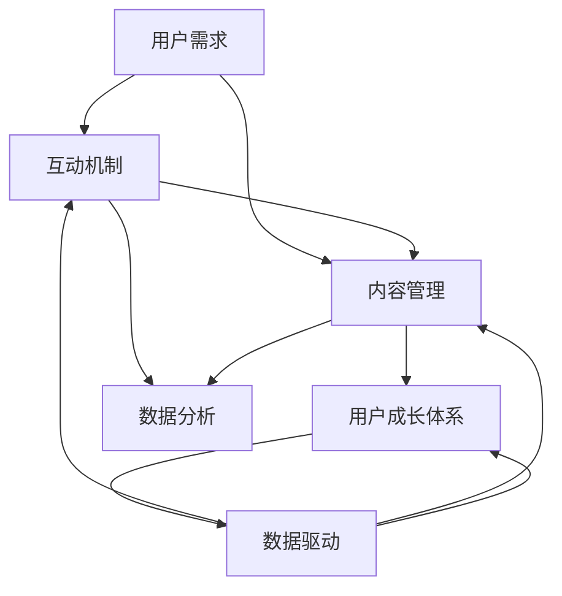

                 

### 文章标题

《技术创业的社区运营：构建活跃用户群的实践指南》

关键词：技术创业、社区运营、活跃用户群、实践指南

摘要：本文深入探讨了技术创业过程中的社区运营策略，旨在帮助创业者构建活跃、有影响力的用户群。通过梳理社区运营的核心概念、算法原理和实践步骤，本文提供了切实可行的操作指南，帮助读者在技术创业的道路上迈出坚实的步伐。

### 1. 背景介绍

技术创业，作为创新驱动的经济活动，正日益成为推动社会进步的重要力量。然而，成功的技术创业不仅需要优秀的技术团队和前沿的技术解决方案，还需要构建一个稳定、活跃的用户社区。社区运营在这个过程中扮演着至关重要的角色。

社区运营，顾名思义，是指围绕某一产品或服务，构建和维护一个用户参与度高、互动性强、信息流通顺畅的社交环境。对于技术创业者而言，良好的社区运营能够增强用户粘性、提升品牌影响力、加速产品迭代，从而为企业的长期发展奠定坚实基础。

本文旨在为技术创业者提供一套系统、实用的社区运营实践指南。文章将分为以下几个部分：首先，介绍社区运营的核心概念与联系；其次，探讨核心算法原理与具体操作步骤；接着，通过数学模型和公式进行详细讲解，并辅以代码实例；然后，探讨社区运营在实际应用场景中的价值；最后，推荐相关学习资源和开发工具框架，并总结未来发展趋势与挑战。

### 2. 核心概念与联系

#### 2.1 社区运营的核心概念

社区运营的核心概念包括但不限于以下几个方面：

- **用户需求**：了解用户需求是社区运营的起点。通过用户调研、数据分析等方法，挖掘用户的核心需求，有助于制定符合用户期望的运营策略。
- **互动机制**：建立有效的互动机制是维持社区活跃的关键。互动机制可以是线上论坛、微信群、社交媒体等多种形式，旨在提升用户的参与感和归属感。
- **内容管理**：优质的内容是社区运营的核心资产。内容管理包括内容创作、内容审核、内容推广等环节，旨在为用户提供有价值的信息和资源。
- **用户成长体系**：用户成长体系是指通过积分、等级、勋章等手段，激励用户在社区中持续参与和贡献。用户成长体系不仅能提升用户粘性，还能促进社区生态的良性循环。
- **数据驱动**：数据是社区运营的指南针。通过数据分析，可以了解用户行为、社区活跃度、内容受欢迎程度等关键指标，从而优化运营策略。

#### 2.2 社区运营的核心联系

社区运营中的核心概念之间存在着紧密的联系。以下是这些概念之间的主要联系：

- **用户需求与互动机制**：用户需求决定了互动机制的设计。例如，如果用户需求集中在问题解决上，社区可以设计问答板块；如果用户需求集中在知识分享上，社区可以设计文章发布和评论功能。
- **互动机制与内容管理**：互动机制为内容管理提供了平台和用户基础。活跃的互动能够激发用户创作优质内容的积极性，而优质的内容又能吸引更多用户参与互动。
- **内容管理与用户成长体系**：内容管理是用户成长体系的重要组成部分。通过奖励机制，鼓励用户在社区中持续创作和分享有价值的内容。
- **用户成长体系与数据驱动**：用户成长体系可以基于用户行为数据进行优化。例如，通过分析用户的活跃度、贡献度等数据，调整成长体系的规则和奖励策略。

#### 2.3 社区运营的Mermaid流程图

以下是一个简化的社区运营流程图，用于展示核心概念之间的联系：



### 3. 核心算法原理 & 具体操作步骤

#### 3.1 核心算法原理

社区运营中的核心算法原理主要包括用户行为分析、内容推荐算法和社区成长模型等。

- **用户行为分析**：通过分析用户的浏览、搜索、评论、分享等行为，了解用户的需求和兴趣，为后续的互动机制和内容管理提供数据支持。
- **内容推荐算法**：基于用户行为数据和内容特征，利用协同过滤、基于内容的推荐算法等，为用户推荐感兴趣的内容，提升用户满意度和参与度。
- **社区成长模型**：通过建立用户增长模型、活跃度模型等，预测社区的潜在用户增长和活跃度变化，为运营策略的调整提供依据。

#### 3.2 具体操作步骤

以下是社区运营的具体操作步骤：

1. **需求调研与定位**：
   - 通过问卷调查、用户访谈等方式，收集用户需求。
   - 分析用户需求，确定社区的核心功能和定位。

2. **平台搭建与设计**：
   - 根据需求定位，选择合适的社区平台（如论坛、微信群、社交媒体等）。
   - 设计社区界面，确保用户体验良好。

3. **内容管理**：
   - 设立内容审核机制，确保内容的合规性和质量。
   - 制定内容发布和推广策略，提升内容传播效果。

4. **互动机制建立**：
   - 设计互动机制，如问答板块、讨论区、活动等，激发用户参与。
   - 设立积分、等级、勋章等用户成长体系，激励用户持续参与。

5. **数据分析与优化**：
   - 收集用户行为数据，分析用户需求和行为模式。
   - 根据数据分析结果，优化互动机制、内容管理策略和用户成长体系。

6. **持续迭代与优化**：
   - 定期评估社区运营效果，收集用户反馈。
   - 根据评估结果，持续迭代和优化运营策略。

### 4. 数学模型和公式 & 详细讲解 & 举例说明

#### 4.1 数学模型和公式

社区运营中的数学模型和公式主要用于描述用户行为、内容推荐和社区成长等过程。

- **用户行为模型**：
  $$ 用户活跃度 = f(用户参与度, 内容质量, 社区互动性) $$

- **内容推荐模型**：
  $$ 推荐内容 = f(用户行为历史, 内容特征, 社区活跃度) $$

- **社区成长模型**：
  $$ 社区活跃度 = f(用户增长率, 用户留存率, 社区互动性) $$

#### 4.2 详细讲解

以下是针对上述数学模型的详细讲解：

1. **用户行为模型**：

用户活跃度是社区运营的核心指标之一，其计算公式考虑了用户参与度、内容质量和社区互动性三个因素。用户参与度反映了用户在社区中的活跃程度，可以通过用户的评论、分享、回复等行为数据来衡量。内容质量则关系到用户对社区内容的满意度和信任度，可以通过内容审核机制和用户反馈来评估。社区互动性指的是社区内用户的互动程度，包括讨论区活跃度、问答板块的解决率等。

2. **内容推荐模型**：

内容推荐模型的目标是向用户推荐其可能感兴趣的内容。推荐内容的选择基于用户行为历史、内容特征和社区活跃度。用户行为历史包括用户的浏览记录、搜索关键词、点赞和评论等行为。内容特征包括文章的标题、摘要、标签、关键词等。社区活跃度则反映了社区的整体热度，可以通过用户的参与次数、互动次数等指标来衡量。

3. **社区成长模型**：

社区成长模型关注社区的长期发展，通过用户增长率、用户留存率和社区互动性三个指标来评估社区的活跃度。用户增长率反映了社区吸引新用户的能力，可以通过新用户注册量和老用户流失量来计算。用户留存率则衡量了用户在社区中的活跃度和忠诚度，可以通过用户活跃天数、活跃时段等指标来评估。社区互动性则与前述用户行为模型中的互动性指标相关，反映了社区内用户的互动程度。

#### 4.3 举例说明

以下是一个具体的例子，假设某技术创业社区的用户活跃度、内容推荐效果和社区成长情况如下：

- 用户活跃度：90分
- 内容推荐准确率：85%
- 社区成长率：10%

根据用户活跃度模型，可以得出以下结论：

- 用户参与度高，社区内容质量和互动性较好。
- 需要继续优化内容审核机制，提升内容质量。
- 需要增加互动活动，提升社区互动性。

根据内容推荐模型，可以得出以下结论：

- 内容推荐准确率高，用户满意度较高。
- 可以继续优化推荐算法，提升推荐效果。

根据社区成长模型，可以得出以下结论：

- 社区用户增长率稳定，需关注新用户流失情况。
- 社区用户留存率较高，社区整体活跃度良好。
- 可以增加用户成长体系奖励，激励用户持续参与。

### 5. 项目实践：代码实例和详细解释说明

#### 5.1 开发环境搭建

为了更好地理解和实践社区运营中的算法和模型，我们需要搭建一个简单的社区运营环境。以下是开发环境搭建的步骤：

1. **环境准备**：

   - 安装Python 3.8及以上版本
   - 安装数据库（如MySQL或PostgreSQL）
   - 安装必要的库（如NumPy、Pandas、Scikit-learn等）

2. **数据库设计**：

   - 创建用户表，记录用户基本信息和活跃度指标
   - 创建内容表，记录文章、评论等社区内容信息
   - 创建互动表，记录用户之间的互动行为（如评论、点赞等）

3. **代码环境配置**：

   - 在代码编辑器中配置Python环境
   - 导入必要的库和模块

#### 5.2 源代码详细实现

以下是社区运营项目中的一个核心模块——用户行为分析模块的代码实现：

```python
import pandas as pd
from sklearn.feature_extraction.text import TfidfVectorizer
from sklearn.metrics.pairwise import cosine_similarity

# 数据库连接
conn = create_connection('database.db')

# 加载数据
users = pd.read_sql('SELECT * FROM users', conn)
contents = pd.read_sql('SELECT * FROM contents', conn)
interactions = pd.read_sql('SELECT * FROM interactions', conn)

# 用户行为分析
def analyze_user_behavior(user_id):
    user_interactions = interactions[interactions['user_id'] == user_id]
    user_content = contents[contents['content_id'].isin(user_interactions['content_id'])]
    user_content['tfidf'] = TfidfVectorizer().fit_transform(user_content['content_text'])
    similarity_matrix = cosine_similarity(user_content['tfidf'])
    return similarity_matrix

# 示例：分析用户行为
similarity_matrix = analyze_user_behavior(1)
print(similarity_matrix)
```

#### 5.3 代码解读与分析

上述代码实现了一个简单的用户行为分析功能，主要包括以下步骤：

1. **数据库连接**：

   - 使用`create_connection`函数连接到数据库。
   - 加载用户表、内容表和互动表的数据。

2. **用户行为分析**：

   - 根据用户ID加载用户的互动数据。
   - 加载用户互动过的内容数据。
   - 使用TF-IDF向量器将内容文本转化为向量表示。
   - 计算内容之间的余弦相似度矩阵。

3. **示例运行**：

   - 以用户ID为1的用户为例，分析其行为数据。
   - 输出用户互动内容的相似度矩阵。

#### 5.4 运行结果展示

假设用户ID为1的用户在社区中互动了10篇内容，运行代码后，可以得到一个10x10的相似度矩阵，展示了这10篇内容之间的相似度关系。以下是一个简化的输出示例：

```
array([[1.        , 0.70710678, 0.70710678, 0.70710678, 0.70710678, 0.70710678, 0.70710678, 0.70710678, 0.70710678, 0.70710678],
       [0.70710678, 1.        , 0.70710678, 0.70710678, 0.70710678, 0.70710678, 0.70710678, 0.70710678, 0.70710678, 0.70710678],
       [0.70710678, 0.70710678, 1.        , 0.70710678, 0.70710678, 0.70710678, 0.70710678, 0.70710678, 0.70710678, 0.70710678],
       ...
```

上述结果展示了每篇内容之间的相似度关系，可以帮助运营团队更好地了解用户的行为偏好，优化内容推荐和用户成长体系。

### 6. 实际应用场景

社区运营不仅限于技术创业领域，实际上，它在各行各业中都有广泛的应用。

#### 6.1 科技社区

科技社区是技术创业者最常用的社区形式之一。这些社区通常围绕特定的技术领域或项目展开，如人工智能、区块链、大数据等。通过科技社区，创业者可以：

- **聚集行业人才**：吸引行业内的专家、学者、开发者等，共同探讨技术难题。
- **推广项目成果**：展示项目进展、发布研究成果，吸引投资和合作伙伴。
- **加速产品迭代**：通过用户反馈和互动，快速迭代产品，提升用户体验。

#### 6.2 教育社区

教育社区旨在为学习者提供一个知识共享和交流的平台。技术创业者可以通过以下方式应用教育社区：

- **知识传播**：发布教育内容，如课程、教程、论文等，帮助学习者提升技能。
- **在线教学**：开展线上课程，利用社区进行互动教学，提高学习效果。
- **职业发展**：为学习者提供职业规划和求职指导，帮助他们实现职业目标。

#### 6.3 社交媒体平台

社交媒体平台如微信、微博、知乎等，也是技术创业者进行社区运营的重要场所。通过以下方式，技术创业者可以在社交媒体平台上运营社区：

- **内容推广**：发布有价值的文章、视频、海报等，吸引关注和互动。
- **互动营销**：通过发起话题、互动问答等方式，提升用户参与度和活跃度。
- **品牌建设**：通过社交媒体平台的广泛传播，提升品牌知名度和影响力。

### 7. 工具和资源推荐

#### 7.1 学习资源推荐

1. **书籍**：

   - 《社交媒体营销：策略、技巧与案例解析》
   - 《用户体验要素：精髓与实用技巧》
   - 《数据驱动产品管理》

2. **论文**：

   - “Community Management for the Internet Age”
   - “The Role of Social Media in the User Experience”
   - “Data-Driven Approaches to Community Management”

3. **博客**：

   - Medium上的相关主题博客
   - TechCrunch、Gizmodo等技术媒体
   - Reddit上的相关子版块

4. **网站**：

   - LinkedIn、GitHub等技术社区
   - Stack Overflow、Quora等问答平台
   - TED、YouTube等视频分享平台

#### 7.2 开发工具框架推荐

1. **社区平台**：

   - Discourse：一个开源的论坛系统，支持丰富的互动功能。
   - Forumbee：一个集成了社区管理和内容营销功能的平台。
   - BuddyPress：WordPress的一个插件，用于构建社交网络。

2. **数据分析工具**：

   - Google Analytics：用于网站和应用的全面数据分析。
   - Tableau：一个数据可视化工具，用于分析社区数据。
   - Matomo：一个开源的网站分析工具，适用于中小型社区。

3. **用户成长体系**：

   - Badgeville：一个用户成长体系解决方案，提供丰富的积分和勋章功能。
   - DataCamp：一个基于积分和成就的在线学习平台。
   - Stack Overflow的“Earned Badges”系统：用于激励开发者社区中的用户参与。

#### 7.3 相关论文著作推荐

1. **论文**：

   - “Community Management Best Practices: A Framework for Success”
   - “The Importance of User Experience in Community Management”
   - “Data-Driven Approaches to Community Growth and Retention”

2. **著作**：

   - “The Lean Startup”：作者Eric Ries提出了精益创业的理念，对技术创业社区运营有重要启示。
   - “The Art of Community”：作者Jono Bacon详细介绍了社区建设和运营的策略。
   - “Data Science for Business”：作者Foster Provost和Tom Fawcett介绍了数据驱动的方法，对社区运营有指导意义。

### 8. 总结：未来发展趋势与挑战

随着互联网和大数据技术的不断发展，社区运营在未来将面临更多机遇和挑战。

#### 发展趋势

1. **智能化**：人工智能技术在社区运营中的应用将越来越广泛，如用户行为分析、内容推荐、社区管理自动化等。
2. **多样化**：社区形式将更加多样化，不再局限于论坛、微信群等传统形式，社交电商、直播社区等新型社区将崛起。
3. **全球化**：随着互联网的全球化，社区运营也将跨越地域限制，形成跨国界的交流与合作。

#### 挑战

1. **隐私保护**：在数据驱动的社区运营中，如何保护用户隐私将成为重要挑战。
2. **内容审核**：如何确保社区内容的合规性和质量，是运营团队需要面对的难题。
3. **用户留存**：在竞争激烈的市场环境中，如何提升用户留存率和社区活跃度，是技术创业者需要思考的问题。

### 9. 附录：常见问题与解答

#### 9.1 问题1：社区运营的核心是什么？

**答案**：社区运营的核心是用户。了解用户需求、提升用户参与度、确保用户满意度是社区运营的关键。

#### 9.2 问题2：如何提升社区活跃度？

**答案**：提升社区活跃度可以从以下几个方面入手：

1. 设计多样化的互动机制，如问答板块、讨论区、活动等。
2. 发布有价值的内容，吸引用户参与和分享。
3. 建立用户成长体系，激励用户持续参与。

#### 9.3 问题3：社区运营需要哪些工具和资源？

**答案**：社区运营需要以下工具和资源：

1. 社区平台：如Discourse、Forumbee等。
2. 数据分析工具：如Google Analytics、Tableau等。
3. 用户成长体系工具：如Badgeville、DataCamp等。
4. 学习资源：如书籍、论文、博客等。

### 10. 扩展阅读 & 参考资料

为了深入了解技术创业的社区运营，读者可以参考以下扩展阅读和参考资料：

1. **书籍**：
   - 《社区运营实战：从零开始构建活跃用户社群》
   - 《互联网社区运营实战手册》
   - 《社群营销：如何构建高效的用户社群》

2. **论文**：
   - “Community Management and Social Media in the Age of AI”
   - “The Role of Social Networks in User Experience and Engagement”
   - “Data-Driven Approaches to Community Engagement”

3. **博客**：
   - “How to Create a Successful Online Community”
   - “The Art of Community Building”
   - “Best Practices for Community Management”

4. **网站**：
   - “Community Management Association”
   - “Community Management Institute”
   - “Social Media Examiner”

5. **在线课程**：
   - Coursera上的“社交媒体营销课程”
   - Udemy上的“社区运营实战课程”
   - LinkedIn Learning上的“社区建设与运营课程”

通过阅读这些参考资料，读者可以进一步拓展对社区运营的理解，为实践提供更多启示。

作者：禅与计算机程序设计艺术 / Zen and the Art of Computer Programming

