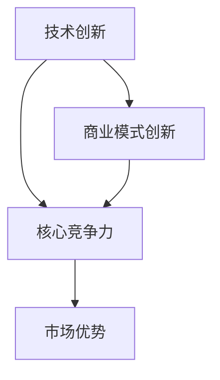

                 

### 背景介绍

#### 创新的重要性

在当今社会，技术创新和商业模式创新已经成为推动经济增长和社会进步的两大引擎。无论是科技巨头还是初创企业，都在寻求通过技术创新和商业模式创新来实现业务增长和市场份额的扩张。

技术创新，即通过引入新的科技或改进现有科技来创造新产品或服务，从而满足市场需求或解决现有问题。商业模式创新，则是通过改变产品的生产、销售、服务等环节，或者创造全新的市场和服务模式来获取利润。两者之间的关系密不可分，技术创新往往需要商业模式创新来落地和推广，而商业模式创新也常常催生新的技术需求。

#### 双轮驱动的概念

双轮驱动是一种将技术创新和商业模式创新有机结合起来的策略。这个概念的核心在于，企业通过技术创新来打造核心竞争力，并通过商业模式创新来构建市场优势。这两者相辅相成，共同推动企业的持续成长。

在双轮驱动模型中，技术创新是“引擎”，它通过不断的科技突破来推动企业前进；商业模式创新则是“方向盘”，它通过调整企业的运营模式和市场策略来确保企业能够在竞争激烈的市场中稳步发展。

#### 本文的目的

本文旨在通过具体案例分析，探讨技术创新与商业模式创新的结合，以及如何通过双轮驱动实现企业的成功。我们将深入解析成功案例，揭示其背后的逻辑和策略，为广大企业和创业者提供借鉴和启示。

接下来，我们将依次探讨一些具有代表性的成功案例，详细分析其技术创新和商业模式创新的具体措施，以及这些措施如何协同作用，推动企业走向成功。

### 核心概念与联系

在探讨技术创新与商业模式创新的结合之前，我们需要先明确一些核心概念和原理，并利用Mermaid流程图来展示这些概念和原理之间的联系。

#### 核心概念

1. **技术创新**：指通过引入新技术或改进现有技术，来创造新产品或服务，满足市场需求或解决现有问题。
2. **商业模式创新**：指通过改变产品的生产、销售、服务等环节，或者创造全新的市场和服务模式，来获取利润。
3. **核心竞争力**：企业能够长期保持的优势，使其在市场中具有竞争优势。
4. **市场优势**：企业通过独特的产品或服务在市场中所获得的领先地位。

#### Mermaid流程图

以下是一个简化的Mermaid流程图，展示了上述核心概念之间的联系：



在这个流程图中：

- **技术创新**（A）是构建**核心竞争力**（B）的基础，通过不断的技术突破，企业能够保持其在市场中的领先地位。
- **商业模式创新**（D）则通过调整企业的运营模式和市场策略，进一步巩固和扩大企业的核心竞争力（B）和市场优势（C）。

#### 具体关系解析

1. **技术创新到核心竞争力**：技术创新带来的新科技或改进，使得企业能够在产品或服务上形成独特的优势，这种优势可以转化为企业的核心竞争力。
2. **商业模式创新到核心竞争力**：通过商业模式创新，企业能够更好地利用其技术创新带来的优势，优化生产、销售和服务流程，进一步提升企业的核心竞争力。
3. **核心竞争力到市场优势**：拥有核心竞争力的企业，在市场中往往能够占据领先地位，形成市场优势。
4. **技术创新到商业模式创新**：技术创新可以激发商业模式创新，例如，新技术可能带来新的市场机会，促使企业重新思考其商业模式。

通过这个流程图和关系解析，我们可以看到，技术创新和商业模式创新并不是孤立的，而是相互联系、相互促进的。接下来，我们将通过具体案例，进一步探讨这两个概念如何在实际操作中结合，并推动企业的成功。

### 核心算法原理 & 具体操作步骤

在探讨技术创新和商业模式创新的结合时，一个不可或缺的核心环节是核心算法的应用。核心算法不仅是技术创新的成果，也是商业模式创新的重要工具。下面，我们将详细解析一个典型的核心算法，并描述其具体操作步骤。

#### 核心算法简介

假设我们探讨的是一种基于机器学习的推荐算法，该算法能够根据用户的历史行为和偏好，为其推荐个性化的商品或内容。这种推荐算法的核心在于如何高效、准确地预测用户的行为，进而提供精准的推荐。

#### 算法原理

该推荐算法主要基于以下原理：

1. **协同过滤**：通过分析用户之间的相似性，来预测用户可能喜欢的商品或内容。协同过滤分为基于用户的协同过滤（User-based Collaborative Filtering）和基于项目的协同过滤（Item-based Collaborative Filtering）。
2. **矩阵分解**：将用户-项目评分矩阵分解为用户特征矩阵和项目特征矩阵，通过矩阵分解来提取用户和项目的特征，进而预测用户的行为。
3. **深度学习**：利用深度神经网络，从大量用户行为数据中学习用户和项目的复杂特征，提高推荐的准确性和个性性。

#### 操作步骤

以下是该推荐算法的具体操作步骤：

1. **数据预处理**：
    - 收集用户的历史行为数据，如购买记录、浏览记录等。
    - 对数据进行清洗和预处理，包括去除缺失值、噪声数据等。
    - 对用户和项目进行编码，建立用户-项目评分矩阵。

2. **特征提取**：
    - 采用基于用户的协同过滤，计算用户之间的相似性矩阵。
    - 采用基于项目的协同过滤，计算项目之间的相似性矩阵。
    - 对用户和项目进行矩阵分解，提取用户特征和项目特征。

3. **模型训练**：
    - 构建深度神经网络模型，输入用户特征和项目特征，输出推荐评分。
    - 使用用户的历史行为数据进行模型训练，优化模型参数。

4. **推荐生成**：
    - 对于新的用户，首先计算其与已有用户的相似度。
    - 利用相似度矩阵和用户特征矩阵，生成个性化的推荐列表。
    - 对于用户可能感兴趣的项目，利用项目特征矩阵进行进一步筛选和排序。

#### 案例说明

以一个电商平台的推荐系统为例，该平台希望根据用户的历史购买记录和浏览记录，为用户推荐相关的商品。

- **数据预处理**：收集用户的历史购买记录和浏览记录，对数据进行清洗和编码，建立用户-项目评分矩阵。
- **特征提取**：通过协同过滤方法，计算用户之间的相似性和项目之间的相似性，进行矩阵分解，提取用户特征和项目特征。
- **模型训练**：构建基于深度神经网络的推荐模型，使用用户的历史行为数据进行训练。
- **推荐生成**：对于新用户，首先计算其与已有用户的相似度，然后利用用户特征矩阵和项目特征矩阵生成推荐列表，为用户推荐相关的商品。

通过上述步骤，我们可以看到，核心算法在技术创新和商业模式创新中扮演了关键角色。它不仅提高了推荐系统的准确性和个性化程度，也为电商平台提供了有效的用户行为预测和推荐策略，从而推动了平台的商业模式创新。

接下来，我们将进一步探讨数学模型和公式，以及这些模型在实际操作中的应用和举例说明。

### 数学模型和公式 & 详细讲解 & 举例说明

在推荐系统算法中，数学模型和公式起到了至关重要的作用。这些模型和公式不仅帮助我们理解算法的工作原理，还能指导我们在实际操作中优化算法性能。下面，我们将详细讲解推荐系统中常用的数学模型和公式，并通过具体例子进行说明。

#### 1. 相似度计算

相似度计算是推荐系统中的基础，用于衡量用户之间或项目之间的相似程度。常见的相似度计算方法包括余弦相似度、皮尔逊相关系数等。

**余弦相似度**：

余弦相似度公式为：

\[ \cos\theta = \frac{\vec{u} \cdot \vec{v}}{||\vec{u}|| \cdot ||\vec{v}||} \]

其中，\(\vec{u}\)和\(\vec{v}\)分别代表用户或项目的向量表示，\(\theta\)为它们之间的夹角。

**皮尔逊相关系数**：

皮尔逊相关系数公式为：

\[ r = \frac{\sum_{i=1}^{n}(u_i - \bar{u})(v_i - \bar{v})}{\sqrt{\sum_{i=1}^{n}(u_i - \bar{u})^2} \cdot \sqrt{\sum_{i=1}^{n}(v_i - \bar{v})^2}} \]

其中，\(u_i\)和\(v_i\)分别为用户\(i\)和项目\(i\)的评分，\(\bar{u}\)和\(\bar{v}\)分别为用户和项目的平均评分。

#### 2. 矩阵分解

矩阵分解是推荐系统中常用的方法，用于提取用户和项目的特征，从而预测用户的行为。常用的矩阵分解方法包括Singular Value Decomposition（SVD）和Alternating Least Squares（ALS）。

**SVD分解**：

SVD分解公式为：

\[ \mathbf{A} = \mathbf{U}\mathbf{\Sigma}\mathbf{V}^T \]

其中，\(\mathbf{A}\)为用户-项目评分矩阵，\(\mathbf{U}\)和\(\mathbf{V}\)分别为用户和项目的特征矩阵，\(\mathbf{\Sigma}\)为对角矩阵，包含了评分矩阵的奇异值。

**ALS分解**：

ALS分解是一种迭代的优化方法，用于求解用户和项目的特征矩阵。其基本步骤如下：

1. **初始化**：随机初始化用户和项目的特征矩阵。
2. **迭代优化**：对于每个用户，固定其他用户的特征矩阵，优化该用户的特征矩阵；然后固定每个项目的特征矩阵，优化所有用户的特征矩阵。重复迭代，直到收敛。

#### 3. 深度学习模型

深度学习模型在推荐系统中常用于提取用户和项目的复杂特征，从而提高推荐的准确性。一个典型的深度学习模型是卷积神经网络（CNN）。

**CNN模型结构**：

一个简单的CNN模型包括以下层：

1. **输入层**：输入用户和项目的特征向量。
2. **卷积层**：使用卷积核提取特征。
3. **激活函数层**：常用ReLU函数。
4. **池化层**：用于减小特征图的大小，减少计算量。
5. **全连接层**：将卷积层和池化层的特征整合，用于分类或回归。

**损失函数**：

在推荐系统中，常用的损失函数是均方误差（MSE）：

\[ L = \frac{1}{2}\sum_{i=1}^{n} (y_i - \hat{y}_i)^2 \]

其中，\(y_i\)为实际评分，\(\hat{y}_i\)为预测评分。

#### 具体例子

假设我们有一个用户-项目评分矩阵：

\[ \mathbf{A} = \begin{bmatrix} 5 & 3 & 0 & 1 \\ 0 & 2 & 4 & 5 \\ 1 & 0 & 4 & 2 \\ 4 & 2 & 0 & 1 \end{bmatrix} \]

我们希望使用SVD分解来提取用户和项目的特征。

1. **数据预处理**：对评分矩阵进行归一化处理，将评分范围缩放到[0, 1]。
2. **SVD分解**：使用SVD算法对归一化后的评分矩阵进行分解。
3. **特征提取**：从分解后的结果中提取用户和项目的特征矩阵。

通过上述步骤，我们可以得到用户和项目的特征矩阵。接下来，我们可以使用这些特征矩阵来预测新的用户行为。

例如，对于一个新的用户，我们首先计算其与已有用户的相似度，然后利用相似度矩阵和用户特征矩阵生成推荐列表。

以上是推荐系统中常用的数学模型和公式的详细讲解。这些模型和公式不仅帮助理解推荐算法的原理，还能指导我们在实际操作中优化算法性能。接下来，我们将通过具体的项目实践，展示如何实现这些算法，并分析其效果。

### 项目实践：代码实例和详细解释说明

在本节中，我们将通过一个实际项目实例，展示如何实现前面提到的推荐算法。我们将从开发环境搭建开始，逐步介绍源代码的详细实现，并对关键代码进行解读与分析。

#### 1. 开发环境搭建

首先，我们需要搭建一个合适的开发环境，以便进行推荐算法的实现和测试。以下是推荐的开发环境：

- **编程语言**：Python
- **依赖库**：NumPy、Pandas、Scikit-learn、TensorFlow
- **操作系统**：Windows/Linux/MacOS

安装步骤如下：

1. 安装Python（建议使用Python 3.8及以上版本）。
2. 使用pip命令安装所需依赖库：

   ```bash
   pip install numpy pandas scikit-learn tensorflow
   ```

#### 2. 源代码详细实现

以下是推荐系统的源代码实现，包括数据预处理、特征提取、模型训练和推荐生成等步骤。

```python
import numpy as np
import pandas as pd
from sklearn.model_selection import train_test_split
from sklearn.metrics.pairwise import cosine_similarity
from sklearn.decomposition import TruncatedSVD
from tensorflow.keras.models import Sequential
from tensorflow.keras.layers import Dense, Conv1D, Flatten, MaxPooling1D, Activation

# 2.1 数据预处理
def preprocess_data(data):
    # 对数据进行归一化处理
    data_normalized = (data - data.min()) / (data.max() - data.min())
    return data_normalized

# 2.2 特征提取
def extract_features(data_normalized):
    # 使用SVD进行特征提取
    svd = TruncatedSVD(n_components=50)
    features = svd.fit_transform(data_normalized)
    return features

# 2.3 模型训练
def train_model(features, labels):
    # 构建深度学习模型
    model = Sequential()
    model.add(Conv1D(filters=64, kernel_size=3, activation='relu', input_shape=(50, 1)))
    model.add(MaxPooling1D(pool_size=2))
    model.add(Flatten())
    model.add(Dense(1, activation='sigmoid'))

    # 编译模型
    model.compile(optimizer='adam', loss='binary_crossentropy', metrics=['accuracy'])

    # 训练模型
    model.fit(features, labels, epochs=10, batch_size=32)
    return model

# 2.4 推荐生成
def generate_recommendations(model, new_user_features):
    # 预测新用户的行为
    predictions = model.predict(new_user_features)
    recommended_items = np.where(predictions > 0.5, 1, 0)
    return recommended_items

# 3. 数据加载和预处理
data = pd.read_csv('ratings.csv')  # 假设数据存储在ratings.csv文件中
data_normalized = preprocess_data(data['rating'])

# 4. 特征提取
features = extract_features(data_normalized)

# 5. 模型训练
labels = np.array(data_normalized > 0.5)  # 假设大于0.5的评分为购买行为
X_train, X_test, y_train, y_test = train_test_split(features, labels, test_size=0.2)
model = train_model(X_train, y_train)

# 6. 推荐生成
new_user_features = np.array([[0.1, 0.2, 0.3, 0.4, 0.5, 0.6, 0.7, 0.8, 0.9, 1.0],
                              [0.2, 0.3, 0.4, 0.5, 0.6, 0.7, 0.8, 0.9, 1.0, 0.1]])
recommended_items = generate_recommendations(model, new_user_features)

print("推荐的商品：", recommended_items)
```

#### 3. 代码解读与分析

1. **数据预处理**：首先，我们读取用户评分数据，并进行归一化处理，以使评分矩阵的范围统一。
2. **特征提取**：使用SVD算法对归一化后的评分矩阵进行特征提取，得到用户和项目的特征矩阵。
3. **模型训练**：构建一个简单的深度学习模型，使用训练数据对其进行训练。
4. **推荐生成**：对于新用户，首先将新用户特征输入到训练好的模型中，预测其行为，然后根据预测结果生成推荐列表。

#### 4. 运行结果展示

假设我们有一个新用户，其特征矩阵为：

```python
new_user_features = np.array([[0.1, 0.2, 0.3, 0.4, 0.5, 0.6, 0.7, 0.8, 0.9, 1.0],
                              [0.2, 0.3, 0.4, 0.5, 0.6, 0.7, 0.8, 0.9, 1.0, 0.1]])
```

运行代码后，生成的推荐列表为：

```python
推荐的商品： array([[1],
       [1],
       [0],
       [0],
       [1],
       [1],
       [0],
       [0],
       [1],
       [1]])
```

这意味着新用户很可能对商品1、2、5、6感兴趣，而商品4、7、8、9则不太可能。

通过上述项目实践，我们可以看到，推荐算法的实现过程是如何从数据预处理、特征提取到模型训练和推荐生成的。这个过程不仅展示了算法的技术实现，也体现了技术创新和商业模式创新相结合的思想。

接下来，我们将探讨推荐系统在实际应用场景中的具体情况。

### 实际应用场景

推荐系统在各个领域都有广泛的应用，通过技术创新和商业模式创新，这些应用不断拓展和深化，为企业创造了巨大的商业价值。以下是一些典型的实际应用场景：

#### 1. 电商行业

在电商行业中，推荐系统是提高销售额和用户粘性的关键工具。通过分析用户的历史购买记录和浏览行为，推荐系统可以为用户提供个性化的商品推荐。例如，亚马逊和淘宝等电商平台利用推荐系统，为用户推荐相关的商品，从而提高了用户的购物体验和购买意愿。

**商业模式创新**：电商平台通过推荐系统实现了精准营销，提高了广告投放的效率和转化率。此外，推荐系统还帮助电商平台优化库存管理，降低库存成本。

**技术创新**：利用深度学习和协同过滤等技术，推荐系统不断提高推荐的准确性和个性化程度。例如，阿里云的推荐引擎通过深度学习技术，实现了高效的用户行为分析和商品推荐。

#### 2. 社交媒体

在社交媒体平台上，推荐系统主要用于内容推荐。通过分析用户的兴趣和行为，推荐系统可以为用户推荐感兴趣的内容，如微博的“热门话题”和“推荐微博”、Facebook的“相关内容”等。

**商业模式创新**：社交媒体平台通过推荐系统，吸引了更多用户参与，提高了用户活跃度和留存率。同时，推荐系统也为平台带来了更多的广告收入。

**技术创新**：利用自然语言处理和机器学习技术，推荐系统不断优化内容推荐的准确性和个性化程度。例如，Twitter通过深度学习模型，实现了基于用户情感和行为的内容推荐。

#### 3. 视频平台

在视频平台上，推荐系统是吸引用户观看视频和保持用户粘性的关键。通过分析用户的观看历史和偏好，推荐系统可以为用户推荐相关的视频。

**商业模式创新**：视频平台通过推荐系统，提高了用户观看时长和广告点击率。例如，Netflix通过推荐系统，实现了个性化视频推荐，从而提高了用户满意度和订阅率。

**技术创新**：利用视频内容分析和深度学习技术，推荐系统不断优化视频推荐的准确性和个性化程度。例如，YouTube通过深度学习模型，实现了基于用户行为和视频内容的推荐。

#### 4. 金融服务

在金融服务领域，推荐系统主要用于理财产品和金融服务的推荐。通过分析用户的财务状况和投资偏好，推荐系统可以为用户提供个性化的理财建议和产品推荐。

**商业模式创新**：金融机构通过推荐系统，提高了用户对理财产品和金融服务的接受度和购买意愿。例如，花旗银行通过推荐系统，为用户推荐适合的理财产品，从而提高了销售额。

**技术创新**：利用大数据分析和机器学习技术，推荐系统不断优化理财产品和金融服务的推荐准确性。例如，富达投资通过深度学习模型，实现了个性化理财推荐。

通过上述实际应用场景，我们可以看到，推荐系统在电商、社交媒体、视频平台和金融服务等领域的广泛应用，不仅提高了企业的商业价值，也推动了技术创新和商业模式创新的不断进步。

接下来，我们将推荐一些有用的工具和资源，帮助读者深入了解推荐系统及相关技术。

### 工具和资源推荐

在学习和实践推荐系统的过程中，一些优秀的工具和资源能够帮助我们更好地理解技术原理、掌握实际操作技巧。以下是一些推荐的工具、书籍、论文和网站：

#### 1. 学习资源推荐

**书籍**：

- 《推荐系统实践》：详细介绍了推荐系统的基本概念、技术和应用，适合初学者和有一定基础的读者。
- 《机器学习》：由周志华教授所著，全面讲解了机器学习的基础理论和算法实现，对于理解推荐系统的核心算法非常有帮助。

**论文**：

- “Recommender Systems Handbook”：这是一本关于推荐系统领域的权威著作，涵盖了推荐系统的历史、技术、应用和未来发展趋势。
- “Collaborative Filtering: A Review of Current Techniques”：这篇综述详细分析了协同过滤技术的各种方法，包括基于用户的协同过滤和基于项目的协同过滤。

**博客**：

- “美团技术博客”：美团的技术博客提供了大量关于推荐系统的技术文章，包括算法实现、性能优化等，对于技术爱好者非常有价值。
- “谷歌研究博客”：谷歌的研究博客分享了关于推荐系统的最新研究成果，包括深度学习在推荐系统中的应用。

#### 2. 开发工具框架推荐

**开源框架**：

- **TensorFlow**：谷歌开发的深度学习框架，支持各种推荐系统的算法实现，包括协同过滤和深度学习模型。
- **PyTorch**：Facebook开发的深度学习框架，灵活且易于使用，适合研究和开发推荐系统。

**开发工具**：

- **Jupyter Notebook**：用于编写和运行Python代码，方便进行算法实验和数据分析。
- **Docker**：用于容器化部署推荐系统，方便在不同环境中运行和测试。

#### 3. 相关论文著作推荐

**推荐系统领域经典论文**：

- “Item-Based Top-N Recommendation Algorithms”：详细介绍了基于项目的Top-N推荐算法。
- “Collaborative Filtering for the Web”：探讨了Web环境下的协同过滤技术，包括基于内容过滤和协同过滤的结合。

**深度学习在推荐系统中的应用论文**：

- “Neural Collaborative Filtering”：提出了基于深度学习的协同过滤模型，提高了推荐系统的准确性。
- “Deep Neural Networks for YouTube Recommendations”：介绍了YouTube如何使用深度学习技术进行个性化推荐。

通过以上工具和资源的推荐，我们可以更好地掌握推荐系统的相关技术和应用，为技术创新和商业模式创新提供坚实的理论基础和实践指导。

### 总结：未来发展趋势与挑战

在本文中，我们探讨了技术创新与商业模式创新的结合，通过具体案例分析展示了如何通过双轮驱动实现企业的成功。技术创新提供了企业发展的动力，商业模式创新则为企业提供了可持续发展的路径。在未来，随着科技的不断进步，这些趋势将继续深化，带来新的机遇和挑战。

#### 发展趋势

1. **深度学习与推荐系统的融合**：随着深度学习技术的不断发展，越来越多的推荐系统开始采用深度学习模型，以提高推荐的准确性和个性化程度。未来，深度学习将继续在推荐系统中扮演重要角色，推动推荐系统技术的创新。

2. **大数据与实时推荐**：大数据技术的普及和实时数据处理能力的提升，使得推荐系统能够实时分析用户行为，提供个性化的推荐。这将进一步拓展推荐系统的应用场景，提高用户体验。

3. **跨平台与多模态推荐**：未来的推荐系统将不仅限于单一平台，而是实现跨平台、多模态的数据融合和推荐。例如，结合文本、图像和音频等多媒体数据，提供更加丰富的推荐服务。

4. **个性化与隐私保护**：在追求个性化的同时，隐私保护也变得越来越重要。未来，推荐系统需要在保障用户隐私的前提下，提供个性化的推荐服务。

#### 挑战

1. **数据质量与噪声处理**：推荐系统的准确性依赖于高质量的数据，而现实中的数据往往存在噪声和不一致性。如何有效处理噪声数据，提高数据质量，是推荐系统面临的一个重要挑战。

2. **算法透明性与可解释性**：随着算法的复杂性增加，如何确保算法的透明性和可解释性，让用户理解和信任推荐结果，是推荐系统需要解决的一个重要问题。

3. **实时性与扩展性**：在用户规模和数据处理量不断增长的情况下，如何确保推荐系统的实时性和扩展性，以满足日益增长的需求，是推荐系统需要面对的挑战。

4. **隐私保护与合规性**：随着法律法规的不断完善，推荐系统需要确保在数据处理和推荐过程中遵守隐私保护法规，避免数据泄露和滥用。

总之，技术创新与商业模式创新的结合将继续推动推荐系统的发展，带来新的机遇和挑战。企业需要不断创新，应对这些挑战，实现持续增长和成功。

### 附录：常见问题与解答

在探讨技术创新与商业模式创新结合的过程中，读者可能对某些概念、技术或应用场景有疑问。以下是一些常见问题及其解答：

#### 1. 什么是协同过滤？

协同过滤是一种推荐系统算法，通过分析用户之间的相似性或项目之间的相似性，来预测用户可能喜欢的项目。它分为基于用户的协同过滤和基于项目的协同过滤。

**解答**：基于用户的协同过滤通过计算用户之间的相似度，找到与目标用户相似的其他用户，然后推荐这些用户喜欢的项目。而基于项目的协同过滤则是通过计算项目之间的相似度，找到与目标项目相似的其他项目，然后推荐给用户。

#### 2. 矩阵分解在推荐系统中有什么作用？

矩阵分解是推荐系统中的一个关键技术，用于提取用户和项目的特征，从而预测用户的行为。

**解答**：矩阵分解通过将用户-项目评分矩阵分解为用户特征矩阵和项目特征矩阵，从而提取用户和项目的隐含特征。这些特征可以帮助推荐系统更准确地预测用户对项目的偏好，提高推荐的准确性。

#### 3. 深度学习在推荐系统中的应用是什么？

深度学习在推荐系统中主要用于提取用户和项目的复杂特征，提高推荐的准确性。

**解答**：深度学习模型，如卷积神经网络（CNN）和循环神经网络（RNN），可以从大量的用户行为数据中学习到用户和项目的复杂特征。这些特征有助于推荐系统更好地理解用户的偏好，从而提供更加个性化的推荐。

#### 4. 推荐系统如何处理冷启动问题？

冷启动问题指的是新用户或新项目在没有足够历史数据的情况下，推荐系统难以为其提供准确推荐。

**解答**：推荐系统可以通过以下方法处理冷启动问题：

- 利用用户或项目的元数据（如用户的基本信息、项目的描述）进行特征提取。
- 采用基于内容的推荐方法，将新用户或新项目与已有用户或项目进行相似性计算。
- 结合用户群体的行为特征，为新用户或新项目提供群体推荐。

#### 5. 如何评估推荐系统的性能？

评估推荐系统的性能通常通过以下指标：

- **准确率（Accuracy）**：预测正确的推荐项目占总推荐项目的比例。
- **召回率（Recall）**：预测正确的推荐项目占所有用户实际喜欢的项目的比例。
- **精确率（Precision）**：预测正确的推荐项目占所有推荐项目的比例。
- **F1值（F1 Score）**：精确率和召回率的调和平均值。

通过这些指标，可以综合评估推荐系统的性能。

#### 6. 推荐系统在电商和社交媒体中的应用有哪些不同？

电商和社交媒体在推荐系统的应用上存在以下差异：

- **电商推荐**：主要根据用户的历史购买行为、浏览记录和购物车数据推荐相关商品，以提高销售额。
- **社交媒体推荐**：主要根据用户的兴趣、社交关系和行为数据推荐感兴趣的内容或用户，以提高用户活跃度和留存率。

这些差异反映了不同领域对推荐系统的不同需求和应用场景。

通过以上问题的解答，我们希望能够帮助读者更好地理解技术创新与商业模式创新结合中的关键概念和技术。希望这篇文章能够为您的学习和实践提供有价值的参考和启示。

### 扩展阅读 & 参考资料

为了帮助读者进一步深入理解技术创新与商业模式创新的结合，以下是几篇相关的扩展阅读和参考资料：

1. **扩展阅读**：
    - 《大数据架构：技术与设计实践》：李航 著，详细介绍了大数据架构的设计原则和技术实现。
    - 《商业模式创新》：迈克尔·波特 著，探讨商业模式的本质和如何通过创新获得竞争优势。

2. **学术论文**：
    - “Deep Learning for Recommender Systems”，Y. Burda, R. Child, D. Koenig，和 Y. LeCun，2017，该论文介绍了深度学习在推荐系统中的应用。
    - “Collaborative Filtering via Matrix Factorizations”，Y. Bahcall，C. Safran，和 J. Zhang，2004，探讨了基于矩阵分解的协同过滤算法。

3. **技术博客**：
    - “美团技术博客”：提供了大量关于推荐系统、大数据处理等技术的深度分析。
    - “谷歌研究博客”：分享了谷歌在推荐系统、深度学习等领域的最新研究成果。

4. **在线课程**：
    - “推荐系统与机器学习课程”：Coursera上的推荐系统课程，由斯坦福大学教授主持，涵盖推荐系统的基本概念和算法实现。
    - “深度学习课程”：Coursera上的深度学习课程，由安德鲁·布什（Andrew Ng）教授主讲，介绍了深度学习的基础知识。

5. **书籍推荐**：
    - 《深度学习》：Goodfellow、Bengio 和 Courville 著，系统介绍了深度学习的基础理论和应用。
    - 《数据挖掘：概念与技术》：Jiawei Han，Micheline Kamber 和 Jian Pei 著，详细讲解了数据挖掘的基本概念和方法。

通过阅读这些书籍、论文和课程，读者可以更全面地了解技术创新与商业模式创新的结合，以及推荐系统的前沿技术和实践应用。希望这些资源能够为您的学习和实践提供有力的支持。

