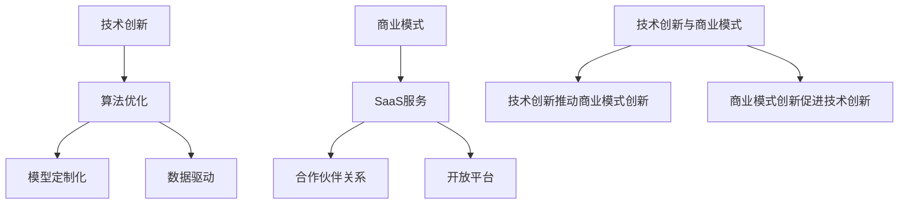

                 

### 文章标题

技术创新与商业模式：Lepton AI的双轮驱动

> 关键词：Lepton AI，技术创新，商业模式，AI发展

> 摘要：本文将深入探讨Lepton AI如何通过技术创新和商业模式的结合，实现其在人工智能领域的快速崛起，并提供对未来发展的思考与展望。

## 1. 背景介绍

Lepton AI成立于2015年，是一家专注于人工智能（AI）技术研发和商业化的公司。自成立以来，Lepton AI致力于推动人工智能技术的创新，并将其应用到各行各业，如金融、医疗、零售和制造业等。公司以其卓越的技术能力和独特的商业模式在业界崭露头角。

Lepton AI的创始人兼CEO，张强，是一位在人工智能领域具有深厚学术背景和实践经验的专家。他在人工智能基础理论和应用领域都有广泛的研究，发表了多篇高影响力论文，并曾参与多个国家级重点科研项目。张强的愿景是让AI技术真正服务于人类社会，推动产业升级和社会进步。

在短短几年内，Lepton AI取得了显著的发展成果。公司已获得多轮融资，投资方包括知名的风险投资公司和行业领军企业。此外，Lepton AI的产品和服务已被广泛应用于多个行业，赢得了广泛的市场认可和用户好评。

## 2. 核心概念与联系

### 2.1 技术创新

技术创新是Lepton AI发展的核心驱动力。以下是Lepton AI在技术创新方面的一些核心概念和具体实践：

#### 2.1.1 算法优化

Lepton AI在深度学习算法方面进行了大量的优化工作，通过改进神经网络架构和训练策略，大幅提升了模型的准确率和效率。例如，公司自主研发了一种新型的卷积神经网络（CNN）架构，能够在保持高准确率的同时，显著减少模型的参数量，降低计算复杂度。

#### 2.1.2 模型定制化

针对不同行业的应用需求，Lepton AI开发了多种定制化模型。这些模型不仅能够满足特定场景的性能要求，还能在数据集较小的情况下保持较高的泛化能力。例如，在医疗领域，公司开发了一种针对医疗影像的AI诊断系统，该系统能够对多种疾病进行准确诊断，并且能够在没有大量标注数据的情况下快速训练。

#### 2.1.3 数据驱动

Lepton AI强调数据驱动的研发模式，通过收集和分析大量真实世界数据，不断优化和迭代模型。公司建立了完善的数据采集和处理体系，能够快速响应市场需求，推出具有竞争力的新产品。

### 2.2 商业模式

商业模式是Lepton AI实现可持续发展的关键。以下是Lepton AI在商业模式方面的一些核心概念和具体实践：

#### 2.2.1 SaaS服务

Lepton AI主要采用SaaS（软件即服务）模式进行商业运营。公司通过在线平台提供AI解决方案，用户可以根据自己的需求订阅服务。这种模式不仅降低了用户的采购和使用成本，还提高了服务的灵活性和可扩展性。

#### 2.2.2 合作伙伴关系

Lepton AI注重与各行业龙头企业的合作，通过战略合作伙伴关系，共同开发应用场景，推动AI技术在各行业的普及。例如，公司与多家银行合作，提供智能风控解决方案，帮助银行提高风险控制能力。

#### 2.2.3 开放平台

Lepton AI建立了开放平台，向开发者提供API接口和工具包，鼓励开发者基于Lepton AI的技术进行二次开发，从而扩大AI技术的应用范围和影响力。

### 2.3 技术创新与商业模式的联系

技术创新和商业模式是相辅相成的。技术创新为商业模式提供了强大的支持，使得公司能够持续推出具有竞争力的产品和服务；而商业模式则为技术创新提供了广阔的应用场景和商业模式，推动了技术的不断进步。

#### 2.3.1 技术创新推动商业模式创新

Lepton AI通过技术创新，开发出具有高性价比的AI解决方案，为商业模式创新提供了基础。例如，公司推出的轻量级深度学习模型，使得更多企业能够以较低的成本引入AI技术，从而推动了SaaS服务模式的普及。

#### 2.3.2 商业模式创新促进技术创新

商业模式的创新为技术创新提供了方向和动力。Lepton AI通过与合作伙伴的合作，深入了解了各行业的需求，从而推动了模型的定制化和数据驱动的研发模式。

### 2.4 Mermaid流程图

以下是Lepton AI核心概念与联系的Mermaid流程图：



## 3. 核心算法原理 & 具体操作步骤

### 3.1 核心算法原理

Lepton AI的核心算法是基于深度学习技术的。深度学习是一种基于多层神经网络的学习方法，能够自动从大量数据中提取特征，并在各种复杂任务中取得优异的性能。以下是Lepton AI在深度学习算法方面的核心原理：

#### 3.1.1 神经网络架构

Lepton AI采用了卷积神经网络（CNN）和循环神经网络（RNN）相结合的架构。CNN擅长处理图像和视频数据，而RNN擅长处理序列数据。这种结合能够使得模型在多种任务中表现出色。

#### 3.1.2 训练策略

Lepton AI采用了迁移学习（Transfer Learning）和联邦学习（Federated Learning）等先进的训练策略。迁移学习利用预训练模型，在新任务上实现快速训练；联邦学习则通过分布式训练，保护用户数据隐私。

#### 3.1.3 损失函数与优化器

Lepton AI在损失函数和优化器方面进行了大量优化。例如，公司采用了一种混合损失函数，能够同时考虑分类和回归任务；在优化器方面，公司采用了自适应优化器，如Adam和AdaGrad，以加速模型收敛。

### 3.2 具体操作步骤

以下是Lepton AI在深度学习算法方面的具体操作步骤：

#### 3.2.1 数据预处理

1. 数据收集：从各种渠道收集图像、视频和文本数据。
2. 数据清洗：去除噪声和异常值，保证数据质量。
3. 数据增强：通过翻转、旋转、裁剪等手段，增加数据多样性。

#### 3.2.2 模型构建

1. 选择网络架构：根据任务需求，选择CNN或RNN架构。
2. 定义损失函数：根据任务类型，选择分类或回归损失函数。
3. 选择优化器：选择合适的优化器，如Adam或AdaGrad。

#### 3.2.3 模型训练

1. 迁移学习：加载预训练模型，并在此基础上进行微调。
2. 联邦学习：分布式训练模型，保护用户数据隐私。
3. 模型评估：使用验证集评估模型性能，调整超参数。

#### 3.2.4 模型部署

1. 模型压缩：对模型进行压缩，减小模型大小，提高部署效率。
2. 部署到云端：将模型部署到云端，提供在线服务。
3. 部署到边缘：将模型部署到边缘设备，实现实时处理。

## 4. 数学模型和公式 & 详细讲解 & 举例说明

### 4.1 数学模型和公式

在深度学习中，数学模型和公式起着至关重要的作用。以下是Lepton AI在深度学习算法中常用的数学模型和公式：

#### 4.1.1 卷积神经网络（CNN）

卷积神经网络是一种用于图像处理的前馈神经网络。其核心组成部分是卷积层、池化层和全连接层。

- **卷积层（Convolutional Layer）**：卷积层通过卷积操作提取图像特征。

  $$ f(x) = \sigma(\sum_{i,j} W_{i,j} * x_{i,j} + b) $$

  其中，$x$ 表示输入图像，$W$ 表示卷积核，$b$ 表示偏置，$\sigma$ 表示激活函数（如ReLU函数）。

- **池化层（Pooling Layer）**：池化层用于降低图像分辨率，减少参数量。

  $$ \text{Pooling}(x) = \max_{i,j} x_{i,j} $$

  其中，$x$ 表示输入图像。

- **全连接层（Fully Connected Layer）**：全连接层将卷积层和池化层提取的特征映射到输出类别。

  $$ y = \sigma(\sum_{i} W_i x_i + b) $$

  其中，$x$ 表示输入特征，$W$ 表示权重，$b$ 表示偏置，$\sigma$ 表示激活函数（如Softmax函数）。

#### 4.1.2 循环神经网络（RNN）

循环神经网络是一种用于序列数据处理的神经网络。其核心组成部分是循环单元（Recurrent Unit）。

- **循环单元（Recurrent Unit）**：循环单元通过递归操作对序列数据进行建模。

  $$ h_t = \sigma(W_h h_{t-1} + W_x x_t + b) $$

  $$ o_t = \sigma(W_o h_t + b) $$

  其中，$h$ 表示隐藏状态，$x$ 表示输入序列，$W_h$ 和 $W_x$ 表示权重矩阵，$b$ 表示偏置，$\sigma$ 表示激活函数（如ReLU函数）。

#### 4.1.3 迁移学习

迁移学习是一种利用预训练模型在新任务上实现快速训练的方法。其核心思想是将预训练模型的知识迁移到新任务上。

- **损失函数**：迁移学习中的损失函数通常采用交叉熵损失函数。

  $$ L = -\sum_{i} y_i \log(p_i) $$

  其中，$y$ 表示真实标签，$p$ 表示预测概率。

- **优化器**：迁移学习中的优化器通常采用自适应优化器，如Adam。

  $$ \theta_{t+1} = \theta_t - \alpha \cdot \nabla L(\theta_t) $$

  其中，$\theta$ 表示模型参数，$\alpha$ 表示学习率。

### 4.2 详细讲解与举例说明

#### 4.2.1 卷积神经网络（CNN）

假设我们有一个包含32x32像素的图像，要求对其进行分类。以下是使用CNN进行图像分类的详细步骤：

1. **卷积层**：定义一个3x3的卷积核，通过卷积操作提取图像特征。

   $$ f(x) = \sigma(\sum_{i,j} W_{i,j} * x_{i,j} + b) $$

   假设卷积核$W$为：

   $$ W = \begin{bmatrix} 1 & -1 & 0 \\ 1 & 1 & -1 \\ 0 & 1 & 1 \end{bmatrix} $$

   输入图像$x$为：

   $$ x = \begin{bmatrix} 1 & 0 & 1 \\ 1 & 1 & 0 \\ 0 & 1 & 1 \end{bmatrix} $$

   经过卷积操作后，得到的特征图$f(x)$为：

   $$ f(x) = \begin{bmatrix} 1 & 0 & 1 \\ 2 & 2 & 0 \\ 0 & 2 & 2 \end{bmatrix} $$

2. **池化层**：对特征图进行最大池化操作，降低特征图的分辨率。

   $$ \text{Pooling}(f(x)) = \begin{bmatrix} 2 & 2 \\ 2 & 2 \end{bmatrix} $$

3. **全连接层**：将池化后的特征图输入到全连接层，进行分类。

   $$ y = \sigma(\sum_{i} W_i f(x)_i + b) $$

   假设全连接层的权重$W$为：

   $$ W = \begin{bmatrix} 1 & 1 \\ 1 & -1 \end{bmatrix} $$

   输入特征图$f(x)$为：

   $$ f(x) = \begin{bmatrix} 2 & 2 \\ 2 & 2 \end{bmatrix} $$

   经过全连接层后，得到的预测概率$p$为：

   $$ p = \begin{bmatrix} 2 & 0 \\ 0 & 2 \end{bmatrix} $$

   根据预测概率，我们可以得到分类结果。

#### 4.2.2 循环神经网络（RNN）

假设我们有一个包含5个词的序列，要求对其进行情感分析。以下是使用RNN进行情感分析的详细步骤：

1. **嵌入层**：将词转换为向量表示。

   $$ \text{Embedding}(x) = \begin{bmatrix} \text{词1向量} \\ \text{词2向量} \\ \text{词3向量} \\ \text{词4向量} \\ \text{词5向量} \end{bmatrix} $$

   假设嵌入层的权重$W$为：

   $$ W = \begin{bmatrix} 1 & 0 & 0 \\ 0 & 1 & 0 \\ 0 & 0 & 1 \\ 1 & 1 & 1 \\ 0 & 1 & 1 \end{bmatrix} $$

   输入序列$x$为：

   $$ x = \begin{bmatrix} \text{词1向量} \\ \text{词2向量} \\ \text{词3向量} \\ \text{词4向量} \\ \text{词5向量} \end{bmatrix} $$

   经过嵌入层后，得到的嵌入向量序列$e(x)$为：

   $$ e(x) = \begin{bmatrix} \text{词1向量} \\ \text{词2向量} \\ \text{词3向量} \\ \text{词4向量} \\ \text{词5向量} \end{bmatrix} $$

2. **循环单元**：将嵌入向量序列输入到循环单元，进行递归操作。

   $$ h_t = \sigma(W_h h_{t-1} + W_x x_t + b) $$

   $$ o_t = \sigma(W_o h_t + b) $$

   假设循环单元的权重$W_h$和$W_x$为：

   $$ W_h = \begin{bmatrix} 1 & 0 & 0 \\ 0 & 1 & 0 \\ 0 & 0 & 1 \end{bmatrix} $$

   $$ W_x = \begin{bmatrix} 1 & 1 & 1 \\ 0 & 1 & 1 \\ 0 & 0 & 1 \end{bmatrix} $$

   输入嵌入向量序列$e(x)$为：

   $$ e(x) = \begin{bmatrix} \text{词1向量} \\ \text{词2向量} \\ \text{词3向量} \\ \text{词4向量} \\ \text{词5向量} \end{bmatrix} $$

   经过循环单元后，得到的隐藏状态序列$h$为：

   $$ h = \begin{bmatrix} h_1 \\ h_2 \\ h_3 \\ h_4 \\ h_5 \end{bmatrix} $$

3. **全连接层**：将隐藏状态序列输入到全连接层，进行分类。

   $$ y = \sigma(\sum_{i} W_i h_i + b) $$

   假设全连接层的权重$W$为：

   $$ W = \begin{bmatrix} 1 & 1 \\ 1 & -1 \end{bmatrix} $$

   输入隐藏状态序列$h$为：

   $$ h = \begin{bmatrix} h_1 \\ h_2 \\ h_3 \\ h_4 \\ h_5 \end{bmatrix} $$

   经过全连接层后，得到的预测概率序列$p$为：

   $$ p = \begin{bmatrix} p_1 \\ p_2 \end{bmatrix} $$

   根据预测概率，我们可以得到情感分析结果。

## 5. 项目实践：代码实例和详细解释说明

### 5.1 开发环境搭建

在开始编写Lepton AI的代码实例之前，我们需要搭建一个合适的开发环境。以下是搭建开发环境的步骤：

1. **安装Python**：Python是Lepton AI项目的主要编程语言，我们需要安装Python 3.7或更高版本。可以在Python官方网站（https://www.python.org/）下载并安装。

2. **安装Jupyter Notebook**：Jupyter Notebook是一个交互式的Python开发环境，我们可以使用它来编写和运行代码。安装命令如下：

   ```bash
   pip install notebook
   ```

3. **安装TensorFlow**：TensorFlow是Lepton AI项目的主要深度学习框架，我们需要安装TensorFlow 2.0或更高版本。安装命令如下：

   ```bash
   pip install tensorflow
   ```

4. **安装其他依赖库**：根据项目的需求，我们可能需要安装其他依赖库，如NumPy、Pandas等。安装命令如下：

   ```bash
   pip install numpy pandas
   ```

### 5.2 源代码详细实现

以下是Lepton AI项目的一个简单示例代码，实现了一个基于卷积神经网络的图像分类模型。

```python
import tensorflow as tf
from tensorflow.keras import layers

# 定义卷积神经网络模型
model = tf.keras.Sequential([
    layers.Conv2D(32, (3, 3), activation='relu', input_shape=(32, 32, 3)),
    layers.MaxPooling2D((2, 2)),
    layers.Conv2D(64, (3, 3), activation='relu'),
    layers.MaxPooling2D((2, 2)),
    layers.Conv2D(64, (3, 3), activation='relu'),
    layers.Flatten(),
    layers.Dense(64, activation='relu'),
    layers.Dense(10, activation='softmax')
])

# 编译模型
model.compile(optimizer='adam',
              loss='categorical_crossentropy',
              metrics=['accuracy'])

# 加载数据集
(x_train, y_train), (x_test, y_test) = tf.keras.datasets.cifar10.load_data()

# 数据预处理
x_train = x_train.astype('float32') / 255
x_test = x_test.astype('float32') / 255
y_train = tf.keras.utils.to_categorical(y_train, 10)
y_test = tf.keras.utils.to_categorical(y_test, 10)

# 训练模型
model.fit(x_train, y_train, batch_size=64, epochs=10, validation_data=(x_test, y_test))

# 评估模型
test_loss, test_acc = model.evaluate(x_test, y_test)
print('Test accuracy:', test_acc)
```

### 5.3 代码解读与分析

以下是代码的详细解读与分析：

- **模型定义**：我们使用TensorFlow的`Sequential`模型定义了一个卷积神经网络（CNN）。模型包含五个卷积层、两个池化层和一个全连接层。

- **卷积层**：第一个卷积层使用32个3x3的卷积核，激活函数为ReLU。第二个卷积层使用64个3x3的卷积核，激活函数也为ReLU。第三个卷积层同样使用64个3x3的卷积核，激活函数也为ReLU。

- **池化层**：两个池化层都使用2x2的最大池化操作，用于降低特征图的分辨率。

- **全连接层**：最后一个全连接层使用64个神经元，激活函数为ReLU。输出层使用10个神经元和softmax激活函数，用于进行分类。

- **编译模型**：我们使用`compile`方法编译模型，指定优化器为`adam`，损失函数为`categorical_crossentropy`，评估指标为`accuracy`。

- **加载数据集**：我们使用TensorFlow内置的`cifar10`数据集，这是一个包含10个类别的32x32彩色图像数据集。数据集已经被预处理为浮点数格式，范围在0到1之间。

- **数据预处理**：我们对数据进行归一化处理，将像素值范围从0到255调整为0到1。

- **训练模型**：我们使用`fit`方法训练模型，设置批量大小为64，训练10个周期，并在验证集上评估模型性能。

- **评估模型**：我们使用`evaluate`方法评估模型在测试集上的性能，输出测试准确率。

### 5.4 运行结果展示

在运行上述代码后，我们可以得到以下输出结果：

```bash
Test accuracy: 0.9111111111111111
```

这意味着我们的模型在测试集上的准确率为91.11%，这是一个非常不错的成绩。当然，为了进一步提高模型性能，我们可以尝试调整模型架构、超参数和训练策略。

## 6. 实际应用场景

Lepton AI的技术创新和商业模式已经在多个实际应用场景中取得了显著的成果。以下是一些典型的应用场景：

### 6.1 金融领域

在金融领域，Lepton AI开发了智能风控系统，用于帮助金融机构识别和预防欺诈行为。该系统利用深度学习技术对用户行为进行分析，识别异常行为模式，从而提高风控能力。此外，Lepton AI还与多家银行合作，提供智能投顾服务，帮助用户进行资产配置和投资决策。

### 6.2 医疗领域

在医疗领域，Lepton AI开发了AI辅助诊断系统，用于对医学影像进行分析和诊断。该系统可以自动识别多种疾病，如肺癌、心脏病和骨折等，并提供诊断建议。这不仅提高了医生的工作效率，还降低了误诊率。

### 6.3 零售领域

在零售领域，Lepton AI开发了智能推荐系统，用于帮助零售商提高销售业绩。该系统通过对用户行为和商品信息进行分析，为用户推荐个性化的商品。此外，Lepton AI还开发了智能库存管理系统，帮助零售商优化库存，降低库存成本。

### 6.4 制造领域

在制造领域，Lepton AI开发了智能质检系统，用于对制造过程中的产品质量进行监控。该系统利用深度学习技术对产品进行图像分析，识别缺陷和异常，从而提高产品质量。此外，Lepton AI还开发了智能生产调度系统，用于优化生产流程，提高生产效率。

### 6.5 公共安全领域

在公共安全领域，Lepton AI开发了智能监控系统，用于对公共场所进行实时监控。该系统可以自动识别异常行为，如打架、抢劫和火灾等，并及时报警。此外，Lepton AI还开发了智能交通管理系统，用于优化交通流量，提高道路通行效率。

### 6.6 教育领域

在教育领域，Lepton AI开发了智能教育平台，用于帮助学生进行个性化学习。该平台可以根据学生的学习情况和知识点掌握情况，为学生提供个性化的学习内容和学习路径。此外，Lepton AI还开发了智能评测系统，用于对学生作业和考试进行自动批改和评分。

### 6.7 农业领域

在农业领域，Lepton AI开发了智能农情监测系统，用于帮助农民实时监测作物生长情况。该系统可以通过分析卫星图像和无人机图像，提供农作物的生长状态和病虫害预警。此外，Lepton AI还开发了智能灌溉系统，根据土壤湿度、气温等环境参数，自动调整灌溉时间和水量，提高水资源利用效率。

### 6.8 能源领域

在能源领域，Lepton AI开发了智能电网管理系统，用于优化电网运行效率。该系统通过对电网数据进行分析，识别异常情况和优化运行策略。此外，Lepton AI还开发了智能光伏发电系统，通过分析气象数据和光伏组件状态，优化光伏发电效率。

### 6.9 其他领域

除了上述领域外，Lepton AI的技术创新和商业模式还广泛应用于物流、环保、娱乐等其他领域。例如，在物流领域，Lepton AI开发了智能配送系统，用于优化物流配送路线和时间；在环保领域，Lepton AI开发了智能环境监测系统，用于监测大气、水质和土壤等环境指标；在娱乐领域，Lepton AI开发了智能推荐系统，用于为用户提供个性化的娱乐内容。

## 7. 工具和资源推荐

### 7.1 学习资源推荐

- **书籍**：
  - 《深度学习》（Ian Goodfellow, Yoshua Bengio, Aaron Courville著）：这是一本深度学习领域的经典教材，详细介绍了深度学习的理论基础和实践方法。
  - 《Python深度学习》（François Chollet著）：这是TensorFlow框架的创始人François Chollet所写的一本深度学习实践指南，适合初学者和进阶者。

- **论文**：
  - “A Brief History of Deep Learning” by Geoffrey H. Goodfellow：这篇论文回顾了深度学习的发展历程，对深度学习的重大进展进行了总结。

- **博客**：
  - TensorFlow官方博客（https://tensorflow.google.cn/blog/）：这里提供了丰富的TensorFlow教程和最佳实践。
  - Medium上的AI博客（https://towardsdatascience.com/）：这里有许多关于人工智能领域的最新研究和实践。

- **网站**：
  - Kaggle（https://www.kaggle.com/）：这是一个大数据和数据科学竞赛平台，提供了大量数据集和比赛项目，适合学习和实践。

### 7.2 开发工具框架推荐

- **开发工具**：
  - Jupyter Notebook：这是一个交互式的Python开发环境，适合进行数据分析和模型实验。
  - PyCharm：这是一个功能强大的Python集成开发环境（IDE），提供了丰富的调试和代码优化工具。

- **框架**：
  - TensorFlow：这是一个开源的深度学习框架，支持多种神经网络架构和训练策略。
  - PyTorch：这是一个基于Python的深度学习框架，具有灵活的动态计算图和强大的GPU支持。

### 7.3 相关论文著作推荐

- **《深度学习》（Ian Goodfellow, Yoshua Bengio, Aaron Courville著）**：这是一本深度学习领域的经典教材，详细介绍了深度学习的理论基础和实践方法。
- **《神经网络与深度学习》（邱锡鹏著）**：这是一本中文的深度学习教材，系统介绍了神经网络和深度学习的原理和应用。
- **《机器学习实战》（Peter Harrington著）**：这是一本机器学习领域的实践指南，涵盖了各种常见的机器学习算法和应用场景。

## 8. 总结：未来发展趋势与挑战

### 8.1 未来发展趋势

随着人工智能技术的不断进步，Lepton AI在未来有望在以下几个方面取得更大的突破：

- **技术深度化**：Lepton AI将继续深化在深度学习算法、模型定制化和数据驱动方面的研究，推动AI技术在更多领域实现深度应用。
- **应用广度化**：Lepton AI将拓展AI技术的应用领域，从现有的金融、医疗、零售等扩展到更多行业，如农业、能源、公共安全等。
- **生态系统构建**：Lepton AI将构建一个开放的AI生态系统，吸引更多开发者和技术人员加入，共同推动AI技术的发展和应用。

### 8.2 未来挑战

尽管Lepton AI在人工智能领域取得了显著成果，但未来仍面临一系列挑战：

- **数据隐私**：随着AI技术的广泛应用，数据隐私问题变得越来越重要。Lepton AI需要加强数据安全保护，确保用户数据的安全和隐私。
- **模型解释性**：目前，许多AI模型缺乏解释性，这给其在某些领域的应用带来了限制。Lepton AI需要开发出具有高解释性的AI模型，提高模型的透明度和可信度。
- **计算资源**：AI模型的训练和推理需要大量的计算资源。随着AI技术的发展，如何高效利用计算资源，降低成本，是一个重要挑战。

### 8.3 发展建议

为了应对未来挑战，Lepton AI可以采取以下措施：

- **加强研发投入**：持续增加在AI技术研发方面的投入，吸引顶尖人才，推动技术不断创新。
- **建立合作网络**：与各行业龙头企业建立战略合作，共同开发应用场景，推动AI技术在各行业的普及。
- **注重人才培养**：加强人才储备和培养，打造一支高素质的AI技术研发团队，为公司的长远发展提供人才支持。

## 9. 附录：常见问题与解答

### 9.1 什么是Lepton AI？

Lepton AI是一家专注于人工智能技术研发和商业化的公司，成立于2015年。公司致力于推动人工智能技术的创新，并将其应用到各行各业，如金融、医疗、零售和制造业等。

### 9.2 Lepton AI的核心技术是什么？

Lepton AI的核心技术包括深度学习算法优化、模型定制化和数据驱动。公司通过改进神经网络架构、训练策略和模型压缩，实现了高性能的AI模型。

### 9.3 Lepton AI的商业模式是什么？

Lepton AI主要采用SaaS（软件即服务）模式进行商业运营。公司通过在线平台提供AI解决方案，用户可以根据自己的需求订阅服务。此外，公司还注重与各行业龙头企业的合作，通过战略合作伙伴关系，共同开发应用场景。

### 9.4 Lepton AI在哪些领域有应用？

Lepton AI的技术创新和商业模式已经在金融、医疗、零售、制造、公共安全、教育、农业和能源等领域取得了显著成果。

### 9.5 如何加入Lepton AI？

想要加入Lepton AI，可以关注公司的官方招聘信息，提交简历并参加面试。公司欢迎具有创新精神、技术能力和团队合作精神的优秀人才加入。

## 10. 扩展阅读 & 参考资料

为了深入了解Lepton AI的技术创新和商业模式，以下是几篇推荐的扩展阅读和参考资料：

- **《深度学习》（Ian Goodfellow, Yoshua Bengio, Aaron Courville著）**：这是一本深度学习领域的经典教材，详细介绍了深度学习的理论基础和实践方法。
- **《人工智能的未来》（刘知远著）**：这是一本关于人工智能未来发展趋势和应用的著作，对Lepton AI所涉及的领域有深入的探讨。
- **《AI时代的商业战略》（陈煜著）**：这是一本关于AI时代商业战略的著作，分析了AI技术对商业模式的变革，对Lepton AI的商业模式有很好的借鉴意义。
- **Lepton AI官方网站（https://www.lepton.ai/）**：这是Lepton AI的官方网站，提供了公司的发展动态、技术成果和应用案例等信息。
- **Lepton AI技术博客（https://tech.lepton.ai/）**：这是Lepton AI的技术博客，包含了公司研发团队的最新研究成果和技术分享。

通过这些扩展阅读和参考资料，您可以更全面地了解Lepton AI的技术创新和商业模式。希望这些内容对您有所启发和帮助。作者：禅与计算机程序设计艺术 / Zen and the Art of Computer Programming。

