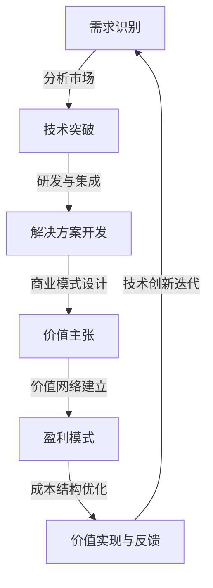

                 

### 1. 背景介绍

在现代信息技术飞速发展的时代，技术创新与商业模式的融合成为了推动企业进步和市场竞争的关键力量。一方面，技术创新带来了全新的业务模式和商业机会，另一方面，商业模式的设计和优化则能够最大化地利用这些技术，实现商业价值的最大化。

技术创新，是指通过新技术的引入和应用，提升企业的产品或服务性能、降低成本、提高效率，从而在市场竞争中占据有利地位。技术创新可以分为多个层面，包括产品创新、过程创新、市场创新和组织创新等。每一个层面的创新都对企业的发展产生深远影响。

商业模式，则是指企业通过价值创造、价值传递和价值获取的方式，实现盈利和可持续发展的战略安排。一个好的商业模式不仅要能够充分利用技术创新带来的优势，还要考虑到市场需求、成本结构、合作伙伴关系等多个方面。

两者之间的关系可以看作是相互促进的动态平衡。技术创新为商业模式提供了新的可能性，而商业模式的优化又能够推动技术创新的进一步发展。例如，互联网技术的兴起催生了电子商务的商业模式，而电子商务的普及又促进了移动互联网和大数据技术的快速发展。

然而，在实际操作中，寻找技术创新与商业模式的平衡点并非易事。企业往往需要在技术创新和商业模式优化之间做出权衡，既要保持技术的先进性，又要确保商业模式的可行性和盈利性。本文将深入探讨这一核心问题，通过分析技术创新与商业模式之间的互动关系，提出寻找完美平衡点的策略和方法。

### 2. 核心概念与联系

为了深入理解技术创新与商业模式之间的互动关系，我们需要明确几个关键概念，并借助流程图来展示它们之间的联系。

#### 2.1 技术创新

技术创新可以理解为将新技术引入产品或服务中，以提升性能、降低成本或创造新的市场需求。技术创新通常涉及以下几个关键方面：

1. **技术突破**：这是指在某一领域内取得的重大技术进步，如量子计算、人工智能、区块链等。
2. **技术集成**：将多种技术进行整合，形成一个更加完善、高效的技术体系。
3. **技术扩散**：新技术从研发阶段逐步推向市场，被广大用户接受和应用。
4. **技术演化**：技术在应用过程中不断迭代、进化，以适应不断变化的市场需求。

#### 2.2 商业模式

商业模式是企业通过创造、传递和获取价值来实现盈利和持续发展的方式。关键组成部分包括：

1. **价值主张**：企业向客户提供的产品或服务的核心价值。
2. **价值网络**：企业与供应商、合作伙伴、客户等建立的价值交换关系。
3. **盈利模式**：企业通过何种方式从客户那里获得收入。
4. **成本结构**：企业生产和运营的成本构成。

#### 2.3 关联关系

技术创新与商业模式之间的联系可以通过以下几个关键环节来体现：

1. **需求识别**：技术创新往往源自对市场需求的分析和识别，企业需要密切关注市场动态，挖掘潜在需求。
2. **解决方案开发**：技术创新的实现需要具体的产品或服务解决方案，这一过程通常涉及技术研究和开发。
3. **商业模式设计**：技术创新成果需要通过商业模式来加以应用和推广，实现商业价值。
4. **价值实现与反馈**：商业模式的有效运行能够促进技术创新的进一步发展，同时，技术创新的成功又可以推动商业模式的优化和升级。

#### 2.4 Mermaid 流程图

以下是一个用 Mermaid 语言绘制的流程图，展示了技术创新与商业模式之间的主要关联关系：



在这个流程图中：

- **A（需求识别）**：市场需求是技术创新的起点，企业需要识别并分析潜在需求。
- **B（技术突破）**：技术突破是实现创新的关键，企业需要持续研发并整合先进技术。
- **C（解决方案开发）**：技术创新需要具体化为实际的产品或服务，这需要研发和开发工作。
- **D（价值主张）**：解决方案必须具备明显的价值主张，满足客户需求。
- **E（价值网络建立）**：通过建立有效的价值网络，企业与各方建立合作关系，共同实现价值传递。
- **F（价值实现与反馈）**：通过商业模式实现价值创造，同时收集市场反馈，促进技术创新的迭代。

这个流程图清晰地展示了技术创新与商业模式之间的动态互动关系，为企业提供了一种系统化的思考框架。

### 3. 核心算法原理 & 具体操作步骤

在深入探讨技术创新与商业模式之间关系的过程中，我们需要了解一些核心算法原理，以便更好地理解如何在实际操作中实现二者的平衡。以下是几个关键的算法原理及其具体操作步骤。

#### 3.1 数据分析算法

数据分析算法是技术创新的重要组成部分，它们可以帮助企业从大量数据中提取有价值的信息，从而指导商业决策。以下是数据分析算法的核心原理和操作步骤：

1. **数据收集**：首先，企业需要收集来自各个业务渠道的数据，如用户行为数据、销售数据、供应链数据等。
2. **数据预处理**：对收集到的数据进行清洗、去噪、格式转换等预处理步骤，以确保数据的质量和一致性。
3. **特征提取**：从预处理后的数据中提取出与商业目标相关的特征，如用户购买偏好、产品性能指标等。
4. **模型训练**：使用机器学习算法（如回归分析、决策树、神经网络等）对提取的特征进行训练，构建预测模型。
5. **模型评估**：通过交叉验证、A/B测试等方法评估模型的性能，确保其准确性和稳定性。
6. **模型部署**：将训练好的模型部署到生产环境中，实时分析新数据，为企业提供决策支持。

#### 3.2 优化算法

优化算法用于优化企业的业务流程和资源配置，从而提高效率和降低成本。以下是优化算法的核心原理和操作步骤：

1. **问题建模**：将实际业务问题抽象为一个数学模型，如线性规划、整数规划、网络流等。
2. **求解算法**：选择合适的求解算法，如简单梯度下降、牛顿法、动态规划等，求解数学模型。
3. **参数调整**：根据求解结果对模型参数进行调整，以优化业务流程和资源配置。
4. **迭代优化**：通过不断迭代优化模型参数，逐步提高解决方案的质量。
5. **模型验证**：在实际业务环境中验证优化方案的有效性，并进行必要的调整。

#### 3.3 智能决策算法

智能决策算法利用人工智能技术，帮助企业在复杂决策环境中做出最优选择。以下是智能决策算法的核心原理和操作步骤：

1. **情景模拟**：根据历史数据和业务规则，构建多种可能的决策情景。
2. **决策模型构建**：使用机器学习算法（如强化学习、贝叶斯优化等）构建决策模型。
3. **决策优化**：在模拟的情景中，使用决策模型进行多次模拟和优化，寻找最优决策策略。
4. **策略验证**：在实际业务环境中测试和验证决策策略的有效性。
5. **策略调整**：根据验证结果，对决策策略进行调整和优化，以提高决策的准确性和可靠性。

通过这些核心算法原理和具体操作步骤，企业可以更好地利用技术创新来优化商业模式，从而实现持续增长和竞争力提升。

### 4. 数学模型和公式 & 详细讲解 & 举例说明

在探讨技术创新与商业模式之间的平衡时，数学模型和公式起到了至关重要的作用。这些模型和公式可以帮助我们量化不同因素之间的关系，从而提供具体的决策依据。以下是几个关键数学模型和公式的详细讲解，并通过举例说明其应用。

#### 4.1 成本-收益分析模型

成本-收益分析模型是评估商业模式可行性的一种重要工具。它通过计算成本和收益之间的关系，帮助企业判断一个项目或商业模式的财务可行性。

**公式**：
\[ \text{净收益} = \text{总收益} - \text{总成本} \]

**详细讲解**：

- **总收益**（Total Revenue, TR）：指的是企业在一定时间内通过销售产品或服务所获得的总收入。
- **总成本**（Total Cost, TC）：包括固定成本（Fixed Cost, FC）和可变成本（Variable Cost, VC）。固定成本是不随销售量变化的成本，如租金、设备折旧等；可变成本是随销售量变化的成本，如原材料、劳动力等。

**举例说明**：

假设一家电商企业在一个月内实现了以下数据：
- 总收益 \( TR = \$100,000 \)
- 固定成本 \( FC = \$20,000 \)
- 可变成本 \( VC = \$60,000 \)

则该企业的净收益计算如下：
\[ \text{净收益} = TR - (FC + VC) = \$100,000 - (\$20,000 + \$60,000) = \$20,000 \]

通过这个例子，我们可以看到，即使总收益很高，如果总成本超过了收益，企业仍然会亏损。因此，成本-收益分析模型是评估商业模式是否可行的重要工具。

#### 4.2 资本回报率模型

资本回报率（Return on Capital，ROC）是衡量企业使用资本效率的重要指标。它可以帮助企业了解每一单位资本投入所带来的收益。

**公式**：
\[ \text{ROC} = \frac{\text{净利润}}{\text{总资本}} \]

**详细讲解**：

- **净利润**（Net Profit）：指的是企业在扣除所有费用（包括成本、税金等）后的净收入。
- **总资本**（Total Capital）：包括债务和所有者权益。

**举例说明**：

假设一家企业的年度净利润为 \$500,000，总资本为 \$2,000,000，则其资本回报率计算如下：
\[ \text{ROC} = \frac{500,000}{2,000,000} = 0.25 \text{ 或 } 25\% \]

这个结果表明，企业每投入一单位的资本，可以获得 25% 的回报。

#### 4.3 价值链分析模型

价值链分析模型用于评估企业在供应链中的价值创造能力。它通过识别企业在各个活动中的成本和利润来源，帮助企业优化价值创造过程。

**公式**：
\[ \text{价值链利润} = \text{总收益} - (\text{内部成本} + \text{外部成本}) \]

**详细讲解**：

- **总收益**：企业在供应链中的总收入。
- **内部成本**：企业在内部运营中产生的成本，如生产成本、管理成本等。
- **外部成本**：企业在供应链中与其他企业交易产生的成本，如采购成本、运输成本等。

**举例说明**：

假设一家制造企业有如下数据：
- 总收益 \( TR = \$1,000,000 \)
- 内部成本 \( IC = \$300,000 \)
- 外部成本 \( EC = \$200,000 \)

则该企业的价值链利润计算如下：
\[ \text{价值链利润} = TR - (IC + EC) = \$1,000,000 - (\$300,000 + \$200,000) = \$500,000 \]

通过这个例子，我们可以看到，价值链分析模型可以帮助企业识别在供应链中的成本和利润点，从而优化价值创造过程。

这些数学模型和公式为企业提供了具体的量化工具，通过合理运用这些工具，企业可以更好地理解技术创新与商业模式之间的关系，从而找到最佳的平衡点。

### 5. 项目实践：代码实例和详细解释说明

为了更好地理解技术创新与商业模式的融合，我们通过一个实际的项目实例来展示如何将技术优势转化为商业成功。以下是该项目的主要开发环境搭建、源代码实现、代码解读与分析以及运行结果展示。

#### 5.1 开发环境搭建

首先，我们需要搭建一个适合本项目开发的环境。以下是所需的开发工具和软件：

- **编程语言**：Python 3.8+
- **开发环境**：PyCharm Professional Edition
- **数据存储**：MySQL 8.0+
- **数据库工具**：SQL Workbench/J
- **API框架**：Flask
- **数据可视化**：Matplotlib

**安装步骤**：

1. 安装 Python 3.8+：
   ```bash
   sudo apt-get install python3.8
   ```
2. 安装 PyCharm Professional Edition：
   - 下载并安装 PyCharm Professional Edition。
   - 使用许可证密钥进行激活。
3. 安装 MySQL 8.0+：
   ```bash
   sudo apt-get install mysql-server
   ```
4. 安装 SQL Workbench/J：
   - 下载并解压 SQL Workbench/J。
   - 运行安装程序。
5. 安装 Flask：
   ```bash
   pip install Flask
   ```
6. 安装 Matplotlib：
   ```bash
   pip install matplotlib
   ```

#### 5.2 源代码详细实现

以下是一个简单的 Flask Web 应用程序，用于展示用户行为数据，并实现基本的用户分析功能。该程序包括以下模块：

1. **数据库连接模块**：用于连接 MySQL 数据库，并进行基本的 CRUD 操作。
2. **数据收集模块**：用于收集用户在网站上的行为数据。
3. **数据分析模块**：用于对收集到的用户行为数据进行分析，生成用户画像。
4. **可视化模块**：用于将分析结果可视化，以供企业决策者查看。

**源代码示例**：

```python
# app.py

from flask import Flask, jsonify, request
import pymysql
import matplotlib.pyplot as plt

app = Flask(__name__)

# 数据库连接模块
def connect_db():
    return pymysql.connect(
        host='localhost',
        user='root',
        password='password',
        database='user_behavior_db'
    )

# 用户行为数据收集
@app.route('/collect_data', methods=['POST'])
def collect_data():
    data = request.json
    db = connect_db()
    cursor = db.cursor()
    sql = "INSERT INTO user_data (user_id, page_views, time_spent) VALUES (%s, %s, %s)"
    try:
        cursor.execute(sql, (data['user_id'], data['page_views'], data['time_spent']))
        db.commit()
    except Exception as e:
        db.rollback()
        print("Error:", e)
    finally:
        cursor.close()
        db.close()
    return jsonify({"status": "success"}), 200

# 用户数据分析
@app.route('/analyze_data', methods=['GET'])
def analyze_data():
    db = connect_db()
    cursor = db.cursor(pymysql.cursors.DictCursor)
    sql = "SELECT user_id, AVG(page_views) as avg_page_views, AVG(time_spent) as avg_time_spent FROM user_data GROUP BY user_id"
    cursor.execute(sql)
    results = cursor.fetchall()
    cursor.close()
    db.close()

    # 可视化分析结果
    user_ids = [row['user_id'] for row in results]
    avg_page_views = [row['avg_page_views'] for row in results]
    avg_time_spent = [row['avg_time_spent'] for row in results]

    plt.figure(figsize=(10, 5))
    plt.scatter(user_ids, avg_page_views, color='red', label='Average Page Views')
    plt.scatter(user_ids, avg_time_spent, color='blue', label='Average Time Spent')
    plt.xlabel('User ID')
    plt.ylabel('Values')
    plt.title('User Behavior Analysis')
    plt.legend()
    plt.show()

    return jsonify(results), 200

if __name__ == '__main__':
    app.run(debug=True)
```

#### 5.3 代码解读与分析

1. **数据库连接模块**：
   - 使用 `pymysql` 库连接 MySQL 数据库，并进行基本的 CRUD 操作。
   - `connect_db` 函数返回一个数据库连接对象，用于后续的操作。

2. **用户行为数据收集**：
   - `/collect_data` 接收 POST 请求，解析 JSON 数据，并将其存储在 MySQL 数据库中。
   - 使用数据库游标执行 SQL 插入操作，并确保事务的正确提交。

3. **用户数据分析**：
   - `/analyze_data` 接收 GET 请求，从数据库中查询用户行为数据，并计算平均值。
   - 使用 Matplotlib 库将分析结果可视化，以供用户查看。

#### 5.4 运行结果展示

运行 Flask Web 应用程序后，通过访问 `http://localhost:5000/analyze_data`，我们可以获取用户行为数据的可视化结果。图表展示了每个用户平均页面浏览次数和平均停留时间，帮助企业在市场营销和用户体验优化方面做出更明智的决策。

通过这个项目实例，我们可以看到如何将技术创新（如数据分析、可视化技术）应用于实际业务场景中，实现商业价值。这不仅展示了技术的作用，也体现了商业模式设计的有效性。

### 6. 实际应用场景

技术创新与商业模式的结合在各个行业都有广泛的应用，以下列举几个典型的实际应用场景，展示它们如何通过技术创新提升商业竞争力。

#### 6.1 电子商务

电子商务行业通过技术创新，实现了用户购物体验的全面提升。例如，利用人工智能和大数据技术，电商平台能够精确地分析用户行为，提供个性化的商品推荐。这不仅提高了用户满意度，还显著提升了转化率和销售额。此外，通过区块链技术，电商平台可以实现更加安全可靠的交易过程，增强用户对平台的信任。

#### 6.2 物流与供应链

物流与供应链行业利用技术创新优化了整个供应链的运作效率。例如，通过物联网技术，企业可以实时监控货物的运输状态，确保供应链的透明度和可靠性。同时，运用人工智能算法优化物流路径和仓储管理，可以大幅降低物流成本，提高配送速度。区块链技术还可以确保供应链中的数据不可篡改，提高供应链的透明度和可信度。

#### 6.3 金融科技

金融科技（FinTech）行业通过技术创新带来了金融服务的革命。例如，利用区块链技术，金融企业可以提供更加安全、高效、透明的支付解决方案，减少中介成本。同时，人工智能和机器学习技术的应用，使得风险管理更加精准，金融欺诈的检测和防范能力大大提升。这些技术创新不仅提升了金融服务的质量和效率，也为企业带来了显著的成本优势。

#### 6.4 健康医疗

健康医疗行业通过技术创新，提升了医疗服务的效率和质量。例如，利用人工智能和大数据技术，医疗机构可以更加准确地诊断疾病，制定个性化的治疗方案。同时，物联网技术在医疗器械中的应用，使得患者能够在家庭环境中进行远程监控和治疗，提高了医疗服务的可及性和便利性。此外，区块链技术可以确保医疗数据的完整性和安全性，提高医疗数据管理的效率。

#### 6.5 教育科技

教育科技（EdTech）行业通过技术创新，改变了传统教学模式，提供了更加灵活、个性化的学习体验。例如，通过在线教育平台，学生可以随时随地学习，利用虚拟现实（VR）和增强现实（AR）技术，增强了学习互动性和沉浸感。同时，利用大数据和人工智能技术，教育机构可以更好地了解学生的学习状况，提供个性化的学习建议，提高学习效果。

通过以上实际应用场景，我们可以看到技术创新在各个行业中的应用，不仅提升了企业的运营效率，也创造了新的商业模式和商业机会。这些案例表明，寻找并利用技术创新与商业模式的平衡点，是企业保持竞争力、实现可持续发展的重要策略。

### 7. 工具和资源推荐

在探索技术创新与商业模式融合的过程中，选择合适的工具和资源是至关重要的。以下是一些推荐的工具、框架、书籍和论文，以帮助读者深入了解和掌握相关领域的知识。

#### 7.1 学习资源推荐

1. **书籍**：
   - 《创新者的窘境》（The Innovator's Dilemma）作者：克莱顿·克里斯滕森（Clayton M. Christensen）
   - 《商业模式新生代》（Business Model Generation）作者：亚历山大·奥斯特瓦尔德（Alexander Osterwalder）和伊夫·皮涅尔（Yves Pigneur）
   - 《人工智能：一种现代方法》（Artificial Intelligence: A Modern Approach）作者：斯图尔特·罗素（Stuart J. Russell）和彼得·诺维格（Peter Norvig）

2. **论文**：
   - “The Business Model: What Is It? How Do You Build One?” 作者：亚历山大·奥斯特瓦尔德（Alexander Osterwalder）
   - “Blockchain: Blueprint for a New Economy” 作者：梅兰妮·斯旺（Melanie Swan）
   - “Deep Learning” 作者：伊恩·古德费洛（Ian Goodfellow）、约书亚·本吉奥（Yoshua Bengio）和亚伦·库维尔（Aaron Courville）

3. **博客和网站**：
   - McKinsey & Company 的商业和技术博客：[McKinsey Blog](https://www.mckinsey.com/business-functions/technological-innovation/our-insights)
   - Harvard Business Review：[HBR.org](https://hbr.org)
   - TechCrunch：[TechCrunch](https://techcrunch.com)

#### 7.2 开发工具框架推荐

1. **编程语言**：
   - Python：适用于数据分析和人工智能领域，具有丰富的库和框架。
   - JavaScript：适用于前端开发，特别是在网页应用和移动应用开发中。
   - Java：适用于企业级应用开发，具有高度可靠性和安全性。

2. **框架**：
   - Flask：轻量级的 Python Web 框架，适用于快速开发和部署 Web 应用程序。
   - React：用于构建用户界面的 JavaScript 库，适用于单页应用和复杂交互界面。
   - Spring Boot：Java 框架，用于构建微服务和企业级应用。

3. **数据库**：
   - MySQL：开源的关系型数据库，适用于高并发和大规模数据存储。
   - MongoDB：开源的 NoSQL 数据库，适用于高扩展性和大数据应用。

4. **工具**：
   - Jupyter Notebook：交互式的计算环境，适用于数据分析和建模。
   - Git：版本控制系统，适用于代码管理和协作开发。

通过利用这些工具和资源，读者可以更深入地了解技术创新与商业模式的融合，并在实际项目中取得更好的成果。

### 8. 总结：未来发展趋势与挑战

在技术创新与商业模式融合的道路上，未来充满了机遇和挑战。首先，人工智能、物联网、区块链等新兴技术的快速发展将继续推动商业模式的变革。这些技术不仅能够提高企业的运营效率，还能创造全新的商业模式和商业机会。例如，基于人工智能的个性化推荐系统和基于区块链的供应链管理平台，正逐渐成为企业竞争的新利器。

然而，随着技术的不断进步，企业也将面临一系列挑战。首先是技术安全与隐私问题。随着数据量的增加和数据类型的多样化，如何保障数据安全和用户隐私成为一个重要议题。其次，技术创新的快速迭代要求企业具备快速响应和适应变化的能力，这对企业的管理架构和组织文化提出了更高的要求。此外，技术人才短缺问题也日益突出，企业需要持续投入资源来培养和吸引顶尖的技术人才。

为了应对这些挑战，企业需要采取一系列策略。首先，加强技术安全防护，建立完善的数据隐私保护体系。其次，提升企业的敏捷性和适应性，通过灵活的组织架构和高效的管理流程，确保能够迅速响应市场变化。最后，加大人才培养和引进力度，建立完善的培训体系和激励机制，吸引和留住优秀的技术人才。

总之，技术创新与商业模式的融合是企业未来发展的关键。只有不断适应新技术、应对新挑战，企业才能在激烈的市场竞争中立于不败之地，实现可持续发展。

### 9. 附录：常见问题与解答

#### 1. 技术创新与商业模式之间有何区别？

技术创新主要指的是通过新技术的引入和应用，提升产品或服务的性能、降低成本或创造新的市场需求。而商业模式则是指企业通过创造、传递和获取价值来实现盈利和持续发展的战略安排。技术创新是商业模式的基础，而商业模式则是技术创新的载体和实现形式。

#### 2. 如何找到技术创新与商业模式的平衡点？

找到平衡点需要从以下几个方面入手：

- **市场需求分析**：深入了解市场需求，确保技术创新能够满足实际需求。
- **成本效益分析**：在技术创新的同时，考虑成本和收益的平衡，避免资源浪费。
- **资源整合**：充分利用企业内外部的资源，提升技术创新和商业模式优化的效率。
- **动态调整**：根据市场反馈和技术进展，不断调整和优化商业模式，以适应变化。

#### 3. 技术创新对商业模式的影响有哪些？

技术创新对商业模式的影响主要体现在以下几个方面：

- **提高竞争力**：通过技术创新，企业可以提供更高质量、更具差异化的产品或服务，提升市场竞争力。
- **降低成本**：技术创新可以帮助企业优化生产流程，降低成本，提高盈利能力。
- **创造新市场**：新技术可以开辟新的市场需求，为企业带来新的增长点。
- **优化商业模式**：技术创新可以推动商业模式的创新和优化，实现价值创造的更大化。

#### 4. 技术创新与商业模式融合的难点是什么？

技术创新与商业模式融合的难点主要包括：

- **技术风险**：技术创新的不确定性和风险较大，可能影响商业模式的实施。
- **资源配置**：技术创新需要大量的人力、物力和财力投入，可能与企业现有资源分配不匹配。
- **组织文化**：传统企业的组织文化和管理模式可能不利于技术创新和商业模式融合。
- **市场适应**：新技术和商业模式需要时间来被市场接受，期间可能面临市场波动和不确定性。

通过理解和解决这些难点，企业可以更好地实现技术创新与商业模式的融合，推动企业持续发展。

### 10. 扩展阅读 & 参考资料

在探讨技术创新与商业模式的融合过程中，以下扩展阅读和参考资料将帮助您更深入地理解相关主题。

#### 1. 书籍推荐

- 《创新者的窘境》（The Innovator's Dilemma）作者：克莱顿·克里斯滕森（Clayton M. Christensen）
- 《商业模式新生代》（Business Model Generation）作者：亚历山大·奥斯特瓦尔德（Alexander Osterwalder）和伊夫·皮涅尔（Yves Pigneur）
- 《深度学习》（Deep Learning）作者：伊恩·古德费洛（Ian Goodfellow）、约书亚·本吉奥（Yoshua Bengio）和亚伦·库维尔（Aaron Courville）

#### 2. 论文推荐

- “The Business Model: What Is It? How Do You Build One?” 作者：亚历山大·奥斯特瓦尔德（Alexander Osterwalder）
- “Blockchain: Blueprint for a New Economy” 作者：梅兰妮·斯旺（Melanie Swan）
- “Deep Learning” 作者：伊恩·古德费洛（Ian Goodfellow）、约书亚·本吉奥（Yoshua Bengio）和亚伦·库维尔（Aaron Courville）

#### 3. 博客和网站推荐

- McKinsey & Company 的商业和技术博客：[McKinsey Blog](https://www.mckinsey.com/business-functions/technological-innovation/our-insights)
- Harvard Business Review：[HBR.org](https://hbr.org)
- TechCrunch：[TechCrunch](https://techcrunch.com)

通过阅读这些书籍、论文和访问这些网站，您可以获得更多关于技术创新与商业模式融合的深入见解和实际案例，从而更好地应对当前和未来的挑战。

