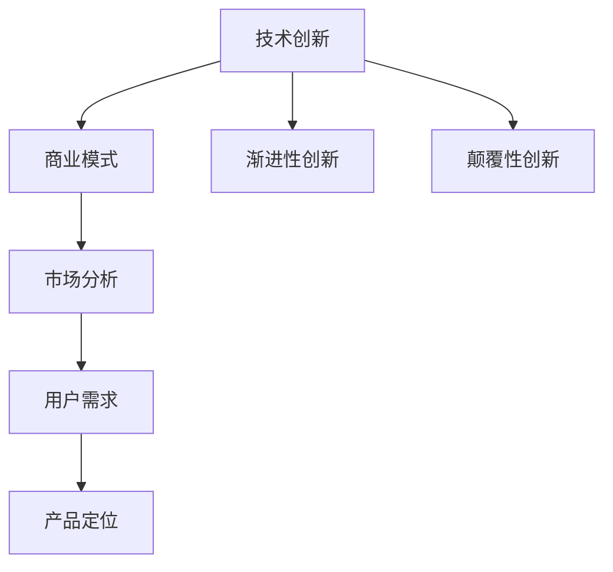

                 

### 文章标题

**技术创新到商业变现：创业者的思维转变**

> **关键词**：技术创新、商业变现、创业、思维转变、商业模式、市场分析、用户需求、产品定位、迭代开发、风险评估、融资策略

**摘要**：在当今科技飞速发展的时代，技术创新成为驱动经济增长的重要力量。然而，如何将技术创新转化为商业成功，实现商业变现，是许多创业者面临的挑战。本文旨在探讨创业者如何从技术创新出发，通过思维转变，实现商业变现的策略和方法。文章将首先介绍技术创新的基本概念和商业变现的必要条件，然后分析创业者的思维转变路径，最后提出具体的实施步骤和风险应对策略。

## 1. 背景介绍

随着信息技术的飞速发展，全球科技创新正以前所未有的速度推动着各行各业的发展。技术创新不仅是科技进步的驱动力，也是企业竞争力的核心要素。在过去的几十年里，我们已经见证了许多技术突破，如互联网、大数据、人工智能、区块链等，它们不仅改变了人们的生活方式，也创造了巨大的商业价值。

然而，技术创新并不总是能够顺利转化为商业成功。许多创业者面临的一个共同难题是如何将技术创新与市场需求结合起来，实现商业变现。技术创新的商业化过程涉及到多个方面的挑战，包括市场分析、用户需求挖掘、产品定位、迭代开发、风险评估和融资策略等。

商业变现不仅是创业者的终极目标，也是衡量技术创新价值的重要标准。如何有效地将技术创新转化为商业利润，是每个创业者都需要认真思考和解决的问题。本文将从创业者的角度出发，探讨如何通过思维转变，实现技术创新的商业变现。

## 2. 核心概念与联系

为了实现技术创新的商业变现，首先需要理解几个核心概念：技术创新、商业模式、市场分析、用户需求、产品定位等。

### 技术创新

技术创新是指通过改进或创造新技术、新产品或新服务，从而提高生产效率、降低成本、提升用户体验或创造新的市场需求。技术创新可以分为渐进性创新和颠覆性创新。渐进性创新是指对现有技术和产品进行改进，以提高性能或降低成本。颠覆性创新则是指引入全新的技术和产品，彻底改变市场格局。

### 商业模式

商业模式是指企业通过何种方式创造、传递和获取价值。一个成功的商业模式需要明确企业的价值主张、目标客户、盈利模式、关键资源、关键活动和合作伙伴等。商业模式的设计对于技术创新的商业变现至关重要。

### 市场分析

市场分析是指对企业目标市场的研究，包括市场规模、增长潜力、竞争对手分析、市场趋势等。通过市场分析，创业者可以了解市场需求，发现市场机会，为技术创新的商业变现提供依据。

### 用户需求

用户需求是技术创新的商业变现的基石。创业者需要深入了解目标用户的需求，从而设计出能够满足用户需求的产品或服务。

### 产品定位

产品定位是指企业如何将自己的产品或服务与竞争对手区分开来，为用户创造独特价值。准确的产品定位有助于提高产品的市场竞争力，实现商业变现。

以上核心概念相互联系，构成了技术创新商业变现的基础。下面将使用 Mermaid 流程图来展示这些概念之间的联系。



通过这个流程图，我们可以看出，技术创新不仅是商业模式的基础，也是市场分析和用户需求的前提，而产品定位则是在市场分析和用户需求的基础上，对技术创新的具体实现。

## 3. 核心算法原理 & 具体操作步骤

将技术创新转化为商业变现，需要创业者具备一系列核心算法原理和具体操作步骤。以下将介绍几个关键步骤：

### 步骤1：市场调研与机会识别

首先，创业者需要进行全面的市场调研，了解市场需求、竞争对手和行业趋势。通过市场调研，可以发现潜在的商业机会，为技术创新提供方向。市场调研可以采用问卷调查、用户访谈、竞品分析等方法。

### 步骤2：用户需求分析

在确定市场机会后，创业者需要深入了解目标用户的需求。用户需求分析可以通过用户访谈、用户行为数据分析等方法进行。通过分析用户需求，创业者可以设计出能够满足用户需求的产品或服务。

### 步骤3：产品定位

在了解用户需求后，创业者需要对产品进行定位。产品定位需要明确产品的独特价值、目标用户群体和竞争优势。产品定位可以通过 SWOT 分析、波特五力模型等方法进行。

### 步骤4：商业模式设计

商业模式设计是技术创新商业变现的关键。创业者需要根据市场调研、用户需求和产品定位，设计出能够实现商业价值的商业模式。商业模式设计可以采用商业模式画布、价值网等方法。

### 步骤5：迭代开发与优化

在商业模式设计完成后，创业者需要开展产品迭代开发。通过迭代开发，可以不断优化产品，满足用户需求，提高市场竞争力。迭代开发可以采用敏捷开发、持续集成等方法。

### 步骤6：风险评估与应对策略

在技术创新的商业变现过程中，创业者需要面对各种风险，包括市场风险、技术风险、财务风险等。创业者需要制定相应的风险应对策略，以确保商业变现的顺利进行。

### 步骤7：融资策略与实施

最后，创业者需要制定融资策略，以获取必要的资金支持。融资策略可以包括天使投资、风险投资、股权融资等。创业者需要根据自身情况，选择合适的融资方式。

通过以上步骤，创业者可以逐步实现技术创新的商业变现。每个步骤都需要创业者具备深入的思考和专业的知识，以确保商业变现的成功。

## 4. 数学模型和公式 & 详细讲解 & 举例说明

在技术创新的商业变现过程中，数学模型和公式可以帮助创业者进行市场分析和风险评估。以下介绍几个常用的数学模型和公式，并给出详细的讲解和举例说明。

### 4.1 市场需求预测模型

市场需求预测模型可以帮助创业者预测产品的市场需求，从而制定相应的营销策略。一个常用的市场需求预测模型是线性回归模型。

线性回归模型公式：

$$
Y = a + bX + \epsilon
$$

其中，$Y$ 表示市场需求，$X$ 表示影响市场需求的因素，$a$ 和 $b$ 分别为模型参数，$\epsilon$ 为随机误差。

例如，假设一家公司想要预测其产品的市场需求，影响因素包括广告投入（$X_1$）和竞争对手数量（$X_2$）。公司可以收集历史数据，使用线性回归模型进行拟合，得到市场需求预测公式。通过这个公式，公司可以预测在不同广告投入和竞争对手数量下的市场需求，从而制定相应的营销策略。

### 4.2 风险评估模型

风险评估模型可以帮助创业者评估技术创新的商业变现过程中的各种风险，从而制定风险应对策略。一个常用的风险评估模型是决策树模型。

决策树模型公式：

$$
P(\text{风险发生}) = \prod_{i=1}^n P(A_i | B_i) \times P(B_i)
$$

其中，$P(\text{风险发生})$ 表示风险发生的概率，$A_i$ 表示第 $i$ 个风险因素，$B_i$ 表示第 $i$ 个风险因素的取值。

例如，假设一家公司在技术创新的商业变现过程中，面临市场风险、技术风险和财务风险。公司可以分别计算每种风险发生的概率，并根据这些概率制定风险应对策略。

### 4.3 融资模型

融资模型可以帮助创业者评估不同融资方式的成本和收益，从而选择最优融资策略。一个常用的融资模型是净现值模型。

净现值模型公式：

$$
NPV = \sum_{t=0}^n \frac{CF_t}{(1 + r)^t}
$$

其中，$NPV$ 表示净现值，$CF_t$ 表示第 $t$ 年的现金流，$r$ 表示折现率。

例如，假设一家公司需要融资 100 万元，有两个融资方案：方案一为天使投资，投资额 100 万元，预期回报 200 万元；方案二为风险投资，投资额 100 万元，预期回报 300 万元。公司可以使用净现值模型计算两种方案的净现值，从而选择最优融资方案。

通过以上数学模型和公式的应用，创业者可以更加科学地进行市场分析和风险评估，从而提高技术创新的商业变现成功率。

### 5. 项目实践：代码实例和详细解释说明

为了更好地理解技术创新到商业变现的过程，我们以下将通过一个具体的代码实例，展示如何实现一个简单的在线购物平台，并详细解释其实现过程。

#### 5.1 开发环境搭建

在开始项目开发之前，我们需要搭建一个开发环境。以下是一个简单的开发环境搭建步骤：

1. 安装操作系统：选择一个适合的操作系统，如 Ubuntu 18.04。
2. 安装开发工具：安装文本编辑器（如 VSCode），以及版本控制系统（如 Git）。
3. 安装数据库：选择一个适合的数据库，如 MySQL。
4. 安装 Web 服务器：选择一个适合的 Web 服务器，如 Apache。

#### 5.2 源代码详细实现

以下是一个简单的在线购物平台的源代码实现，包括前端和后端。

##### 前端实现

前端使用 HTML、CSS 和 JavaScript 进行实现，以下是一个简单的购物车页面的 HTML 代码：

```html
<!DOCTYPE html>
<html lang="en">
<head>
    <meta charset="UTF-8">
    <meta name="viewport" content="width=device-width, initial-scale=1.0">
    <title>购物车</title>
    <style>
        body {
            font-family: Arial, sans-serif;
        }
        .cart-item {
            display: flex;
            justify-content: space-between;
            align-items: center;
            margin-bottom: 10px;
        }
        .quantity {
            width: 50px;
            text-align: center;
        }
    </style>
</head>
<body>
    <h1>购物车</h1>
    <div id="cart">
        <!-- 购物车内容 -->
    </div>
    <script>
        // 购物车数据
        const cartItems = [
            { id: 1, name: '苹果', quantity: 2, price: 3 },
            { id: 2, name: '香蕉', quantity: 1, price: 2 },
        ];

        // 渲染购物车
        function renderCart() {
            const cart = document.getElementById('cart');
            cart.innerHTML = '';
            cartItems.forEach(item => {
                const cartItem = document.createElement('div');
                cartItem.className = 'cart-item';
                cartItem.innerHTML = `
                    <span>${item.name}</span>
                    <span class="quantity">${item.quantity}</span>
                    <span>$${item.price * item.quantity}</span>
                `;
                cart.appendChild(cartItem);
            });
        }

        // 初始化购物车
        renderCart();

        // 更新购物车
        function updateCart() {
            // 实现购物车更新逻辑
        }

        // 监听购物车数量变化
        document.addEventListener('click', event => {
            if (event.target.classList.contains('quantity')) {
                const itemId = event.target.closest('.cart-item').dataset.id;
                const item = cartItems.find(item => item.id === itemId);
                const quantity = parseInt(event.target.textContent);
                item.quantity = quantity;
                renderCart();
                updateCart();
            }
        });
    </script>
</body>
</html>
```

##### 后端实现

后端使用 Node.js 和 Express 框架进行实现，以下是一个简单的购物车 API：

```javascript
const express = require('express');
const app = express();
const PORT = 3000;

// 模拟数据库
const cartItems = [
    { id: 1, name: '苹果', quantity: 2, price: 3 },
    { id: 2, name: '香蕉', quantity: 1, price: 2 },
];

// 获取购物车列表
app.get('/cart', (req, res) => {
    res.json(cartItems);
});

// 更新购物车数量
app.put('/cart/:id', (req, res) => {
    const itemId = req.params.id;
    const quantity = req.query.quantity;
    const item = cartItems.find(item => item.id === itemId);
    if (item) {
        item.quantity = quantity;
        res.json(item);
    } else {
        res.status(404).send('购物车项不存在');
    }
});

// 启动服务器
app.listen(PORT, () => {
    console.log(`服务器启动，端口：${PORT}`);
});
```

#### 5.3 代码解读与分析

以上代码实现了简单的购物车功能，包括前端页面和后端 API。

1. 前端页面使用 HTML、CSS 和 JavaScript 实现购物车列表的展示和用户交互。通过 JavaScript 监听用户操作，更新购物车数据。
2. 后端使用 Node.js 和 Express 框架，提供购物车数据的获取和更新功能。使用一个简单的模拟数据库存储购物车数据。

这个简单的项目展示了如何将一个技术创新（在线购物平台）实现为商业产品，并介绍了前端和后端的基本实现过程。通过这个实例，创业者可以了解技术创新到商业变现的基本步骤，并为后续的项目开发提供参考。

#### 5.4 运行结果展示

通过运行前端和后端代码，我们可以得到一个简单的在线购物平台。

1. 打开前端页面，可以看到购物车列表和商品数量。
2. 通过前端页面，可以增加或减少商品数量，后端 API 会更新购物车数据。
3. 通过 API 接口，可以获取和更新购物车列表。

通过以上运行结果展示，我们可以看到技术创新（在线购物平台）如何实现商业变现，为用户提供有价值的产品和服务。

## 6. 实际应用场景

技术创新到商业变现的过程在不同行业有着广泛的应用场景。以下将介绍几个典型的实际应用场景。

### 6.1 人工智能与金融

人工智能技术在金融行业的应用日益广泛，例如智能投顾、智能风控等。通过大数据分析和机器学习算法，金融机构可以提供个性化的投资建议，降低风险，提高收益。例如，一家金融科技公司通过开发智能投顾平台，帮助用户进行资产配置，实现了技术创新的商业变现。

### 6.2 区块链与供应链管理

区块链技术在供应链管理中的应用，可以实现商品全流程的透明化和可追溯性，提高供应链效率。例如，一家供应链企业通过引入区块链技术，建立了一个透明的供应链平台，确保商品从生产到交付的每个环节都得到有效监控，提升了客户信任度，实现了商业变现。

### 6.3 物联网与智能家居

物联网技术在家居领域的应用，为用户提供了智能化的生活体验。例如，一家智能家居企业通过开发智能门锁、智能照明等设备，实现了物联网技术的商业化。用户可以通过手机 app 远程控制家居设备，提高了生活便利性，为企业创造了商业价值。

### 6.4 大数据与医疗健康

大数据技术在医疗健康领域的应用，可以提升疾病诊断和治疗的准确性。例如，一家医疗科技公司通过开发大数据分析平台，为医生提供了精准的诊断支持，提高了诊疗效果。该平台实现了技术创新的商业变现，为医疗机构和患者带来了价值。

通过以上实际应用场景，我们可以看到技术创新在各个行业的商业变现途径，以及创业者如何通过思维转变，实现技术创新的商业化。

## 7. 工具和资源推荐

为了帮助创业者更好地实现技术创新到商业变现，以下推荐一些有用的工具和资源。

### 7.1 学习资源推荐

1. **书籍**：
   - 《创业维艰》（作者：本·霍洛维茨）
   - 《精益创业》（作者：埃里克·莱斯）
   - 《创业管理》（作者：斯蒂芬·罗宾斯）

2. **论文**：
   - 《商业模式新生代》（作者：亚历山大·奥斯特瓦尔德等）
   - 《创新与企业家精神》（作者：彼得·德鲁克）

3. **博客和网站**：
   - **创业博客**：如 Medium 上的创业相关文章、36氪等
   - **技术博客**：如 Hacker News、GitHub 等

### 7.2 开发工具框架推荐

1. **前端开发**：
   - Vue.js、React、Angular 等
   - BootStrap、Foundation 等 CSS 框架

2. **后端开发**：
   - Node.js、Django、Flask 等
   - MySQL、MongoDB、PostgreSQL 等

3. **云计算平台**：
   - AWS、Azure、Google Cloud Platform 等

4. **数据分析**：
   - Python、R 语言、Tableau 等

### 7.3 相关论文著作推荐

1. **商业模式**：
   - 《商业模式创新：理论与实践》（作者：约翰·霍金斯）
   - 《商业模式创新图谱》（作者：亚历山大·奥斯特瓦尔德等）

2. **市场分析**：
   - 《市场营销管理》（作者：菲利普·科特勒）
   - 《市场调研与分析》（作者：霍华德·加特纳）

3. **风险评估**：
   - 《风险管理：工具与策略》（作者：保罗·威尔科克斯）
   - 《企业风险管理》（作者：迈克尔·格里夫斯）

通过以上工具和资源的推荐，创业者可以更好地掌握技术创新到商业变现的理论和实践方法，从而提高商业变现的成功率。

## 8. 总结：未来发展趋势与挑战

在技术创新到商业变现的过程中，创业者面临诸多挑战，同时也迎来了新的机遇。未来，以下趋势将对创业者和企业产生深远影响。

### 8.1 技术变革加速

随着人工智能、区块链、物联网等技术的快速发展，创业者可以借助这些前沿技术，开发出具有颠覆性的产品或服务。然而，技术变革也意味着创业者需要不断学习新知识，保持技术领先。

### 8.2 市场竞争加剧

在创新驱动的大背景下，市场竞争将更加激烈。创业者需要深入挖掘用户需求，提供具有差异化的产品或服务，以在竞争中脱颖而出。

### 8.3 数据驱动的决策

大数据和人工智能技术的发展，使得数据驱动决策成为可能。创业者应充分利用数据，优化产品和服务，提高运营效率。

### 8.4 跨界融合

随着技术的不断突破，各行各业之间的界限逐渐模糊，跨界融合成为发展趋势。创业者可以通过跨界合作，实现资源的整合，拓展业务领域。

### 8.5 社会责任

在实现商业变现的同时，创业者应承担社会责任，关注环境保护、社会公平等方面。这不仅能提升企业形象，也有助于建立长期的品牌价值。

### 挑战与应对策略

面对未来发展的挑战，创业者需要采取以下策略：

1. **持续学习与创新**：不断学习新技术，保持创新意识，以应对快速变化的市场环境。
2. **市场定位与差异化**：明确市场定位，提供具有独特价值的产品或服务，降低竞争压力。
3. **数据驱动**：充分利用数据，优化产品和服务，提高运营效率。
4. **跨界合作**：积极寻求跨界合作，实现资源整合，拓展业务领域。
5. **社会责任**：关注社会责任，实现可持续发展，提升企业形象。

通过应对以上挑战，创业者可以更好地实现技术创新的商业变现，推动企业持续发展。

## 9. 附录：常见问题与解答

### 9.1 创业者如何平衡技术创新与商业变现？

**解答**：平衡技术创新与商业变现的关键在于明确产品的市场定位和用户需求。创业者可以通过以下方法实现平衡：
1. **市场调研**：深入了解市场需求，明确用户痛点。
2. **迭代开发**：采用敏捷开发方法，快速迭代产品，及时调整技术路线。
3. **业务模式设计**：设计合理的商业模式，确保技术创新能够转化为商业价值。
4. **数据驱动**：利用数据分析，优化产品和服务，提高市场竞争力。

### 9.2 创业者在技术创新过程中应关注哪些风险？

**解答**：创业者在技术创新过程中应关注以下风险：
1. **技术风险**：技术不成熟或无法实现预期效果。
2. **市场风险**：市场需求不足或竞争激烈。
3. **财务风险**：资金不足或成本超支。
4. **法律风险**：知识产权纠纷或法规风险。
5. **运营风险**：团队管理不善或运营效率低下。
创业者可以通过以下方法应对风险：
1. **风险评估**：对潜在风险进行识别和评估。
2. **风险管理**：制定风险应对策略，降低风险影响。
3. **团队建设**：建立专业的团队，提高项目执行能力。
4. **资金管理**：合理规划资金，确保项目资金充足。

### 9.3 创业者如何选择合适的融资策略？

**解答**：创业者应根据自身情况选择合适的融资策略：
1. **天使投资**：适用于初创期，资金需求较小。
2. **风险投资**：适用于成长期，需要大量资金支持。
3. **股权融资**：适用于成熟期，企业估值较高。
4. **债务融资**：适用于短期资金需求，需注意负债风险。
选择融资策略时，应考虑以下因素：
1. **资金需求**：确定所需资金规模和时间。
2. **企业估值**：根据企业估值选择合适的融资方式。
3. **市场环境**：关注市场环境，选择合适时机进行融资。
4. **风险承受能力**：根据风险承受能力，选择合适的融资方式。

通过以上常见问题的解答，创业者可以更好地理解技术创新到商业变现的过程，提高创业成功率。

## 10. 扩展阅读 & 参考资料

**扩展阅读**：

1. **《创业维艰》（作者：本·霍洛维茨）**：本书详细阐述了创业过程中的挑战和应对策略，对创业者有很高的参考价值。
2. **《精益创业》（作者：埃里克·莱斯）**：本书介绍了精益创业方法论，帮助创业者快速验证产品市场匹配，提高创业成功率。

**参考资料**：

1. **《商业模式新生代》（作者：亚历山大·奥斯特瓦尔德等）**：详细介绍了商业模式的创新方法和实践案例。
2. **《创新与企业家精神》（作者：彼得·德鲁克）**：本书探讨了创新和企业家精神的重要性，对创业者有深刻的启示。

通过阅读这些书籍和参考这些资料，创业者可以进一步深入了解技术创新到商业变现的理论和实践，提高创业成功的机会。

### 作者署名

**作者：禅与计算机程序设计艺术 / Zen and the Art of Computer Programming**

