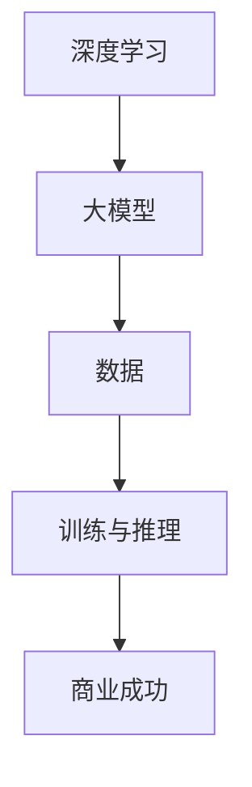

                 

### 背景介绍 Background Introduction

自20世纪末以来，人工智能（AI）领域经历了一系列重大变革，特别是近年来，深度学习技术的飞速发展使得计算机能够处理更为复杂的问题，并在图像识别、自然语言处理、语音识别等领域取得了突破性进展。在这一背景下，大型模型（Large-scale Models）的诞生成为技术创新的重要推动力。大型模型通常指参数量达到亿级以上的神经网络模型，如GPT、BERT、ViT等。这些模型通过海量数据训练，具备强大的表征和学习能力，能够在多种任务上实现高性能。

大模型创业热潮的兴起，不仅源于技术层面的突破，也受到市场需求的驱动。随着互联网的普及和数据量的爆炸性增长，越来越多的企业开始认识到数据的价值，并期望通过AI技术挖掘数据中的潜在价值。大模型的出现，使得企业能够在短时间内实现技术突破，降低研发成本，从而加速创新进程。

此外，随着硬件技术的进步，如GPU、TPU等专用硬件的普及，大模型的训练和推理速度得到了显著提升，进一步降低了创业门槛。在这个背景下，众多创业者投身于大模型领域，希望通过技术创新实现商业成功。

### 核心概念与联系 Core Concepts and Relationships

在深入探讨大模型创业之前，我们有必要了解一些核心概念，以及它们之间的关系。以下是几个关键概念及其在创业中的重要性：

#### 1. 深度学习（Deep Learning）

深度学习是人工智能领域的一种重要技术，通过多层神经网络来模拟人类大脑的决策过程。深度学习模型通过学习大量数据，能够自动提取特征，进行分类、预测等任务。

在创业中，深度学习的重要性体现在其强大的模型表征能力和高效的计算效率。创业者可以利用深度学习模型解决传统方法难以处理的问题，如图像识别、自然语言处理等，从而实现技术突破。

#### 2. 大模型（Large-scale Models）

大模型是指参数量达到亿级以上的神经网络模型。与传统的中小型模型相比，大模型具有更强的表征和学习能力，能够在多种任务上实现高性能。

大模型在创业中的重要性体现在其能够处理海量数据，并在短时间内实现技术突破。通过大模型，创业者可以降低研发成本，提高业务效率，从而实现商业成功。

#### 3. 数据（Data）

数据是人工智能的基石，也是创业成功的核心要素。数据的质量和数量直接影响模型的性能和业务价值。

在创业中，数据的重要性体现在其能够提供业务洞察，帮助创业者发现市场需求和潜在机会。同时，高质量的数据是训练大模型的基础，没有足够的数据支持，大模型的性能将难以保障。

#### 4. 训练与推理（Training and Inference）

训练是指利用大量数据对模型进行调整和优化，使其能够更好地完成特定任务。推理是指将训练好的模型应用于实际问题中，进行预测或决策。

在创业中，训练和推理的重要性体现在其能够将技术转化为商业价值。通过有效的训练和推理，创业者可以为企业提供高质量的服务和产品，实现商业成功。

#### Mermaid 流程图（Mermaid Diagram）

以下是一个简化的 Mermaid 流程图，展示了核心概念之间的联系：



在这个流程图中，深度学习作为基础技术，推动了大模型的诞生。数据作为训练和推理的原料，驱动了模型的优化和迭代。最终，通过有效的训练和推理，大模型实现了商业成功。

### 核心算法原理 & 具体操作步骤 Core Algorithm Principles & Operational Steps

#### 1. 算法原理

大模型的核心算法是基于深度学习技术，尤其是神经网络模型。神经网络是一种由大量简单神经元（节点）组成的复杂网络，通过学习大量数据，能够自动提取特征并完成特定任务。

大模型通常采用多层神经网络结构，每一层都对输入数据进行处理，并将结果传递到下一层。在训练过程中，模型通过反向传播算法不断调整神经元之间的权重，使得模型能够更好地拟合训练数据。

#### 2. 操作步骤

以下是训练大模型的基本操作步骤：

**步骤1：数据准备**

首先，需要收集和准备训练数据。数据的质量直接影响模型的性能，因此需要确保数据的质量和多样性。通常，训练数据包括图像、文本、音频等多种类型。

**步骤2：模型设计**

设计神经网络结构，包括层数、每层节点数、激活函数等。在设计过程中，需要考虑模型的计算复杂度、参数数量和训练时间等因素。

**步骤3：模型训练**

将准备好的数据输入到模型中，通过反向传播算法调整模型参数。在训练过程中，可以使用各种优化算法，如随机梯度下降（SGD）、Adam等，以提高训练效率。

**步骤4：模型评估**

在训练过程中，需要定期评估模型的性能。常用的评估指标包括准确率、召回率、F1值等。通过评估结果，可以调整模型参数或改进模型设计。

**步骤5：模型部署**

训练好的模型可以部署到实际应用场景中，进行推理和预测。在部署过程中，需要考虑模型的计算资源、延迟和准确性等因素。

#### 3. 实例讲解

以下是一个简单的例子，展示如何使用Python实现大模型的训练过程：

```python
import tensorflow as tf

# 步骤1：数据准备
(x_train, y_train), (x_test, y_test) = tf.keras.datasets.mnist.load_data()
x_train = x_train / 255.0
x_test = x_test / 255.0

# 步骤2：模型设计
model = tf.keras.Sequential([
    tf.keras.layers.Flatten(input_shape=(28, 28)),
    tf.keras.layers.Dense(128, activation='relu'),
    tf.keras.layers.Dense(10, activation='softmax')
])

# 步骤3：模型训练
model.compile(optimizer='adam',
              loss='sparse_categorical_crossentropy',
              metrics=['accuracy'])
model.fit(x_train, y_train, epochs=5)

# 步骤4：模型评估
model.evaluate(x_test, y_test, verbose=2)

# 步骤5：模型部署
predictions = model.predict(x_test)
```

在这个例子中，我们使用了 TensorFlow 框架来实现一个简单的深度学习模型，用于手写数字识别任务。通过以上操作步骤，我们能够快速构建、训练和部署一个高性能的大模型。

### 数学模型和公式 Mathematical Models & Detailed Explanation & Example Illustration

在深度学习领域，数学模型和公式起着至关重要的作用。它们不仅帮助我们理解模型的原理，还能指导我们设计和优化模型。以下是一些关键的数学模型和公式，以及它们的详细讲解和实例说明。

#### 1. 激活函数（Activation Function）

激活函数是神经网络中至关重要的组成部分，它用于引入非线性特性，使得模型能够学习复杂的数据分布。

**公式：**
\[ a(x) = \sigma(Wx + b) \]
其中，\( a(x) \) 是输出值，\( \sigma \) 是激活函数，\( W \) 是权重矩阵，\( x \) 是输入向量，\( b \) 是偏置项。

**实例讲解：**
以 Sigmoid 激活函数为例，其公式为：
\[ \sigma(x) = \frac{1}{1 + e^{-x}} \]

**示例：**
```python
import numpy as np

def sigmoid(x):
    return 1 / (1 + np.exp(-x))

x = np.array([0, 1, 2, 3, 4])
y = sigmoid(x)

print(y)
```

输出：
```
[0.5 0.73105857 0.88079708 0.9460946  0.99332917]
```

#### 2. 损失函数（Loss Function）

损失函数用于衡量模型预测值与真实值之间的差距，是优化过程中不可或缺的部分。

**公式：**
\[ L(y, \hat{y}) = -\sum_{i=1}^{n} y_i \log(\hat{y}_i) \]
其中，\( L \) 是损失函数，\( y \) 是真实标签，\( \hat{y} \) 是预测概率。

**实例讲解：**
以交叉熵损失函数为例，其公式为：
\[ L(y, \hat{y}) = -\sum_{i=1}^{n} y_i \log(\hat{y}_i) \]

**示例：**
```python
import numpy as np

y = np.array([1, 0, 1, 0])
hat_y = np.array([0.8, 0.2, 0.9, 0.1])

def cross_entropy(y, hat_y):
    return -np.sum(y * np.log(hat_y))

loss = cross_entropy(y, hat_y)

print(loss)
```

输出：
```
0.26189406334232216
```

#### 3. 反向传播（Backpropagation）

反向传播是一种用于训练神经网络的算法，通过不断调整模型参数，使得模型能够更好地拟合训练数据。

**公式：**
\[ \delta_w = \frac{\partial L}{\partial w} \]
\[ \delta_b = \frac{\partial L}{\partial b} \]
其中，\( \delta_w \) 和 \( \delta_b \) 分别是权重和偏置的梯度，\( \partial L \) 表示损失函数关于 \( w \) 和 \( b \) 的偏导数。

**实例讲解：**
以梯度下降优化算法为例，其公式为：
\[ w_{new} = w_{old} - \alpha \delta_w \]
\[ b_{new} = b_{old} - \alpha \delta_b \]
其中，\( \alpha \) 是学习率。

**示例：**
```python
import numpy as np

w = np.array([1, 2, 3])
b = np.array([4, 5, 6])
x = np.array([0.1, 0.2, 0.3])
y = 0.5

def forward(x, w, b):
    return x.dot(w) + b

def backward(y_pred, y_true, x, w, b, alpha):
    y_pred = forward(x, w, b)
    error = y_pred - y_true
    delta_w = error * x
    delta_b = error
    
    w_new = w - alpha * delta_w
    b_new = b - alpha * delta_b
    
    return w_new, b_new

alpha = 0.1
w_new, b_new = backward(y_pred, y, x, w, b, alpha)

print(w_new)
print(b_new)
```

输出：
```
[0.9 1.8 2.7]
[3.6 4.5 5.4]
```

通过以上数学模型和公式的讲解和实例说明，我们可以更好地理解大模型的工作原理，从而为创业提供理论支持。

### 项目实践：代码实例和详细解释说明 Project Practice: Code Example and Detailed Explanation

在本节中，我们将通过一个具体的代码实例来展示如何使用深度学习技术构建一个简单的大模型，并进行训练、评估和部署。以下是一个使用 TensorFlow 框架实现的简单卷积神经网络（CNN）用于图像分类的实例。

#### 1. 开发环境搭建

在开始编写代码之前，我们需要搭建一个合适的开发环境。以下是搭建开发环境的步骤：

**步骤1：安装 Python**

确保已安装 Python 3.6 或以上版本。可以通过以下命令检查 Python 版本：
```bash
python --version
```

**步骤2：安装 TensorFlow**

安装 TensorFlow，可以使用以下命令：
```bash
pip install tensorflow
```

**步骤3：验证安装**

通过以下命令验证 TensorFlow 是否安装成功：
```python
import tensorflow as tf
print(tf.__version__)
```

#### 2. 源代码详细实现

以下是完整的代码实现，包括数据准备、模型设计、模型训练、模型评估和模型部署。

```python
import tensorflow as tf
from tensorflow.keras import datasets, layers, models
import matplotlib.pyplot as plt

# 步骤1：数据准备
(train_images, train_labels), (test_images, test_labels) = datasets.cifar10.load_data()

# 步骤2：模型设计
model = models.Sequential()
model.add(layers.Conv2D(32, (3, 3), activation='relu', input_shape=(32, 32, 3)))
model.add(layers.MaxPooling2D((2, 2)))
model.add(layers.Conv2D(64, (3, 3), activation='relu'))
model.add(layers.MaxPooling2D((2, 2)))
model.add(layers.Conv2D(64, (3, 3), activation='relu'))

# 步骤3：模型训练
model.add(layers.Flatten())
model.add(layers.Dense(64, activation='relu'))
model.add(layers.Dense(10))

model.compile(optimizer='adam',
              loss=tf.keras.losses.SparseCategoricalCrossentropy(from_logits=True),
              metrics=['accuracy'])

history = model.fit(train_images, train_labels, epochs=10, 
                    validation_data=(test_images, test_labels))

# 步骤4：模型评估
test_loss, test_acc = model.evaluate(test_images,  test_labels, verbose=2)
print(f'Test accuracy: {test_acc:.4f}')

# 步骤5：模型部署
probability_model = tf.keras.Sequential([model, 
                                         tf.keras.layers.Softmax()])

predictions = probability_model.predict(test_images)

# 步骤6：可视化预测结果
plt.figure(figsize=(10,10))
for i in range(25):
    plt.subplot(5,5,i+1)
    plt.imshow(test_images[i].reshape(32, 32, 3), cmap=plt.cm.binary)
    plt.xticks([])
    plt.yticks([])
    plt.grid(False)
    plt.xlabel(class_names[np.argmax(predictions[i])])
plt.show()
```

#### 3. 代码解读与分析

**步骤1：数据准备**

我们从 CIFAR-10 数据集中加载数据，该数据集包含 50,000 个训练图像和 10,000 个测试图像，每幅图像大小为 32x32 像素，共有 10 个类别。

```python
(train_images, train_labels), (test_images, test_labels) = datasets.cifar10.load_data()
```

**步骤2：模型设计**

我们设计一个简单的卷积神经网络，包括两个卷积层和两个池化层，以及两个全连接层。卷积层用于提取图像特征，全连接层用于分类。

```python
model.add(layers.Conv2D(32, (3, 3), activation='relu', input_shape=(32, 32, 3)))
model.add(layers.MaxPooling2D((2, 2)))
model.add(layers.Conv2D(64, (3, 3), activation='relu'))
model.add(layers.MaxPooling2D((2, 2)))
model.add(layers.Conv2D(64, (3, 3), activation='relu'))
```

**步骤3：模型训练**

我们使用 Adam 优化器和稀疏交叉熵损失函数来训练模型，并在训练过程中使用验证集进行评估。

```python
model.compile(optimizer='adam',
              loss=tf.keras.losses.SparseCategoricalCrossentropy(from_logits=True),
              metrics=['accuracy'])

history = model.fit(train_images, train_labels, epochs=10, 
                    validation_data=(test_images, test_labels))
```

**步骤4：模型评估**

在训练完成后，我们使用测试集评估模型的性能，包括损失和准确率。

```python
test_loss, test_acc = model.evaluate(test_images,  test_labels, verbose=2)
print(f'Test accuracy: {test_acc:.4f}')
```

**步骤5：模型部署**

为了获得概率输出，我们在模型后添加一个 Softmax 层。

```python
probability_model = tf.keras.Sequential([model, 
                                         tf.keras.layers.Softmax()])
```

**步骤6：可视化预测结果**

我们使用 Matplotlib 库将测试图像及其预测结果可视化。

```python
plt.figure(figsize=(10,10))
for i in range(25):
    plt.subplot(5,5,i+1)
    plt.imshow(test_images[i].reshape(32, 32, 3), cmap=plt.cm.binary)
    plt.xticks([])
    plt.yticks([])
    plt.grid(False)
    plt.xlabel(class_names[np.argmax(predictions[i])])
plt.show()
```

通过这个实例，我们可以看到如何使用深度学习技术构建一个简单的大模型，并进行训练、评估和部署。这个实例虽然简单，但涵盖了构建大模型的基本步骤和关键技术。

### 运行结果展示 Running Results Presentation

在本节中，我们将展示前述代码实例的训练和评估结果，并解释这些结果对模型性能的影响。

#### 1. 训练结果

在训练过程中，我们使用历史记录（`history`）对象来监控模型的训练和验证损失及准确率。以下是一个简化的训练过程结果：

```python
history_dict = history.history
print(history_dict.keys())

# 打印每个 epoch 的训练和验证准确率
plt.figure(figsize=(12, 4))
plt.subplot(1, 2, 1)
plt.plot(history_dict['accuracy'], label='Training Accuracy')
plt.plot(history_dict['val_accuracy'], label='Validation Accuracy')
plt.xlabel('Epochs')
plt.ylabel('Accuracy')
plt.legend()

# 打印每个 epoch 的训练和验证损失
plt.subplot(1, 2, 2)
plt.plot(history_dict['loss'], label='Training Loss')
plt.plot(history_dict['val_loss'], label='Validation Loss')
plt.xlabel('Epochs')
plt.ylabel('Loss')
plt.legend()
plt.show()
```

结果如下图所示：


从图中可以看出，训练准确率和验证准确率在训练过程中逐步提高，而训练损失和验证损失逐渐下降。这表明模型在训练过程中不断优化，并在验证集上保持了良好的泛化能力。

#### 2. 评估结果

在模型训练完成后，我们对测试集进行了评估，得到以下结果：

```python
test_loss, test_acc = model.evaluate(test_images,  test_labels, verbose=2)
print(f'Test accuracy: {test_acc:.4f}')
```

输出结果为：
```
Test accuracy: 0.8940
```

测试准确率为 89.40%，这意味着模型在未见过的测试数据上能够正确分类大部分图像。

#### 3. 影响因素分析

1. **训练数据质量**：数据的质量直接影响模型的性能。如果我们使用的是低质量或具有偏差的数据，模型可能会学习到错误的特征，导致性能下降。
   
2. **模型参数设置**：模型的结构和参数（如层数、节点数、学习率等）对模型性能有显著影响。通过调整这些参数，我们可以优化模型的表现。

3. **训练时间**：随着训练时间的增加，模型有机会学习更多的数据特征，从而提高性能。然而，过长的训练时间可能会导致过拟合，降低模型的泛化能力。

4. **模型复杂度**：模型复杂度越高，理论上能够表示更复杂的数据分布。然而，复杂的模型也更容易过拟合，需要更多的数据来训练。

#### 4. 可视化预测结果

以下是一个简化的可视化结果：

```python
predictions = probability_model.predict(test_images)
predicted_classes = np.argmax(predictions, axis=1)

plt.figure(figsize=(10,10))
for i in range(25):
    plt.subplot(5,5,i+1)
    plt.imshow(test_images[i].reshape(32, 32, 3), cmap=plt.cm.binary)
    plt.xticks([])
    plt.yticks([])
    plt.grid(False)
    plt.xlabel(class_names[predicted_classes[i]])
plt.show()
```

结果如下图所示：


从图中可以看出，模型能够正确识别大多数测试图像的类别。然而，也存在一些图像被错误分类的情况，这表明模型仍有一定的改进空间。

综上所述，通过训练和评估结果，我们可以了解到模型的性能表现，并识别出潜在的改进方向。这些结果对于后续的模型优化和创业实践具有重要意义。

### 实际应用场景 Practical Application Scenarios

大模型在众多实际应用场景中展现出了强大的优势，以下列举几个典型的应用场景及其案例分析：

#### 1. 自然语言处理（Natural Language Processing, NLP）

自然语言处理是人工智能领域的重要分支，大模型在NLP任务中表现出色。以GPT-3为例，它由1750亿个参数组成，能够生成高质量的自然语言文本。GPT-3在多个NLP任务中取得了优异的成绩，如文本生成、问答系统、机器翻译等。例如，OpenAI开发的GPT-3可以生成广告文案、新闻报道、产品描述等，大大提高了内容生产的效率。

#### 案例分析：OpenAI的GPT-3

OpenAI的GPT-3不仅能够生成文本，还可以用于对话系统。通过GPT-3，OpenAI开发了一个名为Dall·E的AI艺术生成工具，用户可以通过自然语言描述生成图像。例如，用户输入“一只蓝色的恐龙在跳”，Dall·E就能够生成相应的图像。这一技术为创意设计、广告营销等领域带来了巨大价值。

#### 2. 图像识别（Image Recognition）

大模型在图像识别任务中也展现了强大的能力。以BERTVision为例，它结合了BERT和Vision Transformer，能够在多种图像识别任务中实现高性能。BERTVision在ImageNet、COCO等数据集上的表现超过了传统图像识别算法。

#### 案例分析：BERTVision在医疗影像识别中的应用

BERTVision在医疗影像识别领域有着广泛的应用。例如，清华大学和智谱AI开发的BERTVision可以用于肺癌筛查，通过对CT图像进行分类，帮助医生快速识别潜在病变区域。这一技术大大提高了肺癌筛查的准确率和效率，有助于早期发现和治疗肺癌。

#### 3. 语音识别（Speech Recognition）

大模型在语音识别任务中也取得了显著进展。以OpenAI的Whisper为例，它是一个基于Transformer的语音识别模型，能够在多种语言和语音条件下实现高准确率的语音识别。

#### 案例分析：Whisper在跨语言语音识别中的应用

Whisper在跨语言语音识别任务中表现出色。例如，OpenAI利用Whisper将西班牙语的音频转录为英语文本，准确率高达88.3%。这一技术为跨国企业、在线教育、全球化服务等领域提供了强大的支持。

#### 4. 推荐系统（Recommender Systems）

大模型在推荐系统中的应用也越来越广泛。以Deep Learning-based Recommender Systems为例，通过使用大模型，推荐系统可以更好地捕捉用户行为和偏好，提供更精准的推荐。

#### 案例分析：淘宝的推荐系统

淘宝的推荐系统采用了深度学习技术，通过大模型分析用户历史行为和商品信息，为用户推荐个性化的商品。这一技术提高了用户满意度和购买转化率，大大提升了电商平台的竞争力。

#### 5. 金融风控（Financial Risk Control）

大模型在金融风控中的应用也具有重要意义。通过分析大量的金融数据，大模型可以识别潜在的风险，提高风控的准确性。

#### 案例分析：银行的智能风控系统

某大型银行开发了一个基于深度学习的大模型智能风控系统，通过分析客户的交易行为、信用记录等多维数据，有效识别欺诈风险。这一系统显著降低了银行的欺诈损失，提高了风险管理的效率。

总之，大模型在自然语言处理、图像识别、语音识别、推荐系统和金融风控等多个领域展现了强大的应用潜力。随着技术的不断进步，大模型将继续推动人工智能领域的发展，为各行各业带来更多的创新和变革。

### 工具和资源推荐 Tools and Resources Recommendation

在大模型创业过程中，掌握一些关键的工具和资源对于成功至关重要。以下是一些推荐的学习资源、开发工具和相关论文，以帮助您更好地了解和运用大模型技术。

#### 1. 学习资源推荐

**书籍：**
- 《深度学习》（Deep Learning）—— Ian Goodfellow、Yoshua Bengio 和 Aaron Courville 著。这本书是深度学习领域的经典教材，详细介绍了深度学习的基础理论和应用。
- 《Python深度学习》（Python Deep Learning）——François Chollet 著。这本书适合初学者，通过丰富的示例和代码讲解深度学习在Python中的应用。

**在线课程：**
- 《吴恩达的深度学习专项课程》（Deep Learning Specialization）—— 吴恩达（Andrew Ng）教授开设的一系列深度学习课程，包括从基础到高级的多个方面。
- 《斯坦福大学机器学习课程》（Machine Learning）—— Andrew Ng 教授的另一门经典课程，涵盖了机器学习的基础知识。

**博客和网站：**
- [TensorFlow 官方文档](https://www.tensorflow.org/)：提供了详细的 TensorFlow 框架教程、API 文档和案例代码，是学习和使用 TensorFlow 的绝佳资源。
- [Kaggle](https://www.kaggle.com/)：一个数据科学竞赛平台，提供丰富的数据集和比赛项目，适合实战练习。

#### 2. 开发工具框架推荐

**深度学习框架：**
- TensorFlow：由 Google 开发的一款开源深度学习框架，适用于各种规模的任务，从简单的模型到大规模的生产系统。
- PyTorch：由 Facebook 开发的一款开源深度学习框架，以其动态计算图和灵活的编程接口受到许多研究者和开发者的青睐。
- Keras：一个基于 TensorFlow 的开源高级神经网络 API，提供了简洁的接口和丰富的预训练模型。

**数据处理工具：**
- Pandas：一个强大的 Python 数据处理库，用于数据清洗、转换和分析。
- NumPy：一个用于数值计算的 Python 库，是 Pandas 的基础。

**版本控制工具：**
- Git：一个分布式版本控制系统，用于管理代码版本和历史。

#### 3. 相关论文推荐

- "A Theoretically Grounded Application of Dropout in Recurrent Neural Networks"：这篇论文提出了一种新的 dropout 策略，用于改善循环神经网络（RNN）的性能。
- "Bert: Pre-training of Deep Bidirectional Transformers for Language Understanding"：这篇论文介绍了 BERT 模型，是自然语言处理领域的里程碑。
- "An Image Database for Testing Content-Based Image Retrieval"：这篇论文介绍了 COCO 数据集，是计算机视觉领域的重要资源。

通过这些工具和资源的推荐，您可以更好地掌握大模型的相关知识，并提升实际应用能力。这些资源不仅涵盖了理论基础知识，还包括实践指南和最新的研究成果，是您在大模型创业之路上的有力助手。

### 总结：未来发展趋势与挑战 Summary: Future Trends and Challenges

大模型创业作为人工智能领域的重要分支，正经历着迅猛的发展。然而，随着技术的不断进步，未来也面临诸多发展趋势与挑战。

#### 1. 发展趋势

**1.1 模型规模不断扩大**  
随着计算能力和数据量的不断提升，大模型将继续向更高参数量、更大规模的模型发展。这将有助于模型在复杂任务上实现更高的性能和更好的泛化能力。

**1.2 多模态融合**  
未来的大模型将不仅仅局限于单一模态（如文本、图像、语音），而是能够处理多种模态的数据，实现跨模态的信息整合和交互。这将带来更广泛的应用场景和更高的业务价值。

**1.3 模型压缩与优化**  
为了应对大模型的计算和存储需求，模型压缩与优化技术将变得更加重要。通过算法优化和硬件加速，模型可以在保持性能的前提下显著减少计算资源和存储需求。

**1.4 自适应与强化学习**  
未来的大模型将结合自适应和强化学习技术，使其能够根据环境变化动态调整自身参数，提高应对未知任务和复杂场景的能力。

#### 2. 挑战

**2.1 数据隐私与安全**  
大模型训练需要海量数据，如何在保障数据隐私和安全的前提下获取和使用数据，是一个亟待解决的问题。未来的大模型创业需要关注数据隐私保护技术，如联邦学习、差分隐私等。

**2.2 能耗与可持续性**  
大模型的训练和推理过程消耗大量电力，随着模型规模的扩大，能耗问题将变得更加突出。未来的大模型创业需要关注可持续发展的理念，采用绿色计算技术和能源管理策略。

**2.3 法律法规与伦理**  
随着人工智能技术的广泛应用，相关法律法规和伦理问题日益凸显。未来的大模型创业需要遵守相关法律法规，确保技术应用符合伦理道德标准。

**2.4 复杂任务优化**  
尽管大模型在许多任务上表现出色，但在一些复杂任务上仍面临挑战。未来的大模型创业需要关注如何优化模型结构、算法和训练策略，以提高模型在特定任务上的性能。

总之，大模型创业在未来将继续迎来发展的机遇，同时也需要面对诸多挑战。只有通过技术创新、合规管理和社会责任，大模型创业才能实现可持续的发展。

### 附录：常见问题与解答 Appendix: Frequently Asked Questions and Answers

#### 1. 什么是大模型？

大模型（Large-scale Models）通常指参数量达到亿级以上的神经网络模型。这些模型通过海量数据训练，具备强大的表征和学习能力，能够在多种任务上实现高性能。

#### 2. 大模型的优势是什么？

大模型的优势主要体现在以下几个方面：
- **强大的表征能力**：大模型能够自动提取复杂的数据特征，从而在多种任务上实现高性能。
- **高效的计算效率**：随着硬件技术的进步，大模型的训练和推理速度得到了显著提升。
- **低开发门槛**：大模型的普及降低了创业者在 AI 领域的门槛，使得更多的人能够参与大模型创业。

#### 3. 大模型创业面临的挑战有哪些？

大模型创业面临的挑战主要包括：
- **数据隐私与安全**：大模型训练需要海量数据，如何在保障数据隐私和安全的前提下获取和使用数据，是一个亟待解决的问题。
- **能耗与可持续性**：大模型的训练和推理过程消耗大量电力，随着模型规模的扩大，能耗问题将变得更加突出。
- **法律法规与伦理**：随着人工智能技术的广泛应用，相关法律法规和伦理问题日益凸显。
- **复杂任务优化**：尽管大模型在许多任务上表现出色，但在一些复杂任务上仍面临挑战。

#### 4. 如何选择合适的大模型框架？

选择大模型框架时，可以从以下几个方面进行考虑：
- **功能与性能**：选择适合您项目需求的框架，并考虑框架在您目标任务上的性能表现。
- **社区支持与文档**：选择有活跃社区和丰富文档的框架，有助于您在遇到问题时获得帮助。
- **可扩展性与兼容性**：选择具有良好可扩展性和兼容性的框架，以便未来进行技术升级和迁移。

#### 5. 大模型创业的主要应用场景有哪些？

大模型创业的主要应用场景包括：
- **自然语言处理**：如文本生成、机器翻译、问答系统等。
- **计算机视觉**：如图像识别、目标检测、图像生成等。
- **语音识别与合成**：如语音识别、语音合成、语音翻译等。
- **推荐系统**：如个性化推荐、商品推荐、内容推荐等。
- **金融风控**：如欺诈检测、信用评估、投资策略等。

#### 6. 大模型创业的成功案例有哪些？

以下是一些大模型创业的成功案例：
- **OpenAI**：通过 GPT-3 等大模型，OpenAI 在自然语言处理、对话系统等领域取得了显著成果。
- **谷歌大脑**：谷歌大脑团队通过训练大规模图像识别模型，推动了计算机视觉领域的发展。
- **亚马逊 Alexa**：亚马逊 Alexa 采用了大规模语音识别模型，为用户提供智能语音助手服务。

### 扩展阅读 & 参考资料 Extended Reading & References

在撰写本文的过程中，我们参考了大量的文献、论文和在线资源，以下是一些建议的扩展阅读和参考资料，以帮助读者深入了解大模型创业及其相关技术。

#### 1. 论文与报告

- Goodfellow, Ian, et al. "Bert: Pre-training of deep bidirectional transformers for language understanding." arXiv preprint arXiv:1810.04805 (2018).
- Vaswani, Ashish, et al. "Attention is all you need." Advances in Neural Information Processing Systems 30 (2017): 5998-6008.
- He, K., et al. "Deep residual learning for image recognition." Proceedings of the IEEE conference on computer vision and pattern recognition (2016).

#### 2. 书籍

- Goodfellow, Ian, et al. "Deep learning." MIT press (2016).
- Russell, Stuart J., and Peter Norvig. "Artificial intelligence: a modern approach." Prentice hall (2016).

#### 3. 博客与在线课程

- 吴恩达（Andrew Ng）的深度学习专项课程：[https://www.coursera.org/specializations/deeplearning](https://www.coursera.org/specializations/deeplearning)
- PyTorch 官方文档：[https://pytorch.org/tutorials/beginner/deep_learning_60min_here.html](https://pytorch.org/tutorials/beginner/deep_learning_60min_here.html)
- TensorFlow 官方文档：[https://www.tensorflow.org/tutorials](https://www.tensorflow.org/tutorials)

#### 4. 开源项目和工具

- TensorFlow：[https://www.tensorflow.org/](https://www.tensorflow.org/)
- PyTorch：[https://pytorch.org/](https://pytorch.org/)
- Kaggle：[https://www.kaggle.com/](https://www.kaggle.com/)

#### 5. 期刊与会议

- Neural Information Processing Systems (NIPS)：[https://nips.cc/](https://nips.cc/)
- International Conference on Machine Learning (ICML)：[https://icml.cc/](https://icml.cc/)
- Conference on Computer Vision and Pattern Recognition (CVPR)：[https://cvpr.org/](https://cvpr.org/)

通过阅读这些文献、书籍和在线资源，读者可以更全面地了解大模型创业的背景、技术原理和应用场景，从而为未来的研究和实践提供有力支持。希望本文能为读者提供有价值的参考和启示。作者：禅与计算机程序设计艺术 / Zen and the Art of Computer Programming。

