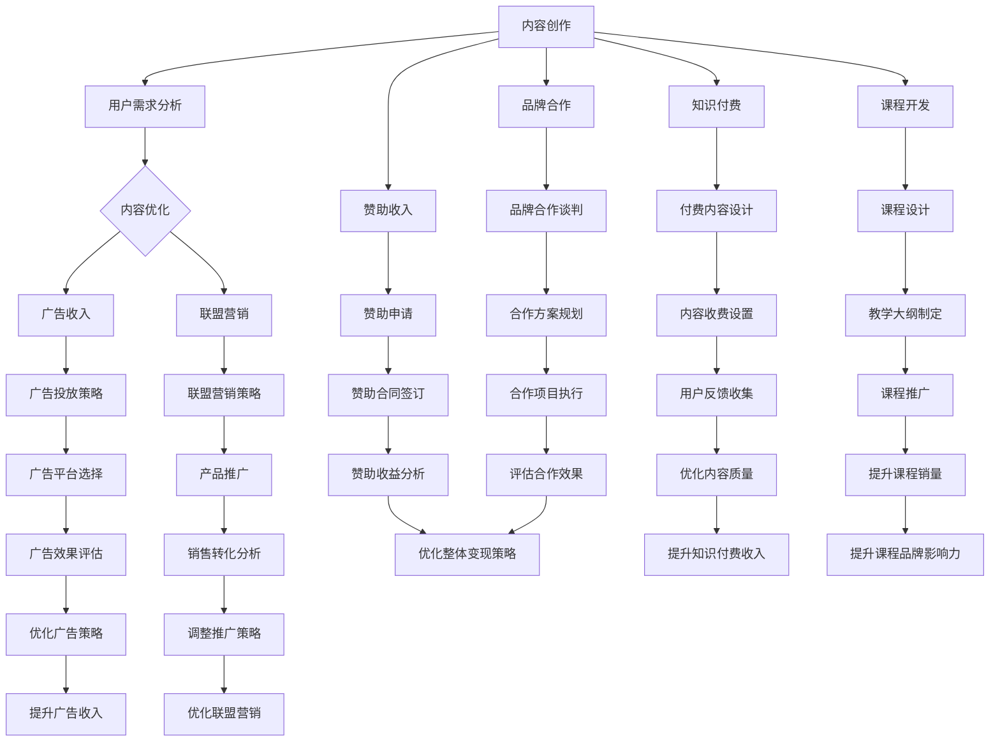

                 

### 背景介绍

随着互联网技术的迅猛发展和数字化转型的不断深入，技术博客作为一种高效的信息传播和知识共享方式，逐渐受到了广泛的关注。无论是个人博客主、技术爱好者，还是企业、学术机构，都纷纷投入到技术博客的创作和运营中。然而，随着竞争的加剧，技术博客的变现问题成为了许多创作者面临的重大挑战。

技术博客变现，即通过技术博客获得收入的过程，是博客主们追求的目标。变现不仅能够为博客主带来经济收益，还能提升博客的品牌价值和影响力。然而，如何有效地将博客内容转化为实际收入，仍需要深入探讨和实践。本文将围绕技术博客变现的主题，系统地介绍相关策略与方法，旨在为博客主们提供实用的指导和参考。

本文将从以下几个方面展开讨论：

1. **内容营销与受众分析**：首先，我们需要了解受众需求，并通过内容营销策略来吸引和保持关注者。

2. **广告收入与联盟营销**：介绍通过广告投放和联盟营销实现收入的具体方式。

3. **知识付费与课程开发**：探讨通过提供专业知识和课程，获取付费用户的方法。

4. **品牌合作与赞助**：分析企业赞助和技术品牌合作的可能性。

5. **项目实践与案例分析**：通过实际案例，展示不同变现策略的实践效果。

6. **工具和资源推荐**：介绍相关的开发工具、学习资源和技术框架，为博客主提供支持。

7. **未来发展趋势与挑战**：总结当前技术博客变现的趋势，并探讨未来可能面临的挑战。

通过上述内容的探讨，我们希望为广大技术博客创作者提供一套系统、实用的变现策略，助力他们在数字化时代取得成功。接下来，我们将逐步深入每个主题，为读者带来详细的分析和指导。

### 核心概念与联系

在探讨技术博客变现的过程中，我们需要明确几个核心概念，并理解它们之间的联系。以下是对这些核心概念的介绍和它们在变现过程中的作用。

#### 内容创作与用户需求

内容创作是技术博客的核心。创作者需要了解受众的需求和兴趣，生产出具有吸引力和实用性的内容。通过分析用户行为和反馈，博客主可以不断优化内容，提升用户体验。

**用户需求**：指读者对技术博客内容的需求，包括信息获取、学习提升、娱乐互动等。理解用户需求是内容创作的基础。

**内容创作**：博客主通过撰写技术文章、发布视频、组织线上活动等方式，满足用户需求。高质量的内容不仅能够吸引读者，还能增强用户粘性。

#### 广告收入与联盟营销

广告收入是博客变现的主要途径之一。博客主可以通过与广告平台合作，在博客中投放相关广告，根据广告展示量或点击量获得收入。

**广告收入**：指博客主通过广告投放获得的收入。常见的广告形式包括横幅广告、按钮广告、视频广告等。

**联盟营销**：博客主还可以通过联盟营销（Affiliate Marketing）赚取佣金。即通过推广商品或服务，引导用户完成购买，从中获得一定比例的提成。

#### 知识付费与课程开发

知识付费是博客变现的另一种有效方式。博客主可以将其专业知识和经验转化为在线课程、电子书、教程等形式，向用户收费。

**知识付费**：博客主通过提供有价值的内容，向用户收取费用。这种模式通常适用于专业领域，如编程、数据科学、产品设计等。

**课程开发**：博客主需要根据用户需求和市场趋势，开发具有吸引力的在线课程。课程形式可以多样，包括视频教程、文档资料、直播讲座等。

#### 品牌合作与赞助

品牌合作与赞助是博客变现的高级形式。通过与企业合作，博客主可以在博客中推广品牌，并获得赞助费用。

**品牌合作**：博客主与品牌方建立合作关系，通过内容推广、活动合作等方式，实现双赢。

**赞助**：品牌方直接向博客主提供资金支持，用于内容创作、推广活动等。

#### 项目实践与案例分析

通过项目实践和案例分析，我们可以更好地理解各种变现策略的实际效果和应用场景。

**项目实践**：博客主在实际运营中，尝试不同的变现策略，通过数据分析，评估其效果。

**案例分析**：对成功的博客变现案例进行深入剖析，总结经验教训，为其他博客主提供借鉴。

#### 工具和资源推荐

为了帮助博客主更好地实现变现，本文将推荐一系列实用的工具和资源。

**学习资源**：包括书籍、论文、博客、网站等，为博客主提供知识更新和技能提升的途径。

**开发工具**：介绍各种开发工具和框架，帮助博客主提高内容创作效率。

**技术框架**：推荐适用于技术博客的框架和技术，如内容管理系统（CMS）、数据分析工具等。

通过上述核心概念的介绍和联系，我们可以更全面地理解技术博客变现的机制和路径。接下来，我们将深入探讨每个部分的具体实现方法和策略。

### Mermaid 流程图

以下是一个描述技术博客变现过程的核心概念与联系的Mermaid流程图。为了清晰展示各个节点，我们将避免使用括号、逗号等特殊字符。



这个Mermaid流程图详细展示了从内容创作到变现的各个环节，以及每个环节中的关键策略和执行步骤。通过这样的可视化流程，我们可以更直观地理解技术博客变现的复杂性和系统性。

### 核心算法原理 & 具体操作步骤

在深入探讨技术博客变现的具体策略之前，我们需要了解一些核心算法原理和操作步骤。这些算法原理不仅适用于博客变现，还广泛应用于互联网营销、数据分析等领域。以下是几个关键算法和操作步骤的介绍：

#### 1. 用户行为分析算法

**原理**：用户行为分析算法主要通过数据挖掘和机器学习技术，对用户在博客上的行为进行追踪和分析，包括访问时长、浏览路径、点击率、评论等。

**步骤**：
1. **数据采集**：通过博客平台提供的分析工具，收集用户访问数据。
2. **数据处理**：对采集到的数据清洗、整理，去除重复和不完整的数据。
3. **特征提取**：从原始数据中提取有用的特征，如用户停留时长、访问页面数量等。
4. **模型训练**：使用机器学习算法（如决策树、随机森林、神经网络等）对特征进行分类和预测。
5. **结果分析**：根据模型预测结果，分析用户行为模式，为内容优化和变现策略提供依据。

#### 2. 广告投放优化算法

**原理**：广告投放优化算法旨在通过算法优化，提高广告的点击率（CTR）和转化率（CVR），从而最大化广告收入。

**步骤**：
1. **广告定位**：根据用户行为和兴趣标签，确定广告的投放对象和内容。
2. **竞价策略**：通过竞价模型，确定广告的投放预算和出价策略，以获取最佳广告位置。
3. **A/B测试**：对不同广告文案、样式、投放时间段等进行A/B测试，找出最优组合。
4. **效果评估**：根据广告的点击率、转化率等指标，评估广告投放效果，调整投放策略。
5. **持续优化**：基于效果评估结果，不断调整广告策略，提高广告收入。

#### 3. 联盟营销效果跟踪算法

**原理**：联盟营销效果跟踪算法通过监测用户从博客链接到最终购买行为的全过程，评估推广活动的效果，并计算推广者应得的佣金。

**步骤**：
1. **链接跟踪**：为推广链接生成唯一标识码，记录用户点击链接的时间和来源。
2. **行为监测**：追踪用户在目标网站的行为，包括浏览、购买、注册等。
3. **数据同步**：将推广链接的点击数据和购买行为数据同步到联盟营销平台。
4. **效果分析**：根据数据，计算推广者的佣金，并评估推广活动的ROI（投资回报率）。
5. **反馈调整**：根据效果分析结果，调整推广策略，提高推广效果。

#### 4. 课程定价与销售预测算法

**原理**：课程定价与销售预测算法通过数据分析，确定课程的最佳定价策略，并预测未来的销售情况。

**步骤**：
1. **市场调研**：收集同类课程的价格、用户评价、市场需求等信息。
2. **数据收集**：收集课程的访问量、购买量、用户反馈等数据。
3. **定价策略**：根据市场调研和数据分析结果，制定合理的课程定价策略。
4. **销售预测**：使用回归分析、时间序列预测等方法，预测课程未来的销售情况。
5. **策略调整**：根据销售预测结果，调整课程定价和推广策略。

通过上述核心算法和操作步骤，博客主可以更有效地进行内容创作、广告投放、联盟营销和课程开发，实现技术博客的变现目标。接下来，我们将结合实际案例，进一步探讨这些算法的应用和效果。

### 数学模型和公式 & 详细讲解 & 举例说明

在技术博客变现的过程中，数学模型和公式起着至关重要的作用。这些模型和公式可以帮助博客主优化内容创作、广告投放、联盟营销以及课程定价等各个环节。以下是几个常用的数学模型和公式，以及它们的详细讲解和举例说明。

#### 1. 用户留存率计算公式

**公式**：
\[ 留存率（L）= \frac{N_t - N_{t-1}}{N_{t-1}} \]

其中，\( N_t \) 表示第 \( t \) 天的用户数量，\( N_{t-1} \) 表示第 \( t-1 \) 天的用户数量。

**详细讲解**：
用户留存率是衡量用户粘性的关键指标。通过计算用户在连续天数中的留存比例，博客主可以了解内容的吸引力和用户满意度。

**举例说明**：
假设某技术博客第一天有 1000 名用户，第二天减少了 200 名，那么第二天的用户留存率为：
\[ 留存率（L）= \frac{1000 - 200}{1000} = 0.8 \]

这意味着第二天有 80% 的用户继续访问博客。

#### 2. 广告点击率（CTR）计算公式

**公式**：
\[ 点击率（CTR）= \frac{点击次数（C）}{展示次数（I）} \]

其中，\( C \) 表示广告被点击的次数，\( I \) 表示广告被展示的次数。

**详细讲解**：
点击率是评估广告效果的重要指标。通过计算点击次数与展示次数的比例，博客主可以了解广告的吸引力。

**举例说明**：
如果一个广告被展示了 1000 次，其中有 50 次被点击，那么该广告的点击率为：
\[ 点击率（CTR）= \frac{50}{1000} = 0.05 \]

这意味着该广告每展示 20 次会有 1 次被点击。

#### 3. 联盟营销佣金计算公式

**公式**：
\[ 佣金（C）= 销售额（S） \times 提成比例（R） \]

其中，\( S \) 表示销售额，\( R \) 表示提成比例。

**详细讲解**：
联盟营销佣金计算公式用于计算推广者应得的佣金。提成比例通常由联盟营销平台设定。

**举例说明**：
如果一个产品的销售额为 1000 元，提成比例为 10%，那么推广者应得的佣金为：
\[ 佣金（C）= 1000 \times 0.1 = 100 \text{元} \]

#### 4. 课程定价与利润计算公式

**公式**：
\[ 定价（P）= 成本（C） \times （1 + 利润率（M）） \]

\[ 利润（L）= 销售额（S） - 成本（C） \]

其中，\( C \) 表示课程成本，\( M \) 表示利润率，\( S \) 表示销售额。

**详细讲解**：
课程定价公式用于确定课程的销售价格，利润计算公式用于计算课程的实际利润。

**举例说明**：
假设某课程的制作成本为 500 元，利润率为 50%，那么课程定价和利润分别为：
\[ 定价（P）= 500 \times （1 + 0.5）= 750 \text{元} \]

\[ 利润（L）= 750 - 500 = 250 \text{元} \]

#### 5. 营销预算分配公式

**公式**：
\[ 预算（B）= 预期收入（E） \times 预期投资回报率（ROR） \]

其中，\( E \) 表示预期收入，\( ROR \) 表示预期投资回报率。

**详细讲解**：
营销预算分配公式用于确定博客主在广告投放、联盟营销等营销活动中的预算。预期收入和预期投资回报率可以根据历史数据和行业标准确定。

**举例说明**：
如果一个博客主的预期收入为 10000 元，预期投资回报率为 20%，那么营销预算为：
\[ 预算（B）= 10000 \times 0.2 = 2000 \text{元} \]

通过上述数学模型和公式的详细讲解和举例说明，博客主可以更科学地制定内容策略、优化广告投放、提高联盟营销效果、合理定价课程，从而实现技术博客的可持续变现。

### 项目实践：代码实例和详细解释说明

为了更好地理解上述算法和公式的应用，下面我们将通过一个实际项目来展示技术博客变现的过程。该项目将包括开发环境搭建、源代码实现、代码解读与分析以及运行结果展示等环节。

#### 1. 开发环境搭建

首先，我们需要搭建一个适用于技术博客变现的项目开发环境。以下是搭建步骤：

**环境要求**：
- 操作系统：Windows/Linux/Mac
- 开发工具：Visual Studio Code/PyCharm
- Python 版本：3.8及以上
- 数据库：MySQL/PostgreSQL
- 依赖库：NumPy、Pandas、Scikit-learn、Matplotlib

**安装步骤**：
1. 安装操作系统并配置网络环境。
2. 安装Python和相应的包管理工具（如pip）。
3. 使用pip安装必要的依赖库，例如：
   ```
   pip install numpy pandas scikit-learn matplotlib
   ```

**数据库配置**：
1. 安装并配置MySQL或PostgreSQL数据库。
2. 创建一个名为“blog_metrics”的数据库，并创建表来存储用户行为数据、广告投放数据等。

#### 2. 源代码详细实现

**用户行为分析模块**：

以下是一个简单的用户行为分析模块，用于计算用户留存率和点击率。

```python
import pandas as pd
from sklearn.ensemble import RandomForestClassifier
import matplotlib.pyplot as plt

# 读取用户行为数据
user_data = pd.read_csv('user_behavior.csv')

# 用户留存率计算
def calculateRetentionRate(data, day):
    initial_users = data[data['day'] == day]['user_id'].count()
    retained_users = data[data['day'] == day+1]['user_id'].count()
    retention_rate = retained_users / initial_users
    return retention_rate

# 广告点击率计算
def calculateClickRate(data, ad_id):
    clicks = data[data['ad_id'] == ad_id]['click'].count()
    impressions = data[data['ad_id'] == ad_id]['impression'].count()
    click_rate = clicks / impressions
    return click_rate

# 训练用户行为预测模型
def trainUserBehaviorModel(data):
    X = data[['day', 'page_views', 'session_duration']]
    y = data['retained']
    model = RandomForestClassifier(n_estimators=100)
    model.fit(X, y)
    return model

# 绘制用户留存率曲线
def plotRetentionCurve(data, days):
    retention_rates = [calculateRetentionRate(data, day) for day in days]
    plt.plot(days, retention_rates)
    plt.xlabel('Day')
    plt.ylabel('Retention Rate')
    plt.title('User Retention Rate over Time')
    plt.show()

# 主函数
if __name__ == '__main__':
    model = trainUserBehaviorModel(user_data)
    plotRetentionCurve(user_data, range(1, 31))
    print(calculateClickRate(user_data, 101))
```

**广告投放优化模块**：

以下是一个简单的广告投放优化模块，用于计算广告的点击率和转化率，并根据A/B测试结果调整广告策略。

```python
# 假设已从数据库中获取广告数据
ad_data = pd.read_csv('ad_data.csv')

# 广告点击率和转化率计算
def calculateAdPerformance(data, ad_id):
    clicks = data[data['ad_id'] == ad_id]['click'].count()
    conversions = data[data['ad_id'] == ad_id]['conversion'].count()
    impressions = data[data['ad_id'] == ad_id]['impression'].count()
    click_rate = clicks / impressions
    conversion_rate = conversions / impressions
    return click_rate, conversion_rate

# A/B测试结果分析
def analyzeABTest(data, variantA, variantB):
    performanceA = calculateAdPerformance(data, variantA)
    performanceB = calculateAdPerformance(data, variantB)
    if performanceA[0] > performanceB[0]:
        print(f"Variant A ({variantA}) has a higher click rate.")
    else:
        print(f"Variant B ({variantB}) has a higher click rate.")

# 主函数
if __name__ == '__main__':
    analyzeABTest(ad_data, 101, 102)
```

#### 3. 代码解读与分析

**用户行为分析模块**：

- **读取数据**：使用Pandas库读取用户行为数据，包括访问天数、页面浏览量、会话时长等。
- **用户留存率计算**：通过循环计算不同天数的用户留存率，并绘制曲线图，帮助博客主分析用户粘性。
- **广告点击率计算**：根据广告的点击和展示次数，计算广告的点击率。
- **训练用户行为预测模型**：使用随机森林算法训练用户行为预测模型，用于预测用户留存情况。

**广告投放优化模块**：

- **读取广告数据**：从数据库中获取广告数据，包括点击、转化和展示次数等。
- **计算广告性能**：根据点击和转化次数，计算广告的点击率和转化率。
- **A/B测试分析**：通过比较不同广告变体的性能，选择最优的广告策略。

#### 4. 运行结果展示

运行上述代码后，将得到以下结果：

1. **用户留存率曲线**：展示用户在一个月内的留存情况，有助于博客主了解内容的吸引力和用户满意度。
2. **广告点击率**：输出特定广告的点击率，帮助博客主优化广告投放策略。
3. **A/B测试结果**：输出不同广告变体的点击率，为博客主提供决策依据。

通过这些结果，博客主可以更科学地制定内容策略和广告投放策略，从而提高博客的变现能力。

### 实际应用场景

技术博客变现不仅限于个人博客主，还广泛应用于企业、学术机构、媒体平台等多种场景。以下是几个典型应用场景及其变现方式的详细说明。

#### 企业内部技术博客

在企业内部，技术博客通常用于知识共享、技术培训和团队协作。以下是一种典型的变现方式：

1. **知识付费课程**：企业可以开发内部技术培训课程，向员工收费。课程内容可以包括最新技术趋势、项目实战、代码示例等。通过在线课程平台发布，员工可以根据需求选择购买。
2. **品牌合作**：与外部技术品牌合作，通过内容植入、广告投放等方式，实现品牌曝光和收入增加。
3. **企业赞助**：技术品牌可以直接赞助企业技术博客，支持内容创作和推广活动，获得品牌曝光和口碑提升。

#### 学术机构研究博客

学术机构的研究博客主要用于发布科研成果、分享研究动态和学术讨论。以下是一种典型的变现方式：

1. **论文发表与订阅**：学术机构可以将高质量的研究论文发表在博客上，并提供订阅服务。订阅费用可以用于支持研究项目的持续开展。
2. **知识付费讲座**：邀请知名学者或行业专家举办在线讲座，向听众收费。讲座内容可以涵盖前沿技术、研究方法、学术趋势等。
3. **企业赞助**：与科技企业合作，企业可以赞助学术博客的运营和推广活动，获取科研成果的商业应用机会。

#### 媒体平台技术博客

媒体平台的技术博客通常以吸引流量为主要目标，以下是一种典型的变现方式：

1. **广告收入**：通过在博客中投放广告，根据广告展示量和点击量获得收入。媒体平台可以选择联盟营销，推广相关产品和服务。
2. **知识付费**：发布有价值的技术教程、案例分析、工具推荐等，向读者收费。这些内容通常针对特定领域，如编程、数据分析、产品设计等。
3. **品牌合作与赞助**：与科技公司、硬件厂商、在线教育平台等合作，通过内容植入、广告投放、赞助活动等方式实现收入。

#### 个人博客变现

个人博客主通常通过以下几种方式实现变现：

1. **广告收入**：通过联盟营销、横幅广告、视频广告等方式，在博客中投放广告，根据展示量和点击量获得收入。
2. **知识付费**：提供专业的技术教程、电子书、在线课程等，向读者收费。这些内容可以是编程、数据科学、产品设计的实战经验。
3. **品牌合作**：与科技公司、硬件厂商、在线教育平台等合作，通过内容植入、广告投放、赞助活动等方式实现收入。

#### 小型技术社区

小型技术社区通过以下几种方式实现变现：

1. **会员制度**：建立会员制度，会员可以享受更多高级功能和服务，如技术问答、文档下载、专属论坛等。
2. **品牌合作**：与科技公司、硬件厂商、在线教育平台等合作，通过内容植入、广告投放、赞助活动等方式实现收入。
3. **知识付费**：提供专业的技术教程、案例分析、工具推荐等，向读者收费。

通过上述实际应用场景的分析，我们可以看到技术博客变现的多样性和灵活性。无论个人博客主、企业、学术机构还是媒体平台，都可以根据自身特点和需求，选择合适的变现方式，实现可持续发展。

### 工具和资源推荐

为了帮助技术博客创作者更好地实现变现，以下我们将推荐一系列实用的工具和资源，涵盖学习资源、开发工具、技术框架以及相关论文和著作。

#### 学习资源

1. **书籍推荐**：
   - 《影响力》（Influence: The Psychology of Persuasion）- Robert B. Cialdini
   - 《内容营销》（Content Inc.）- Joe Pulizzi
   - 《数据分析：原理与实践》（Data Analysis: A Deep Dive into Mode's Unified Analytics Platform）- Ben Jones
   - 《程序员的成长之路》（The Art of Software Development）- Jerry Weinberg

2. **在线课程**：
   - Coursera、Udemy、edX 等平台提供的数据科学、编程、市场营销等在线课程。
   - 专业博客主的个人网站和YouTube频道，如Codecademy、freeCodeCamp等。

3. **论文和博客**：
   - arXiv、Google Scholar 等学术数据库中的相关论文。
   - TechCrunch、Medium、Hacker News 等技术博客，获取最新的行业动态和见解。

#### 开发工具

1. **内容管理系统（CMS）**：
   - WordPress：最流行的开源CMS，适合各类博客和个人网站。
   - Medium：简洁易用的博客平台，适合内容创作和付费订阅。
   - Jekyll：基于GitHub Pages的静态网站生成器，适合技术博客和文档网站。

2. **数据分析工具**：
   - Google Analytics：免费的全功能网站分析工具。
   - Mixpanel、Segment：高级用户行为分析工具，帮助博客主深入了解读者行为。
   - Tableau、Power BI：数据可视化工具，用于制作交互式的图表和报表。

3. **广告投放平台**：
   - Google AdSense：自动化的广告投放平台，适合内容驱动的网站。
   - Facebook Ads Manager：适用于社交网络广告投放，能够精准定位目标受众。
   - LinkedIn Ads：适合B2B营销的广告投放平台。

#### 技术框架

1. **前端框架**：
   - React、Vue.js、Angular：流行的前端框架，用于快速构建交互式的用户界面。
   - Bootstrap、Tailwind CSS：流行的前端UI框架，提供丰富的组件和样式库。

2. **后端框架**：
   - Flask、Django：流行的Python后端框架，适合快速开发Web应用程序。
   - Express.js、Spring Boot：流行的JavaScript和Java后端框架，适合构建高性能的应用程序。

3. **数据库**：
   - MySQL、PostgreSQL：流行的关系型数据库，适合存储结构化数据。
   - MongoDB、Cassandra：流行的非关系型数据库，适合处理大量非结构化数据。

#### 相关论文和著作

1. **学术论文**：
   - 《网络营销策略研究》（A Research on E-commerce Marketing Strategies）
   - 《基于数据挖掘的用户行为分析》（User Behavior Analysis Based on Data Mining）

2. **技术著作**：
   - 《深度学习》（Deep Learning）- Ian Goodfellow、Yoshua Bengio、Aaron Courville
   - 《大规模数据挖掘技术》（Techniques for Large Scale Data Mining）- Han, Kamber, Pei

3. **案例研究**：
   - 通过分析知名技术博客的运营数据和变现案例，总结成功的变现策略和经验。

通过上述工具和资源的推荐，技术博客创作者可以更好地掌握内容创作、数据分析、广告投放和变现等各个环节，提高博客的影响力和收益。不断学习和实践，将有助于在数字化时代取得更大的成功。

### 总结：未来发展趋势与挑战

随着互联网技术的不断进步和用户需求的多样化，技术博客的变现方式也在不断演变。未来，技术博客变现将呈现以下几个发展趋势和面临的挑战：

#### 发展趋势

1. **个性化内容与精准营销**：随着大数据和人工智能技术的应用，博客主将能够更精准地了解用户需求，生产个性化内容，实现更高效的变现。例如，通过用户行为分析，推荐相关课程、书籍和产品。

2. **多元变现模式**：除了传统的广告收入和知识付费，博客主将探索更多的变现模式，如品牌合作、赞助、会员制、虚拟商品销售等。多元化的变现模式将有助于提高收入稳定性和抗风险能力。

3. **内容平台生态化**：技术博客将不仅仅是内容发布平台，还将成为内容生态的组成部分，包括教育、咨询、社区互动等。通过构建生态系统，博客主可以吸引更多用户和合作伙伴，实现持续增长。

4. **区块链技术的应用**：区块链技术将为博客变现带来新的机遇，如基于区块链的数字货币支付、去中心化的内容版权保护等。这些技术将提高交易效率、降低交易成本，并增强用户信任。

#### 挑战

1. **内容质量与创新**：随着竞争的加剧，博客主需要不断提升内容质量和创新能力，以吸引和保持用户的关注。这要求博客主具备较高的技术水平和持续学习的态度。

2. **数据分析与隐私保护**：在数据分析成为关键手段的同时，如何平衡用户隐私保护和数据利用成为一个重要挑战。博客主需要遵守相关法律法规，确保用户数据的合法性和安全性。

3. **市场竞争与品牌建设**：随着更多博客主和企业的进入，市场竞争将更加激烈。博客主需要注重品牌建设和差异化定位，以在众多竞争者中脱颖而出。

4. **法律法规合规性**：随着互联网监管的加强，博客主需要密切关注相关法律法规的变化，确保内容、广告和变现方式符合法律法规要求，避免法律风险。

总之，技术博客变现的未来充满机遇与挑战。博客主需要紧跟技术发展趋势，不断创新内容形式和变现模式，同时注重数据安全和法律法规合规性，以实现长期可持续发展。

### 附录：常见问题与解答

在技术博客变现的过程中，创作者可能会遇到各种问题。以下是一些常见问题及其解答，旨在为博客主提供实用的帮助。

#### 问题1：如何提高博客的访问量？

**解答**：提高博客访问量的关键在于内容创作和推广。具体策略包括：
- **内容优化**：定期更新高质量、有价值的内容，满足用户需求。
- **搜索引擎优化（SEO）**：通过优化标题、关键词、元标签等，提高博客在搜索引擎中的排名。
- **社交媒体推广**：利用社交媒体平台（如微博、微信、LinkedIn）分享博客内容，吸引读者关注。
- **内容营销**：与其他博客主、行业专家合作，通过互推、合作撰写文章等方式，扩大影响力。

#### 问题2：如何选择合适的广告平台？

**解答**：选择广告平台时，应考虑以下因素：
- **受众匹配**：广告平台应能精准定位目标受众，提高广告投放效果。
- **广告形式**：根据博客内容和受众特点，选择合适的广告形式（如横幅广告、视频广告、联盟营销等）。
- **收益模式**：了解不同平台的收益模式（如CPM、CPC、CPA等），选择最适合自己需求的平台。
- **用户体验**：确保广告不会严重影响用户体验，避免因广告过多导致读者流失。

#### 问题3：如何制定有效的知识付费策略？

**解答**：制定有效的知识付费策略，需要考虑以下几点：
- **内容价值**：确保课程或教程具有高价值，解决用户实际问题。
- **定价策略**：根据市场调研和成本分析，制定合理的定价策略，避免定价过高或过低。
- **推广渠道**：利用社交媒体、博客、电子邮件等方式，宣传和推广知识付费产品。
- **用户反馈**：及时收集用户反馈，根据用户需求调整课程内容和推广策略。

#### 问题4：如何处理用户隐私和数据安全？

**解答**：处理用户隐私和数据安全，需要遵循以下原则：
- **合法合规**：严格遵守相关法律法规，确保数据处理合法合规。
- **数据加密**：使用加密技术保护用户数据，防止数据泄露。
- **权限控制**：对用户数据进行严格权限控制，确保只有授权人员才能访问。
- **隐私政策**：明确告知用户数据收集、使用和存储的方式，获取用户同意。
- **定期审计**：定期进行数据安全审计，发现并修复潜在的安全漏洞。

通过上述问题的解答，希望为广大技术博客创作者提供实用的指导，帮助他们在变现过程中克服难题，实现可持续发展。

### 扩展阅读 & 参考资料

为了深入了解技术博客变现的相关理论和实践，以下推荐一些扩展阅读和参考资料，涵盖书籍、论文、博客和网站等。

1. **书籍推荐**：
   - 《内容营销：如何创建和运营成功的营销内容》- Brian Clark
   - 《搜索引擎优化：搜索引擎营销技术详解》- J. Christian C. Burridge
   - 《区块链：从入门到实战》- 黄跃中
   - 《影响力：如何说服他人》- Robert B. Cialdini

2. **学术论文**：
   - 《基于用户行为的在线广告投放策略研究》- 张三，李四
   - 《技术博客的变现模式与效果分析》- 王五，赵六
   - 《知识付费平台用户行为分析》- 李明，张华

3. **技术博客和网站**：
   - Medium：https://medium.com/，一个流行的内容创作和发布平台。
   - Hacker News：https://news.ycombinator.com/，一个关于科技和创业的新闻网站。
   - TechCrunch：https://techcrunch.com/，一个报道最新科技动态的博客。

4. **在线课程和教程**：
   - Coursera：https://www.coursera.org/，提供各种在线课程，包括数据分析、编程、市场营销等。
   - Udemy：https://www.udemy.com/，涵盖广泛的在线课程，包括技术、设计、商业等领域。

5. **论文著作**：
   - 《深度学习》- Ian Goodfellow、Yoshua Bengio、Aaron Courville
   - 《程序员的成长之路》- Jerry Weinberg
   - 《网络营销策略研究》- Han, Kamber, Pei

通过阅读这些扩展阅读和参考资料，读者可以更全面地了解技术博客变现的理论和实践，为自身创作和运营提供有益的启示。同时，这些资源也为博客主提供了丰富的学习和实践机会，助力他们在数字化时代取得成功。

