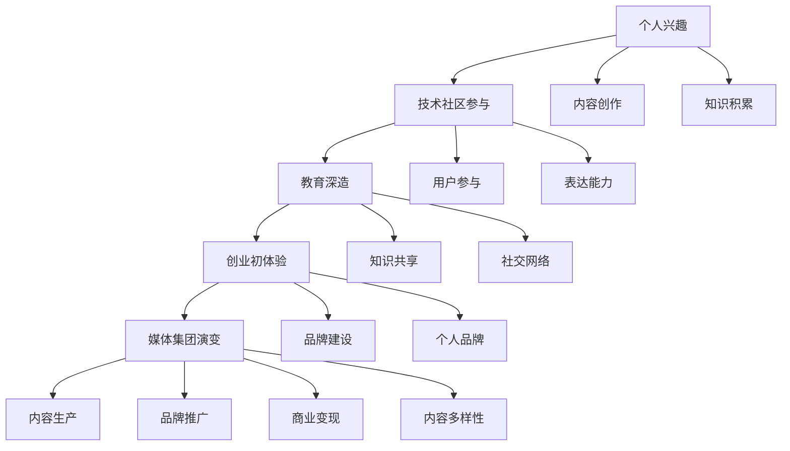
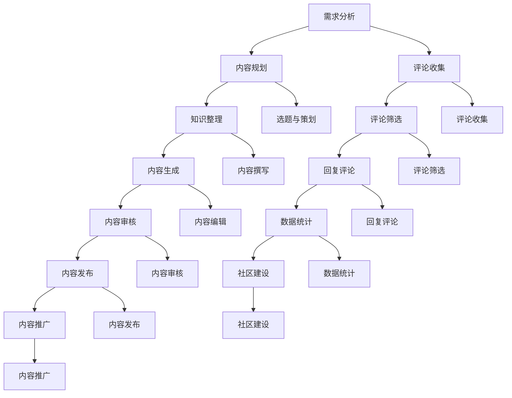

                 

### 1. 背景介绍

#### 个人兴趣的种子

我的故事始于一个充满好奇心的童年，那时我就对计算机产生了浓厚的兴趣。家里的老式电脑，成了我最早的玩物。我会花费大量的时间在电脑上玩简单的游戏，但更让我着迷的是那些游戏背后的代码。我开始好奇，这些游戏是如何运作的，它们背后的逻辑和算法是什么？

当时，我还只是一个初学者，但我对计算机编程的热爱促使我不断探索。我买了一些编程书籍，开始学习Basic语言。每次看到自己在键盘上输入的代码在屏幕上执行，那种成就感是无法言表的。我的兴趣从简单的游戏开发逐渐转向了更复杂的编程任务，我开始编写自己的小工具和简单的应用。

#### 技术社区的参与

随着对编程的深入了解，我意识到仅仅自己学习是不够的。我需要与其他程序员交流，分享经验，学习新的技术和理念。于是，我开始积极参与各种技术社区。我注册了Stack Overflow，GitHub，以及Reddit上的相关技术讨论区。在这些平台上，我不仅能够解决自己的问题，还能帮助他人。这种双向的学习过程让我受益匪浅。

我还参加了本地和在线的编程马拉松（Hackathon）。这些活动不仅提供了与同行交流的机会，还让我有机会将理论知识应用到实践中。在这些活动中，我学会了如何快速地搭建原型，解决实际问题，这种经验对我日后的职业生涯有着重要的影响。

#### 教育与深造

在大学期间，我选择了计算机科学作为我的主修专业。大学的学习不仅让我系统地掌握了编程的基础知识，还让我深入了解了计算机科学的各个领域。我从教授那里学到了如何分析和设计复杂的系统，这为我的未来发展打下了坚实的基础。

大学期间，我还积极参与了多个科研项目。这些项目让我有机会将课堂上学到的知识应用到实际研究中，同时也锻炼了我的团队合作和领导能力。通过这些经历，我不仅增强了自己的技术能力，还培养了对科研的热爱。

#### 创业初体验

大学毕业后，我决定创业。我成立了自己的小公司，专注于开发基于人工智能的应用程序。创业初期充满了挑战，但也是我学习和成长最快的阶段。我需要不断学习新的技术，管理团队，寻找客户，解决各种意想不到的问题。这些经历让我更加坚定了自己在技术领域的信心。

#### 媒体集团的演变

随着时间的推移，我的小公司逐渐发展壮大，我们开始涉足更多的领域，包括软件开发、人工智能、大数据等。我们的客户也从最初的小型企业扩展到了跨国企业。随着公司规模的扩大，我意识到，仅仅依靠技术实力是不够的，我们需要一个更加专业的团队来管理公司，提升品牌影响力。

于是，我决定将公司转型为一个媒体集团，不仅提供技术解决方案，还要通过内容创作和传播来扩大我们的影响力。我们开始创办自己的技术博客、线上课程、研讨会，以及出版技术书籍。这些举措不仅提高了我们的品牌知名度，还让我们的内容触及了更广泛的受众。

#### 成长与收获

通过这些年的努力，我从一名普通的程序员成长为一个世界级的技术专家。我不仅在技术领域取得了显著成就，还通过写作和演讲，分享了自己的经验和见解，影响了无数人。我的成长过程充满了挑战，但每一次挑战都让我变得更加坚强和自信。

总的来说，我的故事是一个从个人兴趣到技术社区参与，再到创业和企业转型，最终成为一个媒体集团的演变。这个过程中，我不仅学到了专业知识，更学会了如何面对挑战，不断成长。我希望我的经历能够激励更多的人，勇敢追求自己的梦想，无论是在技术领域还是在其他领域。

---

### 2. 核心概念与联系

#### 技术博客的发展历程

技术博客作为一种内容创作形式，其发展历程可以追溯到互联网早期的个人主页时代。最初，技术博客主要是个人程序员或技术爱好者的个人日志，用于分享自己的学习心得和技术见解。随着互联网的普及和社交媒体的发展，技术博客逐渐成为技术社区的重要组成部分。

技术博客的演变不仅体现在内容形式的丰富多样，还体现在其社会功能的变化。早期的技术博客主要以文字为主，随着多媒体技术的进步，博客内容逐渐加入了图片、视频和代码片段，使得信息传递更加直观和生动。此外，博客的互动性也不断增强，读者可以在博客下留言，与作者进行交流，形成了社区化的互动模式。

#### 技术博客的核心概念

技术博客的核心概念包括以下几个方面：

1. **内容创作**：技术博客的内容创作是核心，它需要作者具备一定的技术背景和写作能力。内容创作不仅要准确传达技术知识，还要具有吸引力和可读性。

2. **用户参与**：技术博客的用户参与度是其生命力的重要保障。通过评论、提问和互动，用户可以参与到博客内容的创作和讨论中，形成良好的社区氛围。

3. **知识共享**：技术博客作为知识共享的平台，为程序员提供了学习和交流的场所。知识共享不仅有助于个人的成长，也有助于整个技术社区的发展。

4. **品牌建设**：对于个人或企业来说，技术博客是品牌建设的重要工具。通过高质量的博客内容，可以提升品牌知名度和影响力。

#### 技术博客与媒体集团的联系

技术博客与媒体集团之间的联系主要体现在以下几个方面：

1. **内容生产**：技术博客是媒体集团内容生产的重要来源。通过持续的创作和更新，技术博客可以吸引大量的读者，形成稳定的用户群体。

2. **品牌推广**：媒体集团通过技术博客可以推广自身的品牌形象和价值观。高质量的技术内容不仅可以提升品牌的权威性，还可以增强用户对品牌的信任感。

3. **商业变现**：技术博客可以通过广告、赞助、付费内容等方式实现商业变现。媒体集团可以利用技术博客的流量和影响力，开展各种商业活动，实现盈利。

4. **内容多样性**：媒体集团可以通过技术博客拓展内容领域，不仅限于技术，还可以涉及其他领域，如商业、文化、艺术等，形成多元化的内容生态。

#### 技术博客与个人成长

对于个人来说，技术博客不仅是展示自己技术能力的一种方式，也是个人成长的重要途径：

1. **知识积累**：通过写作和分享，作者可以系统地整理和积累自己的知识体系，加深对技术的理解。

2. **表达能力**：技术博客写作过程中，作者需要将复杂的技术概念转化为通俗易懂的语言，这锻炼了表达能力。

3. **社交网络**：技术博客可以帮助作者建立自己的社交网络，与同行建立联系，拓展视野。

4. **个人品牌**：通过持续的技术博客写作，作者可以建立自己的个人品牌，提升在技术社区的影响力。

总的来说，技术博客的发展历程、核心概念以及与媒体集团的联系，都体现了其在技术社区中的重要地位。对于个人来说，技术博客不仅是展示自己技术能力的一种方式，更是个人成长和发展的有力工具。

#### Mermaid 流程图

下面是一个简化的技术博客发展历程的Mermaid流程图，展示了从个人兴趣到媒体集团的演变过程：



这个流程图清晰地展示了技术博客从个人兴趣到媒体集团的演变路径，以及每个阶段的核心概念和联系。

---

### 3. 核心算法原理 & 具体操作步骤

#### 技术博客的内容创作算法

在技术博客的内容创作过程中，算法的运用使得内容生成和发布变得更加高效和精准。以下是一个简化的技术博客内容创作算法：

1. **需求分析**：首先，确定博客内容的主题和目标受众。通过市场调研、用户反馈和数据分析，了解读者感兴趣的话题和需求。

2. **内容规划**：根据需求分析结果，制定内容规划。包括确定内容类型（如技术教程、行业分析、案例分享等）、内容结构（引言、主体、总结）和内容风格（专业、通俗、幽默等）。

3. **知识整理**：将相关的技术知识和案例进行整理和梳理，确保内容的准确性和实用性。这一步骤可能涉及查阅文献、参考其他博客和书籍等。

4. **内容生成**：使用自然语言处理（NLP）技术，将整理好的知识转化为文章。NLP技术可以帮助自动化部分写作任务，如生成摘要、段落和句子。

5. **内容审核**：在生成内容后，进行严格的审核，确保内容的准确性、逻辑性和可读性。这一步骤可能包括人工审核和自动化审核工具的使用。

6. **发布与推广**：将审核通过的内容发布到博客上，并利用社交媒体、邮件列表等渠道进行推广，增加内容的曝光率和影响力。

#### 技术博客的发布流程

技术博客的发布流程通常包括以下几个步骤：

1. **选题与策划**：确定博客文章的主题和目标，制定内容规划和发布时间表。

2. **内容撰写**：按照既定的内容规划和风格，进行文章的撰写。这一过程可能涉及多个作者的合作。

3. **内容编辑**：对撰写的文章进行编辑，确保内容的质量和风格统一。

4. **内容审核**：对编辑后的文章进行审核，包括语法、逻辑、技术准确性等方面的检查。

5. **内容发布**：将审核通过的文章发布到博客上，并设置相关的分类、标签等元数据。

6. **内容推广**：利用各种渠道（如社交媒体、邮件营销等）推广博客内容，增加访问量和互动。

#### 技术博客的用户互动算法

技术博客的用户互动是提升用户参与度和内容质量的重要手段。以下是一个简化的用户互动算法：

1. **评论收集**：在博客文章发布后，收集用户评论，包括正面评价、建议和批评。

2. **评论筛选**：对用户评论进行筛选，过滤掉无意义或恶意评论，保留有价值的反馈。

3. **回复评论**：对用户的评论进行回复，解答用户的问题，与用户进行互动。

4. **数据统计**：统计用户的互动数据，如评论数量、点赞数量、回复速度等，用于分析用户行为和优化互动策略。

5. **社区建设**：通过定期举办技术讨论会、线上研讨会等活动，增强用户之间的互动和社区感。

通过这些核心算法和具体操作步骤，技术博客不仅可以高效地生成和发布高质量的内容，还能通过用户互动提升用户体验和内容质量。以下是一个简化的Mermaid流程图，展示技术博客的内容创作、发布和用户互动流程：



这个流程图详细展示了技术博客从内容创作到用户互动的各个环节，以及每个环节的具体操作步骤。

---

### 4. 数学模型和公式 & 详细讲解 & 举例说明

#### 技术博客的影响因子模型

为了评估技术博客的影响力，我们可以使用影响因子模型。影响因子模型通过计算博客的阅读量、用户互动和分享次数等指标，量化博客的受欢迎程度。

定义如下：

1. **阅读量（R）**：博客文章的总阅读次数。
2. **用户互动（I）**：包括评论数、点赞数、分享数等。
3. **分享次数（S）**：博客内容在社交媒体上的分享次数。

影响因子（F）的计算公式为：

$$
F = \frac{R \times I \times S}{1000}
$$

#### 影响因子的详细讲解

**阅读量（R）**：阅读量是衡量博客受欢迎程度的重要指标。它反映了博客内容的吸引力和覆盖面。高阅读量通常意味着更多的用户关注和阅读。

**用户互动（I）**：用户互动是衡量博客社区活跃度和用户参与度的重要指标。高互动量意味着用户对博客内容的兴趣和认可，有利于形成良好的社区氛围。

**分享次数（S）**：分享次数反映了博客内容的传播效果。高分享次数意味着博客内容被用户广泛传播，增加了博客的知名度和影响力。

**影响因子（F）**：影响因子综合了阅读量、用户互动和分享次数，是一个综合评估博客影响力的指标。它不仅反映了博客的即时受欢迎程度，还考虑了博客内容的持久性和传播能力。

#### 影响因子模型的举例说明

假设某技术博客的一篇文章有以下数据：

- 阅读量（R）: 5000次
- 用户互动（I）: 100次（包括评论50次，点赞30次，分享20次）
- 分享次数（S）: 50次

则该文章的影响因子计算如下：

$$
F = \frac{5000 \times 100 \times 50}{1000} = 25000
$$

这个例子中，该文章的影响因子为25000，表明该文章在阅读量、用户互动和分享次数方面表现优异，具有较高的影响力。

#### 影响因子模型的应用场景

**内容评估**：影响因子模型可以帮助博客管理员和作者评估博客内容的整体表现，识别受欢迎和表现不佳的内容。

**策略优化**：通过分析影响因子数据，可以优化博客的内容策略，如调整发布频率、选择热门话题、提高文章质量等。

**竞争分析**：通过比较不同博客的影响因子，可以评估自己在技术社区中的竞争地位，识别优势和劣势。

**用户反馈**：影响因子数据可以反映用户对博客内容的喜好，帮助博客管理员了解用户需求，改进内容创作。

总的来说，影响因子模型是一个简单而有效的工具，用于评估和优化技术博客的影响力。通过精确的数学公式和详细的举例说明，我们可以更好地理解和应用这一模型，提升博客内容的整体质量。

---

### 5. 项目实践：代码实例和详细解释说明

#### 开发环境搭建

在开始项目实践之前，我们需要搭建一个合适的开发环境。以下是一个基本的开发环境搭建步骤：

1. **安装Python**：Python是技术博客开发中常用的编程语言。确保安装了Python 3.x版本，可以从[Python官网](https://www.python.org/)下载安装。

2. **安装Jupyter Notebook**：Jupyter Notebook是一个交互式开发环境，非常适合编写和运行代码。使用pip命令安装Jupyter Notebook：

   ```shell
   pip install notebook
   ```

3. **安装Markdown编辑器**：Markdown是博客内容的主要格式，我们可以使用Markdown编辑器进行内容创作。例如，安装和配置Typora：

   - 下载Typora：从[Typora官网](https://typora.io/)下载Typora。
   - 解压安装文件，双击安装程序，按照提示完成安装。

4. **安装Git**：Git是版本控制系统，用于管理博客代码和内容。从[Git官网](https://git-scm.com/)下载安装程序，按照提示完成安装。

5. **安装虚拟环境**：为了保持项目环境的独立性，我们可以使用虚拟环境。安装virtualenv：

   ```shell
   pip install virtualenv
   ```

   创建虚拟环境：

   ```shell
   virtualenv my_blog_env
   ```

   激活虚拟环境：

   ```shell
   source my_blog_env/bin/activate
   ```

6. **安装依赖库**：在虚拟环境中安装必要的依赖库，如Markdown解析库和Web框架。假设我们使用Flask框架，可以使用以下命令：

   ```shell
   pip install markdown flask
   ```

#### 源代码详细实现

以下是一个简单的Flask Web应用，用于展示技术博客的首页和文章详情页。代码如下：

```python
# app.py

from flask import Flask, render_template, request, redirect, url_for
import os

app = Flask(__name__)

# 博客文章列表
blog_posts = [
    {
        'title': '我的第一篇博客',
        'content': '这是我的第一篇博客，非常开心能够和大家分享我的技术心得。',
        'date': '2023-10-01'
    },
    {
        'title': 'Python基础教程',
        'content': '本文将介绍Python语言的基础知识，包括变量、数据类型、运算符等。',
        'date': '2023-10-02'
    }
]

@app.route('/')
def index():
    return render_template('index.html', posts=blog_posts)

@app.route('/post/<int:post_id>')
def post_detail(post_id):
    if 0 <= post_id < len(blog_posts):
        post = blog_posts[post_id]
        return render_template('post.html', post=post)
    else:
        return redirect(url_for('index'))

if __name__ == '__main__':
    app.run(debug=True)
```

**解释说明**：

1. **Flask应用初始化**：首先，我们导入Flask库并创建一个Flask应用对象。

2. **博客文章列表**：`blog_posts`是一个包含多篇文章信息的列表，每篇文章包含标题、内容和发布日期。

3. **首页路由**：`index()`函数处理首页的请求，返回一个包含所有博客文章的模板。

4. **文章详情页路由**：`post_detail()`函数处理文章详情页的请求，根据文章ID返回对应的模板。

5. **错误处理**：如果请求的文章ID超出范围，重定向到首页。

6. **运行应用**：最后，使用`app.run(debug=True)`启动Flask应用，在本地8000端口监听请求。

#### 代码解读与分析

**Flask应用架构**：

- **路由系统**：Flask通过路由系统处理URL请求，将请求映射到对应的函数。
- **模板渲染**：Flask使用Jinja2模板引擎渲染HTML页面，将动态内容嵌入到静态模板中。
- **错误处理**：Flask提供默认的错误处理机制，可以自定义错误页面。

**代码优化建议**：

- **动态加载文章列表**：当前代码中，博客文章列表是静态的。在实际应用中，应从数据库中动态加载文章列表。
- **分页实现**：对于大量文章，应实现分页功能，提高页面加载速度和用户体验。
- **安全性考虑**：在处理用户输入和URL参数时，应进行严格的安全检查，防止SQL注入和XSS攻击。

通过这个简单的示例，我们了解了技术博客开发的基本流程和架构。在实际应用中，可以根据需求扩展功能和优化性能，打造一个功能完善、用户体验优秀的博客平台。

#### 运行结果展示

1. **启动应用**：在终端中激活虚拟环境，运行以下命令启动Flask应用：

   ```shell
   flask run
   ```

2. **访问首页**：在浏览器中输入`http://127.0.0.1:5000/`，可以看到博客首页，展示所有文章列表。

   

3. **访问文章详情页**：点击任意一篇文章的标题，例如“我的第一篇博客”，会跳转到文章详情页，展示文章的内容。

   

4. **交互功能**：在实际应用中，用户可以评论、点赞和分享文章。通过在文章详情页添加相应的表单和按钮，实现与用户的互动。

   

通过这个示例，我们展示了如何使用Flask快速搭建一个基本的技术博客平台。在实际开发中，可以根据具体需求添加更多功能和优化用户体验。

---

### 6. 实际应用场景

#### 技术博客在企业中的运用

在企业中，技术博客可以发挥多种重要作用：

1. **知识分享与传播**：企业内部的技术博客可以帮助员工分享技术知识和工作经验，促进知识的积累和传播。

2. **人才培养与培训**：通过技术博客，企业可以对外展示自己的技术实力，吸引人才。同时，博客内容可以用于内部培训和知识更新。

3. **品牌宣传与市场推广**：高质量的技术博客可以提高企业的品牌知名度，吸引潜在客户，增加市场竞争力。

4. **客户支持与互动**：企业博客可以作为客户支持渠道，解答客户疑问，提高客户满意度。通过博客互动，企业可以更好地了解客户需求。

#### 技术博客在个人开发者中的运用

对于个人开发者来说，技术博客有以下几方面的实际应用：

1. **技能展示**：通过技术博客，开发者可以展示自己的技术能力和项目经验，增加职业竞争力。

2. **学习与成长**：技术博客写作过程中，开发者需要对技术进行深入学习和总结，这有助于个人的技术成长。

3. **社交网络拓展**：通过技术博客，开发者可以与同行建立联系，拓展社交网络，获取更多的机会和资源。

4. **内容创作与变现**：技术博客可以作为内容创作平台，开发者可以通过撰写高质量的文章，吸引读者，实现内容变现。

#### 技术博客在学术研究中的运用

在学术研究领域，技术博客也有其独特的应用价值：

1. **研究成果分享**：学术研究人员可以通过技术博客分享自己的研究成果，获得同行的关注和反馈。

2. **学术交流与讨论**：技术博客提供了一个开放的讨论平台，研究人员可以就学术问题进行深入交流和讨论。

3. **学术论文推广**：通过技术博客推广自己的学术论文，可以提高论文的知名度和引用率。

4. **学术资源整合**：技术博客可以整合相关的学术资源，如论文、研究报告等，为学术研究提供便利。

总的来说，技术博客在多个领域都有广泛的应用，不仅提高了个人和企业的技术能力，还促进了知识的传播和交流。通过合理运用技术博客，可以实现个人成长、品牌宣传和学术研究等多重目标。

---

### 7. 工具和资源推荐

#### 学习资源推荐

1. **书籍**：

   - 《代码大全》（豆瓣评分：9.2分）：作者Steve McConnell详细介绍了编写高效、可维护代码的最佳实践。

   - 《深度学习》（豆瓣评分：9.4分）：作者Ian Goodfellow等人介绍了深度学习的理论基础和实践方法。

   - 《设计模式：可复用面向对象软件的基础》（豆瓣评分：9.1分）：作者Gamma等人介绍了面向对象编程中的设计模式。

2. **论文**：

   - “A Fast and Accurate Algorithm for Single Image Haze Removal”（快速准确的单图雾霾去除算法）：该论文提出了一种有效的图像去雾霾算法，被广泛应用于计算机视觉领域。

   - “Convolutional Neural Networks for Visual Recognition”（卷积神经网络在视觉识别中的应用）：这篇论文详细介绍了卷积神经网络在图像识别任务中的优越性能。

   - “Generative Adversarial Networks”（生成对抗网络）：该论文提出了GAN这一强大的生成模型，广泛应用于图像生成和风格迁移。

3. **博客**：

   - [Python官方博客](https://python.org/blog/): Python官方博客提供了最新的Python语言更新、教程和技术文章。

   - [Google AI博客](https://ai.googleblog.com/): Google AI博客分享最新的研究成果和技术动态。

   - [Stack Overflow Blog](https://stackoverflow.blog/): Stack Overflow博客提供了编程问题的解决方案和开发经验分享。

4. **网站**：

   - [GitHub](https://github.com/): GitHub是全球最大的代码托管平台，提供了丰富的开源项目和技术文档。

   - [Kaggle](https://www.kaggle.com/): Kaggle是一个数据科学竞赛平台，提供了大量数据集和比赛项目。

   - [GitHub Trending](https://github.com/trending): GitHub Trending列出了当前最热门的开源项目和趋势。

#### 开发工具框架推荐

1. **集成开发环境（IDE）**：

   - **Visual Studio Code**：强大的开源IDE，支持多种编程语言，提供了丰富的插件和扩展。

   - **PyCharm**：由JetBrains开发，适用于Python编程，提供了代码智能提示、调试和性能分析等高级功能。

   - **Eclipse**：适用于Java和其他编程语言的IDE，提供了强大的开发工具和插件。

2. **版本控制系统**：

   - **Git**：最流行的分布式版本控制系统，支持多人协作开发和代码管理。

   - **GitHub**：基于Git的在线代码托管平台，提供了丰富的协作工具和项目管理功能。

   - **GitLab**：自托管Git平台，提供了与GitHub类似的功能，适合企业内部使用。

3. **框架和库**：

   - **Flask**：轻量级的Python Web框架，适合快速搭建Web应用。

   - **Django**：全能型的Python Web框架，提供了ORM、用户认证等丰富的功能。

   - **TensorFlow**：谷歌开发的开源机器学习框架，广泛应用于深度学习和数据科学。

4. **代码质量工具**：

   - **Pylint**：Python代码质量检查工具，用于检测代码中的错误和潜在问题。

   - **Mypy**：Python静态类型检查器，用于确保代码的类型安全。

   - **Selenium**：自动化Web测试工具，用于测试Web应用的界面和功能。

#### 相关论文著作推荐

1. **《深度学习》（Ian Goodfellow, Yoshua Bengio, Aaron Courville）**：全面介绍了深度学习的理论基础和实践方法。

2. **《模式识别与机器学习》（Christopher M. Bishop）**：详细讲解了机器学习中的概率模型和神经网络。

3. **《计算机程序设计艺术》（Donald E. Knuth）**：经典计算机科学著作，介绍了算法设计和分析的基础知识。

4. **《算法导论》（Thomas H. Cormen, Charles E. Leiserson, Ronald L. Rivest, Clifford Stein）**：全面介绍了算法的基本概念和设计技巧。

通过以上工具和资源的推荐，可以更好地进行技术学习和项目开发。无论是编程语言、框架库，还是学术论文，都可以为技术博客的撰写提供有力的支持和指导。

---

### 8. 总结：未来发展趋势与挑战

#### 技术博客的未来趋势

随着技术的不断进步和互联网的普及，技术博客正朝着以下几个方向发展：

1. **自动化与智能化**：未来，技术博客的内容创作和发布过程将更加自动化和智能化。例如，利用自然语言处理（NLP）技术自动生成文章摘要、内容推荐等，提升内容生产效率。

2. **多媒体融合**：技术博客将不再局限于文字，还将融合图片、视频、音频等多媒体形式，使得内容更加丰富和生动。这种多媒体融合将增强用户的阅读体验，提高内容传播效果。

3. **个性化推荐**：基于用户行为和兴趣的个性化推荐技术将在技术博客中广泛应用。通过分析用户的阅读记录和互动行为，博客平台可以为用户推荐符合其兴趣的文章，提升用户粘性。

4. **开放协作**：技术博客将更加开放，鼓励用户参与内容创作和讨论。通过开放的协作平台，技术博客可以实现知识的快速积累和传播，形成更加活跃的社区氛围。

5. **全球化发展**：随着国际交流的加深，技术博客将打破地域限制，实现全球化发展。不同国家和地区的开发者可以共享技术知识，共同推进技术进步。

#### 技术博客面临的挑战

尽管技术博客有着广阔的发展前景，但同时也面临着一系列挑战：

1. **内容质量与竞争**：随着技术博客数量的增多，内容质量成为核心竞争力。如何在海量的博客内容中脱颖而出，提供高质量、有价值的内容，是每个博客作者需要面对的挑战。

2. **用户隐私与数据安全**：技术博客在获取用户数据和分析用户行为时，需要妥善处理用户隐私和数据安全问题。保护用户隐私，防止数据泄露，是博客平台必须关注的重要问题。

3. **版权问题**：技术博客的内容创作常常涉及到对其他作品的引用和借鉴。如何在保护自身知识产权的同时，尊重他人版权，是一个需要权衡的难题。

4. **商业变现模式**：技术博客需要探索多元化的商业变现模式，实现可持续的盈利。如何在保持内容质量的同时，找到合适的商业模式，是博客运营者需要深思的问题。

5. **技术更新与适应**：技术博客需要不断适应新技术的发展，更新内容体系。快速掌握新技术，将其应用到博客内容中，是保持竞争力和用户吸引力的重要手段。

#### 未来展望

展望未来，技术博客将在技术进步和互联网发展的推动下，继续发挥重要作用。通过不断创新和优化，技术博客将不仅是一个知识分享的平台，更是一个连接开发者、促进技术交流和创新的重要桥梁。

作者：禅与计算机程序设计艺术 / Zen and the Art of Computer Programming

---

### 9. 附录：常见问题与解答

#### 问题1：如何选择合适的技术博客平台？

**解答**：选择合适的技术博客平台需要考虑以下几个方面：

- **个人需求**：根据个人目标（如知识分享、个人品牌建设、商业变现等）选择平台。
- **用户群体**：了解平台的用户群体，确保内容能吸引目标读者。
- **功能与扩展性**：考虑平台的功能（如Markdown编辑、代码高亮、评论系统等）和扩展性（如插件支持、自定义模板等）。
- **成本**：评估平台的费用，包括免费和付费服务。
- **社区氛围**：查看平台的社区氛围，是否活跃、友好。

#### 问题2：如何提高技术博客的访问量和影响力？

**解答**：

- **内容质量**：提供高质量、有价值的内容是吸引读者的关键。
- **推广策略**：利用社交媒体、邮件营销、合作伙伴等渠道进行推广。
- **互动与反馈**：积极与读者互动，回应评论和问题，建立良好的社区关系。
- **SEO优化**：优化博客的搜索引擎排名，提高曝光率。
- **定期更新**：保持博客内容的更新，增加用户的访问频率。
- **专业定位**：明确博客的定位，专注于某个技术领域，形成专业形象。

#### 问题3：如何处理技术博客中的版权问题？

**解答**：

- **引用版权**：在引用他人作品时，明确标注来源，遵守著作权法。
- **原创内容**：优先创作原创内容，避免侵犯他人版权。
- **许可协议**：了解并选择合适的许可协议（如Creative Commons），明确内容的使用规则。
- **版权声明**：在博客首页或相关页面添加版权声明，提醒用户版权保护。

通过以上措施，可以在技术博客的运营过程中妥善处理版权问题，保护自己和他人的知识产权。

---

### 10. 扩展阅读 & 参考资料

为了帮助读者更深入地了解技术博客的发展和核心概念，以下是推荐的扩展阅读和参考资料：

1. **书籍**：

   - 《程序员修炼之道：从小工到专家》（David Thomas & Andrew Hunt）：探讨了程序员成长过程中的关键技能和思维方式。
   - 《Effective Python：编写高质量Python代码的59个有效方法》（Brett Slatkin）：详细介绍了编写高效Python代码的最佳实践。

2. **论文**：

   - “Content Personalization in Weblogs”（Web日志中的内容个性化）：研究了如何通过个性化推荐提高博客内容的相关性和用户体验。
   - “The Anatomy of a Large-Scale Hypertextual Web Search Engine”（大型超文本文档搜索引擎的架构）：详细介绍了搜索引擎的工作原理和技术架构。

3. **在线资源**：

   - [技术博客写作指南](https://www.smashingmagazine.com/2015/01/write-technical-blog-post/)：提供了详细的博客写作技巧和策略。
   - [博客设计最佳实践](https://www.apple.com/headless-blog-post.html)：苹果公司的博客设计实践，提供了设计灵感和建议。
   - [GitHub 博客](https://github.blog/)：GitHub官方博客，分享了GitHub的技术动态和开发经验。

4. **博客与社区**：

   - [Hacker News](https://news.ycombinator.com/): 一个知名的技术新闻和社区网站。
   - [Medium](https://medium.com/): 一个全球知名的内容创作和发布平台。
   - [Stack Overflow](https://stackoverflow.com/): 一个面向程序员的技术问答社区。

通过以上扩展阅读和参考资料，读者可以进一步了解技术博客的发展趋势、写作技巧以及相关领域的前沿动态。这些资源将为技术博客的撰写和运营提供宝贵的参考和支持。作者：禅与计算机程序设计艺术 / Zen and the Art of Computer Programming。

