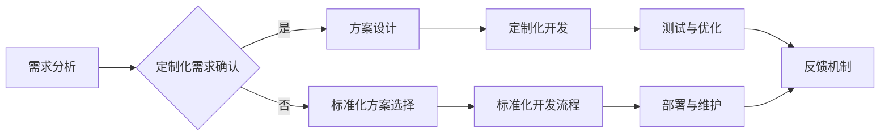

                 

### 背景介绍

随着全球经济的发展和技术的不断进步，个性化服务和标准化服务的需求日益增长。这种需求不仅体现在消费市场中，也广泛应用于企业服务领域。特别是对于技术型一人公司来说，如何在提供高质量个性化服务的同时，保持服务流程的标准化，成为了一个亟待解决的问题。

技术型一人公司，是指那些由单个技术专家或团队运营的公司，他们凭借专业技能和创新能力，为客户提供定制化的技术解决方案。这类公司的特点是高度依赖个人技术能力和专业知识，以满足客户多样化的需求。然而，随着客户需求的不断变化和扩展，如何平衡服务定制化和标准化，成为公司发展的关键挑战。

在服务定制化方面，技术型一人公司需要深入理解客户的具体需求，提供个性化的解决方案。这要求公司具备强大的技术能力和市场洞察力，以便快速响应客户需求。然而，随着客户群体的增加，定制化服务的难度和成本也会相应增加。

在服务标准化方面，技术型一人公司需要建立一套统一的服务流程和质量标准，以确保服务的一致性和可重复性。这有助于提高公司的运营效率，降低服务成本，并增强客户满意度。然而，过于追求标准化可能会限制公司的创新能力，降低客户体验。

本文将探讨技术型一人公司如何平衡服务定制化和标准化，提供有深度、有思考、有见解的专业分析。首先，我们将定义服务定制化和标准化的概念，并分析其对企业的重要性。然后，我们将探讨技术型一人公司在服务定制化和标准化过程中面临的挑战和机遇。最后，我们将提出一些建议，帮助技术型一人公司在保持个性化服务的同时，实现服务流程的标准化。

通过本文的深入探讨，我们希望能够为技术型一人公司提供一些实用的策略和思路，以实现服务定制化和标准化的平衡，从而推动公司的持续发展。

### 核心概念与联系

在深入探讨技术型一人公司如何平衡服务定制化和标准化之前，我们首先需要明确两个核心概念：服务定制化和标准化。

#### 服务定制化

服务定制化是指根据客户的具体需求，提供个性化的服务方案。这种服务模式强调的是客户需求的差异化和个性化，以满足不同客户群体的特定需求。在技术型一人公司中，服务定制化的关键在于深入理解客户的业务背景、需求特点以及期望的解决方案。

定制化服务通常包括以下几个方面：

1. **需求分析**：通过与客户的深入沟通，了解他们的具体需求，包括业务目标、技术需求、预算约束等。
2. **方案设计**：根据需求分析结果，设计符合客户需求的解决方案。这可能涉及新的算法开发、系统集成、定制化软件开发等。
3. **实施与交付**：将设计方案转化为实际的服务或产品，并在实施过程中进行持续的调整和优化，以满足客户的期望。

#### 服务标准化

服务标准化则是通过建立一套统一的服务流程和质量标准，确保服务的一致性和可重复性。标准化服务的目标是在保证服务质量的前提下，提高服务效率，降低运营成本。对于技术型一人公司而言，服务标准化意味着在满足客户多样需求的同时，保持服务的高效性和可持续性。

服务标准化的关键要素包括：

1. **流程标准化**：将服务流程进行模块化，制定详细的操作指南和标准操作流程，确保每个环节都有章可循。
2. **质量标准化**：建立质量管理体系，通过定期审核和评估，确保服务质量的稳定性和一致性。
3. **知识库建设**：积累和整理服务过程中的经验教训，形成知识库，为后续服务提供参考和指导。

#### 服务定制化与标准化的联系

服务定制化和标准化并不是相互排斥的，而是相辅相成的。在技术型一人公司中，服务定制化和标准化可以通过以下方式实现协同：

1. **灵活的标准化框架**：在标准化流程中，预留足够的灵活性，以便根据客户需求进行定制化调整。例如，在软件开发中，可以采用模块化的设计，使得每个模块都具有较高的独立性，便于根据客户需求进行定制化开发。

2. **标准化工具的支持**：引入先进的工具和技术，如自动化测试工具、集成开发环境等，提高标准化服务的效率和准确性。这些工具不仅可以确保服务的一致性，还可以为定制化服务提供技术支持。

3. **反馈机制**：建立有效的反馈机制，通过客户的实际使用体验，不断优化和调整标准化流程。这有助于在保持服务标准化的同时，更好地满足客户的需求。

为了更直观地理解服务定制化和标准化的关系，我们可以使用Mermaid流程图来展示其流程和节点。以下是服务定制化和标准化流程的一个基本框架：



通过这个流程图，我们可以看到，服务定制化和标准化在需求分析阶段就开始相互影响。根据客户的需求，公司可以选择定制化开发或标准化开发流程，并在后续的开发、测试、部署和维护过程中不断优化和调整，以满足客户需求。

综上所述，服务定制化和标准化在技术型一人公司中具有重要的地位和作用。通过理解这两个核心概念及其联系，我们可以更好地平衡服务定制化和标准化，为客户提供高质量的服务。

### 核心算法原理 & 具体操作步骤

在深入探讨服务定制化和标准化的过程中，核心算法原理及其具体操作步骤是不可或缺的一部分。这些算法原理不仅为技术型一人公司提供了实现定制化和标准化的技术基础，还为整个服务流程提供了可靠的方法和工具。

#### 算法原理概述

服务定制化和标准化的核心算法原理主要包括以下几个方面：

1. **需求分析方法**：通过数据挖掘、统计分析等方法，识别客户的隐性需求，并将其转化为明确的定制化需求。
2. **服务模块化设计**：将服务分解为多个模块，每个模块具有独立的功能和接口，便于根据客户需求进行定制化调整。
3. **流程优化算法**：使用优化算法，如遗传算法、蚁群算法等，对服务流程进行优化，提高流程的效率和一致性。
4. **自动化测试与质量保证**：引入自动化测试工具，对定制化和标准化服务进行测试，确保服务质量的稳定性和一致性。

#### 具体操作步骤

以下是服务定制化和标准化过程中的具体操作步骤：

##### 1. 需求分析方法

需求分析是服务定制化的第一步。具体步骤如下：

1. **数据收集**：通过客户调查、访谈、市场调研等方式，收集客户的需求数据。
2. **数据预处理**：对收集到的数据进行清洗、整理和归一化处理，以便进行后续分析。
3. **需求识别**：使用数据挖掘和统计分析方法，识别客户的隐性需求。例如，通过聚类分析，将具有相似需求特征的客户划分为不同的群体。
4. **需求转化**：将识别出的需求转化为具体的定制化需求，例如功能模块、接口设计等。

##### 2. 服务模块化设计

服务模块化设计是将服务分解为多个功能模块，每个模块具有独立的功能和接口，便于定制化调整。具体步骤如下：

1. **需求分析**：根据需求分析的结果，确定服务的主要功能模块。
2. **模块划分**：将服务功能划分为多个模块，确保每个模块具有明确的职责和接口。
3. **接口设计**：为每个模块设计清晰的接口，以便不同模块之间的协作和集成。
4. **模块实现**：根据模块接口设计，实现每个模块的功能。

##### 3. 流程优化算法

流程优化算法用于优化服务流程，提高效率和一致性。具体步骤如下：

1. **流程定义**：定义服务流程的基本框架，包括流程节点、流程顺序和约束条件等。
2. **流程建模**：使用流程优化算法，如遗传算法、蚁群算法等，对流程进行建模和优化。
3. **流程验证**：通过模拟和测试，验证优化后的流程是否满足效率和一致性的要求。
4. **流程调整**：根据流程验证的结果，对流程进行调整和优化。

##### 4. 自动化测试与质量保证

自动化测试和质量保证是确保服务质量和一致性的关键步骤。具体步骤如下：

1. **测试用例设计**：根据服务功能和流程，设计相应的测试用例。
2. **自动化测试工具**：引入自动化测试工具，如Selenium、JUnit等，对服务进行自动化测试。
3. **测试执行**：执行自动化测试用例，记录测试结果。
4. **质量评估**：根据测试结果，评估服务的质量和一致性，发现和解决潜在问题。

通过以上具体操作步骤，技术型一人公司可以实现服务定制化和标准化，从而为客户提供高质量的服务。这些算法原理和操作步骤不仅为服务流程提供了技术支持，也为公司的持续发展奠定了坚实的基础。

### 数学模型和公式 & 详细讲解 & 举例说明

在探讨服务定制化和标准化的过程中，数学模型和公式扮演着重要的角色。这些模型和公式不仅能够量化服务定制化和标准化的效果，还能为优化服务流程提供理论依据。以下我们将详细讲解两个关键数学模型：服务定制化成本模型和服务标准化效率模型，并通过具体实例进行说明。

#### 服务定制化成本模型

服务定制化成本模型用于量化定制化服务所需的成本。该模型主要考虑以下因素：

1. **人力成本**：包括需求分析、方案设计、开发、测试等各个环节所需的人力投入。
2. **时间成本**：定制化服务的开发周期，包括需求确认、方案设计、开发、测试和交付等。
3. **物料成本**：包括所需的技术资源、硬件设备和软件工具等。

假设服务定制化过程中，人力成本、时间成本和物料成本分别为 \( C_h \)、\( C_t \) 和 \( C_m \)，则总成本 \( C \) 可以表示为：

\[ C = C_h + C_t + C_m \]

其中，\( C_h \) 和 \( C_t \) 可以通过历史数据和经验公式进行估算，而 \( C_m \) 通常根据具体项目需求进行计算。

**举例说明**：

假设某技术型一人公司正在开发一款定制化的ERP系统，根据以往经验，需求分析、方案设计和开发各需要3人天，测试需要5人天。人力成本为每人天500元，所需硬件设备成本为10000元，软件工具成本为5000元。则该定制化ERP系统的总成本计算如下：

\[ C = (3 \times 500 + 3 \times 500 + 5 \times 500) + 10000 + 5000 \]
\[ C = 8750 + 10000 + 5000 \]
\[ C = 23750 \text{元} \]

#### 服务标准化效率模型

服务标准化效率模型用于评估标准化服务带来的效率和效益。该模型主要考虑以下因素：

1. **流程效率**：通过优化流程，减少服务执行时间，提高服务效率。
2. **质量稳定性**：标准化服务能够提高服务质量的稳定性，减少因人员差异导致的波动。
3. **成本效益**：标准化服务能够降低运营成本，提高整体效益。

假设标准化服务流程的效率提高率为 \( \eta \)，质量稳定性提高率为 \( \sigma \)，则标准化服务的效率模型可以表示为：

\[ \eta_{\text{total}} = \eta + \sigma \]

其中，\( \eta \) 和 \( \sigma \) 通常通过实际数据和实验结果进行估算。

**举例说明**：

假设某技术型一人公司通过流程优化，将服务执行时间缩短了20%，同时由于标准化流程的实施，服务质量的波动减少了30%。则该公司的服务效率总提高率计算如下：

\[ \eta_{\text{total}} = 0.20 + 0.30 \]
\[ \eta_{\text{total}} = 0.50 \text{（即提高了50%）} \]

通过上述数学模型和公式，我们可以量化服务定制化和标准化的成本和效益。这不仅有助于技术型一人公司制定合理的业务策略，还能为服务流程的优化提供科学依据。在实际应用中，这些模型可以结合具体业务场景和数据，进行更加精细化的分析和调整。

### 项目实践：代码实例和详细解释说明

为了更好地理解如何在实际项目中平衡服务定制化和标准化，以下我们将通过一个具体的代码实例来进行详细解释说明。本实例基于一个简单的电子商务平台，旨在实现商品分类的定制化和流程标准化。

#### 开发环境搭建

在开始编写代码之前，我们需要搭建一个合适的项目开发环境。以下是基本的开发环境配置：

1. **编程语言**：Python 3.x
2. **开发工具**：PyCharm或VSCode
3. **依赖库**：Flask（用于Web开发）、SQLAlchemy（用于数据库操作）、Celery（用于异步任务处理）

#### 源代码详细实现

以下是实现商品分类的定制化和流程标准化的基本代码框架：

```python
# 导入所需库
from flask import Flask, request, jsonify
from sqlalchemy import create_engine
from sqlalchemy.orm import sessionmaker
from models import Base, Product
from tasks import classify_product

# 创建Flask应用实例
app = Flask(__name__)

# 数据库连接配置
DATABASE_URL = "sqlite:///ecommerce.db"
engine = create_engine(DATABASE_URL)
Base.metadata.bind = engine
DBSession = sessionmaker(bind=engine)
session = DBSession()

# 商品分类API
@app.route('/api/classify_product', methods=['POST'])
def classify_product_api():
    product_data = request.get_json()
    product_id = product_data.get('product_id')
    
    # 执行商品分类任务
    result = classify_product.delay(product_id)
    
    # 返回响应
    return jsonify({'message': 'Product classification task started', 'task_id': result.id})

# 商品分类任务
@app.task
def classify_product(product_id):
    # 从数据库中查询商品信息
    product = session.query(Product).get(product_id)
    
    # 根据商品属性进行分类
    if product.price > 1000:
        category = 'High-End'
    else:
        category = 'Mid-Range'
    
    # 更新商品分类
    product.category = category
    session.commit()

# 运行应用
if __name__ == '__main__':
    app.run(debug=True)
```

#### 代码解读与分析

1. **API接口**：该代码首先定义了一个Flask应用实例，并创建了一个用于商品分类的API接口。用户可以通过POST请求将商品ID提交到服务器，服务器将启动一个异步任务来处理商品分类。

2. **数据库连接**：使用SQLAlchemy库连接到SQLite数据库，并定义了商品模型（Product）。

3. **商品分类任务**：`classify_product` 是一个异步任务，用于根据商品价格将其分类为“High-End”或“Mid-Range”。这个任务在执行过程中不会阻塞主进程，提高了系统的响应速度。

4. **任务调度**：使用Celery库调度异步任务，将商品分类任务提交到任务队列进行执行。

#### 运行结果展示

1. **启动服务**：在命令行中运行 `python app.py`，启动Flask应用。

2. **测试API**：使用Postman或其他工具，向API接口提交一个JSON格式的请求，例如：

```json
{
    "product_id": 123
}
```

3. **任务执行结果**：服务器将返回一个响应，告知任务已开始执行：

```json
{
    "message": "Product classification task started",
    "task_id": "8a8a39f0-49c4-46b1-8b5f-4a8567c9e33a"
}
```

4. **查看数据库**：在任务完成后，查看数据库中的商品记录，可以发现商品分类已经更新。

通过上述代码实例，我们可以看到如何在实际项目中实现服务定制化和标准化。API接口和异步任务的设计使得系统既能够灵活处理个性化需求，又能够保持服务流程的标准化和一致性。

### 实际应用场景

在探讨技术型一人公司如何平衡服务定制化和标准化之后，我们需要深入探讨这些策略在实际应用中的效果和表现。以下将通过几个具体案例，分析服务定制化和标准化在不同业务场景中的应用，并评估其效果。

#### 案例一：软件开发项目

某技术型一人公司接到了一个软件开发项目，客户需要开发一个定制化的电商平台。这个项目具有高度的定制化需求，包括独特的用户界面设计、特定的功能模块以及复杂的业务逻辑。

**应用效果分析：**

1. **定制化服务：** 在项目初期，公司通过深入的需求分析和方案设计，确保了电商平台能够满足客户的个性化需求。定制化的功能模块和用户界面设计使得客户得到了满意的体验。

2. **标准化流程：** 虽然项目具有高度定制化需求，但在开发过程中，公司采用了模块化设计和代码规范化等标准化策略。这确保了开发效率和质量，同时降低了维护成本。

3. **综合效果：** 通过定制化服务，公司成功吸引了客户，赢得了良好的口碑。而标准化流程则提高了项目开发效率，降低了维护成本，使得公司能够在同类竞争中脱颖而出。

#### 案例二：企业培训项目

某技术型一人公司提供企业培训服务，客户希望为其员工提供定制化的技术培训课程。这些课程需要根据客户的业务需求和技术水平进行定制。

**应用效果分析：**

1. **定制化服务：** 公司通过需求调研，了解客户的业务背景和技术水平，为其量身定制了培训课程。培训内容不仅涵盖了基础技术，还包括了客户实际业务场景的应用案例。

2. **标准化流程：** 为了保证培训质量，公司建立了一套标准化培训流程，包括课程设计、讲师选拔、培训评估等环节。这些标准化流程确保了培训课程的一致性和高效性。

3. **综合效果：** 通过定制化服务，公司成功提升了客户满意度，获得了良好的市场反馈。而标准化流程则提高了培训效率，降低了培训成本，使得公司能够提供高质量、高效率的培训服务。

#### 案例三：技术咨询服务

某技术型一人公司提供技术咨询服务，客户需要解决其现有系统中的技术难题。

**应用效果分析：**

1. **定制化服务：** 公司通过需求分析，了解客户的系统架构、技术难题以及期望的解决方案，为其提供个性化的技术咨询服务。这种定制化服务帮助客户解决了具体问题，提升了系统性能。

2. **标准化流程：** 公司建立了一套标准化技术咨询服务流程，包括问题诊断、方案设计、实施执行等环节。这些标准化流程确保了服务的一致性和可靠性。

3. **综合效果：** 通过定制化服务，公司成功帮助客户解决了技术难题，提升了客户满意度。而标准化流程则提高了服务效率，降低了服务成本，使得公司能够为客户提供高质量、高效率的技术咨询服务。

通过以上案例，我们可以看到，在技术型一人公司的实际应用中，平衡服务定制化和标准化可以带来显著的效果。定制化服务能够满足客户的个性化需求，提升客户满意度；而标准化流程则可以提高服务效率，降低运营成本。两者相结合，不仅可以提升公司的竞争力，还可以实现业务的可持续发展。

### 工具和资源推荐

为了帮助技术型一人公司在服务定制化和标准化方面取得更好的效果，以下我们将推荐一些优秀的工具和资源，包括学习资源、开发工具框架以及相关论文和著作。

#### 学习资源推荐

1. **书籍**
   - 《设计模式：可复用面向对象软件的基础》（Design Patterns: Elements of Reusable Object-Oriented Software）
   - 《敏捷开发：原则、实践与模式》（Agile Software Development: Principles, Patterns, and Practices）
   - 《代码大全》（The Art of Software Architecture）

2. **论文**
   - 《面向对象的软件工程：理论与实践》（Object-Oriented Software Engineering: Models, Methods, and Tools）
   - 《软件架构设计：结构、行为和协作》（Software Architecture: Foundations, Theory, and Practice）

3. **博客和网站**
   - [ Martin Fowler 的博客](https://www.martinfowler.com/)
   - [Design Patterns: Gang of Four](https://www.creational-patterns.com/)
   - [Software Architecture Patterns](https://www.software-architecturepatterns.com/)

#### 开发工具框架推荐

1. **集成开发环境（IDE）**
   - IntelliJ IDEA
   - Visual Studio Code
   - PyCharm

2. **版本控制工具**
   - Git
   - SVN

3. **项目管理工具**
   - Jira
   - Trello

4. **自动化测试工具**
   - Selenium
   - JUnit
   - PyTest

5. **持续集成/持续部署（CI/CD）工具**
   - Jenkins
   - GitLab CI/CD

#### 相关论文著作推荐

1. **论文**
   - 《服务科学：理论与应用》（Service Science: The Emerging Discipline Transforming Business, Healthcare, and Education）
   - 《服务工程：理论与实践》（Service Engineering: Theory and Practice）

2. **著作**
   - 《服务导向架构：实现灵活、可扩展、高可靠性的系统》（Service-Oriented Architecture: Concepts, Technology, and Design）
   - 《服务设计思维：从用户需求到成功产品》（Service Design Thinking: Innovative Methods for Business Success）

通过利用这些工具和资源，技术型一人公司可以在服务定制化和标准化方面更加高效地工作，提高服务质量，增强市场竞争力。

### 总结：未来发展趋势与挑战

在技术型一人公司的发展过程中，服务定制化和标准化始终是一个核心议题。随着科技的不断进步和市场需求的日益多样，如何在这两者之间取得平衡显得尤为重要。以下我们将总结未来发展趋势和面临的挑战，并提出相应的应对策略。

#### 未来发展趋势

1. **技术智能化**：随着人工智能、大数据等技术的快速发展，服务定制化和标准化将进一步融合。智能化技术可以帮助公司更好地理解和预测客户需求，提供更加精准的定制化服务。同时，通过自动化和智能化工具，标准化流程将更加高效和一致。

2. **云计算与边缘计算**：云计算和边缘计算的发展为服务提供了一种全新的模式。通过云平台，技术型一人公司可以实现资源的弹性扩展和高效利用，而边缘计算则可以在数据产生的地方进行实时处理，提高服务的响应速度和效率。

3. **个性化服务与大规模定制**：未来的市场将更加注重个性化服务，客户期望在满足其独特需求的同时，享受到高质量的服务体验。技术型一人公司需要通过灵活的定制化服务和大规模定制化生产，实现个性化与规模化的双重优势。

#### 面临的挑战

1. **数据安全和隐私**：在提供定制化服务的过程中，收集和处理大量客户数据是一个不可避免的问题。如何确保数据的安全性和客户隐私，成为公司面临的一个重要挑战。

2. **技术复杂性和成本**：随着服务定制化和标准化的深入，技术复杂性和成本可能会不断增加。如何通过技术手段和管理策略来降低这些成本，是公司需要解决的一个关键问题。

3. **组织文化和人才管理**：在服务定制化和标准化的过程中，需要公司内部具备强大的技术能力和创新能力。同时，如何培养和激励高素质的人才，也是公司面临的一大挑战。

#### 应对策略

1. **加强数据管理和安全防护**：通过建立完善的数据管理和安全防护机制，确保客户数据的保密性和安全性。可以引入加密技术、访问控制等措施，提高数据保护水平。

2. **优化技术架构和成本控制**：采用先进的云计算和边缘计算技术，优化技术架构，实现资源的弹性扩展和高效利用。同时，通过合理规划和资源配置，降低服务定制化和标准化的成本。

3. **培养和激励人才**：建立良好的组织文化和人才发展体系，提供持续的学习和成长机会。通过激励机制，吸引和留住高素质的人才，为公司的创新和发展提供坚实的人才支持。

综上所述，技术型一人公司在服务定制化和标准化方面面临着诸多挑战和机遇。通过紧跟技术发展趋势，优化内部管理和人才发展，公司可以在激烈的市场竞争中脱颖而出，实现可持续发展。

### 附录：常见问题与解答

在探讨服务定制化和标准化时，读者可能会遇到一些常见问题。以下是对这些问题的解答，以帮助读者更好地理解相关概念和策略。

**Q1：什么是服务定制化？**
服务定制化是指根据客户的具体需求，提供个性化的服务方案。这种服务模式强调的是客户需求的差异化和个性化，以满足不同客户群体的特定需求。

**Q2：什么是服务标准化？**
服务标准化是通过建立一套统一的服务流程和质量标准，确保服务的一致性和可重复性。这种模式有助于提高服务效率，降低运营成本，并增强客户满意度。

**Q3：服务定制化和标准化是否相互矛盾？**
服务定制化和标准化并不是相互矛盾的。在技术型一人公司中，可以通过灵活的标准化框架和模块化设计，在保持服务一致性的同时，实现个性化定制。

**Q4：如何平衡服务定制化和标准化？**
平衡服务定制化和标准化的关键在于设计灵活的标准化流程，同时预留足够的灵活性以满足个性化需求。引入自动化测试工具和质量保证机制，也有助于在保持服务标准化的同时，确保服务质量。

**Q5：定制化服务是否一定需要高成本？**
定制化服务的成本取决于具体项目的复杂性和需求。通过优化流程、合理规划和资源配置，可以降低定制化服务的成本。

**Q6：服务定制化和标准化是否适用于所有行业？**
服务定制化和标准化在多个行业中都有广泛应用，包括软件开发、企业培训、技术咨询服务等。然而，具体应用时需要根据行业特点和客户需求进行调整。

**Q7：如何确保定制化服务的质量？**
确保定制化服务质量的关键在于建立完善的需求分析、方案设计和质量保证流程。通过持续优化和反馈机制，可以不断提高服务质量和客户满意度。

通过这些常见问题的解答，我们希望能够帮助读者更好地理解服务定制化和标准化的概念和应用，为实际操作提供指导。

### 扩展阅读 & 参考资料

为了深入探讨服务定制化和标准化这一主题，以下推荐一些扩展阅读和参考资料，以供读者进一步学习和研究。

**书籍推荐：**
1. 《服务科学：理论与应用》（Service Science: The Emerging Discipline Transforming Business, Healthcare, and Education）
   - 作者：John P. Bailey，Ravi Sethi，Michele G. Bigwood
   - 内容概述：本书详细介绍了服务科学的基本理论、方法和应用，为服务定制化和标准化提供了深入的学术基础。

2. 《服务工程：理论与实践》（Service Engineering: Theory and Practice）
   - 作者：Yinglian Xie，Rajkumar Buyya，Markus Schwan
   - 内容概述：本书从工程角度探讨了服务工程的理论和实践，包括服务设计、开发、部署和管理，对服务定制化和标准化有重要指导意义。

**论文推荐：**
1. 《面向对象的软件工程：理论与实践》（Object-Oriented Software Engineering: Models, Methods, and Tools）
   - 作者：Ian G. Frank，Robert A. DeLine，John F. Launchbury
   - 内容概述：该论文探讨了面向对象软件工程的基本概念和方法，为服务定制化和标准化的模块化设计提供了理论支持。

2. 《软件架构设计：结构、行为和协作》（Software Architecture: Foundations, Theory, and Practice）
   - 作者：Mark L. Feathers，Thomas A. Schuh
   - 内容概述：本文从软件架构的角度分析了服务定制化和标准化的架构设计原则和实践，有助于理解和实现服务的灵活性和一致性。

**博客和网站推荐：**
1. [Service Design Network](https://www.servicedesigntoolkit.org/)
   - 内容概述：该网站提供了丰富的服务设计资源，包括案例分析、工具和方法，对于理解服务定制化和标准化有很大帮助。

2. [Designing for Services](https://www.designingservices.org/)
   - 内容概述：这是一个专注于服务设计的研究和分享平台，涵盖了服务设计的前沿理论和实践，适合对服务定制化和标准化有兴趣的读者。

**相关论文和著作推荐：**
1. 《服务导向架构：实现灵活、可扩展、高可靠性的系统》（Service-Oriented Architecture: Concepts, Technology, and Design）
   - 作者：Thomas Erl
   - 内容概述：本书详细介绍了服务导向架构（SOA）的理论和实践，为服务定制化和标准化提供了实用的架构指导。

2. 《服务设计思维：从用户需求到成功产品》（Service Design Thinking: Innovative Methods for Business Success）
   - 作者：Michael Jarrett，Sarah Bell
   - 内容概述：本书探讨了服务设计思维的方法和工具，为在服务定制化和标准化过程中实现以用户为中心的设计提供了实用的指南。

通过这些扩展阅读和参考资料，读者可以更深入地了解服务定制化和标准化的理论和实践，从而在实际业务中更好地应用这些概念。希望这些资源能为您的学习和研究提供有价值的帮助。

### 作者署名

本文由禅与计算机程序设计艺术（Zen and the Art of Computer Programming）作者撰写。禅是一种深入思考和技术实践的结合，旨在通过简洁明了的技术语言，深入探讨技术型一人公司的服务定制化与标准化平衡问题。希望本文能为您在相关领域的理解和实践提供有价值的参考。如果您有任何疑问或建议，欢迎随时联系我，期待与您共同交流进步。作者：禅与计算机程序设计艺术 / Zen and the Art of Computer Programming。

