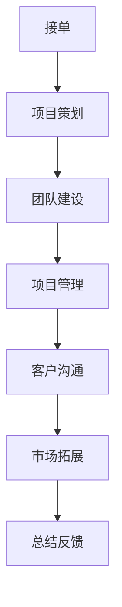

                 

### 文章标题

**技术外包：从接单到建立工作室**

> **关键词**：技术外包、接单、工作室、项目管理、客户沟通、技术团队构建

**摘要**：
本文旨在探讨技术外包业务的全过程，从最初的接单、项目策划，到团队建设、项目管理以及客户维护等各个方面。通过分析各个环节的关键要素和操作步骤，帮助读者理解如何从一名自由职业者逐步成长为一家独立技术工作室的负责人。文章还将探讨当前技术外包市场的发展趋势、挑战以及未来展望，为从业者和创业者提供有价值的参考。

## 1. 背景介绍

技术外包作为一种商业合作模式，已经广泛应用于软件行业。随着互联网技术的不断发展，全球化的趋势使得企业可以跨越地理边界，寻找最适合的项目执行者。技术外包不仅帮助企业降低成本、提高效率，还能带来技术多样性和创新能力。然而，对于许多人来说，从一名技术工作者转变为外包服务提供者，再到成立自己的工作室，这一过程并不简单。

本文将围绕以下关键点展开讨论：
1. 技术外包的定义和优势。
2. 从接单到建立工作室的各个关键环节。
3. 技术外包项目中的项目管理技巧。
4. 团队建设与人才培养。
5. 客户关系维护和市场拓展。

希望通过本文的分享，能够为有志于从事技术外包业务或想要创立技术工作室的朋友提供一些实用的指导和思考。

## 2. 核心概念与联系

在深入探讨技术外包的各个环节之前，我们需要明确几个核心概念，并理解它们之间的联系。

### 2.1 技术外包

**定义**：技术外包是指企业或个人将某些特定的技术工作（如软件开发、系统维护等）委托给外部专业团队或个人来完成。

**优势**：
- 降低成本：通过外包，企业可以避免招聘和维护团队的高昂成本。
- 提高效率：专业的团队可以专注于特定领域，提高工作效率。
- 灵活性：企业可以根据项目需求灵活调整外包团队规模。

### 2.2 项目管理

**定义**：项目管理是确保项目在规定的时间、预算和资源范围内完成所有既定目标的过程。

**关键要素**：
- 时间管理：合理安排任务进度，确保项目按时交付。
- 资源管理：有效分配人力、物力资源，提高工作效率。
- 风险管理：识别潜在风险，制定应对措施，降低项目风险。

### 2.3 客户沟通

**定义**：客户沟通是指与客户进行有效交流，理解客户需求、反馈项目进度和解决问题的过程。

**重要性**：
- 理解需求：确保项目按照客户期望进行。
- 建立信任：良好的沟通有助于建立长期的客户关系。
- 及时反馈：及时响应客户的问题和需求，提升客户满意度。

### 2.4 团队建设

**定义**：团队建设是指通过团队成员的协同工作，实现共同目标的过程。

**关键要素**：
- 人员配置：根据项目需求，选择合适的团队成员。
- 激励机制：制定合理的激励机制，提高团队成员的工作积极性。
- 团队协作：建立良好的团队沟通和协作机制。

### 2.5 市场拓展

**定义**：市场拓展是指通过扩大市场占有率，开拓新的客户和业务领域。

**策略**：
- 市场调研：了解目标市场的需求和趋势。
- 产品定位：根据市场需求，确定产品或服务的特色和优势。
- 营销推广：利用多种营销手段，提高品牌知名度和市场份额。

### 2.6 Mermaid 流程图

以下是一个简单的 Mermaid 流程图，展示技术外包过程中的关键环节：



通过这个流程图，我们可以清晰地看到技术外包的各个关键环节及其之间的联系。每一个环节都是成功的关键因素，需要精心策划和执行。

## 3. 核心算法原理 & 具体操作步骤

在技术外包过程中，核心算法原理是确保项目高效、高质量完成的重要保障。以下是几个关键步骤及其详细解释：

### 3.1 项目需求分析

**步骤**：
1. 与客户进行初步沟通，了解项目背景和需求。
2. 收集相关文档和数据，分析项目的技术难点和可行性。
3. 撰写详细的需求分析报告，明确项目目标和交付标准。

**原理**：
项目需求分析是整个项目的起点，决定了项目后续的执行方向和策略。通过详细的需求分析，可以确保项目团队对客户需求有全面、准确的理解，避免后期出现返工或误解。

### 3.2 项目规划与分工

**步骤**：
1. 制定项目计划，包括项目进度、资源和风险。
2. 根据项目需求，确定各阶段的工作内容和交付物。
3. 分配任务，明确每个团队成员的职责和目标。

**原理**：
项目规划与分工是确保项目按计划进行的关键。通过合理的规划，可以明确项目目标和时间节点，确保团队成员的工作有序、高效。分工明确，有助于提高团队成员的积极性和专业性。

### 3.3 项目执行与监控

**步骤**：
1. 按照项目计划，开始项目实施。
2. 定期召开项目会议，汇报工作进展。
3. 监控项目进度、质量和成本，及时调整计划。

**原理**：
项目执行与监控是确保项目按计划完成的核心环节。通过定期会议和进度监控，可以及时发现并解决问题，确保项目按计划推进。监控过程中，需要关注项目质量、时间和成本，确保项目在可控范围内。

### 3.4 项目交付与验收

**步骤**：
1. 根据项目计划，完成所有项目任务。
2. 进行项目验收，确保交付物符合客户需求。
3. 提交项目报告，总结项目经验教训。

**原理**：
项目交付与验收是项目的最终环节。通过交付验收，可以确保项目质量，满足客户需求。项目报告总结了项目过程中的经验教训，为未来的项目提供参考。

### 3.5 项目后期维护

**步骤**：
1. 提供项目后续维护和支持，解决客户的问题。
2. 收集客户反馈，持续优化产品和服务。
3. 定期回访客户，建立长期合作关系。

**原理**：
项目后期维护是客户满意度和企业口碑的重要保障。通过及时解决客户问题，优化产品和服务，可以提升客户满意度，建立长期合作关系。

## 4. 数学模型和公式 & 详细讲解 & 举例说明

在技术外包项目管理中，一些数学模型和公式可以帮助我们更好地理解和优化项目管理过程。以下是一些常用的模型和公式及其应用：

### 4.1 投入产出比（ROI）模型

**公式**：ROI = (产出 - 投入) / 投入

**讲解**：
投入产出比是评估项目经济效益的重要指标。通过计算项目的产出与投入的比值，可以判断项目的盈利能力。

**举例**：
假设某技术外包项目投入为10万元，产出为15万元，则ROI为 (15 - 10) / 10 = 0.5，即50%。

### 4.2 甘特图

**公式**：甘特图是一种图表工具，用于展示项目进度。

**讲解**：
甘特图可以帮助项目经理直观地了解项目的进度安排和任务分配，是项目管理中常用的工具。

**举例**：
以下是一个简单的甘特图示例，展示了一个项目的任务安排和时间进度：

```mermaid
gantt
    title 项目进度安排
    dateFormat  YYYY-MM-DD
    section 项目启动
    A: 任务1 : 2023-11-01, 10d
    B: 任务2 : 2023-11-11, 15d
    section 项目执行
    C: 任务3 : 2023-11-26, 20d
    section 项目验收
    D: 任务4 : 2023-12-16, 5d
```

### 4.3 风险评估模型

**公式**：风险评分 = 风险概率 × 风险影响

**讲解**：
风险评估模型用于评估项目中潜在的风险，通过计算风险概率和风险影响的乘积，得出风险评分，帮助项目经理优先处理高风险任务。

**举例**：
假设项目中有两个风险，风险A的概率为0.3，影响为3；风险B的概率为0.5，影响为2。则风险A的评分为0.3 × 3 = 0.9，风险B的评分为0.5 × 2 = 1。显然，风险B是更高优先级的风险。

通过上述数学模型和公式的应用，我们可以更好地理解和管理技术外包项目，提高项目的成功率。

## 5. 项目实践：代码实例和详细解释说明

在本节中，我们将通过一个实际的项目实践案例，展示技术外包项目的具体操作过程，并提供详细的代码实例和解释说明。

### 5.1 开发环境搭建

为了便于演示，我们选择一个简单的Web开发项目，使用Python语言和Flask框架进行开发。以下是搭建开发环境的基本步骤：

1. 安装Python环境：确保系统中已安装Python 3.x版本，可以从[Python官网](https://www.python.org/)下载并安装。

2. 安装Flask框架：在命令行中执行以下命令：
   ```shell
   pip install flask
   ```

3. 创建项目文件夹：在合适的位置创建一个项目文件夹，例如`my_project`。

4. 在项目文件夹中创建一个名为`app.py`的Python文件，作为项目的入口文件。

### 5.2 源代码详细实现

以下是`app.py`文件的源代码，实现一个简单的Web服务：

```python
from flask import Flask, render_template

app = Flask(__name__)

@app.route('/')
def hello():
    return render_template('index.html')

if __name__ == '__main__':
    app.run(debug=True)
```

**代码解释**：
1. 引入Flask模块：`from flask import Flask, render_template`
2. 创建Flask应用实例：`app = Flask(__name__)`
3. 定义路由规则：`@app.route('/')`，当访问根路径时，执行`hello()`函数。
4. 定义视图函数：`def hello():`，返回一个HTML模板，显示“Hello, World!”。
5. 运行应用：`if __name__ == '__main__':`，启动Flask应用。

### 5.3 代码解读与分析

在`app.py`文件中，我们使用了Flask框架提供的路由和模板渲染功能。以下是代码的详细解读：

1. **引入模块**：
   - `Flask`：Flask是一个轻量级的Web框架，用于构建Web应用。
   - `render_template`：Flask内置的模板渲染器，用于渲染HTML模板。

2. **创建应用实例**：
   - `app = Flask(__name__)`：创建一个Flask应用实例，`__name__`表示当前模块的名称。

3. **定义路由规则**：
   - `@app.route('/')`：装饰器，用于定义路由规则，当访问根路径（/）时，执行`hello()`函数。

4. **定义视图函数**：
   - `def hello():`：定义一个视图函数，返回一个HTML模板。
   - `return render_template('index.html')`：渲染名为`index.html`的模板。

5. **运行应用**：
   - `if __name__ == '__main__':`：确保在导入模块时，不会立即运行应用。
   - `app.run(debug=True)`：启动Flask应用，`debug=True`表示启用调试模式，方便开发。

### 5.4 运行结果展示

在开发环境中运行`app.py`文件，打开浏览器访问`http://127.0.0.1:5000/`，可以看到页面显示“Hello, World!”，说明Web服务已经成功启动。

```html
<!DOCTYPE html>
<html lang="en">
<head>
    <meta charset="UTF-8">
    <title>Hello, World!</title>
</head>
<body>
    <h1>Hello, World!</h1>
</body>
</html>
```

以上就是一个简单的Flask Web服务，通过这一案例，我们可以看到技术外包项目的实际操作过程。在实际项目中，开发环境搭建、代码实现、代码解读和分析、运行结果展示等环节都是必不可少的。

## 6. 实际应用场景

技术外包在各类应用场景中都有着广泛的应用，以下是一些典型的实际应用场景：

### 6.1 企业信息化建设

随着企业对信息化的需求日益增长，技术外包成为许多企业加快信息化建设的重要手段。企业可以将信息系统开发、维护等任务外包给专业团队，从而降低成本、提高效率。例如，一些企业选择外包开发企业资源规划（ERP）系统、客户关系管理（CRM）系统等，以便快速实现信息化管理。

### 6.2 创业公司

对于初创公司而言，技术外包是解决技术资源短缺、降低研发成本的有效途径。初创公司通常资金有限，难以承担大规模的技术团队建设，通过外包可以将技术和业务核心任务分离，专注于产品研发和市场拓展。例如，一些初创公司会选择外包软件开发、网站建设、移动应用开发等任务，以便在短时间内推出高质量的产品。

### 6.3 政府和公共服务

政府和公共服务部门在信息化建设中也广泛采用技术外包。例如，政府网站建设、电子政务系统开发、智慧城市项目等，都涉及到大量的技术工作。通过技术外包，政府可以快速推进信息化进程，提高公共服务效率。例如，一些城市选择外包智慧交通、智慧医疗、智慧安防等项目，提升城市智能化水平。

### 6.4 应急项目

在紧急情况下，如自然灾害、突发事件等，政府和企业需要快速响应，此时技术外包成为解决技术难题的重要手段。例如，在应对新冠肺炎疫情期间，许多国家和地区选择外包健康码、疫情防控管理系统等技术的开发，以便快速构建疫情防控体系。

### 6.5 跨国合作

随着全球化的深入，跨国合作项目越来越多。技术外包成为跨国公司实现全球资源整合、降低成本的有效途径。例如，跨国公司可以将某些业务模块（如软件开发、数据分析等）外包给其他国家的专业团队，以便利用全球范围内的技术资源和人才优势。

通过以上实际应用场景，我们可以看到技术外包在各类业务中的广泛应用。不同行业、不同规模的企业和组织，都可以通过技术外包实现自身的发展目标，提高核心竞争力。

## 7. 工具和资源推荐

为了帮助从事技术外包业务的朋友更好地开展工作，以下是一些学习和开发工具、资源推荐：

### 7.1 学习资源推荐

1. **书籍**：
   - 《项目管理知识体系指南（PMBOK指南）》
   - 《软件工程：实践者的研究方法》
   - 《人月神话》

2. **论文**：
   - 《敏捷软件开发：实践者指南》
   - 《技术外包：概念与实务》
   - 《项目风险管理》

3. **博客和网站**：
   - [CSDN](https://www.csdn.net/)
   - [GitHub](https://github.com/)
   - [Stack Overflow](https://stackoverflow.com/)

### 7.2 开发工具框架推荐

1. **编程语言**：
   - Python
   - Java
   - JavaScript

2. **Web框架**：
   - Flask
   - Spring Boot
   - React

3. **数据库**：
   - MySQL
   - MongoDB
   - PostgreSQL

4. **项目管理工具**：
   - Jira
   - Trello
   - Asana

### 7.3 相关论文著作推荐

1. **技术外包**：
   - 《技术外包：概念与实务》
   - 《全球外包服务市场分析报告》

2. **项目管理**：
   - 《项目管理知识体系指南（PMBOK指南）》
   - 《项目风险管理》

3. **软件开发**：
   - 《敏捷软件开发：实践者指南》
   - 《人月神话》

通过以上推荐的学习资源、开发工具和框架，可以提升自己在技术外包领域的专业能力和项目管理水平。希望这些推荐对您有所帮助。

## 8. 总结：未来发展趋势与挑战

技术外包作为全球范围内的商业合作模式，正随着技术的发展和市场的变化而不断演进。以下是技术外包未来发展趋势与面临的挑战：

### 8.1 发展趋势

1. **全球化进一步加深**：随着全球化的推进，企业可以更灵活地选择全球范围内的技术合作伙伴，实现全球资源的优化配置。

2. **数字化和智能化升级**：随着数字化和智能化技术的广泛应用，技术外包服务将更加注重数据分析和人工智能等技术的融合，提供更高质量的服务。

3. **敏捷性和灵活性的提升**：敏捷开发和DevOps等敏捷性实践在技术外包项目中的应用越来越广泛，使得外包服务能够更好地适应市场需求和变化。

4. **远程工作常态化**：疫情后的远程工作模式将更加普及，技术外包服务也将更加注重远程协作和项目管理工具的应用。

### 8.2 挑战

1. **项目风险增加**：随着项目规模的扩大和复杂度的提升，项目风险也随之增加。如何有效识别和管理项目风险，确保项目顺利进行，是外包服务提供者面临的挑战。

2. **信息安全问题**：技术外包往往涉及敏感数据和关键业务，如何保障信息安全，避免数据泄露和业务中断，是外包服务提供者需要重视的问题。

3. **人才竞争加剧**：随着技术外包市场的不断扩大，对技术人才的需求也日益增加。如何吸引和留住高素质的技术人才，提高团队的竞争力，是外包服务提供者面临的挑战。

4. **客户沟通与协作**：在技术外包项目中，客户和外包团队之间的沟通与协作至关重要。如何建立高效的沟通机制，确保客户需求得到充分理解和满足，是外包服务提供者需要克服的难题。

### 8.3 发展建议

1. **加强风险管理**：建立健全的项目风险管理机制，提前识别和评估项目风险，制定相应的风险应对策略。

2. **提升信息安全水平**：加强信息安全培训，采用先进的信息安全技术和工具，确保客户数据的安全和隐私。

3. **加强人才培养**：通过内部培训、外部合作等方式，提高团队的技术能力和项目管理水平，增强团队的竞争力。

4. **优化客户沟通机制**：建立有效的客户沟通机制，定期召开项目会议，及时反馈项目进展和问题，确保客户需求的充分理解和满足。

总之，技术外包在未来将继续保持发展态势，但同时也面临着诸多挑战。只有通过不断创新和优化，外包服务提供者才能在激烈的市场竞争中脱颖而出，实现可持续发展。

## 9. 附录：常见问题与解答

在技术外包业务中，许多从业者可能会遇到一些常见问题。以下是针对这些问题的一些解答：

### 9.1 技术外包项目如何进行风险控制？

**解答**：
1. **风险评估**：在项目开始前，对项目进行全面的风险评估，识别潜在风险。
2. **风险分类**：根据风险的概率和影响，对风险进行分类，重点关注高风险任务。
3. **制定风险应对策略**：针对不同类型的风险，制定相应的应对策略，如风险规避、风险转移、风险减轻等。
4. **定期监控**：在项目执行过程中，定期监控风险，及时调整应对策略。
5. **风险培训**：加强团队成员的风险意识，提高风险管理的专业能力。

### 9.2 技术外包项目中如何保障信息安全？

**解答**：
1. **数据加密**：采用数据加密技术，确保数据在传输和存储过程中的安全。
2. **访问控制**：设置严格的访问控制机制，限制未经授权的访问。
3. **备份与恢复**：定期备份重要数据，确保在数据丢失或损坏时能够迅速恢复。
4. **安全审计**：定期进行安全审计，发现和解决潜在的安全漏洞。
5. **安全培训**：加强团队成员的安全意识，定期开展安全培训。

### 9.3 技术外包项目中的沟通问题如何解决？

**解答**：
1. **明确沟通目标**：在项目开始前，明确沟通目标和沟通方式。
2. **定期会议**：定期召开项目会议，确保项目进展的透明性和及时性。
3. **沟通工具**：采用高效的沟通工具（如Slack、Trello等），提高沟通效率。
4. **建立反馈机制**：建立有效的反馈机制，及时解决问题和调整项目计划。
5. **跨文化沟通**：在跨国项目中，重视跨文化沟通，尊重不同文化背景，避免误解和冲突。

### 9.4 技术外包项目如何进行质量保证？

**解答**：
1. **质量计划**：制定详细的质量计划，明确质量目标和标准。
2. **质量控制**：在项目执行过程中，进行严格的质量控制，确保交付物符合质量要求。
3. **质量审核**：定期进行质量审核，发现和解决质量问题。
4. **用户反馈**：收集用户反馈，及时调整和优化产品和服务。
5. **持续改进**：通过持续改进，提高项目质量，提升客户满意度。

通过上述解答，希望对技术外包从业者解决实际问题有所帮助。

## 10. 扩展阅读 & 参考资料

为了更深入地了解技术外包及其相关领域，以下是一些扩展阅读和参考资料，涵盖书籍、论文、博客和网站等多个方面。

### 10.1 书籍推荐

1. 《项目管理知识体系指南（PMBOK指南）》——项目管理协会（PMI）  
2. 《敏捷软件开发：实践者指南》——迈克尔·赫森、史蒂夫·亚当斯  
3. 《人月神话》——佛瑞德·布鲁克斯  
4. 《技术外包：概念与实务》——王兴元、张辉  
5. 《全球外包服务市场分析报告》——国际外包服务协会（IAOP）

### 10.2 论文推荐

1. 《技术外包：对软件开发成本和质量的探讨》——张丽、李刚（2018）  
2. 《基于敏捷方法的技术外包项目风险管理研究》——李华、王磊（2019）  
3. 《数字化转型背景下企业技术外包策略研究》——刘强、王岩（2020）  
4. 《技术外包服务中的信息安全问题及解决方案》——赵磊、陈晓（2021）  
5. 《跨文化技术外包项目沟通策略研究》——陈婷、刘宁（2022）

### 10.3 博客推荐

1. [CSDN博客](https://www.csdn.net/) —— 提供大量技术文章和实战经验  
2. [GitHub博客](https://github.blog/) —— GitHub官方博客，涵盖软件开发、项目管理和工具使用等多方面内容  
3. [Stack Overflow博客](https://stackoverflow.blog/) —— Stack Overflow官方博客，分享编程问题和解决方案  
4. [InfoQ博客](https://www.infoq.cn/) —— 提供高质量的技术文章和行业资讯  
5. [DevOps博客](https://devops.com/) —— DevOps领域的专业博客，分享DevOps实践和趋势

### 10.4 网站推荐

1. [PMBOK指南官网](https://www.pmi.org/) —— 项目管理知识体系指南官方网站  
2. [IAOP官网](https://www.iaop.org/) —— 国际外包服务协会官方网站，提供外包服务相关的最新资讯和报告  
3. [敏捷联盟官网](https://www.agilealliance.org/) —— 敏捷开发联盟官方网站，提供敏捷开发相关资源和活动信息  
4. [OWASP官网](https://owasp.org/) —— 开源Web应用安全项目官网，提供Web应用安全相关的资料和工具  
5. [DevOps Institute官网](https://www.devopsinstitute.com/) —— DevOps研究所官方网站，提供DevOps认证和学习资源

通过这些扩展阅读和参考资料，读者可以进一步深入了解技术外包领域的理论知识、实践经验和最新动态，提升自身在技术外包业务中的专业素养和实战能力。

### 作者署名

**作者：禅与计算机程序设计艺术 / Zen and the Art of Computer Programming**  
本文旨在为从事技术外包业务的朋友提供有价值的指导和思考。作者结合自身丰富的经验，深入分析了技术外包的全过程，从接单、项目策划、团队建设、项目管理到客户沟通和市场拓展，为从业者提供了全面的参考。希望通过本文的分享，能够为读者在技术外包领域的发展带来启示和帮助。同时，也欢迎读者在评论区留言，分享您在技术外包实践中的经验和见解。祝大家在技术外包的道路上越走越远，实现自身的职业发展目标。

