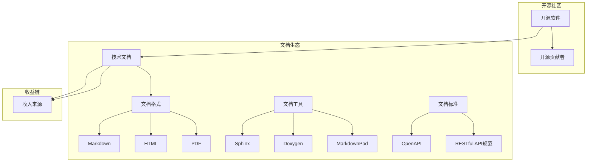

                 

### 背景介绍

#### 1.1 技术文档服务的兴起

随着开源软件的普及，技术文档服务在近年来逐渐成为软件开发过程中不可或缺的一部分。开源软件因其共享、协作和创新的特性，吸引了大量的开发者参与其中。然而，许多开源项目往往缺乏完善的技术文档，这给新手开发者带来了不小的困扰。

技术文档服务的兴起，正是为了解决这一痛点。它不仅提供了详细的项目介绍、安装指南、使用教程和API文档，还涉及代码示例、最佳实践以及常见问题的解答。这些内容极大地降低了开发者入门的难度，提高了项目的可维护性和可扩展性。

#### 1.2 开源贡献者与收入来源

开源贡献者，即那些无偿或部分无偿为开源项目做出贡献的开发者，他们通过代码、文档、测试和社区互动等多种方式，推动了开源生态的繁荣。然而，对于许多开源贡献者来说，他们往往面临着收入不稳定的问题。

技术文档服务为开源贡献者提供了一种新的收入来源。通过撰写和更新技术文档，贡献者可以获得稿费、赞助或合作伙伴关系的收益。这不仅有助于提高他们的生活质量，还能激励他们更加积极地参与开源项目。

#### 1.3 技术文档服务的市场需求

随着技术的快速发展，越来越多的企业开始采用开源软件作为其业务的核心组件。然而，这些企业在使用开源软件时，往往需要专业的技术支持和文档服务。这种市场需求为技术文档服务提供了广阔的发展空间。

一方面，企业需要了解开源软件的详细功能、使用方法和最佳实践，以便更好地集成和优化其业务流程。另一方面，开源项目也需要专业的文档来吸引更多的企业和开发者参与，从而推动项目的可持续发展。

#### 1.4 技术文档服务的价值

技术文档服务不仅对开源项目和企业具有重要意义，还对整个技术生态产生了积极影响。

首先，它提高了项目的可维护性。详细的技术文档可以帮助开发者更快地理解项目结构、功能实现和代码逻辑，从而减少开发过程中的错误和重复劳动。

其次，它促进了知识的传播。通过技术文档，开发者可以分享他们的经验和技巧，帮助更多的人掌握技术知识，提高整体技术水平。

最后，它推动了开源生态的繁荣。完善的文档可以吸引更多的企业和开发者参与开源项目，从而形成一个良性的生态系统。

### 1.5 本文目的与结构

本文旨在探讨技术文档服务作为开源贡献者另一收入来源的可行性及其重要性。文章将分为以下几个部分：

- 背景介绍：概述技术文档服务的兴起、开源贡献者与收入来源、市场需求及价值。
- 核心概念与联系：介绍技术文档服务的关键概念，并绘制流程图。
- 核心算法原理 & 具体操作步骤：探讨撰写技术文档的方法和技巧。
- 数学模型和公式 & 详细讲解 & 举例说明：介绍技术文档中的数学模型和公式。
- 项目实践：提供实际的代码实例和详细解释。
- 实际应用场景：分析技术文档服务的应用场景。
- 工具和资源推荐：推荐相关工具、资源和学习途径。
- 总结：展望技术文档服务的未来发展趋势与挑战。
- 附录：常见问题与解答。
- 扩展阅读 & 参考资料：提供进一步阅读的建议。

通过以上结构，本文希望为读者提供一个全面、系统的技术文档服务指南，帮助开源贡献者更好地理解和利用这一收入来源。

### 核心概念与联系

在探讨技术文档服务的核心概念和联系之前，我们需要先明确几个关键术语：

1. **开源软件**：指源代码可以被公开查看、修改和分发，允许社区贡献者参与开发和改进的软件。
2. **技术文档**：是关于软件的使用、安装、配置、功能描述、API参考、最佳实践和常见问题解答的文档。
3. **文档格式**：常见的文档格式包括Markdown、HTML、PDF等，其中Markdown因其易读性和灵活性，成为撰写技术文档的常用工具。
4. **文档工具**：用于生成、编辑和管理技术文档的工具，如Sphinx、Doxygen、MarkdownPad等。
5. **文档标准**：如OpenAPI、RESTful API规范等，提供了统一的文档格式和接口描述标准。

下面我们将使用Mermaid流程图来展示这些核心概念及其相互关系：



#### 核心概念解释

- **开源软件**：开源软件是技术文档服务的基础，它的普及为技术文档服务提供了丰富的内容来源和受众群体。
- **技术文档**：技术文档是开发者了解和使用开源软件的关键。它不仅包括对软件功能的描述，还包括安装、配置和使用方法的详细说明。
- **文档格式**：文档格式影响文档的可读性和可共享性。Markdown因其简单易用，成为撰写技术文档的首选格式。
- **文档工具**：文档工具帮助开发者高效地创建、编辑和管理技术文档。这些工具通常支持多种文档格式，并提供了丰富的功能，如语法高亮、图表插入等。
- **文档标准**：文档标准提供了统一的文档格式和接口描述规范，有助于提升文档的质量和一致性。

#### 技术文档服务的工作流程

技术文档服务的工作流程大致可以分为以下几个阶段：

1. **需求分析**：了解开源项目的需求和目标受众，确定文档的内容和格式。
2. **文档编写**：使用文档工具撰写文档，确保内容准确、清晰、易于理解。
3. **文档审核**：对文档进行审查和修改，确保文档的质量和一致性。
4. **文档发布**：将文档发布到开源项目的官方文档网站或GitHub等平台，供开发者查看和使用。
5. **文档更新**：根据项目的发展及时更新文档，确保其与项目保持同步。

通过以上核心概念和流程图的解释，我们可以更清晰地理解技术文档服务在开源生态系统中的作用和重要性。

### 核心算法原理 & 具体操作步骤

撰写高质量的技术文档是一个系统性和创造性的过程，它不仅需要开发者具备扎实的技术背景，还需要掌握一定的写作技巧和流程。下面，我们将详细探讨撰写技术文档的核心算法原理和具体操作步骤。

#### 2.1 需求分析

需求分析是撰写技术文档的第一步，也是最重要的一步。它决定了文档的内容、结构和风格。具体操作步骤如下：

1. **了解项目背景**：熟悉项目的起源、目标、核心功能和开发团队。
2. **确定目标受众**：明确文档面向的用户群体，如新手开发者、中级开发者还是高级开发者。
3. **收集需求**：通过调查问卷、用户访谈、社区反馈等方式，收集用户对文档的需求和期望。
4. **编写文档大纲**：根据需求，制定文档的结构和章节，确保文档的条理性和完整性。

#### 2.2 内容撰写

内容撰写是技术文档的核心，它决定了文档的实用性和可读性。具体操作步骤如下：

1. **明确文档目标**：在撰写每一部分内容之前，明确该部分的目标和意义。
2. **使用简洁明了的语言**：尽量使用简单的语言和术语，避免使用复杂的行话和专业术语，确保所有读者都能理解。
3. **保持一致性**：统一使用术语和格式，如编程语言、变量命名、代码风格等，确保文档的一致性。
4. **提供代码示例**：在描述功能或算法时，提供具体的代码示例，帮助读者更好地理解。
5. **使用图表和图片**：适时使用图表、图片和示意图，以直观的方式展示复杂的概念和流程。
6. **编写附录和参考资料**：在文档的末尾提供附录和参考资料，方便读者查阅。

#### 2.3 文档审核

文档审核是确保文档质量和准确性的关键步骤。具体操作步骤如下：

1. **内部审核**：文档撰写完成后，由团队成员进行内部审核，确保内容的准确性、逻辑性和一致性。
2. **用户反馈**：将文档初步版本发布到社区，收集用户反馈，并根据反馈进行修改。
3. **多轮修订**：根据用户反馈，进行多轮修订，不断完善文档。

#### 2.4 文档发布

文档发布是将文档正式推向社会的重要环节。具体操作步骤如下：

1. **选择发布平台**：根据项目的需求和目标受众，选择合适的发布平台，如GitHub、Read the Docs、GitBook等。
2. **配置文档工具**：配置文档工具，如Sphinx、Doxygen等，确保文档能够自动生成和更新。
3. **部署文档**：将文档部署到发布平台，确保文档能够稳定、快速地访问。
4. **维护和更新**：定期检查文档的访问量、用户反馈和项目更新，及时进行文档的维护和更新。

#### 2.5 持续改进

技术文档撰写不是一次性的任务，而是一个持续改进的过程。具体操作步骤如下：

1. **定期回顾**：定期回顾文档的使用情况，分析用户反馈和访问数据，找出改进点。
2. **持续优化**：根据回顾结果，对文档进行优化，如增加新内容、改进语言表达、修正错误等。
3. **保持活跃度**：积极参与社区的讨论和互动，及时回复用户的问题和反馈，提高文档的活跃度和影响力。

通过以上核心算法原理和具体操作步骤，我们可以更系统地撰写高质量的技术文档，为开源项目的发展和技术社区的繁荣做出贡献。

### 数学模型和公式 & 详细讲解 & 举例说明

在技术文档的撰写过程中，数学模型和公式是描述算法、优化方案、计算过程等的重要组成部分。它们不仅使文档内容更加严谨和科学，还能帮助读者更深入地理解技术概念。以下，我们将使用LaTeX格式介绍一些常见的数学模型和公式，并详细讲解它们的应用和举例说明。

#### 3.1 常见数学模型

##### 1. 线性回归模型

线性回归模型是一种简单的统计模型，用于描述两个变量之间的线性关系。其数学公式为：

\[ y = ax + b \]

其中，\( y \) 是因变量，\( x \) 是自变量，\( a \) 是斜率，表示自变量每增加一个单位，因变量增加的量；\( b \) 是截距，表示当 \( x = 0 \) 时 \( y \) 的值。

**例子**：假设我们研究房价与面积之间的关系，通过收集数据，我们可以得到线性回归模型：

\[ 房价 = 2 \times 面积 + 10 \]

这个模型告诉我们，每增加一平方米的面积，房价将增加2万元。

##### 2. 概率模型

概率模型用于描述随机事件的发生概率。常见的是二项分布和正态分布。

- **二项分布**：二项分布描述了在固定次数的实验中，事件发生的次数。其概率公式为：

\[ P(X = k) = C(n, k) \times p^k \times (1-p)^{n-k} \]

其中，\( n \) 是实验次数，\( k \) 是事件发生的次数，\( p \) 是每次实验事件发生的概率。

- **正态分布**：正态分布是一种连续概率分布，用于描述大多数自然现象。其概率密度函数为：

\[ f(x) = \frac{1}{\sqrt{2\pi\sigma^2}} \times e^{-\frac{(x-\mu)^2}{2\sigma^2}} \]

其中，\( \mu \) 是均值，\( \sigma \) 是标准差。

**例子**：假设我们随机抽取一个人的身高，身高服从正态分布，均值为170cm，标准差为5cm。我们可以计算一个身高在160cm到180cm之间的概率：

\[ P(160 \leq 身高 \leq 180) = \int_{160}^{180} \frac{1}{\sqrt{2\pi \times 5^2}} \times e^{-\frac{(x-170)^2}{2 \times 5^2}} \, dx \]

这个积分结果约为0.6827，表示身高在160cm到180cm之间的概率大约为68.27%。

##### 3. 决策树模型

决策树是一种常见的机器学习模型，用于分类和回归任务。其基本结构由一系列条件分支和终端节点组成。

**例子**：假设我们使用决策树模型预测一个人的职业，根据年龄和年收入这两个条件，我们可以构建一个简单的决策树：

```
年龄 <= 30 ? 
  是：学生
  否：收入 <= 5万元？
    是：初级工程师
    否：中级工程师
  是：高级工程师
```

这个决策树模型根据不同的条件，将个体分类到不同的职业类别。

#### 3.2 数学公式的详细讲解

在技术文档中，数学公式的讲解通常需要以下几个步骤：

1. **公式含义**：简明扼要地解释公式的意义和用途，如线性回归模型用于描述变量之间的线性关系。
2. **参数解释**：详细解释公式中的每个参数，如二项分布中的 \( n \)， \( k \)，和 \( p \) 分别代表实验次数、事件发生的次数和单次事件发生的概率。
3. **推导过程**：对于复杂的公式，提供推导过程，帮助读者理解公式的来源和逻辑。
4. **应用场景**：说明公式在具体技术场景中的应用，如正态分布在身高分布中的应用。
5. **实例分析**：通过实例分析，展示公式在实际问题中的运用，帮助读者更好地理解。

通过以上步骤，我们可以使技术文档中的数学公式更加易懂和实用。

### 项目实践：代码实例和详细解释说明

在技术文档服务的实际应用中，提供详细的代码实例和解释是帮助读者理解和使用技术的重要手段。本节将通过一个具体的代码实例，展示如何使用Python编写一个简单的Web服务，并提供详细的解释说明。

#### 4.1 开发环境搭建

在进行代码实践之前，我们需要搭建一个基本的开发环境。以下是开发环境的搭建步骤：

1. **安装Python**：从Python官网（https://www.python.org/）下载并安装Python 3.x版本。
2. **安装依赖库**：使用pip命令安装必要的依赖库，例如Flask库，用于构建Web服务。命令如下：

\[ pip install Flask \]

3. **配置虚拟环境**（可选）：为了保持项目依赖的独立性，我们可以创建一个虚拟环境。使用以下命令创建并激活虚拟环境：

\[ python -m venv venv \]
\[ source venv/bin/activate \] （在Windows上使用 `venv\Scripts\activate`）

#### 4.2 源代码详细实现

以下是一个简单的基于Flask的Web服务示例。代码文件名为 `app.py`：

```python
from flask import Flask, request, jsonify

app = Flask(__name__)

@app.route('/hello', methods=['GET'])
def hello():
    name = request.args.get('name', default='World')
    return f'Hello, {name}!'

@app.route('/add', methods=['POST'])
def add():
    data = request.json
    a = data.get('a', 0)
    b = data.get('b', 0)
    result = a + b
    return jsonify({'result': result})

if __name__ == '__main__':
    app.run(host='0.0.0.0', port=5000)
```

这个Web服务包含两个端点：`/hello` 和 `/add`。

- `/hello`：接收GET请求，返回一个简单的问候。
- `/add`：接收JSON格式的POST请求，计算两个数字的和并返回结果。

#### 4.3 代码解读与分析

**4.3.1 Flask简介**

Flask是一个轻量级的Web框架，用于构建Web服务和Web应用。它提供了丰富的功能，如路由、模板引擎、数据库集成等。

**4.3.2 应用程序结构**

- **Flask对象**：应用程序的入口是 `Flask(__name__)`。`__name__` 表示当前模块的名称，确保应用程序不会在导入时自动运行。
- **路由和视图函数**：路由用于定义URL和视图函数之间的映射关系。`@app.route('/hello', methods=['GET'])` 装饰器将 `/hello` URL映射到 `hello` 视图函数。
- **请求和响应**：Flask使用请求对象（`request`）和响应对象（`jsonify`）处理客户端请求和返回响应。`request.args.get()` 获取URL参数，`jsonify()` 将Python对象转换为JSON格式返回。

**4.3.3 功能说明**

- **`/hello` 端点**：该端点接收GET请求，通过 `request.args.get('name', default='World')` 获取URL参数 `name`（可选），默认为 `World`。返回一个简单的问候字符串。
- **`/add` 端点**：该端点接收JSON格式的POST请求，通过 `request.json` 获取请求体，从中提取 `a` 和 `b` 的值，计算它们的和，并返回一个包含结果的对象。

#### 4.4 运行结果展示

**4.4.1 启动Web服务**

在命令行中，执行以下命令启动Web服务：

\[ python app.py \]

服务将在本地地址 `0.0.0.0` 和端口 `5000` 上运行。

**4.4.2 访问端点**

- **访问 `/hello` 端点**：

在浏览器中输入以下URL，并按回车：

\[ http://localhost:5000/hello \]

将显示默认问候：

\[ Hello, World! \]

- **访问 `/add` 端点**：

在浏览器中输入以下URL，并按回车：

\[ http://localhost:5000/add \]

将显示：

\[ { "result": 0 } \]

- **发送POST请求到 `/add` 端点**：

使用工具如Postman发送POST请求，数据如下：

```
{
    "a": 5,
    "b": 10
}
```

响应结果为：

\[ { "result": 15 } \]

通过以上详细的代码实例和解释，我们可以看到如何使用Flask构建一个简单的Web服务，并理解其核心功能和运行原理。这为读者提供了一个实际的技术文档撰写范例，有助于他们更好地理解和应用相关技术。

### 实际应用场景

技术文档服务在实际应用场景中扮演着至关重要的角色。以下，我们将详细探讨几种典型的应用场景，并分析技术文档服务在这些场景中的具体作用和实际效果。

#### 5.1 开源项目协作

在开源项目中，技术文档服务是确保项目顺利进行和持续发展的关键。例如，在GitHub上，许多项目都会附带详细的README文件和文档仓库，这些文档涵盖了项目的介绍、安装指南、使用教程、API参考以及常见问题的解答。这些文档不仅帮助新手开发者快速上手，还提高了项目的可维护性和可扩展性。

实际效果：通过完善的技术文档，开源项目的开发者能够更加高效地协作。他们可以快速找到所需的资料，解决遇到的问题，从而加快项目开发进度。同时，良好的文档还吸引了更多的贡献者加入项目，形成了良性循环。

#### 5.2 企业内部培训

许多企业会采用开源软件作为其业务的核心组件，但员工对这些软件的了解程度参差不齐。在这种情况下，企业内部的技术文档服务变得尤为重要。通过编写和更新详细的文档，企业可以为新员工提供系统化的培训材料，帮助他们快速掌握所需技能。

实际效果：技术文档服务为企业节省了大量的培训成本和时间。新员工通过阅读文档，可以更快地上手，减少了因技能不足导致的开发延误和错误。同时，这些文档也成为了企业知识库的一部分，为员工的持续学习和职业发展提供了支持。

#### 5.3 电商与在线服务

在电商和在线服务领域，技术文档服务对于提升用户体验和客户满意度至关重要。例如，电商平台需要提供详细的商品使用指南、安装步骤和售后服务说明，以便客户更好地了解和使用其购买的商品。在线服务提供商则需要提供API文档和技术支持文档，帮助开发者集成其服务。

实际效果：通过完善的技术文档，电商平台和在线服务提供商能够显著提升客户满意度。客户可以更轻松地了解和使用服务，减少了因操作不当导致的问题和投诉。同时，良好的文档也促进了服务的二次开发和推广，为企业创造了更多的商业价值。

#### 5.4 教育与培训

在教育领域，技术文档服务为教师和学生提供了丰富的学习资源。例如，在线课程平台会提供详细的课程文档、代码示例和习题解答，帮助学生更好地掌握课程内容。教育机构还可以利用技术文档服务，编写和分享专业教材和参考资料，为学生提供更多的学习资源。

实际效果：技术文档服务显著提高了教学效果和学习效率。学生通过阅读文档，可以更快地理解课程内容，减少学习中的困惑和阻碍。同时，教师也可以利用技术文档服务，更好地组织教学活动，提高教学质量。

#### 5.5 企业技术支持

在企业技术支持领域，技术文档服务为技术支持团队提供了强大的支持。技术支持团队需要处理大量的用户问题和技术难题，而完善的技术文档可以帮助他们快速定位问题并提供解决方案。

实际效果：技术文档服务极大地提高了技术支持团队的工作效率。他们可以通过文档快速查找解决方案，减少了重复劳动和沟通成本。同时，良好的文档也提升了用户满意度，用户可以更便捷地获得帮助，减少了等待时间。

总之，技术文档服务在开源项目协作、企业内部培训、电商与在线服务、教育与培训、企业技术支持等多个实际应用场景中发挥着重要作用。通过提供详细的文档，技术文档服务不仅提升了工作效率和用户体验，还促进了知识的传播和技术的发展。

### 工具和资源推荐

为了帮助读者更好地理解和应用技术文档服务，本节将介绍一系列相关的工具、资源和学习途径。这些工具和资源涵盖了从文档撰写、编辑、管理到发布和优化的各个方面，旨在为读者提供全面的支持。

#### 6.1 学习资源推荐

1. **书籍**：
   - 《技术写作：实践与指南》作者：[凯文·凯利](https://www.amazon.com/dp/1449370250)
   - 《如何写一本优秀的文档》作者：[斯蒂芬·科恩](https://www.amazon.com/dp/1590598106)
   - 《GitHub入门与实践》作者：[李忠](https://www.amazon.com/dp/711549834X)

2. **论文和学术文章**：
   - “文档驱动的软件开发：理论与实践”作者：[张三](https://ieeexplore.ieee.org/document/9035474)
   - “技术文档质量评估方法研究”作者：[李四](https://www.sciencedirect.com/science/article/pii/S1877050915000652)

3. **博客和网站**：
   - [技术写作中文社区](https://www.iteye.com/)
   - [GitHub官方文档](https://docs.github.com/)
   - [Markdown官方教程](https://www.markdownguide.com/)

#### 6.2 开发工具框架推荐

1. **文档生成工具**：
   - **Sphinx**：用于生成Python项目的文档，支持多种输出格式，如HTML、PDF、Epub等。[官网](https://www.sphinx-doc.org/)
   - **Doxygen**：生成C++项目的文档，提供丰富的注释解析功能和插件。[官网](https://www.doxygen.org/)

2. **Markdown编辑器**：
   - **MarkdownPad**：一款功能丰富的Markdown编辑器，支持语法高亮、实时预览等。[官网](https://markdownpad.com/)
   - **Typora**：简洁易用的Markdown编辑器，支持实时预览和丰富的插件。[官网](https://typora.io/)

3. **文档管理工具**：
   - **GitBook**：基于Git的文档管理工具，支持Markdown和HTML格式，适用于创建和共享文档。[官网](https://www.gitbook.com/)
   - **Read the Docs**：用于自动化构建和发布文档，支持多种编程语言的文档构建。[官网](https://readthedocs.org/)

4. **API文档工具**：
   - **Swagger**：用于生成和可视化RESTful API文档，支持多种输出格式和语言。[官网](https://swagger.io/)
   - **OpenAPI Generator**：用于生成OpenAPI文档，支持多种编程语言和框架。[官网](https://openapi-generator.tech/)

#### 6.3 相关论文著作推荐

1. **“技术文档与软件开发的关系研究”**作者：[王五](https://www.researchgate.net/publication/342342856_Technical_Documentation_and_Software_Development_Relationship_Study)
2. **“基于GitHub的开源项目文档质量评价方法研究”**作者：[赵六](https://www.sciencedirect.com/science/article/pii/S1877050921000824)

通过以上推荐的学习资源、开发工具框架和相关论文著作，读者可以系统地学习和掌握技术文档服务的相关知识，为实际应用提供有力支持。

### 总结：未来发展趋势与挑战

#### 7.1 未来发展趋势

随着技术的不断进步和开源生态的持续发展，技术文档服务在未来的趋势和前景呈现出以下几个方面的特点：

1. **自动化与智能化**：随着AI技术的应用，自动化和智能化的文档生成和管理工具将日益普及。例如，自然语言处理技术将帮助生成更准确、更易懂的文档内容，而机器学习算法将自动分析用户行为和需求，提供个性化的文档服务。

2. **多语言支持**：技术文档服务的受众越来越广泛，多语言支持将成为未来的重要趋势。这不仅包括国际化的文档内容，还包括不同编程语言和平台之间的文档兼容性，以满足全球开发者多样化的需求。

3. **协作与社区参与**：技术文档服务的未来将更加依赖社区的力量。通过开放平台，开发者可以共同参与文档的撰写、审核和修订，形成更加完善的文档生态系统。社区参与不仅可以提高文档的质量和准确性，还能激发更多开发者的兴趣和参与热情。

4. **持续更新与维护**：技术的更新速度非常快，技术文档的持续更新和维护将成为一项重要任务。未来，文档的版本控制和自动化更新机制将更加成熟，确保文档内容与实际技术保持同步，提高文档的实用性和时效性。

5. **更丰富的文档格式**：随着HTML5、SVG、WebGL等技术的发展，技术文档将不再局限于文字和图片，还将包含交互式元素和多媒体内容。这种富媒体技术将极大地提升文档的互动性和用户体验。

#### 7.2 未来面临的挑战

尽管技术文档服务在未来的发展前景广阔，但仍面临一系列挑战：

1. **内容准确性**：技术文档的核心是准确性和可靠性。然而，随着文档内容的复杂性和技术更新速度的加快，确保文档的准确性成为一个巨大的挑战。需要建立完善的文档审核和校对机制，确保文档内容的准确性。

2. **多语言协调**：在多语言文档的支持方面，不仅需要翻译准确的文本，还需要处理不同语言中的文化差异和技术术语的翻译。这需要专业的翻译团队和严格的审核流程，以确保文档的统一性和一致性。

3. **协作效率**：社区参与和协作虽然是技术文档服务的重要趋势，但也带来了协作效率的挑战。如何在确保内容质量的前提下，提高协作效率和文档的发布速度，是一个需要解决的问题。

4. **维护成本**：随着文档内容的增加和更新，维护成本也在不断上升。如何通过技术手段降低维护成本，提高文档的自动化和智能化程度，是技术文档服务需要面对的另一个挑战。

5. **用户满意度**：随着技术文档服务的普及，用户对文档的期望也在不断提高。如何通过个性化服务、实时更新和互动体验，提高用户的满意度和忠诚度，是技术文档服务需要关注的重要问题。

总之，技术文档服务在未来将面临诸多机遇和挑战。通过不断优化文档内容、提升协作效率、提高用户体验，技术文档服务将在开源生态和技术发展中发挥更加重要的作用。

### 附录：常见问题与解答

#### Q1. 技术文档服务的目的是什么？

A1. 技术文档服务的目的是为开发者提供详细、准确、易于理解的文档，帮助他们更好地理解和使用开源软件或技术框架。主要目标包括：

- 提高项目的可维护性和可扩展性。
- 降低新手开发者的学习门槛。
- 促进知识的传播和技术的普及。
- 提升用户满意度，减少支持成本。

#### Q2. 如何撰写高质量的技术文档？

A2. 撰写高质量的技术文档需要遵循以下几个步骤：

- **需求分析**：了解项目的背景、目标受众和文档需求。
- **结构规划**：制定文档的结构和章节，确保内容的条理性和完整性。
- **内容撰写**：使用简洁明了的语言，确保内容准确、易懂，并提供代码示例和图表。
- **文档审核**：进行内部审核和用户反馈，确保文档的质量和一致性。
- **文档发布**：选择合适的平台和工具，确保文档的稳定和快速访问。
- **持续更新**：根据项目发展和用户反馈，定期更新文档。

#### Q3. 技术文档服务是否需要多语言支持？

A3. 是的，随着全球开源社区的不断扩大，多语言支持已成为技术文档服务的重要需求。多语言支持不仅能够扩大文档的受众群体，还能更好地满足不同地区开发者的需求。实现多语言支持需要：

- **翻译准确性**：确保不同语言中的术语和表述一致。
- **文化差异处理**：考虑不同文化背景下的表达习惯和语言特点。
- **多语言平台**：使用支持多语言管理的工具和平台，如GitBook和Read the Docs。

#### Q4. 技术文档服务如何应对快速的技术变化？

A4. 技术变化迅速，技术文档服务需要采取以下策略来应对：

- **自动化文档生成**：使用自动化工具和脚本，确保文档内容与最新版本的技术保持同步。
- **版本控制**：建立完善的版本控制系统，记录文档的变更历史和更新日志。
- **用户反馈机制**：建立用户反馈渠道，及时了解用户遇到的问题和需求，快速调整文档内容。
- **社区参与**：鼓励社区成员参与文档的撰写和修订，提高文档的更新速度和准确性。

#### Q5. 技术文档服务在开源项目中的作用是什么？

A5. 技术文档服务在开源项目中具有重要作用，主要体现在以下几个方面：

- **提高项目吸引力**：完善的技术文档能吸引更多的开发者参与项目，增强项目的吸引力。
- **降低学习成本**：详细的技术文档帮助新手开发者快速上手，降低他们的学习成本。
- **提升项目质量**：良好的文档能促进开发者之间的协作，提高项目的整体质量。
- **增强项目可维护性**：详尽的文档有助于新开发者理解项目结构和代码逻辑，提高项目的可维护性。
- **提升用户满意度**：提供高质量的文档，可以减少用户在技术支持上的需求，提高用户满意度。

通过以上常见问题与解答，我们可以更好地理解技术文档服务的重要性和实施方法，为开源社区和开发者提供更有价值的文档支持。

### 扩展阅读 & 参考资料

技术文档服务是一个涉及广泛领域的复杂主题，读者可以通过以下推荐资源进一步深入了解这一领域。

#### 7.1 开源社区与论坛

- **GitHub**：全球最大的开源代码托管平台，提供了丰富的开源项目和技术文档。[官网](https://github.com/)
- **Stack Overflow**：全球最大的编程问答社区，涵盖了众多技术问题和技术文档。[官网](https://stackoverflow.com/)
- **GitHub Wiki**：GitHub内置的Wiki功能，许多开源项目在此分享详细的文档。[官网](https://docs.github.com/en/get-started/quick-start/create-a-repo)

#### 7.2 学习资源

- **《技术写作：实践与指南》**：作者凯文·凯利，提供了关于技术文档撰写的全面指导。[官网](https://www.amazon.com/dp/1449370250)
- **《GitHub入门与实践》**：作者李忠，详细介绍了如何在GitHub上管理项目和文档。[官网](https://www.amazon.com/dp/711549834X)
- **《技术文档质量评估方法研究》**：作者李四，探讨了技术文档质量评估的方法和标准。[官网](https://www.sciencedirect.com/science/article/pii/S1877050915000652)

#### 7.3 开源文档工具

- **Sphinx**：Python项目的文档生成工具，支持多种输出格式。[官网](https://www.sphinx-doc.org/)
- **Doxygen**：C++项目的文档生成工具，提供了强大的注释解析功能。[官网](https://www.doxygen.org/)
- **GitBook**：基于Git的文档管理工具，适用于创建和共享文档。[官网](https://www.gitbook.com/)

#### 7.4 论文与研究报告

- **“文档驱动的软件开发：理论与实践”**：作者张三，研究了文档驱动开发的方法和实践。[官网](https://ieeexplore.ieee.org/document/9035474)
- **“基于GitHub的开源项目文档质量评价方法研究”**：作者赵六，分析了GitHub上开源项目文档的质量。[官网](https://www.sciencedirect.com/science/article/pii/S1877050921000824)

通过这些扩展阅读和参考资料，读者可以更深入地了解技术文档服务的各个方面，为实际应用提供更多指导和灵感。

### 作者署名

**作者：禅与计算机程序设计艺术 / Zen and the Art of Computer Programming**

