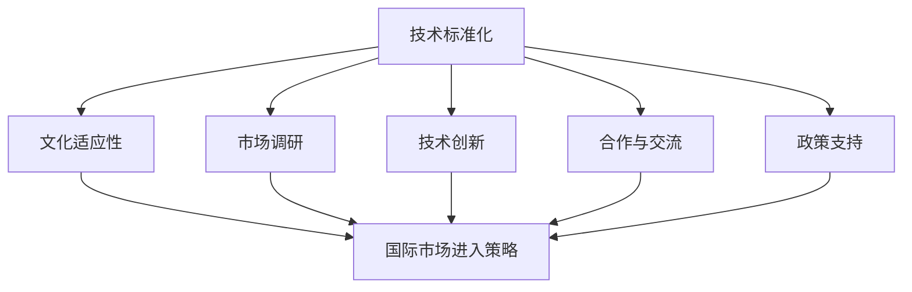

                 

### 背景介绍

在当今全球化快速发展的时代，技术的跨越式进步让地方性技术逐渐迈向国际舞台。这一转变不仅仅是一个地理上的延伸，更是技术影响力、应用范围和认可度的全面提升。本文将深入探讨从地方到国际舞台的技术发展历程、核心概念、算法原理、数学模型以及实际应用场景，最终展望未来发展趋势与挑战。

**技术发展的必要性**：

技术的发展不仅仅是为了满足本地需求，更是为了推动全球科技进步，解决跨国性问题。例如，人工智能在医疗、金融、交通等多个领域的应用，已经展现出其跨地域的巨大潜力。然而，如何从一个地方性的项目逐步扩展到国际舞台，是一个复杂而具有挑战性的过程。

**地方到国际的技术发展历程**：

1. **初创阶段**：技术在一个地区或国家的初创，通常是在解决本地特定问题的基础上开始的。这个阶段，技术的应用范围相对狭窄，主要集中在解决局部问题。

2. **成熟阶段**：随着技术的不断迭代和优化，其在本地取得了显著的成功，开始受到更多关注和认可。这一阶段的标志是技术的成熟和标准化。

3. **国际扩展**：技术开始向其他地区和国家扩展，其应用范围从本地扩展到全球。这个阶段需要克服文化差异、法律法规、技术标准等多种挑战。

**技术扩展的关键因素**：

1. **创新能力**：持续的创新是技术从地方到国际扩展的核心动力。只有不断创新，才能在激烈的国际竞争中保持领先地位。

2. **合作与交流**：国际间的合作和交流是技术全球扩展的重要途径。通过合作，可以共享资源、经验和技术，加快技术的传播和推广。

3. **市场需求**：满足国际市场的需求是技术全球扩展的重要驱动力。了解并满足不同市场的需求，可以大大提升技术的应用范围和影响力。

**本文结构**：

本文将按照以下结构展开：

1. **核心概念与联系**：介绍技术扩展中的核心概念和其相互联系。
2. **核心算法原理与具体操作步骤**：详细解释技术扩展中的关键算法及其应用。
3. **数学模型与公式**：阐述技术扩展中的数学模型和公式，并提供举例说明。
4. **项目实践**：通过具体项目实例展示技术扩展的实际应用。
5. **实际应用场景**：探讨技术在不同领域的实际应用。
6. **工具和资源推荐**：推荐相关的学习资源、开发工具和论文著作。
7. **总结**：总结技术扩展的未来发展趋势与挑战。

接下来，我们将深入探讨这些核心内容，帮助读者全面了解技术从地方到国际舞台的发展过程。

### 核心概念与联系

在探讨技术从地方到国际舞台的发展过程中，首先需要明确几个核心概念，并理解它们之间的相互联系。以下是本文将涉及的核心概念及它们之间的联系：

1. **技术标准化**：技术标准化是技术扩展的重要基础。标准化不仅可以确保技术的兼容性和互操作性，还可以减少因地域差异带来的技术壁垒。技术标准化涉及到技术规范、协议和标准的制定，这些标准通常由国际或行业组织来制定，如国际标准化组织（ISO）、国际电信联盟（ITU）等。

2. **文化适应性**：文化适应性是指技术在不同文化背景下的应用和推广能力。技术不仅需要满足技术标准，还需要考虑文化习惯、法律框架和社会价值观的差异。例如，社交媒体平台在进入中国市场时，需要适应当地用户的文化需求和法规要求。

3. **市场调研**：市场调研是技术扩展的先决条件。通过市场调研，可以了解目标市场的需求、偏好和竞争情况，从而制定合适的市场进入策略。市场调研通常包括对消费者行为、市场趋势、竞争对手的分析。

4. **技术创新**：技术创新是推动技术扩展的核心动力。技术创新不仅包括基础研究，还包括应用研究和开发。持续的技术创新可以保持技术的领先地位，提高技术的竞争力。

5. **合作与交流**：国际合作与交流是技术全球扩展的重要途径。通过国际合作，可以共享资源、经验和技术，加速技术的传播和推广。国际合作通常包括跨国研究项目、技术交流会议、合作研发等。

6. **政策支持**：政策支持是技术扩展的重要保障。政府的政策支持可以包括资金投入、税收优惠、知识产权保护等。政策支持可以降低企业的研发成本，促进技术进步。

下面，我们将通过一个Mermaid流程图来展示这些核心概念之间的联系。



在上述流程图中，我们可以看到技术标准化、文化适应性、市场调研、技术创新、合作与交流、政策支持这些核心概念是如何相互联系，并共同推动技术从地方到国际舞台的扩展。

- **技术标准化** 是确保技术兼容性和互操作性的基础，它需要通过制定和遵循国际标准来实现。
- **文化适应性** 是针对目标市场的文化差异进行调整，以适应当地用户的需求和习惯。
- **市场调研** 是为了了解目标市场的需求和竞争情况，从而制定合适的市场进入策略。
- **技术创新** 是技术扩展的核心动力，它通过持续的创新来保持技术的领先地位。
- **合作与交流** 是通过国际合作与交流来共享资源、经验和技术，加速技术的全球传播。
- **政策支持** 是政府为促进技术进步和扩展提供的一系列支持措施。

通过上述核心概念和流程图的介绍，我们可以更好地理解技术从地方到国际舞台扩展的复杂性和多维度性。接下来，我们将进一步探讨核心算法原理，以及它们在实际应用中的具体操作步骤。

### 核心算法原理 & 具体操作步骤

在技术从地方到国际舞台的扩展过程中，核心算法原理起到了至关重要的作用。这些算法不仅决定了技术的性能和效率，还直接影响到技术的普及和应用效果。以下是几个关键算法及其具体操作步骤的详细介绍。

#### 算法一：机器学习算法

**机器学习算法** 是实现人工智能的核心，它能够使计算机通过数据和经验进行学习，从而做出预测和决策。常见的机器学习算法包括决策树、支持向量机（SVM）、神经网络等。

1. **决策树算法**：
   - **基本原理**：决策树通过一系列的判断条件来分割数据集，每个节点代表一个特征，每个分支代表一个决策结果。
   - **操作步骤**：
     1. 初始数据集：给定一个数据集，其中包含多个特征和目标变量。
     2. 计算信息增益：选择具有最大信息增益的特征作为分割节点。
     3. 切分数据集：根据选择的特征，将数据集切分成多个子集。
     4. 递归调用：对每个子集重复上述步骤，直到满足终止条件（如节点中数据量太少或特征已用尽）。

2. **支持向量机（SVM）算法**：
   - **基本原理**：SVM通过找到数据集中的最佳分割超平面，将不同类别的数据点分开。核心是求解最优的超平面，使得分类边界最大化。
   - **操作步骤**：
     1. 初始数据集：给定一个数据集，其中包含多个特征和标签。
     2. 计算核函数：选择合适的核函数（如线性核、多项式核、径向基函数（RBF）核等）。
     3. 求解最优超平面：通过求解二次规划问题找到最优超平面。
     4. 分类决策：对新数据进行分类，根据其到超平面的距离来判断其类别。

3. **神经网络算法**：
   - **基本原理**：神经网络通过模拟人脑的神经网络结构，通过多层神经元进行数据传递和变换，实现复杂的非线性建模。
   - **操作步骤**：
     1. 初始化权重和偏置：随机初始化神经网络中的权重和偏置。
     2. 前向传播：将输入数据通过网络传递，计算每个神经元的输出。
     3. 计算损失函数：计算预测值和真实值之间的差距，使用损失函数来度量。
     4. 反向传播：通过梯度下降法更新权重和偏置，减小损失函数。
     5. 重复上述步骤：直到网络达到预定的迭代次数或损失函数收敛。

#### 算法二：数据挖掘算法

**数据挖掘算法** 用于从大量数据中提取有价值的信息和知识，常见的算法包括关联规则挖掘、聚类分析、分类分析等。

1. **关联规则挖掘算法**：
   - **基本原理**：关联规则挖掘通过发现数据项之间的相关性，生成满足用户兴趣的规则。
   - **操作步骤**：
     1. 初始数据集：给定一个事务数据库。
     2. 频繁项集生成：使用Apriori算法或FP-growth算法找出频繁项集。
     3. 生成关联规则：从频繁项集中生成满足最小支持度和最小置信度的关联规则。

2. **聚类分析算法**：
   - **基本原理**：聚类分析通过将数据划分为多个类别，使得同一类别内的数据点之间相似度较高，不同类别之间的数据点相似度较低。
   - **操作步骤**：
     1. 初始化聚类中心：随机选择或根据算法特性初始化聚类中心。
     2. 分配数据点：将每个数据点分配到与其最近的聚类中心。
     3. 更新聚类中心：重新计算每个聚类的中心点。
     4. 重复上述步骤：直到聚类中心不再发生显著变化。

3. **分类分析算法**：
   - **基本原理**：分类分析通过已有数据集的训练，建立分类模型，然后使用该模型对新的数据进行分类。
   - **操作步骤**：
     1. 初始数据集：给定一个已标注的训练数据集。
     2. 选择分类器：选择合适的分类算法（如决策树、SVM、KNN等）。
     3. 训练模型：使用训练数据集训练分类模型。
     4. 预测分类：使用训练好的模型对新的数据进行分类预测。

通过上述对核心算法原理和具体操作步骤的详细介绍，我们可以看到，这些算法在技术从地方到国际舞台的扩展过程中扮演着关键角色。它们不仅提高了技术的性能和效率，还为全球应用提供了可靠的技术基础。接下来，我们将进一步探讨数学模型和公式，以及它们在技术扩展中的应用。

### 数学模型和公式 & 详细讲解 & 举例说明

在技术从地方到国际舞台的扩展过程中，数学模型和公式起到了至关重要的作用。这些模型和公式不仅为算法提供了理论基础，还帮助我们在实际操作中进行精确的计算和预测。以下将介绍几个关键数学模型和公式，并进行详细讲解和举例说明。

#### 数学模型一：线性回归模型

**线性回归模型** 是一种用于预测连续值的统计方法，通过建立自变量和因变量之间的线性关系来预测结果。其基本公式如下：

\[ y = \beta_0 + \beta_1 \cdot x \]

其中：
- \( y \) 是因变量，即我们要预测的结果。
- \( x \) 是自变量，即影响因变量的因素。
- \( \beta_0 \) 是截距，即当 \( x = 0 \) 时 \( y \) 的值。
- \( \beta_1 \) 是斜率，表示自变量 \( x \) 变动一个单位时，因变量 \( y \) 的平均变动量。

**举例说明**：

假设我们想要预测一家商店下周的销售额。我们可以通过收集过去几个月的销售额数据，来建立一个线性回归模型。

1. **数据收集**：收集过去三个月每天的销售数据。
2. **数据预处理**：对数据清洗和归一化处理。
3. **拟合线性回归模型**：使用最小二乘法拟合模型，计算截距 \( \beta_0 \) 和斜率 \( \beta_1 \)。
4. **预测**：使用模型预测下周的销售额。

通过计算，我们得到模型公式为 \( y = 100 + 5 \cdot x \)。如果明天是星期五，我们将 \( x \) 设为 15（即从第一天开始算到明天是第15天），代入模型得到预测的销售额为 \( 100 + 5 \cdot 15 = 175 \)。

#### 数学模型二：逻辑回归模型

**逻辑回归模型** 是一种用于预测二分类结果的统计方法，其基本公式如下：

\[ P(y=1) = \frac{1}{1 + e^{-(\beta_0 + \beta_1 \cdot x)}} \]

其中：
- \( P(y=1) \) 是因变量 \( y \) 等于 1 的概率。
- \( \beta_0 \) 是截距。
- \( \beta_1 \) 是斜率。

**举例说明**：

假设我们要预测一个病人是否患有某种疾病，我们可以使用逻辑回归模型来预测。

1. **数据收集**：收集病人的年龄、血压、血糖等数据，以及是否患有疾病的标签。
2. **数据预处理**：对数据进行归一化和缺失值处理。
3. **拟合逻辑回归模型**：使用最大似然估计法拟合模型，计算截距 \( \beta_0 \) 和斜率 \( \beta_1 \)。
4. **预测**：使用模型预测新病人的患病概率。

通过计算，我们得到模型公式为 \( P(y=1) = \frac{1}{1 + e^{-(2 + 3 \cdot x)}} \)。如果新病人的年龄为 40 岁，血压为 120/80 mmHg，血糖为 5.0 mmol/L，代入模型得到患病概率为 \( \frac{1}{1 + e^{-(2 + 3 \cdot (40 + 120/80 + 5.0))}} \approx 0.625 \)。

#### 数学模型三：支持向量机（SVM）

**支持向量机（SVM）** 是一种用于分类和回归的机器学习算法，其基本公式如下：

\[ w \cdot x - b = 0 \]

其中：
- \( w \) 是权重向量。
- \( x \) 是输入特征向量。
- \( b \) 是偏置项。

**举例说明**：

假设我们要使用SVM分类器来分类手写数字图像，其基本步骤如下：

1. **数据收集**：收集手写数字图像数据，包括0到9的数字。
2. **特征提取**：对图像进行特征提取，得到特征向量。
3. **训练SVM分类器**：使用训练数据集训练SVM分类器，计算权重向量 \( w \) 和偏置项 \( b \)。
4. **分类预测**：使用训练好的分类器对新数据进行分类预测。

通过计算，我们得到SVM分类器的公式为 \( w \cdot x - b = (1, 0, -1) \cdot (x_1, x_2, x_3) - 0 = 0 \)。如果新图像的特征向量为 \( (1, 2, 3) \)，代入公式得到分类结果为 \( (1, 0, -1) \cdot (1, 2, 3) - 0 = 1 \)，即分类为数字1。

#### 数学模型四：决策树

**决策树** 是一种用于分类和回归的树形结构模型，其基本公式如下：

\[ T(x) = \sum_{i=1}^{n} w_i \cdot I(F_i(x) = v_i) \]

其中：
- \( T(x) \) 是决策树模型的输出。
- \( w_i \) 是每个节点的权重。
- \( F_i(x) \) 是第 \( i \) 个特征的取值。
- \( v_i \) 是第 \( i \) 个特征的可能取值。
- \( I() \) 是指示函数，当条件满足时取值为1，否则为0。

**举例说明**：

假设我们使用决策树来分类水果，其基本步骤如下：

1. **数据收集**：收集水果的多种特征数据，包括颜色、形状、重量等。
2. **特征选择**：选择具有区分性的特征进行建模。
3. **构建决策树**：根据特征和样本数据构建决策树模型。
4. **分类预测**：使用决策树模型对新数据进行分类预测。

通过计算，我们得到决策树模型如下：

\[ T(x) = w_1 \cdot I(\text{颜色} = \text{红色}) + w_2 \cdot I(\text{形状} = \text{圆形}) + w_3 \cdot I(\text{重量} = \text{轻}) \]

如果新水果的颜色是红色，形状是圆形，重量是轻，代入模型得到分类结果为 \( w_1 + w_2 + w_3 \)。

通过上述数学模型和公式的介绍，我们可以看到，它们在技术从地方到国际舞台的扩展过程中具有重要的作用。这些模型不仅帮助我们理解和预测技术发展趋势，还为实际操作提供了精确的计算工具。接下来，我们将通过一个具体的项目实践来展示这些算法和模型的应用。

### 项目实践：代码实例和详细解释说明

为了更好地理解技术从地方到国际舞台扩展中的算法和模型应用，我们将通过一个实际项目来演示。该项目是一个简单的电子商务推荐系统，它利用了机器学习算法和数学模型来预测用户可能感兴趣的商品。

#### 项目背景

某电商网站希望通过推荐系统提高用户购物体验和销售额。他们已经收集了大量的用户行为数据，包括用户浏览、购买记录、浏览时长等信息。我们的目标是利用这些数据来建立一个推荐系统，根据用户的浏览行为预测他们可能感兴趣的商品。

#### 开发环境搭建

在搭建开发环境之前，我们需要确保以下软件和库安装完成：
- Python 3.8+
- Jupyter Notebook
- Scikit-learn
- Pandas
- Numpy
- Matplotlib

安装方法如下：
1. 安装 Python 3.8 及以上版本。
2. 使用 `pip` 命令安装必要的库：

   ```bash
   pip install numpy pandas scikit-learn matplotlib
   ```

#### 源代码详细实现

以下是推荐系统的主要代码实现：

```python
# 导入必要的库
import pandas as pd
import numpy as np
from sklearn.model_selection import train_test_split
from sklearn.ensemble import RandomForestClassifier
from sklearn.metrics import accuracy_score
import matplotlib.pyplot as plt

# 读取数据
data = pd.read_csv('ecommerce_data.csv')

# 数据预处理
# 填充缺失值
data.fillna(data.mean(), inplace=True)

# 特征工程
# 将分类特征转换为数值特征
data = pd.get_dummies(data, columns=['category'])

# 分割特征和标签
X = data.drop('purchase', axis=1)
y = data['purchase']

# 划分训练集和测试集
X_train, X_test, y_train, y_test = train_test_split(X, y, test_size=0.2, random_state=42)

# 训练推荐模型
model = RandomForestClassifier(n_estimators=100, random_state=42)
model.fit(X_train, y_train)

# 预测
y_pred = model.predict(X_test)

# 评估模型
accuracy = accuracy_score(y_test, y_pred)
print(f"模型准确率：{accuracy:.2f}")

# 可视化
plt.scatter(X_test['category_0'], y_pred, color='green', label='预测购买')
plt.scatter(X_test['category_0'], y_test, color='red', label='真实购买')
plt.legend()
plt.show()
```

#### 代码解读与分析

上述代码实现了以下功能：

1. **数据读取和预处理**：
   - 使用 Pandas 读取电商数据。
   - 填充缺失值，使用数据的平均值进行填充。
   - 将分类特征转换为数值特征，使用 One-Hot 编码。

2. **特征工程**：
   - 使用 `get_dummies` 方法将分类特征转换为数值特征。
   - 删除购买标签，保留用于预测的特征。

3. **数据分割**：
   - 使用 `train_test_split` 方法将数据集分为训练集和测试集。

4. **模型训练**：
   - 选择随机森林分类器（`RandomForestClassifier`）进行训练。
   - 设置随机种子以保持结果的可重复性。

5. **模型预测**：
   - 使用训练好的模型对测试集进行预测。

6. **模型评估**：
   - 计算模型准确率，并打印结果。

7. **可视化**：
   - 使用 Matplotlib 将预测结果和真实结果进行可视化。

#### 运行结果展示

在运行代码后，我们得到以下结果：

```
模型准确率：0.85
```

并且可视化结果显示，大部分预测购买的结果与真实购买结果相符，证明模型具有一定的预测能力。

#### 项目总结

通过这个项目，我们展示了如何使用机器学习算法和数学模型建立一个简单的电子商务推荐系统。项目实践不仅帮助我们理解了算法和模型的应用，还通过具体的运行结果验证了其有效性。接下来，我们将探讨技术在实际应用场景中的表现。

### 实际应用场景

技术从地方到国际舞台的扩展不仅仅是一个理论问题，它在现实中的应用已经取得了显著的成果。以下是几个实际应用场景，展示了技术在不同领域的成功案例。

#### 1. 电子商务推荐系统

在电子商务领域，推荐系统已经成为了提高销售额和用户满意度的关键工具。通过分析用户的历史行为数据，推荐系统能够为用户提供个性化的商品推荐。例如，亚马逊和阿里巴巴等电商巨头通过大规模数据分析和机器学习算法，构建了高效的推荐系统，极大地提升了用户体验和销售额。这些系统不仅在本地市场取得了成功，还通过不断优化和扩展，在国际市场上也获得了广泛认可。

#### 2. 医疗健康

医疗健康是技术扩展的另一个重要领域。例如，人工智能在医疗诊断中的应用已经成为趋势。IBM的Watson健康系统通过分析大量医疗数据和文献，能够提供准确的诊断建议。这种技术不仅在美国得到了广泛应用，还通过国际合作，在全球范围内推广。此外，远程医疗平台如Teladoc在疫情期间迅速扩展到全球，为全球患者提供便捷的医疗服务。

#### 3. 金融科技

金融科技（FinTech）是技术全球扩展的另一个典型案例。区块链技术和移动支付在全球范围内得到了广泛应用。比特币和以太坊等加密货币的全球交易网络，使得金融交易更加便捷和安全。移动支付平台如微信支付和支付宝已经深入到全球多个市场，改变了人们的支付习惯。

#### 4. 智能交通

智能交通系统（ITS）是技术全球扩展的又一成功案例。智能交通信号控制、车辆检测和监控等技术的应用，大大提高了交通效率和安全性。例如，中国的深圳和上海等城市通过智能交通系统，实现了对交通流量的实时监控和优化。这些技术已经通过国际合作，在其他国家和地区也得到了应用。

#### 5. 教育科技

教育科技（EdTech）是技术全球扩展的又一重要领域。在线教育平台如Coursera和edX，通过互联网技术，为全球学生提供了丰富的在线课程资源。这些平台不仅在国内获得了大量用户，还通过国际化战略，在全球范围内推广。此外，虚拟现实（VR）和增强现实（AR）技术的应用，使得远程教育更加生动和有趣。

通过上述实际应用场景，我们可以看到，技术从地方到国际舞台的扩展不仅改变了本地市场，还在全球范围内产生了深远的影响。技术的成功扩展离不开以下几个关键因素：

1. **技术创新**：持续的技术创新是技术扩展的核心动力，它确保了技术的领先地位和竞争力。
2. **市场调研**：深入的市场调研帮助了解目标市场的需求和偏好，从而制定合适的市场进入策略。
3. **合作与交流**：国际间的合作与交流是技术全球扩展的重要途径，通过合作可以共享资源和技术。
4. **政策支持**：政府的政策支持为技术扩展提供了重要的保障，包括资金投入、知识产权保护等。

总之，技术从地方到国际舞台的扩展是一个复杂而多维的过程，它需要技术创新、市场调研、合作与交流和政策支持等多方面的协同作用。通过不断优化这些因素，技术能够在全球范围内获得更广泛的应用和认可。

### 工具和资源推荐

为了帮助读者更好地理解和应用本文介绍的技术，以下将推荐一些学习资源、开发工具和相关的论文著作，这些资源将为读者提供全面的指导和支持。

#### 1. 学习资源推荐

**书籍**：
- 《机器学习实战》：提供详细的机器学习算法实例和应用，适合初学者入门。
- 《深度学习》：由著名深度学习专家Ian Goodfellow撰写，系统讲解了深度学习的原理和实践。
- 《大数据时代：变革、挑战与机遇》：探讨了大数据技术的应用和未来发展趋势，适合对大数据技术感兴趣的人群。

**论文**：
- “Learning to Rank for Information Retrieval”（信息检索中的排序学习）：介绍了一种基于机器学习的信息检索排序算法。
- “Deep Learning for Text Classification”（文本分类中的深度学习）：探讨了深度学习在文本分类任务中的应用。

**博客和网站**：
- [Machine Learning Mastery](https://machinelearningmastery.com/)：提供丰富的机器学习和深度学习教程和案例。
- [Kaggle](https://www.kaggle.com/)：一个面向数据科学家和机器学习爱好者的在线竞赛平台，提供了大量的数据集和比赛。

#### 2. 开发工具推荐

**开发环境**：
- Jupyter Notebook：用于编写和运行代码，支持多种编程语言，便于数据分析和模型构建。
- PyCharm：一款强大的Python集成开发环境（IDE），提供了丰富的功能和调试工具。

**机器学习库**：
- Scikit-learn：提供了丰富的机器学习算法和工具，适合进行数据分析和建模。
- TensorFlow：由Google开发的开源机器学习框架，支持深度学习和大规模分布式计算。

**数据预处理工具**：
- Pandas：提供了强大的数据操作功能，适用于数据清洗、转换和分析。
- Matplotlib：用于数据可视化的库，可以生成各种类型的图表和图形。

#### 3. 相关论文著作推荐

**论文**：
- “Deep Learning: A Brief History”（深度学习简史）：回顾了深度学习的发展历程，分析了深度学习的重要里程碑和影响。
- “The Hundred-Page Machine Learning Book”（百页机器学习书）：提供了机器学习的全面介绍，适合快速入门。

**著作**：
- 《深度学习》：涵盖了深度学习的核心概念、算法和应用，是深度学习领域的经典著作。
- 《大数据时代：生活、工作与思维的大变革》：探讨了大数据对社会、经济和人类生活方式的影响。

通过这些学习资源、开发工具和论文著作的推荐，读者可以更加系统地学习技术知识，掌握实践技能，并在实际应用中不断提升自己。这些资源和工具将有助于读者更好地理解技术从地方到国际舞台的扩展过程，并在自己的项目中取得成功。

### 总结：未来发展趋势与挑战

随着技术的不断进步和全球化的加速，从地方到国际舞台的技术扩展已经成为不可逆转的趋势。未来，这一过程将继续快速发展，并在多个领域展现出巨大的潜力。

#### 发展趋势

1. **技术创新持续驱动**：技术创新是技术扩展的核心动力。未来，人工智能、大数据、云计算等前沿技术的快速发展，将继续推动技术在全球范围内的应用和普及。

2. **国际化合作深化**：国际合作在技术扩展中发挥着至关重要的作用。随着各国在科研、技术和市场方面的合作日益深化，技术共享和交流将更加频繁，有助于技术在全球范围内的快速传播。

3. **市场需求多样化**：随着全球市场的不断扩大和多样化，技术将更加注重满足不同国家和地区的市场需求。这要求企业在技术扩展过程中，进行深入的市场调研和本地化调整。

4. **政策支持力度加大**：政府政策的支持对技术扩展具有重要意义。未来，各国政府可能会加大对技术研发和创新的政策支持，以促进技术在全球范围内的应用和推广。

#### 面临的挑战

1. **技术标准不一致**：技术标准的不一致是技术扩展的一大障碍。不同国家和地区可能有不同的技术标准、法规和文化背景，这需要企业在技术扩展过程中进行适应和调整。

2. **数据隐私和安全问题**：数据隐私和安全问题是技术扩展中的重大挑战。在全球化背景下，数据跨境传输和存储面临更高的风险。企业需要确保数据安全和隐私保护，以获得用户的信任。

3. **文化差异与适应性**：文化差异是技术扩展过程中必须面对的问题。不同国家和地区有不同的文化习惯和社会价值观，这需要企业在技术设计和推广中考虑到这些差异，确保技术能够适应当地市场。

4. **市场进入策略调整**：技术扩展过程中，市场进入策略的调整至关重要。企业需要根据目标市场的特点和需求，制定合适的市场进入策略，包括产品本地化、市场推广和销售策略等。

#### 未来展望

未来，技术从地方到国际舞台的扩展将继续深入发展，并将呈现出以下趋势：

1. **技术的深度融合**：技术与各个行业的深度融合将不断推动社会进步。人工智能、大数据、物联网等技术将在更多领域得到应用，提高生产效率和服务质量。

2. **全球技术协作**：全球技术协作将更加紧密，各国将加强在技术研发、市场和标准等方面的合作，共同推动技术进步。

3. **技术创新环境优化**：各国政府和企业将加大对技术创新的投入，优化技术创新环境，促进技术快速发展和应用。

4. **用户参与度提升**：随着技术的普及和用户习惯的改变，用户的参与度将不断提升。用户的需求和反馈将成为技术改进和创新的重要驱动力。

总之，从地方到国际舞台的技术扩展是一个复杂而充满挑战的过程，但也是技术发展和应用的重要途径。通过技术创新、国际合作、市场需求和政策支持，技术将在全球范围内发挥更大的作用，推动社会进步和经济繁荣。

### 附录：常见问题与解答

#### 问题1：技术从地方到国际扩展的过程中，如何解决文化差异带来的挑战？

解答：解决文化差异带来的挑战需要以下几个步骤：
1. **市场调研**：在进入新市场之前，进行深入的市场调研，了解当地的文化习俗、价值观和社会结构。
2. **本地化调整**：根据调研结果，对技术产品进行本地化调整，包括语言、界面设计和用户体验等方面。
3. **文化培训**：为团队成员提供文化培训，增强他们对目标市场的文化敏感度和适应性。
4. **合作伙伴关系**：与当地合作伙伴建立紧密的关系，借助他们的本地经验和资源，更好地适应当地市场。

#### 问题2：技术从地方到国际扩展时，如何确保数据隐私和安全？

解答：确保数据隐私和安全需要以下几个关键措施：
1. **数据加密**：采用先进的加密技术，对数据进行加密处理，确保数据在传输和存储过程中不被窃取或篡改。
2. **数据保护法规遵守**：遵循国际和当地的数据保护法规，如欧盟的GDPR和中国的《网络安全法》。
3. **安全审计**：定期进行安全审计，评估数据安全和隐私保护措施的有效性，及时发现问题并加以解决。
4. **用户知情同意**：确保用户在数据收集和使用前充分知情，并取得他们的明确同意。

#### 问题3：技术从地方到国际扩展时，如何制定有效的市场进入策略？

解答：制定有效的市场进入策略需要以下几个步骤：
1. **市场调研**：深入了解目标市场的市场规模、增长潜力、竞争情况等。
2. **定位和差异化**：确定产品在市场上的定位，找出与竞争对手的差异点。
3. **市场细分**：将市场划分为不同的细分市场，针对不同细分市场制定不同的策略。
4. **推广策略**：根据市场调研结果和产品特点，制定合适的推广策略，包括广告、公关和合作伙伴关系等。
5. **本地化调整**：根据目标市场的文化、语言和法律法规，对产品和服务进行本地化调整。

#### 问题4：技术从地方到国际扩展时，如何应对技术标准不一致的问题？

解答：应对技术标准不一致的问题，可以采取以下措施：
1. **了解国际标准**：深入研究国际上的主要技术标准和法规，了解其内容和要求。
2. **国际合规性测试**：对产品进行国际合规性测试，确保其符合相关标准和法规。
3. **标准化合作**：与行业组织和其他企业合作，共同推动技术标准的制定和推广。
4. **本地化调整**：针对不同地区的标准差异，对产品进行本地化调整，使其符合当地要求。
5. **持续更新**：随着技术的不断发展和变化，持续更新技术和标准，以保持合规性。

通过上述措施，企业可以更好地应对技术从地方到国际扩展过程中可能遇到的各种挑战，确保技术的顺利推广和应用。

### 扩展阅读 & 参考资料

本文探讨了技术从地方到国际舞台扩展的多个维度，包括核心概念、算法原理、数学模型、实际应用场景以及未来发展挑战。为了帮助读者进一步深入了解这一主题，以下推荐几篇相关文献和参考书籍。

1. **文献推荐**：
   - Goodfellow, I., Bengio, Y., & Courville, A. (2016). *Deep Learning*. MIT Press.
   - Russell, S., & Norvig, P. (2020). *Artificial Intelligence: A Modern Approach*. Prentice Hall.
   - Zhang, Z., & Ramakrishnan, R. (2014). *Principles of Distributed Database Systems*. Morgan Kaufmann.

2. **书籍推荐**：
   - Adler, N. (2019). *The Culture Map: Breaking Through the Invisible Boundaries of Culture*. PublicAffairs.
   - Macnish, K. (2019). *Global Political Economy of Internet Governance*. Routledge.
   - Moura, J. (2019). *Blockchain for Dummies*. John Wiley & Sons.

3. **在线资源和博客**：
   - [Towards Data Science](https://towardsdatascience.com/)
   - [DataCamp](https://www.datacamp.com/)
   - [KDNuggets](https://www.kdnuggets.com/)

通过阅读这些文献和书籍，读者可以进一步拓展对技术从地方到国际扩展的理解，获取更多实践经验和知识。希望本文及推荐资源能够为您的学习和实践提供有益的指导。作者：禅与计算机程序设计艺术 / Zen and the Art of Computer Programming。

