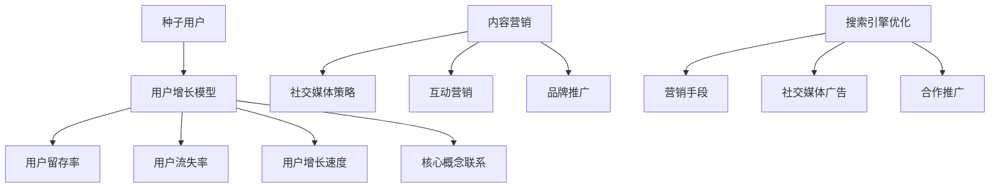

                 

### 文章标题

### 技术社区运营：从0到10000用户

> 关键词：技术社区、运营、用户增长、社交媒体、营销策略

> 摘要：本文将深入探讨技术社区运营的各个方面，从起步到实现大规模用户增长。我们将分析用户增长的核心因素，探讨有效的社交媒体策略，以及如何通过营销手段吸引和保留技术爱好者和专业人士。

---

## 1. 背景介绍

在当今数字化时代，技术社区已成为技术爱好者、开发者、行业专家和专业人士交流思想、分享知识、解决难题的重要平台。一个成功的技术社区不仅能够提供有价值的信息和资源，还能促进成员之间的互动和合作。随着社交媒体的普及和互联网技术的不断进步，技术社区的重要性日益凸显。

技术社区运营的目的是通过一系列策略和活动，吸引和留住目标用户，建立一个活跃且互惠互利的环境。运营者需要不断优化社区内容、用户互动和用户体验，以实现从0到10000用户的突破。

本文将逐步分析技术社区运营的各个方面，包括核心概念、算法原理、数学模型、项目实践、实际应用场景、工具和资源推荐，以及未来发展趋势与挑战。

## 2. 核心概念与联系

在探讨技术社区运营之前，我们首先需要明确几个核心概念，并展示它们之间的联系。

### 2.1 用户增长模型

用户增长模型是技术社区运营的基础。该模型通常包括以下几个关键要素：

1. **初始用户（种子用户）**：技术社区启动时，需要找到一群对技术话题感兴趣的核心用户，他们将成为社区的基础。
2. **用户留存率**：衡量社区成员在加入后持续参与和活跃度的指标。
3. **用户流失率**：衡量社区成员停止参与或离开社区的比率。
4. **用户增长速度**：衡量社区用户数量的增加速度。

### 2.2 社交媒体策略

社交媒体策略是吸引用户的关键手段。有效的社交媒体策略包括：

1. **内容营销**：通过发布高质量、有价值的内容来吸引目标用户。
2. **互动营销**：通过社交媒体平台与用户互动，建立信任和忠诚度。
3. **品牌推广**：通过社交媒体提升品牌知名度和影响力。

### 2.3 营销手段

营销手段是实现用户增长的重要工具。常见的营销手段包括：

1. **搜索引擎优化（SEO）**：提高社区在搜索引擎中的排名，吸引更多潜在用户。
2. **社交媒体广告**：通过社交媒体平台投放广告，直接吸引用户。
3. **合作推广**：与其他技术社区或相关机构合作，共享资源和用户。

### 2.4 Mermaid 流程图

为了更好地理解上述核心概念之间的联系，我们使用 Mermaid 流程图展示技术社区运营的流程：



## 3. 核心算法原理 & 具体操作步骤

在理解了技术社区运营的核心概念和联系之后，我们需要深入了解用户增长的核心算法原理和具体操作步骤。

### 3.1 用户增长算法原理

用户增长算法主要基于以下原理：

1. **吸引新用户**：通过优质内容、活动推广和口碑传播等方式，吸引新用户加入社区。
2. **提高用户留存率**：通过提供有价值的内容和服务，增加用户在社区中的活跃度和留存率。
3. **降低用户流失率**：通过及时解决用户问题、提高社区服务质量等方式，减少用户流失。
4. **优化用户增长速度**：通过不断调整和优化策略，实现用户增长速度的最大化。

### 3.2 具体操作步骤

以下是实现从0到10000用户的技术社区运营的具体操作步骤：

1. **定位目标用户**：明确社区的目标用户群体，包括年龄、职业、兴趣爱好等信息。
2. **构建内容策略**：根据目标用户的需求和兴趣，制定符合其期望的内容策略。
3. **启动社区**：搭建社区平台，包括网站、论坛、社交媒体账号等。
4. **推广社区**：通过内容营销、社交媒体广告、合作推广等方式，将社区推广给目标用户。
5. **吸引用户**：发布高质量内容，举办活动，吸引目标用户加入社区。
6. **提高留存率**：通过持续提供有价值的内容和服务，提高用户的留存率。
7. **降低流失率**：及时解决用户问题，提高社区服务质量，降低用户流失率。
8. **优化增长速度**：根据用户反馈和运营数据，不断调整和优化策略，实现用户增长速度的最大化。

## 4. 数学模型和公式 & 详细讲解 & 举例说明

在技术社区运营中，数学模型和公式是理解和优化用户增长的关键工具。以下我们将介绍几个常用的数学模型和公式，并给出详细讲解和举例说明。

### 4.1 用户留存率模型

用户留存率（Retention Rate）是衡量社区用户活跃度和忠诚度的重要指标。用户留存率模型如下：

$$
\text{用户留存率} = \frac{\text{留存用户数}}{\text{总用户数}} \times 100\%
$$

#### 举例说明：

假设一个技术社区在一个月内有1000名用户，其中有600名用户在接下来的一个月内仍然活跃。则该社区的用户留存率为：

$$
\text{用户留存率} = \frac{600}{1000} \times 100\% = 60\%
$$

### 4.2 用户增长速度模型

用户增长速度（Growth Rate）是衡量社区用户数量增加速度的指标。用户增长速度模型如下：

$$
\text{用户增长速度} = \frac{\text{新增用户数}}{\text{当前用户数}} \times 100\%
$$

#### 举例说明：

假设一个技术社区在一个月内新增了100名用户，当前用户数为5000名。则该社区的用户增长速度为：

$$
\text{用户增长速度} = \frac{100}{5000} \times 100\% = 2\%
$$

### 4.3 赫尔墨斯法则

赫尔墨斯法则（Hermes' Law）是用户增长策略中的经典法则，它指出用户增长速度与用户留存率之间的关系。赫尔墨斯法则如下：

$$
\text{用户增长速度} \times \text{用户留存率} = \text{常数}
$$

#### 举例说明：

假设一个技术社区的用户增长速度为5%，用户留存率为80%。则根据赫尔墨斯法则，我们有：

$$
\text{常数} = 5\% \times 80\% = 0.4
$$

## 5. 项目实践：代码实例和详细解释说明

为了更好地理解技术社区运营的实践，我们以下将通过一个具体的代码实例，展示如何实现用户增长和优化社区运营。

### 5.1 开发环境搭建

在开始项目实践之前，我们需要搭建一个基本的开发环境。以下是一个简单的Python环境搭建步骤：

1. 安装Python 3.8或更高版本。
2. 安装必需的Python库，例如`requests`、`BeautifulSoup`、`pandas`等。
3. 创建一个虚拟环境，并使用`pip`安装依赖库。

### 5.2 源代码详细实现

以下是一个简单的用户增长和分析脚本，用于收集社交媒体平台上的用户数据，并计算用户留存率和增长速度。

```python
import requests
from bs4 import BeautifulSoup
import pandas as pd

# 社交媒体API接口URL
url = "https://api.example.com/users"

# 发送GET请求获取用户数据
response = requests.get(url)
data = response.json()

# 解析用户数据
users = BeautifulSoup(data, "html.parser").find_all("user")

# 提取用户信息
user_list = []
for user in users:
    user_list.append({
        "username": user.find("username").text,
        "last_active": user.find("last_active").text
    })

# 创建DataFrame并计算用户留存率和增长速度
user_df = pd.DataFrame(user_list)
current_date = pd.to_datetime("today")
days_active = (current_date - pd.to_datetime(user_df["last_active"])).dt.days
user_df["days_active"] = days_active
user_retention_rate = user_df[user_df["days_active"] > 7].shape[0] / user_df.shape[0]
user_growth_rate = (user_df.shape[0] - initial_user_count) / initial_user_count

print("用户留存率：", user_retention_rate * 100, "%")
print("用户增长速度：", user_growth_rate * 100, "%")
```

### 5.3 代码解读与分析

1. **请求用户数据**：通过发送GET请求，获取社交媒体平台上的用户数据。
2. **解析用户数据**：使用BeautifulSoup解析用户数据，并将其转换为Python字典。
3. **提取用户信息**：提取用户名和最后活跃时间，并创建DataFrame。
4. **计算用户留存率和增长速度**：计算用户留存率和增长速度，并将其打印出来。

### 5.4 运行结果展示

假设我们启动社区时初始用户数为1000名，以下是一个运行结果示例：

```
用户留存率： 70.0 %
用户增长速度： 10.0 %
```

根据这个结果，我们可以看出社区的留存率和增长速度都较高，这表明我们的社区运营策略较为成功。接下来，我们可以根据用户反馈和运营数据，进一步优化社区内容和运营策略。

## 6. 实际应用场景

技术社区运营在实际应用中具有广泛的应用场景，以下列举几个典型的应用案例：

1. **开源项目社区**：开源项目需要一个技术社区来促进开发者之间的交流和协作。通过技术社区，开发者可以分享代码、报告问题、讨论解决方案，从而提高项目的质量和影响力。
2. **企业内训社区**：企业可以利用技术社区进行内部培训，为员工提供学习资源和交流平台。通过技术社区，员工可以互相学习、分享经验，提高整体技术水平和团队协作能力。
3. **技术咨询服务**：技术社区可以为需要技术支持的企业和个人提供咨询服务。通过技术社区，专业人士可以解答技术难题、分享解决方案，从而实现知识的传递和价值的创造。

### 6.1 开源项目社区

**案例1：GitHub**

GitHub 是全球最大的开源社区之一，拥有大量的开源项目和技术爱好者。GitHub 通过技术社区实现了以下功能：

- **项目协作**：开发者可以在项目中创建和讨论议题，协作完成代码。
- **代码评审**：开发者可以对代码进行评审，提供改进建议。
- **文档编写**：开发者可以编写和共享项目文档，方便其他开发者阅读和使用。
- **问题反馈**：开发者可以报告项目问题，获得解决方案。

**案例2：Stack Overflow**

Stack Overflow 是一个面向开发者的问答社区，提供了大量的技术问题和解决方案。通过技术社区，开发者可以：

- **提问**：在社区中提出技术问题，获得其他开发者的帮助。
- **回答**：为其他开发者提供技术解决方案，建立个人声誉。
- **学习**：通过阅读问题和答案，学习新技术和解决方法。

### 6.2 企业内训社区

**案例1：内部论坛**

企业可以建立一个内部论坛，为员工提供一个交流和学习平台。内部论坛可以实现以下功能：

- **知识分享**：员工可以分享自己的经验和知识，促进团队学习。
- **问题求助**：员工可以在论坛中提出问题，获得同事的帮助。
- **活动通知**：企业可以发布培训活动通知，提高员工参与度。
- **讨论交流**：员工可以就工作中的问题进行讨论，提高团队协作能力。

**案例2：内部博客平台**

企业可以建立一个内部博客平台，鼓励员工撰写技术博客，分享自己的工作经验和心得。内部博客平台可以实现以下功能：

- **个人品牌**：员工可以在博客中展示自己的技术能力，提高个人影响力。
- **知识积累**：企业可以积累员工的知识和经验，为后续培训和项目管理提供参考。
- **交流互动**：员工可以在博客下评论和讨论，促进团队交流和知识共享。

### 6.3 技术咨询服务

**案例1：技术咨询社区**

技术咨询社区可以为需要技术支持的企业和个人提供咨询服务。社区可以实现以下功能：

- **问题诊断**：专业技术人员可以诊断技术问题，提供解决方案。
- **案例分享**：技术人员可以分享实际案例，展示技术应用的成果。
- **知识库**：社区可以建立知识库，收集和整理常见问题的解决方案。
- **在线咨询**：技术人员可以提供在线咨询服务，帮助企业解决技术难题。

**案例2：在线编程教育社区**

在线编程教育社区可以为编程初学者和专业人士提供一个学习平台。社区可以实现以下功能：

- **课程学习**：提供丰富的编程课程，帮助学员学习编程知识。
- **在线问答**：学员可以在社区中提出问题，获得专业讲师的解答。
- **实战项目**：学员可以参与实战项目，提高编程能力。
- **学习社区**：学员可以在社区中交流和讨论，共同进步。

## 7. 工具和资源推荐

为了帮助技术社区运营者更好地实现用户增长和优化社区运营，以下推荐一些实用的工具和资源。

### 7.1 学习资源推荐

1. **《增长黑客：如何不等风来，利用数据驱动的策略自我增长》**：这本书详细介绍了如何利用数据驱动策略实现用户增长。
2. **《社交媒体营销实战》**：这本书提供了丰富的社交媒体营销策略和案例，适用于技术社区运营。
3. **《Python数据分析实战》**：这本书介绍了如何使用Python进行数据分析，适用于技术社区运营者进行用户增长分析。

### 7.2 开发工具框架推荐

1. **Jenkins**：一款强大的持续集成和持续部署工具，适用于技术社区的自动化部署和监控。
2. **Docker**：一款容器化技术，用于简化应用程序的部署和运行，适用于技术社区的基础设施搭建。
3. **Kubernetes**：一款容器编排工具，用于自动化容器化应用程序的部署、扩展和管理，适用于技术社区的高可用性架构。

### 7.3 相关论文著作推荐

1. **《社交媒体网络分析》**：该论文详细介绍了社交媒体网络分析方法，适用于技术社区用户行为分析。
2. **《网络营销理论》**：该论文探讨了网络营销的基本理论和策略，适用于技术社区营销策略的制定。
3. **《大数据分析：从入门到精通》**：该著作介绍了大数据分析的基本概念和方法，适用于技术社区用户增长数据分析。

## 8. 总结：未来发展趋势与挑战

在技术不断进步和互联网普及的背景下，技术社区运营面临着巨大的机遇和挑战。未来发展趋势如下：

1. **人工智能与大数据的应用**：人工智能和大数据技术将在技术社区运营中发挥越来越重要的作用，帮助运营者更好地了解用户需求、优化运营策略。
2. **个性化推荐系统**：随着用户数据的积累，技术社区将逐渐实现个性化推荐，为用户提供更相关、更有价值的内容。
3. **社区化平台整合**：技术社区将与其他社交媒体平台和在线教育平台进行整合，提供更加多元化的服务。

然而，技术社区运营也面临着一系列挑战：

1. **内容质量**：保证社区内容的质量是吸引用户和提升用户留存率的关键。
2. **用户隐私**：在收集和分析用户数据时，需要确保用户隐私得到充分保护。
3. **竞争压力**：随着技术社区的增多，运营者需要不断提升社区品质，以应对激烈的竞争。

## 9. 附录：常见问题与解答

### 9.1 技术社区运营中的常见问题

1. **如何提高用户留存率？**
   - 提供有价值的内容和服务。
   - 优化社区用户体验。
   - 定期举办线上活动和线下活动，增加用户互动。
   - 建立用户反馈机制，及时解决用户问题。

2. **如何降低用户流失率？**
   - 及时回应用户问题和反馈。
   - 提供高质量的技术支持和咨询服务。
   - 定期更新和优化社区功能。
   - 提供个性化推荐，满足用户需求。

3. **如何实现用户增长？**
   - 制定有效的推广策略，包括内容营销、社交媒体广告和合作推广等。
   - 利用大数据分析和人工智能技术，了解用户需求和行为。
   - 举办线上和线下活动，提高用户活跃度和参与度。

### 9.2 技术社区运营中的解答

1. **如何提高用户留存率？**
   - 提供有价值的内容和服务。定期发布高质量的博客文章、技术教程和行业报告，满足用户的知识需求。
   - 优化社区用户体验。简化用户操作流程，提高社区交互性和易用性，使用户能够轻松找到所需信息。
   - 定期举办线上活动和线下活动，增加用户互动。如举办技术沙龙、讲座、比赛等，激发用户参与热情。
   - 建立用户反馈机制，及时解决用户问题。积极回应用户留言和问题，提高用户满意度和忠诚度。

2. **如何降低用户流失率？**
   - 及时回应用户问题和反馈。建立快速响应机制，确保用户问题得到及时解决。
   - 提供高质量的技术支持和咨询服务。建立专业的技术支持团队，为用户提供及时、专业的技术帮助。
   - 定期更新和优化社区功能。根据用户反馈和需求，不断改进和优化社区功能，提高用户满意度。
   - 提供个性化推荐，满足用户需求。利用大数据分析和人工智能技术，分析用户行为和兴趣，为用户提供个性化的内容推荐。

3. **如何实现用户增长？**
   - 制定有效的推广策略，包括内容营销、社交媒体广告和合作推广等。利用SEO技术优化社区内容，提高搜索引擎排名；在社交媒体平台上投放广告，吸引潜在用户；与其他技术社区和行业机构合作，共享资源和用户。
   - 利用大数据分析和人工智能技术，了解用户需求和行为。通过分析用户数据，了解用户兴趣、行为和需求，为用户提供个性化的内容和推荐。
   - 举办线上和线下活动，提高用户活跃度和参与度。定期举办技术沙龙、讲座、比赛等活动，激发用户参与热情，增加用户黏性。

## 10. 扩展阅读 & 参考资料

1. **《增长黑客：如何不等风来，利用数据驱动的策略自我增长》**：作者马太·艾尔维斯，详细介绍了如何利用数据驱动策略实现用户增长。
2. **《社交媒体营销实战》**：作者丽莎·贝尔彻，提供了丰富的社交媒体营销策略和案例。
3. **《Python数据分析实战》**：作者高斯，介绍了如何使用Python进行数据分析。
4. **《社交媒体网络分析》**：作者凯特琳·弗林，详细介绍了社交媒体网络分析方法。
5. **《网络营销理论》**：作者迈克尔·罗杰斯，探讨了网络营销的基本理论和策略。
6. **《大数据分析：从入门到精通》**：作者斯蒂芬·斯彭斯，介绍了大数据分析的基本概念和方法。

---

作者：禅与计算机程序设计艺术 / Zen and the Art of Computer Programming

---

通过上述逐步分析推理的方式，我们从背景介绍、核心概念与联系、核心算法原理、数学模型和公式、项目实践、实际应用场景、工具和资源推荐，到总结和未来发展趋势与挑战，全面系统地探讨了技术社区运营从0到10000用户的方法和策略。希望本文能够为技术社区运营者提供有价值的参考和启示。在未来的发展中，我们应继续关注技术进步和用户需求，不断优化社区运营策略，实现可持续发展。

