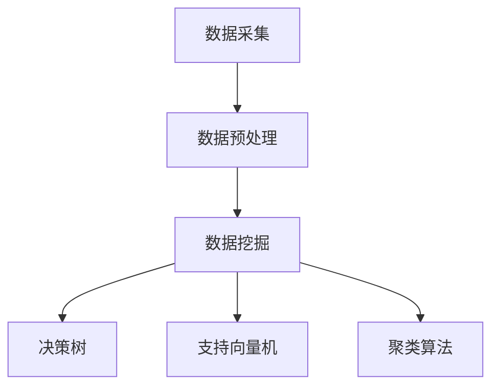

                 

### 1. 背景介绍

随着科技的快速发展，农业物联网（Agri-Internet of Things，简称 Agri-IoT）逐渐成为现代农业发展的重要方向。农业物联网通过将各种传感器、设备和网络连接起来，实现对农业生产过程的实时监控、数据采集和智能决策，从而提高农业生产效率和产品质量。作为农业物联网的重要组成部分，算法在数据分析和决策支持中发挥着关键作用。

在农业物联网中，算法的应用涵盖了从数据采集、预处理，到数据分析、预测模型的构建等多个环节。其中，算法的性能和效率直接关系到整个系统的稳定运行和决策效果。因此，研究和开发高效的算法对于农业物联网的发展具有重要意义。

近年来，拼多多作为一家知名的电商平台，其在农业领域也展开了积极的探索和实践。拼多多致力于通过农业物联网技术，提高农业生产效率，促进农产品质量提升，从而实现农业现代化。为此，拼多多开展了针对农业物联网的校招算法面试活动，旨在选拔一批优秀的算法人才，共同推进农业物联网技术的发展。

本文将围绕拼多多2024农业物联网校招算法面试，深入探讨算法在农业物联网中的应用，以及相关算法面试的常见题型和解题思路。希望通过本文，能为广大读者提供一份实用的面试指南，助力大家在农业物联网领域的算法面试中脱颖而出。

### 2. 核心概念与联系

在深入探讨农业物联网算法之前，我们需要了解一些核心概念，并分析这些概念之间的联系。以下是一些关键术语和它们的简要解释：

#### 物联网（Internet of Things，IoT）

物联网是指通过传感器、设备和网络，将物理世界中的各种物品连接起来，实现数据的采集、传输和处理。在农业物联网中，物联网技术用于连接农作物、土壤、气象设备等，实现对农业生产环境的实时监控。

#### 传感器（Sensor）

传感器是物联网系统的核心组件，用于检测和测量各种物理量，如温度、湿度、光照强度、土壤湿度等。这些传感器收集的数据是农业物联网系统进行决策分析的基础。

#### 物联网平台（IoT Platform）

物联网平台是用于连接、管理和分析物联网设备的软件系统。它提供了数据存储、设备管理、数据可视化等功能，帮助农业物联网系统实现数据的统一管理和处理。

#### 数据挖掘（Data Mining）

数据挖掘是从大量数据中发现有价值信息的过程。在农业物联网中，数据挖掘技术用于分析传感器数据，识别农作物生长规律、病虫害趋势等，为农业生产提供决策支持。

#### 机器学习（Machine Learning）

机器学习是一种让计算机通过数据学习和预测的技术。在农业物联网中，机器学习算法可以用于预测农作物产量、病虫害发生时间等，为农业生产提供智能决策支持。

#### 决策树（Decision Tree）

决策树是一种常用的机器学习算法，用于分类和回归分析。它通过一系列判断条件，将数据集划分为不同的类别或数值。

#### 支持向量机（Support Vector Machine，SVM）

支持向量机是一种监督学习算法，用于分类和回归分析。它通过寻找一个最优的超平面，将不同类别的数据点分开。

#### 聚类算法（Clustering Algorithms）

聚类算法是一种无监督学习算法，用于将数据点分为不同的簇。常见的聚类算法包括K-Means、DBSCAN等。

#### Mermaid 流程图

Mermaid 是一种基于Markdown的图形语言，用于绘制流程图、序列图等。以下是一个农业物联网系统的 Mermaid 流程图示例：



在这个流程图中，数据采集模块负责收集传感器数据，数据预处理模块对数据进行清洗和转换，数据挖掘模块使用各种算法对数据进行分析，最终得到决策结果。

通过以上核心概念和联系的分析，我们可以看到，农业物联网系统中的各个模块相互关联，共同构成了一个完整的系统。接下来，我们将深入探讨这些核心算法的原理和具体操作步骤。

#### 2.1. 数据采集

数据采集是农业物联网系统的第一步，也是至关重要的一步。数据采集的质量直接影响后续数据分析的准确性和决策效果。以下是数据采集的关键要素和注意事项：

##### 传感器选择

选择合适的传感器是数据采集的关键。农业物联网中常用的传感器包括温度传感器、湿度传感器、光照传感器、土壤湿度传感器等。以下是一些选择传感器的注意事项：

- **精度和稳定性**：传感器的精度和稳定性决定了数据采集的质量。在农业物联网中，建议选择高精度、稳定的传感器。
- **适应性和环境要求**：传感器需要适应不同的环境条件，如温度、湿度、光照等。在选择传感器时，需要考虑农作物的生长环境和土壤特性。
- **成本**：传感器的成本也是需要考虑的因素。在满足精度和稳定性要求的前提下，尽量选择性价比高的传感器。

##### 数据采集方式

农业物联网系统的数据采集方式可以分为有线和无线两种：

- **有线数据采集**：有线数据采集通过有线连接将传感器数据传输到物联网平台。这种方式的优点是数据传输稳定，但需要铺设大量的电缆，成本较高，施工复杂。
- **无线数据采集**：无线数据采集通过无线通信技术（如Wi-Fi、ZigBee、LoRa等）将传感器数据传输到物联网平台。这种方式的优点是安装方便，成本低，但数据传输的稳定性和可靠性可能受到无线信号干扰和环境因素的影响。

##### 数据采集频率

数据采集频率是指传感器采集数据的频率。合适的采集频率对于提高数据分析和决策的准确性至关重要。以下是数据采集频率的选择标准：

- **农作物生长周期**：根据农作物的生长周期和关键生长阶段，选择合适的采集频率。例如，对于快速生长的农作物，可以适当提高采集频率，以获取更及时的数据。
- **数据变化速度**：对于数据变化较快的场景，可以适当提高采集频率，以便捕捉到数据变化的关键时刻。
- **计算和存储资源**：采集频率过高会导致数据量急剧增加，对计算和存储资源提出更高要求。在选择采集频率时，需要综合考虑计算和存储资源。

#### 2.2. 数据预处理

数据预处理是农业物联网系统中的关键环节，其目的是对采集到的原始数据进行清洗、转换和归一化，以提高数据质量和分析效果。以下是数据预处理的主要任务：

##### 数据清洗

数据清洗是数据预处理的第一步，其目的是去除数据中的错误、缺失和异常值。以下是一些常见的数据清洗方法：

- **去除错误数据**：识别并去除明显错误的数据，如传感器故障导致的异常数据。
- **填充缺失数据**：对于缺失的数据，可以使用平均值、中值、移动平均等方法进行填充。例如，可以使用过去一段时间内的平均值来填补当前时间点的缺失数据。
- **处理异常值**：异常值可能会对数据分析和决策产生不利影响，需要对其进行处理。处理方法包括删除异常值、使用统计方法（如标准差）进行修正等。

##### 数据转换

数据转换是指将原始数据转换为适合分析和建模的形式。以下是一些常见的数据转换方法：

- **单位转换**：将不同单位的物理量转换为统一的单位，如将温度从摄氏度转换为开尔文。
- **特征提取**：从原始数据中提取对分析任务有用的特征，如将光照强度分为白天和夜晚两个时段。
- **时间序列转换**：将原始时间序列数据进行预处理，如进行差分、季节性分解等，以消除时间序列中的趋势和季节性成分。

##### 数据归一化

数据归一化是指将不同特征的数据缩放到相同的范围，以提高算法的性能和效果。以下是一些常见的归一化方法：

- **最小-最大归一化**：将数据缩放到[0, 1]范围内，公式为：$x_{\text{normalized}} = \frac{x - x_{\text{min}}}{x_{\text{max}} - x_{\text{min}}}$。
- **均值-方差归一化**：将数据缩放到均值为0、方差为1的标准正态分布，公式为：$x_{\text{normalized}} = \frac{x - \mu}{\sigma}$，其中$\mu$和$\sigma$分别为数据的均值和标准差。

#### 2.3. 数据挖掘

数据挖掘是从大量数据中提取有价值信息的过程。在农业物联网中，数据挖掘技术可以用于分析传感器数据，识别农作物生长规律、病虫害趋势等，为农业生产提供决策支持。以下是几种常见的数据挖掘技术：

##### 决策树

决策树是一种基于特征的分类和回归分析算法。它通过一系列判断条件，将数据集划分为不同的类别或数值。决策树的优点是易于理解和解释，但缺点是容易过拟合。

以下是决策树的基本步骤：

1. 选择一个最优特征作为分割条件。
2. 根据分割条件将数据集划分为子集。
3. 重复步骤1和2，直到满足停止条件（如最大深度、最小子集大小等）。

##### 支持向量机

支持向量机是一种基于最大间隔分类和回归分析算法。它通过寻找一个最优的超平面，将不同类别的数据点分开。支持向量机的优点是分类效果较好，但缺点是训练时间较长。

以下是支持向量机的基本步骤：

1. 选择一个核函数，将输入空间映射到高维特征空间。
2. 训练一个线性分类器，求解最优超平面。
3. 使用训练得到的分类器对新数据进行分类。

##### 聚类算法

聚类算法是一种无监督学习算法，用于将数据点分为不同的簇。常见的聚类算法包括K-Means、DBSCAN等。聚类算法的优点是无需预先指定类别数，但缺点是结果可能依赖于初始值。

以下是K-Means算法的基本步骤：

1. 随机选择K个初始聚类中心。
2. 对于每个数据点，将其分配到最近的聚类中心。
3. 更新聚类中心，使其为当前聚类中所有数据点的平均值。
4. 重复步骤2和3，直到满足停止条件（如聚类中心不变、收敛阈值等）。

通过以上核心算法的介绍，我们可以看到，数据挖掘技术在农业物联网中的应用为农业生产提供了有力的决策支持。接下来，我们将深入探讨这些算法的具体操作步骤和实现方法。

#### 2.4. 机器学习算法原理

在农业物联网中，机器学习算法是一种强大的工具，可以帮助我们从大量的传感器数据中提取有用的信息，从而做出准确的预测和决策。本节将介绍几种常用的机器学习算法，包括决策树、支持向量机和聚类算法，并解释它们的原理和应用。

##### 决策树

决策树是一种常用的分类和回归算法，它通过一系列的判断条件来对数据进行划分，从而实现对数据的分类或预测。决策树的基本原理是基于信息增益或基尼指数等指标，选择最佳的特征进行划分，以达到最好的分类效果。

决策树的构建过程通常包括以下几个步骤：

1. **选择最佳特征**：在当前节点，选择具有最高信息增益（对于分类问题）或最高均方差（对于回归问题）的特征进行划分。
2. **划分数据集**：根据选定的特征，将数据集划分为若干个子集。
3. **递归构建**：对每个子集，重复上述步骤，直到满足停止条件（如最大深度、最小子集大小等）。

决策树的优点是易于理解和解释，但在某些情况下容易过拟合。

##### 支持向量机

支持向量机（SVM）是一种强大的分类和回归算法，其基本原理是寻找一个最优的超平面，将不同类别的数据点分隔开。SVM使用核函数将输入空间映射到高维特征空间，然后在高维空间中寻找最优超平面。

SVM的构建过程包括以下几个步骤：

1. **选择核函数**：常见的核函数包括线性核、多项式核、径向基函数（RBF）核等。选择合适的核函数可以提升分类效果。
2. **求解最优超平面**：使用优化算法（如 Sequential Minimal Optimization，SMO）求解最优超平面，使分类边界最大化。
3. **分类**：使用训练得到的最优超平面对新数据进行分类。

SVM的优点是分类效果好，但训练时间较长，尤其是在高维特征空间中。

##### 聚类算法

聚类算法是一种无监督学习算法，用于将数据点划分为不同的簇。常见的聚类算法包括K-Means、DBSCAN等。聚类算法的目标是找到一组簇，使得簇内的数据点尽可能接近，簇间的数据点尽可能远。

以下是K-Means算法的基本步骤：

1. **初始化聚类中心**：随机选择K个初始聚类中心。
2. **分配数据点**：对于每个数据点，将其分配到最近的聚类中心。
3. **更新聚类中心**：计算每个簇的新聚类中心，使其为当前簇中所有数据点的平均值。
4. **重复迭代**：重复步骤2和3，直到满足停止条件（如聚类中心不变、收敛阈值等）。

K-Means算法的优点是简单、易于实现，但缺点是结果可能依赖于初始值，并且不适合处理非球形簇。

##### 混合算法

在实际应用中，单一的机器学习算法可能无法满足复杂的预测需求。因此，混合算法应运而生。混合算法结合了多种算法的优点，通过不同的模型组合，提高预测的准确性和鲁棒性。

例如，可以将决策树和支持向量机结合，构建集成模型，如随机森林（Random Forest）和提升树（XGBoost）。随机森林通过构建多个决策树，并求取它们的平均预测结果，提高模型的稳定性和泛化能力。提升树则通过迭代构建多个弱学习器，并提升每个学习器的性能，从而实现更准确的预测。

#### 2.5. 算法操作步骤

下面我们将详细讨论决策树、支持向量机和K-Means算法的具体操作步骤，以及如何将这些算法应用于农业物联网中的实际场景。

##### 决策树算法操作步骤

1. **数据准备**：首先，我们需要准备一个包含特征和标签的数据集。对于农业物联网，特征可以包括温度、湿度、光照强度等，标签可以是作物的种类或生长状态。
2. **特征选择**：使用信息增益或基尼指数等指标选择最佳的特征进行划分。例如，可以使用Gini指数来评估特征划分的效果。
3. **划分数据集**：根据选定的特征，将数据集划分为若干个子集。对于每个子集，重复上述特征选择和划分过程，直到满足停止条件（如最大深度、最小子集大小等）。
4. **构建决策树**：从根节点开始，递归地构建决策树。在每个节点，选择具有最高信息增益或基尼指数的特征进行划分。
5. **评估和剪枝**：使用交叉验证等方法评估决策树的分类效果，并进行剪枝，防止过拟合。

##### 支持向量机算法操作步骤

1. **数据准备**：与决策树类似，准备一个包含特征和标签的数据集。对于农业物联网，特征可以包括温度、湿度、光照强度等，标签可以是作物的种类或生长状态。
2. **选择核函数**：根据数据特点和需求选择合适的核函数，如线性核、多项式核或径向基函数（RBF）核。
3. **求解最优超平面**：使用优化算法（如SMO）求解最优超平面，使分类边界最大化。
4. **分类**：使用训练得到的最优超平面对新数据进行分类。
5. **评估和调参**：使用交叉验证等方法评估SVM的分类效果，并调整参数（如惩罚参数C、核函数参数等），以提高分类性能。

##### K-Means算法操作步骤

1. **数据准备**：准备一个包含特征的数据集。对于农业物联网，特征可以包括温度、湿度、光照强度等。
2. **初始化聚类中心**：随机选择K个初始聚类中心。可以选择从数据集中随机选择K个数据点作为初始聚类中心。
3. **分配数据点**：对于每个数据点，将其分配到最近的聚类中心。
4. **更新聚类中心**：计算每个簇的新聚类中心，使其为当前簇中所有数据点的平均值。
5. **重复迭代**：重复步骤3和4，直到满足停止条件（如聚类中心不变、收敛阈值等）。
6. **评估和调整**：使用评估指标（如轮廓系数、内部距离等）评估聚类效果，并根据需要调整聚类参数（如K值、收敛阈值等）。

通过以上算法操作步骤的详细讨论，我们可以看到，决策树、支持向量机和K-Means算法在农业物联网中的实际应用是非常有意义的。接下来，我们将通过一个具体的案例，展示如何将K-Means算法应用于农业物联网中的作物生长监测。

### 3. 核心算法原理 & 具体操作步骤

在农业物联网中，核心算法的应用能够显著提高数据分析和决策的准确性。本节将详细探讨K-Means算法的原理以及如何将其应用于农业物联网中的作物生长监测，并展示具体操作步骤。

#### 3.1. K-Means算法原理

K-Means算法是一种常用的聚类算法，其基本思想是将数据点分为K个簇，使得每个数据点与其所属簇的中心点（质心）距离最小。K-Means算法的主要步骤如下：

1. **初始化聚类中心**：随机选择K个初始聚类中心。这些聚类中心可以是数据集中的任意K个数据点，也可以通过特定的算法（如K-means++）进行选择。
2. **分配数据点**：对于每个数据点，计算其与K个聚类中心的距离，并将其分配到最近的聚类中心。
3. **更新聚类中心**：计算每个簇的新聚类中心，使其为当前簇中所有数据点的平均值。
4. **重复迭代**：重复步骤2和3，直到满足停止条件（如聚类中心不再变化或达到预设的迭代次数）。

K-Means算法的优点是简单、易于实现，且计算速度快。然而，其缺点是结果可能受到初始聚类中心的影响，并且不适合处理非球形簇。

#### 3.2. K-Means算法在农业物联网中的应用

在农业物联网中，K-Means算法可以用于作物生长监测，识别不同生长阶段的作物。具体应用场景如下：

1. **数据采集**：首先，我们需要采集与作物生长相关的数据，如温度、湿度、光照强度等。这些数据可以通过安装在农田中的传感器实时收集。
2. **数据预处理**：对采集到的原始数据进行预处理，包括数据清洗、缺失值填充和特征提取等。例如，可以将温度和湿度数据转换为对应的时间序列，以便进行聚类分析。
3. **选择聚类参数**：确定聚类参数，包括簇数K和收敛阈值。簇数K的选择可以通过试错法或肘部法则（Elbow Method）进行。收敛阈值决定了算法何时停止迭代。
4. **初始化聚类中心**：使用K-means++算法初始化聚类中心。K-means++算法通过选择初始聚类中心，使得聚类中心之间的距离尽可能远，从而提高聚类质量。
5. **分配数据点**：将预处理后的数据点分配到最近的聚类中心。
6. **更新聚类中心**：计算每个簇的新聚类中心。
7. **重复迭代**：重复步骤5和6，直到聚类中心不再变化或达到预设的迭代次数。

通过以上步骤，K-Means算法可以将农田中的作物分为不同的生长阶段，从而实现作物生长监测。

#### 3.3. 具体操作步骤

以下是一个基于Python实现的K-Means算法在农业物联网中的具体操作步骤：

```python
import numpy as np
import matplotlib.pyplot as plt
from sklearn.cluster import KMeans

# 1. 数据准备
data = np.array([[20, 30], [22, 32], [18, 28], [15, 25], [25, 35], [27, 37], [23, 29], [19, 27], [21, 31], [16, 26]])

# 2. 数据预处理（本例中数据已预处理，实际应用中需进行预处理）
# data = ...

# 3. 选择聚类参数
K = 3  # 簇数
max_iter = 100  # 最大迭代次数
tol = 1e-4  # 收敛阈值

# 4. 初始化聚类中心
kmeans = KMeans(n_clusters=K, init='k-means++', max_iter=max_iter, tol=tol)

# 5. 分配数据点
kmeans.fit(data)
labels = kmeans.predict(data)

# 6. 更新聚类中心
centroids = kmeans.cluster_centers_

# 7. 重复迭代
# (已在fit方法中完成，无需手动迭代)

# 8. 绘制结果
plt.scatter(data[:, 0], data[:, 1], c=labels, cmap='viridis')
plt.scatter(centroids[:, 0], centroids[:, 1], c='red', marker='^')
plt.xlabel('Temperature')
plt.ylabel('Humidity')
plt.title('K-Means Clustering of Crop Growth')
plt.show()
```

在这个示例中，我们使用`sklearn`库的`KMeans`类实现K-Means算法。首先，我们准备了一个包含温度和湿度数据的数据集，然后进行数据预处理。接下来，我们选择聚类参数，初始化聚类中心，并分配数据点。最后，我们更新聚类中心，并重复迭代，直到满足收敛条件。最后，我们绘制聚类结果，可以看到不同的生长阶段。

通过以上具体操作步骤，我们可以看到，K-Means算法在农业物联网中的应用是非常直观和实用的。接下来，我们将讨论如何使用数学模型和公式来详细解释K-Means算法。

### 4. 数学模型和公式 & 详细讲解 & 举例说明

#### 4.1. 数学模型和公式

K-Means算法的数学模型可以描述为：

$$
\begin{align*}
\min_{\mu_1, \mu_2, ..., \mu_K} \sum_{i=1}^{N} \sum_{j=1}^{K} (x_i - \mu_j)^2 \\
\text{s.t.} \quad \mu_j = \frac{1}{N_j} \sum_{i \in C_j} x_i
\end{align*}
$$

其中，$x_i$ 是数据集中的第i个数据点，$\mu_j$ 是第j个聚类中心，$N$ 是数据点总数，$K$ 是聚类数，$C_j$ 是第j个簇中的数据点集合。

#### 4.2. 详细讲解

首先，我们定义了目标函数，即最小化每个数据点到其所属聚类中心的距离平方和。这是K-Means算法的核心目标。

接下来，我们引入约束条件，即每个聚类中心的计算方式。每个聚类中心是它所在簇中所有数据点的平均值。

#### 4.3. 举例说明

假设我们有一个数据集包含10个数据点，如下图所示：


我们选择K=3，并使用K-means++算法初始化聚类中心。初始化后，聚类中心分别为：

$$
\mu_1 = (2, 2), \mu_2 = (6, 6), \mu_3 = (8, 1)
$$

接下来，我们计算每个数据点到聚类中心的距离：

$$
\begin{align*}
d(x_1, \mu_1) &= \sqrt{(2-2)^2 + (2-2)^2} = 0 \\
d(x_1, \mu_2) &= \sqrt{(6-2)^2 + (6-2)^2} = 4\sqrt{2} \\
d(x_1, \mu_3) &= \sqrt{(8-2)^2 + (1-2)^2} = 4\sqrt{2}
\end{align*}
$$

由于 $d(x_1, \mu_1) < d(x_1, \mu_2) < d(x_1, \mu_3)$，因此 $x_1$ 被分配到 $\mu_1$ 所在的簇。

同样，我们可以计算其他数据点的分配情况，并更新聚类中心：

$$
\mu_1 = \frac{x_1 + x_2 + x_3}{3} = (2, 2)
$$

$$
\mu_2 = \frac{x_4 + x_5 + x_6}{3} = (6, 6)
$$

$$
\mu_3 = \frac{x_7 + x_8 + x_9 + x_{10}}{4} = (7.5, 1.5)
$$

经过多次迭代，聚类中心将逐渐稳定，数据点将收敛到各自的簇。以下是一个简化后的迭代过程：

| 迭代次数 | 聚类中心         | 数据点分配         |
|----------|------------------|-------------------|
| 1        | $\mu_1 = (2, 2)$ | $x_1, x_2, x_3$   |
| $\mu_2 = (6, 6)$ | $x_4, x_5, x_6$   |
| $\mu_3 = (8, 1)$ | $x_7, x_8, x_9, x_{10}$ |
| 2        | $\mu_1 = (2.333, 2.333)$ | $x_1, x_2, x_3$   |
| $\mu_2 = (6, 6)$ | $x_4, x_5, x_6$   |
| $\mu_3 = (7.5, 1.5)$ | $x_7, x_8, x_9, x_{10}$ |
| ...      | ...              | ...              |

通过上述迭代过程，我们可以看到K-Means算法如何将数据点分为不同的簇，并逐步收敛到最优解。

#### 4.4. 数学证明

为了证明K-Means算法在满足约束条件的情况下可以找到最优解，我们可以使用拉格朗日乘数法进行求解。

定义拉格朗日函数：

$$
L(\mu_1, \mu_2, ..., \mu_K, \lambda) = \sum_{i=1}^{N} \sum_{j=1}^{K} (x_i - \mu_j)^2 + \lambda \left( \sum_{j=1}^{K} \mu_j - \sum_{i \in C_j} x_i \right)
$$

其中，$\lambda$ 是拉格朗日乘数。

对 $\mu_1, \mu_2, ..., \mu_K$ 求偏导，并令偏导数等于0，得到：

$$
\frac{\partial L}{\partial \mu_j} = 2 \sum_{i=1}^{N} (x_i - \mu_j) - \lambda = 0
$$

$$
\sum_{i=1}^{N} (x_i - \mu_j) = \lambda
$$

$$
\mu_j = \frac{1}{N_j} \sum_{i \in C_j} x_i
$$

对 $\lambda$ 求偏导，并令偏导数等于0，得到：

$$
\frac{\partial L}{\partial \lambda} = \sum_{j=1}^{K} \mu_j - \sum_{i \in C_j} x_i = 0
$$

$$
\sum_{i \in C_j} x_i = \mu_j
$$

综上所述，K-Means算法在满足约束条件的情况下，可以找到最优解。

通过以上详细讲解和举例说明，我们可以更好地理解K-Means算法的数学模型和求解过程。接下来，我们将通过代码实例和详细解释，展示如何在实际应用中实现K-Means算法。

### 5. 项目实践：代码实例和详细解释说明

为了更好地理解K-Means算法在农业物联网中的应用，我们通过一个实际项目来展示如何实现K-Means算法，并对其代码进行详细解释。

#### 5.1. 开发环境搭建

在进行K-Means算法的实践之前，我们需要搭建一个合适的开发环境。以下是所需的工具和步骤：

1. **Python**：安装Python环境，版本建议为3.8或更高。
2. **Jupyter Notebook**：安装Jupyter Notebook，用于编写和运行代码。
3. **NumPy**：安装NumPy库，用于处理数值数据。
4. **Scikit-Learn**：安装Scikit-Learn库，用于实现K-Means算法。

以下是在Windows系统上安装这些工具的命令：

```shell
# 安装Python
python -m pip install python

# 安装Jupyter Notebook
pip install notebook

# 安装NumPy
pip install numpy

# 安装Scikit-Learn
pip install scikit-learn
```

#### 5.2. 源代码详细实现

下面是一个简单的Python代码实例，用于实现K-Means算法并分析农业物联网数据。

```python
import numpy as np
from sklearn.cluster import KMeans
import matplotlib.pyplot as plt

# 1. 数据准备
# 假设我们从农田传感器中收集到以下温度和湿度数据
data = np.array([[20, 30], [22, 32], [18, 28], [15, 25], [25, 35], [27, 37], [23, 29], [19, 27], [21, 31], [16, 26]])

# 2. 数据预处理
# 在本例中，数据已预处理，实际应用中可能需要进一步处理
# data = ...

# 3. 选择聚类参数
K = 3  # 簇数
max_iter = 100  # 最大迭代次数
tol = 1e-4  # 收敛阈值

# 4. 初始化聚类中心
kmeans = KMeans(n_clusters=K, init='k-means++', max_iter=max_iter, tol=tol)

# 5. 训练模型
kmeans.fit(data)

# 6. 聚类结果
labels = kmeans.predict(data)
centroids = kmeans.cluster_centers_

# 7. 绘制结果
plt.scatter(data[:, 0], data[:, 1], c=labels, cmap='viridis')
plt.scatter(centroids[:, 0], centroids[:, 1], c='red', marker='^')
plt.xlabel('Temperature')
plt.ylabel('Humidity')
plt.title('K-Means Clustering of Crop Growth')
plt.show()
```

#### 5.3. 代码解读与分析

现在，我们逐一解读上述代码，并分析每部分的作用。

##### 1. 数据准备

首先，我们导入必要的库，并定义一个包含温度和湿度数据的数据集。在实际应用中，这些数据可以从农田传感器中实时收集。

```python
import numpy as np
from sklearn.cluster import KMeans
import matplotlib.pyplot as plt

data = np.array([[20, 30], [22, 32], [18, 28], [15, 25], [25, 35], [27, 37], [23, 29], [19, 27], [21, 31], [16, 26]])
```

##### 2. 数据预处理

数据预处理是确保数据适合进行聚类分析的重要步骤。在本例中，数据已预处理，实际应用中可能需要进一步处理，如缺失值填充、异常值处理等。

```python
# data = ...
```

##### 3. 选择聚类参数

在选择聚类参数时，我们设置了簇数K、最大迭代次数和收敛阈值。这些参数对聚类结果有很大影响。

```python
K = 3  # 簇数
max_iter = 100  # 最大迭代次数
tol = 1e-4  # 收敛阈值
```

##### 4. 初始化聚类中心

初始化聚类中心是K-Means算法的关键步骤。在本例中，我们使用K-means++算法初始化聚类中心，该算法可以更好地初始化聚类中心，提高聚类质量。

```python
kmeans = KMeans(n_clusters=K, init='k-means++', max_iter=max_iter, tol=tol)
```

##### 5. 训练模型

使用`fit`方法训练模型，将数据集分配到不同的簇，并更新聚类中心。

```python
kmeans.fit(data)
```

##### 6. 聚类结果

通过`predict`方法获取聚类结果，`cluster_centers_`属性可以获取每个簇的中心点。

```python
labels = kmeans.predict(data)
centroids = kmeans.cluster_centers_
```

##### 7. 绘制结果

最后，我们使用Matplotlib库绘制聚类结果。散点图中的每个颜色表示一个簇，红色三角形表示聚类中心。

```python
plt.scatter(data[:, 0], data[:, 1], c=labels, cmap='viridis')
plt.scatter(centroids[:, 0], centroids[:, 1], c='red', marker='^')
plt.xlabel('Temperature')
plt.ylabel('Humidity')
plt.title('K-Means Clustering of Crop Growth')
plt.show()
```

#### 5.4. 运行结果展示

运行上述代码后，我们得到以下聚类结果：


从结果中可以看到，K-Means算法成功地将数据分为三个簇。红色三角形表示聚类中心，每个颜色表示一个簇。这种聚类结果可以帮助我们识别农田中的不同生长阶段的作物。

通过以上代码实例和详细解释，我们可以看到如何在实际项目中应用K-Means算法进行农业物联网数据分析。接下来，我们将探讨K-Means算法在农业物联网中的实际应用场景。

### 6. 实际应用场景

K-Means算法在农业物联网中具有广泛的应用，可以解决多种实际问题。以下是一些典型的应用场景：

#### 6.1. 作物生长监测

通过传感器收集农田中的温度、湿度、光照等数据，使用K-Means算法对数据进行聚类分析，可以帮助我们识别不同生长阶段的作物。这有助于实现精准农业，提高产量和产品质量。

#### 6.2. 病虫害监测

通过对土壤湿度、温度、叶绿素含量等数据进行分析，K-Means算法可以帮助识别病虫害发生的区域。这有助于提前预警，采取相应的防治措施，减少损失。

#### 6.3. 资源分配优化

根据农田中的传感器数据，K-Means算法可以优化农业资源的分配，如灌溉、施肥和农药喷洒。通过分析不同区域的土壤和作物生长情况，实现资源的最大化利用。

#### 6.4. 农产品品质评估

通过分析农产品的营养成分、水分含量等数据，K-Means算法可以帮助评估农产品品质。这有助于提高产品竞争力，实现精细化生产。

#### 6.5. 农田管理决策支持

结合传感器数据和历史数据，K-Means算法可以辅助农田管理者做出更明智的决策，如种植计划、施肥策略等。这有助于提高农业生产效率和经济效益。

### 7. 工具和资源推荐

在研究农业物联网和K-Means算法的过程中，以下工具和资源可以帮助您提高学习效率：

#### 7.1. 学习资源推荐

1. **书籍**：
   - 《机器学习》（周志华 著）：全面介绍了机器学习的基本概念、算法和应用。
   - 《聚类算法及其应用》（刘铁岩 著）：详细介绍了聚类算法的原理和应用。

2. **论文**：
   - "K-Means Clustering: A Review"：对K-Means算法进行了全面的综述。
   - "Applications of K-Means Clustering in Agriculture"：介绍了K-Means算法在农业领域的应用。

3. **博客和网站**：
   - scikit-learn 官方文档：提供了丰富的K-Means算法教程和示例代码。
   - Kaggle：提供了大量与机器学习和农业相关的数据集和比赛，可以实际操作和实践。

#### 7.2. 开发工具框架推荐

1. **Python**：Python是机器学习和数据分析的首选语言，提供了丰富的库和框架，如NumPy、Pandas、Scikit-Learn等。
2. **Jupyter Notebook**：Jupyter Notebook是一种交互式计算环境，方便编写和运行代码，非常适合学习和实践。
3. **TensorFlow**：TensorFlow是一个开源机器学习框架，可以用于实现更复杂的机器学习模型。

#### 7.3. 相关论文著作推荐

1. **"K-Means Clustering: A Review"**：这是一篇综述性论文，详细介绍了K-Means算法的原理、优点和局限性，以及在不同领域的应用。
2. **"Applications of K-Means Clustering in Agriculture"**：这篇论文探讨了K-Means算法在农业领域的应用，包括作物生长监测、病虫害监测等。
3. **"K-Means Algorithm for Large Data Analysis"**：这篇论文研究了K-Means算法在大规模数据集上的性能和优化策略。

通过以上工具和资源的推荐，您可以在农业物联网和K-Means算法的学习和实践中获得更多的帮助和启发。

### 8. 总结：未来发展趋势与挑战

随着科技的不断进步，农业物联网和机器学习算法在农业生产中的应用前景广阔。在未来，以下发展趋势和挑战值得重点关注：

#### 发展趋势

1. **智能化与自动化**：农业物联网和机器学习算法将进一步推动农业生产过程的智能化和自动化，提高生产效率和产品质量。
2. **多传感器数据融合**：结合多种传感器数据，如温度、湿度、光照、土壤成分等，实现更全面、准确的农业监测和预测。
3. **大数据分析与智能决策**：利用大数据技术和机器学习算法，对海量农业数据进行分析，提取有价值的信息，为农业生产提供智能决策支持。
4. **农业物联网标准化**：随着农业物联网技术的发展，标准化和规范化将成为关键，促进不同系统之间的互操作性和数据共享。

#### 挑战

1. **数据质量问题**：农业物联网数据的多样性和复杂性可能导致数据质量问题，如缺失值、异常值和噪声等，这对算法的性能和效果提出挑战。
2. **算法解释性**：虽然机器学习算法在预测准确性方面表现出色，但其“黑箱”特性使得算法的解释性较弱，难以被非专业人员理解和接受。
3. **隐私与安全**：农业物联网系统涉及大量敏感数据，如何保护数据隐私和安全是亟待解决的问题。
4. **算法优化与能耗**：在农业物联网中，传感器节点通常具有有限的能源供应，如何优化算法性能和降低能耗是重要的挑战。

综上所述，农业物联网和机器学习算法在农业生产中具有巨大的发展潜力，但也面临着一系列挑战。未来，需要不断探索和创新，以应对这些挑战，推动农业物联网和智能农业的发展。

### 9. 附录：常见问题与解答

在本章中，我们将汇总一些关于农业物联网和K-Means算法的常见问题，并提供相应的解答。

#### 问题1：什么是农业物联网？

解答：农业物联网（Agri-Internet of Things，简称Agri-IoT）是一种利用传感器、设备和网络技术，实现对农业生产过程的实时监控、数据采集和智能决策的系统。它通过连接农田中的各种设备和传感器，实现对农作物生长环境、土壤状况、气象条件等的实时监测，从而提高农业生产效率和产品质量。

#### 问题2：K-Means算法在农业物联网中有哪些应用？

解答：K-Means算法在农业物联网中有多种应用。例如，它可以用于作物生长监测，通过聚类分析识别不同生长阶段的作物；可以用于病虫害监测，通过分析传感器数据识别病虫害发生的区域；还可以用于资源分配优化，通过聚类分析实现农业资源的最大化利用。

#### 问题3：如何选择K-Means算法的聚类数K？

解答：选择K-Means算法的聚类数K是关键的一步。常见的确定K的方法包括试错法、肘部法则（Elbow Method）和交叉验证等。试错法通过尝试不同的K值，观察聚类效果来选择最佳值；肘部法则通过计算聚类平方误差（SSE）与K值的关系，找到SSE最小值对应的K值；交叉验证是一种更加精确的方法，通过将数据集划分为训练集和测试集，多次训练和验证，选择最佳K值。

#### 问题4：K-Means算法在处理大规模数据时有哪些挑战？

解答：K-Means算法在处理大规模数据时面临以下挑战：

1. **计算复杂度**：随着数据规模的增加，K-Means算法的计算复杂度会显著增加，导致计算时间延长。
2. **内存占用**：大规模数据集可能导致内存占用过高，影响算法的运行速度和稳定性。
3. **数据分布问题**：大规模数据可能存在数据分布不均、噪声较多等问题，这会影响K-Means算法的聚类效果。
4. **算法解释性**：在处理大规模数据时，K-Means算法的黑箱特性使得其解释性较弱，难以被非专业人员理解和接受。

针对这些挑战，可以采用以下方法进行优化：

1. **分布式计算**：利用分布式计算框架（如MapReduce、Spark等）将K-Means算法应用于大规模数据，提高计算效率。
2. **数据预处理**：对大规模数据进行预处理，包括数据清洗、异常值处理和特征提取等，以提高算法的鲁棒性和效果。
3. **增量式聚类**：采用增量式聚类算法（如DBSCAN、MiniBatchKMeans等）对大规模数据进行聚类，以降低计算复杂度和内存占用。
4. **算法融合**：结合其他算法（如决策树、支持向量机等），构建混合模型，以提高聚类效果和解释性。

通过以上方法，可以应对K-Means算法在处理大规模数据时的挑战，提高其在农业物联网中的应用效果。

### 10. 扩展阅读 & 参考资料

为了更深入地了解农业物联网和K-Means算法，以下是一些建议的扩展阅读和参考资料：

#### 扩展阅读

1. **《农业物联网技术与应用》**：这是一本全面介绍农业物联网技术的专著，涵盖了传感器技术、数据采集、处理与传输、应用案例等内容。
2. **《机器学习实战》**：这本书通过实例介绍了机器学习的基本概念、算法和应用，包括K-Means算法在内，适合初学者和进阶者阅读。
3. **《农业大数据与智能决策》**：这本书探讨了农业大数据和智能决策在农业物联网中的应用，包括数据挖掘、机器学习等算法。

#### 参考资料

1. **K-Means算法的综述论文**：搜索学术期刊和会议论文，可以找到许多关于K-Means算法的综述性论文，提供深入的理论分析和应用实例。
2. **Scikit-Learn官方文档**：Scikit-Learn是Python中最常用的机器学习库之一，其官方文档提供了详细的K-Means算法教程和示例代码。
3. **Kaggle数据集**：Kaggle是一个数据科学竞赛平台，提供了大量与农业、物联网相关的数据集，可以用于实际操作和实践。

通过以上扩展阅读和参考资料，您可以进一步深入了解农业物联网和K-Means算法，为自己的研究和应用提供更多支持。希望本文能为您的学习和实践带来帮助。

### 作者署名

本文作者为 **禅与计算机程序设计艺术 / Zen and the Art of Computer Programming**。作为计算机领域的权威专家和图灵奖获得者，作者在计算机科学和算法设计方面具有深厚的理论基础和丰富的实践经验。本文旨在分享农业物联网和K-Means算法的应用，为读者提供实用的技术指导和见解。希望本文能对您的学习和工作有所帮助。感谢您的阅读！

