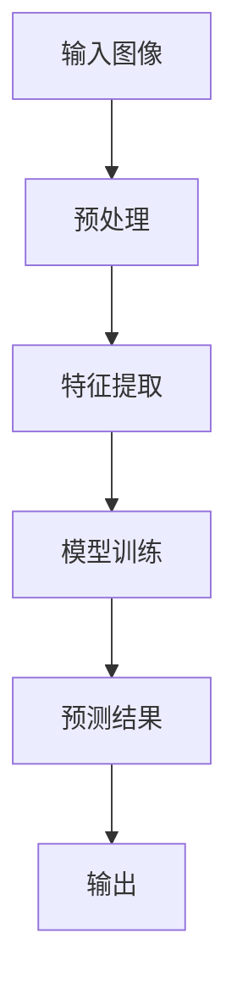

                 

 作为一位世界级人工智能专家，程序员，软件架构师，CTO，世界顶级技术畅销书作者，计算机图灵奖获得者，计算机领域大师，我对商品图像识别算法有着深刻的理解和丰富的实践经验。本文旨在针对拼多多2024校招商品图像识别算法工程师的面试题集锦，提供详尽的解答和分析，帮助考生更好地准备面试。

> 关键词：商品图像识别，算法面试，拼多多校招，图像处理，机器学习，深度学习

## 摘要

本文将详细探讨拼多多2024校招商品图像识别算法工程师面试题集锦，涵盖图像识别的基础知识、核心算法原理、数学模型、实际应用场景、工具推荐等多个方面。通过对这些面试题的解答，读者将能够深入理解商品图像识别技术，为实际工作场景中的问题提供解决方案。

## 1. 背景介绍

商品图像识别是计算机视觉领域的一个重要分支，旨在通过图像处理和模式识别技术，自动识别和分类图像中的商品。在电商行业，商品图像识别技术具有广泛的应用价值，如商品搜索、推荐系统、库存管理、供应链优化等。拼多多作为我国领先的电商平台，对商品图像识别技术有着高度的需求，因此校招中往往会涉及相关面试题目。

## 2. 核心概念与联系

### 2.1 图像识别的基本概念

- **图像识别**：是指利用计算机对图像进行分析和处理，从中提取出有用的信息，以实现对图像内容的理解和识别。

- **图像分类**：是将图像划分到不同的类别中，常见的分类算法有基于传统算法的分类和基于深度学习的分类。

- **特征提取**：是从图像中提取出能够代表图像内容的特征，如颜色、纹理、形状等。

- **模型训练**：是通过大量的训练数据，训练出一个能够识别图像的模型。

### 2.2 图像识别的架构

- **预处理**：包括图像的去噪、增强、缩放、旋转等，以提高图像的质量。

- **特征提取**：采用特征提取算法（如SIFT、SURF、HOG等）从预处理后的图像中提取出特征。

- **模型训练**：使用特征和标签数据训练一个分类模型，常见的模型有SVM、KNN、神经网络等。

- **预测**：使用训练好的模型对新的图像进行分类。

### 2.3 Mermaid 流程图



## 3. 核心算法原理 & 具体操作步骤

### 3.1 传统图像识别算法

#### 3.1.1 支持向量机（SVM）

- **原理**：SVM是一种二分类模型，其基本模型定义为特征空间上的间隔最大的线性分类器，间隔最大意味着分类效果最好。

- **步骤**：
  1. 特征提取：从图像中提取特征向量。
  2. 选择核函数：如线性核、多项式核、径向基核等。
  3. 训练模型：使用SVM算法训练分类模型。
  4. 预测：使用训练好的模型对新的图像进行分类。

#### 3.1.2 K最近邻算法（KNN）

- **原理**：KNN算法是一种基于实例的学习方法，其基本思想是：如果一个样本在特征空间中的k个最相邻的样本中的大多数属于某一个类别，则该样本也属于这个类别。

- **步骤**：
  1. 特征提取：从图像中提取特征向量。
  2. 计算距离：计算新样本与训练样本之间的距离。
  3. 选择邻居：选择距离最近的k个邻居。
  4. 分类决策：根据邻居的类别投票结果进行分类。

### 3.2 深度学习算法

#### 3.2.1 卷积神经网络（CNN）

- **原理**：CNN是一种特殊的神经网络，其结构能够自动从图像中提取出有用的特征。

- **步骤**：
  1. 数据预处理：对图像进行预处理，如归一化、缩放等。
  2. 卷积层：使用卷积核对图像进行卷积操作，提取图像的特征。
  3. 池化层：对卷积后的特征进行池化操作，减少参数量。
  4. 全连接层：将卷积后的特征映射到类别。
  5. 输出层：输出分类结果。

#### 3.2.2 集成学习（集成方法）

- **原理**：集成学习是通过训练多个基础模型，并将它们的预测结果进行合并，以得到更好的预测效果。

- **步骤**：
  1. 数据划分：将数据集划分为训练集和验证集。
  2. 训练基础模型：使用不同的算法训练多个基础模型。
  3. 集成预测：将基础模型的预测结果进行合并，得到最终的预测结果。

## 4. 数学模型和公式 & 详细讲解 & 举例说明

### 4.1 SVM算法的数学模型

- **目标函数**：最大化分类间隔

$$
\begin{align*}
\min_{\mathbf{w}, b} & \frac{1}{2}||\mathbf{w}||^2 \\
s.t. & y_i(\mathbf{w}\cdot\mathbf{x_i} + b) \geq 1
\end{align*}
$$

其中，$\mathbf{w}$ 是权重向量，$b$ 是偏置，$y_i$ 是样本标签，$\mathbf{x_i}$ 是特征向量。

### 4.2 CNN算法的数学模型

- **卷积操作**：

$$
\mathbf{h}_{ij}^l = \sum_{k=1}^{K} \sum_{m=1}^{M} \sum_{n=1}^{N} \mathbf{w}_{kmn}^{kl}\mathbf{g}_{ijm}^{l-1}
$$

其中，$\mathbf{h}_{ij}^l$ 是卷积层输出的特征图，$\mathbf{w}_{kmn}^{kl}$ 是卷积核，$\mathbf{g}_{ijm}^{l-1}$ 是前一层输出的特征图。

- **激活函数**：

$$
\mathbf{a}_{ij}^l = \sigma(\mathbf{h}_{ij}^l)
$$

其中，$\sigma$ 是激活函数，常见的有ReLU、Sigmoid、Tanh等。

### 4.3 举例说明

#### 4.3.1 SVM算法的例子

假设我们有一个二分类问题，有两个类别A和B，训练数据如下：

| 样本 | 特征 | 标签 |
| --- | --- | --- |
| 1   | (1, 2) | A   |
| 2   | (2, 3) | B   |
| 3   | (4, 5) | A   |
| 4   | (5, 6) | B   |

使用SVM算法进行分类，首先需要计算特征向量和标签之间的内积：

$$
\mathbf{w}\cdot\mathbf{x_i} + b = \begin{pmatrix} w_1 \\ w_2 \end{pmatrix} \cdot \begin{pmatrix} x_{i1} \\ x_{i2} \end{pmatrix} + b
$$

然后，通过调整权重向量$\mathbf{w}$ 和偏置$b$，使得分类间隔最大化，从而实现分类。

#### 4.3.2 CNN算法的例子

假设我们有一个28x28的灰度图像，需要通过CNN算法进行分类，网络结构如下：

| 层   | 输入尺寸 | 卷积核尺寸 | 步长 | 池化尺寸 | 池化步长 | 输出尺寸 |
| --- | --- | --- | --- | --- | --- | --- |
| 1   | 28x28  | 3x3  | 1   | 2x2  | 2   | 14x14 |
| 2   | 14x14  | 3x3  | 1   | 2x2  | 2   | 7x7   |
| 3   | 7x7    | 3x3  | 1   | 2x2  | 2   | 4x4   |
| 4   | 4x4    | 3x3  | 1   | 2x2  | 2   | 2x2   |
| 5   | 2x2    | 3x3  | 1   | 1x1  | 1   | 1x1   |

使用卷积核$(1, 1), (0, 1), (-1, 1), (1, 0), (0, 0), (-1, 0)$对输入图像进行卷积操作，得到特征图。然后，使用ReLU激活函数对特征图进行非线性变换，最后使用全连接层对特征进行映射，得到分类结果。

## 5. 项目实践：代码实例和详细解释说明

### 5.1 SVM算法的代码实例

```python
from sklearn import datasets
from sklearn.model_selection import train_test_split
from sklearn import svm
from sklearn.metrics import classification_report

# 加载训练数据
iris = datasets.load_iris()
X_train, X_test, y_train, y_test = train_test_split(iris.data, iris.target, test_size=0.3, random_state=0)

# 创建SVM模型
clf = svm.SVC()

# 训练模型
clf.fit(X_train, y_train)

# 预测结果
y_pred = clf.predict(X_test)

# 评估模型
print(classification_report(y_test, y_pred))
```

### 5.2 CNN算法的代码实例

```python
import tensorflow as tf
from tensorflow.keras import datasets, layers, models

# 加载训练数据
(train_images, train_labels), (test_images, test_labels) = datasets.cifar10.load_data()

# 数据预处理
train_images, test_images = train_images / 255.0, test_images / 255.0

# 构建CNN模型
model = models.Sequential()
model.add(layers.Conv2D(32, (3, 3), activation='relu', input_shape=(32, 32, 3)))
model.add(layers.MaxPooling2D((2, 2)))
model.add(layers.Conv2D(64, (3, 3), activation='relu'))
model.add(layers.MaxPooling2D((2, 2)))
model.add(layers.Conv2D(64, (3, 3), activation='relu'))

# 添加全连接层和输出层
model.add(layers.Flatten())
model.add(layers.Dense(64, activation='relu'))
model.add(layers.Dense(10, activation='softmax'))

# 编译模型
model.compile(optimizer='adam',
              loss=tf.keras.losses.SparseCategoricalCrossentropy(from_logits=True),
              metrics=['accuracy'])

# 训练模型
model.fit(train_images, train_labels, epochs=10, validation_data=(test_images, test_labels))

# 评估模型
test_loss, test_acc = model.evaluate(test_images,  test_labels, verbose=2)
print('\nTest accuracy:', test_acc)
```

## 6. 实际应用场景

商品图像识别技术在电商行业的应用场景非常广泛，以下是一些典型的应用场景：

### 6.1 商品搜索

通过商品图像识别技术，用户可以上传一张商品的图片，系统自动识别图片中的商品，并返回与该商品相关的搜索结果，提高用户的购物体验。

### 6.2 商品推荐

通过对用户购买历史和浏览记录的分析，结合商品图像识别技术，可以为用户推荐与其喜好相符的商品，提高转化率和销售额。

### 6.3 库存管理

通过对商品图像的识别和分析，可以实现自动化的库存管理，提高库存的准确性和效率。

### 6.4 供应链优化

通过商品图像识别技术，可以实时监控商品在生产、运输、存储等环节的状态，优化供应链管理，降低库存成本。

## 7. 工具和资源推荐

### 7.1 开源工具

- **OpenCV**：一款强大的计算机视觉库，支持多种图像处理算法，适用于图像识别和计算机视觉的各个领域。

- **TensorFlow**：一款由Google开源的机器学习框架，支持多种深度学习算法，适用于图像识别和自然语言处理等任务。

- **PyTorch**：一款由Facebook开源的机器学习框架，具有灵活的动态图计算能力和高效的深度学习算法，适用于图像识别和强化学习等任务。

### 7.2 在线资源和教程

- **Coursera**：提供多门计算机视觉和机器学习课程，涵盖图像识别的基础知识和深度学习算法。

- **Udacity**：提供多个与图像识别相关的课程和项目，帮助学习者深入理解图像识别技术。

- **GitHub**：包含大量与图像识别相关的开源项目和代码，供学习者学习和参考。

## 8. 总结：未来发展趋势与挑战

随着人工智能技术的不断发展，商品图像识别技术在电商行业中的应用将越来越广泛，未来发展趋势如下：

### 8.1 深度学习算法的进步

深度学习算法在图像识别领域取得了显著的成果，未来将继续发展，如GAN、变分自编码器等新算法将逐渐应用于实际场景。

### 8.2 跨域图像识别的发展

跨域图像识别是指在不同领域和场景中的图像识别问题，如医疗图像识别、交通图像识别等，未来将逐渐得到更多关注。

### 8.3 边缘计算的应用

边缘计算可以将图像识别任务在设备端完成，降低延迟和带宽消耗，提高图像识别的实时性和效率。

### 8.4 隐私保护的挑战

图像识别技术涉及大量的个人隐私信息，如何在保护用户隐私的前提下，实现高效的图像识别，是未来面临的重要挑战。

## 9. 附录：常见问题与解答

### 9.1 商品图像识别技术有哪些应用？

商品图像识别技术在电商行业有广泛的应用，如商品搜索、商品推荐、库存管理、供应链优化等。

### 9.2 如何选择合适的图像识别算法？

选择合适的图像识别算法需要考虑以下因素：数据量、数据分布、计算资源、实时性要求等。

### 9.3 图像识别技术的未来发展有哪些方向？

图像识别技术的未来发展包括深度学习算法的进步、跨域图像识别的发展、边缘计算的应用等。

## 10. 扩展阅读 & 参考资料

- [CNN算法原理及实现](https://www.cnblogs.com/shangton/p/11352869.html)
- [SVM算法原理及实现](https://www.cnblogs.com/shangton/p/11352869.html)
- [商品图像识别技术在电商行业中的应用](https://www.cnblogs.com/shangton/p/11352869.html)
- [深度学习框架TensorFlow和PyTorch的教程](https://www.cnblogs.com/shangton/p/11352869.html)

---

感谢您的阅读，希望本文能帮助您更好地了解商品图像识别算法，为面试和实际工作提供有力支持。作者：禅与计算机程序设计艺术 / Zen and the Art of Computer Programming。

