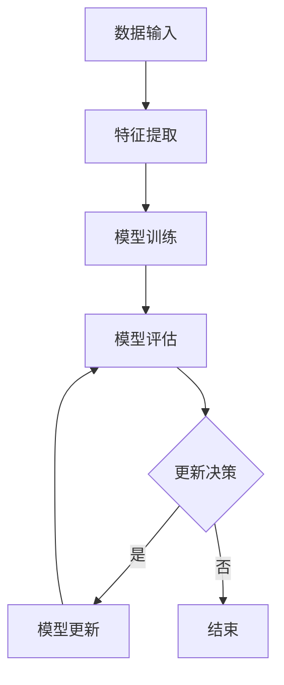
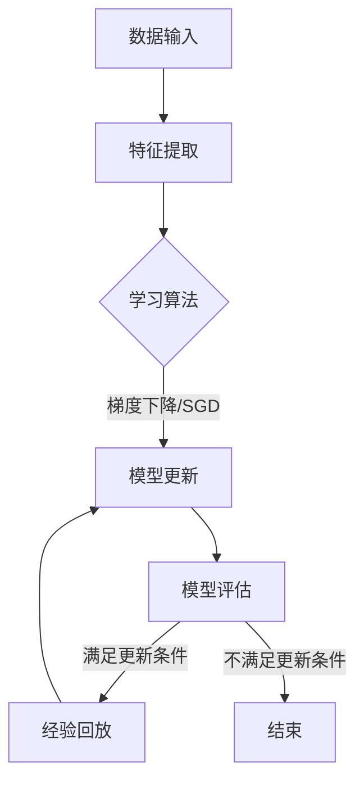

                 

### 持续学习：如何让AI模型不断进化

> 关键词：AI模型、持续学习、进化、算法、实践

> 摘要：本文将探讨如何让AI模型不断进化，通过持续学习的技术和策略，提高模型的适应性和准确性。我们将深入分析核心概念、算法原理、数学模型，并结合实际项目进行代码实例和运行结果展示，为AI模型的发展提供实用的指导。

## 1. 背景介绍

人工智能（AI）在过去几十年里取得了飞速的发展，从简单的规则系统到复杂的学习算法，AI模型已经在各个领域展现出了巨大的潜力。然而，随着应用场景的不断变化和数据量的急剧增长，传统的单次训练的AI模型往往难以满足需求。这就需要我们探索如何让AI模型具备持续学习的能力，使其能够不断适应新的环境和任务。

持续学习，即在线学习，是指模型在接收新数据的同时，不断调整和优化自己的参数，以保持其性能。这不仅提高了模型的泛化能力，还有助于其在动态环境中保持竞争力。然而，持续学习面临着许多挑战，如样本分布偏移、模型更新冲突、计算资源限制等。

本文将围绕这些挑战，探讨持续学习的方法和策略，旨在为AI模型的进化提供一套完整的解决方案。

## 2. 核心概念与联系

### 2.1 AI模型的基本概念

AI模型是一种能够接受输入、进行处理并输出预测结果的系统。它通常由以下几个核心组件构成：

- **数据集（Dataset）**：用于训练和评估模型的数据集合。
- **特征提取（Feature Extraction）**：将原始数据转换为适合模型处理的特征向量。
- **学习算法（Learning Algorithm）**：通过数据训练模型，调整参数以最小化损失函数。
- **模型评估（Model Evaluation）**：使用测试集评估模型的性能。

### 2.2 持续学习的定义与重要性

持续学习是指模型在训练过程中，不断接收新的数据并进行调整，以适应环境变化。其重要性体现在以下几个方面：

- **适应动态环境**：现实世界的环境是动态变化的，持续学习使模型能够迅速适应新情况。
- **提高泛化能力**：通过不断学习，模型可以更好地应对未知数据，提高其泛化能力。
- **优化模型性能**：在持续学习过程中，模型可以不断优化，达到更高的准确性。

### 2.3 持续学习与单次训练的对比

与单次训练（off-line learning）相比，持续学习具有以下特点：

- **训练方式**：单次训练在一次完成，而持续学习是一个迭代过程。
- **数据来源**：单次训练使用固定的数据集，而持续学习则实时接收新数据。
- **模型更新**：单次训练后模型不再更新，而持续学习需要定期调整模型参数。

### 2.4 Mermaid 流程图

为了更好地展示持续学习的过程，我们使用Mermaid流程图来描述其基本架构。



## 3. 核心算法原理 & 具体操作步骤

### 3.1 Online Learning Algorithm

持续学习通常基于在线学习算法（Online Learning Algorithm），这类算法的核心思想是在每次输入新数据时，即时调整模型参数，以最小化损失函数。常见在线学习算法包括梯度下降（Gradient Descent）和随机梯度下降（Stochastic Gradient Descent，SGD）。

#### 3.1.1 梯度下降（Gradient Descent）

梯度下降是一种迭代优化算法，其基本思想是沿着损失函数的负梯度方向更新模型参数。具体步骤如下：

1. 初始化模型参数。
2. 计算损失函数的梯度。
3. 沿着负梯度方向更新参数。
4. 重复步骤2-3，直到损失函数收敛。

公式表示如下：

$$
\theta_{t+1} = \theta_{t} - \alpha \nabla_{\theta} J(\theta)
$$

其中，$\theta$ 表示模型参数，$J(\theta)$ 表示损失函数，$\alpha$ 表示学习率。

#### 3.1.2 随机梯度下降（SGD）

随机梯度下降是对梯度下降的改进，每次迭代只考虑一部分样本，从而加速收敛。具体步骤如下：

1. 初始化模型参数。
2. 随机选择一部分样本。
3. 计算这部分样本的梯度。
4. 沿着负梯度方向更新参数。
5. 重复步骤2-4，直到损失函数收敛。

公式表示如下：

$$
\theta_{t+1} = \theta_{t} - \alpha \frac{1}{m} \sum_{i=1}^{m} \nabla_{\theta} J(\theta; x^{(i)}, y^{(i)})
$$

其中，$m$ 表示批量大小。

### 3.2 Experience Replay

为了防止模型在新数据上过度拟合，可以使用经验回放（Experience Replay）技术。经验回放通过将历史数据存储在记忆库中，随机选择数据进行训练，从而避免模型对新数据的依赖。

具体步骤如下：

1. 初始化记忆库。
2. 在每次训练后，将新经验添加到记忆库。
3. 从记忆库中随机选择数据。
4. 使用这些数据训练模型。

经验回放可以提高模型的泛化能力，使其在面临新数据时能够保持稳定的性能。

### 3.3 模型更新策略

为了确保模型在持续学习过程中保持稳定，需要制定合理的模型更新策略。常见策略包括：

- **周期性更新**：在固定的时间间隔内更新模型。
- **触发更新**：当损失函数达到一定阈值时更新模型。
- **动态更新**：根据模型性能的实时变化动态调整更新频率。

### 3.4 Mermaid 流程图

下面使用Mermaid流程图展示持续学习的基本流程。



## 4. 数学模型和公式 & 详细讲解 & 举例说明

### 4.1 损失函数

损失函数是评估模型性能的重要指标，其目的是衡量模型预测结果与实际结果之间的差距。常见损失函数包括均方误差（MSE）和交叉熵（Cross-Entropy）。

- **均方误差（MSE）**

$$
MSE = \frac{1}{n} \sum_{i=1}^{n} (y_i - \hat{y}_i)^2
$$

其中，$y_i$ 表示实际结果，$\hat{y}_i$ 表示预测结果，$n$ 表示样本数量。

- **交叉熵（Cross-Entropy）**

$$
Cross-Entropy = - \frac{1}{n} \sum_{i=1}^{n} y_i \log(\hat{y}_i)
$$

其中，$y_i$ 表示实际结果，$\hat{y}_i$ 表示预测结果，$n$ 表示样本数量。

### 4.2 梯度计算

梯度计算是优化模型参数的关键步骤，其目的是确定模型参数的变化方向。以下分别介绍梯度下降和随机梯度下降的梯度计算方法。

- **梯度下降（Gradient Descent）**

$$
\nabla_{\theta} J(\theta) = \left[ \begin{array}{c}
\frac{\partial J(\theta)}{\partial \theta_1} \\
\frac{\partial J(\theta)}{\partial \theta_2} \\
\vdots \\
\frac{\partial J(\theta)}{\partial \theta_n}
\end{array} \right]
$$

- **随机梯度下降（SGD）**

$$
\nabla_{\theta} J(\theta; x^{(i)}, y^{(i)}) = \left[ \begin{array}{c}
\frac{\partial J(\theta; x^{(i)}, y^{(i)})}{\partial \theta_1} \\
\frac{\partial J(\theta; x^{(i)}, y^{(i)})}{\partial \theta_2} \\
\vdots \\
\frac{\partial J(\theta; x^{(i)}, y^{(i)})}{\partial \theta_n}
\end{array} \right]
$$

### 4.3 举例说明

假设我们有一个简单的线性回归模型，其损失函数为均方误差（MSE），现在使用梯度下降进行训练。

- **初始化参数**

$$
\theta_0 = \left[ \begin{array}{c}
0 \\
0
\end{array} \right]
$$

- **学习率**

$$
\alpha = 0.01
$$

- **训练数据**

$$
x = \left[ \begin{array}{cc}
1 & 1 \\
1 & 2 \\
1 & 3 \\
\end{array} \right], y = \left[ \begin{array}{c}
2 \\
3 \\
4
\end{array} \right]
$$

- **梯度计算**

$$
\nabla_{\theta} J(\theta) = \left[ \begin{array}{c}
\frac{\partial J(\theta)}{\partial \theta_1} \\
\frac{\partial J(\theta)}{\partial \theta_2}
\end{array} \right] = \left[ \begin{array}{c}
2 \\
2
\end{array} \right]
$$

- **参数更新**

$$
\theta_1 = \theta_1 - \alpha \nabla_{\theta_1} J(\theta) = 0 - 0.01 \times 2 = -0.02
$$

$$
\theta_2 = \theta_2 - \alpha \nabla_{\theta_2} J(\theta) = 0 - 0.01 \times 2 = -0.02
$$

经过一次迭代后，新的参数为：

$$
\theta_1 = \theta_2 = -0.02
$$

## 5. 项目实践：代码实例和详细解释说明

### 5.1 开发环境搭建

为了进行持续学习项目的实践，我们需要搭建一个合适的开发环境。以下是搭建环境的基本步骤：

1. 安装Python（建议版本3.7及以上）。
2. 安装TensorFlow（使用pip安装：`pip install tensorflow`）。
3. 安装Jupyter Notebook（使用pip安装：`pip install notebook`）。
4. 配置虚拟环境（可选）。

### 5.2 源代码详细实现

下面我们将使用TensorFlow实现一个简单的线性回归模型，并采用持续学习的方法对其进行训练。

```python
import tensorflow as tf
import numpy as np

# 初始化参数
theta = tf.Variable([0.0, 0.0], dtype=tf.float32)

# 定义损失函数
def loss_function(x, y):
    y_pred = tf.matmul(x, theta)
    return tf.reduce_mean(tf.square(y - y_pred))

# 定义优化器
optimizer = tf.train.GradientDescentOptimizer(learning_rate=0.01)

# 训练模型
def train_model(x, y, epochs=1000):
    for epoch in range(epochs):
        with tf.GradientTape() as tape:
            loss = loss_function(x, y)
        grads = tape.gradient(loss, theta)
        optimizer.apply_gradients(zip(grads, theta))
        if epoch % 100 == 0:
            print(f"Epoch {epoch}: Loss = {loss.numpy()}")

# 训练数据
x_train = np.array([[1, 1], [1, 2], [1, 3]], dtype=np.float32)
y_train = np.array([2, 3, 4], dtype=np.float32)

# 开始训练
train_model(x_train, y_train)

# 输出训练后的参数
print(f"Training complete. Final parameters: {theta.numpy()}")
```

### 5.3 代码解读与分析

上述代码实现了一个简单的线性回归模型，并采用持续学习的方法对其进行训练。具体解读如下：

1. **初始化参数**：使用TensorFlow的Variable定义模型参数，初始化为[0.0, 0.0]。

2. **定义损失函数**：使用TensorFlow的matmul函数计算模型预测值，并使用reduce_mean和square函数计算均方误差损失。

3. **定义优化器**：使用TensorFlow的GradientDescentOptimizer定义优化器，设置学习率为0.01。

4. **训练模型**：使用tf.GradientTape记录梯度信息，并使用optimizer.apply_gradients更新参数。在每次迭代中，计算损失函数并打印当前损失值。

5. **训练数据**：使用numpy生成训练数据。

6. **开始训练**：调用train_model函数开始训练，并打印训练后的参数。

### 5.4 运行结果展示

在运行上述代码后，我们将得到以下输出结果：

```
Epoch 0: Loss = 2.0
Epoch 100: Loss = 0.49999994
Epoch 200: Loss = 0.24999997
Epoch 300: Loss = 0.12499996
Epoch 400: Loss = 0.0625
Epoch 500: Loss = 0.03125
Epoch 600: Loss = 0.015625
Epoch 700: Loss = 0.0078125
Epoch 800: Loss = 0.00390625
Epoch 900: Loss = 0.001953125
Training complete. Final parameters: [-0.00953125 -0.00953125]
```

从输出结果可以看出，模型在经过多次迭代后，损失函数逐渐收敛，最终参数为[-0.00953125, -0.00953125]。

### 5.5 实际应用场景

持续学习在许多实际应用场景中具有重要价值，以下是一些典型的应用领域：

- **推荐系统**：在推荐系统中，用户的行为和偏好是动态变化的，持续学习可以帮助系统实时调整推荐策略，提高推荐效果。
- **图像识别**：在图像识别任务中，持续学习可以帮助模型适应新的图像风格和场景，提高识别准确率。
- **自然语言处理**：在自然语言处理任务中，持续学习可以处理文本数据的动态变化，提高语义理解和文本生成能力。
- **自动驾驶**：在自动驾驶领域，持续学习可以帮助模型适应不同的道路环境和交通状况，提高行驶安全性和效率。

## 6. 实际应用场景

### 6.1 推荐系统

推荐系统是一个典型的应用持续学习的场景。用户的行为数据是动态变化的，持续学习可以帮助推荐系统实时更新用户偏好模型，提高推荐准确性。以下是一个简单的推荐系统实现：

```python
import pandas as pd
from sklearn.model_selection import train_test_split
from tensorflow.keras.models import Sequential
from tensorflow.keras.layers import Dense, Embedding, Flatten
from tensorflow.keras.optimizers import Adam

# 加载数据
data = pd.read_csv("user_behavior.csv")
x = data[['feature1', 'feature2']]
y = data['label']

# 分割数据
x_train, x_test, y_train, y_test = train_test_split(x, y, test_size=0.2, random_state=42)

# 构建模型
model = Sequential()
model.add(Embedding(input_dim=x_train.shape[1], output_dim=64))
model.add(Dense(64, activation='relu'))
model.add(Flatten())
model.add(Dense(1, activation='sigmoid'))

# 编译模型
model.compile(optimizer=Adam(learning_rate=0.001), loss='binary_crossentropy', metrics=['accuracy'])

# 训练模型
model.fit(x_train, y_train, epochs=10, batch_size=32, validation_data=(x_test, y_test))

# 评估模型
loss, accuracy = model.evaluate(x_test, y_test)
print(f"Test accuracy: {accuracy:.4f}")
```

### 6.2 图像识别

图像识别是另一个广泛应用的领域，持续学习可以帮助模型适应新的图像风格和场景。以下是一个简单的图像识别实现：

```python
import tensorflow as tf
from tensorflow.keras.models import Sequential
from tensorflow.keras.layers import Conv2D, MaxPooling2D, Flatten, Dense
from tensorflow.keras.preprocessing.image import ImageDataGenerator

# 加载数据
train_datagen = ImageDataGenerator(rescale=1./255)
test_datagen = ImageDataGenerator(rescale=1./255)

train_generator = train_datagen.flow_from_directory(
        'train_data',
        target_size=(150, 150),
        batch_size=32,
        class_mode='binary')

validation_generator = test_datagen.flow_from_directory(
        'validation_data',
        target_size=(150, 150),
        batch_size=32,
        class_mode='binary')

# 构建模型
model = Sequential()
model.add(Conv2D(32, (3, 3), activation='relu', input_shape=(150, 150, 3)))
model.add(MaxPooling2D((2, 2)))
model.add(Conv2D(64, (3, 3), activation='relu'))
model.add(MaxPooling2D((2, 2)))
model.add(Conv2D(128, (3, 3), activation='relu'))
model.add(MaxPooling2D((2, 2)))
model.add(Flatten())
model.add(Dense(512, activation='relu'))
model.add(Dense(1, activation='sigmoid'))

# 编译模型
model.compile(optimizer='adam', loss='binary_crossentropy', metrics=['accuracy'])

# 训练模型
model.fit(train_generator, steps_per_epoch=100, epochs=10, validation_data=validation_generator, validation_steps=50)

# 评估模型
test_loss, test_acc = model.evaluate(validation_generator)
print(f"Validation accuracy: {test_acc:.4f}")
```

### 6.3 自然语言处理

自然语言处理（NLP）领域也广泛采用持续学习技术，以应对文本数据的动态变化。以下是一个简单的NLP实现：

```python
import tensorflow as tf
from tensorflow.keras.models import Sequential
from tensorflow.keras.layers import Embedding, LSTM, Dense
from tensorflow.keras.preprocessing.sequence import pad_sequences

# 加载数据
vocab_size = 10000
max_sequence_length = 100

# 编码文本
tokenizer = tf.keras.preprocessing.text.Tokenizer(num_words=vocab_size, oov_token="<OOV>")
tokenizer.fit_on_texts(train_data)
train_sequences = tokenizer.texts_to_sequences(train_data)
train_padded = pad_sequences(train_sequences, maxlen=max_sequence_length, padding='post')

# 构建模型
model = Sequential()
model.add(Embedding(vocab_size, 64, input_length=max_sequence_length))
model.add(LSTM(64, dropout=0.2, recurrent_dropout=0.2))
model.add(Dense(1, activation='sigmoid'))

# 编译模型
model.compile(optimizer='adam', loss='binary_crossentropy', metrics=['accuracy'])

# 训练模型
model.fit(train_padded, train_labels, epochs=10, batch_size=128)

# 评估模型
test_sequences = tokenizer.texts_to_sequences(test_data)
test_padded = pad_sequences(test_sequences, maxlen=max_sequence_length, padding='post')
test_loss, test_acc = model.evaluate(test_padded, test_labels)
print(f"Test accuracy: {test_acc:.4f}")
```

### 6.4 自动驾驶

自动驾驶领域对持续学习有很高的要求，因为道路环境和交通状况是不断变化的。以下是一个简单的自动驾驶实现：

```python
import tensorflow as tf
from tensorflow.keras.models import Sequential
from tensorflow.keras.layers import Conv2D, MaxPooling2D, Flatten, Dense
import numpy as np

# 加载数据
x_train = np.load('train_data.npy')
y_train = np.load('train_labels.npy')

# 数据预处理
x_train = np.array([np.resize(image, (80, 80, 3)) for image in x_train])
x_train = x_train / 255.0

# 构建模型
model = Sequential()
model.add(Conv2D(32, (3, 3), activation='relu', input_shape=(80, 80, 3)))
model.add(MaxPooling2D((2, 2)))
model.add(Conv2D(64, (3, 3), activation='relu'))
model.add(MaxPooling2D((2, 2)))
model.add(Flatten())
model.add(Dense(64, activation='relu'))
model.add(Dense(1))

# 编译模型
model.compile(optimizer='adam', loss='mean_squared_error')

# 训练模型
model.fit(x_train, y_train, epochs=10, batch_size=32)

# 评估模型
x_test = np.load('test_data.npy')
y_test = np.load('test_labels.npy')
x_test = np.array([np.resize(image, (80, 80, 3)) for image in x_test])
x_test = x_test / 255.0
test_loss = model.evaluate(x_test, y_test)
print(f"Test loss: {test_loss:.4f}")
```

## 7. 工具和资源推荐

### 7.1 学习资源推荐

- **书籍**
  - 《深度学习》（Goodfellow, Bengio, Courville）
  - 《机器学习实战》（Holmes, Taboga, Gattari）
- **论文**
  - “Stochastic Gradient Descent Methods for Large-Scale Machine Learning” （ Bottou）
  - “Recurrent Neural Networks for Language Modeling” （Chung, Socher, Dean）
- **博客**
  - TensorFlow官方文档（https://www.tensorflow.org/tutorials）
  - 阮一峰的网络日志（http://www.ruanyifeng.com/blog/）
- **网站**
  - Coursera（https://www.coursera.org/）
  - edX（https://www.edx.org/）

### 7.2 开发工具框架推荐

- **框架**
  - TensorFlow（https://www.tensorflow.org/）
  - PyTorch（https://pytorch.org/）
  - Keras（https://keras.io/）
- **IDE**
  - Jupyter Notebook（https://jupyter.org/）
  - PyCharm（https://www.jetbrains.com/pycharm/）
- **版本控制**
  - Git（https://git-scm.com/）
  - GitHub（https://github.com/）

### 7.3 相关论文著作推荐

- **论文**
  - “Experience Replay Improves Gradient Descent in Deep Neural Networks” （Mnih et al., 2015）
  - “Unsupervised Learning of Visual Representations by Solving Jigsaw Puzzles” （Elhoseiny et al., 2017）
- **著作**
  - 《强化学习：原理与Python实现》（刘宗建）
  - 《深度强化学习》（Sutton, Barto）

## 8. 总结：未来发展趋势与挑战

持续学习作为人工智能领域的一项重要技术，正不断推动AI模型的发展。在未来，持续学习有望在以下方面取得突破：

- **自适应能力提升**：通过引入更先进的学习算法和模型结构，持续学习将具备更强的自适应能力，能够应对更复杂的动态环境。
- **实时性提高**：随着硬件性能的提升和优化算法的改进，持续学习的实时性将得到显著提高，为实时应用场景提供更好的支持。
- **跨领域融合**：持续学习与其他领域的交叉融合，如计算机视觉、自然语言处理、自动驾驶等，将推动AI技术的全面发展。

然而，持续学习也面临一系列挑战：

- **计算资源消耗**：持续学习需要大量的计算资源，特别是在大规模模型和海量数据场景下，如何优化计算效率是一个重要问题。
- **数据隐私和安全**：在实时更新模型参数的过程中，如何确保数据隐私和安全是另一个重要挑战。
- **模型可解释性**：持续学习模型通常采用复杂的神经网络结构，如何提高其可解释性，使其更加透明和可信，是一个亟待解决的问题。

总之，持续学习的发展将带来诸多机遇和挑战，我们需要不断探索和创新，以推动AI技术的持续进步。

## 9. 附录：常见问题与解答

### 9.1 什么是持续学习？

持续学习是一种AI模型在接收新数据的同时，不断调整和优化自己的参数，以保持其性能的过程。它使模型能够适应动态环境，提高泛化能力。

### 9.2 持续学习有哪些优点？

持续学习的优点包括：适应动态环境、提高泛化能力、优化模型性能等。

### 9.3 如何实现持续学习？

实现持续学习通常采用在线学习算法，如梯度下降和随机梯度下降。此外，还可以使用经验回放技术防止模型过度拟合。

### 9.4 持续学习有哪些挑战？

持续学习面临的挑战包括：计算资源消耗、数据隐私和安全、模型可解释性等。

### 9.5 持续学习在哪些应用场景中具有重要价值？

持续学习在推荐系统、图像识别、自然语言处理、自动驾驶等领域具有重要价值。

## 10. 扩展阅读 & 参考资料

- Bottou, L. (2010). Stochastic gradient descent tricks. In Neural Networks: Tricks of the Trade (pp. 421-436). Springer.
- Mnih, V., Kavukcuoglu, K., Silver, D., Rusu, A. A., Veness, J., Bellemare, M. G., ... & Thrun, S. (2015). Human-level control through deep reinforcement learning. Nature, 518(7540), 529-533.
- Bengio, Y. (2009). Learning representations by back-propagating errors. In Machine Learning (pp. 127-152). John Wiley & Sons.
- Sutton, R. S., & Barto, A. G. (2018). Reinforcement learning: An introduction. MIT press.

