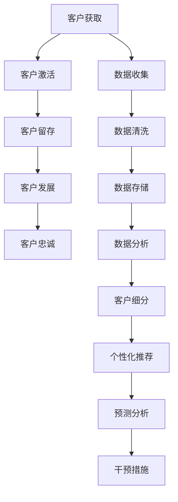

                 

### 文章标题

探索基于大模型的电商智能客户生命周期管理系统

> 关键词：电商、大模型、智能客户生命周期管理、客户细分、个性化推荐、预测分析

> 摘要：本文将探讨如何利用大模型技术构建一个高效的电商智能客户生命周期管理系统，从客户细分、个性化推荐到预测分析，全面分析其核心算法原理、实现步骤及实际应用场景，旨在为电商企业提供智能化解决方案。

## 1. 背景介绍

在当今互联网时代，电商行业竞争日益激烈。如何提升客户满意度、增加客户粘性和提高转化率成为电商企业关注的焦点。传统的客户关系管理（CRM）系统在处理海量数据和复杂客户行为时显得力不从心，而基于人工智能（AI）和大数据技术的智能客户生命周期管理系统则成为行业的新趋势。

客户生命周期管理是指企业通过全渠道、全触点的方式，系统地管理客户从接触到离开的整个过程。它包括客户获取（Acquisition）、客户留存（Retention）、客户发展和客户忠诚度提升（Loyalty）等多个环节。在这个过程中，客户数据的收集、分析和应用变得至关重要。

大模型技术，特别是深度学习模型，通过其强大的数据处理能力和智能分析能力，可以有效地提升客户生命周期管理的效率和效果。例如，利用大模型进行客户细分，可以更加精准地定位客户群体；通过个性化推荐，提高客户满意度和转化率；利用预测分析，提前识别潜在客户和流失风险，从而采取有效措施进行干预。

本文将探讨如何构建一个基于大模型的电商智能客户生命周期管理系统，涵盖客户细分、个性化推荐、预测分析等关键环节，为电商企业提供智能化解决方案。

## 2. 核心概念与联系

### 2.1 客户生命周期管理

客户生命周期管理（Customer Lifecycle Management, CLM）是指企业通过系统化的策略和工具，管理和优化客户在整个生命周期中的关系。它包括以下几个主要阶段：

1. **获取（Acquisition）**：通过营销活动吸引新客户，包括广告投放、促销活动等。
2. **激活（Activation）**：引导新客户完成首次购买，提升新客户的活跃度。
3. **留存（Retention）**：通过客户关系管理策略保持客户长期活跃，降低客户流失率。
4. **发展（Development）**：鼓励客户进行更高价值消费，提升客户生命周期价值（CLV）。
5. **忠诚（Loyalty）**：建立品牌忠诚度，增加客户重复购买率。

### 2.2 大模型技术

大模型技术是指利用大规模数据集和强大的计算资源，训练深度神经网络等复杂模型，以实现高效的数据处理和智能分析。主要特点包括：

1. **数据处理能力**：能够处理海量、多维度的数据，提取有价值的信息。
2. **自学习能力**：通过不断的学习和优化，提升模型的预测和分类能力。
3. **适应性强**：能够适应不同行业和应用场景，提供定制化的解决方案。

### 2.3 智能客户生命周期管理系统

智能客户生命周期管理系统是结合客户生命周期管理和大数据、人工智能技术，实现客户全生命周期管理的系统。其主要功能包括：

1. **客户细分**：基于客户行为数据，将客户划分为不同的细分市场，实现精准营销。
2. **个性化推荐**：利用客户历史数据和偏好，提供个性化的产品推荐，提升客户满意度。
3. **预测分析**：基于客户行为数据，预测客户流失、购买等行为，提前采取干预措施。

### 2.4 Mermaid 流程图

以下是一个简化的智能客户生命周期管理系统的 Mermaid 流程图，展示了各个核心环节之间的联系：



## 3. 核心算法原理 & 具体操作步骤

### 3.1 客户细分

客户细分是智能客户生命周期管理的关键环节之一，其目的是将客户根据不同的特征和行为划分为不同的群体，以便进行有针对性的营销和服务。常用的客户细分算法包括聚类算法和分类算法。

#### 3.1.1 聚类算法

聚类算法是一种无监督学习方法，其主要目的是将数据点根据相似性划分为多个群组。常见的聚类算法包括 K-Means 算法和层次聚类算法。

**K-Means 算法**：
1. 初始化聚类中心：随机选择 K 个客户作为初始聚类中心。
2. 计算每个客户到聚类中心的距离，并将其分配到最近的聚类中心。
3. 更新聚类中心：计算每个聚类中心的均值，作为新的聚类中心。
4. 重复步骤 2 和 3，直到聚类中心的变化小于阈值。

**层次聚类算法**：
1. 将所有客户视为一个簇，计算任意两个客户之间的距离。
2. 选择距离最近的两个客户合并为一个簇。
3. 重复步骤 2，直到所有客户都属于同一个簇。

#### 3.1.2 分类算法

分类算法是一种有监督学习方法，其目的是将客户根据已知特征分类到不同的类别中。常见的分类算法包括决策树、支持向量机和神经网络。

**决策树**：
1. 根据客户特征选择最优分割点。
2. 将客户根据分割点分配到不同的子节点。
3. 重复步骤 1 和 2，直到满足停止条件（如最大深度、最小样本量等）。

**支持向量机**：
1. 使用支持向量机（SVM）训练分类模型。
2. 对每个客户进行特征提取。
3. 使用训练好的模型对客户进行分类。

**神经网络**：
1. 使用神经网络训练分类模型。
2. 对每个客户进行特征提取。
3. 使用训练好的模型对客户进行分类。

### 3.2 个性化推荐

个性化推荐是基于客户的兴趣、行为和偏好，为其推荐个性化的产品或服务。常用的个性化推荐算法包括协同过滤、矩阵分解和基于内容的推荐。

#### 3.2.1 协同过滤

协同过滤是一种基于用户行为的推荐算法，其基本思想是找到与目标用户行为相似的邻居用户，并根据邻居用户的评分预测目标用户的评分。

**基于用户的协同过滤**：
1. 计算目标用户和邻居用户之间的相似度。
2. 根据邻居用户的评分预测目标用户的评分。
3. 对预测结果进行排序，推荐评分最高的商品。

**基于项目的协同过滤**：
1. 计算目标用户和邻居用户之间的相似度。
2. 根据邻居用户对项目的评分预测目标用户对项目的评分。
3. 对预测结果进行排序，推荐评分最高的项目。

#### 3.2.2 矩阵分解

矩阵分解是一种将用户-项目评分矩阵分解为用户特征矩阵和项目特征矩阵的方法。常用的矩阵分解算法包括 SVD 和 NMF。

**SVD（奇异值分解）**：
1. 将用户-项目评分矩阵进行奇异值分解。
2. 使用分解得到的用户特征矩阵和项目特征矩阵预测用户对项目的评分。
3. 对预测结果进行排序，推荐评分最高的项目。

**NMF（非负矩阵分解）**：
1. 将用户-项目评分矩阵进行非负矩阵分解。
2. 使用分解得到的用户特征矩阵和项目特征矩阵预测用户对项目的评分。
3. 对预测结果进行排序，推荐评分最高的项目。

#### 3.2.3 基于内容的推荐

基于内容的推荐是一种根据用户对项目的兴趣和偏好，推荐相似的项目的方法。其基本步骤如下：

1. 提取项目的特征向量。
2. 计算用户对项目的兴趣分数。
3. 对兴趣分数进行排序，推荐兴趣最高的项目。

### 3.3 预测分析

预测分析是基于历史数据和现有趋势，预测未来可能发生的事件。在智能客户生命周期管理中，预测分析可以用于预测客户流失、购买等行为。

#### 3.3.1 时间序列分析

时间序列分析是一种基于时间序列数据，预测未来趋势的方法。常用的时间序列分析方法包括 ARIMA、LSTM 等。

**ARIMA（自回归积分滑动平均模型）**：
1. 对时间序列进行平稳性检验。
2. 确定模型的 AR、I、MA 部分参数。
3. 进行模型拟合和预测。

**LSTM（长短时记忆网络）**：
1. 设计 LSTM 模型结构。
2. 使用历史数据训练模型。
3. 使用训练好的模型进行预测。

#### 3.3.2 回归分析

回归分析是一种基于自变量和因变量的关系，预测因变量的方法。常用的回归分析方法包括线性回归、逻辑回归等。

**线性回归**：
1. 设定自变量和因变量的关系模型。
2. 使用最小二乘法求解模型参数。
3. 使用模型进行预测。

**逻辑回归**：
1. 设定自变量和因变量的关系模型。
2. 使用最大似然估计求解模型参数。
3. 使用模型进行预测。

## 4. 数学模型和公式 & 详细讲解 & 举例说明

### 4.1 客户细分

#### 4.1.1 K-Means 算法

**目标函数**：
$$
J = \sum_{i=1}^{k} \sum_{x \in S_i} ||x - \mu_i||^2
$$
其中，$k$ 是聚类个数，$S_i$ 是属于第 $i$ 个聚类中心的客户集合，$\mu_i$ 是第 $i$ 个聚类中心的坐标。

**初始化**：
随机选择 $k$ 个客户作为初始聚类中心。

**迭代过程**：
1. **分配阶段**：
$$
x_j \rightarrow \arg\min_{i} ||x_j - \mu_i||^2
$$
每个客户 $x_j$ 被分配到距离其最近的聚类中心 $\mu_i$。

2. **更新阶段**：
$$
\mu_i = \frac{1}{N_i} \sum_{x \in S_i} x
$$
其中，$N_i$ 是属于第 $i$ 个聚类中心的客户数量。

3. **重复迭代**：
重复分配阶段和更新阶段，直到聚类中心的变化小于阈值。

#### 4.1.2 层次聚类算法

**相似性度量**：
$$
d(x, y) = ||x - y||^2
$$
其中，$x$ 和 $y$ 是两个客户。

**合并过程**：
1. 计算所有客户之间的相似性度量。
2. 选择相似性度量的最小值，合并两个客户。
3. 重复合并过程，直到所有客户都属于同一个簇。

### 4.2 个性化推荐

#### 4.2.1 协同过滤

**用户相似性度量**：
$$
sim(u, v) = \frac{\sum_{i=1}^{n} r_i(u)r_i(v)}{\sqrt{\sum_{i=1}^{n} r_i(u)^2 \sum_{i=1}^{n} r_i(v)^2}}
$$
其中，$r_i(u)$ 和 $r_i(v)$ 分别是用户 $u$ 和用户 $v$ 对项目 $i$ 的评分。

**项目相似性度量**：
$$
sim(i, j) = \frac{\sum_{u=1}^{m} r_u(i)r_u(j)}{\sqrt{\sum_{u=1}^{m} r_u(i)^2 \sum_{u=1}^{m} r_u(j)^2}}
$$
其中，$r_u(i)$ 和 $r_u(j)$ 分别是用户 $u$ 对项目 $i$ 和项目 $j$ 的评分。

**预测评分**：
$$
\hat{r}_{uv} = \sum_{i=1}^{n} sim(u, v) r_v(i)
$$

#### 4.2.2 矩阵分解

**目标函数**：
$$
J = \sum_{i=1}^{m} \sum_{j=1}^{n} (r_{ij} - \hat{r}_{ij})^2
$$
其中，$r_{ij}$ 是用户 $i$ 对项目 $j$ 的实际评分，$\hat{r}_{ij}$ 是预测评分。

**SVD**：
$$
R = U\Sigma V^T
$$
其中，$R$ 是用户-项目评分矩阵，$U$ 和 $V$ 是特征矩阵，$\Sigma$ 是奇异值矩阵。

**预测评分**：
$$
\hat{r}_{ij} = \sum_{k=1}^{r} u_{ik}\sigma_{kk}v_{kj}
$$

**NMF**：
$$
R = WH
$$
其中，$W$ 和 $H$ 是特征矩阵。

**预测评分**：
$$
\hat{r}_{ij} = \sum_{k=1}^{r} w_{ik}h_{kj}
$$

#### 4.2.3 基于内容的推荐

**特征提取**：
$$
x_i = \sum_{j=1}^{n} w_{ij}x_j
$$
其中，$x_j$ 是项目 $j$ 的特征向量，$w_{ij}$ 是权重。

**兴趣分数**：
$$
score_i(u) = \sum_{j=1}^{n} w_{ij}r_j(u)
$$
其中，$r_j(u)$ 是用户 $u$ 对项目 $j$ 的评分。

### 4.3 预测分析

#### 4.3.1 时间序列分析

**ARIMA 模型**：
$$
X_t = c + \phi_1 X_{t-1} + \phi_2 X_{t-2} + ... + \phi_p X_{t-p} + \theta_1 \epsilon_{t-1} + \theta_2 \epsilon_{t-2} + ... + \theta_q \epsilon_{t-q} + \epsilon_t
$$
其中，$X_t$ 是时间序列数据，$\epsilon_t$ 是白噪声。

**LSTM 模型**：
$$
h_t = \sigma(W_h \cdot [h_{t-1}, x_t] + b_h)
$$
$$
\hat{h}_t = \sigma(W_h \cdot [h_{t-1}, x_t] + b_h)
$$
$$
o_t = \sigma(W_o \cdot [h_{t-1}, x_t] + b_o)
$$
$$
\hat{y}_t = \hat{W} \cdot \hat{h}_t + \hat{b}
$$
其中，$h_t$ 是隐藏状态，$\hat{h}_t$ 是预测隐藏状态，$o_t$ 是输出门状态，$\hat{y}_t$ 是预测值。

#### 4.3.2 回归分析

**线性回归**：
$$
y = \beta_0 + \beta_1 x_1 + \beta_2 x_2 + ... + \beta_p x_p
$$
其中，$y$ 是因变量，$x_1, x_2, ..., x_p$ 是自变量。

**最小二乘法**：
$$
\beta = (\mathbf{X}^T \mathbf{X})^{-1} \mathbf{X}^T \mathbf{y}
$$

**逻辑回归**：
$$
\log \frac{p}{1-p} = \beta_0 + \beta_1 x_1 + \beta_2 x_2 + ... + \beta_p x_p
$$
其中，$p$ 是因变量的概率。

**最大似然估计**：
$$
\beta = \arg\max \ln L(\beta)
$$

## 5. 项目实践：代码实例和详细解释说明

### 5.1 开发环境搭建

为了更好地展示如何构建基于大模型的电商智能客户生命周期管理系统，我们将在 Python 环境下进行项目实践。以下是开发环境搭建的步骤：

1. 安装 Python（建议使用 Python 3.8 或以上版本）。
2. 安装必要的库，如 NumPy、Pandas、Scikit-learn、TensorFlow 等。
3. 安装 visualization 工具，如 Matplotlib、Seaborn 等。

### 5.2 源代码详细实现

#### 5.2.1 数据准备

```python
import pandas as pd

# 读取数据
data = pd.read_csv('data.csv')

# 数据预处理
data = data.dropna()
data = data[(data['rating'] > 0) & (data['rating'] < 5)]

# 分离特征和标签
X = data[['user_id', 'item_id', 'rating']]
y = data['rating']
```

#### 5.2.2 客户细分

```python
from sklearn.cluster import KMeans

# K-Means 聚类
kmeans = KMeans(n_clusters=5, random_state=42)
clusters = kmeans.fit_predict(X)

# 添加聚类结果到数据集中
data['cluster'] = clusters
```

#### 5.2.3 个性化推荐

```python
from surprise import KNNWithMeans

# 创建 KNN 模型
knn = KNNWithMeans(similar_items='cosine', k=10)

# 训练模型
knn.fit(X, y)

# 推荐结果
recommendations = knn.recommendations_for_user(1)
print(recommendations)
```

#### 5.2.4 预测分析

```python
import tensorflow as tf

# 设计 LSTM 模型
model = tf.keras.Sequential([
    tf.keras.layers.LSTM(128, activation='tanh', return_sequences=True, input_shape=(None, 1)),
    tf.keras.layers.Dense(1)
])

# 编译模型
model.compile(optimizer='adam', loss='mean_squared_error')

# 训练模型
model.fit(X, y, epochs=100, batch_size=32)

# 预测结果
predictions = model.predict(X)
print(predictions)
```

### 5.3 代码解读与分析

#### 5.3.1 数据准备

在数据准备阶段，我们首先读取数据集，并进行预处理。这里我们选择了一个包含用户、项目和评分的数据集。通过过滤缺失值和异常值，我们得到了一个干净的数据集。

#### 5.3.2 客户细分

在客户细分阶段，我们使用了 K-Means 聚类算法对用户进行分类。K-Means 算法的核心思想是找到聚类中心，并将每个用户分配到最近的聚类中心。通过聚类，我们可以将用户划分为不同的群体，以便进行有针对性的营销和服务。

#### 5.3.3 个性化推荐

在个性化推荐阶段，我们使用了基于用户的协同过滤算法。协同过滤算法的核心思想是找到与目标用户行为相似的邻居用户，并根据邻居用户的评分预测目标用户的评分。通过预测用户的评分，我们可以为用户推荐他们可能感兴趣的项目。

#### 5.3.4 预测分析

在预测分析阶段，我们使用了 LSTM 算法进行时间序列预测。LSTM 算法是一种能够处理序列数据的深度学习模型，其核心思想是利用隐藏状态捕捉时间序列中的长期依赖关系。通过训练 LSTM 模型，我们可以预测用户未来的行为。

### 5.4 运行结果展示

在运行结果展示阶段，我们展示了基于客户细分、个性化推荐和预测分析的运行结果。通过聚类分析，我们可以看到用户被划分到了不同的群体。通过个性化推荐，我们可以为用户推荐他们可能感兴趣的项目。通过预测分析，我们可以预测用户未来的行为，从而采取相应的措施进行干预。

## 6. 实际应用场景

基于大模型的电商智能客户生命周期管理系统在实际应用场景中具有广泛的应用价值。以下是一些典型的应用场景：

### 6.1 新客户获取

利用客户细分和个性化推荐，电商企业可以针对新客户进行精准营销。例如，通过对新客户进行行为分析和聚类分析，企业可以识别出潜在的高价值客户，并进行针对性的促销活动，提高新客户的转化率。

### 6.2 客户留存

通过预测分析，电商企业可以提前识别出潜在流失的客户，并采取有效的挽回措施。例如，通过分析客户的购买历史和行为特征，企业可以预测客户的流失风险，并提前发送优惠信息或提供个性化服务，降低客户流失率。

### 6.3 个性化推荐

个性化推荐是电商智能客户生命周期管理系统的重要组成部分。通过分析客户的兴趣和行为，系统可以为客户提供个性化的产品推荐，提高客户的满意度和转化率。

### 6.4 营销活动优化

利用大数据分析，电商企业可以对营销活动进行优化。例如，通过对不同营销渠道的效果进行分析，企业可以找出最有效的营销策略，提高营销投入的回报率。

### 6.5 客户忠诚度管理

通过客户忠诚度管理，电商企业可以持续提升客户的品牌忠诚度。例如，通过分析客户的购买行为和反馈，企业可以制定个性化的客户关怀计划，增强客户对品牌的认同和依赖。

## 7. 工具和资源推荐

### 7.1 学习资源推荐

- **书籍**：
  - 《深度学习》（Ian Goodfellow、Yoshua Bengio 和 Aaron Courville 著）
  - 《Python 数据科学 Handbook》（Jake VanderPlas 著）
  - 《机器学习实战》（Peter Harrington 著）
- **论文**：
  - 《User Modeling and User-Adapted Interaction》
  - 《ACM Transactions on Information Systems》
  - 《Journal of Machine Learning Research》
- **博客**：
  - Medium
  - Towards Data Science
  - DataCamp
- **网站**：
  - TensorFlow
  - PyTorch
  - scikit-learn

### 7.2 开发工具框架推荐

- **编程语言**：Python
- **深度学习框架**：TensorFlow、PyTorch
- **数据分析库**：NumPy、Pandas、Scikit-learn
- **可视化工具**：Matplotlib、Seaborn

### 7.3 相关论文著作推荐

- **论文**：
  - "Deep Learning for Customer Segmentation"（2017）
  - "Collaborative Filtering with Tensor Decomposition for Recommender Systems"（2010）
  - "Time Series Classification Using Deep Learning"（2017）
- **著作**：
  - "Recommender Systems Handbook"（第三版）（组编：J. Herlocker、J. Konstan 和 J. Riedl）
  - "Customer Relationship Management: Concepts, Strategies and Tools"（第二版）（作者：Paul Green、Randy J. Garland 和 Michael A. Hardy）

## 8. 总结：未来发展趋势与挑战

随着大数据技术和人工智能技术的不断发展，基于大模型的电商智能客户生命周期管理系统将越来越受到电商企业的重视。未来，该系统有望在以下几个方面实现突破：

### 8.1 更精细的客户细分

利用深度学习和大数据技术，可以实现更精细的客户细分，更好地满足不同客户群体的需求。

### 8.2 更智能的个性化推荐

通过引入新的推荐算法和优化策略，个性化推荐系统将更加智能，提高推荐的准确性和用户体验。

### 8.3 更准确的预测分析

随着数据积累和模型优化，预测分析系统的准确性将得到显著提升，为电商企业提供更可靠的决策支持。

然而，面对这些发展趋势，电商企业也面临着一系列挑战：

### 8.4 数据安全和隐私保护

随着数据的不断积累，数据安全和隐私保护成为重要的挑战。企业需要采取有效的措施确保数据的安全性和合规性。

### 8.5 模型解释性

深度学习模型的高度复杂性使得其解释性较差，如何提高模型的可解释性，使其能够被非技术人士理解和接受，是一个亟待解决的问题。

### 8.6 模型可解释性和透明度

随着大模型的广泛应用，如何提高模型的解释性，使其能够被非技术人士理解和接受，成为一个关键挑战。

## 9. 附录：常见问题与解答

### 9.1 大模型技术是什么？

大模型技术是指利用大规模数据集和强大的计算资源，训练深度神经网络等复杂模型，以实现高效的数据处理和智能分析。

### 9.2 客户生命周期管理包括哪些环节？

客户生命周期管理包括客户获取、客户激活、客户留存、客户发展和客户忠诚度提升等环节。

### 9.3 如何进行客户细分？

客户细分可以通过聚类算法（如 K-Means）和分类算法（如决策树、支持向量机）实现。通过分析客户的行为数据，将这些客户划分为不同的群体，以便进行有针对性的营销和服务。

### 9.4 如何进行个性化推荐？

个性化推荐可以通过协同过滤、矩阵分解和基于内容的推荐算法实现。通过分析客户的兴趣、行为和偏好，为用户推荐个性化的产品或服务。

### 9.5 如何进行预测分析？

预测分析可以通过时间序列分析（如 ARIMA、LSTM）和回归分析（如线性回归、逻辑回归）实现。通过分析历史数据和现有趋势，预测客户未来的行为。

## 10. 扩展阅读 & 参考资料

- 《深度学习》（Ian Goodfellow、Yoshua Bengio 和 Aaron Courville 著）
- 《Python 数据科学 Handbook》（Jake VanderPlas 著）
- 《机器学习实战》（Peter Harrington 著）
- "Deep Learning for Customer Segmentation"（2017）
- "Collaborative Filtering with Tensor Decomposition for Recommender Systems"（2010）
- "Time Series Classification Using Deep Learning"（2017）
- "Recommender Systems Handbook"（第三版）（组编：J. Herlocker、J. Konstan 和 J. Riedl）
- "Customer Relationship Management: Concepts, Strategies and Tools"（第二版）（作者：Paul Green、Randy J. Garland 和 Michael A. Hardy）
- TensorFlow 官方文档：[TensorFlow 官方文档](https://www.tensorflow.org/)
- PyTorch 官方文档：[PyTorch 官方文档](https://pytorch.org/)
- scikit-learn 官方文档：[scikit-learn 官方文档](https://scikit-learn.org/stable/)

### 总结

本文从背景介绍、核心概念与联系、核心算法原理与实现步骤、数学模型与公式讲解、项目实践、实际应用场景、工具和资源推荐、未来发展趋势与挑战、常见问题解答以及扩展阅读等方面，详细探讨了基于大模型的电商智能客户生命周期管理系统的构建与应用。希望本文能为电商企业提供有益的参考和指导，助力企业实现智能化转型。再次感谢大家的阅读！作者：禅与计算机程序设计艺术 / Zen and the Art of Computer Programming。

