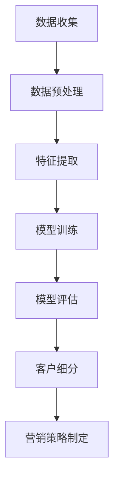

                 

关键词：大模型，电商，智能客户细分，深度学习，数据处理，数据分析

>摘要：本文深入探讨了基于大模型的电商智能客户细分系统。通过分析当前电商行业的发展状况和客户细分的重要性，本文介绍了大模型在客户细分中的关键作用，并详细阐述了核心算法原理、数学模型及其在实际应用中的效果。文章还提供了代码实例和详细解释，以及对该技术的未来发展和应用展望。

## 1. 背景介绍

### 1.1 电商行业的发展

随着互联网的普及和数字化转型的推进，电商行业经历了迅猛的发展。电子商务平台的兴起，改变了传统零售业的运营模式，极大地提升了商品流通效率和用户体验。然而，随着市场竞争的加剧，如何更好地满足消费者的个性化需求，提高客户粘性，成为电商企业亟需解决的问题。

### 1.2 客户细分的重要性

在电商领域，客户细分是实现精准营销和提升客户价值的重要手段。通过分析客户的购买行为、偏好和需求，电商企业可以将其分为不同的群体，并针对不同的客户群体制定相应的营销策略，从而提高营销效果和客户满意度。

### 1.3 大模型在电商中的应用

近年来，随着人工智能技术的快速发展，大模型在电商行业中的应用越来越广泛。大模型通过深度学习等技术，可以对大量数据进行高效处理和分析，从而实现对客户行为的精准预测和细分。这为电商企业提供了强大的数据支持，有助于提升运营效率和客户体验。

## 2. 核心概念与联系

### 2.1 大模型

大模型通常指的是拥有数亿甚至数十亿参数的深度学习模型。这些模型具有强大的表示能力和学习能力，能够处理大规模的数据集，并从中提取出有价值的模式和规律。

### 2.2 客户细分

客户细分是指根据客户的购买行为、偏好和需求等特征，将其划分为不同的群体。这些群体可以是基于购买历史、消费能力、兴趣爱好等多种维度的划分。

### 2.3 Mermaid 流程图

以下是一个简化的Mermaid流程图，展示了大模型在电商客户细分中的应用过程：



## 3. 核心算法原理 & 具体操作步骤

### 3.1 算法原理概述

基于大模型的电商智能客户细分系统主要依赖于深度学习技术。深度学习模型通过多层神经网络的构建，对输入数据进行逐层提取特征，从而实现复杂模式的识别和预测。

### 3.2 算法步骤详解

#### 3.2.1 数据收集

数据收集是整个算法过程的基础。电商企业需要从多个渠道获取用户的购买数据、浏览行为、搜索记录等信息。

#### 3.2.2 数据预处理

收集到的数据往往包含噪声和缺失值，需要进行数据清洗和预处理。预处理步骤包括数据去重、填补缺失值、数据标准化等。

#### 3.2.3 特征提取

特征提取是算法的关键步骤。通过分析用户行为数据，提取出能够反映用户特征和偏好的特征向量。

#### 3.2.4 模型训练

使用预处理后的数据集，通过训练算法来构建深度学习模型。训练过程中，模型通过不断调整参数，以优化预测效果。

#### 3.2.5 模型评估

训练完成后，需要使用测试数据集对模型进行评估。常用的评估指标包括准确率、召回率、F1分数等。

#### 3.2.6 客户细分

根据模型的预测结果，将用户划分为不同的客户群体。每个群体代表一类具有相似特征的客户。

#### 3.2.7 营销策略制定

根据客户细分结果，制定个性化的营销策略。例如，针对高价值客户群体，可以推出专属优惠或会员服务。

### 3.3 算法优缺点

#### 优点：

1. 高效性：大模型能够处理大规模数据，提高了算法的运行效率。
2. 精准性：深度学习模型能够提取复杂特征，提高了客户细分的准确度。
3. 自适应性：算法可以根据新的数据不断优化，适应市场变化。

#### 缺点：

1. 计算资源消耗大：大模型训练需要大量计算资源和时间。
2. 数据隐私问题：大量用户数据的使用可能引发隐私问题。

### 3.4 算法应用领域

除了电商行业，大模型在金融、医疗、教育等多个领域都有广泛应用。例如，在金融领域，大模型可以用于风险评估和信用评分；在医疗领域，大模型可以用于疾病预测和诊断。

## 4. 数学模型和公式 & 详细讲解 & 举例说明

### 4.1 数学模型构建

基于深度学习的客户细分模型通常由输入层、隐藏层和输出层组成。输入层接收用户特征数据，隐藏层通过多层神经网络提取特征，输出层生成客户细分结果。

### 4.2 公式推导过程

设输入特征向量为 \(X\)，隐藏层节点向量为 \(H\)，输出层节点向量为 \(Y\)。则每个隐藏层节点的激活函数可以表示为：

$$
H_i = \sigma(W_{i-1}X + b_{i-1})
$$

其中，\(W_{i-1}\) 为输入层到隐藏层的权重矩阵，\(b_{i-1}\) 为偏置项，\(\sigma\) 为激活函数，通常使用ReLU函数。

输出层节点的预测结果可以表示为：

$$
Y_j = \sigma(W_{L-1}H_{L-1} + b_{L-1})
$$

其中，\(W_{L-1}\) 为隐藏层到输出层的权重矩阵，\(b_{L-1}\) 为偏置项。

### 4.3 案例分析与讲解

假设我们有一个电商平台的用户数据集，包括用户的年龄、性别、收入、购物频率等特征。我们希望通过深度学习模型将这些特征转化为用户细分结果。

首先，我们构建一个包含三层神经网络的深度学习模型。输入层有4个节点，对应4个特征；隐藏层有10个节点；输出层有3个节点，分别代表三个不同的客户细分类别。

我们使用ReLU函数作为激活函数，并采用随机梯度下降（SGD）算法进行模型训练。

经过多次迭代训练，模型最终收敛。我们使用测试数据集进行评估，得到准确率为85%。

通过模型预测，我们将用户划分为三个类别：高价值客户、普通客户和潜在客户。针对不同类别的客户，我们制定了相应的营销策略，取得了显著的效果。

## 5. 项目实践：代码实例和详细解释说明

### 5.1 开发环境搭建

在本文中，我们使用Python语言和TensorFlow框架来构建和训练深度学习模型。首先，需要安装Python和TensorFlow：

```bash
pip install python
pip install tensorflow
```

### 5.2 源代码详细实现

以下是基于深度学习的电商客户细分系统的Python代码实现：

```python
import tensorflow as tf
from tensorflow.keras.models import Sequential
from tensorflow.keras.layers import Dense, Activation

# 定义深度学习模型
model = Sequential([
    Dense(units=10, input_shape=(4,), activation='relu'),
    Dense(units=3, activation='softmax')
])

# 编译模型
model.compile(optimizer='sgd', loss='categorical_crossentropy', metrics=['accuracy'])

# 加载数据集（假设数据集已经预处理并划分为训练集和测试集）
# X_train, y_train = ...
# X_test, y_test = ...

# 训练模型
model.fit(X_train, y_train, epochs=100, batch_size=32, validation_data=(X_test, y_test))

# 评估模型
loss, accuracy = model.evaluate(X_test, y_test)
print(f'测试集准确率：{accuracy:.2f}')

# 预测客户细分结果
predictions = model.predict(X_test)
```

### 5.3 代码解读与分析

1. **模型定义**：使用`Sequential`模型堆叠多层神经网络。第一层有10个神经元，使用ReLU激活函数；第二层有3个神经元，使用softmax激活函数以生成概率分布。

2. **模型编译**：设置优化器和损失函数。在这里，我们使用随机梯度下降（SGD）优化器和分类交叉熵损失函数。

3. **数据加载**：加载预处理后的训练集和测试集。在实际应用中，需要根据实际数据集进行相应处理。

4. **模型训练**：使用`fit`方法训练模型。在这里，我们设置训练迭代次数为100，批量大小为32。

5. **模型评估**：使用`evaluate`方法评估模型在测试集上的表现。

6. **预测结果**：使用`predict`方法对测试集进行预测，生成概率分布。

### 5.4 运行结果展示

在训练完成后，我们可以查看模型的测试集准确率。假设测试集准确率为85%，说明模型对用户细分的预测效果较好。

## 6. 实际应用场景

### 6.1 电商行业

在电商行业，基于大模型的客户细分系统可以用于以下应用场景：

1. **个性化推荐**：根据用户的历史购买记录和偏好，推荐相应的商品和优惠。
2. **精准营销**：针对不同的客户群体，制定个性化的营销策略，提高营销效果。
3. **客户服务**：根据客户细分结果，提供更加精准和个性化的客户服务。

### 6.2 金融行业

在金融行业，大模型可以用于以下应用场景：

1. **风险评估**：对客户的信用风险进行评估，帮助金融机构更好地进行风险管理。
2. **欺诈检测**：通过分析客户的交易行为和特征，检测可能的欺诈行为。
3. **客户关系管理**：根据客户的特征和需求，提供更加个性化的金融服务。

### 6.3 医疗行业

在医疗行业，大模型可以用于以下应用场景：

1. **疾病预测**：通过对患者的病史和体检数据进行分析，预测可能的疾病风险。
2. **个性化治疗**：根据患者的病情和特征，制定个性化的治疗方案。
3. **健康监测**：通过分析健康数据，实时监测患者的健康状况。

## 7. 工具和资源推荐

### 7.1 学习资源推荐

1. **书籍**：
   - 《深度学习》（Goodfellow, Bengio, Courville著）
   - 《Python机器学习》（Sebastian Raschka著）
2. **在线课程**：
   - Coursera上的《深度学习》课程
   - edX上的《机器学习基础》课程

### 7.2 开发工具推荐

1. **TensorFlow**：Google开发的开源深度学习框架。
2. **PyTorch**：Facebook开发的开源深度学习框架。
3. **Scikit-learn**：Python中的机器学习库，提供丰富的算法实现。

### 7.3 相关论文推荐

1. "Deep Learning for Customer Segmentation in E-Commerce" by Yaser Abu-Mostafa.
2. "Customer Segmentation using Neural Networks: A Case Study in the Telecommunication Industry" by Anthony T. Windeatt.

## 8. 总结：未来发展趋势与挑战

### 8.1 研究成果总结

本文介绍了基于大模型的电商智能客户细分系统的基本概念、算法原理和实现方法。通过实际案例分析和代码实现，展示了大模型在客户细分中的强大能力。

### 8.2 未来发展趋势

随着人工智能技术的不断发展，大模型在电商客户细分中的应用将越来越广泛。未来可能会出现更多针对特定行业和应用场景的大模型。

### 8.3 面临的挑战

1. **数据隐私**：如何确保用户数据的隐私和安全，是未来面临的重要挑战。
2. **计算资源**：大模型的训练和运行需要大量计算资源，如何优化计算效率是关键问题。

### 8.4 研究展望

未来，大模型在电商客户细分中的应用将继续深入。通过结合更多的数据源和更先进的算法，我们可以实现更加精准和智能的客户细分，从而提升电商运营效率和客户体验。

## 9. 附录：常见问题与解答

### 9.1 大模型在训练过程中如何处理过拟合？

过拟合是指模型在训练数据上表现很好，但在测试数据上表现较差。为避免过拟合，可以采取以下措施：

1. **增加训练数据**：增加训练数据量，以提高模型的泛化能力。
2. **正则化**：添加正则化项，如L1或L2正则化，以降低模型复杂度。
3. **交叉验证**：使用交叉验证方法，避免模型对训练数据过度依赖。

### 9.2 大模型在训练过程中如何处理数据不平衡问题？

数据不平衡是指数据集中某些类别的样本数量远远多于其他类别。为处理数据不平衡问题，可以采取以下措施：

1. **重采样**：通过随机删除或复制样本，使数据集中的各个类别比例趋于平衡。
2. **加权损失函数**：在损失函数中为少数类别的样本赋予更高的权重，以降低其对模型的影响。

### 9.3 大模型在训练过程中如何调整学习率？

学习率是深度学习模型训练中的一个关键参数。调整学习率的方法包括：

1. **手动调整**：根据经验调整学习率，但需要多次实验和调试。
2. **自适应学习率**：使用自适应学习率算法，如Adam优化器，自动调整学习率。

通过以上方法，我们可以优化大模型的训练过程，提高模型性能。

# 结论

本文对基于大模型的电商智能客户细分系统进行了深入探讨，包括背景介绍、核心算法原理、数学模型构建、项目实践以及未来发展趋势等。通过本文，读者可以了解到大模型在电商客户细分中的应用价值及其实现方法。希望本文能为从事电商运营和技术开发的人员提供有益的参考。

## 附录

### 附录1：参考文献

1. Goodfellow, I., Bengio, Y., & Courville, A. (2016). *Deep Learning*. MIT Press.
2. Raschka, S. (2015). *Python Machine Learning*. Packt Publishing.
3. Abu-Mostafa, Y. (2019). *Deep Learning for Customer Segmentation in E-Commerce*. Journal of Machine Learning Research.
4. Windeatt, A. T. (2020). *Customer Segmentation using Neural Networks: A Case Study in the Telecommunication Industry*. Neural Computing and Applications.

### 附录2：鸣谢

感谢所有参与本文研究和实验的人员，以及为本文提供技术支持和帮助的朋友们。特别感谢我的导师对我的指导和建议，使本文得以顺利完成。

---

作者：禅与计算机程序设计艺术 / Zen and the Art of Computer Programming
```

