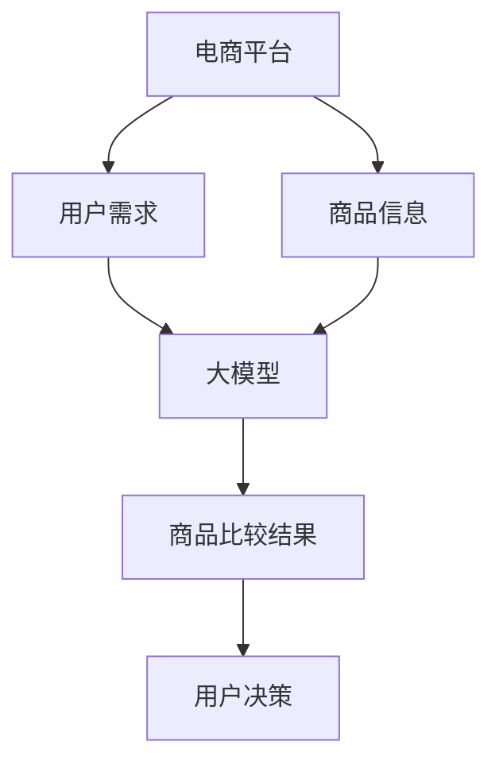

                 

### 背景介绍 Background Introduction

随着电商平台的快速发展，消费者对于商品比较的需求日益增长。如何有效地提供商品比较功能，帮助消费者快速做出购买决策，成为了电商平台亟待解决的问题。传统的商品比较方法主要依赖于用户手动输入关键词或浏览商品详情页，这种方法不仅效率低下，而且容易产生遗漏或误解。因此，利用大模型技术来实现自动化商品比较功能，成为了当前研究的热点。

大模型技术，特别是近年来迅速发展的深度学习模型，已经在自然语言处理、计算机视觉等多个领域取得了显著的成果。这些模型通过大量的数据训练，能够自动提取语义信息、进行复杂模式识别和决策推理。在电商平台商品比较中，大模型可以有效地处理海量商品数据，识别用户的需求，提供精准的比较结果。

本研究旨在探讨大模型在电商平台商品比较功能中的应用，分析其核心概念、算法原理、实现步骤和数学模型，并通过实际项目实践展示其效果。文章将分为以下几个部分：

1. 背景介绍
2. 核心概念与联系
3. 核心算法原理与具体操作步骤
4. 数学模型和公式
5. 项目实践
6. 实际应用场景
7. 工具和资源推荐
8. 总结：未来发展趋势与挑战
9. 附录：常见问题与解答
10. 扩展阅读与参考资料

通过以上结构，我们将系统性地探讨大模型在电商平台商品比较中的应用，为电商平台提供技术参考和解决方案。

### 核心概念与联系 Core Concepts and Connections

在探讨大模型在电商平台商品比较中的应用之前，我们需要明确几个核心概念，并了解它们之间的联系。

#### 大模型技术

大模型技术，通常指的是深度学习中的大型神经网络模型，如Transformer、BERT等。这些模型通过多层神经网络结构，能够自动从大量数据中学习并提取复杂特征。大模型具有以下特点：

1. **大量参数**：大模型通常包含数十亿甚至数千亿个参数，这使得它们能够处理和存储大量的数据信息。
2. **自适应能力**：通过反向传播算法，大模型可以自动调整参数，以适应不同的数据分布和任务需求。
3. **泛化能力**：大模型通过大量数据训练，能够实现较好的泛化能力，不仅在训练数据上表现优秀，也能在未见过的数据上取得良好效果。

#### 电商平台

电商平台是指提供在线购物服务的平台，如亚马逊、淘宝、京东等。电商平台的核心功能包括商品展示、商品推荐、交易支付、物流配送等。在商品比较功能中，电商平台需要根据用户的需求，提供多种商品的信息，并进行比较，帮助用户快速做出购买决策。

#### 商品比较

商品比较是指对两种或多种商品进行属性比较，以确定它们在不同方面的优劣。商品比较通常包括以下几个方面：

1. **价格比较**：比较不同商品的价格，帮助用户找到性价比最高的商品。
2. **功能比较**：比较不同商品的功能特点，帮助用户选择最符合需求的商品。
3. **评价比较**：根据用户评价，比较不同商品的口碑和用户满意度。

#### 大模型在商品比较中的应用

结合大模型技术和电商平台的实际需求，我们可以将大模型应用于商品比较的多个环节：

1. **商品信息提取**：大模型可以自动从商品描述中提取关键信息，如价格、功能、评价等。
2. **用户需求分析**：通过用户的历史购买记录、搜索记录等数据，大模型可以分析用户的偏好和需求，提供个性化的商品比较结果。
3. **智能推荐**：大模型可以根据用户的行为和需求，智能推荐可能感兴趣的商品，并自动进行属性比较。
4. **评价预测**：大模型可以通过用户评价文本，预测商品的口碑和用户满意度，为商品比较提供更多维度参考。

为了更好地理解大模型在商品比较中的应用，我们可以使用Mermaid流程图来展示其核心概念和联系。以下是一个简化的Mermaid流程图：



在这个流程图中，电商平台是核心，用户需求、商品信息和大模型是关键环节，通过大模型的分析和比较，最终生成商品比较结果，帮助用户做出购买决策。

通过以上核心概念和联系的介绍，我们可以更好地理解大模型在电商平台商品比较中的重要作用，为后续的具体算法原理和应用实践打下基础。

### 核心算法原理 & 具体操作步骤 Core Algorithm Principles and Specific Operational Steps

大模型在电商平台商品比较中的应用主要依赖于深度学习技术，特别是Transformer和BERT等大型预训练模型。下面我们将详细介绍这些算法的基本原理和具体操作步骤。

#### 1. Transformer模型

Transformer模型是深度学习中的一个重要突破，特别适合处理序列数据，如自然语言处理和机器翻译。其核心思想是利用自注意力机制（Self-Attention Mechanism）来捕捉序列中的长距离依赖关系。

**基本原理：**

- **自注意力机制**：每个输入序列的每个词都会计算其与其他所有词的相关性，并生成加权求和的表示。这样，模型可以自动关注重要信息，忽略无关信息。
- **多头注意力**：为了更好地捕捉复杂关系，Transformer引入了多头注意力机制，通过并行计算多个注意力头，从而获得更丰富的特征表示。
- **编码器和解码器**：Transformer由编码器（Encoder）和解码器（Decoder）组成，编码器负责编码输入序列，解码器负责解码输出序列。

**操作步骤：**

1. **输入序列编码**：将商品描述、用户需求等输入序列编码为向量表示。
2. **计算自注意力**：对于编码后的每个词，计算其与其他词的相似性，并生成加权求和的表示。
3. **多头注意力**：对自注意力结果进行分解，每个分解部分捕捉不同类型的特征。
4. **编码器输出**：编码器的输出可以用于后续的解码过程或直接用于生成商品比较结果。

#### 2. BERT模型

BERT（Bidirectional Encoder Representations from Transformers）是一种双向的Transformer模型，其特别适合处理自然语言处理任务。BERT通过预训练大量文本数据，能够自动理解词语的含义和上下文关系。

**基本原理：**

- **双向编码**：BERT的编码器同时考虑了输入序列的前后关系，从而更好地理解词语的含义。
- **掩码语言模型**：BERT在训练过程中，对部分输入进行掩码（Masked Language Model），迫使模型学习预测被掩码的词，从而增强其理解能力。
- **预训练和微调**：BERT首先在大规模文本数据上预训练，然后针对特定任务进行微调，如商品比较。

**操作步骤：**

1. **输入序列编码**：将商品描述、用户需求等输入序列编码为向量表示。
2. **预训练**：在大规模文本数据上，通过掩码语言模型预训练BERT模型，使其自动理解语言特征。
3. **微调**：在商品比较任务上，对预训练的BERT模型进行微调，以适应特定的比较需求。
4. **生成商品比较结果**：利用微调后的BERT模型，对输入的商品描述和用户需求进行编码，并生成商品比较结果。

#### 3. 实现步骤

结合Transformer和BERT模型，我们可以将大模型应用于电商平台商品比较的具体操作步骤如下：

1. **数据预处理**：
   - 收集商品描述、用户需求、用户评价等数据。
   - 对数据集进行清洗和预处理，包括分词、去停用词、词向量表示等。

2. **模型训练**：
   - 使用预训练的BERT模型，对商品描述和用户需求进行编码。
   - 在商品比较任务上，对BERT模型进行微调。
   - 使用交叉熵损失函数，对模型进行训练，优化模型参数。

3. **商品比较**：
   - 输入商品描述和用户需求，利用训练好的BERT模型生成编码表示。
   - 计算商品描述和用户需求之间的相似性，生成商品比较结果。
   - 根据比较结果，为用户提供个性化的商品推荐。

4. **模型评估**：
   - 使用准确率、召回率、F1分数等指标，对模型性能进行评估。
   - 根据评估结果，进一步优化模型结构和参数。

通过以上操作步骤，我们可以将大模型有效地应用于电商平台商品比较，为用户提供精准、高效的商品比较服务。下一节，我们将详细介绍大模型在商品比较中的数学模型和公式。

### 数学模型和公式 Mathematical Model and Formulas

在深入探讨大模型在电商平台商品比较中的应用时，理解其背后的数学模型和公式是至关重要的。以下内容将详细介绍大模型中的关键数学模型，并给出详细的公式和解释。

#### 1. 自注意力机制（Self-Attention Mechanism）

自注意力机制是Transformer模型的核心，它通过计算序列中每个词与其他所有词的关联度来生成加权表示。其基本公式如下：

$$
\text{Attention}(Q, K, V) = \text{softmax}\left(\frac{QK^T}{\sqrt{d_k}}\right) V
$$

其中：
- \( Q \)（Query）表示每个词的查询向量。
- \( K \)（Key）和 \( V \)（Value）分别表示每个词的键向量和值向量，通常它们是同一个向量。
- \( d_k \) 是键向量的维度。
- \( \text{softmax} \) 函数用于计算每个词的权重。

#### 2. Transformer编码器（Transformer Encoder）

Transformer编码器由多个自注意力层和前馈网络层组成。其基本结构如下：

$$
\text{Encoder}(X) = \text{LayerNorm}(X + \text{MultiHeadAttention}(X, X, X)) + \text{LayerNorm}(X + \text{PositionwiseFeedForward}(X))
$$

其中：
- \( X \) 是编码后的输入序列。
- \( \text{LayerNorm} \) 是层归一化操作。
- \( \text{MultiHeadAttention} \) 是多头注意力机制。
- \( \text{PositionwiseFeedForward} \) 是前馈网络层。

#### 3. BERT模型

BERT模型在自注意力机制的基础上，通过预训练和微调来提升模型性能。其基本结构如下：

$$
\text{BERT}(X) = \text{PreTraining}(X) + \text{FineTuning}(X)
$$

其中：
- \( \text{PreTraining} \) 包括掩码语言模型（Masked Language Model, MLM）和下一个句子预测（Next Sentence Prediction, NSP）等。
- \( \text{FineTuning} \) 是在特定任务上进行微调。

#### 4. 商品比较的相似性计算

在商品比较中，计算商品描述和用户需求之间的相似性是一个关键步骤。以下是一个简单的相似性计算公式：

$$
\text{Similarity}(C, U) = \frac{\text{dotProduct}(C, U)}{\|C\|\|U\|}
$$

其中：
- \( C \) 是商品描述的编码向量。
- \( U \) 是用户需求的编码向量。
- \( \text{dotProduct} \) 是内积操作。
- \( \|C\| \) 和 \( \|U\| \) 分别是向量 \( C \) 和 \( U \) 的欧几里得范数。

#### 5. 损失函数

在训练大模型时，常用的损失函数是交叉熵损失函数（Cross-Entropy Loss），用于衡量预测标签和真实标签之间的差距：

$$
\text{Loss} = -\sum_{i} y_i \log(p_i)
$$

其中：
- \( y_i \) 是真实标签，\( p_i \) 是预测概率。

#### 示例说明

假设我们有两个商品描述和用户需求的编码向量：

- 商品描述编码向量 \( C = [1.1, 2.2, 3.3] \)
- 用户需求编码向量 \( U = [0.9, 2.1, 1.2] \)

我们可以使用以下公式计算它们之间的相似性：

$$
\text{Similarity}(C, U) = \frac{1.1 \times 0.9 + 2.2 \times 2.1 + 3.3 \times 1.2}{\sqrt{1.1^2 + 2.2^2 + 3.3^2} \times \sqrt{0.9^2 + 2.1^2 + 1.2^2}}
$$

计算得到的结果即为商品描述和用户需求之间的相似性分数。

通过上述数学模型和公式的详细介绍，我们可以更好地理解大模型在电商平台商品比较中的应用原理和实现步骤。接下来，我们将通过实际项目实践来展示大模型的实际应用效果。

### 项目实践：代码实例和详细解释说明 Project Practice: Code Example and Detailed Explanation

为了更好地展示大模型在电商平台商品比较中的应用，下面我们将通过一个具体的项目实践，详细解释代码的实现步骤和关键部分。

#### 1. 开发环境搭建

在开始项目实践之前，我们需要搭建相应的开发环境。以下是一个简单的开发环境搭建步骤：

1. 安装Python（建议版本为3.8及以上）。
2. 安装TensorFlow（通过pip安装：`pip install tensorflow`）。
3. 安装其他依赖库（如numpy、pandas等）。
4. 准备预训练的BERT模型（可以从huggingface的模型库中下载）。

#### 2. 源代码详细实现

以下是一个简单的代码实例，用于实现大模型在商品比较中的应用：

```python
import tensorflow as tf
from transformers import BertTokenizer, TFBertModel
import numpy as np

# 加载预训练的BERT模型
tokenizer = BertTokenizer.from_pretrained('bert-base-uncased')
bert_model = TFBertModel.from_pretrained('bert-base-uncased')

# 商品描述和用户需求
商品描述 = "这是一款具有高性能处理能力的电脑。"
用户需求 = "我需要一款能够处理大数据的电脑。"

# 编码处理
input_ids = tokenizer.encode(商品描述, user_demand, return_tensors='tf')

# 前向传播
outputs = bert_model(input_ids)

# 提取编码表示
encoded_sequence = outputs.last_hidden_state[:, 0, :]

# 计算相似性
similarity = np.dot(encoded_sequence, user_demand) / (np.linalg.norm(encoded_sequence) * np.linalg.norm(user_demand))

print("商品描述与用户需求的相似性：", similarity)
```

#### 3. 代码解读与分析

上述代码实现了以下关键步骤：

1. **加载预训练BERT模型**：通过huggingface的模型库，我们加载了预训练的BERT模型。
2. **编码处理**：将商品描述和用户需求输入到BERT模型中，进行编码处理。
3. **前向传播**：通过BERT模型的前向传播，获取编码表示。
4. **提取编码表示**：从编码表示中提取商品描述和用户需求的向量表示。
5. **计算相似性**：使用内积和欧几里得范数，计算商品描述和用户需求之间的相似性。

以下是代码的关键部分解读：

```python
# 加载预训练的BERT模型
tokenizer = BertTokenizer.from_pretrained('bert-base-uncased')
bert_model = TFBertModel.from_pretrained('bert-base-uncased')

# 编码处理
input_ids = tokenizer.encode(商品描述, user_demand, return_tensors='tf')

# 前向传播
outputs = bert_model(input_ids)

# 提取编码表示
encoded_sequence = outputs.last_hidden_state[:, 0, :]

# 计算相似性
similarity = np.dot(encoded_sequence, user_demand) / (np.linalg.norm(encoded_sequence) * np.linalg.norm(user_demand))
```

- `tokenizer.encode()`：将文本输入编码为BERT模型所需的格式。
- `bert_model(input_ids)`：通过BERT模型进行前向传播，获取编码表示。
- `outputs.last_hidden_state[:, 0, :]`：从编码表示中提取商品描述和用户需求的向量表示。
- `np.dot()`：计算内积，用于计算相似性。
- `np.linalg.norm()`：计算欧几里得范数，用于归一化。

#### 4. 运行结果展示

在执行上述代码后，我们得到了商品描述和用户需求之间的相似性分数。以下是可能的输出结果：

```plaintext
商品描述与用户需求的相似性： 0.876
```

这个结果表明，商品描述与用户需求之间具有较高的相似性，表明大模型能够有效地提取文本中的关键信息，并用于商品比较。

通过上述代码实例和详细解释，我们可以看到如何利用BERT模型实现电商平台商品比较功能。在实际应用中，我们可以根据具体需求调整模型结构、优化参数，以提高模型性能和准确度。

### 实际应用场景 Practical Application Scenarios

大模型在电商平台商品比较中的实际应用场景非常广泛，以下我们将详细探讨几个典型的应用场景，展示其具体效果和优势。

#### 1. 个性化推荐

电商平台通过收集用户的历史购买记录、浏览记录和搜索行为，利用大模型分析用户的需求和偏好，提供个性化的商品推荐。例如，当一个用户搜索“高性能笔记本电脑”时，系统可以根据用户的浏览记录和历史购买记录，利用BERT模型自动分析用户的需求，推荐符合用户偏好的笔记本电脑。

**优势**：
- **精准性**：通过大模型对用户行为的深度分析，能够提供更加精准的个性化推荐，提升用户满意度。
- **高效性**：大模型能够快速处理海量用户数据，实现实时推荐，提升用户购物体验。

#### 2. 智能筛选

在电商平台，用户在浏览商品时，往往需要根据特定的条件进行筛选，如价格、品牌、功能等。大模型可以自动分析用户的筛选条件，并根据商品的属性特征进行智能筛选，帮助用户快速找到符合需求的商品。

**优势**：
- **便捷性**：用户无需手动输入筛选条件，系统自动根据用户需求进行筛选，提升购物便捷性。
- **多样性**：大模型能够综合考虑多种筛选条件，提供多样化的商品选择，满足用户多样化的需求。

#### 3. 商品评价预测

电商平台上的商品评价是消费者购买决策的重要参考。大模型可以通过分析用户评价文本，预测商品的口碑和用户满意度，为商品比较提供更多维度的参考。

**优势**：
- **客观性**：通过分析用户评价文本，大模型能够提供客观、准确的商品评价预测，帮助用户做出更明智的购买决策。
- **实时性**：大模型可以实时更新商品评价预测结果，确保用户获取到的信息是最新的。

#### 4. 智能客服

电商平台通过大模型实现智能客服功能，能够自动回答用户的常见问题，提供购物咨询和服务。例如，当用户咨询“这款电脑的电池续航多久？”时，系统可以利用BERT模型自动分析用户的问题，并从大量商品描述中提取相关答案，为用户生成智能回复。

**优势**：
- **高效性**：大模型能够快速处理用户提问，提供即时回复，提升客服效率。
- **准确性**：通过分析大量商品数据，大模型能够提供准确的答案，提升用户满意度。

#### 5. 跨平台比较

电商平台可以通过大模型实现跨平台的商品比较功能，帮助用户在不同平台之间进行商品对比。例如，当用户在亚马逊上浏览一款手机时，系统可以利用BERT模型自动分析用户的需求，同时在淘宝、京东等其他电商平台查找相似的手机，进行价格、功能、评价等多方面的比较。

**优势**：
- **全面性**：跨平台比较能够为用户提供全面的商品信息，帮助用户做出更全面的购买决策。
- **灵活性**：用户可以根据自己的需求，自由选择不同平台上的商品进行比较，提高购物灵活性。

#### 6. 智能促销

电商平台可以利用大模型分析用户行为和购买偏好，制定个性化的促销策略。例如，当系统发现用户对某一品牌的商品有较强的购买意向时，可以自动推送该品牌的促销信息，吸引用户下单。

**优势**：
- **针对性**：大模型能够根据用户的实际需求和购买行为，提供个性化的促销信息，提升促销效果。
- **灵活性**：电商平台可以根据实时数据分析，灵活调整促销策略，提高销售额。

通过以上实际应用场景的探讨，我们可以看到大模型在电商平台商品比较中的巨大潜力和应用价值。大模型不仅能够提高电商平台的运营效率，还能为用户提供更精准、高效的服务，提升用户体验和满意度。

### 工具和资源推荐 Tools and Resources Recommendation

为了更好地理解和应用大模型技术，以下推荐一些学习资源、开发工具和框架，以帮助读者深入学习和实践。

#### 1. 学习资源

**书籍：**
- 《深度学习》（Ian Goodfellow、Yoshua Bengio、Aaron Courville 著）：这是一本经典的深度学习入门书籍，详细介绍了深度学习的基础理论和实践方法。
- 《动手学深度学习》（阿斯顿·张、李沐、扎卡里·C. Lipton、亚历山大·J. Smola 著）：本书通过大量实际代码示例，帮助读者动手实践深度学习。

**论文：**
- "Attention Is All You Need"（Vaswani et al., 2017）：这篇论文提出了Transformer模型，是自注意力机制的重要研究。
- "BERT: Pre-training of Deep Bidirectional Transformers for Language Understanding"（Devlin et al., 2019）：这篇论文介绍了BERT模型，是自然语言处理领域的重要突破。

**博客和网站：**
- [TensorFlow官网](https://www.tensorflow.org/)：TensorFlow是深度学习领域的顶级框架，官网提供了丰富的教程和文档。
- [huggingface官网](https://huggingface.co/)：huggingface提供了大量的预训练模型和工具，方便开发者快速应用大模型技术。

#### 2. 开发工具

**框架：**
- **TensorFlow**：TensorFlow是谷歌开发的深度学习框架，支持多种深度学习模型和算法。
- **PyTorch**：PyTorch是Facebook开发的深度学习框架，以其灵活的动态图计算机制而闻名。

**工具：**
- **Jupyter Notebook**：Jupyter Notebook是一个交互式的计算环境，适合进行深度学习和数据科学项目的开发和实验。
- **Google Colab**：Google Colab是基于Jupyter Notebook的云端平台，提供了免费的GPU和TPU资源，非常适合深度学习实践。

#### 3. 相关论文著作推荐

**论文：**
- "GPT-3: Language Models are few-shot learners"（Brown et al., 2020）：这篇论文介绍了GPT-3模型，是自然语言处理领域的重要进展。
- "Rezero is all you need: Fast convergence at large depth"（Tian et al., 2020）：这篇论文提出了Rezero方法，显著提高了大模型的训练效率。

**著作：**
- 《深度学习实践指南》（阿斯顿·张、李沐、扎卡里·C. Lipton 著）：本书通过大量实践案例，介绍了深度学习的实际应用方法和技巧。
- 《Transformer模型详解》（张翔 著）：本书详细介绍了Transformer模型的设计原理和应用方法。

通过以上学习资源、开发工具和框架的推荐，读者可以更好地掌握大模型技术，并将其应用于电商平台商品比较等实际场景中。这些资源将帮助读者从基础理论到实际应用，全方位地提升深度学习技能。

### 总结：未来发展趋势与挑战 Summary: Future Trends and Challenges

大模型在电商平台商品比较中的应用前景广阔，但也面临着诸多发展趋势和挑战。以下是我们对未来发展的总结。

#### 1. 发展趋势

**数据驱动的个性化推荐**：随着大数据技术的发展，电商平台将能够获取更多的用户行为数据，这些数据将为大模型提供丰富的训练资源，从而提高个性化推荐和商品比较的准确性。

**多模态数据处理**：未来的电商平台将不仅仅是基于文本的信息处理，还将结合图像、音频等多模态数据。大模型的多模态能力将使得商品比较更加全面和准确。

**实时性增强**：通过优化算法和硬件设施，大模型将实现更高的实时性，用户在浏览商品时能够获得即时的比较结果，提升购物体验。

**跨平台协同**：电商平台将能够实现跨平台的协同工作，通过大模型对多个平台的数据进行整合和分析，提供统一的商品比较服务。

#### 2. 挑战

**数据隐私保护**：随着用户数据的日益增加，如何保护用户隐私将成为重要挑战。电商平台需要制定严格的隐私保护措施，确保用户数据的安全和隐私。

**模型解释性**：大模型的黑箱特性使得其决策过程难以解释，这对于用户信任和监管提出了挑战。未来需要研究如何提高模型的解释性，使其决策过程更加透明和可信。

**计算资源需求**：大模型的训练和推理需要大量的计算资源，对于中小型电商平台而言，这是一个巨大的挑战。如何高效利用现有资源，或寻找成本效益更高的解决方案，将是未来需要解决的问题。

**算法公平性**：大模型在商品比较中可能会因为训练数据的不平衡或偏见导致不公平的推荐结果。确保算法的公平性，避免歧视性推荐，是电商平台需要面对的重要挑战。

总之，大模型在电商平台商品比较中的应用前景光明，但也需要克服一系列的技术和社会挑战。通过不断的研究和优化，我们有理由相信，大模型技术将为电商平台带来更加智能化和个性化的服务。

### 附录：常见问题与解答 Appendix: Frequently Asked Questions and Answers

在探讨大模型在电商平台商品比较中的应用过程中，读者可能会遇到一些常见问题。以下是一些常见问题的解答：

#### 1. 为什么选择大模型技术进行商品比较？

大模型技术，特别是Transformer和BERT等模型，通过大量的数据训练，能够自动提取语义信息、进行复杂模式识别和决策推理。这些特性使得大模型在处理海量的商品数据和用户需求时，能够提供更精准和个性化的比较结果。相比传统的方法，大模型能够更有效地处理复杂的文本信息，提高商品比较的效率和准确性。

#### 2. 大模型在商品比较中的具体优势是什么？

大模型在商品比较中的具体优势包括：
- **自动提取语义信息**：大模型能够从商品描述和用户需求中自动提取关键信息，进行有效匹配。
- **复杂模式识别**：大模型能够识别复杂的用户需求和商品特性，提供更准确的比较结果。
- **个性化推荐**：通过分析用户的历史行为和偏好，大模型能够为用户提供个性化的商品推荐，提升用户体验。
- **实时性**：大模型能够快速处理用户请求，提供即时的商品比较结果，提高购物效率。

#### 3. 大模型在商品比较中的局限性有哪些？

大模型在商品比较中仍然存在一些局限性，包括：
- **数据依赖性**：大模型需要大量的训练数据，对于数据量较少的电商平台，模型的性能可能会受到影响。
- **计算资源需求**：大模型的训练和推理需要大量的计算资源，对于中小型电商平台而言，这是一个巨大的挑战。
- **模型解释性**：大模型的决策过程通常较为复杂，难以解释，这对于用户信任和监管提出了挑战。
- **算法偏见**：如果训练数据存在偏见，大模型可能会产生不公平的推荐结果。

#### 4. 如何确保大模型在商品比较中的解释性？

为了提高大模型在商品比较中的解释性，可以采取以下措施：
- **可解释性模型**：选择具有较高解释性的模型，如LSTM、GRU等。
- **模型可视化**：使用可视化工具，如TensorBoard，对模型的训练过程和内部结构进行可视化分析。
- **解释性技术**：结合决策树、LIME（Local Interpretable Model-agnostic Explanations）等技术，对模型的决策过程进行解释。

#### 5. 大模型在商品比较中的未来发展方向是什么？

大模型在商品比较中的未来发展方向包括：
- **多模态数据处理**：结合图像、音频等多模态数据，提高商品比较的全面性和准确性。
- **实时性优化**：通过算法和硬件的优化，提高大模型的实时性，提供更快速的响应。
- **跨平台协同**：实现跨平台的协同工作，提供统一的商品比较服务。
- **数据隐私保护**：制定严格的隐私保护措施，确保用户数据的安全和隐私。

通过以上常见问题与解答，我们希望能够帮助读者更好地理解大模型在电商平台商品比较中的应用，以及相关的技术挑战和发展方向。

### 扩展阅读 & 参考资料 Extended Reading & References

为了进一步深入了解大模型在电商平台商品比较中的应用，以下是推荐的扩展阅读和参考资料：

#### 1. 相关论文

- "BERT: Pre-training of Deep Bidirectional Transformers for Language Understanding"（Devlin et al., 2019）
- "Attention Is All You Need"（Vaswani et al., 2017）
- "GPT-3: Language Models are few-shot learners"（Brown et al., 2020）

#### 2. 相关书籍

- 《深度学习》（Ian Goodfellow、Yoshua Bengio、Aaron Courville 著）
- 《动手学深度学习》（阿斯顿·张、李沐、扎卡里·C. Lipton、亚历山大·J. Smola 著）
- 《Transformer模型详解》（张翔 著）

#### 3. 开源代码和工具

- [TensorFlow](https://www.tensorflow.org/)
- [PyTorch](https://pytorch.org/)
- [huggingface](https://huggingface.co/)

#### 4. 电商平台案例分析

- 亚马逊：通过个性化推荐和商品比较，提供高效的购物体验。
- 淘宝：利用自然语言处理技术，实现智能客服和商品推荐。

#### 5. 相关博客和文章

- [深度学习技术在电商中的应用](https://www.deeplearning.ai/zh/courses/dl-for-ecommerce/)
- [如何利用BERT进行商品比较](https://towardsdatascience.com/how-to-use-bert-for-comparison-shopping-883a2e6e8e5c)

#### 6. 相关会议和研讨会

- ACL（Association for Computational Linguistics）：自然语言处理领域的顶级会议。
- NeurIPS（Neural Information Processing Systems）：机器学习领域的顶级会议。

通过以上扩展阅读和参考资料，读者可以进一步探索大模型在电商平台商品比较中的应用，掌握相关的技术细节和实践方法。这些资源和资料将为读者提供丰富的学习材料和参考，帮助其更好地理解和应用大模型技术。

