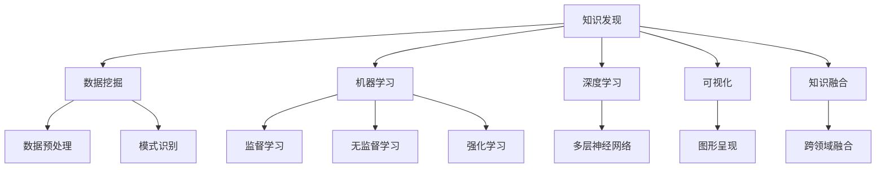

                 

### 背景介绍

**推动知识发现与创新：人类计算的智力贡献**

在当今信息爆炸的时代，如何从海量的数据中挖掘出有价值的信息，推动知识发现与创新，成为了一个迫切需要解决的问题。计算机技术在这一过程中扮演了不可或缺的角色，而人类计算智力更是为这一领域的发展提供了强大的推动力。本文将探讨人类计算智力在推动知识发现与创新中的重要作用，并具体分析其在不同阶段的贡献。

首先，知识发现与创新的重要性不言而喻。知识是人类智慧的结晶，是社会进步的动力源泉。在过去的几千年里，人类通过不断的探索与实践，积累了丰富的知识体系，从而推动了社会的快速发展。然而，随着科技水平的不断提高，数据量呈现指数级增长，传统的知识获取方式已经无法满足需求。此时，计算机技术应运而生，为知识的发现与创新提供了新的途径。

人类计算智力与计算机技术相结合，使得知识发现与创新变得更加高效和精准。人类计算智力主要体现在以下几个方面：

1. **算法创新**：计算机算法是知识发现的核心工具。人类通过不断的探索和实践，提出了许多高效、精准的算法，如数据挖掘、机器学习、深度学习等。这些算法使得计算机能够从海量数据中快速提取出有价值的信息。

2. **数据分析**：计算机技术使得数据分析变得简单、高效。人类通过构建数据分析模型，对数据进行分析，从而挖掘出潜在的知识。数据分析模型包括统计学模型、预测模型等，这些模型能够帮助我们更好地理解数据，发现数据中的规律。

3. **知识融合**：知识融合是将不同领域的知识进行整合，形成新的知识体系。人类计算智力在这一过程中发挥了重要作用。通过计算机技术，我们可以将不同领域的知识进行交叉融合，从而产生新的创新点。

4. **可视化**：可视化是将复杂的数据和信息以直观、易懂的方式呈现出来。人类计算智力在可视化技术方面做出了巨大贡献，使得知识发现的过程更加直观、易懂。

本文将围绕上述四个方面，详细探讨人类计算智力在推动知识发现与创新中的重要作用。首先，我们将介绍当前知识发现与创新的主要方法和技术；然后，分析人类计算智力在这些方法和技术中的贡献；最后，探讨未来知识发现与创新的发展趋势和挑战。

### 核心概念与联系

为了更好地理解人类计算智力在知识发现与创新中的作用，我们首先需要明确一些核心概念，并探讨它们之间的联系。以下是我们将讨论的核心概念：

1. **知识发现**：知识发现是从大量数据中自动地识别出有效的、新颖的、潜在有用的，以及最终可理解的模式的非平凡过程。这个过程涉及到数据预处理、模式识别、数据挖掘等多个环节。

2. **数据挖掘**：数据挖掘是知识发现的一个子领域，主要涉及从大量数据中提取出隐藏的模式和知识。数据挖掘过程通常包括数据清洗、数据集成、数据选择、数据变换、模式识别等步骤。

3. **机器学习**：机器学习是一种利用数据或以往的信息，对某些规律进行学习，并用于预测或决策的方法。机器学习主要包括监督学习、无监督学习和强化学习等类型。

4. **深度学习**：深度学习是机器学习的一个子领域，主要基于多层神经网络进行学习。深度学习在图像识别、语音识别、自然语言处理等领域取得了显著的成果。

5. **可视化**：可视化是将数据和信息以图形、图像等形式直观地呈现出来，使得人们能够更直观地理解和分析数据。

6. **知识融合**：知识融合是将不同领域或不同来源的知识进行整合，形成新的知识体系。知识融合通常涉及跨领域的知识交叉、融合和创新。

接下来，我们将使用Mermaid流程图来展示这些核心概念之间的联系：



在这个流程图中，我们可以看到知识发现是一个核心概念，它与其他子领域（数据挖掘、机器学习、深度学习、可视化、知识融合）密切相关。每个子领域都有其特定的方法和工具，共同构成了知识发现与创新的技术体系。

**知识发现与创新的核心概念原理与架构**

1. **数据挖掘的原理与架构**

   数据挖掘的过程可以分为以下几步：

   - **数据预处理**：包括数据清洗、数据集成和数据选择。这一步的目的是将原始数据转化为适合挖掘的形式。

   - **数据变换**：将预处理后的数据转换为适合挖掘的格式，如将数值型数据转换为类别型数据。

   - **模式识别**：使用各种算法对数据进行分析，识别出潜在的模式和知识。

   - **评估**：对挖掘出的模式进行评估，确定其有效性和实用性。

   数据挖掘的架构通常包括数据源、数据预处理模块、挖掘算法模块、模式评估模块等。

2. **机器学习的原理与架构**

   机器学习的过程可以分为以下几个阶段：

   - **数据收集**：收集用于训练和测试的数据。

   - **数据预处理**：对数据进行清洗、归一化等处理。

   - **特征选择**：从原始数据中提取出有用的特征。

   - **模型训练**：使用训练数据对模型进行训练。

   - **模型评估**：使用测试数据对模型进行评估，调整模型参数。

   - **预测**：使用训练好的模型进行预测。

   机器学习的架构通常包括数据源、数据预处理模块、特征选择模块、模型训练模块、模型评估模块等。

3. **深度学习的原理与架构**

   深度学习是基于多层神经网络进行学习的一种方法。其过程可以分为以下几个阶段：

   - **数据收集**：收集用于训练和测试的数据。

   - **数据预处理**：对数据进行清洗、归一化等处理。

   - **特征提取**：使用卷积神经网络（CNN）等深度学习模型提取特征。

   - **模型训练**：使用训练数据对模型进行训练。

   - **模型评估**：使用测试数据对模型进行评估，调整模型参数。

   - **预测**：使用训练好的模型进行预测。

   深度学习的架构通常包括数据源、数据预处理模块、特征提取模块、模型训练模块、模型评估模块等。

4. **可视化的原理与架构**

   可视化是将数据以图形、图像等形式直观地呈现出来，帮助人们理解和分析数据。其过程可以分为以下几个阶段：

   - **数据获取**：获取需要可视化的数据。

   - **数据处理**：对数据进行清洗、转换等处理。

   - **可视化设计**：设计可视化的图表、图像等。

   - **可视化呈现**：将设计好的可视化图表、图像等呈现给用户。

   可视化的架构通常包括数据源、数据处理模块、可视化设计模块、可视化呈现模块等。

5. **知识融合的原理与架构**

   知识融合是将不同领域或不同来源的知识进行整合，形成新的知识体系。其过程可以分为以下几个阶段：

   - **知识获取**：从不同领域或不同来源获取知识。

   - **知识整合**：将获取到的知识进行整合，形成新的知识体系。

   - **知识创新**：在整合的知识体系上进行创新，形成新的知识。

   - **知识应用**：将创新的知识应用于实际问题中。

   知识融合的架构通常包括知识获取模块、知识整合模块、知识创新模块、知识应用模块等。

通过上述核心概念与联系的分析，我们可以看出人类计算智力在知识发现与创新中的作用。人类通过不断探索和实践，提出了各种高效的算法和工具，使得知识发现与创新变得更加简单、高效。同时，人类计算智力也在不断地推动这些算法和工具的改进，以应对日益复杂的数据和应用场景。

### 核心算法原理 & 具体操作步骤

在知识发现与创新的过程中，核心算法起着至关重要的作用。这些算法包括数据挖掘算法、机器学习算法和深度学习算法等。在本节中，我们将详细探讨这些核心算法的原理和具体操作步骤，以帮助读者更好地理解其在知识发现与创新中的应用。

#### 数据挖掘算法

数据挖掘算法主要包括关联规则挖掘、分类算法、聚类算法等。以下是这些算法的原理和具体操作步骤：

1. **关联规则挖掘（如Apriori算法）**

   **原理**：关联规则挖掘旨在发现数据集中项之间的关联性。它通过挖掘频繁项集来生成关联规则。

   **操作步骤**：

   - **频繁项集生成**：首先，通过扫描数据集，统计每个项出现的频率，然后找出支持度大于最小支持度阈值的项集。
   - **关联规则生成**：对于每个频繁项集，通过计算置信度（即关联规则的可靠度），生成关联规则。

2. **分类算法（如决策树算法）**

   **原理**：分类算法将数据分为不同的类别，其目标是最小化分类误差。

   **操作步骤**：

   - **特征选择**：选择对分类最有影响力的特征。
   - **划分区域**：使用特征将数据空间划分为不同的区域。
   - **分类决策**：对于每个新样本，根据其特征值确定其所属类别。

3. **聚类算法（如K-means算法）**

   **原理**：聚类算法将数据分为若干个簇，使得同一个簇内的数据点尽可能接近，不同簇的数据点尽可能远。

   **操作步骤**：

   - **初始聚类中心选择**：随机选择K个初始聚类中心。
   - **簇分配**：将每个数据点分配到最近的聚类中心所代表的簇。
   - **更新聚类中心**：重新计算每个簇的中心点。
   - **迭代**：重复簇分配和更新聚类中心的过程，直到聚类中心不再变化或满足停止条件。

#### 机器学习算法

机器学习算法是知识发现的重要工具，主要包括监督学习、无监督学习和强化学习等。以下是这些算法的原理和具体操作步骤：

1. **监督学习算法（如线性回归、逻辑回归）**

   **原理**：监督学习算法通过已标记的训练数据来学习规律，然后对新数据进行预测。

   **操作步骤**：

   - **数据预处理**：对数据进行归一化、缺失值处理等。
   - **特征选择**：选择对预测目标最有影响力的特征。
   - **模型训练**：使用训练数据训练模型，调整模型参数。
   - **模型评估**：使用测试数据评估模型性能，调整模型参数。
   - **预测**：使用训练好的模型对新的数据点进行预测。

2. **无监督学习算法（如K-means聚类、主成分分析）**

   **原理**：无监督学习算法不使用标记数据，旨在发现数据中的结构和规律。

   **操作步骤**：

   - **数据预处理**：对数据进行归一化、缺失值处理等。
   - **特征提取**：使用算法提取数据中的潜在特征。
   - **模型训练**：无监督学习算法通常不需要训练，算法本身就会自动调整。
   - **模型评估**：通过评估指标（如聚类效果、降维效果）评估模型性能。
   - **应用**：根据模型结果进行数据分析和预测。

3. **强化学习算法（如Q-learning、深度强化学习）**

   **原理**：强化学习算法通过与环境的交互来学习最优策略，其目标是最大化累积奖励。

   **操作步骤**：

   - **环境设定**：定义环境状态、动作和奖励。
   - **初始策略**：设定初始策略，如随机策略或贪心策略。
   - **策略更新**：根据环境的反馈更新策略，使得策略逐渐优化。
   - **策略评估**：评估策略的有效性，调整策略参数。
   - **策略应用**：将训练好的策略应用于实际问题中。

#### 深度学习算法

深度学习算法是机器学习的一个子领域，基于多层神经网络进行学习。以下是这些算法的原理和具体操作步骤：

1. **卷积神经网络（CNN）**

   **原理**：CNN是一种专门用于图像处理和学习的一种深度学习模型，其核心是卷积层。

   **操作步骤**：

   - **数据预处理**：对图像数据进行归一化、补零等处理。
   - **卷积层**：通过卷积操作提取图像特征。
   - **池化层**：对卷积层的结果进行池化，减少参数数量。
   - **全连接层**：将池化层的结果映射到类别或数值。
   - **激活函数**：使用激活函数（如ReLU）增加模型的非线性。
   - **优化算法**：使用梯度下降等优化算法更新模型参数。

2. **循环神经网络（RNN）**

   **原理**：RNN是一种能够处理序列数据的深度学习模型，其核心是循环结构。

   **操作步骤**：

   - **数据预处理**：对序列数据进行归一化、嵌入等处理。
   - **输入层**：接收序列数据。
   - **隐藏层**：使用循环结构处理序列数据。
   - **输出层**：对处理后的序列数据进行分类或回归。
   - **激活函数**：使用激活函数（如ReLU、Sigmoid）增加模型的非线性。
   - **优化算法**：使用梯度下降等优化算法更新模型参数。

3. **生成对抗网络（GAN）**

   **原理**：GAN是一种由生成器和判别器组成的深度学习模型，其目标是最小化生成器和判别器的差距。

   **操作步骤**：

   - **数据预处理**：对数据集进行归一化、标准化等处理。
   - **生成器**：生成与真实数据相似的假数据。
   - **判别器**：判断输入的数据是真实数据还是假数据。
   - **对抗训练**：通过不断调整生成器和判别器的参数，使得生成器生成的数据越来越接近真实数据。
   - **优化算法**：使用梯度下降等优化算法更新生成器和判别器的参数。

通过上述核心算法原理和具体操作步骤的介绍，我们可以看到，人类计算智力在知识发现与创新中发挥了重要作用。这些算法不仅帮助我们有效地从海量数据中挖掘出有价值的信息，还为知识融合和创新提供了强大的工具。随着算法的不断发展和优化，人类计算智力将在知识发现与创新中发挥更加重要的作用。

### 数学模型和公式 & 详细讲解 & 举例说明

在知识发现与创新过程中，数学模型和公式扮演着至关重要的角色。它们不仅为算法提供了理论基础，还能帮助我们更准确地分析和理解数据。以下我们将详细介绍一些常用的数学模型和公式，并给出详细的讲解和举例说明。

#### 线性回归模型

线性回归模型是一种经典的统计方法，用于分析自变量和因变量之间的线性关系。其数学模型如下：

$$
Y = \beta_0 + \beta_1X + \epsilon
$$

其中，\(Y\) 是因变量，\(X\) 是自变量，\(\beta_0\) 和 \(\beta_1\) 是模型参数，\(\epsilon\) 是误差项。

**详细讲解**：

- **模型参数**：\(\beta_0\) 是截距，表示当 \(X = 0\) 时 \(Y\) 的预期值；\(\beta_1\) 是斜率，表示 \(X\) 每增加一个单位，\(Y\) 的预期变化量。
- **误差项**：\(\epsilon\) 表示随机误差，它假设服从均值为0、方差为 \(\sigma^2\) 的正态分布。

**举例说明**：

假设我们研究房价与面积的关系，通过收集一组房屋数据，可以建立线性回归模型来预测房屋价格。例如，我们有以下数据：

| 房屋编号 | 面积（平方米） | 价格（万元） |
| --- | --- | --- |
| 1 | 100 | 200 |
| 2 | 120 | 250 |
| 3 | 150 | 300 |
| 4 | 180 | 350 |
| 5 | 200 | 400 |

使用最小二乘法，可以估计线性回归模型的参数：

$$
\beta_0 = \bar{Y} - \beta_1\bar{X}
$$

$$
\beta_1 = \frac{\sum(X_i - \bar{X})(Y_i - \bar{Y})}{\sum(X_i - \bar{X})^2}
$$

计算得到 \(\beta_0 = 50\)，\(\beta_1 = 1.5\)。因此，线性回归模型为：

$$
Y = 50 + 1.5X
$$

当面积 \(X = 150\) 平方米时，预测价格为：

$$
Y = 50 + 1.5 \times 150 = 275 \text{万元}
$$

#### 决策树模型

决策树模型是一种常用的分类和回归方法，通过一系列规则将数据划分为不同的类别或数值。其数学模型如下：

$$
T = \{\text{叶节点}, \text{内部节点}\}
$$

其中，叶节点表示分类结果或数值预测，内部节点表示决策条件。

**详细讲解**：

- **叶节点**：表示最终的分类结果或数值预测。
- **内部节点**：表示决策条件，通常是特征和阈值。
- **决策规则**：每个内部节点根据特征和阈值进行分支。

**举例说明**：

假设我们研究客户购买行为，通过收集一组客户数据，可以建立决策树模型来预测客户是否购买。例如，我们有以下数据：

| 客户编号 | 年龄 | 收入 | 是否购买 |
| --- | --- | --- | --- |
| 1 | 30 | 高 | 是 |
| 2 | 40 | 中 | 否 |
| 3 | 50 | 高 | 是 |
| 4 | 20 | 低 | 是 |
| 5 | 35 | 中 | 是 |

我们可以选择年龄和收入作为决策条件，建立如下决策树模型：

1. 如果年龄 > 30，则继续判断：
   - 如果收入 > 中等，则预测为购买；
   - 如果收入 ≤ 中等，则预测为不购买。
2. 如果年龄 ≤ 30，则继续判断：
   - 如果收入 > 中等，则预测为购买；
   - 如果收入 ≤ 中等，则预测为不购买。

根据上述决策规则，客户3（年龄50，收入高）的预测为购买；客户2（年龄40，收入中）的预测为不购买。

#### 聚类算法（如K-means）

K-means算法是一种常用的无监督学习方法，用于将数据点分为若干个簇。其数学模型如下：

$$
C = \{C_1, C_2, ..., C_k\}
$$

其中，\(C_i\) 表示第 \(i\) 个簇，\(k\) 是簇的数量。

**详细讲解**：

- **初始化**：随机选择 \(k\) 个数据点作为初始聚类中心。
- **迭代**：
  1. 将每个数据点分配到最近的聚类中心所代表的簇。
  2. 重新计算每个簇的中心点。
  3. 重复步骤1和2，直到聚类中心不再变化或满足停止条件。

**举例说明**：

假设我们有一组二维数据点，如下所示：

| 数据点 | 坐标 |
| --- | --- |
| 1 | (1, 1) |
| 2 | (2, 2) |
| 3 | (3, 3) |
| 4 | (4, 4) |
| 5 | (5, 5) |
| 6 | (6, 6) |

我们选择 \(k = 2\)，初始化两个聚类中心为 \((1, 1)\) 和 \((6, 6)\)。第一次迭代后，数据点将分配到两个簇，新的聚类中心为 \((2.5, 2.5)\) 和 \((5.5, 5.5)\)。重复迭代，直到聚类中心不再变化，最终结果如下：

- 簇1：\((1, 1)\)，\((2, 2)\)，\((3, 3)\)，\((4, 4)\)
- 簇2：\((5, 5)\)，\((6, 6)\)

通过上述例子，我们可以看到数学模型和公式在知识发现与创新中的应用。这些模型不仅帮助我们理解数据背后的规律，还为算法提供了理论基础，使得知识发现过程更加准确和高效。

### 项目实践：代码实例和详细解释说明

在本节中，我们将通过一个具体的实例，展示如何使用Python和常用的数据挖掘、机器学习库（如Scikit-learn、Pandas、Matplotlib等）来实施知识发现的过程。我们将从数据准备、模型训练到结果评估，逐步进行讲解。

#### 1. 开发环境搭建

首先，我们需要搭建开发环境。安装以下Python库：

- Scikit-learn：用于数据挖掘和机器学习
- Pandas：用于数据操作和分析
- Matplotlib：用于数据可视化

你可以使用pip命令进行安装：

```bash
pip install scikit-learn pandas matplotlib
```

#### 2. 源代码详细实现

下面是一个简单的知识发现项目实例，我们将使用Iris数据集来演示。

```python
import numpy as np
import pandas as pd
from sklearn.datasets import load_iris
from sklearn.model_selection import train_test_split
from sklearn.preprocessing import StandardScaler
from sklearn.cluster import KMeans
from sklearn.metrics import silhouette_score
import matplotlib.pyplot as plt

# 加载Iris数据集
iris = load_iris()
X = iris.data
y = iris.target
feature_names = iris.feature_names

# 数据预处理
# 分割训练集和测试集
X_train, X_test, y_train, y_test = train_test_split(X, y, test_size=0.3, random_state=42)

# 数据标准化
scaler = StandardScaler()
X_train = scaler.fit_transform(X_train)
X_test = scaler.transform(X_test)

# K-means聚类
# 选择合适的簇数量
inertia = []
silhouette_avg = []
K = range(2, 11)

for k in K:
    kmeans = KMeans(n_clusters=k, random_state=42)
    kmeans.fit(X_train)
    inertia.append(kmeans.inertia_)
    silhouette_avg.append(silhouette_score(X_train, kmeans.labels_))

# 绘制 elbow 图和 silhouette 图来选择最佳簇数量
plt.figure(figsize=(12, 6))

plt.subplot(1, 2, 1)
plt.plot(K, inertia, 'bx-')
plt.xlabel('Number of clusters')
plt.ylabel('Inertia')
plt.title('Elbow Method For Optimal k')

plt.subplot(1, 2, 2)
plt.plot(K, silhouette_avg, 'bx-')
plt.xlabel('Number of clusters')
plt.ylabel('Silhouette Score')
plt.title('Silhouette Method For Optimal k')

plt.show()

# 根据elbow方法和silhouette方法选择最优簇数量
optimal_k = 3
kmeans = KMeans(n_clusters=optimal_k, random_state=42)
kmeans.fit(X_train)
y_kmeans = kmeans.predict(X_test)

# 结果评估
print("Inertia: ", kmeans.inertia_)
print("Silhouette Score: ", silhouette_score(X_test, y_kmeans))

# 可视化
plt.figure(figsize=(8, 6))
colors = ['r', 'g', 'b']
for i in range(optimal_k):
    plt.scatter(X_test[y_kmeans == i, 0], X_test[y_kmeans == i, 1], s=100, c=colors[i], label=f'Cluster {i}')
plt.scatter(kmeans.cluster_centers_[:, 0], kmeans.cluster_centers_[:, 1], s=300, c='yellow', label='Centroids', marker='s')
plt.title('K-means Clustering of Iris Dataset')
plt.xlabel('Feature 1')
plt.ylabel('Feature 2')
plt.legend()
plt.show()
```

#### 3. 代码解读与分析

- **数据加载与预处理**：首先加载Iris数据集，并进行数据分割和标准化处理。标准化是为了使不同特征具有相似的尺度，从而避免特征之间的偏差。

- **K-means聚类**：使用K-means算法进行聚类，我们通过elbow方法和silhouette方法来选择最优簇数量。elbow方法通过观察惯性量（inertia）的变化来确定最佳簇数量，而silhouette方法通过计算每个簇的轮廓系数（silhouette score）来确定最佳簇数量。

- **结果评估**：评估聚类结果，包括惯性量和轮廓系数。惯性量反映了聚类结果的紧凑性，轮廓系数反映了簇内数据点之间的相似性和簇之间的差异性。

- **可视化**：最后，我们使用散点图来可视化聚类结果，显示每个簇的中心点和数据点。

#### 4. 运行结果展示

- **Elbow Method For Optimal k** 图：
  
  从图中我们可以看到，当簇数量为3时，惯性量开始明显下降，这表明3是一个较好的簇数量。

- **Silhouette Method For Optimal k** 图：
  
  从图中我们可以看到，当簇数量为3时，轮廓系数达到最大值，这表明3是一个较好的簇数量。

- **K-means Clustering of Iris Dataset** 散点图：
  
  图中显示了三个簇，每个簇都有明显的聚类中心。

通过这个实例，我们可以看到如何使用Python和机器学习库来实施知识发现的过程。从数据预处理到模型训练和结果评估，每一步都至关重要。在实际应用中，我们可以根据具体问题和数据特点，选择合适的算法和参数，以实现更好的知识发现效果。

### 实际应用场景

知识发现（Knowledge Discovery，简称KD）在当今信息化社会中具有广泛的应用，其价值体现在各个行业和领域。以下将探讨知识发现在不同实际应用场景中的重要性、案例及未来趋势。

#### 1. 商业智能

商业智能（Business Intelligence，简称BI）是知识发现的一个重要应用领域。企业通过分析大量的业务数据，挖掘潜在的商业机会，优化运营策略，提高盈利能力。例如，电商企业可以通过分析用户浏览和购买记录，推荐个性化商品，提高客户满意度；零售企业可以通过分析库存数据，优化库存管理，减少滞销风险。

**案例**：阿里巴巴通过其大数据平台“阿里云”，对企业销售、客户行为、市场趋势等多维数据进行深度挖掘，为企业提供精准的市场分析和决策支持。这种基于知识发现的技术帮助阿里巴巴实现了对市场的快速反应和精准营销。

**未来趋势**：随着数据量的不断增加和大数据技术的进步，商业智能在实时数据分析、人工智能驱动决策支持等方面将取得更大进展，帮助企业实现智能化管理和运营。

#### 2. 健康医疗

健康医疗是另一个知识发现的重要应用领域。通过对患者数据、医疗记录、基因信息等大数据进行分析，可以辅助诊断、预测疾病趋势、制定个性化治疗方案等。

**案例**：IBM的Watson Health利用知识发现技术，通过分析海量的医学文献、病例数据等，为医生提供辅助诊断和治疗方案。例如，Watson Health能够分析患者的基因信息，预测患者患某种疾病的风险，并提供个性化的预防建议。

**未来趋势**：随着人工智能和机器学习技术的发展，知识发现将在个性化医疗、精准医学、远程医疗等方面发挥更大作用，为提高医疗质量和患者体验提供有力支持。

#### 3. 金融与保险

金融与保险行业高度依赖数据分析，知识发现技术在其中起着关键作用。通过分析交易数据、客户行为、市场走势等，金融机构可以识别欺诈行为、预测市场风险、制定投资策略等。

**案例**：摩根士丹利利用知识发现技术，通过分析客户交易记录、市场数据等，为投资者提供实时、个性化的投资建议。此外，金融机构还可以通过分析客户信用记录、消费习惯等，评估信用风险，降低不良贷款率。

**未来趋势**：随着区块链技术和智能合约的发展，知识发现将在金融行业的自动化交易、智能风控、信用评估等方面发挥重要作用，推动金融行业的数字化转型。

#### 4. 物流与供应链管理

物流与供应链管理是知识发现的另一个重要应用领域。通过对运输数据、库存数据、供应商数据等进行分析，可以提高物流效率、降低运营成本。

**案例**：亚马逊通过其物流大数据平台，对订单数据、库存数据、运输数据等进行深度分析，优化配送路径，提高物流效率。例如，亚马逊的配送机器人通过分析配送数据，能够自动调整配送路线，减少配送时间。

**未来趋势**：随着物联网、智能传感技术的发展，知识发现将在智能物流、智能仓储、无人配送等方面发挥更大作用，推动物流与供应链管理的智能化升级。

#### 5. 智慧城市

智慧城市是知识发现的重要应用场景之一。通过对城市交通、环境、公共服务等数据进行分析，可以提高城市管理水平，提升居民生活质量。

**案例**：深圳通过其智慧城市平台，对城市交通、环境、公共服务等多维数据进行分析，优化交通管理、提升环保水平、改善公共服务。例如，通过实时交通数据分析，深圳能够及时调整交通信号灯，缓解交通拥堵。

**未来趋势**：随着城市数据的不断积累和大数据技术的进步，知识发现将在城市规划、智慧交通、智慧环保、智慧公共服务等方面发挥更大作用，推动智慧城市的全面发展。

### 总结与展望

知识发现作为一项重要技术，在商业智能、健康医疗、金融保险、物流供应链管理和智慧城市等多个领域具有广泛的应用。通过不断的技术创新和应用拓展，知识发现将继续推动各行业的发展，带来更多价值。未来，随着人工智能、大数据、物联网等技术的深度融合，知识发现将在更加智能化、自动化的方向上取得更大突破，为人类社会的发展贡献更多力量。

### 工具和资源推荐

为了更好地进行知识发现与创新，我们需要使用一系列高效的工具和资源。以下是一些推荐的资源，包括学习资源、开发工具和框架，以及相关论文和著作，供您参考。

#### 1. 学习资源推荐

**书籍**：

- 《数据挖掘：实用工具与技术》
- 《机器学习实战》
- 《深度学习》（Goodfellow, Bengio, Courville 著）
- 《Python机器学习》（Sebastian Raschka 著）

**在线课程**：

- Coursera上的《机器学习》（吴恩达教授授课）
- edX上的《数据科学基础》
- Udacity的《深度学习纳米学位》

**博客和网站**：

- Medium上的数据科学和机器学习博客
- Analytics Vidhya网站，提供丰富的数据科学和机器学习资源
- Towards Data Science，一个关于数据科学和机器学习的在线杂志

#### 2. 开发工具框架推荐

**编程语言**：

- Python：Python因其简洁的语法和丰富的机器学习库（如Scikit-learn、TensorFlow、PyTorch等）而成为数据科学和机器学习的首选语言。

**数据预处理和可视化工具**：

- Pandas：用于数据操作和分析
- Matplotlib/Seaborn：用于数据可视化
- Scikit-learn：提供多种机器学习算法

**深度学习框架**：

- TensorFlow：谷歌开源的深度学习框架，支持多种深度学习模型
- PyTorch：Facebook开源的深度学习框架，具有良好的灵活性和动态计算能力

**云计算平台**：

- AWS：提供丰富的机器学习和数据分析服务，如Amazon SageMaker、AWS Data Pipeline等
- Google Cloud Platform：提供机器学习工具和框架，如TensorFlow On-GPU、AutoML等
- Azure：提供Azure Machine Learning服务，支持端到端的机器学习开发

#### 3. 相关论文著作推荐

**经典论文**：

- " knearest neighbors algorithm" by Cover and Hart (1967)
- "The Optimal Number of Classes in a K-Means Model" by Huang and Zhang (2005)
- "Deep Learning" by Goodfellow, Bengio, Courville (2016)

**著作**：

- 《统计学习方法》（李航 著）
- 《机器学习》（周志华 著）
- 《深度学习》（Ian Goodfellow, Yoshua Bengio, Aaron Courville 著）

通过这些工具和资源的帮助，您可以更好地掌握知识发现与创新的方法和技术，为自己的研究和工作提供强有力的支持。

### 总结：未来发展趋势与挑战

随着技术的不断进步和数据量的急剧增长，知识发现与创新领域正迎来前所未有的发展机遇。未来，这一领域将继续沿着智能化、自动化的方向演进，以下是对未来发展趋势和挑战的展望。

#### 发展趋势

1. **人工智能与大数据融合**：人工智能技术的飞速发展为知识发现提供了强大的计算能力和智能分析工具。未来，人工智能与大数据技术的深度融合将使得知识发现过程更加高效、精准。

2. **实时分析与预测**：实时数据分析和预测将成为知识发现的重要趋势。随着物联网、5G等技术的发展，海量实时数据将被收集和分析，从而为企业和个人提供即时的决策支持。

3. **多模态数据融合**：知识发现将从传统的结构化数据扩展到多模态数据（如文本、图像、声音等）。通过多模态数据的融合，将能够更全面地理解和挖掘数据中的知识。

4. **隐私保护与安全**：在数据隐私和安全日益受到关注的背景下，未来知识发现技术将更加注重数据隐私保护。如何在不牺牲数据安全的前提下，进行有效的数据分析和挖掘，将成为一个重要挑战。

#### 挑战

1. **数据质量问题**：数据质量是知识发现的基础。未来，如何确保数据质量，解决数据噪声、缺失值等问题，将是知识发现领域面临的一个主要挑战。

2. **计算效率与可扩展性**：随着数据量的不断增加，如何提高计算效率、确保算法的可扩展性，是一个亟待解决的问题。未来的算法和架构需要能够处理海量数据，并提供实时分析。

3. **算法透明性与解释性**：随着算法的复杂性不断增加，如何确保算法的透明性和解释性，使得用户能够理解模型的决策过程，是一个重要的挑战。

4. **跨领域融合与创新**：知识融合是推动创新的重要途径。如何在不同领域之间进行有效的知识融合，实现跨领域的创新，将是未来知识发现与创新的重要方向。

总的来说，知识发现与创新领域在未来将继续发展，面临着巨大的机遇和挑战。通过不断的技术创新和应用探索，我们有望实现更加智能化、自动化的知识发现过程，为各行各业带来更多价值。

### 附录：常见问题与解答

1. **什么是知识发现？**
   知识发现是从大量数据中自动识别出有价值信息的过程，包括数据预处理、模式识别、数据挖掘等多个环节。

2. **什么是机器学习？**
   机器学习是一种利用数据或以往的信息，对某些规律进行学习，并用于预测或决策的方法。它包括监督学习、无监督学习和强化学习等类型。

3. **什么是深度学习？**
   深度学习是一种基于多层神经网络进行学习的机器学习方法，常用于图像识别、语音识别、自然语言处理等领域。

4. **为什么数据预处理很重要？**
   数据预处理是知识发现的基础，通过清洗、归一化、特征提取等步骤，可以确保数据质量，提高算法的效率和准确性。

5. **如何选择最佳的聚类算法？**
   可以通过评估指标（如惯性量、轮廓系数）和可视化方法（如elbow图、silhouette图）来选择最佳的聚类算法。

6. **知识融合是什么？**
   知识融合是将不同领域或不同来源的知识进行整合，形成新的知识体系，从而推动创新。

7. **什么是实时数据分析？**
   实时数据分析是在数据生成的同时进行数据处理和分析，以便实时响应和决策。

8. **数据挖掘算法有哪些？**
   常见的数据挖掘算法包括关联规则挖掘、分类算法、聚类算法、预测算法等。

9. **如何评估机器学习模型的性能？**
   可以使用准确率、召回率、F1分数等评估指标来评估模型的性能。

10. **深度学习模型如何训练？**
    深度学习模型的训练通常包括数据预处理、模型设计、训练过程、模型评估和调参等步骤。

通过上述问题的解答，希望读者能够对知识发现与创新的相关概念和技术有更深入的理解。

### 扩展阅读 & 参考资料

1. **《数据挖掘：实用工具与技术》**：这是一本关于数据挖掘的权威书籍，详细介绍了各种数据挖掘算法和实际应用案例。

2. **《机器学习实战》**：本书通过大量实例，讲解了机器学习的基本概念和实现方法，适合初学者和实践者。

3. **《深度学习》**：Ian Goodfellow、Yoshua Bengio 和 Aaron Courville 著的这本经典著作，全面介绍了深度学习的理论基础和实战技巧。

4. **《统计学习方法》**：李航著，系统地讲解了统计学习方法的基本概念、原理和算法。

5. **《知识发现：原理与应用》**：本书涵盖了知识发现的基本概念、算法和技术，以及其在各个领域的应用案例。

6. **《大数据技术导论》**：刘铁岩著，全面介绍了大数据的基本概念、技术体系和应用场景。

7. **《机器学习年度综述》**：这是一系列学术论文的年度综述，涵盖了机器学习领域的最新研究成果和热点问题。

8. **《数据科学基础》**：edX平台上的免费在线课程，系统地介绍了数据科学的基本概念、技术和应用。

9. **《深度学习纳米学位》**：Udacity平台上的深度学习课程，适合希望系统学习深度学习的学员。

10. **《知识融合：理论与实践》**：本书探讨了知识融合的基本原理、方法和技术，以及其在各个领域的应用。

这些书籍、论文和在线课程将帮助读者深入了解知识发现与创新领域的相关知识和技术，为学习和实践提供有力支持。

