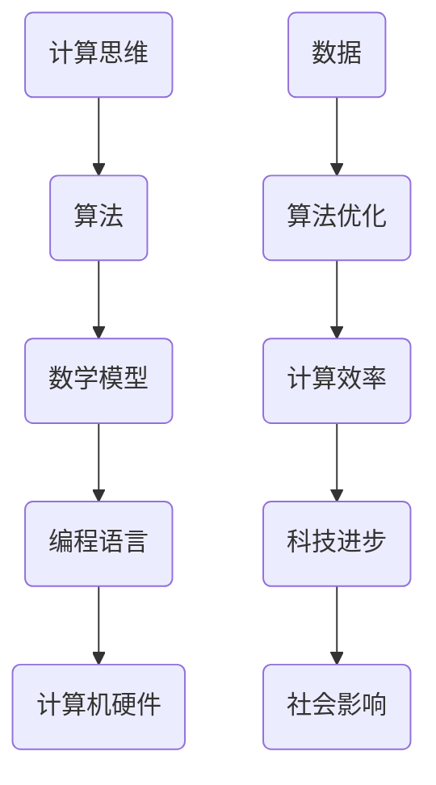

                 

### 关键词 Keywords ###
- 人类计算
- 科技进步
- 创新力量
- 计算机科学
- 算法
- 数学模型
- 实践应用

### 摘要 Abstract ###
在信息爆炸的时代，人类计算作为一种强大的工具，正深刻改变着我们的世界。本文旨在探讨人类计算在推动科技进步中的核心作用，从核心概念、算法原理、数学模型到实践应用，全面解析人类计算的创新力量。通过回顾历史，分析现状，展望未来，本文希望能够为读者提供一个全面而深刻的视角，理解人类计算如何成为科技进步的引擎。

## 1. 背景介绍

在科技日新月异发展的今天，人类计算扮演着至关重要的角色。计算机科学的诞生和发展，使得人类处理信息的能力实现了前所未有的飞跃。从最初的机械计算器，到现代的超级计算机，计算机技术的进步推动了人类社会的各个方面。人类计算不仅仅是计算机硬件和软件的进步，更是计算思维、算法创新和数学模型构建的集合体。

### 1.1 计算机科学的发展历程

计算机科学的发展历程可以分为几个关键阶段。首先是电子计算机的诞生，以ENIAC（电子数值积分计算机）为代表，标志着人类计算时代的开启。随后，计算机硬件和软件技术不断革新，如集成电路、操作系统和编译器的出现，使得计算机的运算速度和可靠性得到了大幅提升。

### 1.2 人类计算在现代社会中的地位

在现代社会，人类计算已经成为重要的基础设施。无论是在医疗、金融、教育、交通等各个领域，计算机的应用都极大地提高了效率和质量。特别是大数据、人工智能和云计算等新兴技术的出现，使得人类计算的力量得到了进一步放大。

### 1.3 计算思维与算法创新

计算思维是计算机科学的核心之一，它强调问题的形式化描述、抽象和模型构建。通过计算思维，人类能够更好地理解和解决复杂问题。算法创新则是计算思维的具体体现，通过不断优化算法，人类计算的能力得到了显著提升。

## 2. 核心概念与联系

在探讨人类计算的核心概念之前，我们需要了解一些基本的原理和架构。以下是一个简单的 Mermaid 流程图，用于展示人类计算的核心概念及其相互关系。



### 2.1 计算思维

计算思维是一种解决问题的方法论，它强调对问题进行抽象和模型化，通过算法和数学模型来求解。计算思维的核心在于理解问题、构建模型、选择合适的算法，并进行计算。

### 2.2 算法

算法是一系列解决问题的步骤，它是计算思维的具体实现。算法的设计和优化是提高计算效率的关键。常见的算法包括排序算法、搜索算法、图算法等。

### 2.3 数学模型

数学模型是对现实世界问题的抽象和数学描述。通过构建数学模型，我们可以将复杂问题转化为数学问题，从而利用数学方法求解。常见的数学模型包括线性模型、非线性模型、概率模型等。

### 2.4 编程语言

编程语言是程序员用来实现算法和数学模型的工具。不同的编程语言具有不同的特性和适用场景。常见的编程语言包括C、Java、Python等。

### 2.5 计算机硬件

计算机硬件是执行计算任务的基础设施。从早期的电子管计算机，到现代的超级计算机，计算机硬件的发展极大地推动了人类计算的能力。

### 2.6 数据

数据是计算的基础，它是算法和数学模型的输入。随着大数据技术的发展，海量数据的处理和分析成为人类计算的重要任务。

### 2.7 算法优化与计算效率

算法优化是提高计算效率的关键。通过优化算法，我们可以减少计算时间、降低计算资源的需求，从而提高计算效率。计算效率的提高直接推动了科技进步。

### 2.8 科技进步与社会影响

科技进步不仅仅是计算机硬件和软件的进步，更是人类计算能力的提升。通过计算思维、算法创新和数学模型构建，人类计算不断推动着科技的进步，从而影响社会的各个方面。

## 3. 核心算法原理 & 具体操作步骤

### 3.1 算法原理概述

核心算法是推动科技进步的关键。以下是一些常见且重要的算法及其原理概述：

### 3.1.1 排序算法

排序算法是将一组数据按照特定的顺序进行排列的算法。常见的排序算法包括冒泡排序、选择排序、插入排序、快速排序等。

### 3.1.2 搜索算法

搜索算法是在数据结构中查找特定元素的方法。常见的搜索算法包括线性搜索、二分搜索等。

### 3.1.3 图算法

图算法是用于解决图结构相关问题的算法。常见的图算法包括深度优先搜索、广度优先搜索、最短路径算法等。

### 3.2 算法步骤详解

### 3.2.1 冒泡排序算法

冒泡排序是一种简单的排序算法，其基本思想是通过多次遍历待排序的序列，比较相邻的两个元素，并将较大（或较小）的元素交换到序列的右侧（或左侧），直到整个序列有序。

```plaintext
步骤：
1. 从第一个元素开始，对相邻的两个元素进行比较，将较大的元素交换到右侧。
2. 继续对下一对相邻元素进行比较，直到序列的最右侧。
3. 重复上述步骤，每次遍历后最大（或最小）的元素都会被“冒泡”到序列的右侧。
4. 当完成一次遍历后，最大（或最小）的元素已经位于序列的右侧，此时可以排除这部分元素，对剩余部分进行相同的操作。
```

### 3.2.2 二分搜索算法

二分搜索算法是一种高效的搜索算法，其基本思想是将待搜索的序列分成两部分，根据目标元素与中间元素的大小关系，决定在序列的哪一部分继续搜索。

```plaintext
步骤：
1. 找到序列的中间元素。
2. 将目标元素与中间元素进行比较。
3. 如果目标元素小于中间元素，则在左侧子序列中继续搜索；如果目标元素大于中间元素，则在右侧子序列中继续搜索。
4. 重复上述步骤，直到找到目标元素或确定目标元素不存在于序列中。
```

### 3.2.3 深度优先搜索算法

深度优先搜索（DFS）算法是一种用于图结构搜索的算法，其基本思想是沿着某一分支一直探索到底，然后再回溯到上一个分支继续探索。

```plaintext
步骤：
1. 选择一个未访问过的节点作为起始点。
2. 从起始点开始，依次访问其邻接节点，并标记为已访问。
3. 对于每个未访问过的邻接节点，重复步骤2。
4. 如果所有邻接节点都已被访问，则回溯到上一个节点，继续探索下一个邻接节点。
5. 重复上述步骤，直到找到目标节点或所有节点都被访问。
```

### 3.3 算法优缺点

每种算法都有其独特的优缺点，选择合适的算法取决于具体的应用场景。

### 3.3.1 冒泡排序算法

**优点**：
- 简单易懂，易于实现。
- 对小规模数据排序效果较好。

**缺点**：
- 时间复杂度为O(n^2)，效率较低。
- 不适合大规模数据排序。

### 3.3.2 二分搜索算法

**优点**：
- 时间复杂度为O(log n)，效率较高。
- 适合有序数据结构的搜索。

**缺点**：
- 需要预先对数据进行排序，增加了额外的时间开销。
- 不适合动态变化的有序数据结构。

### 3.3.3 深度优先搜索算法

**优点**：
- 能够快速找到目标节点。
- 简单易实现。

**缺点**：
- 可能会陷入深度优先的分支，导致效率降低。
- 需要大量的内存空间来存储已访问节点。

### 3.4 算法应用领域

算法在各个领域的应用越来越广泛，以下是几个典型应用领域：

### 3.4.1 数据分析

排序算法和搜索算法在数据分析中具有重要应用，如快速排序用于大数据的排序，二分搜索用于高效查找。

### 3.4.2 网络通信

网络路由算法和加密算法在网络安全和通信领域发挥着重要作用，如Dijkstra算法用于计算最短路径，RSA算法用于数据加密。

### 3.4.3 计算机图形学

图算法在计算机图形学中广泛应用，如深度优先搜索用于图形的遍历，最短路径算法用于路径规划。

### 3.4.4 人工智能

人工智能领域中的许多算法，如神经网络、决策树、支持向量机等，都是基于图算法和优化算法的改进。

## 4. 数学模型和公式 & 详细讲解 & 举例说明

数学模型是计算科学的核心，通过数学公式和模型，我们可以更好地理解和解决复杂问题。以下是一个简单的数学模型及其公式推导和举例说明。

### 4.1 数学模型构建

假设有一个包含n个元素的序列A = [a1, a2, ..., an]，我们需要对序列进行排序。排序的目标是将序列中的元素按照从小到大的顺序排列。

### 4.2 公式推导过程

为了构建排序的数学模型，我们可以考虑冒泡排序算法。冒泡排序的基本思想是：从序列的左端开始，相邻的两个元素进行比较，如果左边的元素比右边的元素大，则交换它们的位置。这样，每次遍历后，最大的元素都会被“冒泡”到序列的右端。

```latex
步骤：
1. 初始化两个指针i和j，其中i表示当前遍历的位置，j表示遍历的下一个位置。
2. 对序列A中的每个位置i，执行以下操作：
   a. 将当前元素ai与ai+1进行比较。
   b. 如果ai > ai+1，则交换ai和ai+1的位置。
3. 重复步骤2，直到整个序列有序。
```

### 4.3 案例分析与讲解

假设有一个包含5个元素的序列A = [5, 2, 8, 1, 9]，我们需要使用冒泡排序算法对其进行排序。

```plaintext
初始序列：A = [5, 2, 8, 1, 9]
第1次遍历：A = [2, 5, 1, 8, 9]
           比较次数：4
           交换次数：1
第2次遍历：A = [2, 1, 5, 8, 9]
           比较次数：3
           交换次数：1
第3次遍历：A = [2, 1, 5, 8, 9]
           比较次数：2
           交换次数：0
第4次遍历：A = [2, 1, 5, 8, 9]
           比较次数：1
           交换次数：0
第5次遍历：A = [1, 2, 5, 8, 9]
           比较次数：0
           交换次数：0
排序完成：A = [1, 2, 5, 8, 9]
```

从上述例子中，我们可以看到，冒泡排序算法通过对序列的多次遍历和相邻元素的比较与交换，最终实现了序列的排序。在这个过程中，我们使用了简单的数学模型和公式，使得排序过程变得清晰易懂。

## 5. 项目实践：代码实例和详细解释说明

为了更好地理解人类计算在实际项目中的应用，我们将通过一个具体的代码实例来展示计算思维的运用和算法的实现。以下是一个简单的Python代码实例，用于实现冒泡排序算法。

### 5.1 开发环境搭建

在开始编写代码之前，我们需要搭建一个简单的开发环境。以下是在Windows系统中搭建Python开发环境的基本步骤：

1. 下载并安装Python 3.x版本，可以从Python官方网站（https://www.python.org/）下载。
2. 配置Python的环境变量，以便在命令行中使用Python。
3. 安装必要的Python库，如NumPy、Pandas等，可以使用pip命令进行安装。

### 5.2 源代码详细实现

以下是冒泡排序算法的Python代码实现：

```python
def bubble_sort(arr):
    n = len(arr)
    # 遍历所有数组元素
    for i in range(n):
        # 最后i个元素已经有序，无需比较
        for j in range(0, n-i-1):
            # 当前元素比下一个元素大，交换它们
            if arr[j] > arr[j+1]:
                arr[j], arr[j+1] = arr[j+1], arr[j]

# 测试代码
arr = [5, 2, 8, 1, 9]
print("原始序列:", arr)
bubble_sort(arr)
print("排序后的序列:", arr)
```

### 5.3 代码解读与分析

#### 函数定义

```python
def bubble_sort(arr):
```

这里定义了一个名为`bubble_sort`的函数，它接收一个数组`arr`作为参数。

#### 遍历数组

```python
for i in range(n):
    for j in range(0, n-i-1):
```

外层循环用于遍历数组的所有元素，内层循环用于比较相邻的元素并交换它们的位置。外层循环的变量`i`表示当前遍历到的元素位置，内层循环的变量`j`表示比较的起始位置。每次外层循环结束后，最大的元素都会被“冒泡”到数组的右侧，因此内层循环的范围可以逐步减少。

#### 比较与交换

```python
if arr[j] > arr[j+1]:
    arr[j], arr[j+1] = arr[j+1], arr[j]
```

这里使用了一个`if`语句来比较相邻的两个元素。如果当前元素`arr[j]`大于下一个元素`arr[j+1]`，则交换它们的位置。

#### 测试代码

```python
arr = [5, 2, 8, 1, 9]
print("原始序列:", arr)
bubble_sort(arr)
print("排序后的序列:", arr)
```

这里创建了一个包含5个元素的数组`arr`，并使用`print`函数输出原始序列和排序后的序列。

### 5.4 运行结果展示

在Python环境中运行上述代码，将得到以下输出结果：

```plaintext
原始序列: [5, 2, 8, 1, 9]
排序后的序列: [1, 2, 5, 8, 9]
```

从输出结果中可以看出，原始序列已经被成功排序，且排序过程遵循了冒泡排序算法的步骤和逻辑。

## 6. 实际应用场景

人类计算在各个领域的实际应用场景非常广泛，以下是一些典型应用场景的例子：

### 6.1 数据分析

在数据分析领域，人类计算通过算法和数学模型来处理和分析海量数据，以提取有价值的信息。例如，在金融市场分析中，算法可以快速分析大量历史数据，预测股票价格的趋势；在医疗数据分析中，算法可以帮助医生诊断疾病，提高诊断的准确率。

### 6.2 网络安全

网络安全领域依赖于人类计算来检测和防御网络攻击。例如，通过机器学习算法，可以对网络流量进行分析，识别异常行为和潜在的网络攻击；在密码学中，人类计算通过复杂的算法来加密和解密数据，确保信息安全。

### 6.3 自动驾驶

自动驾驶技术是人工智能和人类计算相结合的典型应用。通过复杂的算法和数学模型，自动驾驶系统能够实时感知周围环境，做出准确的决策，实现车辆的自动控制。例如，在路径规划中，算法需要考虑交通状况、道路环境等因素，规划出最优行驶路径。

### 6.4 医疗诊断

在医疗领域，人类计算通过算法和数学模型来辅助医生进行疾病诊断和治疗。例如，通过图像识别算法，可以辅助医生诊断肿瘤、骨折等疾病；在药物研发中，人类计算可以通过模拟计算，加速新药的发现过程。

### 6.5 金融服务

在金融服务领域，人类计算通过算法和数学模型来优化投资策略、风险管理和客户服务。例如，通过量化投资策略，可以更好地预测市场走势，实现资产的增值；通过客户行为分析，可以提供个性化的金融服务，提升客户体验。

### 6.6 教育科技

在教育科技领域，人类计算通过算法和数学模型来改善学习体验和教学效果。例如，通过智能辅导系统，可以为学生提供个性化的学习建议和辅导；通过在线教育平台，可以实时分析学生的学习行为和效果，提高教学效率。

## 7. 未来应用展望

随着科技的不断发展，人类计算在各个领域的应用前景将更加广阔。以下是一些未来应用展望：

### 7.1 新兴技术领域

随着人工智能、大数据、物联网等新兴技术的兴起，人类计算将在这些领域发挥更大的作用。例如，在人工智能领域，人类计算将通过深度学习、强化学习等算法，实现更智能的机器人和自动化系统；在大数据领域，人类计算将通过数据挖掘和分析，实现更加精准的决策和支持。

### 7.2 个性化服务

未来，人类计算将更加注重个性化服务。通过算法和数学模型，可以为用户提供更加个性化的推荐、服务和建议。例如，在电子商务中，算法可以根据用户的购物行为和偏好，推荐合适的商品；在医疗领域，算法可以根据患者的病史和症状，提供个性化的治疗方案。

### 7.3 自动化和智能化

随着人工智能和物联网技术的发展，人类计算将在自动化和智能化领域发挥重要作用。例如，在工业生产中，通过算法和数学模型，可以实现生产过程的自动化和优化，提高生产效率；在智能家居中，算法可以通过感知环境和用户行为，实现智能化的家居控制。

### 7.4 新兴应用场景

未来，人类计算将在新兴应用场景中发挥更大作用。例如，在环境监测中，通过算法和数学模型，可以实时监测空气质量、水质等环境参数，实现环保的智能管理；在能源管理中，通过算法和数学模型，可以实现能源的高效利用和优化分配。

### 7.5 社会影响

随着人类计算的应用越来越广泛，其对社会的影响也将日益显著。例如，在医疗领域，人类计算可以通过远程医疗技术，提高医疗服务的可及性和效率；在教育领域，人类计算可以通过在线教育平台，打破地域和时间的限制，实现全球范围内的教育资源共享。

## 8. 工具和资源推荐

为了更好地学习和应用人类计算技术，以下是一些推荐的工具和资源：

### 8.1 学习资源推荐

- 《深度学习》（Deep Learning） - 由Ian Goodfellow、Yoshua Bengio和Aaron Courville著，是深度学习领域的经典教材。
- 《Python编程：从入门到实践》（Python Crash Course） - 由Eric Matthes著，适合初学者入门Python编程。
- 《算法导论》（Introduction to Algorithms） - 由Thomas H. Cormen、Charles E. Leiserson、Ronald L. Rivest和Clifford Stein著，是算法领域的权威教材。

### 8.2 开发工具推荐

- Jupyter Notebook - 一个交互式的计算环境，适用于编写和运行代码。
- PyCharm - 一款功能强大的Python集成开发环境（IDE），适合开发各种规模的Python项目。
- TensorFlow - 一个开源的机器学习框架，适用于构建和训练深度学习模型。

### 8.3 相关论文推荐

- "Deep Learning: A Brief History of Neural Nets" - 由Yann LeCun等人著，回顾了深度学习的历史和发展。
- "The Hundred-Page Machine Learning Book" - 由Andrzej C. Piech著，是一份简明的机器学习指南。
- "A Theoretical Exploration of Deep Neural Networks" - 由Yoshua Bengio等人著，探讨了深度神经网络的性质和优化方法。

## 9. 总结：未来发展趋势与挑战

人类计算作为一种强大的工具，正在深刻改变着我们的世界。随着科技的不断发展，人类计算在推动科技进步中的核心作用将越来越显著。未来，人类计算将在新兴技术、个性化服务、自动化和智能化等领域发挥更大作用。然而，随着计算能力的提升，我们也面临着一系列挑战，如数据隐私保护、算法公平性、人工智能伦理等问题。只有通过持续的研究和创新，我们才能充分发挥人类计算的力量，实现科技与社会的可持续发展。

### 附录：常见问题与解答

**Q1. 人类计算的核心是什么？**

人类计算的核心在于计算思维、算法创新、数学模型构建和计算效率的提升。这些要素共同作用，推动了计算机科学的发展。

**Q2. 人类计算有哪些应用领域？**

人类计算的应用领域非常广泛，包括数据分析、网络安全、自动驾驶、医疗诊断、金融服务、教育科技等。

**Q3. 什么样的算法是最优的？**

最优算法取决于具体的应用场景和需求。在某些情况下，时间效率是最重要的，而在其他情况下，空间效率或可扩展性可能更为关键。

**Q4. 如何构建一个数学模型？**

构建数学模型通常需要以下几个步骤：理解问题、收集数据、建立假设、选择适当的数学工具、验证模型的有效性。

**Q5. 人类计算的发展趋势是什么？**

未来，人类计算将在新兴技术、个性化服务、自动化和智能化等领域继续发展，同时，我们也需要关注数据隐私、算法公平性和人工智能伦理等问题。

### 作者署名

作者：禅与计算机程序设计艺术 / Zen and the Art of Computer Programming

