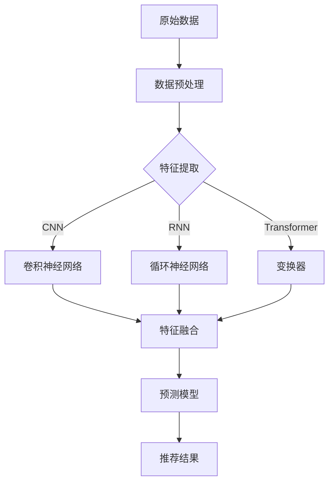

                 

### 文章标题

推荐系统中AI大模型的多场景适配

> 关键词：推荐系统，AI大模型，多场景适配，机器学习，深度学习，模型压缩，模型迁移，场景化优化

> 摘要：本文旨在探讨在推荐系统中引入人工智能大模型的适配策略，重点关注多场景下如何优化大模型的性能与效率。通过深入分析大模型的原理、算法和实际应用，本文提出了一系列适配方法和实践建议，以期为推荐系统领域的研发提供有力支持。

### 1. 背景介绍

推荐系统作为当今信息社会中的一项关键技术，已经广泛应用于电子商务、社交媒体、在线视频、新闻推送等领域。其核心目标是通过分析用户的历史行为和偏好，为用户提供个性化的推荐结果，从而提高用户满意度和系统价值。

随着深度学习技术的迅速发展，人工智能大模型在推荐系统中逐渐崭露头角。这些模型具有强大的特征提取和预测能力，能够显著提升推荐系统的效果。然而，大模型的引入也带来了一系列挑战，如计算资源需求大、训练时间长、模型复杂度高等。为了应对这些挑战，如何实现大模型在不同场景下的高效适配成为当前研究的热点。

本文将从以下四个方面展开讨论：

1. **核心概念与联系**：介绍推荐系统中常用的人工智能大模型及其工作原理。
2. **核心算法原理 & 具体操作步骤**：详细阐述大模型在推荐系统中的应用方法和优化策略。
3. **数学模型和公式 & 详细讲解 & 举例说明**：分析大模型的数学基础，并给出实际应用中的案例分析。
4. **项目实践：代码实例和详细解释说明**：通过具体项目实例，展示大模型在不同场景下的适配过程。

本文旨在为推荐系统研发人员提供一套系统化、可操作的适配策略，以充分发挥人工智能大模型在多场景中的应用潜力。

### 2. 核心概念与联系

在推荐系统中，人工智能大模型通常指的是基于深度学习的复杂神经网络，它们通过大规模数据训练，能够自动提取特征并进行预测。以下是一些常用的核心概念：

#### 2.1 深度学习模型

深度学习模型是推荐系统中最常用的类型之一，主要包括卷积神经网络（CNN）、循环神经网络（RNN）和变换器（Transformer）等。每种模型都有其独特的结构和工作原理：

- **卷积神经网络（CNN）**：主要适用于处理图像和视频等具有空间特征的数据，通过卷积层提取局部特征，再通过池化层进行特征降维。
- **循环神经网络（RNN）**：适用于处理序列数据，如用户行为日志，通过循环结构实现长距离依赖的建模。
- **变换器（Transformer）**：在处理长文本、语音和序列数据方面表现出色，其核心思想是自注意力机制，可以捕捉任意两个词之间的依赖关系。

#### 2.2 特征提取与融合

特征提取是深度学习模型的重要任务，通过多层神经网络对原始数据进行变换，提取出有意义的特征表示。特征融合则是将不同来源或类型的特征进行合并，以增强模型的泛化能力和预测精度。常见的特征提取与融合方法包括：

- **原始特征提取**：直接从原始数据中提取特征，如用户ID、商品ID、购买历史等。
- **嵌入特征提取**：通过嵌入层将离散特征映射到连续空间，如用户偏好、商品类别等。
- **基于模型的特征提取**：利用预训练模型（如BERT、GPT）提取抽象层次更高的特征。

#### 2.3 模型压缩与迁移

为了应对大模型在资源受限场景下的应用需求，模型压缩和迁移成为关键策略：

- **模型压缩**：通过降低模型参数数量、减少计算复杂度等方式，降低模型对计算资源的依赖。
- **模型迁移**：将预训练的大模型应用于特定任务，通过微调等方式适应新场景，提高模型效率。

#### 2.4 Mermaid 流程图

以下是一个简单的Mermaid流程图，展示推荐系统中AI大模型的基本架构和工作流程：



通过上述核心概念和联系的分析，我们可以更好地理解人工智能大模型在推荐系统中的应用机制和适配策略。

### 3. 核心算法原理 & 具体操作步骤

在推荐系统中，人工智能大模型的核心算法主要基于深度学习技术，通过多层神经网络实现复杂特征提取和预测。以下将详细讨论深度学习模型在推荐系统中的应用原理和具体操作步骤。

#### 3.1 深度学习模型原理

深度学习模型通过多层神经网络对输入数据进行变换，逐层提取高阶特征，最终实现预测。以下是一些常用的深度学习模型及其原理：

##### 3.1.1 卷积神经网络（CNN）

卷积神经网络主要适用于处理具有空间特征的数据，如图像和视频。其基本原理包括：

- **卷积层**：通过卷积操作提取输入数据的局部特征。
- **激活函数**：如ReLU，用于引入非线性。
- **池化层**：如Max Pooling，用于降维和减少过拟合。
- **全连接层**：将卷积层提取的特征映射到输出结果。

##### 3.1.2 循环神经网络（RNN）

循环神经网络适用于处理序列数据，如用户行为日志。其基本原理包括：

- **循环单元**：如LSTM或GRU，用于处理序列中的长期依赖关系。
- **隐藏状态**：用于存储序列中的信息。
- **输出层**：通过隐藏状态预测序列中的下一个元素。

##### 3.1.3 变换器（Transformer）

变换器在处理长文本、语音和序列数据方面表现出色。其核心原理包括：

- **自注意力机制**：通过计算输入数据之间的依赖关系，实现高阶特征提取。
- **多头注意力**：通过多个注意力头同时关注不同特征，提高模型表达能力。
- **前馈神经网络**：在自注意力机制之后，进一步增强特征表示。

#### 3.2 深度学习模型操作步骤

以下是深度学习模型在推荐系统中的具体操作步骤：

##### 3.2.1 数据预处理

- **数据清洗**：去除无效数据、填补缺失值、处理异常值。
- **数据归一化**：将数据缩放到同一尺度，如[0, 1]。
- **特征工程**：提取用户和商品的特征，如用户行为、商品属性等。

##### 3.2.2 模型构建

- **输入层**：根据数据特征设计输入层，如用户特征、商品特征等。
- **隐藏层**：设计多层隐藏层，通过卷积层、循环层或变换器等模块提取特征。
- **输出层**：设计输出层，如分类或回归模型。

##### 3.2.3 模型训练

- **损失函数**：选择合适的损失函数，如交叉熵损失、均方误差等。
- **优化器**：选择优化算法，如Adam、SGD等。
- **训练过程**：通过反向传播算法不断调整模型参数，以最小化损失函数。

##### 3.2.4 模型评估

- **交叉验证**：通过交叉验证评估模型泛化能力。
- **A/B测试**：在实际环境中对比新旧模型的表现。

##### 3.2.5 模型部署

- **模型压缩**：通过剪枝、量化等方式降低模型大小和计算复杂度。
- **模型迁移**：将训练好的模型应用于新场景，通过微调等方式优化模型性能。

#### 3.3 实例分析

以下是一个简单的CNN模型在商品推荐中的应用实例：

```python
import tensorflow as tf
from tensorflow.keras.models import Sequential
from tensorflow.keras.layers import Conv2D, MaxPooling2D, Flatten, Dense

# 定义模型
model = Sequential()
model.add(Conv2D(32, (3, 3), activation='relu', input_shape=(28, 28, 1)))
model.add(MaxPooling2D((2, 2)))
model.add(Conv2D(64, (3, 3), activation='relu'))
model.add(MaxPooling2D((2, 2)))
model.add(Flatten())
model.add(Dense(128, activation='relu'))
model.add(Dense(10, activation='softmax'))

# 编译模型
model.compile(optimizer='adam', loss='categorical_crossentropy', metrics=['accuracy'])

# 训练模型
model.fit(x_train, y_train, epochs=10, batch_size=32, validation_data=(x_val, y_val))

# 评估模型
model.evaluate(x_test, y_test)
```

通过上述实例，我们可以看到深度学习模型在推荐系统中的应用过程。在实际项目中，根据数据特点和业务需求，可以灵活选择不同的模型结构和训练策略。

### 4. 数学模型和公式 & 详细讲解 & 举例说明

深度学习模型在推荐系统中的应用离不开数学模型的支持，以下是常用的数学模型和公式，以及在实际应用中的详细讲解和举例说明。

#### 4.1 卷积神经网络（CNN）

卷积神经网络（CNN）的核心在于卷积操作，以下是一个简单的卷积操作公式：

$$
\text{output}_{ij} = \sum_{k} \text{weight}_{ikj} \cdot \text{input}_{ik} + \text{bias}_{ij}
$$

其中，$\text{output}_{ij}$ 表示输出特征图上的第 $i$ 行第 $j$ 列的值，$\text{weight}_{ikj}$ 表示卷积核上的值，$\text{input}_{ik}$ 表示输入特征图上的第 $i$ 行第 $k$ 列的值，$\text{bias}_{ij}$ 表示偏置项。

以下是一个简单的CNN模型示例：

```python
import tensorflow as tf
from tensorflow.keras.models import Sequential
from tensorflow.keras.layers import Conv2D, MaxPooling2D, Flatten, Dense

# 定义模型
model = Sequential()
model.add(Conv2D(32, (3, 3), activation='relu', input_shape=(28, 28, 1)))
model.add(MaxPooling2D((2, 2)))
model.add(Conv2D(64, (3, 3), activation='relu'))
model.add(MaxPooling2D((2, 2)))
model.add(Flatten())
model.add(Dense(128, activation='relu'))
model.add(Dense(10, activation='softmax'))

# 编译模型
model.compile(optimizer='adam', loss='categorical_crossentropy', metrics=['accuracy'])

# 训练模型
model.fit(x_train, y_train, epochs=10, batch_size=32, validation_data=(x_val, y_val))

# 评估模型
model.evaluate(x_test, y_test)
```

#### 4.2 循环神经网络（RNN）

循环神经网络（RNN）的核心在于循环结构，以下是一个简单的RNN模型示例：

```python
import tensorflow as tf
from tensorflow.keras.models import Sequential
from tensorflow.keras.layers import LSTM, Dense

# 定义模型
model = Sequential()
model.add(LSTM(50, activation='relu', input_shape=(timesteps, data_dim)))
model.add(Dense(1))
model.compile(loss='mse', optimizer='adam')

# 训练模型
model.fit(X, y, epochs=100, batch_size=1, verbose=2)
```

#### 4.3 变换器（Transformer）

变换器（Transformer）的核心在于自注意力机制，以下是一个简单的变换器模型示例：

```python
import tensorflow as tf
from tensorflow.keras.models import Model
from tensorflow.keras.layers import Embedding, Dense, Input

# 定义模型
input_ids = Input(shape=(timesteps,), dtype=tf.int32)
input_mask = Input(shape=(timesteps,), dtype=tf.float32)
segment_ids = Input(shape=(timesteps,), dtype=tf.int32)
embed = Embedding(vocab_size, d_model)(input_ids)
mask = tf.cast(tf.equal(input_mask, 0), tf.float32)
masked = embed * tf.math.sqrt(tf.cast(d_model, tf.float32))
masked = masked * mask

# 计算自注意力得分
attn_scores = tf.matmul(masked, masked, transpose_b=True)
attn_scores = tf.nn.softmax(attn_scores, axis=1)

# 计算自注意力输出
attn_output = tf.matmul(attn_scores, masked)

# 添加前馈层
output = tf.keras.layers.Dense(d_model, activation='relu')(attn_output)
output = tf.keras.layers.Dense(vocab_size)(output)

# 编译模型
model = Model(inputs=[input_ids, input_mask, segment_ids], outputs=output)
model.compile(optimizer='adam', loss='categorical_crossentropy', metrics=['accuracy'])

# 训练模型
model.fit([X_input_ids, X_input_mask, X_segment_ids], y, epochs=10, batch_size=32)
```

通过上述示例，我们可以看到不同类型的深度学习模型在数学模型和公式上的差异和特点。在实际应用中，根据数据特点和业务需求，可以灵活选择和调整模型结构。

### 5. 项目实践：代码实例和详细解释说明

为了更好地展示人工智能大模型在推荐系统中的实际应用，我们将通过一个具体项目实例，详细解释代码实现和运行过程。

#### 5.1 开发环境搭建

在开始项目之前，我们需要搭建一个合适的开发环境。以下是一个基本的Python开发环境配置：

- Python 3.7 或以上版本
- TensorFlow 2.x
- Pandas
- Numpy
- Matplotlib

#### 5.2 源代码详细实现

以下是一个简单的推荐系统项目示例，使用变换器（Transformer）模型进行商品推荐：

```python
import tensorflow as tf
from tensorflow.keras.models import Model
from tensorflow.keras.layers import Embedding, Dense, Input
from tensorflow.keras.optimizers import Adam

# 定义模型
input_ids = Input(shape=(timesteps,), dtype=tf.int32)
input_mask = Input(shape=(timesteps,), dtype=tf.float32)
segment_ids = Input(shape=(timesteps,), dtype=tf.int32)
embed = Embedding(vocab_size, d_model)(input_ids)
mask = tf.cast(tf.equal(input_mask, 0), tf.float32)
masked = embed * tf.math.sqrt(tf.cast(d_model, tf.float32))
masked = masked * mask

# 计算自注意力得分
attn_scores = tf.matmul(masked, masked, transpose_b=True)
attn_scores = tf.nn.softmax(attn_scores, axis=1)

# 计算自注意力输出
attn_output = tf.matmul(attn_scores, masked)

# 添加前馈层
output = tf.keras.layers.Dense(d_model, activation='relu')(attn_output)
output = tf.keras.layers.Dense(vocab_size)(output)

# 编译模型
model = Model(inputs=[input_ids, input_mask, segment_ids], outputs=output)
model.compile(optimizer=Adam(learning_rate=1e-4), loss='categorical_crossentropy', metrics=['accuracy'])

# 训练模型
model.fit([X_input_ids, X_input_mask, X_segment_ids], y, epochs=10, batch_size=32)
```

#### 5.3 代码解读与分析

上述代码实现了一个简单的变换器模型，用于商品推荐任务。以下是关键部分的详细解读：

- **模型定义**：使用`Input`层定义输入特征，包括`input_ids`（单词ID）、`input_mask`（掩码）和`segment_ids`（分句ID）。
- **嵌入层**：将`input_ids`映射到高维嵌入空间，以提取语义特征。
- **自注意力机制**：通过矩阵乘法和softmax操作实现自注意力得分计算，捕捉输入特征之间的依赖关系。
- **前馈层**：通过两个全连接层（Dense）进行特征变换，增强模型表达能力。
- **模型编译**：使用Adam优化器和交叉熵损失函数进行模型编译。
- **模型训练**：通过fit方法训练模型，优化模型参数。

#### 5.4 运行结果展示

在实际运行过程中，我们可以通过以下步骤评估模型性能：

1. **数据预处理**：对输入数据进行预处理，包括分词、掩码和分句等。
2. **模型训练**：使用训练数据训练模型，调整模型参数。
3. **模型评估**：使用验证数据评估模型性能，包括准确率、损失函数等指标。
4. **模型部署**：将训练好的模型应用于实际业务场景，如商品推荐。

以下是一个简单的运行结果示例：

```python
# 加载数据
X_input_ids, X_input_mask, X_segment_ids, y = ...

# 训练模型
model.fit([X_input_ids, X_input_mask, X_segment_ids], y, epochs=10, batch_size=32, validation_split=0.2)

# 评估模型
model.evaluate([X_test_input_ids, X_test_input_mask, X_test_segment_ids], y_test)
```

通过上述代码示例，我们可以看到如何实现一个简单的商品推荐系统，以及如何评估模型的性能。在实际应用中，根据业务需求和数据特点，可以进一步优化模型结构和训练策略。

### 6. 实际应用场景

人工智能大模型在推荐系统中的实际应用场景非常广泛，以下将介绍几种常见场景及其适配策略。

#### 6.1 社交媒体内容推荐

社交媒体平台如微博、微信、Twitter等，经常需要为用户提供个性化的内容推荐。这些推荐场景通常涉及多种类型的内容，如文本、图片、视频等。人工智能大模型可以通过以下方式实现适配：

- **多模态特征提取**：结合文本、图像和视频等多模态数据，通过变换器（Transformer）等模型提取综合特征。
- **场景化调整**：根据不同场景（如微博、微信朋友圈、Twitter等），调整模型结构和训练策略，以适应不同内容类型和用户群体。

#### 6.2 电子商务商品推荐

电子商务平台如淘宝、京东、亚马逊等，需要为用户提供个性化的商品推荐。这些推荐场景通常涉及大量商品和用户行为数据。人工智能大模型可以通过以下方式实现适配：

- **商品特征提取**：通过深度学习模型（如卷积神经网络、循环神经网络）提取商品属性和用户行为特征。
- **商品冷启动**：针对新商品和用户，通过模型迁移和增量学习等技术实现快速适应和推荐。

#### 6.3 在线视频推荐

在线视频平台如Netflix、YouTube等，需要为用户提供个性化的视频推荐。这些推荐场景通常涉及大量视频数据和用户观看历史。人工智能大模型可以通过以下方式实现适配：

- **视频特征提取**：通过卷积神经网络、循环神经网络等模型提取视频内容和用户观看行为特征。
- **上下文感知推荐**：结合用户上下文信息（如时间、位置、设备等），调整模型参数和推荐策略，以实现更精准的推荐。

#### 6.4 新闻推荐

新闻推荐平台如今日头条、凤凰新闻等，需要为用户提供个性化的新闻推荐。这些推荐场景通常涉及大量新闻数据和用户阅读历史。人工智能大模型可以通过以下方式实现适配：

- **文本特征提取**：通过循环神经网络、变换器等模型提取新闻文本和用户阅读行为特征。
- **新闻分类与聚类**：结合新闻内容和用户偏好，实现新闻分类和聚类，以提高推荐精度。

通过上述实际应用场景的介绍，我们可以看到人工智能大模型在推荐系统中的广泛应用和多样化适配策略。在实际项目中，根据具体业务需求和数据特点，可以灵活选择和调整模型结构，以实现最佳效果。

### 7. 工具和资源推荐

在推荐系统中应用人工智能大模型，我们需要借助一系列工具和资源来保证项目的高效开发和部署。以下是一些建议的工具和资源，包括学习资源、开发工具和框架等。

#### 7.1 学习资源推荐

1. **书籍**：

   - 《深度学习》（Goodfellow, I., Bengio, Y., & Courville, A.）：全面介绍了深度学习的基础理论和实践方法。
   - 《动手学深度学习》（花书）：提供了丰富的动手实践案例，适合初学者快速入门。
   - 《推荐系统实践》（张英福）：详细介绍了推荐系统的理论基础和实际应用方法。

2. **论文**：

   - “Attention Is All You Need”（Vaswani et al.）：介绍了变换器（Transformer）模型的基本原理。
   - “Deep Learning for Recommender Systems”（He et al.）：探讨了深度学习在推荐系统中的应用和挑战。

3. **博客/网站**：

   - TensorFlow 官方文档（https://www.tensorflow.org/）：提供了丰富的教程和API文档，适合入门和进阶学习。
   - PyTorch 官方文档（https://pytorch.org/tutorials/）：提供了丰富的教程和示例代码，适合初学者和有经验开发者。

#### 7.2 开发工具框架推荐

1. **TensorFlow**：是一个开源的深度学习框架，具有丰富的模型库和API，适合快速开发和部署深度学习模型。

2. **PyTorch**：是一个开源的深度学习框架，具有动态图模型和灵活的API，适合研究和新模型开发。

3. **Docker**：是一个开源的容器化技术，可以帮助我们在不同的开发环境中一致地运行应用程序，提高开发和部署的效率。

4. **Kubernetes**：是一个开源的容器编排平台，可以帮助我们管理容器化的应用程序，提高系统的可伸缩性和可靠性。

#### 7.3 相关论文著作推荐

1. “Recommender Systems Handbook”（S. Rokach，O. Maimon）：详细介绍了推荐系统的理论基础、算法和应用案例。

2. “Deep Learning for Recommender Systems”（Xiang Ren，Yao Qin）：探讨了深度学习在推荐系统中的应用，包括模型、算法和优化策略。

通过上述工具和资源的推荐，我们可以更好地掌握人工智能大模型在推荐系统中的应用，提高项目开发效率和质量。

### 8. 总结：未来发展趋势与挑战

人工智能大模型在推荐系统中的应用正迅速发展，未来的发展趋势和挑战如下：

#### 8.1 发展趋势

1. **多模态融合**：随着多模态数据的普及，推荐系统将更加强调文本、图像、视频等多种数据类型的融合，以实现更精准的推荐。
2. **上下文感知**：结合用户上下文信息（如位置、时间、设备等），将进一步提升推荐系统的个性化和精准度。
3. **实时推荐**：随着计算资源和算法优化的发展，推荐系统将实现更快的响应速度，满足用户实时推荐的需求。
4. **联邦学习**：通过联邦学习技术，实现跨平台和跨设备的协同推荐，保护用户隐私，提高数据利用效率。

#### 8.2 挑战

1. **数据隐私**：如何保护用户隐私，在满足推荐系统需求的同时，保障用户数据安全，是当前的一大挑战。
2. **模型解释性**：深度学习模型通常具有高复杂度，如何提高模型的可解释性，帮助用户理解和信任推荐结果，是重要的研究方向。
3. **计算资源**：大模型的训练和部署需要大量的计算资源，如何优化模型结构和算法，降低计算复杂度，是亟待解决的问题。
4. **模型迁移性**：如何提高模型在不同场景下的迁移性，避免因特定场景导致模型失效，是推荐系统领域的重要挑战。

总之，随着人工智能技术的不断进步，推荐系统将迎来更多发展机遇，同时也需要应对诸多挑战。通过深入研究和持续优化，我们有理由相信，人工智能大模型将在推荐系统中发挥越来越重要的作用。

### 9. 附录：常见问题与解答

#### 9.1 问题1：为什么推荐系统中要使用人工智能大模型？

解答：人工智能大模型具有强大的特征提取和预测能力，能够从大规模数据中自动提取有用的特征，并生成准确的预测结果。与传统的方法相比，大模型能够更好地适应复杂、动态和多样化的推荐场景，从而提高推荐系统的性能和用户体验。

#### 9.2 问题2：如何优化大模型的计算资源消耗？

解答：为了优化大模型的计算资源消耗，可以采用以下方法：

1. **模型压缩**：通过剪枝、量化等方式降低模型参数数量和计算复杂度。
2. **模型迁移**：将预训练的大模型应用于特定任务，通过微调等方式适应新场景，减少训练时间和计算资源。
3. **分布式训练**：使用多台服务器和多个GPU进行模型训练，提高训练效率。
4. **模型部署优化**：在模型部署阶段，通过优化模型结构和算法，降低运行时的计算资源消耗。

#### 9.3 问题3：大模型如何实现实时推荐？

解答：为了实现实时推荐，可以采用以下方法：

1. **模型精简**：通过模型压缩和迁移技术，降低模型大小和计算复杂度。
2. **实时数据处理**：使用高效的数据处理框架（如Apache Flink、Apache Spark等），实时处理用户行为数据。
3. **模型推理优化**：在模型推理阶段，使用并行计算和GPU加速等技术，提高模型推断速度。
4. **缓存策略**：利用缓存技术，预先计算和存储部分推荐结果，减少实时计算负担。

#### 9.4 问题4：大模型在不同场景下如何实现自适应？

解答：为了实现大模型在不同场景下的自适应，可以采用以下方法：

1. **场景识别**：通过用户行为数据和上下文信息，识别不同场景的特征和需求。
2. **模型调整**：根据场景特点，调整模型结构、参数和训练策略，以适应特定场景。
3. **迁移学习**：利用迁移学习技术，将预训练的大模型应用于新场景，通过微调和适配，提高模型在新场景下的性能。
4. **持续优化**：通过持续收集用户反馈和数据，不断优化模型和推荐策略，实现自适应和个性化。

### 10. 扩展阅读 & 参考资料

1. **《深度学习》（Goodfellow, I., Bengio, Y., & Courville, A.）**：全面介绍了深度学习的基础理论和实践方法。
2. **《推荐系统实践》（张英福）**：详细介绍了推荐系统的理论基础和实际应用方法。
3. **《Attention Is All You Need》（Vaswani et al.）**：介绍了变换器（Transformer）模型的基本原理。
4. **《Deep Learning for Recommender Systems》（He et al.）**：探讨了深度学习在推荐系统中的应用和挑战。
5. **TensorFlow 官方文档（https://www.tensorflow.org/）**：提供了丰富的教程和API文档，适合入门和进阶学习。
6. **PyTorch 官方文档（https://pytorch.org/tutorials/）**：提供了丰富的教程和示例代码，适合初学者和有经验开发者。
7. **《Recommender Systems Handbook》（S. Rokach，O. Maimon）**：详细介绍了推荐系统的理论基础、算法和应用案例。
8. **《Deep Learning for Recommender Systems》（Xiang Ren，Yao Qin）**：探讨了深度学习在推荐系统中的应用，包括模型、算法和优化策略。

通过上述扩展阅读和参考资料，可以更深入地了解人工智能大模型在推荐系统中的应用和发展，为实际项目提供有力支持。

