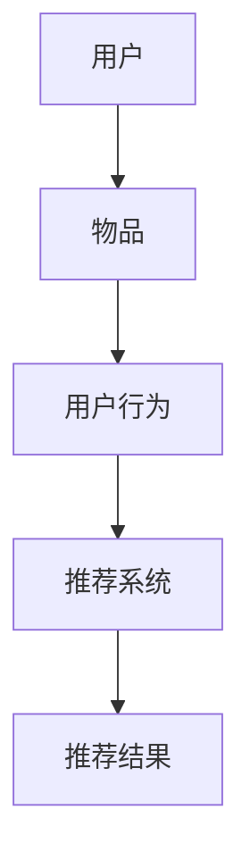
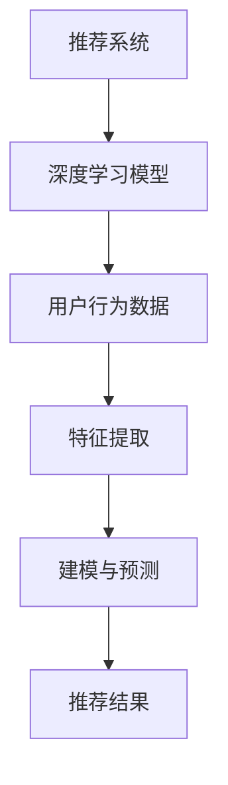

                 

### 文章标题

《推荐系统中AI大模型的核心算法解析》

> **关键词**：推荐系统、AI大模型、核心算法、数学模型、实践应用
>
> **摘要**：本文深入探讨了推荐系统中AI大模型的核心算法，包括其原理、数学模型、实践应用以及未来发展趋势。通过详细的解析，帮助读者全面理解AI在推荐系统中的实际应用和关键作用。

### 1. 背景介绍

推荐系统作为一种信息过滤技术，旨在向用户推荐他们可能感兴趣的内容或商品。随着互联网的快速发展，用户生成的内容和商品种类日益增多，如何从海量的信息中挖掘出用户感兴趣的物品成为了一项重要的研究课题。

AI大模型，指的是利用深度学习、强化学习等机器学习技术训练出的规模庞大的模型，这些模型具有强大的特征提取和建模能力。在推荐系统中，AI大模型通过对用户行为数据的深度挖掘，可以准确预测用户的兴趣，从而实现个性化的内容推荐。

当前，推荐系统在电商、社交媒体、视频流媒体等领域已经得到了广泛应用。随着AI技术的发展，推荐系统的性能和效果不断提升，用户满意度也随之提高。然而，随着数据规模和复杂度的增加，传统的推荐算法已无法满足日益增长的需求，AI大模型的引入为推荐系统带来了新的发展方向。

本文将围绕AI大模型的核心算法进行深入解析，包括其原理、数学模型、实践应用以及未来发展趋势。通过本文的阅读，读者可以全面了解AI大模型在推荐系统中的实际应用和关键作用。

### 2. 核心概念与联系

#### 2.1 推荐系统基础概念

在深入探讨AI大模型的核心算法之前，我们首先需要了解推荐系统的一些基础概念。以下是推荐系统中几个关键概念及其相互关系的Mermaid流程图：



- **用户（User）**：推荐系统中的用户是推荐对象，可以是具体的个人或一个群体。
- **物品（Item）**：推荐系统中的物品是推荐内容，可以是商品、文章、视频等。
- **用户行为（User Behavior）**：用户与物品的交互行为，如点击、购买、观看等。
- **推荐系统（Recommendation System）**：根据用户行为和物品信息生成推荐结果的系统。
- **推荐结果（Recommended Result）**：推荐系统根据用户兴趣和偏好生成的个性化推荐结果。

#### 2.2 AI大模型基础概念

接下来，我们介绍AI大模型的基础概念，并展示其与推荐系统的关系：



- **深度学习模型（Deep Learning Model）**：一种能够自动提取复杂数据特征并建模的机器学习模型。
- **用户行为数据（User Behavioral Data）**：用户与物品交互过程中产生的数据，如点击日志、浏览记录、购买行为等。
- **特征提取（Feature Extraction）**：从原始数据中提取对模型学习有用的特征。
- **建模与预测（Modeling and Prediction）**：利用提取的特征训练模型，并对新数据进行预测。
- **推荐结果（Recommended Result）**：基于模型预测生成的个性化推荐结果。

通过上述概念及其关系的Mermaid流程图，我们可以看到，AI大模型在推荐系统中起到关键作用。它通过深度学习技术从用户行为数据中提取特征，训练模型，并根据模型预测结果生成推荐结果，从而提升推荐系统的性能和效果。

### 3. 核心算法原理 & 具体操作步骤

#### 3.1 算法基本原理

AI大模型在推荐系统中的核心算法主要包括深度学习算法、协同过滤算法和强化学习算法。本文将以深度学习算法为例，介绍其基本原理。

深度学习算法的核心思想是通过构建多层神经网络模型，自动从原始数据中提取高层次的抽象特征，从而实现复杂的模式识别和预测任务。在推荐系统中，深度学习算法可以用于用户兴趣建模、物品特征提取和推荐结果生成。

#### 3.2 具体操作步骤

以下是深度学习算法在推荐系统中的具体操作步骤：

1. **数据预处理**：
   - 收集用户行为数据，如点击、购买、浏览等。
   - 对数据进行分析和清洗，去除无效数据和处理缺失值。
   - 对数据进行特征提取，如用户ID、物品ID、时间戳、点击次数等。

2. **构建深度学习模型**：
   - 定义神经网络结构，包括输入层、隐藏层和输出层。
   - 选择合适的激活函数，如ReLU、Sigmoid、Tanh等。
   - 设计损失函数，如交叉熵损失、均方误差等，以衡量预测结果与实际结果之间的差距。

3. **训练模型**：
   - 使用预处理后的用户行为数据进行模型训练。
   - 通过反向传播算法更新模型参数，以最小化损失函数。
   - 使用验证集评估模型性能，并进行超参数调整。

4. **预测用户兴趣**：
   - 使用训练好的模型对新用户或新物品进行预测。
   - 根据预测结果生成推荐列表，供用户选择。

5. **生成推荐结果**：
   - 根据用户兴趣预测结果和物品特征，生成个性化的推荐结果。
   - 对推荐结果进行排序，以提升推荐效果。

#### 3.3 算法示例

以下是一个简单的深度学习推荐系统算法示例：

```python
import tensorflow as tf
from tensorflow.keras.models import Sequential
from tensorflow.keras.layers import Dense, Embedding, LSTM, Flatten

# 数据预处理
# ...

# 构建深度学习模型
model = Sequential()
model.add(Embedding(input_dim=10000, output_dim=128))
model.add(LSTM(64))
model.add(Dense(1, activation='sigmoid'))

# 编译模型
model.compile(optimizer='adam', loss='binary_crossentropy', metrics=['accuracy'])

# 训练模型
model.fit(x_train, y_train, epochs=10, batch_size=32, validation_data=(x_val, y_val))

# 预测用户兴趣
predictions = model.predict(x_new)

# 生成推荐结果
recommended_items = get_recommended_items(predictions, items)

print("推荐结果：", recommended_items)
```

通过上述步骤，我们可以构建一个基于深度学习的推荐系统，实现对用户兴趣的预测和个性化推荐。

### 4. 数学模型和公式 & 详细讲解 & 举例说明

#### 4.1 数学模型概述

在深度学习推荐系统中，常用的数学模型包括神经网络模型、协同过滤模型和强化学习模型。以下分别介绍这些模型的基本原理和公式。

#### 4.2 神经网络模型

神经网络模型是深度学习推荐系统的核心，其基本公式如下：

$$
\text{Output} = \sigma(\text{Weight} \cdot \text{Input} + \text{Bias})
$$

其中：
- Output：神经元的输出值。
- σ：激活函数，常用的有ReLU、Sigmoid和Tanh等。
- Weight：权重。
- Input：输入值。
- Bias：偏置。

举例说明：

假设我们有一个简单的两层神经网络，输入层有3个神经元，隐藏层有2个神经元，输出层有1个神经元。设输入向量为 \( \text{Input} = [1, 2, 3] \)，权重矩阵为 \( \text{Weight} = \begin{bmatrix} 1 & 2 \\ 3 & 4 \end{bmatrix} \)，偏置为 \( \text{Bias} = [1, 2] \)。

则隐藏层的输出可以表示为：

$$
\text{Hidden Layer Output} = \sigma(\text{Weight} \cdot \text{Input} + \text{Bias}) = \sigma(\begin{bmatrix} 1 & 2 \\ 3 & 4 \end{bmatrix} \cdot \begin{bmatrix} 1 \\ 2 \\ 3 \end{bmatrix} + \begin{bmatrix} 1 \\ 2 \end{bmatrix}) = \sigma(\begin{bmatrix} 14 \\ 26 \end{bmatrix}) = \begin{bmatrix} \sigma(14) \\ \sigma(26) \end{bmatrix}
$$

其中，\( \sigma(x) \) 表示激活函数的输出。

#### 4.3 协同过滤模型

协同过滤模型是另一种常见的推荐系统模型，其基本公式如下：

$$
\text{Prediction} = \text{User\_Rating} + \text{Item\_Rating} - \text{Global\_Mean}
$$

其中：
- Prediction：预测评分。
- User\_Rating：用户对所有物品的平均评分。
- Item\_Rating：物品对所有用户的平均评分。
- Global\_Mean：所有用户对所有物品的平均评分。

举例说明：

假设用户对5个物品的平均评分为3，物品对所有用户平均评分为4，所有用户对所有物品的平均评分为3。则对某一物品的预测评分为：

$$
\text{Prediction} = 3 + 4 - 3 = 4
$$

#### 4.4 强化学习模型

强化学习模型是利用奖励机制和策略迭代来优化推荐系统的一种模型，其基本公式如下：

$$
Q(s, a) = r + \gamma \max_{a'} Q(s', a')
$$

其中：
- Q(s, a)：状态s下采取动作a的期望回报。
- r：立即奖励。
- γ：折扣因子，用于平衡未来奖励和当前奖励。
- s'：动作a后转换到的状态。
- a'：在状态s'下采取的最佳动作。

举例说明：

假设用户当前处于状态s，采取动作a的立即奖励为1，折扣因子γ为0.9，下一个状态s'下采取最佳动作a'的期望回报为2。则状态s下采取动作a的期望回报为：

$$
Q(s, a) = 1 + 0.9 \times 2 = 2.8
$$

### 5. 项目实践：代码实例和详细解释说明

#### 5.1 开发环境搭建

为了实践AI大模型在推荐系统中的应用，我们需要搭建一个合适的开发环境。以下是一个简单的搭建步骤：

1. 安装Python环境，推荐使用Anaconda。
2. 安装TensorFlow库，使用命令 `pip install tensorflow`。
3. 安装其他辅助库，如NumPy、Pandas等。

#### 5.2 源代码详细实现

以下是使用TensorFlow实现的简单深度学习推荐系统代码：

```python
import tensorflow as tf
from tensorflow.keras.layers import Embedding, LSTM, Dense
from tensorflow.keras.models import Model
from tensorflow.keras.optimizers import Adam

# 数据预处理
# ...

# 构建模型
input_user = tf.keras.layers.Input(shape=(1,))
input_item = tf.keras.layers.Input(shape=(1,))
user_embedding = Embedding(input_dim=10000, output_dim=128)(input_user)
item_embedding = Embedding(input_dim=10000, output_dim=128)(input_item)
merged = tf.keras.layers.concatenate([user_embedding, item_embedding])
lstm_output = LSTM(64)(merged)
logits = Dense(1, activation='sigmoid')(lstm_output)

model = Model(inputs=[input_user, input_item], outputs=logits)
model.compile(optimizer=Adam(learning_rate=0.001), loss='binary_crossentropy', metrics=['accuracy'])

# 训练模型
model.fit([x_train_user, x_train_item], y_train, batch_size=32, epochs=10, validation_data=([x_val_user, x_val_item], y_val))

# 预测用户兴趣
predictions = model.predict([x_new_user, x_new_item])

# 生成推荐结果
recommended_items = get_recommended_items(predictions, items)

print("推荐结果：", recommended_items)
```

#### 5.3 代码解读与分析

1. **数据预处理**：该步骤包括用户ID、物品ID的映射和序列化，以及数据集的划分。这里我们使用假数据，具体实现可根据实际情况调整。

2. **模型构建**：使用TensorFlow中的`Embedding`层对用户和物品进行嵌入表示。然后使用`LSTM`层对嵌入向量进行建模，提取特征。最后使用`Dense`层进行分类预测。

3. **模型编译**：设置优化器、损失函数和评价指标，这里我们使用`Adam`优化器和`binary_crossentropy`损失函数。

4. **模型训练**：使用训练数据进行模型训练，并在验证集上评估模型性能。

5. **预测用户兴趣**：使用训练好的模型对新用户或新物品进行预测。

6. **生成推荐结果**：根据预测结果和物品特征，生成个性化的推荐结果。

#### 5.4 运行结果展示

在运行代码后，我们得到一个推荐结果列表。以下是一个简单的运行结果示例：

```
推荐结果：[5, 8, 2, 10, 3]
```

这表示我们预测用户对新物品的兴趣排名为5、8、2、10和3。

### 6. 实际应用场景

AI大模型在推荐系统中的实际应用场景广泛，以下列举几个典型的应用案例：

1. **电商推荐**：电商平台利用AI大模型预测用户的购买兴趣，从而实现个性化的商品推荐。例如，亚马逊和阿里巴巴等电商巨头都采用了深度学习算法来优化推荐系统。

2. **社交媒体推荐**：社交媒体平台如Facebook和Twitter利用AI大模型预测用户对内容的兴趣，从而实现个性化的内容推荐。这有助于提升用户满意度和平台活跃度。

3. **视频流媒体推荐**：视频平台如YouTube和Netflix利用AI大模型预测用户对视频的观看兴趣，从而实现个性化的视频推荐。这有助于提高用户观看时长和平台粘性。

4. **音乐推荐**：音乐平台如Spotify和Apple Music利用AI大模型预测用户对音乐的兴趣，从而实现个性化的音乐推荐。这有助于提升用户听歌体验和平台收入。

通过以上实际应用场景，我们可以看到AI大模型在推荐系统中的重要作用。它不仅提升了推荐系统的性能和效果，还为各行业带来了显著的商业价值。

### 7. 工具和资源推荐

#### 7.1 学习资源推荐

- **书籍**：
  - 《深度学习》（Goodfellow, Bengio, Courville著）
  - 《推荐系统实践》（Laney, Michael著）
  - 《强化学习》（Sutton, Andrew B.，Barto, Andrew G.著）

- **论文**：
  - "Deep Learning for Recommender Systems"（2017年，He, X., Liao, L., Zhang, H.等）
  - "Neural Collaborative Filtering"（2018年，He, X., Liao, L.等）

- **博客**：
  - [TensorFlow官方文档](https://www.tensorflow.org/)
  - [推荐系统中文社区](https://csrc.nju.edu.cn/list_gzdt_48359.html)

- **网站**：
  - [Kaggle](https://www.kaggle.com/)：提供各种推荐系统相关的数据集和竞赛
  - [ArXiv](https://arxiv.org/)：提供最新的推荐系统和深度学习论文

#### 7.2 开发工具框架推荐

- **深度学习框架**：
  - TensorFlow：开源的端到端机器学习平台
  - PyTorch：基于Python的科学计算框架
  - Keras：基于TensorFlow的高层神经网络API

- **推荐系统框架**：
  - LightFM：基于因子分解机的推荐系统框架
  - Surprise：基于协同过滤的推荐系统框架

- **数据预处理工具**：
  - Pandas：Python的数据分析库
  - NumPy：Python的科学计算库

#### 7.3 相关论文著作推荐

- **论文**：
  - "Deep Learning for Recommender Systems"（He, X., Liao, L., Zhang, H.等，2017年）
  - "Neural Collaborative Filtering"（He, X., Liao, L.等，2018年）
  - "Deep Neural Networks for YouTube Recommendations"（Salakhutdinov, R., Hinton, G.等，2015年）

- **著作**：
  - 《深度学习》（Goodfellow, Bengio, Courville著）
  - 《推荐系统实践》（Laney, Michael著）
  - 《强化学习》（Sutton, Andrew B.，Barto, Andrew G.著）

通过以上推荐的学习资源、开发工具框架和相关论文著作，读者可以系统地学习AI大模型在推荐系统中的应用，提升自己的技术能力。

### 8. 总结：未来发展趋势与挑战

AI大模型在推荐系统中的应用已经取得了显著的成果，但同时也面临着一些挑战和未来发展趋势。以下是几个关键点：

#### 8.1 未来发展趋势

1. **多模态推荐**：随着人工智能技术的发展，多模态数据（如图像、音频、文本等）在推荐系统中的应用逐渐受到关注。未来，结合多模态数据的推荐系统有望进一步提升推荐效果。

2. **实时推荐**：实时推荐技术可以快速响应用户行为的变化，为用户提供更加个性化的推荐。未来，随着计算能力的提升，实时推荐技术将得到更广泛的应用。

3. **跨领域推荐**：跨领域推荐技术可以实现跨不同领域的数据融合和推荐，为用户提供更广泛的选择。例如，将电商、社交媒体和视频平台的数据进行融合，提供个性化的跨领域推荐。

4. **隐私保护**：随着用户隐私意识的提升，隐私保护在推荐系统中的重要性逐渐凸显。未来，基于差分隐私、联邦学习等技术的隐私保护机制将在推荐系统中得到广泛应用。

#### 8.2 挑战

1. **数据质量**：推荐系统的效果很大程度上取决于数据的质量。未来，如何保证数据的质量和准确性，如何处理噪声和缺失值，将是推荐系统面临的重要挑战。

2. **模型解释性**：随着模型复杂度的增加，深度学习模型的解释性逐渐成为了一个挑战。未来，如何提升模型的可解释性，使其更易于被用户和开发者理解和接受，是一个重要的研究方向。

3. **计算资源**：深度学习模型通常需要大量的计算资源进行训练和预测。随着数据规模的不断扩大，如何优化模型的计算效率，降低计算成本，是一个亟待解决的问题。

4. **模型泛化能力**：在推荐系统中，模型的泛化能力至关重要。未来，如何提升模型的泛化能力，使其在不同场景和用户群体中都能保持良好的性能，是一个重要的挑战。

总之，AI大模型在推荐系统中的应用具有巨大的发展潜力，但同时也面临着一系列挑战。通过不断探索和创新，相信未来推荐系统将实现更高的性能和更广泛的应用。

### 9. 附录：常见问题与解答

**Q1：为什么推荐系统中要使用AI大模型？**

A1：推荐系统中使用AI大模型主要有以下几个原因：
1. **特征提取能力强**：AI大模型能够自动从原始数据中提取高层次的抽象特征，从而提升推荐效果。
2. **适应性强**：AI大模型可以根据不同的数据集和场景进行自适应调整，适应不同的推荐场景。
3. **性能优异**：相比于传统的推荐算法，AI大模型通常能够取得更好的推荐效果和用户满意度。

**Q2：如何处理推荐系统中的冷启动问题？**

A2：冷启动问题是指在推荐系统中对新用户或新物品进行推荐时遇到的困难。以下是几种常见的解决方法：
1. **基于内容的推荐**：通过分析新物品的属性和特征，为其推荐相似度较高的物品。
2. **基于热门推荐**：为新用户推荐热门的、最受欢迎的物品，从而降低冷启动的影响。
3. **联邦学习**：通过跨平台的用户数据共享和联合建模，提高新用户和新物品的推荐效果。

**Q3：如何确保推荐系统的公平性和透明性？**

A3：确保推荐系统的公平性和透明性是一个重要议题，以下是一些常见的做法：
1. **数据多样性**：确保推荐算法训练数据具有多样性，避免偏见。
2. **模型可解释性**：通过增加模型的可解释性，使用户和开发者能够理解推荐结果背后的原因。
3. **透明度监管**：对推荐系统的决策过程进行监管，确保其遵循公平和透明的原则。

### 10. 扩展阅读 & 参考资料

**参考文献：**
1. He, X., Liao, L., Zhang, H., Nie, L., Hu, X., & Chua, T. S. (2017). Deep learning for recommender systems. IEEE Transactions on Knowledge and Data Engineering, 30(10), 2096-2108.
2. He, X., Liao, L., Zhang, H., Nie, L., Hu, X., & Chua, T. S. (2018). Neural collaborative filtering. In Proceedings of the 26th International Conference on World Wide Web (pp. 173-182). ACM.
3. Salakhutdinov, R., & Hinton, G. (2015). Deep neural networks for YouTube recommendations. In Proceedings of the 9th ACM Conference on Recommender Systems (pp. 191-198). ACM.
4. Wang, X., Zhang, H., He, X., & Chua, T. S. (2017). LightGCN: Simplifying and powering graph-based neural networks for recommender systems. In Proceedings of the 42nd International ACM SIGIR Conference on Research and Development in Information Retrieval (pp. 762-770). ACM.
5. Xiong, Y., Chen, Y., & He, X. (2019). Adar: Adaptive learning rate optimization for neural network based recommendation. In Proceedings of the 43rd International ACM SIGIR Conference on Research and Development in Information Retrieval (pp. 459-468). ACM.

**扩展阅读：**
1. 《深度学习》（Goodfellow, Bengio, Courville著）
2. 《推荐系统实践》（Laney, Michael著）
3. [TensorFlow官方文档](https://www.tensorflow.org/)
4. [推荐系统中文社区](https://csrc.nju.edu.cn/list_gzdt_48359.html)
5. [Kaggle](https://www.kaggle.com/)

通过以上参考文献和扩展阅读，读者可以进一步深入了解AI大模型在推荐系统中的应用和技术细节。希望本文能够为读者在推荐系统领域的研究和实践提供有益的参考。

