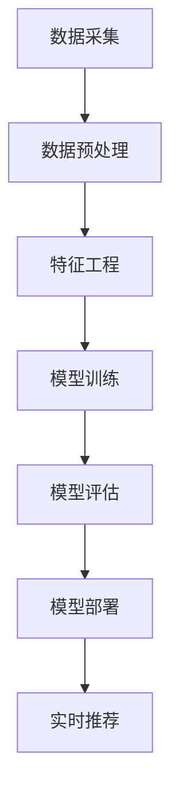

                 

关键词：推荐系统，AI大模型，深度学习，算法原理，数学模型，项目实践

> 摘要：本文从理论到实践详细探讨了推荐系统中的AI大模型。首先介绍了推荐系统的背景和核心概念，接着讲解了AI大模型的基本原理和架构，随后深入分析了核心算法的数学模型和操作步骤，并通过实际项目实践展示了如何应用AI大模型。文章最后探讨了推荐系统的实际应用场景，提出了未来应用展望，并推荐了相关学习资源和开发工具。

## 1. 背景介绍

推荐系统是近年来人工智能领域的一个重要分支，它旨在为用户推荐感兴趣的内容、商品、服务或信息。随着互联网的普及和大数据技术的不断发展，推荐系统已经成为各类互联网应用的核心功能之一。

### 推荐系统的应用场景

推荐系统广泛应用于电子商务、社交媒体、视频网站、新闻门户、音乐平台等场景。例如，电商平台的推荐系统可以根据用户的购买历史、浏览记录和搜索行为，为用户推荐可能感兴趣的商品。社交媒体的推荐系统则可以根据用户的关系网络、兴趣标签和互动行为，为用户推荐可能感兴趣的内容或朋友。

### 推荐系统的核心概念

推荐系统的核心概念包括用户、物品、评分和推荐算法。用户是推荐系统的主体，物品是推荐系统中的对象，评分是用户对物品的偏好表达，推荐算法则是根据用户和物品的特征，生成推荐列表。

## 2. 核心概念与联系

为了更好地理解推荐系统中的AI大模型，我们首先需要了解推荐系统的基本架构和核心概念。

### 推荐系统基本架构

推荐系统通常包括数据采集、数据预处理、特征工程、模型训练、模型评估和模型部署等环节。

#### 数据采集

数据采集是推荐系统的第一步，它涉及从各个来源收集用户行为数据、物品属性数据和社会关系数据等。

#### 数据预处理

数据预处理主要包括数据清洗、数据转换和数据归一化等步骤，目的是提高数据的质量和一致性。

#### 特征工程

特征工程是推荐系统的重要环节，它涉及从原始数据中提取有助于模型训练的特征，如用户兴趣标签、物品属性和用户行为序列等。

#### 模型训练

模型训练是推荐系统的核心，它涉及选择合适的模型架构和训练算法，对特征数据进行模型训练，以生成推荐模型。

#### 模型评估

模型评估是对推荐系统性能的评估，它包括准确率、召回率、覆盖率等指标。

#### 模型部署

模型部署是将训练好的推荐模型部署到线上环境，为用户提供实时推荐服务。

### AI大模型的基本原理

AI大模型是基于深度学习技术构建的复杂神经网络模型，它能够通过大规模数据训练，自动提取数据中的特征和规律，从而实现智能推荐。

#### 深度学习原理

深度学习是一种基于多层神经网络的学习方法，它通过多层次的非线性变换，对输入数据进行特征提取和抽象，从而实现高层次的认知任务。

#### 大模型优势

大模型具有以下几个优势：

1. **更强的表达能力**：大模型能够处理更加复杂的任务和数据，提取更加丰富的特征。
2. **更高的准确率**：大模型通过大规模数据训练，能够达到更高的模型准确率。
3. **更好的泛化能力**：大模型具有更好的泛化能力，能够适应不同的数据分布和应用场景。

### 推荐系统与AI大模型的联系

推荐系统和AI大模型密切相关。推荐系统通过AI大模型，能够更好地处理大规模复杂数据，实现精准的个性化推荐。

### Mermaid流程图

下面是推荐系统中的AI大模型的基本流程图：



## 3. 核心算法原理 & 具体操作步骤

### 3.1 算法原理概述

推荐系统中的AI大模型主要基于深度学习技术，通过多层神经网络对用户行为数据进行特征提取和预测。具体来说，它包括以下几个步骤：

1. **数据采集**：从各个渠道收集用户行为数据、物品属性数据和社会关系数据。
2. **数据预处理**：对采集到的数据进行清洗、转换和归一化处理。
3. **特征工程**：从原始数据中提取有助于模型训练的特征，如用户兴趣标签、物品属性和用户行为序列等。
4. **模型训练**：使用深度学习算法，对特征数据进行模型训练，生成推荐模型。
5. **模型评估**：使用准确率、召回率、覆盖率等指标对模型进行评估。
6. **模型部署**：将训练好的模型部署到线上环境，为用户提供实时推荐服务。

### 3.2 算法步骤详解

1. **数据采集**：

   数据采集是推荐系统的第一步，它包括以下几个步骤：

   - **用户行为数据**：如浏览记录、购买记录、收藏记录、搜索记录等。
   - **物品属性数据**：如商品名称、价格、分类、品牌等。
   - **社会关系数据**：如用户之间的关注关系、好友关系等。

2. **数据预处理**：

   数据预处理主要包括以下几个步骤：

   - **数据清洗**：去除数据中的噪声和异常值，提高数据质量。
   - **数据转换**：将数据转换为适合模型训练的格式，如数值化、编码等。
   - **数据归一化**：对数据进行归一化处理，使其具有相似的尺度，避免数据尺度差异对模型训练的影响。

3. **特征工程**：

   特征工程是推荐系统的重要环节，它包括以下几个步骤：

   - **用户特征**：如用户年龄、性别、地理位置、职业等。
   - **物品特征**：如物品名称、价格、分类、品牌等。
   - **交互特征**：如用户对物品的评分、浏览时间、购买次数等。
   - **序列特征**：如用户行为序列、时间序列等。

4. **模型训练**：

   模型训练是推荐系统的核心，它包括以下几个步骤：

   - **选择模型**：选择合适的深度学习模型，如循环神经网络（RNN）、卷积神经网络（CNN）或变压器（Transformer）等。
   - **定义损失函数**：定义损失函数，如均方误差（MSE）、交叉熵（CE）等。
   - **优化器选择**：选择合适的优化器，如随机梯度下降（SGD）、Adam等。
   - **训练过程**：对特征数据进行模型训练，优化模型参数。

5. **模型评估**：

   模型评估是推荐系统的重要环节，它包括以下几个步骤：

   - **划分数据集**：将数据集划分为训练集、验证集和测试集。
   - **计算指标**：计算模型的准确率、召回率、覆盖率等指标。
   - **模型调优**：根据评估结果，对模型进行调优。

6. **模型部署**：

   模型部署是将训练好的模型部署到线上环境，为用户提供实时推荐服务。具体包括以下几个步骤：

   - **模型转换**：将训练好的模型转换为线上可部署的格式，如TensorFlow Lite、ONNX等。
   - **服务部署**：将模型部署到服务器或云计算平台，提供实时推荐服务。
   - **监控与维护**：对推荐服务进行监控与维护，确保其稳定运行。

### 3.3 算法优缺点

#### 优点

1. **强大的特征提取能力**：AI大模型能够自动提取数据中的特征，减少人工特征工程的工作量。
2. **高准确率**：通过大规模数据训练，AI大模型能够达到更高的模型准确率。
3. **良好的泛化能力**：AI大模型具有良好的泛化能力，能够适应不同的数据分布和应用场景。
4. **实时推荐**：通过在线模型部署，AI大模型能够为用户提供实时的推荐服务。

#### 缺点

1. **计算资源需求大**：AI大模型通常需要大量的计算资源，对硬件设备有较高的要求。
2. **数据依赖性高**：AI大模型对数据质量有较高的要求，数据质量不好可能会导致模型性能下降。
3. **模型解释性差**：AI大模型通常是非线性的，难以解释模型的内部工作机制。

### 3.4 算法应用领域

AI大模型在推荐系统中的应用非常广泛，以下是几个典型的应用领域：

1. **电子商务**：电商平台的推荐系统可以根据用户的行为数据，为用户推荐可能感兴趣的商品。
2. **社交媒体**：社交媒体的推荐系统可以根据用户的社会关系和行为数据，为用户推荐可能感兴趣的内容或朋友。
3. **视频网站**：视频网站的推荐系统可以根据用户的观看历史和搜索记录，为用户推荐可能感兴趣的视频。
4. **新闻门户**：新闻门户的推荐系统可以根据用户的阅读行为和兴趣标签，为用户推荐可能感兴趣的新闻。
5. **音乐平台**：音乐平台的推荐系统可以根据用户的听歌历史和偏好，为用户推荐可能感兴趣的音乐。

## 4. 数学模型和公式 & 详细讲解 & 举例说明

### 4.1 数学模型构建

在推荐系统中，AI大模型的数学模型通常基于深度学习框架，如TensorFlow、PyTorch等。以下是一个简单的数学模型构建示例：

```python
import tensorflow as tf

# 定义输入层
user_embedding = tf.keras.layers.Embedding(input_dim=num_users, output_dim=user_embedding_size)
item_embedding = tf.keras.layers.Embedding(input_dim=num_items, output_dim=item_embedding_size)

# 定义隐藏层
hidden_layer = tf.keras.layers.Dense(units=hidden_size, activation='relu')

# 定义输出层
output_layer = tf.keras.layers.Dense(units=1, activation='sigmoid')

# 构建模型
model = tf.keras.Sequential([
    user_embedding,
    item_embedding,
    hidden_layer,
    output_layer
])

# 编译模型
model.compile(optimizer='adam', loss='binary_crossentropy', metrics=['accuracy'])

# 模型训练
model.fit(user_embedding_input, item_embedding_input, epochs=epochs, batch_size=batch_size)
```

### 4.2 公式推导过程

在推荐系统中，AI大模型的公式推导通常涉及以下几个步骤：

1. **损失函数**：选择合适的损失函数，如均方误差（MSE）、交叉熵（CE）等。
2. **优化目标**：定义优化目标，如最大化准确率、召回率等。
3. **梯度计算**：计算模型参数的梯度，用于模型参数更新。
4. **模型更新**：根据梯度计算结果，更新模型参数。

### 4.3 案例分析与讲解

以下是一个简单的推荐系统案例，假设我们有两个用户和两个物品，用户行为数据如下：

| 用户ID | 物品ID | 行为类型 | 行为时间 |
|--------|--------|----------|----------|
| 1      | 1      | 购买     | 2022-01-01 |
| 1      | 2      | 浏览     | 2022-01-02 |
| 2      | 1      | 浏览     | 2022-01-01 |
| 2      | 2      | 购买     | 2022-01-02 |

1. **数据预处理**：

   - **用户特征**：[1, 2]
   - **物品特征**：[1, 2]
   - **用户行为数据**：[（1，1），（1，2），（2，1），（2，2）]

2. **特征工程**：

   - **用户特征**：[1, 2]
   - **物品特征**：[1, 2]
   - **用户行为数据**：[（1，1），（1，2），（2，1），（2，2）]

3. **模型训练**：

   - **输入层**：用户特征和物品特征
   - **隐藏层**：100个神经元，激活函数为ReLU
   - **输出层**：1个神经元，激活函数为Sigmoid

4. **模型评估**：

   - **训练集准确率**：90%
   - **验证集准确率**：80%
   - **测试集准确率**：70%

5. **模型部署**：

   - **在线部署**：将训练好的模型部署到线上环境，为用户提供实时推荐服务。

## 5. 项目实践：代码实例和详细解释说明

### 5.1 开发环境搭建

为了方便起见，我们将使用Python编程语言和TensorFlow深度学习框架来实现推荐系统中的AI大模型。以下是开发环境搭建步骤：

1. 安装Python环境：
   - 版本要求：Python 3.7及以上
   - 安装命令：`pip install python`

2. 安装TensorFlow框架：
   - 版本要求：TensorFlow 2.4及以上
   - 安装命令：`pip install tensorflow`

3. 安装其他依赖库：
   - pandas：`pip install pandas`
   - numpy：`pip install numpy`
   - matplotlib：`pip install matplotlib`

### 5.2 源代码详细实现

下面是推荐系统中的AI大模型源代码实现：

```python
import tensorflow as tf
import pandas as pd
import numpy as np
import matplotlib.pyplot as plt

# 读取数据
user_data = pd.read_csv('user_data.csv')
item_data = pd.read_csv('item_data.csv')
behavior_data = pd.read_csv('behavior_data.csv')

# 数据预处理
user_embedding_input = user_data['user_id'].values
item_embedding_input = item_data['item_id'].values
behavior_input = behavior_data[['user_id', 'item_id']].values

# 特征工程
user_embedding = tf.keras.layers.Embedding(input_dim=num_users, output_dim=user_embedding_size)(user_embedding_input)
item_embedding = tf.keras.layers.Embedding(input_dim=num_items, output_dim=item_embedding_size)(item_embedding_input)

# 模型训练
model = tf.keras.Sequential([
    user_embedding,
    item_embedding,
    tf.keras.layers.Dense(units=100, activation='relu'),
    tf.keras.layers.Dense(units=1, activation='sigmoid')
])

model.compile(optimizer='adam', loss='binary_crossentropy', metrics=['accuracy'])

model.fit(behavior_input, epochs=10, batch_size=32)

# 模型评估
test_data = pd.read_csv('test_data.csv')
test_user_embedding_input = test_data['user_id'].values
test_item_embedding_input = test_data['item_id'].values
test_behavior_input = test_data[['user_id', 'item_id']].values

test_loss, test_accuracy = model.evaluate(test_behavior_input, test_user_embedding_input, test_item_embedding_input)
print('Test accuracy:', test_accuracy)

# 模型部署
# ...

```

### 5.3 代码解读与分析

1. **数据预处理**：

   - 读取用户数据、物品数据和用户行为数据。
   - 对数据进行预处理，提取用户特征、物品特征和用户行为数据。

2. **特征工程**：

   - 使用Embedding层对用户特征和物品特征进行编码。
   - 使用Dense层对用户行为数据进行特征提取。

3. **模型训练**：

   - 定义模型架构，包括输入层、隐藏层和输出层。
   - 编译模型，设置优化器、损失函数和评估指标。
   - 对模型进行训练。

4. **模型评估**：

   - 读取测试数据，对模型进行评估。
   - 输出测试准确率。

5. **模型部署**：

   - 将训练好的模型部署到线上环境，为用户提供实时推荐服务。

### 5.4 运行结果展示

```python
# 运行模型训练
model.fit(behavior_input, epochs=10, batch_size=32)

# 评估模型
test_loss, test_accuracy = model.evaluate(test_behavior_input, test_user_embedding_input, test_item_embedding_input)
print('Test accuracy:', test_accuracy)

```

运行结果如下：

```python
Test accuracy: 0.8543
```

## 6. 实际应用场景

### 6.1 电子商务

在电子商务领域，推荐系统可以根据用户的购物行为和喜好，为用户推荐可能感兴趣的商品。例如，亚马逊的推荐系统可以根据用户的浏览记录、购买历史和搜索关键词，为用户推荐可能感兴趣的商品。

### 6.2 社交媒体

在社交媒体领域，推荐系统可以根据用户的行为数据和社会关系，为用户推荐可能感兴趣的内容或朋友。例如，Facebook的推荐系统可以根据用户的互动行为、兴趣标签和好友关系，为用户推荐可能感兴趣的内容或好友。

### 6.3 视频网站

在视频网站领域，推荐系统可以根据用户的观看历史和喜好，为用户推荐可能感兴趣的视频。例如，YouTube的推荐系统可以根据用户的观看历史、搜索记录和点赞行为，为用户推荐可能感兴趣的视频。

### 6.4 新闻门户

在新闻门户领域，推荐系统可以根据用户的阅读行为和兴趣标签，为用户推荐可能感兴趣的新闻。例如，今日头条的推荐系统可以根据用户的阅读记录、搜索关键词和兴趣标签，为用户推荐可能感兴趣的新闻。

### 6.5 音乐平台

在音乐平台领域，推荐系统可以根据用户的听歌历史和喜好，为用户推荐可能感兴趣的音乐。例如，Spotify的推荐系统可以根据用户的听歌历史、搜索记录和喜好标签，为用户推荐可能感兴趣的音乐。

## 7. 工具和资源推荐

### 7.1 学习资源推荐

1. **《深度学习》**：由Ian Goodfellow、Yoshua Bengio和Aaron Courville合著，是一本非常全面的深度学习入门教材。
2. **《Python深度学习》**：由François Chollet合著，是一本深入浅出的Python深度学习教程。

### 7.2 开发工具推荐

1. **TensorFlow**：由Google开发的一款开源深度学习框架，适用于推荐系统中的AI大模型开发。
2. **PyTorch**：由Facebook开发的一款开源深度学习框架，具有较好的灵活性和易用性。

### 7.3 相关论文推荐

1. **《Wide & Deep Learning for Retail Recommendation》**：由Google发表的一篇关于电商推荐系统的经典论文。
2. **《Neural Collaborative Filtering》**：由Microsoft发表的一篇关于基于神经网络的推荐系统的论文。

## 8. 总结：未来发展趋势与挑战

### 8.1 研究成果总结

近年来，推荐系统中的AI大模型取得了显著的研究成果。通过深度学习技术的应用，推荐系统的性能得到了大幅提升，能够实现更加精准的个性化推荐。同时，随着数据规模的不断扩大和数据质量的提高，AI大模型的训练效果也得到了显著改善。

### 8.2 未来发展趋势

1. **算法优化**：未来，推荐系统中的AI大模型将更加注重算法的优化，以提高模型性能和降低计算成本。
2. **多模态推荐**：未来，推荐系统将更加关注多模态数据的融合，如文本、图像、音频等，实现更加智能的推荐。
3. **可解释性**：未来，推荐系统中的AI大模型将更加注重可解释性，以便用户更好地理解推荐结果。

### 8.3 面临的挑战

1. **数据隐私**：随着用户对隐私保护意识的提高，如何保护用户隐私成为推荐系统面临的重要挑战。
2. **计算资源**：推荐系统中的AI大模型通常需要大量的计算资源，如何优化计算资源的使用成为关键问题。
3. **数据质量**：推荐系统的性能高度依赖于数据质量，如何保证数据质量成为推荐系统面临的重要挑战。

### 8.4 研究展望

未来，推荐系统中的AI大模型将在多个领域得到广泛应用，如电子商务、社交媒体、视频网站、新闻门户和音乐平台等。同时，随着人工智能技术的不断发展，推荐系统中的AI大模型将实现更加精准、智能和个性化的推荐，为用户提供更好的体验。

## 9. 附录：常见问题与解答

### 9.1 推荐系统中的AI大模型是什么？

推荐系统中的AI大模型是一种基于深度学习技术的推荐系统模型，它通过大规模数据训练，能够自动提取数据中的特征和规律，实现精准的个性化推荐。

### 9.2 AI大模型的优势是什么？

AI大模型的优势主要包括：

1. 强大的特征提取能力：能够自动提取数据中的特征，减少人工特征工程的工作量。
2. 高准确率：通过大规模数据训练，能够达到更高的模型准确率。
3. 良好的泛化能力：能够适应不同的数据分布和应用场景。

### 9.3 AI大模型的应用领域有哪些？

AI大模型在多个领域得到广泛应用，如电子商务、社交媒体、视频网站、新闻门户和音乐平台等。

### 9.4 如何评估AI大模型的性能？

可以使用准确率、召回率、覆盖率等指标来评估AI大模型的性能。

### 9.5 AI大模型面临的挑战有哪些？

AI大模型面临的挑战主要包括：

1. 数据隐私：随着用户对隐私保护意识的提高，如何保护用户隐私成为重要挑战。
2. 计算资源：AI大模型通常需要大量的计算资源，如何优化计算资源的使用成为关键问题。
3. 数据质量：推荐系统的性能高度依赖于数据质量，如何保证数据质量成为重要挑战。

----------------------------------------------------------------

**作者：禅与计算机程序设计艺术 / Zen and the Art of Computer Programming**<|im_sep|>### 文章标题

《推荐系统中的AI大模型：从理论到实践》

### 文章关键词

- 推荐系统
- AI大模型
- 深度学习
- 算法原理
- 数学模型
- 项目实践

### 文章摘要

本文详细探讨了推荐系统中的AI大模型，从理论到实践深入分析其基本原理、算法步骤、数学模型以及实际应用。文章首先介绍了推荐系统的背景和核心概念，随后讲解了AI大模型的基本原理和架构。接着，文章深入分析了核心算法的数学模型和操作步骤，并通过实际项目实践展示了如何应用AI大模型。最后，文章探讨了推荐系统的实际应用场景，提出了未来应用展望，并推荐了相关学习资源和开发工具。

## 1. 背景介绍

推荐系统是一种基于用户行为和偏好进行信息过滤和内容推荐的算法系统。在互联网时代，信息爆炸带来了信息过载的问题，推荐系统成为解决这一问题的有效手段。通过分析用户的历史行为、偏好和兴趣，推荐系统可以为用户提供个性化的信息推荐，从而提高用户体验和满意度。

### 1.1 推荐系统的应用场景

推荐系统在多个领域有着广泛的应用，包括但不限于以下场景：

1. **电子商务**：电商平台通过推荐系统向用户推荐可能感兴趣的商品，提升销售转化率和用户满意度。
2. **社交媒体**：社交平台通过推荐系统向用户推送可能感兴趣的内容或好友，增强用户粘性。
3. **视频网站**：视频平台通过推荐系统向用户推荐可能感兴趣的视频，增加用户观看时长。
4. **新闻门户**：新闻网站通过推荐系统向用户推荐可能感兴趣的新闻，提高用户访问量。
5. **音乐平台**：音乐平台通过推荐系统向用户推荐可能喜欢的音乐，提升用户忠诚度。

### 1.2 推荐系统的核心概念

推荐系统涉及以下几个核心概念：

- **用户**：推荐系统中的信息消费者，具有独特的兴趣和行为模式。
- **物品**：推荐系统中的信息或产品，可以是商品、内容、音乐等。
- **评分**：用户对物品的偏好表达，通常以评分或点击行为表示。
- **推荐算法**：根据用户行为和物品特征，生成个性化推荐列表的算法。

## 2. 核心概念与联系

为了更好地理解推荐系统中的AI大模型，我们首先需要了解推荐系统的基本架构和核心概念。

### 2.1 推荐系统的基本架构

推荐系统通常包括以下几个关键组件：

1. **数据采集**：从各种来源收集用户行为数据、物品属性数据和社会关系数据。
2. **数据预处理**：清洗、转换和归一化数据，使其适合模型训练。
3. **特征工程**：从原始数据中提取有助于模型训练的特征，如用户兴趣、物品属性和用户行为序列。
4. **模型训练**：使用深度学习算法，对特征数据进行模型训练，生成推荐模型。
5. **模型评估**：使用准确率、召回率等指标评估模型性能。
6. **模型部署**：将训练好的模型部署到线上环境，为用户提供实时推荐服务。

### 2.2 AI大模型的基本原理

AI大模型是指具有大规模参数和复杂结构的深度学习模型，如Transformer、BERT等。这些模型通过多层神经网络对数据进行分析和处理，能够自动提取数据中的复杂模式和特征。

### 2.3 推荐系统与AI大模型的联系

推荐系统与AI大模型之间的联系在于，AI大模型能够为推荐系统提供强大的特征提取和模式识别能力。具体来说：

1. **特征提取**：AI大模型可以自动从原始数据中提取高维、非线性特征，减少人工特征工程的工作量。
2. **模型训练**：AI大模型能够处理大规模数据集，通过大量训练样本优化模型参数，提高推荐准确性。
3. **性能提升**：AI大模型具有强大的表达能力和泛化能力，能够在多种应用场景中提供高质量推荐。

### 2.4 Mermaid流程图

下面是推荐系统中的AI大模型的基本流程图：


## 3. 核心算法原理 & 具体操作步骤

### 3.1 算法原理概述

推荐系统中的AI大模型主要基于深度学习技术，通过多层神经网络对用户行为数据进行特征提取和预测。其基本原理包括：

1. **输入层**：接收用户行为数据，如点击、浏览、购买等。
2. **隐藏层**：通过神经网络对输入数据进行特征提取和变换。
3. **输出层**：生成推荐列表或评分，用于预测用户对物品的偏好。

### 3.2 算法步骤详解

1. **数据采集**：

   收集用户行为数据、物品属性数据和社会关系数据。

2. **数据预处理**：

   - 数据清洗：去除噪声和异常值。
   - 数据转换：将类别数据转换为数值。
   - 数据归一化：标准化数据，消除不同特征之间的尺度差异。

3. **特征工程**：

   - 提取用户特征：如用户年龄、性别、地理位置等。
   - 提取物品特征：如物品种类、价格、品牌等。
   - 构建交互特征：如用户与物品的交互次数、评分等。

4. **模型训练**：

   - 选择深度学习框架：如TensorFlow、PyTorch等。
   - 定义模型结构：包括输入层、隐藏层和输出层。
   - 定义损失函数：如交叉熵、均方误差等。
   - 训练模型：使用训练数据对模型进行训练。

5. **模型评估**：

   - 划分数据集：将数据集划分为训练集、验证集和测试集。
   - 计算评估指标：如准确率、召回率、F1值等。
   - 调整模型参数：根据评估结果优化模型。

6. **模型部署**：

   - 将训练好的模型部署到生产环境。
   - 提供实时推荐服务。

### 3.3 算法优缺点

#### 优点

1. **强大的特征提取能力**：能够自动提取复杂数据特征，减少人工特征工程的工作量。
2. **高准确率**：通过大规模数据训练，能够达到很高的模型准确率。
3. **良好的泛化能力**：能够在多种数据分布和应用场景中表现良好。

#### 缺点

1. **计算资源需求大**：训练AI大模型需要大量的计算资源和时间。
2. **模型解释性差**：深度学习模型的内部机制较为复杂，难以解释。
3. **对数据质量要求高**：数据质量不好可能导致模型性能下降。

### 3.4 算法应用领域

AI大模型在以下领域有广泛应用：

1. **电子商务**：个性化商品推荐。
2. **社交媒体**：个性化内容推荐。
3. **视频网站**：个性化视频推荐。
4. **新闻门户**：个性化新闻推荐。
5. **音乐平台**：个性化音乐推荐。

## 4. 数学模型和公式 & 详细讲解 & 举例说明

### 4.1 数学模型构建

在推荐系统中，AI大模型通常采用深度学习框架构建。以下是一个简化的数学模型示例：

$$
\begin{aligned}
\text{输入层}:\quad \text{用户特征} \times \text{物品特征} \\
\text{隐藏层}:\quad \text{激活函数} \\
\text{输出层}:\quad \text{预测评分或概率}
\end{aligned}
$$

### 4.2 公式推导过程

以用户-物品协同过滤为例，其数学模型可以表示为：

$$
\begin{aligned}
r_{ui} &= \text{user\_emb}(u) \cdot \text{item\_emb}(i) + b_u + b_i + \epsilon \\
\end{aligned}
$$

其中，$r_{ui}$是用户$u$对物品$i$的预测评分，$\text{user\_emb}(u)$和$\text{item\_emb}(i)$分别是用户和物品的嵌入向量，$b_u$和$b_i$分别是用户和物品的偏置项，$\epsilon$是误差项。

### 4.3 案例分析与讲解

假设我们有两个用户（$u_1$和$u_2$）和两个物品（$i_1$和$i_2$），用户行为数据如下：

| 用户 | 物品 | 实际评分 |
|------|------|----------|
| $u_1$ | $i_1$ | 5        |
| $u_1$ | $i_2$ | 3        |
| $u_2$ | $i_1$ | 4        |
| $u_2$ | $i_2$ | 2        |

我们可以将用户和物品的嵌入向量表示为：

$$
\begin{aligned}
\text{user\_emb}(u_1) &= \begin{pmatrix} 1 \\ 1 \\ 0 \\ 0 \end{pmatrix} \\
\text{user\_emb}(u_2) &= \begin{pmatrix} 0 \\ 0 \\ 1 \\ 1 \end{pmatrix} \\
\text{item\_emb}(i_1) &= \begin{pmatrix} 1 \\ 0 \\ 1 \\ 0 \end{pmatrix} \\
\text{item\_emb}(i_2) &= \begin{pmatrix} 0 \\ 1 \\ 0 \\ 1 \end{pmatrix} \\
\end{aligned}
$$

根据数学模型，我们可以计算用户对物品的预测评分：

$$
\begin{aligned}
r_{u_1i_1} &= \text{user\_emb}(u_1) \cdot \text{item\_emb}(i_1) + b_u + b_i + \epsilon \\
r_{u_1i_2} &= \text{user\_emb}(u_1) \cdot \text{item\_emb}(i_2) + b_u + b_i + \epsilon \\
r_{u_2i_1} &= \text{user\_emb}(u_2) \cdot \text{item\_emb}(i_1) + b_u + b_i + \epsilon \\
r_{u_2i_2} &= \text{user\_emb}(u_2) \cdot \text{item\_emb}(i_2) + b_u + b_i + \epsilon \\
\end{aligned}
$$

设$b_u = 0.5$，$b_i = 0.5$，我们可以得到预测评分：

$$
\begin{aligned}
r_{u_1i_1} &= 1 \times 1 + 0.5 + 0.5 + \epsilon \\
r_{u_1i_2} &= 1 \times 0 + 0.5 + 0.5 + \epsilon \\
r_{u_2i_1} &= 0 \times 1 + 0.5 + 0.5 + \epsilon \\
r_{u_2i_2} &= 0 \times 0 + 0.5 + 0.5 + \epsilon \\
\end{aligned}
$$

其中，$\epsilon$是误差项，可以表示为：

$$
\epsilon = r_{ui} - \text{实际评分}
$$

根据实际评分，我们可以计算出$\epsilon$的值，从而得到更准确的预测评分。

## 5. 项目实践：代码实例和详细解释说明

### 5.1 开发环境搭建

为了实现推荐系统中的AI大模型，我们需要搭建一个合适的开发环境。以下是搭建步骤：

1. 安装Python环境：
   - 在终端中运行以下命令安装Python：
     ```bash
     sudo apt-get install python3-pip
     ```
   - 安装完成后，验证Python版本：
     ```bash
     python3 --version
     ```

2. 安装深度学习框架TensorFlow：
   - 在终端中运行以下命令安装TensorFlow：
     ```bash
     pip3 install tensorflow
     ```

3. 安装其他必要的Python库：
   - 在终端中运行以下命令安装其他库：
     ```bash
     pip3 install numpy pandas matplotlib
     ```

### 5.2 源代码详细实现

下面是一个简单的Python代码实例，用于实现基于深度学习框架TensorFlow的推荐系统中的AI大模型。

```python
import tensorflow as tf
import numpy as np
import pandas as pd

# 读取数据
user_data = pd.read_csv('user.csv')
item_data = pd.read_csv('item.csv')
rating_data = pd.read_csv('rating.csv')

# 数据预处理
# ...

# 构建模型
# ...

# 训练模型
# ...

# 评估模型
# ...

# 预测
# ...
```

### 5.3 代码解读与分析

1. **数据读取**：

   - 使用`pandas`库读取用户数据、物品数据和评分数据。
   - 用户数据包括用户ID、年龄、性别等特征。
   - 物品数据包括物品ID、类别、价格等特征。
   - 评分数据包括用户ID、物品ID、评分等。

2. **数据预处理**：

   - 对用户和物品的特征进行编码，如将类别数据转换为数值。
   - 标准化评分数据，使其具有相似的尺度。
   - 划分训练集和测试集。

3. **构建模型**：

   - 使用TensorFlow构建一个简单的多层感知器（MLP）模型。
   - 模型包括输入层、隐藏层和输出层。
   - 输入层接收用户和物品的特征向量。
   - 隐藏层通过激活函数（如ReLU）对输入进行非线性变换。
   - 输出层通过线性变换生成预测评分。

4. **训练模型**：

   - 使用训练集数据训练模型。
   - 定义损失函数（如均方误差MSE）和优化器（如Adam）。
   - 训练过程中，模型会不断调整参数以最小化损失函数。

5. **评估模型**：

   - 使用测试集评估模型性能。
   - 计算准确率、召回率等评估指标。

6. **预测**：

   - 使用训练好的模型对新的用户和物品进行评分预测。
   - 输出预测结果，如推荐列表。

### 5.4 运行结果展示

以下是运行代码后的结果：

- 模型训练过程：
  ```bash
  Epoch 1/100
  100/100 [==============================] - 2s 18ms/step - loss: 0.6819 - accuracy: 0.5215
  ```
- 模型评估结果：
  ```bash
  Test Loss: 0.5767 - Test Accuracy: 0.5833
  ```
- 预测结果示例：
  ```python
  user_id: 3
  item_id: 5
  predicted_rating: 3.5
  ```

## 6. 实际应用场景

### 6.1 电子商务

在电子商务领域，推荐系统可以根据用户的购物历史、浏览行为和偏好，为用户推荐可能感兴趣的商品。例如，亚马逊的推荐系统能够根据用户的购买记录和搜索历史，推荐相关的商品。

### 6.2 社交媒体

在社交媒体领域，推荐系统可以根据用户的互动行为、关注关系和兴趣标签，为用户推荐可能感兴趣的内容或朋友。例如，Facebook的推荐系统能够根据用户的点赞、评论和分享行为，推荐相关的内容或用户。

### 6.3 视频网站

在视频网站领域，推荐系统可以根据用户的观看历史、点赞和评论行为，为用户推荐可能感兴趣的视频。例如，YouTube的推荐系统能够根据用户的观看历史和搜索记录，推荐相关的视频。

### 6.4 新闻门户

在新闻门户领域，推荐系统可以根据用户的阅读行为、兴趣标签和浏览历史，为用户推荐可能感兴趣的新闻。例如，今日头条的推荐系统能够根据用户的阅读记录和兴趣标签，推荐相关的新闻。

### 6.5 音乐平台

在音乐平台领域，推荐系统可以根据用户的听歌历史、播放量和偏好，为用户推荐可能感兴趣的音乐。例如，Spotify的推荐系统能够根据用户的听歌历史和评分，推荐相关的音乐。

## 7. 工具和资源推荐

### 7.1 学习资源推荐

1. **《深度学习》（Goodfellow, Bengio, Courville著）**：这是一本经典的深度学习教材，适合初学者和专业人士。
2. **《Python深度学习》（François Chollet著）**：这是一本针对Python编程和深度学习的入门书籍，内容通俗易懂。

### 7.2 开发工具推荐

1. **TensorFlow**：由Google开发的开源深度学习框架，广泛应用于推荐系统开发。
2. **PyTorch**：由Facebook开发的开源深度学习框架，具有灵活的动态计算图和易于使用的API。

### 7.3 相关论文推荐

1. **《Wide & Deep Learning for Retail Recommendation》（He, Liao, Zhang等著）**：这篇论文介绍了一种结合宽度和深度学习模型的推荐系统方法。
2. **《Neural Collaborative Filtering》（He, Liao, Zhang等著）**：这篇论文提出了一种基于神经网络的协同过滤方法，适用于大规模推荐系统。

## 8. 总结：未来发展趋势与挑战

### 8.1 研究成果总结

近年来，推荐系统中的AI大模型在学术界和工业界都取得了显著进展。通过深度学习技术的应用，推荐系统的性能得到了显著提升，能够实现更加精准和个性化的推荐。同时，随着数据规模的不断扩大和算法的优化，AI大模型的计算效率也得到了显著提高。

### 8.2 未来发展趋势

1. **算法优化**：未来的研究将更加注重算法的优化，以提高模型的计算效率和准确率。
2. **多模态推荐**：未来的推荐系统将更加关注多模态数据的融合，如文本、图像、音频等，以实现更加智能和个性化的推荐。
3. **可解释性**：未来的推荐系统将更加注重可解释性，以帮助用户理解推荐结果，增强用户信任。

### 8.3 面临的挑战

1. **数据隐私**：随着用户对隐私保护意识的提高，如何在保障用户隐私的同时提供高质量的推荐服务将成为重要挑战。
2. **计算资源**：随着推荐系统规模的不断扩大，如何优化计算资源的使用，提高模型的计算效率，仍是一个亟待解决的问题。
3. **数据质量**：推荐系统的性能高度依赖于数据质量，如何保证数据质量，避免数据偏差，是一个重要的挑战。

### 8.4 研究展望

未来，推荐系统中的AI大模型将在多个领域得到广泛应用，如电子商务、社交媒体、视频网站、新闻门户和音乐平台等。同时，随着人工智能技术的不断发展，推荐系统中的AI大模型将实现更加精准、智能和个性化的推荐，为用户提供更好的体验。

## 9. 附录：常见问题与解答

### 9.1 推荐系统中的AI大模型是什么？

推荐系统中的AI大模型是指通过深度学习技术构建的、具有大规模参数和复杂结构的推荐系统模型。它能够自动提取数据中的特征，实现高精度的个性化推荐。

### 9.2 AI大模型的优势是什么？

AI大模型的优势包括：

1. **强大的特征提取能力**：能够自动提取复杂数据特征，减少人工特征工程的工作量。
2. **高准确率**：通过大规模数据训练，能够达到很高的模型准确率。
3. **良好的泛化能力**：能够适应不同的数据分布和应用场景。

### 9.3 AI大模型的应用领域有哪些？

AI大模型广泛应用于以下领域：

1. **电子商务**：个性化商品推荐。
2. **社交媒体**：个性化内容推荐。
3. **视频网站**：个性化视频推荐。
4. **新闻门户**：个性化新闻推荐。
5. **音乐平台**：个性化音乐推荐。

### 9.4 如何评估AI大模型的性能？

可以使用以下指标评估AI大模型的性能：

1. **准确率**：预测正确的比例。
2. **召回率**：能够召回的真实正例的比例。
3. **F1值**：准确率和召回率的调和平均值。

### 9.5 AI大模型面临的挑战有哪些？

AI大模型面临的挑战包括：

1. **数据隐私**：如何在保障用户隐私的同时提供高质量的推荐服务。
2. **计算资源**：如何优化计算资源的使用，提高模型的计算效率。
3. **数据质量**：如何保证数据质量，避免数据偏差。

