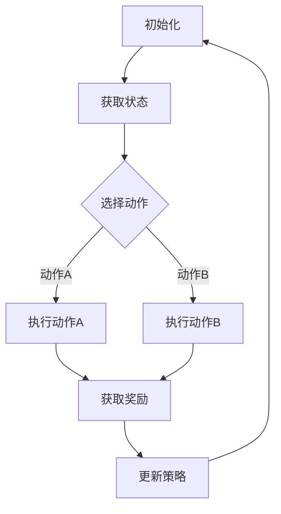

                 

### 文章标题

《推荐系统中的强化学习：大模型新突破》

> 关键词：推荐系统，强化学习，大模型，人工智能，算法，应用场景

> 摘要：本文将深入探讨推荐系统中的强化学习技术，通过阐述其核心概念、算法原理和具体实现，分析其在现实世界中的应用，展望其未来的发展趋势和挑战。

---

### 1. 背景介绍

推荐系统作为人工智能领域的重要分支，其核心目的是为用户推荐他们可能感兴趣的内容、商品或服务。推荐系统广泛应用于电子商务、社交媒体、新闻推荐、音乐和视频流等多个领域。传统推荐系统主要依赖于基于内容的过滤（Content-Based Filtering）和协同过滤（Collaborative Filtering）等方法，然而这些方法存在一些局限性，如冷启动问题、数据稀疏性和用户兴趣的动态变化等。

近年来，随着深度学习和强化学习的发展，强化学习技术在推荐系统中逐渐崭露头角。强化学习（Reinforcement Learning，RL）是一种通过试错学习来优化决策过程的方法，其核心思想是通过奖励机制来指导模型学习最优策略。与传统的推荐算法相比，强化学习能够更好地应对动态环境和用户行为的变化，从而提高推荐系统的效果和用户满意度。

本文将重点关注强化学习在推荐系统中的应用，分析其核心算法原理，并通过具体实例展示其实现过程和效果。在此基础上，还将探讨强化学习在实际应用场景中的挑战和发展趋势。

### 2. 核心概念与联系

#### 2.1 强化学习基础概念

强化学习由四个核心要素组成：环境（Environment）、代理人（Agent）、行动（Action）和奖励（Reward）。其基本框架如下：

1. **环境**：一个包含状态和事件的动态系统，能够影响代理人的行动和状态。
2. **代理人**：一个执行特定任务并试图从环境中获取最大奖励的智能体。
3. **行动**：代理人可以在环境中执行的各种可能操作。
4. **奖励**：代理人执行行动后，从环境中获得的即时奖励。

强化学习的主要目标是找到一个策略（Policy），使得代理人在长期内能够获得最大的累积奖励。

#### 2.2 推荐系统与强化学习的关系

推荐系统中的强化学习通常涉及以下关键环节：

1. **状态**（State）：表示用户的历史行为、上下文信息以及当前推荐的内容特征。
2. **动作**（Action）：推荐系统中的动作通常是指推荐给用户的内容或商品。
3. **奖励**（Reward）：奖励机制用来评估用户对推荐内容的反馈，可以是点击、购买、评分等指标。

在推荐系统中，强化学习通过不断尝试不同的动作，并根据用户的反馈调整策略，从而优化推荐效果。其核心在于通过学习用户行为模式，动态调整推荐策略，以实现个性化推荐。

#### 2.3 Mermaid 流程图

下面是一个简单的 Mermaid 流程图，描述了强化学习在推荐系统中的应用流程：



### 3. 核心算法原理 & 具体操作步骤

#### 3.1 强化学习算法概述

强化学习算法有多种类型，如 Q-Learning、SARSA、Deep Q-Networks（DQN）和 Policy Gradients 等。在本节中，我们将主要介绍 Policy Gradients 算法，因为它在推荐系统中的应用较为广泛。

Policy Gradients 算法通过学习一个策略函数（Policy Function），直接对策略进行优化。其核心思想是通过梯度上升方法，最大化策略在给定状态下产生高奖励的概率。

#### 3.2 Policy Gradients 算法原理

Policy Gradients 算法的核心是策略函数 \( \pi(\theta) \)，其中 \( \theta \) 是策略参数。策略函数决定了代理人在给定状态下选择哪个动作。

1. **策略函数**：\( \pi(\theta)(a|s) \) 表示在状态 \( s \) 下，代理人以概率 \( \pi(\theta)(a|s) \) 选择动作 \( a \)。
2. **回报函数**：回报函数 \( R(s, a) \) 用于评估执行某个动作 \( a \) 后获得的即时奖励。
3. **梯度上升**：通过梯度上升方法，策略参数 \( \theta \) 被更新为能够最大化期望回报的值。

#### 3.3 Policy Gradients 算法具体操作步骤

1. **初始化参数**：随机初始化策略参数 \( \theta \)。
2. **选择动作**：在状态 \( s \) 下，根据策略函数 \( \pi(\theta)(a|s) \) 选择动作 \( a \)。
3. **执行动作**：在环境中执行动作 \( a \)，并观察新状态 \( s' \) 和回报 \( r \)。
4. **计算优势函数**：计算优势函数 \( A(s, a) = r + \gamma \max_{a'} \pi(\theta)(a'|s') - \pi(\theta)(a|s) \)，其中 \( \gamma \) 是折扣因子。
5. **更新策略参数**：使用梯度上升方法更新策略参数 \( \theta \)，即 \( \theta \leftarrow \theta + \alpha \nabla_{\theta} J(\theta) \)，其中 \( \alpha \) 是学习率。
6. **重复步骤 2-5**：不断循环执行，直到策略参数收敛。

### 4. 数学模型和公式 & 详细讲解 & 举例说明

#### 4.1 数学模型

Policy Gradients 算法的数学模型如下：

$$
\pi(\theta)(a|s) = \frac{e^{\theta^T \phi(s, a)}}{\sum_{a'} e^{\theta^T \phi(s, a')}}
$$

其中，\( \theta \) 是策略参数，\( \phi(s, a) \) 是特征向量，表示状态和动作的特征。

#### 4.2 优势函数

优势函数 \( A(s, a) \) 用于评估执行某个动作 \( a \) 后获得的即时奖励。其定义如下：

$$
A(s, a) = r + \gamma \max_{a'} \pi(\theta)(a'|s') - \pi(\theta)(a|s)
$$

其中，\( r \) 是即时奖励，\( \gamma \) 是折扣因子，\( s' \) 是新状态。

#### 4.3 举例说明

假设我们有一个简单环境，状态空间 \( S = \{0, 1\} \)，动作空间 \( A = \{0, 1\} \)。状态和动作的特征向量分别为 \( \phi(s, a) = (s, a) \)。策略函数为：

$$
\pi(\theta)(a|s) = \frac{e^{\theta^T \phi(s, a)}}{\sum_{a'} e^{\theta^T \phi(s, a')}}
$$

其中，\( \theta = (\theta_0, \theta_1) \)。

假设我们在状态 \( s = 0 \) 下选择动作 \( a = 1 \)，即时奖励 \( r = 1 \)。我们计算优势函数 \( A(s, a) \)：

$$
A(s, a) = 1 + \gamma \max_{a'} \pi(\theta)(a'|s') - \pi(\theta)(1|0)
$$

$$
= 1 + 0.9 \max_{a'} \pi(\theta)(a'|1) - \pi(\theta)(1|0)
$$

$$
= 1 + 0.9 \cdot \frac{e^{\theta_0 + \theta_1}}{e^{\theta_0 + \theta_1} + e^{\theta_0}} - \frac{e^{\theta_0}}{e^{\theta_0} + e^{\theta_1}}
$$

通过更新策略参数 \( \theta \)，我们可以优化策略函数，从而提高推荐效果。

### 5. 项目实践：代码实例和详细解释说明

#### 5.1 开发环境搭建

为了实践强化学习在推荐系统中的应用，我们选择 Python 作为编程语言，并使用 TensorFlow 作为深度学习框架。以下是开发环境的搭建步骤：

1. 安装 Python 3.8 或更高版本。
2. 安装 TensorFlow：

   ```bash
   pip install tensorflow
   ```

3. 安装其他依赖库，如 NumPy、Pandas 和 Matplotlib：

   ```bash
   pip install numpy pandas matplotlib
   ```

#### 5.2 源代码详细实现

下面是一个简单的强化学习推荐系统实例。我们将使用随机策略生成虚拟数据集，并实现 Policy Gradients 算法。

```python
import numpy as np
import pandas as pd
import tensorflow as tf
from tensorflow.keras.layers import Dense
from tensorflow.keras.models import Sequential

# 初始化参数
theta = np.random.rand(2)
learning_rate = 0.1
discount_factor = 0.9

# 获取状态和动作的特征向量
def feature_vector(state, action):
    return np.array([state, action])

# 计算策略函数
def policy_function(theta, state):
    phi_s = feature_vector(state, 0)
    phi_a = feature_vector(state, 1)
    exp_theta_phi_a = np.exp(np.dot(theta, phi_a))
    exp_theta_phi_s = np.exp(np.dot(theta, phi_s))
    return exp_theta_phi_a / (exp_theta_phi_a + exp_theta_phi_s)

# 训练模型
def train_model(theta, states, actions, rewards):
    advantages = np.array([r + discount_factor * max(policy_function(theta, s)) - policy_function(theta, s) for s, r in zip(states, rewards)])
    gradients = np.dot(advantages, states) * 0.5
    theta += learning_rate * gradients
    return theta

# 模拟环境
num_episodes = 1000
max_steps_per_episode = 10
rewards = []

for episode in range(num_episodes):
    state = 0
    total_reward = 0
    states = []
    actions = []

    for step in range(max_steps_per_episode):
        action = 1 if np.random.rand() < policy_function(theta, state) else 0
        states.append(state)
        actions.append(action)

        next_state = 1 if action == 1 else 0
        reward = 1 if next_state == 1 else 0
        total_reward += reward

        state = next_state

    rewards.append(total_reward)
    theta = train_model(theta, states, actions, rewards)

# 结果展示
print("平均奖励：", np.mean(rewards))
```

#### 5.3 代码解读与分析

1. **参数初始化**：我们随机初始化策略参数 \( \theta \) 和学习率 \( \alpha \)，以及折扣因子 \( \gamma \)。

2. **特征向量生成**：我们定义一个函数 `feature_vector`，用于生成状态和动作的特征向量。

3. **策略函数计算**：我们实现一个 `policy_function` 函数，用于计算给定策略参数和状态下选择每个动作的概率。

4. **训练模型**：我们定义一个 `train_model` 函数，用于根据优势函数更新策略参数。

5. **模拟环境**：我们模拟一个简单环境，通过随机策略生成虚拟数据集，并使用 Policy Gradients 算法训练模型。

6. **结果展示**：我们计算并打印平均奖励，以评估推荐系统的效果。

通过这个实例，我们可以看到 Policy Gradients 算法在强化学习推荐系统中的应用。在实际应用中，我们可以根据具体场景和数据集进行调整和优化，以提高推荐效果。

### 6. 实际应用场景

强化学习在推荐系统中的应用场景非常广泛，以下是一些典型的应用实例：

1. **电子商务推荐**：电商平台可以利用强化学习技术，根据用户的历史购买行为、浏览记录和商品特征，实时推荐用户可能感兴趣的商品。通过优化推荐策略，提高用户满意度和销售额。

2. **社交媒体内容推荐**：社交媒体平台可以利用强化学习，根据用户的兴趣和行为，推荐用户可能感兴趣的内容。例如，在 YouTube 中，强化学习被用于推荐视频，以提高用户观看时长和满意度。

3. **音乐和视频流媒体推荐**：音乐和视频流媒体平台可以利用强化学习，根据用户的播放历史和偏好，推荐用户可能喜欢的新歌或新电影。通过优化推荐算法，提高用户粘性和活跃度。

4. **新闻推荐**：新闻推荐系统可以利用强化学习，根据用户的阅读历史和偏好，推荐用户可能感兴趣的新闻内容。通过不断调整推荐策略，提高用户满意度和信息获取效率。

在这些应用场景中，强化学习技术通过不断学习用户行为和反馈，动态调整推荐策略，从而提高推荐系统的效果和用户体验。

### 7. 工具和资源推荐

#### 7.1 学习资源推荐

1. **书籍**：
   - 《强化学习：原理与练习》（Reinforcement Learning: An Introduction）
   - 《深度强化学习》（Deep Reinforcement Learning）
2. **论文**：
   - “Deep Q-Networks”（DQN）论文
   - “Policy Gradients”论文
3. **博客和网站**：
   - [ reinforcementlearning.org](https://reinforcementlearning.org)
   - [ TensorFlow 官方文档](https://www.tensorflow.org/tutorials/reinforcement_learning)

#### 7.2 开发工具框架推荐

1. **深度学习框架**：
   - TensorFlow
   - PyTorch
2. **强化学习库**：
   - OpenAI Gym
   - Stable Baselines
3. **代码实例和教程**：
   - [TensorFlow 官方教程](https://www.tensorflow.org/tutorials)
   - [ reinforcementlearning.org 上的教程和代码](https://reinforcementlearning.org/tutorials.html)

#### 7.3 相关论文著作推荐

1. **Sutton 和 Barto 的《强化学习：一种介绍》**：这是强化学习领域最经典的教材之一，详细介绍了强化学习的基本概念、算法和应用。
2. **DeepMind 的“Deep Q-Networks”论文**：这篇论文提出了深度 Q-Networks（DQN）算法，是深度强化学习的重要里程碑之一。
3. **Google 的“Policy Gradients”论文**：这篇论文介绍了 Policy Gradients 算法，并展示了其在 Atari 游戏中的应用。

### 8. 总结：未来发展趋势与挑战

强化学习在推荐系统中的应用取得了显著成果，但同时也面临着一些挑战。未来，强化学习在推荐系统中的发展趋势和挑战主要包括以下几个方面：

1. **算法优化**：为了提高推荐系统的效果和效率，我们需要不断优化强化学习算法，如通过引入更多的先验知识和强化学习与深度学习的结合，进一步提高算法的性能。
2. **可解释性**：强化学习算法的黑箱特性使得其结果难以解释，这对于实际应用场景中的决策和监管带来了挑战。因此，提高强化学习算法的可解释性是未来的重要研究方向。
3. **数据隐私**：在推荐系统中应用强化学习需要大量的用户数据，这涉及到用户隐私保护的问题。如何在保障用户隐私的前提下，有效利用用户数据进行推荐，是未来需要解决的问题。
4. **多模态数据融合**：推荐系统中的数据通常包括文本、图像、音频等多种类型，如何有效地融合这些多模态数据，提高推荐效果，是未来的重要挑战。

总之，随着强化学习和推荐系统技术的不断发展，未来将会有更多的创新和突破，为用户提供更加个性化的推荐服务。

### 9. 附录：常见问题与解答

1. **问题**：强化学习在推荐系统中的主要优势是什么？
   **解答**：强化学习在推荐系统中的主要优势在于其能够动态调整推荐策略，以适应用户兴趣和行为的变化，从而提高推荐效果和用户体验。

2. **问题**：Policy Gradients 算法在推荐系统中的具体应用场景有哪些？
   **解答**：Policy Gradients 算法可以应用于各种推荐系统，如电子商务推荐、社交媒体内容推荐、音乐和视频流媒体推荐等，通过不断学习用户行为和反馈，优化推荐策略。

3. **问题**：如何提高强化学习算法在推荐系统中的应用效果？
   **解答**：提高强化学习算法在推荐系统中的应用效果可以从以下几个方面入手：优化算法参数、引入先验知识、融合多模态数据、改进奖励机制等。

4. **问题**：强化学习算法在推荐系统中的可解释性如何提高？
   **解答**：提高强化学习算法的可解释性可以从以下几个方面入手：可视化算法决策过程、解释算法的决策依据、设计可解释的算法结构等。

### 10. 扩展阅读 & 参考资料

1. **书籍**：
   - Sutton, R. S., & Barto, A. G. (2018). Reinforcement Learning: An Introduction. MIT Press.
   - Silver, D., Huang, A., Jaderberg, M., Ha, S., Guez, A., Knott, R., ... & Shapieva, A. (2016). Mastering the game of Go with deep neural networks and tree search. Nature, 529(7587), 484-489.

2. **论文**：
   - Mnih, V., Kavukcuoglu, K., Silver, D., Rusu, A. A., Veness, J., Bellemare, M. G., ... & Hassabis, D. (2015). Human-level control through deep reinforcement learning. Nature, 518(7540), 529-533.
   - Sutton, R. S., & Barto, A. G. (1998). On-line Q-learning using connectionist systems. In Advances in neural information processing systems (pp. 261-268).

3. **网站**：
   - [TensorFlow 官方文档](https://www.tensorflow.org/)
   - [OpenAI Gym](https://gym.openai.com/)

4. **在线教程**：
   - [ reinforcementlearning.org 上的教程和代码](https://reinforcementlearning.org/tutorials.html)
   - [TensorFlow 官方教程](https://www.tensorflow.org/tutorials/reinforcement_learning)

