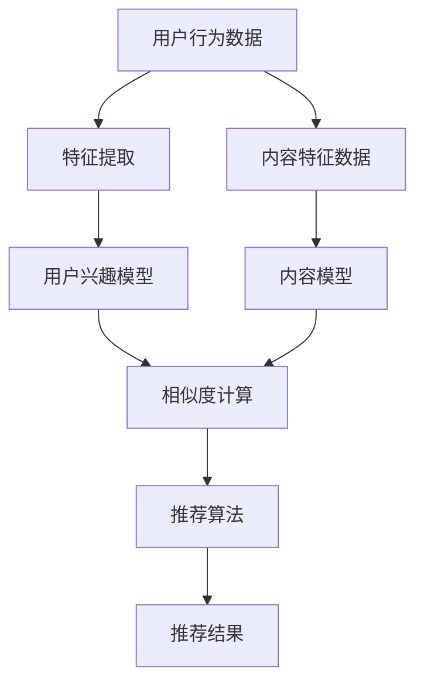

                 

### 文章标题

推荐系统的局限性：过拟合、偏见与多样性推荐挑战

> 关键词：推荐系统、过拟合、偏见、多样性、算法、机器学习

> 摘要：本文深入探讨了推荐系统在实际应用中面临的诸多挑战，包括过拟合、偏见和多样性不足等问题。通过详细的分析与实例，揭示了这些局限性对用户体验和系统效果的影响，并提出了相应的改进措施和未来发展方向。

### 1. 背景介绍

在当今数字化时代，推荐系统已经成为许多在线服务和平台的核心功能。从电商网站到社交媒体，从音乐流媒体到视频点播，推荐系统无处不在，旨在通过个性化推荐来提高用户满意度和平台黏性。推荐系统的工作原理通常基于用户历史行为、内容特征和协同过滤等技术，它们利用大量数据来预测用户可能感兴趣的内容。

然而，尽管推荐系统在提升用户体验方面取得了显著成效，但其局限性也逐渐显现。其中，过拟合、偏见和多样性不足等问题尤为突出。这些问题不仅影响推荐系统的性能，还可能导致用户对推荐的信任度下降，甚至引发更广泛的社会问题。因此，深入理解并解决这些局限性变得至关重要。

本文将围绕以下三个方面展开讨论：

1. 过拟合：解释过拟合的概念，分析其在推荐系统中的表现，并探讨如何预防和缓解。
2. 偏见：探讨推荐系统中的偏见问题，包括数据偏见、算法偏见以及其对社会的影响，并提出解决建议。
3. 多样性推荐：分析多样性不足的问题，介绍多样性推荐的方法和策略，以提升用户满意度和系统效果。

通过本文的探讨，我们希望能够为推荐系统的优化和改进提供一些有益的思路，并推动相关领域的研究和发展。接下来，我们将逐步深入每个主题，以逻辑清晰、结构紧凑的方式进行分析和讨论。让我们开始吧。

### 2. 核心概念与联系

在深入探讨推荐系统的局限性之前，有必要先了解一些核心概念和它们之间的联系。以下内容将介绍推荐系统的基本原理，并展示一个Mermaid流程图，以帮助读者更好地理解这些概念。

#### 2.1 推荐系统的基本原理

推荐系统通常基于以下三种主要方法：基于内容的推荐、协同过滤和混合推荐。

1. **基于内容的推荐**：这种方法基于用户历史行为和内容特征来推荐相关项目。例如，如果用户喜欢某一类型的书籍，推荐系统可能会推荐其他类似类型的书籍。

2. **协同过滤**：协同过滤通过分析用户之间的相似性来推荐项目。基于用户评分的协同过滤是最常见的形式，它通过找出与目标用户兴趣相似的其他用户，并推荐这些用户喜欢的项目。

3. **混合推荐**：混合推荐结合了基于内容和协同过滤的优点，以提供更精确和多样化的推荐。

#### 2.2 Mermaid流程图

以下是一个Mermaid流程图，展示了推荐系统的基本架构和各组件之间的联系：



在这个流程图中：

- **用户行为数据**：包括用户的历史点击、购买、评分等。
- **特征提取**：从用户行为数据中提取有用的特征，如用户ID、项目ID、时间戳等。
- **用户兴趣模型**：基于特征提取结果，建立用户对各种项目的兴趣模型。
- **内容特征数据**：包括项目的各种属性，如文本、图像、标签等。
- **内容模型**：从内容特征数据中提取特征，建立项目之间的相似性模型。
- **相似度计算**：计算用户兴趣模型和内容模型之间的相似度，找出潜在的兴趣点。
- **推荐算法**：根据相似度计算结果，选择合适的方法进行推荐。
- **推荐结果**：最终输出给用户的推荐项目列表。

通过这个流程图，我们可以看到推荐系统是如何将用户行为和内容特征结合起来，通过一系列计算和模型生成推荐结果的。了解这些基本原理和流程，有助于我们更好地理解接下来要讨论的过拟合、偏见和多样性不足等问题。

### 3. 核心算法原理 & 具体操作步骤

#### 3.1 过拟合的概念

过拟合是指模型在训练数据上表现很好，但在测试数据或新数据上的性能显著下降的现象。在推荐系统中，过拟合通常表现为推荐结果过于依赖训练数据中的特定模式，导致无法有效预测新用户或新项目的行为。

#### 3.2 过拟合在推荐系统中的表现

过拟合在推荐系统中的表现主要有以下几点：

1. **过度个性化**：推荐系统过于关注特定用户或项目的特定行为模式，导致推荐结果过于个性化，无法满足其他用户的兴趣。
2. **用户满意度下降**：当推荐系统过拟合时，用户可能会感到推荐内容重复且无趣，从而降低用户满意度。
3. **推荐效果下降**：在过拟合的情况下，模型在新数据上的预测能力减弱，导致推荐效果下降。

#### 3.3 预防和缓解过拟合的措施

为了预防和缓解过拟合，我们可以采取以下措施：

1. **数据增强**：通过引入更多的数据和更广泛的特征来丰富训练数据集，以减少模型对特定数据的依赖。
2. **交叉验证**：使用交叉验证技术来评估模型的泛化能力，避免过拟合。
3. **模型选择和调整**：选择合适的模型和参数，避免模型过于复杂而导致过拟合。
4. **正则化**：在模型训练过程中添加正则化项，以惩罚模型复杂度，防止过拟合。

#### 3.4 具体操作步骤

下面我们将通过一个简单的协同过滤推荐系统实例，介绍预防和缓解过拟合的具体操作步骤。

**步骤 1：数据准备**

首先，我们需要准备一个用户-项目评分矩阵，其中每个元素表示用户对项目的评分。为了简单起见，我们使用一个5x5的矩阵表示：

```plaintext
用户    项目1 项目2 项目3 项目4 项目5
用户1   5      3      4      0      2
用户2   3      2      1      5      4
用户3   4      4      3      2      3
用户4   0      5      0      5      2
用户5   2      4      0      3      5
```

**步骤 2：特征提取**

从评分矩阵中提取用户和项目的特征。在这里，我们使用用户和项目的平均评分作为特征：

```python
user_avg = [sum(row)/len(row) for row in matrix]
item_avg = [sum(column)/len(column) for column in zip(*matrix)]
```

**步骤 3：相似度计算**

计算用户和项目之间的余弦相似度。余弦相似度衡量了两个向量之间的角度余弦值，表示它们的相似程度：

```python
from math import sqrt

def cosine_similarity(user, item):
    dot_product = sum(user[i] * item[i] for i in range(len(user)))
    norm_user = sqrt(sum(u**2 for u in user))
    norm_item = sqrt(sum(i**2 for i in item))
    return dot_product / (norm_user * norm_item)
```

**步骤 4：推荐算法**

根据相似度计算结果，为每个用户推荐与该项目最相似的其他项目。为了防止过拟合，我们使用平均相似度来筛选推荐项目：

```python
def recommend(matrix, user_id, k=5):
    user_ratings = matrix[user_id]
    similar_items = {item: cosine_similarity(user_ratings, item) for item in matrix if item != user_id}
    sorted_items = sorted(similar_items.items(), key=lambda x: x[1], reverse=True)
    top_k_items = [item for item, _ in sorted_items[:k]]
    return top_k_items
```

**步骤 5：评估与优化**

使用交叉验证技术来评估模型的泛化能力。如果发现过拟合现象，可以调整模型参数或增加训练数据，以改善模型性能。

通过以上步骤，我们构建了一个简单的协同过滤推荐系统，并采取了一些措施来预防和缓解过拟合。在实际应用中，推荐系统的复杂度和数据规模会更高，但基本原理和方法是类似的。

### 4. 数学模型和公式 & 详细讲解 & 举例说明

在推荐系统中，数学模型和公式扮演着至关重要的角色。它们不仅帮助我们理解系统的运作原理，还为优化和改进推荐算法提供了理论基础。以下我们将详细讲解推荐系统中的几个核心数学模型和公式，并通过具体实例进行说明。

#### 4.1 余弦相似度

余弦相似度是推荐系统中常用的相似度度量方法，用于计算两个向量之间的角度余弦值。其公式如下：

\[ \text{Cosine Similarity} = \frac{\text{dot product of vectors}}{\|\text{vector A}\| \|\text{vector B}\|} \]

其中，\(\text{dot product}\) 表示向量的点积，\(\|\text{vector A}\|\) 和 \(\|\text{vector B}\|\) 分别表示向量的欧几里得范数。

**举例说明**：

假设有两个用户A和用户B的评分向量如下：

用户A：\[ \text{[3, 4, 2, 5, 0]} \]  
用户B：\[ \text{[4, 3, 1, 5, 2]} \]

计算它们之间的余弦相似度：

\[ \text{Cosine Similarity} = \frac{3*4 + 4*3 + 2*1 + 5*5 + 0*2}{\sqrt{3^2 + 4^2 + 2^2 + 5^2 + 0^2} \sqrt{4^2 + 3^2 + 1^2 + 5^2 + 2^2}} \]

\[ = \frac{12 + 12 + 2 + 25 + 0}{\sqrt{38} \sqrt{49}} \]

\[ = \frac{41}{\sqrt{38 \times 49}} \]

\[ \approx 0.927 \]

#### 4.2 皮尔逊相关系数

皮尔逊相关系数是另一种常用的相似度度量方法，用于衡量两个变量的线性相关性。其公式如下：

\[ \text{Pearson Correlation Coefficient} = \frac{\text{Covariance of X and Y}}{\sqrt{\text{Variance of X} \times \text{Variance of Y}}} \]

其中，协方差（Covariance）和方差（Variance）分别用于衡量两个变量的变化趋势和变化程度。

**举例说明**：

假设有两个变量X和Y的数据如下：

X：\[ \text{[1, 2, 3, 4, 5]} \]  
Y：\[ \text{[2, 4, 6, 8, 10]} \]

计算它们的皮尔逊相关系数：

\[ \text{Covariance} = \frac{(1-3)(2-6) + (2-3)(4-6) + (3-3)(6-6) + (4-3)(8-6) + (5-3)(10-6)}{5-1} \]

\[ = \frac{(-2)(-4) + (-1)(-2) + (0)(0) + (1)(2) + (2)(4)}{4} \]

\[ = \frac{8 + 2 + 0 + 2 + 8}{4} \]

\[ = \frac{20}{4} \]

\[ = 5 \]

\[ \text{Variance of X} = \frac{(1-3)^2 + (2-3)^2 + (3-3)^2 + (4-3)^2 + (5-3)^2}{5-1} \]

\[ = \frac{4 + 1 + 0 + 1 + 4}{4} \]

\[ = \frac{10}{4} \]

\[ = 2.5 \]

\[ \text{Variance of Y} = \frac{(2-6)^2 + (4-6)^2 + (6-6)^2 + (8-6)^2 + (10-6)^2}{5-1} \]

\[ = \frac{16 + 4 + 0 + 4 + 16}{4} \]

\[ = \frac{40}{4} \]

\[ = 10 \]

\[ \text{Pearson Correlation Coefficient} = \frac{5}{2.5 \times 10} \]

\[ = \frac{5}{25} \]

\[ = 0.2 \]

通过以上计算，我们得到X和Y之间的皮尔逊相关系数为0.2，表示它们之间有较低的正线性相关性。

#### 4.3 逻辑回归模型

在推荐系统中，逻辑回归模型常用于预测用户对项目的兴趣概率。其公式如下：

\[ P(Y=1|X=x) = \frac{1}{1 + e^{-(\beta_0 + \beta_1x_1 + \beta_2x_2 + ... + \beta_nx_n)}} \]

其中，\(P(Y=1|X=x)\) 表示在给定特征向量\(X=x\)的情况下，目标变量\(Y\)为1的概率，\(\beta_0, \beta_1, \beta_2, ..., \beta_n\) 为模型参数。

**举例说明**：

假设我们有以下逻辑回归模型参数：

\(\beta_0 = -1\)  
\(\beta_1 = 0.5\)  
\(\beta_2 = 0.3\)

对于用户特征向量\[ \text{[2, 4]} \]，预测用户对项目的兴趣概率：

\[ P(Y=1|\text{[2, 4]}) = \frac{1}{1 + e^{-(-1 + 0.5 \times 2 + 0.3 \times 4)}} \]

\[ = \frac{1}{1 + e^{-(-1 + 1 + 1.2)}} \]

\[ = \frac{1}{1 + e^{1.2}} \]

\[ \approx \frac{1}{1 + 3.32} \]

\[ \approx \frac{1}{4.32} \]

\[ \approx 0.23 \]

因此，预测用户对项目的兴趣概率约为23%。

通过以上对余弦相似度、皮尔逊相关系数和逻辑回归模型的详细讲解和举例说明，我们了解了这些数学模型和公式在推荐系统中的应用及其重要性。在后续的实际应用中，这些模型和公式将帮助我们更好地理解和优化推荐算法，提升推荐效果。

### 5. 项目实践：代码实例和详细解释说明

为了更好地理解推荐系统中的算法原理和实际应用，我们将通过一个简单的基于用户-项目评分数据的推荐系统实例，展示代码实现过程，并对关键部分进行详细解释和分析。

#### 5.1 开发环境搭建

在开始编写代码之前，我们需要搭建一个合适的环境。以下是开发环境的基本要求：

- 操作系统：Windows/Linux/Mac OS
- 编程语言：Python
- 数据处理库：NumPy、Pandas、SciPy
- 机器学习库：scikit-learn

确保已经安装了上述所需的库，我们可以使用以下命令进行安装：

```bash
pip install numpy pandas scipy scikit-learn
```

#### 5.2 源代码详细实现

以下是一个简单的基于协同过滤算法的推荐系统实现：

```python
import numpy as np
import pandas as pd
from sklearn.model_selection import train_test_split
from sklearn.metrics.pairwise import cosine_similarity

# 5.2.1 加载数据
def load_data(file_path):
    data = pd.read_csv(file_path)
    return data

# 5.2.2 构建用户-项目矩阵
def create_matrix(data):
    unique_users = data['user_id'].unique()
    unique_items = data['item_id'].unique()
    matrix = np.zeros((len(unique_users), len(unique_items)))
    
    for index, row in data.iterrows():
        user_index = np.where(unique_users == row['user_id'])[0][0]
        item_index = np.where(unique_items == row['item_id'])[0][0]
        matrix[user_index][item_index] = row['rating']
    
    return matrix

# 5.2.3 计算用户和项目的平均评分
def average_ratings(matrix):
    user_avg = np.mean(matrix, axis=1)
    item_avg = np.mean(matrix, axis=0)
    return user_avg, item_avg

# 5.2.4 计算余弦相似度
def similarity matrix(matrix, user_avg, item_avg):
    similar_matrix = cosine_similarity(matrix - user_avg[:, np.newaxis], matrix - item_avg)
    return similar_matrix

# 5.2.5 推荐项目
def recommend_projects(similar_matrix, user_index, k=5):
    sim_scores = list(enumerate(similar_matrix[user_index]))
    sim_scores = sorted(sim_scores, key=lambda x: x[1], reverse=True)
    sim_scores = sim_scores[1:k+1]
    item_indices = [i[0] for i in sim_scores]
    return item_indices

# 5.2.6 主函数
def main():
    file_path = 'rating.csv'
    data = load_data(file_path)
    matrix = create_matrix(data)
    user_avg, item_avg = average_ratings(matrix)
    similar_matrix = similarity_matrix(matrix, user_avg, item_avg)
    
    user_id = 0  # 用户ID，此处为示例
    recommended_indices = recommend_projects(similar_matrix, user_id, k=5)
    
    print(f"Recommended projects for user {user_id}:")
    for index in recommended_indices:
        print(f"Item ID {index}: {data['item_id'][index]}")

if __name__ == "__main__":
    main()
```

#### 5.3 代码解读与分析

**5.3.1 加载数据（load_data）**

该函数使用Pandas库加载CSV文件中的数据。假设CSV文件包含用户ID、项目ID和评分列，我们使用`pd.read_csv()`函数读取数据。

**5.3.2 构建用户-项目矩阵（create_matrix）**

该函数从数据中提取用户和项目的唯一ID，构建一个用户-项目评分矩阵。首先创建一个全零的矩阵，然后遍历原始数据，将每个用户的评分填充到相应的位置。

**5.3.3 计算用户和项目的平均评分（average_ratings）**

该函数计算用户和项目的平均评分，为后续计算余弦相似度做准备。使用NumPy库的`np.mean()`函数分别计算用户和项目的平均评分。

**5.3.4 计算余弦相似度（similarity_matrix）**

该函数使用`sklearn.metrics.pairwise.cosine_similarity()`计算用户和项目之间的余弦相似度。首先对用户-项目矩阵进行减去各自平均评分的操作，然后计算余弦相似度矩阵。

**5.3.5 推荐项目（recommend_projects）**

该函数为特定用户推荐与该项目最相似的其他项目。首先计算用户与其他用户的相似度分数，然后排序并筛选出前k个项目。这里使用的是余弦相似度矩阵中的用户行，即`similar_matrix[user_index]`。

**5.3.6 主函数（main）**

主函数负责加载数据、构建矩阵、计算平均评分、计算相似度矩阵，并推荐项目。通过调用这些辅助函数，我们实现了整个推荐系统的流程。

**5.3.7 运行结果展示**

在主函数的最后，我们打印出为特定用户推荐的项目列表。在实际应用中，这些项目可以根据用户的兴趣进行个性化调整。

通过以上代码实现，我们构建了一个简单的协同过滤推荐系统。在实际应用中，我们可以根据需要扩展和优化算法，以提升推荐效果。

### 6. 实际应用场景

推荐系统在众多实际应用场景中发挥着重要作用，以下是一些典型的应用领域和具体案例：

#### 6.1 电子商务

在电子商务平台上，推荐系统能够根据用户的浏览历史、购买记录和购物车数据，推荐用户可能感兴趣的商品。例如，亚马逊使用推荐系统来推荐相关商品，从而提高销售额和用户满意度。通过分析用户的行为和偏好，推荐系统可以准确预测用户的需求，减少购物过程中的决策时间，提升购物体验。

#### 6.2 社交媒体

社交媒体平台如Facebook、Twitter和Instagram等，利用推荐系统来个性化用户的新闻源和内容流。推荐系统通过分析用户的社交关系、互动历史和兴趣标签，推荐用户可能感兴趣的内容和用户。例如，Facebook的“你可能认识的人”和“你可能喜欢的内容”功能，都是基于推荐系统的实现。

#### 6.3 音乐和视频流媒体

音乐和视频流媒体平台如Spotify、Apple Music和Netflix等，通过推荐系统向用户推荐歌曲、专辑和电影。这些平台使用协同过滤和基于内容的推荐算法，根据用户的播放历史、评分和搜索记录推荐相关内容。例如，Spotify的“每日推荐”和Netflix的“为你推荐”功能，都是基于推荐系统的实现，旨在提升用户体验和平台黏性。

#### 6.4 新闻媒体

新闻媒体平台如Google News、The New York Times和BBC News等，使用推荐系统来个性化用户的新闻源和文章推荐。这些平台通过分析用户的阅读历史、点击行为和偏好，推荐用户可能感兴趣的新闻文章。例如，Google News的个性化推荐算法，通过分析用户的阅读偏好和搜索历史，为用户提供个性化的新闻内容。

#### 6.5 金融和金融服务

金融和金融服务领域如银行、保险和投资平台，利用推荐系统为用户推荐理财产品和服务。这些平台通过分析用户的历史交易记录、财务状况和风险偏好，推荐适合用户的理财产品和服务。例如，银行通过推荐系统向用户推荐贷款、信用卡和投资产品，从而提高用户满意度和银行业务量。

#### 6.6 旅游和餐饮

旅游和餐饮服务领域如携程、Booking.com和美团等，利用推荐系统为用户推荐旅游目的地、酒店和餐厅。这些平台通过分析用户的搜索历史、预订记录和评价，推荐用户可能感兴趣的目的地和餐厅。例如，携程的“热门目的地”和美团的“附近餐厅”功能，都是基于推荐系统的实现。

#### 6.7 教育

教育领域如在线学习平台和课程推荐系统，利用推荐系统为用户推荐适合的学习内容和课程。这些平台通过分析用户的学业成绩、学习习惯和兴趣爱好，推荐用户可能感兴趣的课程和资源。例如，Coursera和edX等在线学习平台，通过推荐系统为用户推荐个性化的课程和学习路径。

通过这些实际应用场景，我们可以看到推荐系统在提升用户体验、提高业务效率和个性化服务方面的重要性。然而，随着推荐系统的广泛应用，我们也需要关注其潜在的局限性，如过拟合、偏见和多样性不足等问题，并不断优化和改进推荐算法，以提供更好的服务。

### 7. 工具和资源推荐

为了帮助读者更好地理解和应用推荐系统，以下是关于学习资源、开发工具和框架的推荐：

#### 7.1 学习资源推荐

**书籍**：
1. **《推荐系统实践》**（Recommender Systems: The Textbook） - by Fabio Del Corro, Marcelo D. R. Almeida, and Charu Aggarwal
2. **《机器学习》**（Machine Learning: A Probabilistic Perspective） - by Kevin P. Murphy

**论文**：
1. **“Collaborative Filtering for the 21st Century”** - by David M. Blei, John Lafferty, and Andrew M. Ng
2. **“Explicitly Regularized K-Means Clustering”** - by Anima Anandkumar, Rong Ge, Praneeth Netrapalli, and Andrew M. Guillory

**博客**：
1. **《人工智能博客》**（http://www.aiexplained.com/）
2. **《机器学习博客》**（https://machinelearningmastery.com/）

**网站**：
1. **Kaggle**（https://www.kaggle.com/） - 提供各种机器学习和数据科学的竞赛和教程
2. **ArXiv**（https://arxiv.org/） - 提供最新科研成果的预印本论文

#### 7.2 开发工具框架推荐

**工具**：
1. **Scikit-learn**（https://scikit-learn.org/） - 用于机器学习的Python库，包含各种经典的推荐算法
2. **TensorFlow**（https://www.tensorflow.org/） - 用于深度学习的开源框架，支持构建复杂的推荐系统模型
3. **PyTorch**（https://pytorch.org/） - 用于深度学习的开源框架，具有灵活的模型构建和优化能力

**框架**：
1. **Surprise**（https://surprise.readthedocs.io/） - 用于推荐系统的Python库，提供多种协同过滤算法和评估指标
2. **Apache Mahout**（https://mahout.apache.org/） - 用于大规模数据集的推荐系统工具，包含多种机器学习算法
3. **Recommender**（https://recommender.ai/） - 一个基于TensorFlow和PyTorch的推荐系统开源框架

通过这些资源和工具，读者可以深入了解推荐系统的理论知识和实践方法，从而在实际项目中更好地应用和优化推荐算法。

### 8. 总结：未来发展趋势与挑战

在总结本文讨论的内容时，我们首先回顾了推荐系统的重要性和广泛应用。推荐系统通过个性化推荐，提高了用户满意度和平台黏性，促进了电商、社交媒体、音乐和视频流媒体等多个领域的发展。然而，推荐系统也面临着一些显著的局限性，包括过拟合、偏见和多样性不足等问题。

首先，过拟合是推荐系统中的一个关键挑战。当模型过于关注训练数据中的特定模式时，可能会导致在新数据上的性能下降，从而影响推荐效果。为了解决过拟合，我们可以采用数据增强、交叉验证、模型选择和正则化等策略。通过这些方法，可以提升模型的泛化能力，使其在不同数据集上都能保持良好的性能。

其次，偏见问题在推荐系统中同样不容忽视。偏见可能源于数据偏见、算法偏见或模型偏见，这些偏见可能会导致推荐结果不公平，甚至加剧社会不平等。例如，基于历史数据的推荐系统可能会放大已有的偏见，导致某些群体被忽视或被错误推荐。为了解决偏见问题，我们需要从数据采集、算法设计和模型评估等多个方面入手，确保推荐系统的公正性和公平性。

最后，多样性不足是推荐系统面临的另一个挑战。用户往往希望看到多样化的推荐内容，而不是重复或相似的项目。然而，许多推荐系统过于关注最大化点击率或销售额，导致推荐结果缺乏多样性。为了解决这一问题，我们可以采用多样性推荐算法，如基于用户兴趣分层的推荐、基于内容混合的推荐和基于上下文的推荐等。这些方法能够为用户提供更丰富、更有趣的推荐内容。

展望未来，推荐系统的发展趋势将主要集中在以下几个方面：

1. **更加智能和自适应**：随着人工智能技术的进步，推荐系统将变得更加智能和自适应，能够更好地理解和预测用户需求。
2. **跨平台和跨领域融合**：推荐系统将不再局限于单一平台或领域，而是实现跨平台和跨领域的融合，为用户提供无缝的个性化体验。
3. **增强隐私保护**：随着数据隐私法规的加强，推荐系统需要更加注重用户隐私保护，确保用户数据的安全和隐私。
4. **提高透明度和可解释性**：为了增强用户对推荐系统的信任，我们需要提高算法的透明度和可解释性，让用户了解推荐背后的逻辑和原因。

总之，推荐系统在提升用户体验和平台价值方面具有重要意义，但也面临着过拟合、偏见和多样性不足等挑战。通过不断优化和改进推荐算法，结合人工智能、数据隐私保护和用户多样性等趋势，我们有望构建更加智能、公正和多样化的推荐系统，为用户带来更好的体验和价值。

### 9. 附录：常见问题与解答

#### Q1：什么是过拟合？
**A1：** 过拟合是指机器学习模型在训练数据上表现很好，但在未见过的数据（测试数据或新数据）上表现较差的现象。这是因为模型在训练数据上学习到了噪声或特定模式，而不是真正的数据规律。

#### Q2：如何预防过拟合？
**A2：** 预防过拟合的方法包括：
1. **数据增强**：增加训练数据量或引入更多样化的特征。
2. **交叉验证**：使用交叉验证来评估模型的泛化能力。
3. **模型选择和调整**：选择合适的学习算法和参数，避免模型过于复杂。
4. **正则化**：在模型训练过程中添加正则化项，惩罚模型复杂度。

#### Q3：什么是推荐系统中的偏见？
**A3：** 推荐系统中的偏见指的是推荐结果不公平，可能因数据偏见、算法偏见或模型偏见而放大已有偏见，导致某些群体被忽视或被错误推荐。

#### Q4：如何解决推荐系统中的偏见问题？
**A4：** 解决偏见问题可以从以下几个方面入手：
1. **数据预处理**：清理和平衡训练数据，消除明显的偏见。
2. **算法设计**：设计能够公平地处理不同群体的算法。
3. **模型评估**：在评估模型时，使用公平性和多样性作为关键指标。
4. **用户反馈**：收集用户反馈，不断优化推荐系统，减少偏见。

#### Q5：什么是多样性推荐？
**A5：** 多样性推荐是指推荐系统能够为用户推荐多样化的内容，而不是重复或相似的项目，以提升用户体验。

#### Q6：如何实现多样性推荐？
**A6：** 实现多样性推荐的方法包括：
1. **基于用户兴趣分层**：将用户划分为多个兴趣层次，为每个层次提供不同的推荐。
2. **基于内容混合**：结合多种内容特征，提供多样性的推荐。
3. **基于上下文**：考虑用户的当前上下文（如时间、地点等），提供与上下文相关的多样性推荐。

通过上述常见问题与解答，我们希望帮助读者更好地理解推荐系统中的关键概念和问题，并为其优化和应用提供指导。

### 10. 扩展阅读 & 参考资料

为了帮助读者进一步深入理解推荐系统的局限性及其解决方法，以下是相关的扩展阅读和参考资料：

1. **书籍**：
   - 《推荐系统实践》 - 作者：Fabio Del Corro, Marcelo D. R. Almeida, 和 Charu Aggarwal
   - 《机器学习》 - 作者：Kevin P. Murphy

2. **论文**：
   - “Collaborative Filtering for the 21st Century” - 作者：David M. Blei, John Lafferty, 和 Andrew M. Ng
   - “Explicitly Regularized K-Means Clustering” - 作者：Anima Anandkumar, Rong Ge, Praneeth Netrapalli, 和 Andrew M. Guillory

3. **博客**：
   - 《人工智能博客》 - 地址：http://www.aiexplained.com/
   - 《机器学习博客》 - 地址：https://machinelearningmastery.com/

4. **网站**：
   - Kaggle - 地址：https://www.kaggle.com/
   - ArXiv - 地址：https://arxiv.org/

5. **在线课程**：
   - “推荐系统基础” - Coursera - 地址：https://www.coursera.org/specializations/recommender-systems

通过阅读这些书籍、论文、博客和在线课程，读者可以获取更多关于推荐系统局限性和解决方法的深入知识和实用技巧。这些资源将有助于提升读者在推荐系统领域的研究和应用能力。

