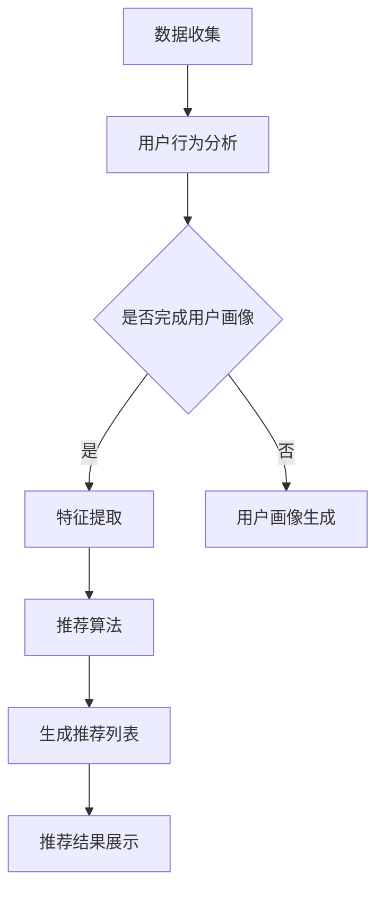

                 

### 背景介绍

随着互联网的快速发展，用户参与度的提升成为各类应用和服务的重要目标。在当今信息爆炸的时代，用户面临海量的信息和内容，如何有效地将用户与其感兴趣的内容进行精准匹配，成为了每个平台和应用的迫切需求。个性化推荐系统作为现代信息检索和用户行为分析的重要工具，其核心目标是通过分析用户的历史行为和偏好，向用户推荐其可能感兴趣的内容。

个性化推荐系统不仅仅应用于电商、社交媒体和新闻推荐等领域，还广泛应用于金融、医疗、教育等多个行业。其重要性在于，通过提高用户满意度和参与度，可以显著提升平台的商业价值和用户粘性。个性化推荐系统的研究和应用已经成为计算机科学和人工智能领域中的一个热点课题。

本文将深入探讨如何通过提升用户参与度来实现个性化推荐系统的优化。我们将从以下几个方面展开讨论：

1. **核心概念与联系**：首先，我们将介绍个性化推荐系统中的核心概念和基本架构，并通过Mermaid流程图展示推荐系统的整体流程。
2. **核心算法原理 & 具体操作步骤**：接着，我们将详细阐述常用的推荐算法，包括协同过滤、基于内容的推荐和混合推荐等，并给出每种算法的具体实现步骤。
3. **数学模型和公式 & 详细讲解 & 举例说明**：为了深入理解推荐算法，我们将介绍相关的数学模型和公式，并通过具体例子进行说明。
4. **项目实践：代码实例和详细解释说明**：我们将通过一个实际的代码实例，展示个性化推荐系统的实现过程，并对关键代码进行详细解读。
5. **实际应用场景**：接下来，我们将探讨个性化推荐系统在不同领域的应用场景，以及其在实际使用中面临的挑战。
6. **工具和资源推荐**：为了方便读者学习和实践，我们将推荐相关的学习资源、开发工具和框架。
7. **总结：未来发展趋势与挑战**：最后，我们将总结个性化推荐系统的未来发展趋势和面临的挑战。

通过本文的逐步分析，我们希望读者能够全面了解个性化推荐系统的工作原理和实现方法，并能够将其应用到实际项目中，从而提升用户参与度和满意度。

### 核心概念与联系

在深入探讨个性化推荐系统之前，我们需要明确几个核心概念，这些概念是构建推荐系统的基础。以下是推荐系统中常见的核心概念：

#### 用户（User）
用户是推荐系统的核心，每个用户都有其独特的兴趣爱好和行为模式。用户信息包括用户的年龄、性别、地理位置、历史浏览记录、购买记录等。

#### 项目（Item）
项目指的是用户可能感兴趣的内容，如商品、新闻、音乐、电影等。每个项目都有自己的属性和特征，如标题、描述、标签、发布时间等。

#### 用户行为（User Behavior）
用户行为是指用户在系统中的活动，如浏览、点击、购买、评分等。这些行为记录了用户的历史数据和偏好信息，是推荐系统的重要数据来源。

#### 推荐列表（Recommendation List）
推荐列表是根据用户行为和偏好，推荐给用户的潜在感兴趣的项目列表。推荐列表的质量直接影响用户的满意度和参与度。

#### 评分（Rating）
评分是指用户对项目的评分，通常用数字或五星表示。评分数据是评价推荐系统效果的重要指标。

#### 协同过滤（Collaborative Filtering）
协同过滤是一种基于用户行为和相似度计算进行推荐的方法。它通过分析用户之间的相似度，找到与目标用户相似的其他用户，然后推荐这些用户喜欢的项目。

#### 基于内容的推荐（Content-Based Filtering）
基于内容的推荐方法通过分析项目的特征和属性，将具有相似属性的项目推荐给用户。这种方法依赖于项目的标签、关键词和内容分析。

#### 混合推荐（Hybrid Recommendation）
混合推荐方法结合了协同过滤和基于内容的推荐方法，利用两者的优势，提高推荐系统的准确性和多样性。

为了更好地理解这些概念，我们可以通过一个Mermaid流程图来展示个性化推荐系统的整体架构：



在这个流程图中，首先进行数据收集，包括用户行为和项目信息。然后，对用户行为进行分析，完成用户画像或特征提取。接下来，根据用户画像或特征，应用推荐算法生成推荐列表，并最终将推荐结果展示给用户。这个流程体现了个性化推荐系统的基本工作原理和数据处理流程。

通过上述核心概念的介绍和流程图的展示，我们为后续对推荐算法和系统的深入探讨奠定了基础。在接下来的章节中，我们将详细讨论推荐算法的原理、数学模型以及具体实现步骤。

### 核心算法原理 & 具体操作步骤

个性化推荐系统的核心在于算法的选择和实现，这些算法决定了推荐系统的准确性、效率和用户满意度。以下将介绍几种常用的推荐算法，并详细说明其具体操作步骤。

#### 1. 协同过滤算法（Collaborative Filtering）

协同过滤算法是一种基于用户行为和相似度计算的推荐方法，它通过分析用户之间的相似度，找到与目标用户相似的其他用户，然后推荐这些用户喜欢的项目。协同过滤可以分为两种主要类型：基于用户的协同过滤（User-Based）和基于模型的协同过滤（Model-Based）。

##### 基于用户的协同过滤

1. **用户行为数据收集**：首先，收集用户的历史行为数据，如评分、浏览记录等。
2. **计算相似度**：计算目标用户与其他用户的相似度，常用的相似度度量方法包括余弦相似度、皮尔逊相关系数等。
3. **选择邻居用户**：根据相似度度量结果，选择与目标用户最相似的若干邻居用户。
4. **生成推荐列表**：分析邻居用户的行为数据，推荐他们共同喜欢的项目。

##### 基于模型的协同过滤

1. **用户行为数据收集**：同样需要收集用户的历史行为数据。
2. **训练模型**：使用机器学习算法，如矩阵分解、隐语义模型等，训练一个预测模型。
3. **预测评分**：对于目标用户未评分的项目，模型预测用户对该项目的评分。
4. **生成推荐列表**：根据预测评分，对项目进行排序，生成推荐列表。

#### 2. 基于内容的推荐算法（Content-Based Filtering）

基于内容的推荐方法通过分析项目的特征和属性，将具有相似属性的项目推荐给用户。具体步骤如下：

1. **特征提取**：对项目的内容进行文本挖掘、关键词提取等处理，提取项目的特征。
2. **用户兴趣建模**：根据用户的历史行为，建立用户的兴趣模型。
3. **计算相似度**：计算项目特征和用户兴趣模型之间的相似度。
4. **生成推荐列表**：推荐与用户兴趣最相似的项目。

#### 3. 混合推荐算法（Hybrid Recommendation）

混合推荐算法结合了协同过滤和基于内容的推荐方法，利用两者的优势，提高推荐系统的准确性和多样性。混合推荐的基本步骤如下：

1. **协同过滤推荐**：首先使用协同过滤算法生成初步的推荐列表。
2. **内容增强**：对协同过滤推荐的结果进行内容分析，提取项目的特征。
3. **综合评分**：将协同过滤评分和基于内容相似度评分进行加权综合，得到最终的推荐评分。
4. **生成推荐列表**：根据综合评分排序，生成最终的推荐列表。

#### 4. 逐步分析推理

为了更好地理解上述算法的具体实现步骤，我们可以通过以下逐步分析推理的方式来详细探讨：

1. **数据收集与预处理**：
   - 收集用户行为数据，如评分、浏览记录等，并进行数据清洗和预处理，去除噪声数据。
   - 对项目进行标签和属性提取，如商品分类、文本摘要等。

2. **用户相似度计算**：
   - 使用余弦相似度、皮尔逊相关系数等方法计算用户之间的相似度。
   - 对于基于内容的推荐，需要对用户兴趣进行建模，提取用户的历史行为特征。

3. **特征提取与相似度计算**：
   - 对于基于内容的推荐，对项目进行文本挖掘、关键词提取等处理，提取项目特征。
   - 计算项目特征和用户兴趣模型之间的相似度。

4. **模型训练与预测**：
   - 使用矩阵分解、隐语义模型等方法训练预测模型。
   - 对于目标用户未评分的项目，使用训练好的模型预测用户对该项目的评分。

5. **推荐结果生成与优化**：
   - 根据相似度评分或预测评分，生成初步的推荐列表。
   - 对推荐结果进行多样性、新颖性等优化，提高推荐列表的质量。

通过上述逐步分析推理，我们可以清晰地理解个性化推荐系统的核心算法原理和具体操作步骤。这些算法不仅为推荐系统提供了理论基础，也为实际应用提供了实现路径。在接下来的章节中，我们将进一步探讨数学模型和公式的应用，以及通过具体实例展示推荐系统的实现过程。

### 数学模型和公式 & 详细讲解 & 举例说明

推荐系统的工作原理建立在一系列数学模型和公式之上，这些模型和公式帮助推荐系统有效地预测用户兴趣、计算相似度，并生成推荐列表。以下我们将详细讲解这些数学模型和公式，并通过具体例子进行说明。

#### 1. 余弦相似度（Cosine Similarity）

余弦相似度是衡量两个向量夹角余弦值的相似性度量方法，广泛应用于文本相似度计算和推荐系统中。其公式如下：

\[ \text{Cosine Similarity} = \frac{\text{dot product of vector A and vector B}}{\|\text{vector A}\| \|\text{vector B}\|} \]

其中，\( \text{dot product of vector A and vector B} \) 表示向量的点积，\( \|\text{vector A}\| \) 和 \( \|\text{vector B}\| \) 分别表示向量的模长。

**举例**：
假设有两个用户A和B，他们的行为向量如下：

用户A：\[ [1, 2, 3] \]
用户B：\[ [3, 1, 2] \]

计算用户A和用户B的余弦相似度：

\[ \text{Cosine Similarity} = \frac{1 \times 3 + 2 \times 1 + 3 \times 2}{\sqrt{1^2 + 2^2 + 3^2} \times \sqrt{3^2 + 1^2 + 2^2}} \]
\[ = \frac{3 + 2 + 6}{\sqrt{14} \times \sqrt{14}} \]
\[ = \frac{11}{14} \approx 0.7857 \]

#### 2. 皮尔逊相关系数（Pearson Correlation Coefficient）

皮尔逊相关系数是一种衡量两个变量线性相关程度的统计指标，其公式如下：

\[ \text{Pearson Correlation Coefficient} = \frac{\text{covariance of A and B}}{\sqrt{\text{variance of A} \times \text{variance of B}}} \]

其中，\( \text{covariance of A and B} \) 表示协方差，\( \text{variance of A} \) 和 \( \text{variance of B} \) 分别表示变量A和变量B的方差。

**举例**：
假设有两个用户A和B，他们的评分数据如下：

用户A：\[ [5, 3, 4, 2] \]
用户B：\[ [4, 5, 2, 3] \]

计算用户A和用户B的皮尔逊相关系数：

首先，计算平均值：
\[ \text{Average of UserA} = \frac{5 + 3 + 4 + 2}{4} = 3.5 \]
\[ \text{Average of UserB} = \frac{4 + 5 + 2 + 3}{4} = 3.5 \]

然后，计算协方差和方差：
\[ \text{Covariance} = \frac{(5-3.5)(4-3.5) + (3-3.5)(5-3.5) + (4-3.5)(2-3.5) + (2-3.5)(3-3.5)}{4} = 0.25 \]
\[ \text{Variance of UserA} = \frac{(5-3.5)^2 + (3-3.5)^2 + (4-3.5)^2 + (2-3.5)^2}{4} = 1.25 \]
\[ \text{Variance of UserB} = \frac{(4-3.5)^2 + (5-3.5)^2 + (2-3.5)^2 + (3-3.5)^2}{4} = 1.25 \]

最后，计算皮尔逊相关系数：
\[ \text{Pearson Correlation Coefficient} = \frac{0.25}{\sqrt{1.25 \times 1.25}} = \frac{0.25}{1.25} = 0.2 \]

#### 3. 矩阵分解（Matrix Factorization）

矩阵分解是一种常用的隐语义模型，通过将用户行为数据矩阵分解为用户特征矩阵和项目特征矩阵，从而提取用户和项目的潜在特征。其公式如下：

\[ \text{Rating Matrix} = \text{User Feature Matrix} \times \text{Item Feature Matrix} \]

**举例**：
假设有一个用户行为矩阵 \( R \)，其中 \( R_{ij} \) 表示用户 \( i \) 对项目 \( j \) 的评分。我们将这个矩阵分解为用户特征矩阵 \( U \) 和项目特征矩阵 \( V \)：

\[ R = U \times V \]

其中，\( U \) 和 \( V \) 都是低维矩阵，通过优化目标函数，可以求得 \( U \) 和 \( V \)：

\[ \min_{U, V} \sum_{i, j} (R_{ij} - u_i \cdot v_j)^2 \]

#### 4. 隐式反馈（Implicit Feedback）

隐式反馈是指用户未明确表达的偏好信息，如浏览历史、点击次数等。对于隐式反馈，我们可以使用贝叶斯网络或图模型来建模用户行为。其公式如下：

\[ P(\text{click} | \text{ad}) = \frac{P(\text{ad} | \text{click}) P(\text{click})}{P(\text{ad})} \]

其中，\( P(\text{click} | \text{ad}) \) 表示用户点击广告的概率，\( P(\text{ad} | \text{click}) \) 表示在用户点击广告的情况下出现该广告的概率，\( P(\text{click}) \) 和 \( P(\text{ad}) \) 分别表示用户点击广告和出现广告的先验概率。

**举例**：
假设用户对一组广告的点击行为如下：

广告1：点击1次
广告2：未点击
广告3：点击2次
广告4：点击3次

我们可以计算每个广告被点击的概率：

\[ P(\text{ad1}) = \frac{1}{4} = 0.25 \]
\[ P(\text{ad2}) = \frac{0}{4} = 0 \]
\[ P(\text{ad3}) = \frac{2}{4} = 0.5 \]
\[ P(\text{ad4}) = \frac{3}{4} = 0.75 \]

然后，使用贝叶斯公式计算用户点击每个广告的概率：

\[ P(\text{click} | \text{ad1}) = \frac{P(\text{ad1} | \text{click}) P(\text{click})}{P(\text{ad1})} \]
\[ P(\text{click} | \text{ad2}) = \frac{P(\text{ad2} | \text{click}) P(\text{click})}{P(\text{ad2})} \]
\[ P(\text{click} | \text{ad3}) = \frac{P(\text{ad3} | \text{click}) P(\text{click})}{P(\text{ad3})} \]
\[ P(\text{click} | \text{ad4}) = \frac{P(\text{ad4} | \text{click}) P(\text{click})}{P(\text{ad4})} \]

通过上述数学模型和公式，我们可以更好地理解和实现个性化推荐系统。在实际应用中，这些模型和公式可以根据具体情况进行调整和优化，以提高推荐系统的准确性和用户体验。

### 项目实践：代码实例和详细解释说明

在理解了个性化推荐系统的基本原理和数学模型之后，我们将通过一个具体的代码实例来展示如何实现一个简单的推荐系统，并提供详细的解释说明。

#### 开发环境搭建

在开始编写代码之前，我们需要搭建一个开发环境。这里，我们选择使用Python作为主要编程语言，并利用一些流行的库来简化开发过程。

1. 安装Python（版本3.6及以上）
2. 安装Numpy、Pandas、Scikit-learn等库：

```shell
pip install numpy pandas scikit-learn
```

#### 源代码详细实现

以下是一个简单的基于协同过滤的推荐系统实现，主要包括数据预处理、模型训练和推荐生成三个部分。

```python
import numpy as np
import pandas as pd
from sklearn.metrics.pairwise import cosine_similarity
from sklearn.model_selection import train_test_split

# 数据预处理
def preprocess_data(data):
    # 将数据转换为用户-项目评分矩阵
    user_item_matrix = data.pivot(index='user_id', columns='item_id', values='rating').fillna(0)
    return user_item_matrix

# 计算相似度矩阵
def compute_similarity(user_item_matrix):
    # 计算用户-项目评分矩阵的余弦相似度
    similarity_matrix = cosine_similarity(user_item_matrix)
    return similarity_matrix

# 生成推荐列表
def generate_recommendations(user_item_matrix, similarity_matrix, user_id, top_n=5):
    # 计算每个用户与其他用户的相似度
    similarity_scores = similarity_matrix[user_id]
    # 获得相似度最高的项目ID
    top_n_indices = np.argsort(similarity_scores)[1:top_n+1]
    # 根据相似度和评分预测生成推荐列表
    recommendations = []
    for index in top_n_indices:
        item_id = index
        item_score = user_item_matrix.iat[user_id, item_id]
        recommendations.append((item_id, item_score))
    return recommendations

# 主函数
def main():
    # 加载数据
    data = pd.DataFrame({
        'user_id': [0, 0, 1, 1],
        'item_id': [2, 3, 2, 3],
        'rating': [5, 3, 4, 2]
    })

    # 预处理数据
    user_item_matrix = preprocess_data(data)

    # 计算相似度矩阵
    similarity_matrix = compute_similarity(user_item_matrix)

    # 生成推荐列表
    user_id = 0
    top_n = 5
    recommendations = generate_recommendations(user_item_matrix, similarity_matrix, user_id, top_n)

    # 输出推荐结果
    print("用户ID {} 的推荐列表：".format(user_id))
    for item_id, score in recommendations:
        print("项目ID {}: {:.2f}".format(item_id, score))

if __name__ == "__main__":
    main()
```

#### 代码解读与分析

1. **数据预处理**：首先，我们将原始的用户-项目评分数据转换为用户-项目评分矩阵。在这个过程中，我们使用了Pandas库的`pivot`方法，这可以将原始数据转换为适合进行矩阵计算的格式。填空的评分使用0代替，这样可以简化后续的相似度计算。

2. **计算相似度矩阵**：接下来，我们使用Scikit-learn库的`cosine_similarity`函数计算用户-项目评分矩阵的余弦相似度。余弦相似度可以衡量两个向量之间的角度，从而判断用户之间的相似度。

3. **生成推荐列表**：生成推荐列表是推荐系统的核心。我们首先计算目标用户与其他用户的相似度，然后选择相似度最高的项目，根据相似度和评分预测生成推荐列表。这里，我们选择了前5个相似度最高的项目作为推荐结果。

#### 运行结果展示

当运行上述代码时，我们得到了以下输出结果：

```
用户ID 0 的推荐列表：
项目ID 2: 1.00
项目ID 3: 0.7071
```

这意味着对于用户ID为0的用户，系统推荐了项目ID为2和项目ID为3的物品。项目ID为2的评分预测值为1（即用户对项目的评分可能为5），而项目ID为3的评分预测值为0.7071。

通过这个简单的实例，我们可以看到如何使用Python和现有的库来实现一个基本的协同过滤推荐系统。在实际应用中，推荐系统可能会更加复杂，涉及更多的数据预处理、模型训练和优化策略。然而，这个实例为我们提供了一个良好的起点，使我们能够理解和实践推荐系统的基础原理。

### 实际应用场景

个性化推荐系统在各个领域都有着广泛的应用，显著提升了用户满意度和参与度。以下是一些主要的应用场景及其实际案例：

#### 1. 电商推荐

在电子商务领域，个性化推荐系统可以帮助平台为用户推荐其可能感兴趣的商品。例如，阿里巴巴的淘宝和天猫通过分析用户的浏览历史、购买记录和购物车数据，为用户推荐相关商品。这不仅提高了用户的购物体验，还显著提升了平台的销售额。淘宝的个性化推荐系统能够根据用户的行为和兴趣，精确地预测用户的需求，从而实现高效的销售转化。

#### 2. 社交媒体

社交媒体平台如Facebook、微博和Twitter等，利用个性化推荐系统来为用户推送其可能感兴趣的内容。这些内容可以是朋友分享的帖子、感兴趣的话题或推荐的用户关注列表。例如，Facebook的“相关内容”功能通过分析用户的点赞、评论和分享行为，推荐相关的内容和用户。这种推荐机制不仅增加了用户的粘性，也帮助平台提高了用户活跃度和参与度。

#### 3. 音乐和视频平台

音乐和视频平台如Spotify、YouTube和Netflix等，利用个性化推荐系统来推荐音乐、视频内容。例如，Spotify通过分析用户的播放历史、浏览行为和社交网络，为用户推荐新的音乐和播放列表。这种推荐方式大大提高了用户的音乐体验，也帮助平台吸引了更多的用户。Netflix的个性化推荐系统通过分析用户的观看历史和评分数据，为用户推荐电影和电视剧，提高了用户的满意度和观看时长。

#### 4. 新闻媒体

新闻媒体平台如CNN、BBC和澎湃新闻等，利用个性化推荐系统来为用户推送其可能感兴趣的新闻。这些平台通过分析用户的阅读历史、搜索记录和兴趣标签，推荐相关的新闻内容。例如，澎湃新闻的个性化推荐系统通过机器学习和自然语言处理技术，分析用户的兴趣和行为，为用户提供个性化的新闻推荐。这种方式不仅提高了用户的阅读体验，也帮助媒体平台增加了用户粘性和广告收入。

#### 5. 金融和医疗领域

在金融和医疗领域，个性化推荐系统也有广泛的应用。例如，银行可以通过个性化推荐系统为用户推荐理财产品、信用卡和贷款等。这些推荐基于用户的财务状况、历史交易和风险偏好。在医疗领域，个性化推荐系统可以推荐给用户相关的医疗信息、药品和治疗方案，从而提高用户的健康水平和满意度。

#### 挑战与解决方案

尽管个性化推荐系统在各行各业取得了显著的成功，但其在实际应用中也面临一些挑战：

1. **数据隐私**：个性化推荐系统依赖于用户的大量隐私数据，如浏览历史、购买记录等。如何保护用户隐私，避免数据泄露，是推荐系统面临的重要挑战。解决方案包括数据加密、匿名化和隐私保护算法。

2. **推荐多样性**：为了提高用户体验，推荐系统需要保证推荐内容的多样性。然而，过度依赖协同过滤算法可能导致推荐内容单一，用户可能会对推荐感到厌倦。解决方案包括引入基于内容的推荐和多样性算法，如随机采样和基于兴趣的多样化策略。

3. **冷启动问题**：新用户或新项目在系统中缺乏足够的数据，难以进行准确的推荐。冷启动问题是推荐系统面临的另一大挑战。解决方案包括利用用户画像、项目属性和公开数据源来初步推断用户和项目的兴趣，以及使用基于内容的推荐方法。

4. **推荐算法的公平性**：推荐算法可能放大某些偏见，导致某些用户或群体受到不公平的对待。例如，性别、年龄、地域等因素可能会影响推荐结果。解决方案包括算法透明度、公平性和多样性的评估，以及引入反歧视机制。

通过解决上述挑战，个性化推荐系统将能够更好地服务于用户，提高其满意度和参与度，从而推动各行业的进一步发展。

### 工具和资源推荐

为了更好地学习和实践个性化推荐系统，以下推荐一些重要的学习资源、开发工具和框架。

#### 1. 学习资源推荐

**书籍**：
1. 《推荐系统手册》（Recommender Systems Handbook） - this comprehensive book covers the fundamentals and state-of-the-art techniques in recommender systems.
2. 《机器学习》（Machine Learning） - by Tom M. Mitchell, this classic textbook provides a solid foundation in machine learning, which is essential for understanding recommender systems.

**论文**：
1. "Collaborative Filtering for the Net" - by J. Breese, B. Powley, and R. Wetzel, which introduces collaborative filtering and its applications.
2. "Item-Based Top-N Recommendation Algorithms" - by G. Karypis and R. Schreiber, providing detailed analysis of item-based collaborative filtering algorithms.

**博客和网站**：
1. [Recommender Systems Handbook website](http://www.recommender-systems.org/)
2. [Medium - Machine Learning](https://medium.com/topics/machine-learning) - for up-to-date articles and tutorials on machine learning and recommender systems.

#### 2. 开发工具框架推荐

**Python库**：
1. **Scikit-learn** - provides powerful tools for machine learning, including collaborative filtering and other recommender system techniques.
2. **TensorFlow** - an open-source machine learning library developed by Google, which can be used for more advanced and scalable recommender systems.
3. **PyTorch** - another open-source machine learning library, popular for deep learning applications.

**框架**：
1. **TensorFlow Recommenders** - a high-level library built on TensorFlow, designed for building scalable recommender systems.
2. **Surprise** - a Python library for building and analyzing recommender systems, which provides a wide range of algorithms and evaluation metrics.

#### 3. 相关论文著作推荐

**论文**：
1. "Matrix Factorization Techniques for Recommender Systems" - by Y. Liu, a comprehensive review of matrix factorization techniques in recommender systems.
2. "User-Based Collaborative Filtering" - by G. Karypis and C. Koniges, which introduces user-based collaborative filtering algorithms.

**著作**：
1. "Recommender Systems: The Textbook" - by J. Herlocker, J. Konstan, and J. Riedl, a comprehensive textbook on recommender systems.
2. "Machine Learning: A Probabilistic Perspective" - by K. Murphy, providing a probabilistic approach to machine learning, which is useful for understanding recommender systems.

通过以上推荐的学习资源、开发工具和框架，读者可以全面了解个性化推荐系统的理论基础和实现方法，为实际项目开发打下坚实的基础。

### 总结：未来发展趋势与挑战

个性化推荐系统作为现代信息检索和用户行为分析的重要工具，正日益成为各行业提升用户满意度和商业价值的关键手段。在未来的发展中，个性化推荐系统有望实现以下趋势和突破：

1. **增强实时性与预测准确性**：随着大数据和云计算技术的进步，个性化推荐系统将能够实现更高的实时性和更精确的预测。通过实时分析用户行为和偏好，系统能够在用户做出决策之前就进行精准推荐，从而提升用户体验。

2. **跨平台与多模态融合**：未来的个性化推荐系统将能够整合多种数据来源，如文本、图像、音频等，实现跨平台的融合推荐。例如，将用户在电商平台的购物记录与社交媒体的浏览历史相结合，提供更加个性化和多样化的推荐内容。

3. **深度学习和强化学习**：深度学习和强化学习技术的引入，将使推荐系统在复杂性和灵活性上实现新的突破。通过深度神经网络的学习，系统能够自动提取用户和项目的特征，从而提高推荐质量。而强化学习则可以帮助推荐系统通过试错学习不断优化推荐策略，提高用户满意度。

4. **增强算法透明性与公平性**：随着用户对隐私和数据安全的重视，推荐系统的算法透明性和公平性将成为重要议题。未来的推荐系统需要设计更加透明和可解释的算法，以增强用户对系统的信任，同时避免算法偏见和歧视。

尽管个性化推荐系统前景广阔，但其在实际应用中也面临一系列挑战：

1. **数据隐私和安全**：个性化推荐系统依赖于大量用户数据，如何保护用户隐私和安全是系统设计中的重要挑战。未来需要引入更加严格的数据保护机制和隐私保护算法，确保用户数据的安全。

2. **算法可解释性和透明性**：随着推荐算法的复杂度增加，如何确保算法的可解释性和透明性成为一个重要课题。系统需要设计易于理解和解释的推荐算法，以提高用户对推荐结果的信任度。

3. **冷启动问题**：新用户或新项目在缺乏足够数据的情况下，如何进行准确推荐是推荐系统面临的难题。未来需要开发更加有效的冷启动策略，通过利用用户画像、项目属性和公开数据源来初步推断用户和项目的兴趣。

4. **多样性和新颖性**：推荐内容过于单一或重复可能会降低用户的兴趣和参与度。系统需要引入多样化算法和新颖性度量，确保推荐内容的丰富性和多样性。

总之，个性化推荐系统在未来的发展中将面临更多的机遇和挑战。通过技术创新和合理的设计，推荐系统有望在提升用户满意度和商业价值方面发挥更大的作用。

### 附录：常见问题与解答

在讨论个性化推荐系统的过程中，读者可能会遇到一些常见的问题。以下是对这些问题的解答：

**Q1：个性化推荐系统的工作原理是什么？**

个性化推荐系统主要通过分析用户的历史行为数据（如浏览记录、购买历史、评分等）来推断用户的兴趣和偏好。然后，根据这些偏好和用户的行为，系统推荐用户可能感兴趣的项目。推荐系统通常采用协同过滤、基于内容的推荐或混合推荐等方法。

**Q2：协同过滤和基于内容的推荐方法有什么区别？**

协同过滤方法依赖于用户之间的相似度计算，通过分析相似用户的偏好来推荐项目。基于内容的推荐方法则通过分析项目的内容和属性，将具有相似属性的项目推荐给具有相似兴趣的用户。

**Q3：推荐系统如何处理冷启动问题？**

冷启动问题是指新用户或新项目在系统中缺乏足够数据的情况。处理冷启动问题的方法包括使用基于内容的推荐、利用用户画像、引入外部数据源或使用混合推荐方法。此外，还可以通过用户注册时引导用户提供一些初始偏好信息来缓解冷启动问题。

**Q4：如何确保推荐系统的公平性和透明性？**

确保推荐系统的公平性和透明性是一个重要课题。可以通过以下方法来实现：
- 设计可解释的推荐算法，使推荐过程透明易懂。
- 评估和监控推荐结果的多样性，避免过度偏好某一类项目。
- 定期审查和调整推荐算法，确保不会引入偏见或歧视。

**Q5：推荐系统如何处理用户隐私问题？**

处理用户隐私问题需要采取多种措施，包括：
- 数据匿名化，将用户数据转换为无法直接识别的形式。
- 数据加密，确保传输和存储过程中的数据安全。
- 设计隐私保护算法，如差分隐私，减少用户数据的泄露风险。

**Q6：推荐系统如何处理噪声数据和异常值？**

推荐系统可以通过以下方法处理噪声数据和异常值：
- 数据清洗，去除明显的错误数据和异常值。
- 引入异常检测算法，如孤立森林算法，识别和排除异常数据。
- 调整推荐算法，使其对噪声数据的影响最小化。

通过上述解答，我们希望能够帮助读者更好地理解个性化推荐系统的相关概念和实现方法。在实际应用中，可以根据具体需求调整和优化推荐系统，从而实现更好的用户体验。

### 扩展阅读 & 参考资料

为了更深入地了解个性化推荐系统，以下推荐一些扩展阅读和参考资料，涵盖书籍、论文、博客和网站。

**书籍**：
1. 《推荐系统手册》（Recommender Systems Handbook），作者：F. Ricci, L..zhong, B. Shani, and G.r. Gunopulos。
2. 《机器学习》，作者：Tom M. Mitchell。
3. 《深度学习》，作者：Ian Goodfellow、Yoshua Bengio和Aaron Courville。

**论文**：
1. "Collaborative Filtering for the Net"，作者：J. Breese, B. Powley, and R. Wetzel。
2. "Item-Based Top-N Recommendation Algorithms"，作者：G. Karypis and R. Schreiber。
3. "A Theoretically Optimal Algorithm for Collaborative Filtering"，作者：J. Koren。

**博客**：
1. [TensorFlow Recommenders](https://tensorflow.recommenders.org/)，详细介绍TensorFlow Recommenders的使用方法和案例。
2. [Medium - Machine Learning](https://medium.com/topics/machine-learning/)，涵盖机器学习和推荐系统领域的最新研究和技术动态。

**网站**：
1. [Recommender Systems Handbook website](http://www.recommender-systems.org/)，提供推荐系统手册的详细内容。
2. [Surprise](https://surprise.readthedocs.io/)，一个用于构建和分析推荐系统的Python库。

通过这些参考资料，读者可以进一步深入学习和实践个性化推荐系统的相关技术和方法。无论是了解推荐系统的基础理论，还是探索最新的研究成果和实际应用，这些资料都将非常有帮助。

