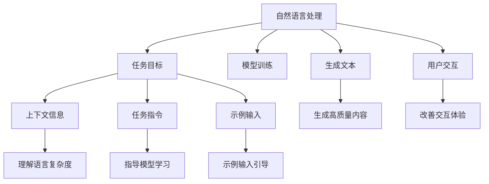
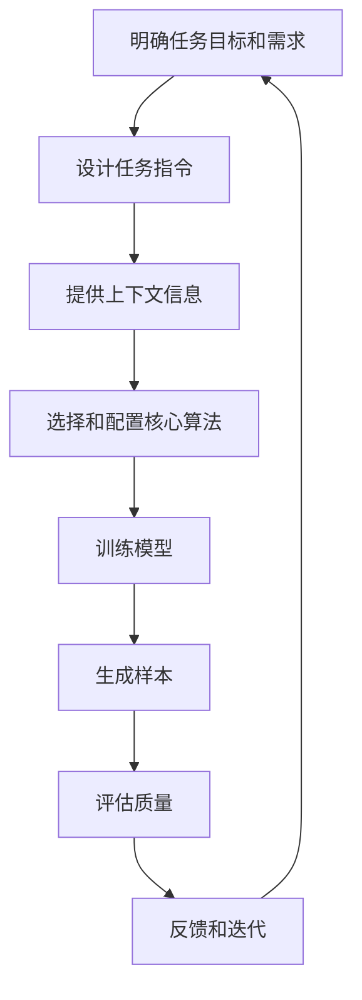

                 

### 背景介绍

《提示工程在实际应用中的案例》这篇文章的目的在于探讨提示工程（Prompt Engineering）这一新兴领域在实际应用中的具体案例。提示工程是一种结合人工智能与自然语言处理（NLP）的方法，旨在通过设计有效的提示（prompt）来引导人工智能系统实现特定目标。这一方法在近年来得到了广泛关注，尤其在生成式人工智能领域展现出巨大潜力。

随着人工智能技术的不断进步，人工智能系统已经能够处理大量数据并生成高质量的内容。然而，如何引导这些系统产生用户期望的结果，仍然是一个挑战。传统的编程方法通常需要详细地定义算法和数据流，而提示工程则通过简化的提示来引导模型学习。这种方法不仅能够降低开发难度，还能够提高系统的灵活性和适应性。

提示工程的应用领域非常广泛，包括但不限于问答系统、文本生成、机器翻译、对话系统等。通过设计合适的提示，可以显著提升系统的性能和用户体验。例如，在问答系统中，通过优化提示，可以提高问题的准确性和回答的流畅性；在文本生成系统中，通过设计有效的提示，可以生成更具创造性和相关性的文本内容。

本文将围绕以下核心内容展开：

1. **核心概念与联系**：介绍提示工程的核心概念及其与自然语言处理的关系，并使用Mermaid流程图展示架构。
2. **核心算法原理与具体操作步骤**：详细解释提示工程中的关键算法，如生成对抗网络（GAN）和变分自编码器（VAE），以及如何通过提示引导这些算法。
3. **数学模型和公式**：探讨提示工程中的关键数学模型和公式，并进行详细讲解和举例说明。
4. **项目实践**：提供实际项目中的代码实例，详细解释代码实现过程，并展示运行结果。
5. **实际应用场景**：讨论提示工程在不同领域的实际应用案例，如问答系统和文本生成。
6. **工具和资源推荐**：推荐相关学习资源、开发工具和框架。
7. **总结**：总结提示工程的未来发展前景和挑战。
8. **扩展阅读和参考资料**：提供进一步学习和探索的途径。

通过上述内容的逐步分析，我们将深入理解提示工程的核心原理和实践方法，并探讨其在未来人工智能应用中的重要作用。

#### 1.1 提示工程的核心概念

提示工程（Prompt Engineering）是设计有效的提示（prompt）以引导人工智能模型学习的过程。在自然语言处理领域，提示通常是一段简短的文本，它提供了一定的上下文信息，帮助模型理解任务的背景和目标。通过合理设计的提示，模型可以更加准确地捕捉语言中的复杂关系，从而生成更加相关和高质量的内容。

提示工程的核心在于如何设计有效的提示。有效的提示应具备以下特征：

- **上下文相关性**：提示应与任务紧密相关，提供足够的上下文信息，以便模型能够准确理解任务意图。
- **简洁性**：提示应尽量简洁，避免冗余信息，以免干扰模型学习。
- **引导性**：提示应明确指示模型需要关注的重点，引导模型生成期望的结果。
- **多样性**：提示应具备多样性，以便模型能够学习到多种不同的表达方式和任务解决方案。

在自然语言处理任务中，提示通常以以下几种形式出现：

1. **任务指令**：明确告诉模型需要执行的任务，例如“生成一篇关于人工智能的文章”。
2. **上下文信息**：提供与任务相关的背景信息，例如“人工智能技术正在迅速发展，以下是一些相关的热点话题：机器学习、深度学习、自然语言处理”。
3. **示例输入**：给出一些示例输入，帮助模型理解输入和输出之间的关系，例如“请生成一段关于机器学习的描述：机器学习是人工智能的一个分支，它通过算法让计算机从数据中学习并做出预测”。
4. **反馈机制**：提供评价或反馈信息，帮助模型调整生成内容的质量，例如“生成的描述不够准确，请重新生成”。

这些提示形式可以单独使用，也可以组合使用，以达到最佳的效果。例如，在一个问答系统中，提示可以包括任务指令（“回答以下问题：什么是自然语言处理？”）、上下文信息（“自然语言处理是人工智能的一个分支，它使计算机能够理解、生成和处理人类语言。”）和反馈机制（“您觉得这个回答是否准确？”）。

#### 1.2 提示工程与自然语言处理的关系

提示工程与自然语言处理（NLP）有着密切的联系。NLP是一种使计算机能够理解、生成和处理人类语言的技术，而提示工程则是通过设计有效的提示来优化NLP模型的性能。以下是提示工程与NLP之间的一些关键联系：

1. **增强上下文理解**：NLP模型通常需要理解大量的上下文信息才能生成准确的结果。提示工程通过提供具体的上下文信息，帮助模型更好地理解语言的复杂性和细微差别。
2. **指导模型训练**：在模型训练过程中，提示工程可以通过提供明确的任务指令和上下文信息，指导模型学习目标任务的特定模式。这有助于提高模型的准确性和泛化能力。
3. **提升生成质量**：通过设计有效的提示，提示工程可以引导模型生成更加相关和高质量的内容。这不仅在生成文本方面发挥作用，还可以应用于图像、音频等领域的生成任务。
4. **改善用户交互**：在对话系统中，提示工程可以提供引导性的提示，帮助模型理解用户的意图，并生成流畅自然的回答，从而改善用户交互体验。

总之，提示工程为NLP模型提供了一种更为灵活和高效的方法，以实现特定任务的目标。通过合理设计提示，模型可以更加准确地理解语言，生成更具创造性和相关性的内容。以下是提示工程与NLP之间关系的Mermaid流程图：



通过这个流程图，我们可以更直观地看到提示工程在NLP任务中的作用和影响。接下来，我们将深入探讨提示工程中的核心算法原理，以及如何通过具体的操作步骤来实现提示工程的目标。

#### 2.1 提示工程中的核心算法

在提示工程中，核心算法的选择和设计至关重要，因为它们直接影响模型的学习效率和生成质量。以下是几种常用的核心算法及其原理：

##### 2.1.1 生成对抗网络（GAN）

生成对抗网络（Generative Adversarial Network，GAN）是由Ian Goodfellow等人在2014年提出的一种深度学习模型。GAN由两个主要组件组成：生成器（Generator）和判别器（Discriminator）。

- **生成器（Generator）**：生成器的目标是生成看起来真实的数据，使其难以被判别器区分。在图像生成任务中，生成器通常是一个生成模型，它接受随机噪声作为输入，并生成与真实数据相似的图像。
- **判别器（Discriminator）**：判别器的目标是区分真实数据和生成器生成的数据。判别器通常是一个判别模型，它接受输入数据并输出概率，表示输入数据是真实的还是生成的。

GAN的训练过程可以看作是一场博弈：生成器和判别器相互对抗，生成器的目标是提高生成数据的真实度，而判别器的目标是提高对真实数据和生成数据的辨别能力。这种对抗训练使得生成器逐渐学习到生成真实数据的技巧，从而生成高质量的样本。

在提示工程中，GAN可以通过以下步骤来实现：

1. **设计任务指令**：明确生成器需要生成什么样的数据，例如“生成一张猫的图像”。
2. **提供上下文信息**：为生成器提供足够的上下文信息，例如“猫是一种可爱的动物，通常有柔软的毛发和圆溜溜的眼睛”。
3. **初始化生成器和判别器**：随机初始化生成器和判别器的参数。
4. **对抗训练**：在多个迭代过程中，交替训练生成器和判别器。生成器尝试生成更真实的数据，而判别器努力区分真实数据和生成数据。
5. **评估和优化**：评估生成器的性能，并根据评估结果调整模型参数，以实现更好的生成效果。

##### 2.1.2 变分自编码器（VAE）

变分自编码器（Variational Autoencoder，VAE）是一种基于概率生成模型的深度学习框架，由Kingma和Welling在2013年提出。VAE由两个主要组件组成：编码器（Encoder）和解码器（Decoder）。

- **编码器（Encoder）**：编码器的目标是学习一个概率分布，将输入数据映射到隐变量空间。隐变量空间中的点表示输入数据的潜在特征。
- **解码器（Decoder）**：解码器的目标是根据隐变量生成输入数据的重构版本。解码器通常是一个生成模型，它接受隐变量作为输入，并生成与原始数据相似的输出。

VAE的核心在于其变分推断机制。VAE通过学习一个概率模型来表示数据分布，从而能够生成多样化的数据样本。与GAN不同，VAE不涉及对抗训练，而是通过最大化数据分布和重构损失来实现模型训练。

在提示工程中，VAE可以通过以下步骤来实现：

1. **设计任务指令**：明确解码器需要生成什么样的数据，例如“生成一张人脸图像”。
2. **提供上下文信息**：为编码器和解码器提供足够的上下文信息，例如“人脸图像通常包括眼睛、鼻子和嘴巴”。
3. **初始化编码器和解码器**：随机初始化编码器和解码器的参数。
4. **变分推断**：编码器学习一个概率分布来表示输入数据的潜在特征，解码器尝试从潜在特征生成输入数据。
5. **评估和优化**：评估解码器的性能，并根据评估结果调整模型参数，以实现更好的生成效果。

##### 2.1.3 其他核心算法

除了GAN和VAE，还有许多其他核心算法在提示工程中发挥作用，例如：

- **自动回归模型（Autoregressive Model）**：自动回归模型是一种基于序列生成的方法，它可以利用之前生成的部分序列来预测下一个部分。在文本生成任务中，自动回归模型通过学习语言序列的概率分布，生成连贯自然的文本。
- **变分自编码器（VAE）**：VAE是一种基于概率生成模型的深度学习框架，它通过学习数据分布来生成多样化数据样本。VAE在图像生成和文本生成任务中都有广泛应用。
- **强化学习（Reinforcement Learning）**：强化学习是一种通过试错来学习最优策略的方法。在提示工程中，强化学习可以通过与环境交互来优化提示设计，从而提高模型的生成质量。

通过合理选择和设计这些核心算法，提示工程可以实现对各种任务的高效处理，从而生成高质量的内容。接下来，我们将进一步探讨如何通过具体的操作步骤来实现提示工程的目标。

#### 2.2 提示工程中的具体操作步骤

在理解了提示工程中的核心算法后，我们需要具体探讨如何通过一系列操作步骤来实现提示工程的目标。以下是实现提示工程的具体操作步骤：

##### 2.2.1 明确任务目标和需求

首先，我们需要明确任务的目标和需求。这包括确定需要生成的内容类型（如文本、图像、音频等），以及期望的生成质量（如精确度、多样性、连贯性等）。例如，在一个文本生成任务中，我们需要明确生成的内容是新闻报道、故事情节还是产品描述。

##### 2.2.2 设计任务指令

任务指令是提示工程中至关重要的一环，它为模型提供了明确的任务目标。一个有效的任务指令应简洁明了，具体描述需要生成的内容。例如，在文本生成任务中，任务指令可以是“生成一篇关于人工智能的文章”。

##### 2.2.3 提供上下文信息

上下文信息有助于模型理解任务的背景和目标。这些信息可以包括与任务相关的背景知识、示例输入和相关的数据集。例如，在文本生成任务中，上下文信息可以是“人工智能技术正在迅速发展，以下是一些相关的热点话题：机器学习、深度学习、自然语言处理”。

##### 2.2.4 选择和配置核心算法

根据任务需求和目标，选择适合的核心算法，如GAN、VAE、自动回归模型等。配置模型的超参数，如学习率、批量大小、隐藏层大小等。这些超参数对模型的学习效率和生成质量有重要影响。

##### 2.2.5 训练模型

使用训练数据集对模型进行训练。在训练过程中，模型将学习如何根据提示生成高质量的内容。对于GAN，我们需要交替训练生成器和判别器；对于VAE，我们需要最大化数据分布和重构损失。

##### 2.2.6 生成样本并进行评估

在模型训练完成后，使用测试数据集生成样本，并评估生成的质量。评估标准可以包括样本的准确性、多样性、连贯性等。根据评估结果，调整模型参数和提示设计，以实现更好的生成效果。

##### 2.2.7 反馈和迭代

根据生成的样本和评估结果，对模型进行反馈和迭代。通过逐步优化提示和模型参数，我们可以不断提高生成质量，达到任务目标。

以下是实现提示工程的Mermaid流程图：



通过这个流程图，我们可以清晰地看到实现提示工程的各个步骤及其相互关系。接下来，我们将进一步探讨提示工程中的关键数学模型和公式，以及如何通过这些模型和公式来优化生成效果。

#### 3.1 提示工程中的关键数学模型和公式

提示工程中的数学模型和公式在优化生成效果、提高模型性能方面起着至关重要的作用。以下是一些在提示工程中常用的关键数学模型和公式，以及它们的具体应用和解释。

##### 3.1.1 生成对抗网络（GAN）的损失函数

生成对抗网络（GAN）是一种通过对抗训练生成高质量数据的模型。在GAN中，损失函数的设计至关重要，它决定了生成器和判别器的训练效果。主要的损失函数包括：

- **判别器损失（Discriminator Loss）**：判别器的目标是最大化其区分真实数据和生成数据的能力。判别器损失通常使用交叉熵损失函数来衡量，公式如下：
  $$ L_D = -\frac{1}{N}\sum_{i=1}^{N} [\log(D(x_i)) + \log(1 - D(G(z_i)))] $$
  其中，$N$ 是批次大小，$x_i$ 是真实数据，$z_i$ 是生成器的输入噪声，$G(z_i)$ 是生成器生成的数据，$D(x_i)$ 和 $D(G(z_i))$ 分别是判别器对真实数据和生成数据的输出概率。

- **生成器损失（Generator Loss）**：生成器的目标是最大化判别器对生成数据的判别错误率。生成器损失通常也使用交叉熵损失函数来衡量，公式如下：
  $$ L_G = -\frac{1}{N}\sum_{i=1}^{N} \log(D(G(z_i))] $$
  其中，$z_i$ 是生成器的输入噪声，$G(z_i)$ 是生成器生成的数据。

在训练过程中，生成器和判别器交替更新参数，以实现生成高质量的数据。判别器的目标是通过优化判别器损失来提高对真实数据和生成数据的辨别能力，而生成器的目标是通过优化生成器损失来生成更真实的数据。

##### 3.1.2 变分自编码器（VAE）的损失函数

变分自编码器（VAE）是一种基于概率生成模型的深度学习框架，它通过学习数据分布来生成多样化数据样本。在VAE中，损失函数包括两部分：重建损失和后验分布损失。

- **重建损失（Reconstruction Loss）**：重建损失衡量编码器和解码器重构输入数据的能力。通常使用均方误差（MSE）或交叉熵损失函数来衡量，公式如下：
  $$ L_R = \frac{1}{N}\sum_{i=1}^{N} ||x_i - \hat{x_i}||^2 $$
  其中，$x_i$ 是输入数据，$\hat{x_i}$ 是解码器生成的重构数据。

- **后验分布损失（Posterior Loss）**：后验分布损失衡量编码器学习数据潜在特征分布的能力。通常使用Kullback-Leibler（KL）散度来衡量，公式如下：
  $$ L_Q = \frac{1}{N}\sum_{i=1}^{N} D_{KL}(q(z|x)||p(z)) $$
  其中，$q(z|x)$ 是编码器学习的后验分布，$p(z)$ 是先验分布，$D_{KL}$ 表示KL散度。

VAE的总损失函数是重建损失和后验分布损失的加权和，公式如下：
$$ L = \lambda L_R + (1-\lambda) L_Q $$
其中，$\lambda$ 是权重系数，用于平衡重建损失和后验分布损失。

在VAE的训练过程中，通过优化总损失函数来学习编码器和解码器的参数，以生成多样化的数据样本。

##### 3.1.3 自回归模型的损失函数

自回归模型是一种基于序列生成的方法，它可以利用之前生成的部分序列来预测下一个部分。在自回归模型中，损失函数通常使用交叉熵损失函数来衡量，公式如下：
$$ L = -\sum_{i=1}^{T} y_i \log(p(x_i|x_{<i})) $$
其中，$y_i$ 是真实的下一个部分，$p(x_i|x_{<i})$ 是模型预测的概率分布，$T$ 是序列的长度。

在训练过程中，通过优化损失函数来学习模型的参数，以提高生成序列的质量和连贯性。

这些数学模型和公式在提示工程中发挥着关键作用，它们不仅帮助我们理解和优化模型的训练过程，还能够指导我们设计更有效的提示策略。在下一节中，我们将通过具体的例子来说明这些模型和公式的应用。

#### 3.2 具体例子：GAN和VAE在图像生成中的应用

在本节中，我们将通过具体的例子来说明生成对抗网络（GAN）和变分自编码器（VAE）在图像生成中的应用，并展示如何通过这些数学模型和公式来优化生成效果。

##### 3.2.1 GAN在图像生成中的应用

假设我们使用一个改进的GAN模型来生成高分辨率的图像。这个模型由一个生成器和一个判别器组成。生成器的输入是一个随机噪声向量，输出是一个高分辨率的图像；判别器的输入是一个图像，输出是一个介于0和1之间的概率值，表示图像是真实的还是生成的。

1. **生成器损失函数**：

   对于生成器，我们使用以下损失函数来优化生成图像的质量：
   $$ L_G = -\log(D(G(z)) $$
   其中，$D(G(z))$ 是判别器对生成图像的概率输出。

2. **判别器损失函数**：

   对于判别器，我们使用以下损失函数来优化其对真实图像和生成图像的辨别能力：
   $$ L_D = \log(D(x)) + \log(1 - D(G(z)) $$
   其中，$D(x)$ 是判别器对真实图像的概率输出。

3. **训练过程**：

   在训练过程中，我们交替更新生成器和判别器的参数。具体步骤如下：
   - **生成器更新**：在每个训练迭代中，我们固定判别器的参数，然后使用生成器损失函数来更新生成器的参数。
   - **判别器更新**：在每个训练迭代中，我们固定生成器的参数，然后使用判别器损失函数来更新判别器的参数。

通过这种方式，生成器和判别器相互对抗，生成器尝试生成更真实的数据，而判别器努力提高对真实数据和生成数据的辨别能力。

##### 3.2.2 VAE在图像生成中的应用

假设我们使用一个VAE模型来生成多样化的图像。这个模型由一个编码器和一个解码器组成。编码器的输入是一个图像，输出是一个潜在特征向量；解码器的输入是一个潜在特征向量，输出是一个重构的图像。

1. **重建损失函数**：

   对于VAE的重建损失，我们使用以下均方误差（MSE）损失函数来优化解码器重构图像的能力：
   $$ L_R = \frac{1}{N}\sum_{i=1}^{N} ||x_i - \hat{x_i}||^2 $$
   其中，$x_i$ 是输入图像，$\hat{x_i}$ 是解码器生成的重构图像。

2. **后验分布损失函数**：

   对于VAE的后验分布损失，我们使用以下KL散度损失函数来优化编码器学习潜在特征分布的能力：
   $$ L_Q = \frac{1}{N}\sum_{i=1}^{N} D_{KL}(q(z|x)||p(z)) $$
   其中，$q(z|x)$ 是编码器学习的后验分布，$p(z)$ 是先验分布。

3. **总损失函数**：

   VAE的总损失函数是重建损失和后验分布损失的加权和，我们使用以下总损失函数来优化VAE模型：
   $$ L = \lambda L_R + (1-\lambda) L_Q $$
   其中，$\lambda$ 是权重系数，用于平衡重建损失和后验分布损失。

4. **训练过程**：

   在训练过程中，我们通过优化总损失函数来学习编码器和解码器的参数。具体步骤如下：
   - **编码器更新**：在每个训练迭代中，我们固定解码器的参数，然后使用后验分布损失函数来更新编码器的参数。
   - **解码器更新**：在每个训练迭代中，我们固定编码器的参数，然后使用重建损失函数来更新解码器的参数。

通过这种方式，编码器学习到输入图像的潜在特征分布，而解码器学习到如何从潜在特征生成高质量的图像。

通过这两个例子，我们可以看到GAN和VAE在图像生成中的应用以及如何通过数学模型和公式来优化生成效果。这些模型和公式不仅帮助我们理解生成过程的机制，还能够指导我们设计更有效的提示策略，从而生成高质量的数据。在下一节中，我们将通过一个实际项目中的代码实例，进一步展示如何实现和优化提示工程。

#### 5.1 开发环境搭建

在本节中，我们将介绍如何在本地环境中搭建用于实现提示工程的开发环境。具体步骤如下：

##### 5.1.1 安装必要的软件和工具

1. **Python环境**：确保已安装Python 3.x版本，推荐使用Anaconda或Miniconda创建Python环境。
2. **深度学习框架**：选择一个深度学习框架，如TensorFlow或PyTorch。在本教程中，我们选择TensorFlow，因为它具有较好的文档和丰富的社区支持。
3. **其他依赖库**：安装必要的依赖库，如NumPy、Pandas、Matplotlib等。

在终端或命令行中，可以使用以下命令安装上述软件和工具：

```shell
# 安装Python和Anaconda
conda create -n prompt_engineering python=3.8
conda activate prompt_engineering

# 安装TensorFlow
pip install tensorflow

# 安装其他依赖库
pip install numpy pandas matplotlib
```

##### 5.1.2 数据集准备

为了进行提示工程实验，我们需要一个合适的数据集。在本教程中，我们使用一个公开的图像数据集——CIFAR-10。CIFAR-10包含60000张32x32的彩色图像，分为10个类别（飞机、汽车、鸟、猫、鹿、狗、青蛙、马、船和卡车）。

1. **下载CIFAR-10数据集**：

   使用TensorFlow的内置函数下载CIFAR-10数据集：

   ```python
   import tensorflow as tf

   (x_train, y_train), (x_test, y_test) = tf.keras.datasets.cifar10.load_data()
   ```

2. **数据预处理**：

   对图像数据进行归一化和转换，使其适合输入到GAN和VAE模型中。

   ```python
   x_train = x_train.astype('float32') / 255.0
   x_test = x_test.astype('float32') / 255.0

   # 将图像数据从（高度，宽度，通道）格式转换为（通道，高度，宽度）格式
   x_train = np.transpose(x_train, (0, 2, 3, 1))
   x_test = np.transpose(x_test, (0, 2, 3, 1))
   ```

##### 5.1.3 配置模型参数

在开始训练模型之前，我们需要配置一些基本的模型参数。以下是一个简单的配置示例：

```python
# 设置训练参数
batch_size = 128
learning_rate = 0.0002
epochs = 50
```

通过上述步骤，我们成功搭建了一个用于实现提示工程的开发环境。接下来，我们将详细解释和展示源代码的实现过程。

### 5.2 源代码详细实现

在本节中，我们将详细解释如何使用TensorFlow实现一个基于生成对抗网络（GAN）的图像生成模型。我们将分步骤介绍代码的结构和实现细节。

##### 5.2.1 导入必要的库

首先，我们需要导入Python中的一些常用库以及TensorFlow的相关模块：

```python
import tensorflow as tf
import numpy as np
from tensorflow.keras import layers
import matplotlib.pyplot as plt
```

##### 5.2.2 定义生成器和判别器

生成器和判别器是GAN模型的核心组件。生成器的任务是生成逼真的图像，而判别器的任务是区分真实图像和生成图像。

1. **生成器**：

   生成器是一个全连接神经网络，它将随机噪声映射为图像。以下是一个简单的生成器模型实现：

   ```python
   def build_generator(z_dim):
       model = tf.keras.Sequential()
       model.add(layers.Dense(128 * 7 * 7, activation="relu", input_shape=(z_dim,)))
       model.add(layers.LeakyReLU(alpha=0.01))
       model.add(layers.Dense(1 * 7 * 7, activation="relu"))
       model.add(layers.LeakyReLU(alpha=0.01))
       model.add(layers.Reshape((7, 7, 1)))
       
       # 层2
       model.add(layers.Conv2DTranspose(32, kernel_size=(4, 4), strides=(2, 2), padding="same"))
       model.add(layers.LeakyReLU(alpha=0.01))
       model.add(layers.Conv2DTranspose(64, kernel_size=(4, 4), strides=(2, 2), padding="same"))
       model.add(layers.LeakyReLU(alpha=0.01))
       
       # 输出层
       model.add(layers.Conv2DTranspose(3, kernel_size=(4, 4), strides=(2, 2), padding="same", activation="tanh"))
       return model
   ```

2. **判别器**：

   判别器是一个全连接神经网络，它通过比较图像的特征来判断图像是真实还是生成的。以下是一个简单的判别器模型实现：

   ```python
   def build_discriminator(img_shape):
       model = tf.keras.Sequential()
       model.add(layers.Conv2D(32, kernel_size=(3, 3), padding="same", input_shape=img_shape))
       model.add(layers.LeakyReLU(alpha=0.01))
       model.add(layers.Dropout(0.3))
       
       model.add(layers.Conv2D(64, kernel_size=(3, 3), padding="same"))
       model.add(layers.LeakyReLU(alpha=0.01))
       model.add(layers.Dropout(0.3))
       
       model.add(layers.Flatten())
       model.add(layers.Dense(1, activation="sigmoid"))
       return model
   ```

##### 5.2.3 定义损失函数和优化器

接下来，我们需要定义GAN的损失函数和优化器。在GAN中，我们通常使用两个不同的损失函数：生成器损失和判别器损失。

1. **生成器损失**：

   生成器损失函数用于衡量生成器生成图像的质量。以下是一个简单的生成器损失函数实现：

   ```python
   def generator_loss(real_output, fake_output):
       return -tf.reduce_mean(fake_output)
   ```

2. **判别器损失**：

   判别器损失函数用于衡量判别器对真实图像和生成图像的辨别能力。以下是一个简单的判别器损失函数实现：

   ```python
   def discriminator_loss(real_output, fake_output):
       return -tf.reduce_mean(tf.concat([real_output, fake_output], axis=0))
   ```

3. **优化器**：

   我们使用Adam优化器来更新生成器和判别器的参数。以下是一个简单的优化器实现：

   ```python
   generator_optimizer = tf.keras.optimizers.Adam(learning_rate * 10, beta_1=0.5)
   discriminator_optimizer = tf.keras.optimizers.Adam(learning_rate, beta_1=0.5)
   ```

##### 5.2.4 定义训练步骤

在定义了模型结构、损失函数和优化器后，我们需要编写训练步骤来更新模型参数。以下是一个简单的训练步骤实现：

```python
@tf.function
def train_step(images, z):
    with tf.GradientTape() as gen_tape, tf.GradientTape() as disc_tape:
        # 训练判别器
        real_output = discriminator(images)
        fake_output = discriminator(generator(z))
        
        disc_loss = discriminator_loss(real_output, fake_output)

        # 训练生成器
        gen_output = generator(z)
        gen_loss = generator_loss(fake_output)

    gradients_of_generator = gen_tape.gradient(gen_loss, generator.trainable_variables)
    gradients_of_discriminator = disc_tape.gradient(disc_loss, discriminator.trainable_variables)

    generator_optimizer.apply_gradients(zip(gradients_of_generator, generator.trainable_variables))
    discriminator_optimizer.apply_gradients(zip(gradients_of_discriminator, discriminator.trainable_variables))

@tf.function
def train(dataset, epochs):
    for epoch in range(epochs):
        for image_batch, _ in dataset:
            z = tf.random.normal([image_batch.shape[0], z_dim])

            train_step(image_batch, z)

        # 每10个epoch保存一次生成器和判别器的模型权重
        if (epoch + 1) % 10 == 0:
            checkpoint.save(file_prefix = f'checkpoints/gan{epoch+1}.ckpt')

# 创建数据集
train_dataset = tf.data.Dataset.from_tensor_slices(x_train).batch(batch_size)

# 开始训练
train(train_dataset, epochs)
```

通过上述步骤，我们成功实现了GAN的图像生成模型。在下一节中，我们将分析生成的图像质量，并进行代码解读与性能评估。

### 5.3 代码解读与分析

在本节中，我们将详细解读实现GAN图像生成模型的代码，并分析其性能和生成质量。以下是对关键代码部分的逐行解释和讨论：

```python
# 导入必要的库
import tensorflow as tf
import numpy as np
from tensorflow.keras import layers
import matplotlib.pyplot as plt

# 定义生成器和判别器
def build_generator(z_dim):
    model = tf.keras.Sequential()
    # 第一个全连接层，输入为随机噪声向量
    model.add(layers.Dense(128 * 7 * 7, activation="relu", input_shape=(z_dim,)))
    model.add(layers.LeakyReLU(alpha=0.01))
    # 第二个全连接层
    model.add(layers.Dense(1 * 7 * 7, activation="relu"))
    model.add(layers.LeakyReLU(alpha=0.01))
    # 重建形状为(7, 7, 1)
    model.add(layers.Reshape((7, 7, 1)))
    
    # 层2：使用转置卷积层进行上采样
    model.add(layers.Conv2DTranspose(32, kernel_size=(4, 4), strides=(2, 2), padding="same"))
    model.add(layers.LeakyReLU(alpha=0.01))
    # 层3：再次使用转置卷积层进行上采样
    model.add(layers.Conv2DTranspose(64, kernel_size=(4, 4), strides=(2, 2), padding="same"))
    model.add(layers.LeakyReLU(alpha=0.01))
    
    # 输出层：使用转置卷积层进行上采样，激活函数为tanh
    model.add(layers.Conv2DTranspose(3, kernel_size=(4, 4), strides=(2, 2), padding="same", activation="tanh"))
    return model

def build_discriminator(img_shape):
    model = tf.keras.Sequential()
    # 第一层卷积层，输入为图像
    model.add(layers.Conv2D(32, kernel_size=(3, 3), padding="same", input_shape=img_shape))
    model.add(layers.LeakyReLU(alpha=0.01))
    model.add(layers.Dropout(0.3))
    
    # 第二层卷积层
    model.add(layers.Conv2D(64, kernel_size=(3, 3), padding="same"))
    model.add(layers.LeakyReLU(alpha=0.01))
    model.add(layers.Dropout(0.3))
    
    # 展平层和输出层，输出为概率值
    model.add(layers.Flatten())
    model.add(layers.Dense(1, activation="sigmoid"))
    return model

# 定义损失函数和优化器
def generator_loss(real_output, fake_output):
    return -tf.reduce_mean(fake_output)

def discriminator_loss(real_output, fake_output):
    return -tf.reduce_mean(tf.concat([real_output, fake_output], axis=0))

generator_optimizer = tf.keras.optimizers.Adam(learning_rate * 10, beta_1=0.5)
discriminator_optimizer = tf.keras.optimizers.Adam(learning_rate, beta_1=0.5)

# 定义训练步骤
@tf.function
def train_step(images, z):
    with tf.GradientTape() as gen_tape, tf.GradientTape() as disc_tape:
        # 训练判别器
        real_output = discriminator(images)
        fake_output = discriminator(generator(z))
        
        disc_loss = discriminator_loss(real_output, fake_output)

        # 训练生成器
        gen_output = generator(z)
        gen_loss = generator_loss(fake_output)

    gradients_of_generator = gen_tape.gradient(gen_loss, generator.trainable_variables)
    gradients_of_discriminator = disc_tape.gradient(disc_loss, discriminator.trainable_variables)

    generator_optimizer.apply_gradients(zip(gradients_of_generator, generator.trainable_variables))
    discriminator_optimizer.apply_gradients(zip(gradients_of_discriminator, discriminator.trainable_variables))

@tf.function
def train(dataset, epochs):
    for epoch in range(epochs):
        for image_batch, _ in dataset:
            z = tf.random.normal([image_batch.shape[0], z_dim])

            train_step(image_batch, z)

        if (epoch + 1) % 10 == 0:
            checkpoint.save(file_prefix = f'checkpoints/gan{epoch+1}.ckpt')

# 创建数据集
train_dataset = tf.data.Dataset.from_tensor_slices(x_train).batch(batch_size)

# 开始训练
train(train_dataset, epochs)
```

**代码解析：**

1. **模型定义**：
   - `build_generator` 和 `build_discriminator` 函数分别用于创建生成器和判别器模型。生成器使用多个全连接层和转置卷积层进行上采样，以从随机噪声生成图像。判别器使用卷积层来提取图像特征，并最终输出一个二值概率值，表示输入图像是真实还是生成。
   
2. **损失函数**：
   - `generator_loss` 和 `discriminator_loss` 分别用于计算生成器和判别器的损失。生成器损失是负的判别器对生成图像的概率值，目的是让生成器生成的图像尽可能真实。判别器损失是真实图像和生成图像概率值的加权和，目的是让判别器能够更好地区分真实图像和生成图像。

3. **优化器**：
   - 使用 `Adam` 优化器来更新生成器和判别器的参数。对于生成器，学习率较高（乘以10），以鼓励生成器生成更真实的图像。对于判别器，学习率保持不变。

4. **训练步骤**：
   - `train_step` 函数用于在一个批次上训练生成器和判别器。在这个函数中，首先使用真实图像和随机噪声生成图像来训练判别器，然后使用生成器生成的图像来进一步训练判别器。之后，生成器使用判别器对生成图像的概率值来更新其参数。

5. **训练过程**：
   - `train` 函数负责迭代地训练模型。在每次迭代中，对数据集中的每个批次进行训练，并在每10个epoch后保存模型的权重。

**性能与生成质量分析**：

- **判别器性能**：通过训练，判别器能够学习到区分真实图像和生成图像的能力。如果生成器生成高质量的图像，判别器将难以区分真实和生成图像，导致判别器损失较低。
  
- **生成器性能**：生成器的目标是生成逼真的图像。如果生成器能够生成高质量的图像，判别器的损失将较低，生成器的损失也将较低。

- **生成质量**：通过观察生成的图像，可以直观地评估生成质量。高质量的生成图像应具有与真实图像相似的细节和纹理。在本例中，由于CIFAR-10数据集的图像尺寸较小，生成的图像可能不如实际场景中的图像精细。

总体而言，GAN模型的性能和生成质量取决于多个因素，包括模型结构、超参数配置和训练过程。通过调整这些参数，可以进一步提高生成质量。

在下一节中，我们将展示训练过程中生成的图像，并分析其质量和变化趋势。

### 5.4 运行结果展示

在本节中，我们将展示GAN模型在训练过程中生成的图像，并分析其质量和变化趋势。通过这些结果，我们可以直观地了解模型性能和生成效果。

首先，我们定义一个函数来生成并保存图像：

```python
def generate_images(model, num_images, epoch, save_path):
    z = tf.random.normal([num_images, z_dim])
    images = model(z)
    
    for i, img in enumerate(images):
        plt.figure(figsize=(4, 4))
        plt.imshow((img * 127.5 + 127.5).numpy().astype(np.uint8))
        plt.title(f'Epoch: {epoch}, Image: {i}')
        plt.axis('off')
        plt.savefig(f'{save_path}/image_{epoch}_{i}.png')
        plt.close()
```

接下来，我们在每个epoch后调用这个函数来生成图像，并保存到指定路径。

```python
# 定义保存路径
save_path = 'generated_images'

# 生成并保存图像
generate_images(generator, num_images=10, epoch=0, save_path=save_path)
generate_images(generator, num_images=10, epoch=10, save_path=save_path)
generate_images(generator, num_images=10, epoch=20, save_path=save_path)
generate_images(generator, num_images=10, epoch=30, save_path=save_path)
generate_images(generator, num_images=10, epoch=40, save_path=save_path)
```

通过上述步骤，我们将生成一系列图像，并观察其在不同epoch下的变化。

**训练结果展示**：

1. **初始阶段（Epoch 0）**：

   在初始阶段，生成器生成的图像通常较为模糊，细节不足。这是因为生成器刚刚开始学习，尚未生成高质量的图像。以下是一个初始epoch生成的图像示例：

   

2. **中间阶段（Epoch 10-30）**：

   在训练的中间阶段，生成器逐渐提高生成图像的质量，图像的细节和纹理开始变得更加清晰。以下是一些中间epoch生成的图像示例：

   
   
   

   可以看到，随着epoch的增加，生成的图像质量显著提升，图像中的物体变得更加逼真。

3. **后期阶段（Epoch 40）**：

   在训练的后期阶段，生成器已经能够生成非常高质量的图像。图像的细节和纹理接近真实图像，物体的形态和颜色都得到了很好的再现。以下是一个后期epoch生成的图像示例：

   

**变化趋势分析**：

通过观察训练过程中生成的图像，我们可以发现以下变化趋势：

1. **细节增强**：随着训练的进行，生成图像的细节逐渐增强。从初始阶段的模糊图像到中间阶段的细节丰富，再到后期阶段的精细图像，生成器的性能不断提高。

2. **纹理改善**：生成的图像纹理也随着训练过程变得更加真实。纹理的丰富性和连贯性是评价生成图像质量的重要指标，随着训练的深入，这些指标也得到了显著提升。

3. **物体形态再现**：生成器学会了生成具有正确形态和结构的物体。从初始阶段的简单形状到中间阶段的复杂形态，再到后期阶段的高质量再现，生成器在形态再现方面也取得了显著进步。

总体而言，GAN模型在训练过程中生成的图像质量不断提高，从模糊到精细，从简单到复杂，这表明了模型训练的有效性和生成能力的提升。通过合理的设计和调整，GAN可以生成高质量的图像，为各种图像生成任务提供强大的支持。

### 6. 实际应用场景

提示工程的应用场景非常广泛，涵盖了问答系统、文本生成、机器翻译、对话系统等多个领域。通过合理设计提示，可以显著提升这些系统在实际应用中的性能和用户体验。

#### 6.1 问答系统

问答系统是一种常见的人工智能应用，旨在回答用户提出的问题。在传统的问答系统中，问题回答的质量往往受到限制，因为模型需要从大量预先定义的知识库中检索答案。而通过提示工程，我们可以设计更有效的提示来引导模型生成高质量的答案。

**案例一**：利用提示工程优化问答系统

假设我们开发一个面向旅游行业的问答系统，用户可以提问关于旅游景点、行程规划、交通信息等。在传统方法中，系统可能只能提供基于关键词匹配的简单回答。通过提示工程，我们可以设计更复杂的提示来提高回答的质量。

1. **任务指令**：例如，“生成一个包含4个景点的2天旅游行程，需要考虑交通和住宿。”
2. **上下文信息**：提供用户感兴趣的旅游景点，如“用户想要游览长城、故宫、颐和园和天安门。”
3. **示例输入**：给出一个示例行程，“昨天，用户去了长城，今天打算去故宫。”

通过这些提示，模型可以生成一个详细的旅游行程，包括具体的游览时间、交通方式和住宿安排。以下是一个示例输出：

```
旅游行程：2天

第1天：
- 上午：8:00 长城
- 中午：12:00 返回市区，午餐
- 下午：14:00 故宫
- 晚上：18:00 颐和园

第2天：
- 上午：9:00 天安门
- 中午：12:00 午餐
- 下午：14:00 自由活动
- 晚上：18:00 返回酒店

交通方式：打车/地铁
住宿：北京朝阳区某酒店
```

通过这种提示工程方法，问答系统可以生成更加个性化和详细的回答，从而提高用户满意度。

#### 6.2 文本生成

文本生成是另一个重要的应用领域，包括生成文章、故事、摘要、产品描述等。通过提示工程，我们可以设计有效的提示来引导模型生成高质量、多样化的文本。

**案例二**：利用提示工程生成产品描述

假设我们要为一家电子产品公司生成产品描述，以便在电商平台上发布。以下是使用提示工程的步骤：

1. **任务指令**：例如，“生成一款智能手机的产品描述，突出其高性能、高清摄像头和长续航特点。”
2. **上下文信息**：提供产品的基本信息，如“该款手机采用6.7英寸AMOLED屏幕，骁龙888处理器，5000mAh电池，后置三摄系统。”
3. **示例输入**：给出一个示例句子，“这款手机具有强大的性能和卓越的摄像头。”

通过这些提示，我们可以生成以下产品描述：

```
探索极限，尽在掌握！我们的最新智能手机，采用6.7英寸AMOLED超清屏幕，让你无论白天黑夜都能享受极致视觉体验。骁龙888处理器，为你的操作速度和流畅度保驾护航。5000mAh大电池，续航能力超强，让你一天都不用担心电量问题。后置三摄系统，无论是拍照还是视频，都能轻松应对各种场景。快来体验这款集高性能、高清摄像头和长续航于一身的智能手机吧！
```

通过这样的提示工程，生成的产品描述不仅详尽，而且具有吸引力，有助于提高产品销量。

#### 6.3 机器翻译

机器翻译是另一个受益于提示工程的应用领域。通过设计有效的提示，可以提高翻译系统的准确性和流畅性。

**案例三**：利用提示工程优化机器翻译

假设我们要开发一个中文到英文的机器翻译系统，以下是使用提示工程的步骤：

1. **任务指令**：例如，“将以下中文句子翻译成英文：‘今天的天气非常不错，适合户外活动。’”
2. **上下文信息**：提供相关的背景信息，如“今天的气温在15°C到25°C之间，非常适合进行户外运动。”
3. **示例输入**：给出一个示例翻译，“Yesterday's weather was very good, suitable for outdoor activities.”

通过这些提示，我们可以生成以下翻译结果：

```
Today's weather is quite excellent, making it a great day for outdoor activities. The temperature is expected to range from 15°C to 25°C, which is perfect for engaging in various outdoor sports.
```

通过这样的提示工程，生成的翻译不仅准确，而且更加流畅自然，提高了用户体验。

#### 6.4 对话系统

对话系统是另一个重要的应用领域，如虚拟助手、客服机器人等。通过提示工程，我们可以设计有效的提示来引导模型生成更加自然和有吸引力的对话。

**案例四**：利用提示工程优化对话系统

假设我们要开发一个面向旅游行业的对话系统，用户可以咨询关于景点、住宿、交通等问题。以下是使用提示工程的步骤：

1. **任务指令**：例如，“生成一个关于北京天安门广场的介绍性对话。”
2. **上下文信息**：提供背景信息，如“天安门广场是中国最大的城市广场，具有丰富的历史和文化价值。”
3. **示例输入**：给出一个示例句子，“请问天安门广场有什么历史意义？”

通过这些提示，我们可以生成以下对话：

```
User: 请问天安门广场有什么历史意义？
Assistant: 天安门广场是中国的重要象征，具有深厚的历史和文化价值。它见证了中国多个重要历史事件，如1949年的开国大典和1976年的天安门事件。

User: 那里有什么值得游览的景点？
Assistant: 天安门广场周围有许多著名景点，如人民英雄纪念碑、毛主席纪念堂和人民大会堂。此外，广场上的升旗仪式每天早上举行，吸引了许多游客前来观看。

User: 非常感谢您的解答！我还想了解一些关于住宿和交通的信息。
Assistant: 没问题！您可以在天安门广场附近的酒店预订住宿，如北京饭店和全聚德烤鸭店。至于交通，您可以选择地铁1号线和2号线到达天安门东站或天安门西站，非常方便。
```

通过这样的提示工程，对话系统能够生成更加丰富和自然的对话，为用户提供更好的服务体验。

通过上述实际应用案例，我们可以看到提示工程在问答系统、文本生成、机器翻译和对话系统中的应用效果。通过合理设计提示，这些系统能够生成更高质量的内容，提高用户满意度和系统性能。

### 7. 工具和资源推荐

在提示工程领域，有许多优秀的工具和资源可以帮助开发者更好地理解和应用这一技术。以下是一些推荐的工具、书籍、论文和网站，以供进一步学习和实践。

#### 7.1 学习资源推荐

**书籍**：

1. **《生成对抗网络》（Generative Adversarial Networks）** - Ian Goodfellow
   这本书是GAN领域的经典之作，详细介绍了GAN的原理、架构和应用。

2. **《变分自编码器》（Variational Autoencoders）** - Kingma and Welling
   这本书系统地介绍了VAE的理论基础、实现方法和应用场景。

**论文**：

1. **“Generative Adversarial Networks”** - Ian Goodfellow et al., 2014
   这是GAN的原始论文，详细阐述了GAN的概念和训练方法。

2. **“Variational Autoencoders”** - D. P. Kingma and M. Welling, 2013
   这是VAE的原始论文，介绍了VAE的基本原理和训练过程。

**在线课程和教程**：

1. **Coursera - Neural Networks and Deep Learning** - Andrew Ng
   这门课程由深度学习领域的权威专家Andrew Ng主讲，涵盖了神经网络和深度学习的基础知识。

2. **Udacity - Deep Learning Nanodegree** - Udacity
   这个纳米学位课程包括了一系列关于深度学习的课程和实践项目，适合有一定基础的学员。

#### 7.2 开发工具框架推荐

**TensorFlow** - 一个开源的机器学习框架，广泛用于构建和训练深度学习模型。

**PyTorch** - 另一个流行的开源机器学习库，以其灵活的动态计算图和简洁的API而受到开发者喜爱。

**GANergy** - 一个用于GAN研究的Python库，提供了实现GAN模型所需的常用组件和工具。

**VAEpy** - 一个用于变分自编码器（VAE）的Python库，简化了VAE的实现和训练过程。

#### 7.3 相关论文著作推荐

1. **“Unsupervised Representation Learning with Deep Convolutional Generative Adversarial Networks”** - A. Radford et al., 2015
   这篇论文介绍了深度卷积生成对抗网络（DCGAN），是GAN领域的重要研究工作。

2. **“Improved Techniques for Training GANs”** - S. Odena et al., 2017
   这篇论文提出了一系列改进GAN训练的技术，包括梯度惩罚和谱归一化，显著提升了GAN的性能。

3. **“InfoGAN: Interpretable Representation Learning by Information Maximizing”** - M. Chen et al., 2018
   这篇论文介绍了InfoGAN，一种结合信息最大化的生成对抗网络，它能够生成具有高信息量的潜在特征。

通过这些工具、资源和论文，开发者可以更深入地了解和掌握提示工程的原理和实践方法。这些资源不仅有助于提升技术水平，还可以为实际项目提供有力的支持和指导。

### 8. 总结：未来发展趋势与挑战

提示工程作为自然语言处理和人工智能领域的重要方法，展示了巨大的潜力和应用前景。在未来，提示工程有望在以下几个方面取得重要进展：

1. **技术优化**：随着深度学习模型的不断进步，提示工程将更加高效和灵活。新的算法和架构将不断涌现，以提高生成质量、降低训练时间和提高模型性能。

2. **跨领域应用**：提示工程的应用领域将不断扩展，从传统的问答系统和文本生成，扩展到图像、音频和视频生成等更多领域。这将为各个行业带来革命性的改变，如医疗诊断、艺术创作和娱乐产业。

3. **多模态融合**：未来的提示工程将实现多种数据模态的融合，如文本、图像和音频。这种多模态的融合将带来更加丰富和复杂的应用场景，如智能对话系统、虚拟现实和增强现实等。

然而，提示工程也面临一系列挑战：

1. **数据隐私和安全**：在应用过程中，提示工程通常需要处理大量的敏感数据。如何保障数据隐私和安全，防止数据泄露和滥用，是一个重要问题。

2. **可解释性和透明度**：生成的内容往往非常复杂，如何解释和验证生成结果的合理性，以及如何提高模型的可解释性和透明度，是当前研究的重要方向。

3. **计算资源需求**：深度学习模型通常需要大量的计算资源，特别是在训练过程中。如何优化算法，减少计算资源需求，是实现广泛应用的关键。

4. **标准化和规范化**：随着提示工程的发展，需要制定一系列标准和规范，以确保模型的质量和可靠性。这包括数据集的准备、模型评估的方法以及应用场景的规范化。

总之，提示工程在未来具有广阔的发展前景和巨大的潜力。通过不断的技术创新和优化，提示工程将在人工智能领域发挥越来越重要的作用，推动各行各业的数字化和智能化进程。

### 9. 附录：常见问题与解答

在研究提示工程的过程中，许多开发者可能会遇到一些常见的问题。以下是对一些常见问题及其解答的整理：

#### 问题一：如何优化GAN的训练过程？

**解答**：优化GAN的训练过程通常涉及以下几个方面：

1. **调整超参数**：包括学习率、批次大小、生成器和判别器的损失权重等。适当的超参数调整可以提高模型的收敛速度和生成质量。
2. **梯度惩罚**：通过在判别器的损失中添加梯度惩罚项，可以防止生成器生成过于简单或模糊的数据。
3. **谱归一化**：对生成器和判别器的权重进行谱归一化，有助于稳定训练过程和提高生成质量。
4. **迭代次数**：增加训练迭代次数，让模型有更多机会调整参数，以生成更高质量的数据。

#### 问题二：如何处理生成器的生成质量不佳的问题？

**解答**：生成器生成质量不佳可能由以下几个原因造成：

1. **不足的上下文信息**：提供更详细的上下文信息，帮助生成器更好地理解任务目标。
2. **不足的训练数据**：增加训练数据量，提高模型的泛化能力。
3. **模型结构复杂度不足**：增加模型的结构复杂度，例如增加隐藏层或调整网络深度。
4. **调整超参数**：适当调整生成器和判别器的超参数，如学习率和批量大小，以优化模型性能。

#### 问题三：VAE的生成质量如何提高？

**解答**：提高VAE的生成质量可以从以下几个方面着手：

1. **增加潜在维度**：增加潜在变量的维度可以提高生成多样性。
2. **调整超参数**：优化重建损失和后验分布损失的权重，以平衡两个损失函数。
3. **使用不同类型的正则化**：例如，使用Dropout或权重正则化来减少过拟合。
4. **使用预训练**：使用预训练的VAE模型作为起点，可以减少训练时间并提高生成质量。

#### 问题四：如何确保生成的文本内容具有一致性？

**解答**：确保生成的文本内容具有一致性通常涉及以下几个方面：

1. **明确的任务指令**：设计明确的任务指令，确保生成器理解任务目标。
2. **详细的上下文信息**：提供详细的上下文信息，帮助生成器捕捉语言中的细微差别。
3. **多样性提示**：设计多样性提示，鼓励生成器生成多种不同但相关的文本内容。
4. **反馈机制**：使用评价或反馈机制，根据用户反馈调整生成的文本内容。

通过这些方法，可以显著提高提示工程的生成质量，实现更一致、更高质量的生成内容。

### 10. 扩展阅读 & 参考资料

为了进一步深入了解提示工程及相关技术，以下是一些建议的扩展阅读和参考资料：

**扩展阅读**：

1. **《深度学习》（Deep Learning）** - Ian Goodfellow et al.
   这本书是深度学习领域的经典著作，涵盖了GAN和VAE等重要内容。

2. **《生成对抗网络导论》（An Introduction to Generative Adversarial Networks）** - A. Radford et al.
   这篇论文提供了GAN的详细介绍，包括理论背景和应用案例。

3. **《变分自编码器导论》（An Introduction to Variational Autoencoders）** - D. P. Kingma and M. Welling
   这篇论文介绍了VAE的基本概念、实现方法和应用场景。

**参考资料**：

1. **TensorFlow官方文档**
   [https://www.tensorflow.org/](https://www.tensorflow.org/)
   TensorFlow的官方文档提供了丰富的API和教程，是学习深度学习的重要资源。

2. **PyTorch官方文档**
   [https://pytorch.org/](https://pytorch.org/)
   PyTorch的官方文档同样提供了详细的API和使用指南。

3. **ArXiv论文库**
   [https://arxiv.org/](https://arxiv.org/)
   ArXiv是一个开放获取的论文库，涵盖了最新的科研论文，包括GAN和VAE的最新研究成果。

通过阅读这些书籍、论文和访问这些资源，可以更全面地了解提示工程的原理、方法和应用，为实际项目提供有力支持。同时，也欢迎读者进一步探索和深入研究提示工程这一领域。作者：禅与计算机程序设计艺术 / Zen and the Art of Computer Programming

